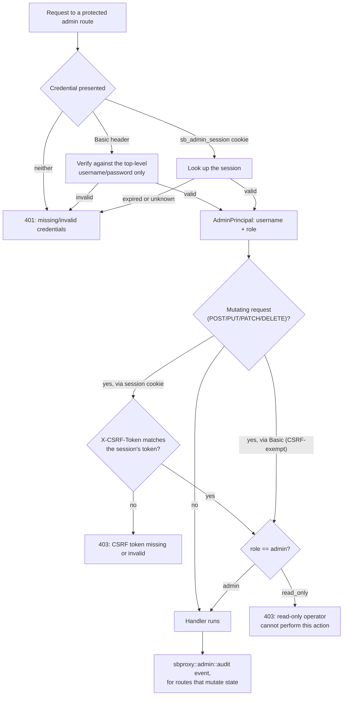

# Admin API guide

*Last modified: 2026-08-20*

This is the task-oriented "how do I call it" guide to the embedded admin
server: enabling it, authenticating, and a curl cookbook for the routes
operators reach for most. For the exhaustive per-route schema (every
field, every status code), see [admin-api-reference.md](admin-api-reference.md).
For the built-in dashboard that sits on top of this API, see
[admin-ui.md](admin-ui.md). For enabling, TLS, and the security posture,
see [admin.md](admin.md). For a runnable config that calls this API, see
[`examples/admin-mcp/`](../examples/admin-mcp/); it wraps a curated subset
of the admin routes as MCP tools, so the requests it makes are MCP
`tools/call` dispatches rather than the curl calls below, but they hit
the same admin server.

## Control plane, not data plane

sbproxy runs two separate listeners:

- The **data plane** (`proxy.http_bind_port`) serves the traffic your
  `origins:` route: proxying, the AI gateway, MCP, everything `sb.yml`
  configures as a handler.
- The **control plane** (`proxy.admin.port`, default `9090`) is a
  second HTTP(S) listener, off by default, that serves *operator*
  traffic: health, metrics, the request log, config read/write,
  reload, key and credential lifecycle, model-host and cluster
  status, and the built-in web UI.

They never share a port. A request to `/admin/keys` on the data-plane
port 404s (or hits whatever origin matches that path); the admin API
only answers on the admin port. This split means you can put the data
plane on a public load balancer and keep the admin port on loopback,
a private network, or behind a bastion, independent of how the data
plane is exposed.

## Enabling it: a complete example

Every admin route in this guide assumes an `admin` block like this
under `proxy` in `sb.yml`:

```yaml
proxy:
  http_bind_port: 8080
  admin:
    enabled: true
    port: 9090
    bind: 127.0.0.1
    username: admin
    password: ${ADMIN_PASSWORD}
    max_log_entries: 1000
    allow_ips: []
    cors_origins: []
    operators:
      - username: oncall
        password_hash: ${ONCALL_PASSWORD_HASH}
        role: read_only
      - username: deployer
        password_hash: ${DEPLOYER_PASSWORD_HASH}
        role: admin
    tls:
      cert: /etc/sbproxy/admin-cert.pem
      key: /etc/sbproxy/admin-key.pem

origins:
  "api.example.com":
    action:
      type: proxy
      url: http://backend:3000
```

Passwords resolve from the environment at config load
(`export ADMIN_PASSWORD=...`); a bare literal also works for local
testing. Drop `tls` to serve plaintext on loopback while developing;
add it back before setting `bind: 0.0.0.0` or listing `allow_ips` for
anything reachable off the local machine. Those same two fields decide
whether the default password is allowed: `admin` / `changeme` works on
loopback and is refused once either one makes the surface reachable from
another host. See [admin.md](admin.md#tls),
[admin.md](admin.md#remote-access-and-cors), and
[admin.md](admin.md#the-default-credentials-are-refused-off-loopback) for
the full field reference.

With this config running, every example below targets
`http://127.0.0.1:9090` (swap in `https://` and your `bind`/port when
you have TLS and remote access configured):

```bash
export SB_ADMIN_URL=http://127.0.0.1:9090
export SB_ADMIN_PASSWORD='replace-me'
```

## Authenticating: Basic vs. session + CSRF

The admin server accepts two credential shapes on every protected
route:

1. **HTTP Basic**, using the top-level `username`/`password`. This is
   the right shape for curl, CI, and scripts. Send it on every
   request, no state to manage:

   ```bash
   curl -fsS -u "admin:${SB_ADMIN_PASSWORD}" "${SB_ADMIN_URL}/admin/keys"
   ```

   An `operators[]` entry's credentials are **not** accepted as Basic
   auth on a protected route directly; only the top-level identity is.
   An operator logs in through `POST /admin/login` (which does accept
   a Basic header, or a JSON body, as the login credentials) and then
   carries the resulting session cookie on every later request, the
   same as a browser does. See the role example below.

2. **A browser session**, for the UI (or any client that would rather
   not resend a password on every call). `POST /admin/login` verifies
   credentials (a Basic header, or a JSON `{"username","password"}`
   body) and responds with:

   - A `Set-Cookie: sb_admin_session=...` header: `HttpOnly`,
     `SameSite=Strict`, `Secure` when TLS is on, good for 8 hours.
   - A JSON body carrying the CSRF token and role:

     ```json
     {"role": "admin", "csrf_token": "3f9c...", "username": "admin"}
     ```

   Because the cookie is `HttpOnly`, JavaScript cannot read it back, so
   that is the point, it defeats simple cookie theft via XSS. But it
   also means a state-changing request authenticated by the cookie
   must prove it is the same client that logged in, by echoing the
   CSRF token in an `X-CSRF-Token` header. That is a standard
   double-submit: an attacker who cannot read the `HttpOnly` cookie
   cannot forge the header either.

   ```bash
   # Log in, keep the cookie, capture the CSRF token.
   RESP="$(curl -fsS -c cookies.txt -X POST "${SB_ADMIN_URL}/admin/login" \
     -H 'Content-Type: application/json' \
     -d '{"username":"admin","password":"'"${SB_ADMIN_PASSWORD}"'"}')"
   CSRF="$(echo "$RESP" | jq -r .csrf_token)"

   # A mutation via the session must carry the cookie and the header.
   curl -fsS -b cookies.txt -X POST "${SB_ADMIN_URL}/admin/reload" \
     -H "X-CSRF-Token: ${CSRF}"

   # POST /admin/logout revokes the session and clears the cookie.
   curl -fsS -b cookies.txt -X POST "${SB_ADMIN_URL}/admin/logout"
   ```

   `GET /admin/session` reports whether the current request carries a
   valid session (`{"authenticated":true,"username":...,"role":...,
   "csrf_token":...}` or `{"authenticated":false}`), which is how the
   UI recovers its identity and CSRF token after a page reload without
   forcing a fresh login.

Basic-auth requests are **CSRF-exempt**: there is no cookie to forge,
so the header requirement does not apply. `POST /admin/login`,
`POST /admin/logout`, and `GET /admin/session` all run before the
general auth gate, so they work without an existing session (you need
somewhere to call *to get* a session). The signing key for sessions is
random per process: restarting the proxy invalidates every open
session, by design, since this is an admin surface, not a customer
login.

## Roles: `admin` vs. `read_only`

Every operator identity, the top-level `username`/`password` and
each `operators[]` entry, has a role:

- **`admin`**: every route, read and write.
- **`read_only`**: GET / read routes only. A `read_only` operator that
  attempts a mutation (`POST`, `PUT`, `PATCH`, `DELETE`) gets `403`
  before the mutation runs.

```bash
# oncall is a configured operator, so it authenticates through login,
# not Basic auth on the route itself (see above).
RESP="$(curl -fsS -c oncall-cookies.txt -X POST "${SB_ADMIN_URL}/admin/login" \
  -u "oncall:${ONCALL_PASSWORD}")"
CSRF="$(echo "$RESP" | jq -r .csrf_token)"

curl -i -b oncall-cookies.txt -X POST "${SB_ADMIN_URL}/admin/reload" \
  -H "X-CSRF-Token: ${CSRF}"
# HTTP/1.1 403 Forbidden
# {"error":"forbidden: read-only operator cannot perform this action"}
```

Give day-to-day operators `read_only` and reserve `admin` for accounts
that actually change state. Every mutation that passes the role gate
emits a structured event on the `sbproxy::admin::audit` tracing
target naming the operator, so a shared `admin` account still leaves
an attributable trail per request, but per-operator credentials with
the right role make that trail meaningful. A handful of routes carry
their own stricter or different rule instead of the general split;
compression content inspection is `admin`-only *and* requires handler
opt-in, and cluster enrollment authenticates a one-time token instead
of an operator at all. Those are called out where they apply in
[admin-api-reference.md](admin-api-reference.md).

Put together, one request to a protected route walks through
authentication, then CSRF (session callers only), then role, in that
order:



## Error envelope

Every protected route that fails returns JSON:

```json
{"error": "<reason>"}
```

with a conventional status: `400` bad request, `401` missing/invalid
credentials, `403` insufficient role or bad/missing CSRF, `404`
unknown route or record, `405` wrong method, `409` conflict (a
revision mismatch, an in-flight reload, a terminal record), `429`
rate-limited, `5xx` server-side failure. Some families (keys,
credentials, model-host) add fields alongside `error`, for example a
revision conflict on a key returns `expected_revision` and
`current_revision`. See the per-route sections in
[admin-api-reference.md](admin-api-reference.md) for the exact shape.

## Rate limiting

The admin server enforces its own in-process limiter, separate from
any `rate_limits:` block on the data plane: 240 requests/minute per IP
by default, and a global cap ten times that (2400/minute). Exceeding
either returns `429` and does not count against the next window. This
protects the admin port itself from a local flood. Tune it with
`proxy.admin.rate_limit_per_minute` in `sb.yml` (range 1 to 100000;
the limiter cannot be turned off).

## Curl cookbook

All of these use the HTTP Basic convention above (`SB_ADMIN_URL`,
`SB_ADMIN_PASSWORD` exported). Swap in a session cookie + CSRF header
if you authenticated via `/admin/login` instead.

**Health.**

```bash
curl -fsS "${SB_ADMIN_URL}/healthz"
# {"status":"ok"}

curl -fsS "${SB_ADMIN_URL}/health" | jq '{status,version,checks}'
```

**Extension inventory for the running generation.** A `read_only` operator can
call this route. It reports safe bundle and hook metadata, never entry bytes,
source paths, attachment config, or secrets. Logged in as `oncall` (see the
login example above for getting a cookie):

```bash
curl -fsS -b oncall-cookies.txt \
  "${SB_ADMIN_URL}/api/extensions" \
  | jq '{scope, summary, bundles, hooks, collisions}'
```

Look for `scope.mode: "running"`, the expected `config_revision`, zero failures
and collisions, and `active` on hooks attached to this pipeline. Use
`sbproxy doctor <config> --format json` before reload for the stopped candidate
view. In that view, `active` means the candidate selected and wired the hook. It
does not claim traffic ran or that runtime health checks passed. Loaded hooks
without an attachment are `unconsumed`; `not_evaluated` appears when doctor
falls back to bundle loading because full candidate construction failed. The
running view marks AI hooks active with their compiled chain and payment hooks
active only after the payment dispatcher installs.

**Mint a key** (the plaintext token is returned once, on creation;
save it now):

```bash
curl -fsS -u "admin:${SB_ADMIN_PASSWORD}" -X POST "${SB_ADMIN_URL}/admin/keys" \
  -H 'Content-Type: application/json' \
  -d '{
    "name": "checkout-service",
    "max_requests_per_minute": 600,
    "allowed_models": ["gpt-4o-mini", "claude-haiku-4-5"],
    "max_budget_usd": 25.0,
    "tags": ["team:checkout"]
  }' | jq '{token, key: .key.key_id}'
```

**List keys** (never returns secrets):

```bash
curl -fsS -u "admin:${SB_ADMIN_PASSWORD}" "${SB_ADMIN_URL}/admin/keys" \
  | jq '.keys[] | {key_id, status, name, policy_revision}'
```

**Run a chat completion through the playground** (the same AI client
the data plane uses, bypassing per-origin policy. The bypass must be
explicit: without `"bypass_governance": true` the call returns `400`,
and every completion is audited with the operator, origin, and model.
See [admin-api-reference.md](admin-api-reference.md#chat-playground)):

```bash
# See what AI origins/models are configured.
curl -fsS -u "admin:${SB_ADMIN_PASSWORD}" \
  "${SB_ADMIN_URL}/admin/api/playground/endpoints" | jq

curl -fsS -u "admin:${SB_ADMIN_PASSWORD}" -X POST \
  "${SB_ADMIN_URL}/admin/api/playground/chat" \
  -H 'Content-Type: application/json' \
  -d '{
    "origin": "ai.example.com",
    "request": {"model": "gpt-4o-mini", "messages": [{"role": "user", "content": "ping"}]},
    "bypass_governance": true
  }' | jq '{status, model, usage, cost_usd, latency_ms}'
```

**Run a chat completion through the real pipeline instead** (impersonates
a chosen virtual key with a short-lived, single-use ticket and makes a
genuine loopback call into the server's own data-plane listener, so key
policy, governance, routing, and guardrails apply exactly as they would
for that key's own traffic. Plain-HTTP origins only; an origin with
`force_ssl` set answers `501`):

```bash
curl -fsS -u "admin:${SB_ADMIN_PASSWORD}" -X POST \
  "${SB_ADMIN_URL}/admin/api/playground/dispatch" \
  -H 'Content-Type: application/json' \
  -d '{
    "key_id": "key_abc123",
    "origin": "ai.example.com",
    "request": {"model": "gpt-4o-mini", "messages": [{"role": "user", "content": "ping"}]}
  }' | jq '{status, model, usage, cost_usd, latency_ms}'
```

**Load or evict a model and follow the job to completion.** `load` and
`evict` answer `202` with a `job_id` and `poll_url` when a durable job
store is configured, rather than blocking the request on the engine work;
with no job store configured (no production model host) they fall back
to the previous synchronous `200`:

```bash
curl -fsS -u "admin:${SB_ADMIN_PASSWORD}" -X POST "${SB_ADMIN_URL}/admin/model-host/load" \
  -H 'Content-Type: application/json' \
  -d '{"deployment": "qwen2.5-0.5b-instruct"}'
# {"schema_version":1,"deployment":"qwen2.5-0.5b-instruct","state":"queued",
#  "job_id":"01J...","poll_url":"/admin/model-host/jobs/01J..."}

# Poll it directly:
curl -fsS -u "admin:${SB_ADMIN_PASSWORD}" "${SB_ADMIN_URL}/admin/model-host/jobs/01J..." | jq

# List every retained job (active plus recent terminal history):
curl -fsS -u "admin:${SB_ADMIN_PASSWORD}" "${SB_ADMIN_URL}/admin/model-host/jobs" \
  | jq '.jobs[] | {id, kind, state}'
```

**Or tail the job instead of polling it.** Each event carries an `id:`
line (its replay sequence number); an `EventSource` client echoes that
back as `Last-Event-ID` on reconnect, and the server replays anything
missed since that sequence before resuming the live tail. The stream
closes on its own once the job reaches a terminal state:

```bash
curl -fsS -u "admin:${SB_ADMIN_PASSWORD}" -H "Accept: text/event-stream" \
  "${SB_ADMIN_URL}/admin/model-host/jobs/01J.../stream"

# Resume after the connection drops, replaying anything published since
# sequence 3:
curl -fsS -u "admin:${SB_ADMIN_PASSWORD}" \
  -H "Accept: text/event-stream" -H "Last-Event-ID: 3" \
  "${SB_ADMIN_URL}/admin/model-host/jobs/01J.../stream"
```

**Spend and the recent-request log:**

```bash
curl -fsS -u "admin:${SB_ADMIN_PASSWORD}" "${SB_ADMIN_URL}/api/usage/spend" | jq

# Windowed + grouped, from the durable rollups (survives restarts):
curl -fsS -u "admin:${SB_ADMIN_PASSWORD}" \
  "${SB_ADMIN_URL}/api/usage/spend?window=24h&group_by=model" | jq

curl -fsS -u "admin:${SB_ADMIN_PASSWORD}" \
  "${SB_ADMIN_URL}/api/requests?status=500&limit=20" | jq

# Why each request was routed where it was (strategy, candidates,
# winner, traversed fallback chain):
curl -fsS -u "admin:${SB_ADMIN_PASSWORD}" \
  "${SB_ADMIN_URL}/api/routing-decisions?strategy=fallback_chain&limit=20" | jq

# Who spent what: aggregate the filtered ring by any mix of model,
# api_key_id, tenant, and user, all at once:
curl -fsS -u "admin:${SB_ADMIN_PASSWORD}" \
  "${SB_ADMIN_URL}/api/requests/report?group_by=model,api_key_id,tenant,user" | jq

# Raw export of the same filtered view (CSV or JSONL):
curl -fsS -u "admin:${SB_ADMIN_PASSWORD}" \
  "${SB_ADMIN_URL}/api/requests/export?format=csv&tenant=acme" -o requests.csv
```

**Hot reload after editing `sb.yml` out of band:**

```bash
curl -fsS -u "admin:${SB_ADMIN_PASSWORD}" -X POST "${SB_ADMIN_URL}/admin/reload" | jq
curl -fsS -u "admin:${SB_ADMIN_PASSWORD}" "${SB_ADMIN_URL}/admin/drift" | jq '.drift'
```

**Cluster status** (only meaningful with `proxy.cluster` configured;
returns a single-node view otherwise):

```bash
curl -fsS -u "admin:${SB_ADMIN_PASSWORD}" "${SB_ADMIN_URL}/admin/cluster/status" \
  | jq '{summary, unhealthy_nodes}'
```

**Fleet VRAM** (summed across every currently eligible cluster node; a
node that has dropped out of eligibility, is stale, or has never
reported contributes nothing, rather than a guessed or stale value):

```bash
curl -fsS -u "admin:${SB_ADMIN_PASSWORD}" "${SB_ADMIN_URL}/admin/cluster/vram" \
  | jq '{cluster, nodes}'
```

**A key reading its own usage.** Unlike everything else in this
cookbook, `GET /v1/key/usage` is a **data-plane** route: it answers on
`proxy.http_bind_port` (not the admin port), and it authenticates with
the caller's own virtual key bearer token, not an admin credential.
There is no key-id parameter; it always answers for whichever key
presented the bearer token:

```bash
curl -fsS -H "Authorization: Bearer ${SB_VIRTUAL_KEY}" \
  "http://127.0.0.1:8080/v1/key/usage" | jq
```

## Where to go next

- [admin-api-reference.md](admin-api-reference.md) - every route, every field, every status code.
- [admin-ui.md](admin-ui.md) - the built-in dashboard: build it, enable it, what each page does.
- [admin.md](admin.md) - enabling the server, TLS, roles, and the security checklist.
- [key-management.md](key-management.md) - the full virtual-key policy model.
- [audit-log.md](audit-log.md) - the tamper-evident audit trail for admin mutations.
