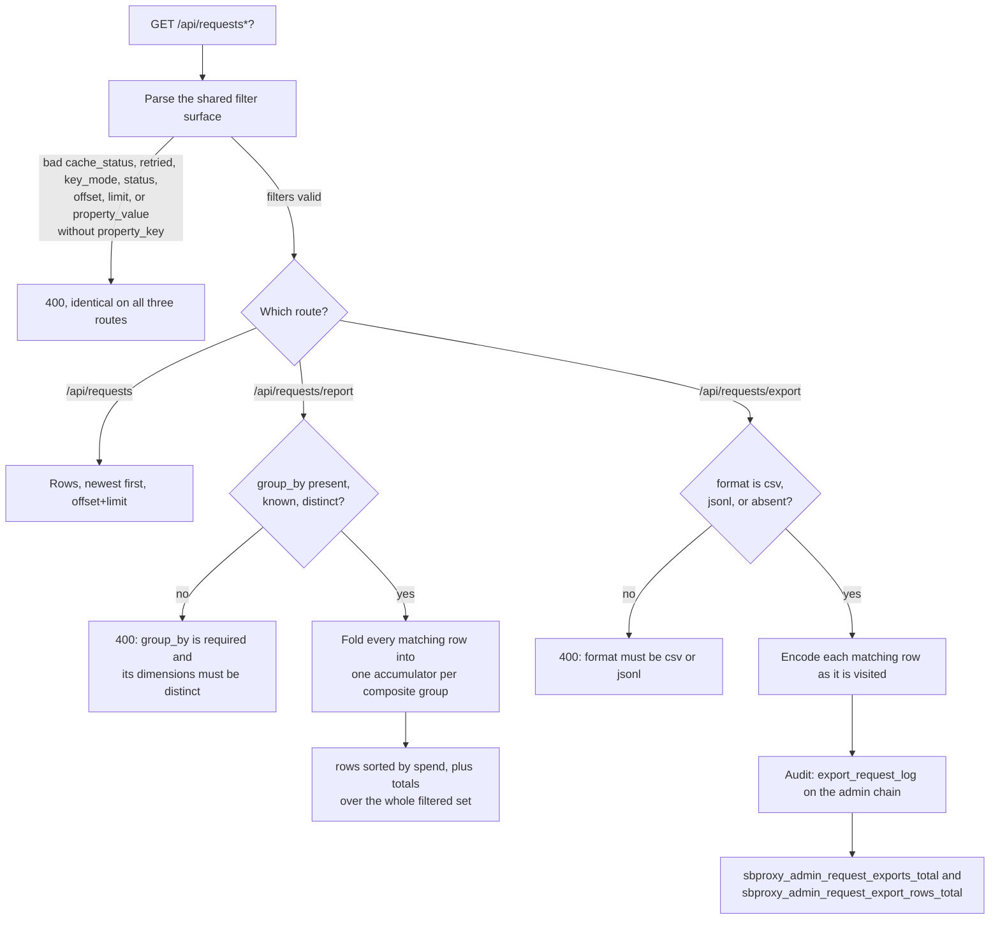
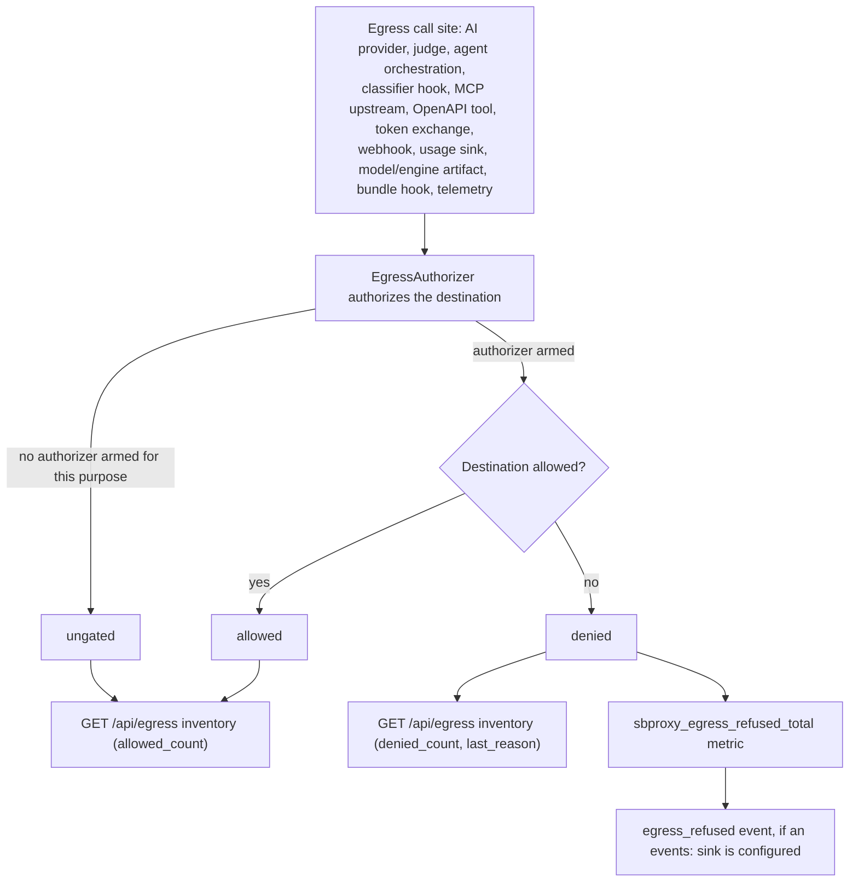

# Admin API reference

*Last modified: 2026-08-29*

The embedded admin server publishes the full control-plane HTTP surface for
operator tooling: liveness probes, session login, key and credential
lifecycle, the running extension inventory, the request log (with its live stream, report, and export), routing decisions, recent sessions, alert
operations, per-target health, spend and audit, attested-metering summary/receipts/verify, config read/write and hot reload/drift, the local config-revision
history ring, model-host catalog and deployment lifecycle, the
response/semantic/key-policy caches, cluster status and the replicated-state
substrate, prompts, the chat playground, and the emitted OpenAPI document.

This page is the per-route reference: every path, its auth/role
requirement, request and response shape, and status codes. For a
task-oriented walkthrough (enabling the server, logging in, a curl
cookbook), see [admin-api-guide.md](admin-api-guide.md). For the
built-in dashboard over this same API, see [admin-ui.md](admin-ui.md).

## Contents

- [Enabling the admin server](#enabling-the-admin-server)
- [Authentication](#authentication)
- [Rate limiting](#rate-limiting)
- [Error envelope](#error-envelope)
- [Probe routes](#probe-routes-unauthenticated) (unauthenticated)
- [Session routes](#session-routes) - login, logout, whoami
- [API keys and credentials](#api-keys-and-credentials) - full virtual-key and upstream-credential lifecycle
- [Read routes](#read-routes-authenticated) - request log + stream + report + export, routing decisions, extension inventory, alerts, health, spend, attested-metering, audit, egress inventory, rate-limit budget, UI settings, OpenAPI
- [AI compression session state](#ai-compression-session-state)
- [Config and control routes](#config-and-control-routes-authenticated) - reload, drift, config read/write, config history, log level, the owasp_api_top10 pack manifest, AI provider data posture
- [AI toolkit admin](#ai-toolkit-admin) - scoped agents, workflows, immutable datasets, offline evaluation, and prompt selection
- [Model host admin](#model-host-admin) - catalog, deployments, lifecycle, artifact cache
- [Cache admin](#cache-admin) - response cache and key-policy cache
- [Cluster control plane](#cluster-control-plane) - status, deployments, enrollment, replicated state
- [Admin UI](#admin-ui-get-adminui-get-) - static asset serving
- [Prompt store admin](#prompt-store-admin-get-adminprompts-post-adminprompts) - prompt overlay
- [Chat playground](#chat-playground)
- [Curl recipes](#curl-recipes)

## Enabling the admin server

```yaml
proxy:
  admin:
    enabled: true
    port: 9090
    username: admin
    password: ${ADMIN_PASSWORD}
    max_log_entries: 1000
```

The password resolves from the environment at config load
(`export ADMIN_PASSWORD=...` before starting the proxy). YAML tags
like `!env` are not a supported form and are rejected at compile.

When `enabled: false` (the default) the admin listener does not bind
and every route below is unreachable. The server binds on
`127.0.0.1:<port>` so the admin surface is loopback-only by default;
expose it via a reverse proxy or sidecar with an IP allowlist when an
operator console needs remote access.

The credentials default to `admin` / `changeme`, which validation refuses
once the surface is reachable off loopback (a non-loopback `bind`, or an
`allow_ips` entry outside loopback). See
[admin.md](admin.md#the-default-credentials-are-refused-off-loopback).

## Authentication

Routes split into two tiers:

- **Unauthenticated utility routes** are reachable without credentials so
  load balancers and orchestrators can probe liveness without
  configuring secrets: `/healthz`, `/health`, `/readyz`, `/ready`,
  `/livez`, `/live`, and `/.well-known/sbproxy/quote-keys.json`. The login,
  logout, and session-discovery routes also run before the general auth gate;
  they establish, revoke, or describe a browser session rather than exposing
  protected control-plane data.

- **Protected routes** accept HTTP Basic auth using the configured top-level
  identity, or the signed browser session created by `POST /admin/login`.
  Configured operator credentials are accepted by login and then use the
  session cookie; they are not accepted directly as HTTP Basic credentials on
  protected routes. The top-level identity has the `admin` role; configured
  operators may have `admin` or `read_only`. The one-time-token exchange at
  `POST /admin/cluster/enroll` is a separate documented exception.

Send credentials with `curl -u admin:secret <url>` or an
`Authorization: Basic <base64(user:pass)>` header.

Protected state-changing routes require the `admin` role. When authentication
came from the browser session cookie, the request must also echo the CSRF token
returned at login in the `X-CSRF-Token` header. HTTP Basic requests are
CSRF-exempt. Login, logout, session discovery, and enrollment have their own
route-specific rules. Individual read routes may impose a stricter role, as
the compression-content route does.

## Rate limiting

The admin server enforces an in-process rate limit with both per-IP
and global caps. The per-IP cap is 240 requests / minute by default;
the global cap is 10x that (2400 / minute). A request that exceeds
either cap returns `429` and is not counted against future windows.
The per-IP tracking map is capped at 10000 entries to prevent
unique-IP floods from growing memory.

## Error envelope

All authenticated routes return JSON errors as:

```json
{"error":"<reason>"}
```

Status codes follow conventional HTTP: `401` for missing or invalid
credentials, `403` for an insufficient role or failed session CSRF check,
`405` for wrong method on a method-gated route, `409` when a hot reload is
already in flight, `429` when rate-limited, and `5xx` for server-side failures.

---

## Probe routes (unauthenticated)

### `GET /healthz`

Kubernetes-style liveness probe. Returns `200` with body
`{"status":"ok"}` whenever the process is up. Does **not** consult
the live config or any dependency; treat it as "the process is
running and the listener accepted my connection".

### `GET /health`

Component-aware health report with version and build metadata.
Returns `200` with top-level `"status": "ok"` when every check is
ready, `503` with `"status": "unready"` otherwise:

```json
{
  "status": "ok",
  "version": "1.5.0",
  "build_hash": "abc1234",
  "timestamp": "2026-07-09T10:15:32Z",
  "uptime_seconds": 86400,
  "checks": [
    {"name": "usage_ledger", "status": "healthy"},
    {"name": "bot_auth_directory", "status": "not_configured"}
  ]
}
```

Each entry in `checks` carries a `name`, a `status`, and an optional
`detail` string. Statuses are `healthy`, `degraded`, `unhealthy`, and
`not_configured`. A `degraded` or `not_configured` check still counts
as ready, so the route keeps returning `200`; an `unhealthy` check
flips the top-level status to `unready` and the response to `503`.

### `GET /readyz`, `GET /ready`

Kubernetes-style readiness probe. Returns `200` once all required
components are ready to serve traffic, `503` while any required
component is still initializing or has failed. K8s polls this to
gate traffic shifting during rolling restarts.

### `GET /livez`, `GET /live`

Bare liveness probe. Like `/healthz` but with a different name for
load balancers that hardcode this path.

### `GET /.well-known/sbproxy/quote-keys.json`

JWKS document publishing every Ed25519 public key the live config
uses to sign Wave 3 quote tokens (the `402 Payment Required` flow's
agent-verifiable payment quotes). External verifiers (ledger
clients, agent SDKs) fetch this to verify a quote without contacting
the issuer.

Response:

```json
{
  "keys": [
    {
      "kty": "OKP",
      "crv": "Ed25519",
      "kid": "<key-id>",
      "x": "<base64url public key>"
    }
  ]
}
```

Served unauthenticated because the keys themselves are public. The
document aggregates keys across every `ai_crawl_control` policy so a
multi-tenant deployment publishes one document for all of its
issuers.

There are two unrelated reasons the `keys` array holds more than one
entry, so read it by `kid` rather than by position. Several issuers is
the multi-tenant case above. Two entries for one issuer is a rotation
window: the key that origin signs under now, plus the
`quote_token.previous_key_id` it keeps verifying until the last quote
signed under the old key has passed its TTL.

---

## Session routes

`POST /admin/login`, `POST /admin/logout`, and `GET /admin/session` run
before the general auth gate: they establish, revoke, or describe a
browser session rather than exposing protected control-plane data. See
[admin-api-guide.md](admin-api-guide.md#authenticating-basic-vs-session--csrf)
for the full login/CSRF walkthrough.

### `POST /admin/login`

Verifies credentials (an `Authorization: Basic` header, or a JSON
`{"username": "...", "password": "..."}` body) against the top-level
admin or a configured `operators[]` entry.

Success (`200`) sets `Set-Cookie: sb_admin_session=<token>; HttpOnly;
SameSite=Strict; Path=/` (adds `; Secure` when TLS is on), good for 8
hours, and returns:

```json
{"role": "admin", "csrf_token": "3f9c1a...", "username": "admin"}
```

`400` for a missing/unparseable body, `401` for invalid credentials
(emits an `sbproxy::admin::audit` failure event).

### `POST /admin/logout`

Revokes the session and clears the cookie. Always `200`. Does not
require an `X-CSRF-Token` header (it is one of the route-specific CSRF
exceptions, alongside login and session discovery).

### `GET /admin/session`

Reports whether the request carries a valid session, without ever
returning `401`. It distinguishes "please log in" from an error so
the UI can render a login form on a fresh visit:

```json
{"authenticated": true, "username": "admin", "role": "admin", "via_session": true, "csrf_token": "3f9c1a..."}
```

or `{"authenticated": false}`. `via_session` is `false` for a request
authenticated by HTTP Basic (a Basic caller is "authenticated" here
too, so a Basic-authenticated browser session can still recover a
usable CSRF token: the server mints and `Set-Cookie`s a session token
automatically on a Basic-authenticated request that lacks one (the
Basic-to-session upgrade), but the RBAC/CSRF gate still treats
`via_session: false` requests as CSRF-exempt).

---

## API keys and credentials

Full CRUD-plus-lifecycle over dynamic virtual keys and upstream
provider credentials. Mounted on the shared admin listener; every
mutation writes through the configured keystore and invalidates the
policy cache so it takes effect on the next request without a reload.
Responses never carry a secret hash or plaintext, except the one-time
minted/rotated token. See [key-management.md](key-management.md) for
the policy model these records drive.

| Method | Path | Purpose |
|---|---|---|
| GET | `/admin/keys` | List keys (no secrets). |
| POST | `/admin/keys` | Mint a key; the plaintext token is returned once. |
| GET | `/admin/keys/policy-schema` | The server-driven policy field contract the UI renders forms from. |
| GET | `/admin/keys/{id}` | Fetch one key. |
| PATCH | `/admin/keys/{id}` | Update policy/attribution fields (optimistic concurrency via `expected_revision`). |
| DELETE | `/admin/keys/{id}` | Delete a key. |
| GET | `/admin/keys/{id}/usage` | Governed usage snapshot (requests/tokens/budget counters) and backend health. |
| POST | `/admin/keys/{id}/effective-policy/preview` | Evaluate the key's effective policy against a hypothetical request, without dispatching one. |
| POST | `/admin/keys/{id}/revoke` | Mark revoked (terminal, no further mutation). |
| POST | `/admin/keys/{id}/block` | Mark blocked (reversible). |
| POST | `/admin/keys/{id}/unblock` | Mark active. |
| POST | `/admin/keys/{id}/rotate` | Mint a new secret with a grace-window dual-key transition. |
| POST | `/admin/keys/{id}/budget-override` | Grant a temporary, auto-expiring raise on the key's base budget. |
| DELETE | `/admin/keys/{id}/budget-override` | End an active raise early; the base budget resumes immediately. |
| GET | `/admin/credentials` | List upstream credentials (no secrets). |
| POST | `/admin/credentials` | Create a credential (`vault_ref` or `secret`, envelope-sealed at rest). |
| GET | `/admin/credentials/{id}` | Fetch one credential. |
| PATCH | `/admin/credentials/{id}` | Update credential metadata, provider, or material. |
| DELETE | `/admin/credentials/{id}` | Delete a credential. `409` while any key's `credential_id` still points at it. |
| POST | `/admin/credentials/{id}/revoke`, `/block`, `/unblock` | Set the credential's status. Unlike the key lifecycle actions below, this has no `expected_revision` check and no terminal-state guard: a revoked credential can still be blocked or unblocked again. |

All of these return `409 {"error":"key_management is not enabled"}`
when the process has no dynamic key plane configured (no `keystore:`
backend wired). List/get failures against the store are `500`; a
missing key/credential id is `404`.

### When the invalidation did not reach the shared cache

Every mutation above invalidates the policy cache. With a shared L2
tier configured (Redis, or the mesh distributed cache) that invalidation
has to travel, and it can fail while the store write succeeds: the tier
is unreachable, or the announcement to peer replicas did not go out.

The response stays 2xx, because the record really did change in the
keystore and re-running the mutation would not help. What it grows is a
`cache_propagation` object saying the rest of the fleet has not heard:

```json
{
  "key": { "key_id": "a1b2c3d4e5f60789", "status": "revoked" },
  "cache_propagation": {
    "status": "failed",
    "detail": "reach the shared cache tier to invalidate an id: connection refused",
    "effect": "other replicas may serve the previous record until their cache TTL lapses"
  }
}
```

The field is absent on a clean propagation, and on any deployment with
no shared tier. The same event logs a `warn` on the replica that handled
the request and increments
`sbproxy_key_cache_invalidation_failures_total{scope="key"}`, which is
the series to alert on: on a revoke it means a credential every other
replica keeps accepting until its cache TTL expires. This replica's own
L1 copy is always dropped, so the node that served the mutation is
correct immediately either way.

`POST /admin/cache/key-policy/evict` answers `502` in the same situation
rather than 2xx; see that route below.

### Key record shape (`KeyView`)

`GET`/`POST`/`PATCH` responses wrap a `KeyView` under `"key"`:

```json
{
  "key_id": "a1b2c3d4e5f60789",
  "policy_revision": 3,
  "policy_digest": "sha256:...",
  "name": "checkout-service",
  "status": "active",
  "max_requests_per_minute": 600,
  "budget": {"max_cost_usd": 25.0},
  "allowed_models": ["gpt-4o-mini", "claude-haiku-4-5"],
  "blocked_models": [],
  "allowed_providers": [],
  "blocked_providers": [],
  "allowed_tools": null,
  "require_pii_redaction": [],
  "principal_selectors": [],
  "inject_tools": [],
  "bypass_prompt_injection": false,
  "allow_content_capture": false,
  "project": null,
  "user": null,
  "tags": ["team:checkout"],
  "metadata": {},
  "tenant_id": null,
  "expires_at": null,
  "created_at": "2026-07-01T00:00:00Z",
  "updated_at": "2026-07-01T00:00:00Z",
  "source": "api",
  "rotation_pending": false
}
```

`status` is `active`, `blocked`, or `revoked`. `policy_digest` is only
populated for records that own a tenant (`tenant_id` set); a tenantless
record inherits the request's origin tenant, so it has no single
runtime digest. Get one per-origin from the effective-policy preview
instead. `rotation_pending` is true while a prior secret is still
valid inside its rotation grace window. `allow_content_capture` gates
whether `GET /api/requests/{request_id}/content` can sample this key's
traffic; it is always present. `max_tokens_per_minute`, `priority`,
`route_to_model`, `compression_profile`, `inject_mcp`, and
`budget.max_tokens` are omitted from the response entirely when unset,
rather than serialized as `null`.

`POST /admin/keys` accepts the same policy fields as `PATCH` (name,
budgets, allow/block lists, `route_to_model`, `compression_profile`,
`inject_tools`, `inject_mcp`, `principal_selectors`, `tags`, `metadata`,
`tenant`, `expires_at`, `allow_content_capture`, ...) and returns `201`
with `{"token": "<plaintext, shown once>", "key": <KeyView>}`.

### Optimistic concurrency and terminal state

`PATCH`, `revoke`, `block`, `unblock`, and `rotate` all read the
record's current `policy_revision` and require the caller's
`expected_revision` to match (omit it on `block`/`unblock`/`rotate` to
default to the server-read value; `PATCH` requires it explicitly). A
mismatch returns `409`:

```json
{"error": "key policy revision conflict", "key_id": "a1b2c3d4e5f60789", "expected_revision": 2, "current_revision": 3}
```

A `revoked` key is terminal: any further mutation returns
`409 {"error": "revoked key is terminal", "key_id": "...", "current_revision": N}`.
A keystore backend that cannot perform an atomic compare-and-swap
returns `409 {"error": "configured key store does not support atomic key policy mutation"}`.

### `POST /admin/keys/{id}/rotate`

Body: `{"expected_revision": <optional>, "grace_secs": <optional, default 3600>}`.
Mints a fresh secret, keeps the prior hash valid for `grace_secs`
(both authenticate during the window), and returns:

```json
{"token": "sbp_a1b2c3d4e5f60789_<new secret>", "grace_expires_at": "2026-07-01T01:00:00Z", "key": {"...": "..."}}
```

The key id has to be one the gateway minted: sixteen lowercase hex
characters, which is what `POST /admin/keys` produces. A key seeded from
config under `key_management.seed.keys[]` can carry any id its author
wrote, and a rotated token built from a non-conforming id is not a token
the inbound resolver can parse. Rotating one returns
`409 {"error": "key id is not in the minted format ..."}` and changes
nothing, so the credential in the field keeps working. To replace a
seeded key, create a new one with `POST /admin/keys`, move callers over,
then revoke the seeded id.

### `POST /admin/keys/{id}/budget-override`

Body: `{"max_tokens_increase": <optional>, "max_cost_usd_increase":
<optional>, "ttl_secs": <or expires_at>, "expires_at": <RFC 3339>,
"reason": <optional>, "expected_revision": <optional>}`. At least one
increase is required, each must be positive, and each must raise an axis
the base budget actually caps; exactly one of `ttl_secs` or `expires_at`
names the expiry, which must be in the future. `reason` is capped at 256
bytes and a longer one is refused with a 400. The raise applies on top
of the base budget until then, after which the base resumes with no
further call. Regranting replaces the current raise. Read responses
carry `budget` (the base), `budget_override` (increases, `expires_at`,
`granted_by`, `granted_at`, `reason`), and `effective_budget` while a
raise is live.

`DELETE` on the same path ends the raise early. It is `404` only when the
record carries no override at all; a grant that has already lapsed but
has not yet been retired is still on the record, so `DELETE` clears it
with a `200` and audits it as an expiry rather than a cancellation. A
cleanup script that reads `404` as "already expired" will mis-report
every expiry it races.

Three `key_audit` records cover the lifecycle, and the distinction
between the last two is the whole point of having both:
`budget_override_grant` names the operator who granted the raise,
`budget_override_clear` names the operator who ended one that was still
live, and `budget_override_expire` is the unattributed time-driven end,
written when an admin read (or a `DELETE`) first observes a lapsed grant
and retires it. A reconciliation rule matching only grant and expire
misses every operator-initiated early clear.

### `GET /admin/keys/{id}/usage`

Returns `{"usage": <GovernanceSnapshot>}`, the same request/token/
budget counters the AI gateway's governance seam reserves against,
read live rather than derived from the log. Returns
`503 {"error":"governance backend unavailable"}` if the governance
store (Redis, for a shared/cluster deployment) cannot be reached; the
key record itself is not at fault in that case.

### `POST /admin/keys/{id}/effective-policy/preview`

Body is an optional sample request shape (`model`, `provider`, `tools`,
`principal`, `origin_tenant_id`, `active_pii_rules`,
`prompt_injection_detected`, `estimated_tokens`, `estimated_micro_usd`,
`usage`, `at`). Every field is optional; an empty body still returns
the resolved policy. Response:

```json
{
  "effective_policy": {"...": "the full secret-free effective policy"},
  "policy_version": "...",
  "decisions": {
    "allowed": true,
    "lifecycle": {"allowed": true, "reason_code": "active", "status": "active", "expires_at": null},
    "tenant": {"allowed": true, "reason_code": "match", "origin_tenant_id": "...", "effective_tenant_id": "..."},
    "model": {"allowed": true, "reason_code": "not_sampled", "requested": null, "effective": null, "routed": false},
    "provider": {"...": "..."},
    "tools": {"...": "..."},
    "principal": {"...": "..."},
    "rate_limits": {"...": "..."},
    "budget": {"...": "..."},
    "priority": {"...": "..."},
    "guardrails": {"pii": {"...": "..."}, "prompt_injection": {"...": "..."}}
  }
}
```

Each decision block carries `allowed` plus a stable `reason_code`
(`active`, `revoked`, `blocked`, `expired`, `not_sampled`, `blocked`,
`not_allowed`, `allowed`, `match`, `mismatch`, `inherited`, ...) so the
UI can render *why* a hypothetical request would be denied without
needing a live upstream call. This never dispatches a request or
reserves budget; it is pure evaluation against the stored record.

### Credential record shape (`CredentialView`)

```json
{
  "id": "cred_a1b2...",
  "name": "openai-prod",
  "provider": "openai",
  "kind": "ai_provider",
  "header": "authorization",
  "scheme": "Bearer ",
  "status": "active",
  "tenant_id": null,
  "storage": "vault_ref",
  "vault_ref": "vault://secret/data/openai#key",
  "created_at": "2026-07-01T00:00:00Z",
  "updated_at": "2026-07-01T00:00:00Z",
  "source": "api"
}
```

`storage` is `vault_ref`, `encrypted` (envelope-sealed plaintext at
rest), or `plaintext` (legacy records only). The actual secret is
never present in any response; `vault_ref` only appears for
vault-referenced credentials, since the reference itself is not a
secret. `header` and `scheme` name the upstream header this credential
is presented in (default `authorization` / `Bearer `; send an empty
`scheme` for a raw-value header such as `x-api-key`); both are set at
creation time and are not among the fields `PATCH` can change.

`POST` bodies accept `vault_ref` *or* `secret` (a plaintext value the
server envelope-seals immediately); supplying neither is a `400`.
`PATCH` also accepts `vault_ref` or `secret` to rotate the material,
but unlike `POST` it does not require either: a `PATCH` body with
neither field present succeeds (`200`) and leaves the existing
material unchanged.

---

## Read routes (authenticated)

### `GET /api/requests`

Returns the most recent request log entries, newest first. The ring
buffer size is `proxy.admin.max_log_entries` (default `1000`).

Response body: an array of `RequestLogEntry`:

```json
[
  {
    "timestamp": "2026-05-12T10:15:32.456Z",
    "origin": "api.example.com",
    "method": "POST",
    "path": "/v1/chat/completions",
    "status": 200,
    "latency_ms": 42.7,
    "client_ip": "10.0.0.5",
    "request_id": "08ad73be-...",
    "trace_id": "4bf92f3577b34da6a3ce929d0e0e4736",
    "session_id": "01K0SESSION0000000000000000",
    "parent_session_id": "01K0PARENT00000000000000000",
    "properties": {"feature": "assistant", "tier": "gold"},
    "cache_status": "miss",
    "retry_count": 1,
    "failover_engaged": true,
    "failover_from": "openai",
    "failover_to": "anthropic",
    "failover_trigger": "context_window",
    "load_balancer_strategy": "lowest_latency",
    "load_balancer_target": "anthropic",
    "routing_detail": "matched anthropic exemplar 1 at 0.831 (floor 0.750)",
    "provider": "anthropic",
    "model": "claude-sonnet-4",
    "tokens_in": 315,
    "tokens_out": 82,
    "cost_usd_micros": 1840,
    "guardrail_category": "pii",
    "guardrail_action": "block"
  }
]
```

| Field | Type | Description |
|---|---|---|
| `timestamp` | string | RFC 3339 timestamp when the request finished. |
| `origin` | string | Configured origin hostname that handled the request. |
| `method` | string | HTTP method. |
| `path` | string | Request path including query string. |
| `status` | int | Response status code. |
| `latency_ms` | float | End-to-end latency in milliseconds. |
| `client_ip` | string | Client IP as observed by the proxy. |
| `request_id`, `trace_id` | string | Correlation identifiers when available. |
| `session_id`, `parent_session_id` | string | Captured session ULIDs. Optional when session capture produced no value. |
| `properties` | object | Bounded, normalized custom properties after redaction. Empty maps are omitted. |
| `cache_status` | string | Gateway cache decision: `disabled`, `miss`, `hit`, or `semantic_hit`. |
| `retry_count` | int | Additional upstream attempts after the first. Zero means no retry. |
| `failover_engaged` | bool | Whether fallback or AI provider failover ran. |
| `failover_from`, `failover_to` | string | First failed and final selected provider or target, when known. |
| `failover_trigger` | string | Which trigger drove an AI reroute. Closed set: `context_window` (the prompt outgrew the model's window), `content_policy` (the provider refused on safety grounds), and `generic` (an ordinary availability or transport failover). Absent when no reroute happened. The counter spells the generic case differently; see [ai-gateway.md](ai-gateway.md#typed-fallback-triggers). |
| `load_balancer_strategy`, `load_balancer_target` | string | Bounded routing strategy and selected target. |
| `zone_locality` | string | Zone-locality verdict for the selected target: `local` (narrowed to the proxy's own zone) or `spilled` (no same-zone target was healthy, selection widened across zones). Absent when the stage did not engage. |
| `routing_detail` | string | Why a per-request strategy picked that target. Bounded and operator-derived, never exemplar text or caller input. `semantic_route` writes the matched deployment with the winning exemplar's ordinal (or `centroid`) and the cosine score against the floor, for example `matched fast-pool exemplar 1 at 0.831 (floor 0.750)`, or the near-miss that sent the request to the fallback: `below floor: closest fast-pool at 0.612 (floor 0.750)`, `no user message to embed`, `embedder unavailable; routed to the default`, or `matched fast-pool at 0.831 but it is not eligible for this request` when the winner was filtered out before selection. Absent for strategies that do not decide per request. |
| `provider`, `model` | string | AI provider and model when the AI gateway handled the request. |
| `tokens_in`, `tokens_out` | int | Parsed prompt and completion tokens. |
| `tokens_cached`, `tokens_cache_write` | int | Provider prompt-cache read and write tokens, when the provider reported them (OpenAI's `prompt_tokens_details.cached_tokens`, Anthropic's `cache_read_input_tokens` and `cache_creation_input_tokens`). Both are **subsets of `tokens_in`**, not additions to it, so do not sum them alongside it. Absent when the provider reported neither. |
| `cost_usd_micros` | int | Estimated AI cost in millionths of a US dollar. |
| `guardrail_category`, `guardrail_action` | string | Bounded guardrail outcome when a guardrail intervened. |
| `api_key_id` | string | Canonical public id of the key that governed the request, when one resolved. Matches the access log column, the `sbproxy_inbound_key_requests_total{api_key_id}` label, and the `sbproxy.key_id` span attribute. Never the secret. |
| `key_mode` | string | Inbound credential mode: `none`, `minted`, or `native`. |
| `key_provider` | string | Recognized native provider label, present on `native` rows. |
| `credential_source` | string | Which secret the AI attempt presented upstream, the outbound counterpart to `key_mode`: `provider_entry` (the provider entry's own `api_key`), `native_caller` (a caller-owned native provider key, forwarded verbatim), or `fallback` (the operator's `fallback_credential_id`, presented after the entry's own key was refused). Absent on rows the AI gateway did not dispatch. Never credential material. |
| `service_tier` | string | The operator's service tier the attempt was served under, and therefore the tier that priced the tokens beside it: `flex`, `standard`, or `priority`, as written on the provider entry. Absent when the entry declares no tier, when the surface has no tier axis, and on rows the AI gateway did not dispatch. It is always the operator's: a caller's own `service_tier` field is stripped before dispatch and never reaches this row. The value the vendor sees on the wire can differ, since each vendor's catalog entry carries its own spelling. |
| `tenant_id` | string | Origin-scoped tenant label (`__default__` when the origin declares none). |
| `user_id` | string | Resolved end-user identifier when user capture resolved one, already capped and redacted. |
| `error_class` | string | Coarse failure class (`auth_denied`, `rate_limited`, `upstream_5xx`, ...). Absent on success. |
| `config_revision` | string | Config revision of the pipeline generation that served the request. |
| `policy_version` | string | Governed key-policy revision that applied, when a key policy resolved. Same vocabulary as the `sbproxy.policy_version` span attribute. |
| `policy_decisions` | array | Bounded, ordered `policy_type:verdict` pairs recorded as enforcers decided. Explains what applied, not just what denied. |
| `deny_reason` | string | Machine-readable reason from the policy, guardrail, or auth layer that denied the request, when one did. |

This is an in-memory ring buffer; entries are lost when the process
exits. For durable request logs, enable the structured access log
(see [access-log.md](access-log.md)).

Supported query parameters: `status` (exact match), `method`
(case-insensitive), `path` (substring), `guardrail_action`,
`guardrail_category`, `cache_status`, `retried`, `property_key`,
`property_value`, `api_key_id` (exact canonical key id), `key_mode`
(`none`, `minted`, or `native`), `session_id` (exact ULID), `model`
(exact), `tenant` (exact label), `user` (exact resolved end-user id),
`offset`, and `limit` (defaults to and is clamped at
`max_log_entries`). `cache_status` accepts the four values listed above.
`retried` accepts only `true` or `false`. Property matching is exact after
URL decoding; `property_value` requires `property_key`. `status`,
`offset`, and `limit` must parse as whole numbers when present; a
malformed one is a `400` rather than an ignored parameter, so a filter
never silently widens the result. No parameters returns the newest
entries.

An empty value means "rows with nothing there" rather than "no filter":
`?user=` selects the rows the report groups under the unattributed
`""` key, which is the same set on all three routes. Omit the parameter
entirely to leave the dimension unfiltered.

The same filter set drives [`/api/requests/report`](#get-apirequestsreport)
and [`/api/requests/export`](#get-apirequestsexport): one parser serves
all three routes, so a filter that selects rows here selects exactly the
same rows in the aggregation and the export.

To answer "what did this key do", filter by `api_key_id`; every row a
governed request produced carries the same canonical id across this
ring, the access log, the inbound-key metric, and exported spans.

### `GET /api/requests/{request_id}/content`

Fetch one request's redacted content sample: the prompt messages and
response text retained when the AI origin sets `capture_content: true`
AND the governed key's policy sets `allow_content_capture`. Both flags
default to off and both must be on; unkeyed and native-key traffic is
never sampled.

Admin role required (a read-only operator receives `403`). Every read
is audited before the content is returned: an `inspect_request_content`
event naming the operator lands on the `sbproxy::admin::audit` tracing
target and the `/api/audit/events` sample. `404` means no sample exists
for that request id, either because a gate was off or because the
bounded store (200 samples, at most 50 per tenant, cleared on restart)
has already evicted it.

Samples are redacted before storage: the secret redactor, the origin's
PII redactor when configured, and an 8 KiB payload cap all apply, and
configured credential carriers never reach capture surfaces. The
durable content path is OTLP `trace_content:`; this endpoint is a
runtime inspection sample.

A sample carries `request_id`, `tenant_id`, `origin`, `captured_at`,
`api_key_id` and `model` when they resolved, `input_messages[]` as
`{role, content}`, `output_text` once the upstream answered, and
`shadow_responses[]`. That last one is present only on a request whose
origin configured a `shadow:` block: one entry per target that ran,
each `{target, model, status, output_text}`, at most eight per sample,
through the same redaction stack and payload cap as the primary's own
answer. It is omitted rather than empty when nothing was retained, and
a target's answer is never stored without the primary it is being
compared against. See the shadow-eval section of
[ai-gateway.md](ai-gateway.md) for what the pair is for.

### `GET /api/ai/shadow/report`

One row per shadow-eval target over a window, folded from a bounded
in-process ring of the last 512 requests that reached per-target shadow
admission. `window` takes `15m`, `1h` (the default), `24h`, `7d`, or
`30d`; anything else is a `400` naming the accepted set. `GET` only, so
read RBAC applies, and the view is deployment-wide for a tenant-scoped
operator, matching the sibling spend and usage reports.

```bash
curl -s -u "admin:${SB_ADMIN_PASSWORD}" \
  "${SB_ADMIN_URL}/api/ai/shadow/report?window=1h"
```

The response is `{"window_secs": <int>, "targets": [...]}`. Each target
row leads with `provenance` (`requests_seen`, `sample_rate`,
`pairs_retained`, `pairs_dropped` by closed reason, `responses_retained`,
`evicted_before_primary`) and then carries `cost`, `latency` at p50 and
p95, `finish_reasons`, `errors`, `agreement`, and `cost_to_decide_usd`.
Every delta is computed over the retained pairs and nothing else. The
field-by-field reading, the closed `pairs_dropped` vocabulary, and what
`evicted_before_primary` means for the numbers above it are in the
shadow-eval section of [ai-gateway.md](ai-gateway.md).

It is a report and not a metric: the `sbproxy_ai_shadow_*` families
carry the scrapeable series, and this answers what PromQL cannot, which
is what one target cost relative to the primary that ran beside it. It
clears on restart.

The admin UI derives its Sessions list and detail pages from this ring. Those
pages are a recent operational view, not durable trace storage, a timing
waterfall, or a request replay facility.

### `GET /api/requests/stream`

Server-Sent-Events tail of the same ring buffer: one `data: <json>`
event per request as it completes, plus a leading `: connected`
comment. `Content-Type: text/event-stream`; the connection stays open
until the client disconnects. Handled directly by the async connection
handler (not the blocking dispatcher) so it can own the socket for the
stream's lifetime; requires authentication like every other route, but
does not accept query filters. Each event has the same enriched
`RequestLogEntry` shape as the snapshot; filter the stream client-side.

```bash
curl -N -u "admin:${SB_ADMIN_PASSWORD}" "${SB_ADMIN_URL}/api/requests/stream"
```

### `GET /api/requests/report`

Multi-dimension spend and usage aggregation over the same ring
`GET /api/requests` serves: one row per composite group, so "who spent
what on which model" is a single call. `group_by` is required and takes
a comma-separated subset of four dimensions, selectable simultaneously
rather than one at a time:

| Dimension | Groups on |
|---|---|
| `model` | AI model that served the request. |
| `api_key_id` | Canonical public id of the governing key. |
| `tenant` | Origin-scoped tenant label. |
| `user` | Resolved end-user identifier: the human subject behind the call (`X-Sb-User-Id` header, JWT `sub`, or forward-auth user, in that order). |

One parser reads the filter surface for all three request-log routes,
which is what makes a grouped number drillable: the same query string
selects the same rows on the snapshot, the report, and the export.
A row that carries no value on a dimension groups under the empty
string rather than being dropped, and an empty filter value selects
that same group, so the unattributed bucket drills through like any
other. In a deployment that resolves no end user it is usually the
biggest one.



Every `GET /api/requests` filter applies unchanged, so the report always
aggregates exactly the rows the snapshot would return. A request that
lacks a dimension (an unkeyed call, an anonymous user) groups under the
empty string; the admin UI renders that as `(unattributed)`.

The response carries `schema_version`, the echoed `group_by`, a `rows`
array sorted by spend then request count then group key, and `totals`
over the whole filtered set. Each row holds the `group` map plus
`requests`, `tokens_in`, `tokens_out`, and `cost_usd_micros`. `offset`
and `limit` page the grouped rows (top spenders first); `totals` always
covers the whole filtered set, so a paged view still reads against the
true denominators. The result is bounded by construction: there can
never be more rows than ring entries, and the ring caps at
`proxy.admin.max_log_entries`.

An unknown, duplicate, missing, or empty `group_by` is a `400`; so is
any filter value `/api/requests` itself would refuse.

```bash
curl -s -u "admin:${SB_ADMIN_PASSWORD}" \
  "${SB_ADMIN_URL}/api/requests/report?group_by=flavor"
```

<!-- CAPTURE: curl -s -u admin:demo-change-me 'http://127.0.0.1:9090/api/requests/report?group_by=flavor' -->

```json
{"error":"group_by dimensions are model, api_key_id, tenant, user"}
```

#### Worked example: who spent what

Config: [`examples/admin-reporting/`](../examples/admin-reporting/), two
tenants (`acme`, `globex`) over one `ai_proxy` origin each, three
governed keys, two models, and four named human callers. Every output
below is captured from that config running against a local
OpenAI-shaped fixture, driven by the five calls the example's README
lists.

Group by all four dimensions at once. Nothing else in the admin API
answers this in one call: `/api/usage/spend` breaks down one dimension
at a time, so "which human, on which key, on which model" takes four
queries and a join.

```bash
curl -s -u "admin:${SB_ADMIN_PASSWORD}" \
  "${SB_ADMIN_URL}/api/requests/report?group_by=model,api_key_id,tenant,user" \
  | python3 -m json.tool
```

<!-- CAPTURE: curl -s -u admin:demo-change-me 'http://127.0.0.1:9090/api/requests/report?group_by=model,api_key_id,tenant,user' | python3 -m json.tool -->

```json
{
    "group_by": [
        "model",
        "api_key_id",
        "tenant",
        "user"
    ],
    "rows": [
        {
            "cost_usd_micros": 5250,
            "group": {
                "api_key_id": "cfg:4:acme:13:acme.ai.local:acme-platform",
                "model": "gpt-4o",
                "tenant": "acme",
                "user": "ops@acme.test"
            },
            "requests": 1,
            "tokens_in": 900,
            "tokens_out": 300
        },
        {
            "cost_usd_micros": 84,
            "group": {
                "api_key_id": "cfg:4:acme:13:acme.ai.local:acme-platform",
                "model": "gpt-4o-mini",
                "tenant": "acme",
                "user": "dev@acme.test"
            },
            "requests": 2,
            "tokens_in": 240,
            "tokens_out": 80
        },
        {
            "cost_usd_micros": 42,
            "group": {
                "api_key_id": "cfg:4:acme:13:acme.ai.local:acme-research",
                "model": "gpt-4o-mini",
                "tenant": "acme",
                "user": "sci@acme.test"
            },
            "requests": 1,
            "tokens_in": 120,
            "tokens_out": 40
        },
        {
            "cost_usd_micros": 42,
            "group": {
                "api_key_id": "cfg:6:globex:15:globex.ai.local:globex-platform",
                "model": "gpt-4o-mini",
                "tenant": "globex",
                "user": "dev@globex.test"
            },
            "requests": 1,
            "tokens_in": 120,
            "tokens_out": 40
        }
    ],
    "schema_version": 1,
    "totals": {
        "cost_usd_micros": 5418,
        "requests": 5,
        "tokens_in": 1380,
        "tokens_out": 460
    }
}
```

Row one is the answer: one `gpt-4o` call from `ops@acme.test` on the
`acme-platform` key is 97% of the window's spend, and it cost 125 times
what a `gpt-4o-mini` call did. Spend-first sorting is why that row is
first rather than buried under the three cheap ones.

Drop dimensions to widen the grouping. The same five requests by model
and human only, which is the cut a cost review usually wants:

```bash
curl -s -u "admin:${SB_ADMIN_PASSWORD}" \
  "${SB_ADMIN_URL}/api/requests/report?group_by=model,user" | python3 -m json.tool
```

<!-- CAPTURE: curl -s -u admin:demo-change-me 'http://127.0.0.1:9090/api/requests/report?group_by=model,user' | python3 -m json.tool -->

```json
{
    "group_by": [
        "model",
        "user"
    ],
    "rows": [
        {
            "cost_usd_micros": 5250,
            "group": {
                "model": "gpt-4o",
                "user": "ops@acme.test"
            },
            "requests": 1,
            "tokens_in": 900,
            "tokens_out": 300
        },
        {
            "cost_usd_micros": 84,
            "group": {
                "model": "gpt-4o-mini",
                "user": "dev@acme.test"
            },
            "requests": 2,
            "tokens_in": 240,
            "tokens_out": 80
        },
        {
            "cost_usd_micros": 42,
            "group": {
                "model": "gpt-4o-mini",
                "user": "dev@globex.test"
            },
            "requests": 1,
            "tokens_in": 120,
            "tokens_out": 40
        },
        {
            "cost_usd_micros": 42,
            "group": {
                "model": "gpt-4o-mini",
                "user": "sci@acme.test"
            },
            "requests": 1,
            "tokens_in": 120,
            "tokens_out": 40
        }
    ],
    "schema_version": 1,
    "totals": {
        "cost_usd_micros": 5418,
        "requests": 5,
        "tokens_in": 1380,
        "tokens_out": 460
    }
}
```

`totals` is identical across both calls, because grouping changes how
the same filtered set is cut, never which rows are in it. Add a filter
and `totals` moves with it: `&tenant=acme` reports four requests and
5376 micro-USD from this window.

### `GET /api/requests/export`

Raw export of the current filtered view, for the spreadsheet or the
billing pipeline rather than another dashboard. `format` selects the
encoding:

- `jsonl` (the default): one `RequestLogEntry` JSON object per line,
  exactly the rows `GET /api/requests` returns, so an export re-reads
  with any JSON tool. `Content-Type: application/x-ndjson`.
- `csv`: the same rows flattened under a fixed header of 36 named
  columns (`timestamp` through `properties`). The `properties` and
  `policy_decisions` cells carry JSON so the two structured columns
  survive flattening without loss. `Content-Type: text/csv`.

Every request-log filter applies, plus `offset` and `limit`. `limit`
defaults to and is clamped at `proxy.admin.max_log_entries`, so no
export can exceed the bounded ring regardless of what the caller asks
for. A malformed `status`, `offset`, or `limit` is a `400` rather than
an ignored parameter, because a dropped filter on this route hands back
a wider file than the caller asked for and nothing on the file says so.

Rows are encoded one at a time as the ring is read, so the matching set
is never held twice. The response itself is materialized rather than
streamed: the admin dispatcher answers with a whole body, so the
worst-case response is the ring itself (default 1000 rows, a few
hundred KB). Memory stays bounded by configuration rather than by
caller behavior, but it is bounded, not zero, and an operator who
raises `max_log_entries` raises it proportionally, per concurrent
export. For unbounded durable exports, ship the structured access log
to your pipeline instead (see [access-log.md](access-log.md)); this
route exports the operational sample the console is looking at.

Every export is an audited admin action. It writes an
`export_request_log` record to the admin audit chain and the audit ring
alongside `inspect_request_content`, naming the operator, the format,
the row count, and which filter dimensions were set (names only, never
operator-typed values, so the record stays bounded). It also increments
`sbproxy_admin_request_exports_total{format}` and
`sbproxy_admin_request_export_rows_total{format}`, so export rate and
export volume are both alertable from the day the route ships.

Scope that record correctly before you build a detection on it: it
covers **this route**, not every bulk read of the log.
`GET /api/requests?limit=<max_log_entries>` runs the same parser, the
same filter and the same ring cap, and returns the same rows as a JSON
array rather than newline-delimited, with no audit record and no
counter. One query-string edit, same operator, same credential. The
export is the download button, not the read surface, and auditing every
`/api/requests` read instead would put a durable chain record on every
console poll while a row-count threshold would sit one page size away
from being bypassed. If you need coverage of the whole read surface,
put it in front of the admin port.

CSV cells that begin with `=`, `+`, `-`, `@`, a tab, or a carriage
return gain a leading apostrophe before quoting (the OWASP defense
against CSV formula injection): several columns carry text a data-plane
caller influenced, such as `path`, `model`, `user_id`, and
`properties`, and an export opened in a spreadsheet must not execute
it. Any other `format` value is a `400`. The response sets no
`Content-Disposition`; name the file client-side (`-o requests.csv`, or
the admin UI's export links).

#### Worked example: hand over the rows

Same config and same five requests as the report above. CSV, filtered
to one tenant, header plus the first two rows:

```bash
curl -s -u "admin:${SB_ADMIN_PASSWORD}" \
  "${SB_ADMIN_URL}/api/requests/export?format=csv&tenant=acme" | head -3
```

<!-- CAPTURE: curl -s -u admin:demo-change-me 'http://127.0.0.1:9090/api/requests/export?format=csv&tenant=acme' | head -3 -->

```text
timestamp,origin,method,path,status,latency_ms,client_ip,request_id,trace_id,session_id,parent_session_id,cache_status,retry_count,failover_engaged,failover_from,failover_to,load_balancer_strategy,load_balancer_target,provider,model,tokens_in,tokens_out,cost_usd_micros,guardrail_category,guardrail_action,api_key_id,key_mode,key_provider,tenant_id,user_id,error_class,config_revision,policy_version,deny_reason,policy_decisions,properties,credential_source,tokens_cached,tokens_cache_write,service_tier
2026-08-21T01:11:55.226687+00:00,acme.ai.local,POST,/v1/chat/completions,200,1.887458,127.0.0.1:64696,01a021dfe05874f1b6ba866697bd518b,6531cb754eae46b5ba1b255f2c61eadb,,,disabled,0,false,,,round_robin,openai,openai,gpt-4o-mini,120,40,42,,,cfg:4:acme:13:acme.ai.local:acme-research,minted,,acme,sci@acme.test,,8cb4b33d8ffc,c:8cb4b33d8ffc:ae10235dbb7fdde7,,[],"{""feature"":""literature-scan""}",,,,
2026-08-21T01:11:55.214716+00:00,acme.ai.local,POST,/v1/chat/completions,200,1.116375,127.0.0.1:64695,01a021dfe04d7b11960a65be634aca3e,c4f486ae935b41fa854201f66422ad16,,,disabled,0,false,,,round_robin,openai,openai,gpt-4o,900,300,5250,,,cfg:4:acme:13:acme.ai.local:acme-platform,minted,,acme,ops@acme.test,,8cb4b33d8ffc,c:8cb4b33d8ffc:cd949575bc0dca2d,,[],"{""feature"":""incident-triage""}",,,,
```

The `globex` row is absent because the filter removed it, not because
the export truncated. The last cell shows both structured-column rules
at once: `properties` is JSON, and RFC 4180 doubles its inner quotes so
the record still splits into 40 fields. The four trailing empty cells
are the appended columns: this row's provider reported no prompt-cache
activity, its entry declared no service tier, and the request was
dispatched on the provider entry's own key.

JSONL, filtered to one human, first line only:

```bash
curl -s -u "admin:${SB_ADMIN_PASSWORD}" \
  "${SB_ADMIN_URL}/api/requests/export?format=jsonl&user=dev@acme.test" \
  | head -1 | python3 -m json.tool
```

<!-- CAPTURE: curl -s -u admin:demo-change-me 'http://127.0.0.1:9090/api/requests/export?format=jsonl&user=dev@acme.test' | head -1 | python3 -m json.tool -->

```json
{
    "timestamp": "2026-08-21T01:11:55.203180+00:00",
    "origin": "acme.ai.local",
    "method": "POST",
    "path": "/v1/chat/completions",
    "status": 200,
    "latency_ms": 2.8585,
    "client_ip": "127.0.0.1:64694",
    "request_id": "01a021dfe0407331a26b80c75e648ba2",
    "trace_id": "03db4bd210cc4aaab55079b097ccc623",
    "properties": {
        "feature": "summarize"
    },
    "cache_status": "disabled",
    "retry_count": 0,
    "failover_engaged": false,
    "load_balancer_strategy": "round_robin",
    "load_balancer_target": "openai",
    "provider": "openai",
    "model": "gpt-4o-mini",
    "tokens_in": 120,
    "tokens_out": 40,
    "cost_usd_micros": 42,
    "api_key_id": "cfg:4:acme:13:acme.ai.local:acme-platform",
    "key_mode": "minted",
    "tenant_id": "acme",
    "user_id": "dev@acme.test",
    "config_revision": "8cb4b33d8ffc",
    "policy_version": "c:8cb4b33d8ffc:cd949575bc0dca2d"
}
```

That line is byte-identical to the row `GET /api/requests` returns, so
an export round-trips through any JSON tool without a schema of its
own. It also carries `request_id`, `trace_id`, `config_revision`, and
`policy_version`, which is what turns an exported cost row back into
the specific request, trace, and config generation that produced it.

Reading the metrics after those two exports:

```bash
curl -s -u "admin:${SB_ADMIN_PASSWORD}" "${SB_ADMIN_URL}/metrics" \
  | grep admin_request_export
```

<!-- CAPTURE: curl -s -u admin:demo-change-me 'http://127.0.0.1:9090/metrics' | grep admin_request_export -->

```text
# HELP sbproxy_admin_request_export_rows_total Rows written by admin request-log exports, by format
# TYPE sbproxy_admin_request_export_rows_total counter
sbproxy_admin_request_export_rows_total{format="csv"} 4
sbproxy_admin_request_export_rows_total{format="jsonl"} 2
# HELP sbproxy_admin_request_exports_total Admin request-log exports served, by format
# TYPE sbproxy_admin_request_exports_total counter
sbproxy_admin_request_exports_total{format="csv"} 1
sbproxy_admin_request_exports_total{format="jsonl"} 1
```

Two exports, six rows total, split by format: 4 CSV rows for the
`tenant=acme` cut and 2 JSONL rows for the `user=dev@acme.test` cut.

### `GET /api/routing-decisions`

Recent routing decisions, newest first: why each routed request went
where it went. One entry per request that a routing plane actually
decided (AI dispatch or a load-balanced origin); plain proxied requests
that never routed record nothing. This is the record behind the admin
console's [Routing decisions view](admin-ui.md#routing-decisions-routing-decisions).

| Field | Type | Description |
|---|---|---|
| `timestamp` | string | RFC 3339 timestamp of request completion. |
| `origin` | string | Origin name that handled the request. |
| `request_id` | string | Correlation id shared with the request log, access log, and trace. |
| `tenant_id` | string | Origin-scoped tenant label (`__default__` when unset). |
| `strategy` | string | What decided the request: a built-in strategy name (`round_robin`, `fallback_chain`, `cascade`, ...), `ai_routing_policy` when an operator plan dispatched, or the generic load balancer's selection method. |
| `requested_model` | string | Model the caller asked for, after alias resolution. |
| `selected_provider` | string | Provider that served (or last attempted) the request. |
| `selected_model` | string | Model that served the request, when known. |
| `reason` | string | The routing plane's own reason: an operator plan's `reason` string or the `ai_policy route_to` override note. Absent for built-in strategies. |
| `candidates` | array | Ordered `{provider, model?}` candidates the router weighed: a plan's tiers, a cascade's tiers, or the strategy's eligible provider order. |
| `attempted` | array | Providers actually attempted, in dispatch order: the fallback chain as traversed, not as planned. Capped at 16 hops. |
| `attempts` | number | Provider calls actually made. |
| `failover_engaged` | boolean | Whether fallback or provider failover engaged. |
| `failover_from` | string | First provider that handed off, when one did. |
| `failover_to` | string | Last provider selected by failover, when one was. |
| `status` | number | HTTP status the request finished with. |
| `latency_ms` | number | End-to-end request latency in milliseconds. |
| `detail` | object | Open, additive detail map. Later explanatory columns (typed fallback triggers, data-posture eligibility results, price-ceiling exclusions, semantic-match scores) appear as namespaced keys here rather than as schema changes, so a reader that tolerates unknown keys never breaks. |

Every field except `timestamp`, `origin`, `strategy`, `attempts`,
`failover_engaged`, `status`, and `latency_ms` is omitted from the wire
when absent. Treat the shape as additive: new keys may appear in
`detail` (and, rarely, as new top-level optional fields) without notice.

Query parameters: `origin`, `strategy`, and `provider` (exact),
`model` (exact, matching the requested or the selected side of a
substitution), `since` and `until` (RFC 3339, inclusive; a malformed
value is a `400` naming the parameter), `offset`, and `limit` (both
defaulting to the ring's own bounds).

A fallback chain whose primary is down produces the trace this route
exists for. With an `ai_proxy` origin like:

```yaml
routing:
  strategy: fallback_chain
providers:
  - name: primary-unreachable
    provider_type: openai
    base_url: http://127.0.0.1:9/v1   # closed port: simulated outage
    allow_private_base_url: true
    priority: 1
  - name: local-backup
    provider_type: openai
    base_url: http://127.0.0.1:18591/v1
    allow_private_base_url: true
    priority: 2
```

one chat completion through the chain records (output captured from a
live gateway):

```bash
curl -s -u "admin:${SB_ADMIN_PASSWORD}" \
  "${SB_ADMIN_URL}/api/routing-decisions?strategy=fallback_chain&limit=1" \
  | python3 -m json.tool
```

```json
[
    {
        "timestamp": "2026-08-20T14:03:16.486110+00:00",
        "origin": "ai.local",
        "request_id": "01a01f7bb6847ab0870bbc05228649e4",
        "tenant_id": "__default__",
        "strategy": "fallback_chain",
        "requested_model": "demo-model",
        "selected_provider": "local-backup",
        "selected_model": "demo-model",
        "candidates": [
            {
                "provider": "primary-unreachable"
            },
            {
                "provider": "local-backup"
            }
        ],
        "attempted": [
            "primary-unreachable",
            "local-backup"
        ],
        "attempts": 2,
        "failover_engaged": true,
        "failover_from": "primary-unreachable",
        "failover_to": "local-backup",
        "status": 200,
        "latency_ms": 2.025167
    }
]
```

The row reads as a sentence: the chain weighed two candidates, the
primary was attempted and handed off, the backup served the requested
model, and the whole detour cost two attempts and two milliseconds. An
`ai_routing_policy` row additionally carries the plan's `reason` and a
`model` on each candidate tier.

This is a bounded in-memory sample for runtime diagnosis: the ring
shares the `proxy.admin.max_log_entries` cap (default 1000) with the
request log and clears on restart. For durable routing history, publish
the `route.decide` decision audit records to your log pipeline instead
(see [decision-records.md](decision-records.md)).

### `GET /api/health`

Aggregate liveness summary. Returns `200` with:

<!-- CAPTURE: curl -sS -u admin:demo-change-me http://127.0.0.1:9090/api/health -->

```json
{"status":"ok","origins":[]}
```

The `origins` array is currently a placeholder; per-origin health
detail lives at `/api/health/targets` below.

### `GET /api/health/targets`

Per-target health for every origin whose action is a
`load_balancer`. Walks the live pipeline and reports the exact state
that `select_target` consults: active health probe result, outlier
detector eject state, and circuit breaker state. Use this to confirm
that an upstream operators believe is healthy actually is, or to
diagnose why a load balancer is short on candidates.

```json
{
  "config_revision": "abc123...",
  "proxy_zone": "us-east-1a",
  "origins": [
    {
      "hostname": "api.example.com",
      "origin_id": "api",
      "local_zone": "us-east-1a",
      "targets": [
        {
          "index": 0,
          "url": "https://upstream-1.internal:8443",
          "eligible": true,
          "healthy": true,
          "outlier_ejected": false,
          "circuit_breaker_state": "closed",
          "weight": 10,
          "backup": false,
          "group": null,
          "zone": "us-east-1a"
        }
      ]
    }
  ]
}
```

| Field | Type | Description |
|---|---|---|
| `config_revision` | string | Current pipeline revision; matches the `x-sbproxy-debug-config-rev` header when debug mode is on. |
| `origins[].hostname` | string | Origin hostname. |
| `origins[].origin_id` | string | Stable identifier for this origin within its workspace. |
| `origins[].targets[].index` | int | Position in the configured target list. |
| `origins[].targets[].url` | string | Upstream URL. |
| `origins[].targets[].eligible` | bool | True when `healthy && !outlier_ejected && circuit_breaker_state != "open"`; matches what `select_target` honors. |
| `origins[].targets[].healthy` | bool | Latest active-health-check verdict. |
| `origins[].targets[].outlier_ejected` | bool | True when the outlier detector has temporarily ejected this target. |
| `origins[].targets[].circuit_breaker_state` | string \| null | `"closed"`, `"open"`, `"half_open"`, or null when the breaker is unconfigured. |
| `origins[].targets[].weight` | int | Authored weight. |
| `origins[].targets[].backup` | bool | True when this is a backup target. |
| `origins[].targets[].group` | string \| null | Authored group tag, if any. |
| `origins[].targets[].zone` | string \| null | Authored zone label, if any. A live routing input: same-zone targets are preferred while the pipeline's `proxy_zone` is set. |
| `proxy_zone` | string \| null | The zone this proxy resolved for itself (`proxy.zone`, else `SB_ZONE`). Null means the zone-locality stage never engages. |
| `origins[].local_zone` | string \| null | The zone bound to this origin's load balancer; matches `proxy_zone` on the live pipeline. |

The `zone` field disappeared from this response for a stretch: the
label was display-only decoration, then refused at config compile,
and it returned when zone-aware selection shipped and made it a
routing input. Read it together with `proxy_zone`: a labeled target
list under a null `proxy_zone` is exactly the shape the boot warning
about an unzoned proxy points at.

Origins whose action is not `load_balancer` (e.g. `proxy`,
`ai_proxy`, `static`, `redirect`) are omitted from `origins`.

The same per-target verdict is exported to Prometheus as
`sbproxy_target_health_state{origin, target}` (0 healthy, 1 degraded
with the breaker half-open, 2 excluded from selection). Both surfaces
render from one pipeline walk, so a dashboard on the gauge and a
`curl` against this endpoint always agree; graph the gauge instead of
polling this endpoint. The gauge's `target` label is the configured
URL, or `url#index` matching the `index` field above when one origin
configures the same URL more than once, so every row here has exactly
one series and vice versa. See
[observability.md](observability.md#budget-headroom-and-target-health).

### `GET /api/stats`

Basic counters summary.

```json
{"request_log_entries": 42}
```

This is a placeholder; the authoritative metrics surface is the
Prometheus `/metrics` endpoint, served on the data-plane port and
mirrored on the admin port so ops can scrape via the
access-controlled admin listener (see
[metrics-stability.md](metrics-stability.md)).

### `GET /api/extensions`

Returns the versioned extension inventory pinned to the pipeline generation
currently serving traffic. The request does not reread `sb.yml` or the bundle
directories, so a rejected reload does not change this view.
Both `admin` and `read_only` operators may call the route.

A shortened response with one directory bundle looks like this:

```json
{
  "schema_version": 1,
  "scope": {
    "mode": "running",
    "proxy_version": "1.9.0",
    "config_revision": "abc123..."
  },
  "summary": {
    "bundles": 1,
    "hooks": 1,
    "active": 1,
    "available": 0,
    "failed": 0,
    "collisions": 0
  },
  "bundles": [
    {
      "id": "hello-javascript",
      "name": "hello-javascript",
      "version": "1.0.0",
      "package": "entry.js",
      "source": "directory",
      "runtime": "javascript",
      "state": "active",
      "hook_ids": ["hello-javascript:action:hello_javascript"],
      "load": {"phase": "candidate_load", "status": "ok", "detail": null}
    }
  ],
  "hooks": [
    {
      "id": "hello-javascript:action:hello_javascript",
      "bundle_id": "hello-javascript",
      "kind": "action",
      "registration": "directory",
      "dispatch": "exclusive",
      "match_key": "hello_javascript",
      "position": 0,
      "state": "active",
      "detail": null,
      "runtime": "javascript",
      "execution": {
        "phase": "request",
        "body_mode": "buffered",
        "timeout_ms": 50,
        "max_buffer_bytes": 1048576
      },
      "capabilities": []
    }
  ],
  "collisions": []
}
```

| Field | Meaning |
|---|---|
| `schema_version` | Version of this response contract. |
| `scope.mode` | Always `running` on this endpoint. `doctor` is the stopped diagnostic mode. |
| `scope.proxy_version` | Proxy binary version that built the snapshot. |
| `scope.config_revision` | Config revision of the serving generation. Use it to correlate reload and request data. |
| `summary` | Counts of bundles, hooks, active hooks, available hooks, failures, and collisions. `failed` counts failed bundles plus failed hooks. |
| `bundles[]` | Stable identity, version, entry filename, registration source, runtime, lifecycle state, hook IDs, and bounded load result. |
| `hooks[]` | Stable identity, hook kind, attachment key, dispatch shape, chain position, state, runtime, execution plan, and declared capabilities. |
| `collisions[]` | Match key, claiming registration IDs, optional winner, and a bounded resolution. A healthy dynamic candidate normally has none. |

Registration sources are `link_time`, `directory`, or `git`. Runtimes are
`rust`, `javascript`, `wasm`, or `proxy_wasm`. Hook states are:

| State | Meaning in the running view |
|---|---|
| `installed` | Linked into the binary, without a more specific running attachment observation. |
| `available` | Loaded and ready for attachment. |
| `active` | Attached to this pipeline generation. `position` is present when the hook participates in a resolved chain. |
| `unconsumed` | Loaded successfully but not attached by this config. |
| `failed` | Load, validation, initialization, or unresolved collision failed. |
| `shadowed` | A higher-precedence registration won a resolved collision. |
| `not_evaluated` | Used by the loader-level doctor fallback when candidate attachment could not be evaluated. |

The response deliberately omits executable bytes, artifact digests, source
paths, hook attachment config, and secrets. A Git bundle's bounded
`load.detail` includes its redacted repository, requested reference, verified
commit, and latest refresh health. A failed refresh reports that the last
verified generation is still serving, without copying the rejected error,
credential reference, or resolved value. This route serves operational metadata
only.

`load.status` is `ok` for a bundle this generation loaded, `installed` for one
linked into the binary, `unattributed` for a load nothing could be attributed
to, and `degraded` for a Git bundle whose refresh candidate was rejected. A
`degraded` bundle is still serving its last verified generation, so treat it as
"this proxy has stopped tracking its source" rather than as an outage: read
`load.detail` for the consecutive-failure count, fix the source or its
credential, and confirm the status returns to `ok`. It stays `degraded` until a
poll actually reaches the source and succeeds. A poll skipped because a reload
held the lifecycle lock changes neither the status nor the count, and says so in
`load.detail`. `summary.failed` does not count degraded bundles, because the
bundle itself loaded: `state` reports the lifecycle, and `load` reports how the
bundle got there.

A hook has no load record, so its `detail` carries the reason for its `state`.
An unresolved collision names the resolution and the contested match key; a
resolved one names the registration that won. Every other hook reports
`detail: null`.

| Status | When |
|---|---|
| `200` | Running snapshot serialized successfully. |
| `401` | Missing or invalid admin authentication. |
| `405` | Method other than GET. |
| `500` | The in-memory snapshot could not be serialized. |

For preflight, run `sbproxy doctor <config> --format json` and inspect its
top-level `extensions` field. That snapshot has `scope.mode: "doctor"` and
uses `active` for hooks selected and wired in the successfully compiled stopped
candidate. This state does not claim traffic execution, runtime health, or a
published generation. Loaded hooks without an attachment are `unconsumed`.
`not_evaluated` means doctor fell back to loader-level inspection because full
candidate construction did not finish. See the
[extension bundle runbook](operator-runbook.md#extension-bundles).


### `GET /api/openapi.json`, `GET /api/openapi.yaml`

The live pipeline's emitted OpenAPI 3.0 document. The proxy renders
the document once per pipeline revision and caches both JSON and
YAML renderings; the cache invalidates on hot reload.

The shape and the per-origin mapping are documented in
[openapi-emission.md](openapi-emission.md). The `.json` route
returns `Content-Type: application/json`; the `.yaml` route returns
`Content-Type: application/yaml`.

### `GET /api/usage/spend`

Token and USD spend totals from the AI cost/token metrics.

With no query parameters, returns the legacy process-lifetime shape
from the live counters:

```json
{"tokens": 1284213, "cost_usd": 41.27}
```

Passing any of `window` (`1h`, `24h`, `7d`, `30d`), `group_by`
(`total`, `model`, `provider`, `tenant`, `team`, `api_key`, `project`,
`origin`, `agent`, or `property:<key>`), `from`, or `to` (Unix seconds)
switches to the windowed shape served from the durable usage rollups
(these survive a restart, unlike the process-lifetime counters):

```bash
curl -fsS -u "admin:${SB_ADMIN_PASSWORD}" \
  "${SB_ADMIN_URL}/api/usage/spend?window=24h&group_by=model" | jq
```

The windowed response contains `from`, `to`, `group_by`, `bucket_secs`,
`buckets`, `totals`, and `property_keys`. `property_keys` lists the promoted
property dimensions available in that window. A syntactically invalid or
unavailable `property:<key>` is `400`; keys must first be configured through
the origin's bounded `properties.rollup_keys` list.

An invalid `window` value is `400`; a valid windowed request when no
rollup store is configured is `503` naming the config knob.

### `GET /api/meter/summary`, `GET /api/meter/receipts`, `POST /api/meter/verify`

The attested-metering operator surface: units by tenant against
the hash-chained receipt ledger `proxy.attestation` writes, a cursor-paged
read of the chain itself, and a chain-integrity check. All three sit behind
the same operator gate as the rest of this page and are read-only except
`verify`, which reads the chain and never writes to it.

`summary` and `receipts` always answer with a `state` of `off` (no
`proxy.attestation`, or `role: off`), `idle` (configured, chain empty), or
`reporting`, so an empty deployment and a stalled meter never look like the
same zero. `summary`'s totals carry a `coverage` block naming which cluster
nodes the figure includes, `null` when no mesh is configured. `verify`
returns an `outcome` of `ok` or `broken`, and on `broken` the sequence
number and reason the chain first fails to verify at.

An operator scoped to a `tenant` under `admin.operators[]` is narrowed to
that tenant on all three routes: an absent `tenant=` resolves to their own,
and one naming another tenant is `403` rather than an empty result. Chain
identity, coverage, and the verify verdict carry no tenant and are visible
to every operator regardless of scope.

Full field reference, the buyer-side verification recipe, and the
tamper-response walkthrough live in [metering.md](metering.md#the-operator-surface).

### `GET /api/alerts`

Returns the latest secret-free alert runtime snapshot. Both `read_only` and
`admin` operators may read it. The response is valid even when alerting is not
configured:

```json
{
  "enabled": true,
  "authority": "file",
  "read_only": true,
  "rules": [
    {
      "rule": "error_rate_spike",
      "description": "Provider error rate over the latest evaluation window",
      "thresholds": [0.1, 0.2],
      "minimum_samples": 10,
      "state": "inactive",
      "sample_count": 4
    }
  ],
  "channels": [
    {
      "index": 0,
      "type": "slack",
      "target": "https://hooks.slack.com",
      "health": {"status": "untested"}
    }
  ],
  "history": []
}
```

Rules report `inactive`, `ok`, or `firing`, their thresholds, latest reading,
sample count, and evaluation timestamp. Provider error-rate evaluation stays
inactive until at least 10 provider attempts contribute to the interval.
Channels report only their type, stable index, sanitized origin (scheme,
host, and port), or whether a PagerDuty routing key is configured. Paths,
query strings, credentials, headers, and routing keys are never returned;
a Slack or Teams webhook keeps its whole secret in the path, so the origin
is as much of the URL as this surface will show. The port is part of the
origin, so two receivers on one host are distinguishable here. Delivery
health is `untested`, `healthy`, or `failing`, with a bounded error summary
and latest-attempt time.

History retains at most 200 fired, resolved, and channel-test events for the
life of the process. It is not durable. `authority: "file"` and
`read_only: true` mean that `sb.yml` remains the only configuration authority.

### `POST /api/alerts/test`

Queues one asynchronous test delivery to a configured channel. This route
requires the `admin` role. Browser-session callers must include their current
`X-CSRF-Token`; HTTP Basic callers remain CSRF-exempt.

```json
{"channel_index": 0}
```

Success is `202 {"queued":true,"channel_index":0}`. A malformed body is
`400`, an unknown index is `404`, an unavailable runtime is `409`, and a full
bounded command queue is `503`. Poll `GET /api/alerts` until that channel's
`health.last_attempt_at` changes to observe the delivery result. This endpoint
tests delivery only and cannot create, edit, or delete rules or channels.

### `GET /api/admin/users`

The accounts that can sign in to the admin server, with their roles.

```json
{"users": [
  {"username": "admin", "role": "admin", "primary": true},
  {"username": "viewer", "role": "read_only", "primary": false}
]}
```

`primary` marks the top-level `admin.username` credential, which always
carries the full-access `admin` role; the remaining rows are
`admin.operators` entries. Passwords are never included in the response.

This route is read-only by design. Accounts are config, not API state:
add, remove, or re-role one by editing `admin.username` /
`admin.operators` and reloading. The list is built from the same config
`POST /admin/login` authenticates against, so it cannot report an
account that does not work.

### `GET /api/operators`

The operator accounts declared under `admin.operators`, each with its
role. Read-only, like `/api/admin/users`; accounts are config, not API
state. Passwords are never included.

```json
[{"username": "viewer", "role": "read_only"}]
```

An operator scoped to one billing tenant on the meter routes carries an
additional `tenant` field naming that scope; it is omitted for an
operator who may read the whole deployment.

### `GET /api/audit/recent`

Recent rate-limit budget audit rows (suspend, throttle, resume
transitions), newest first. `?limit=` bounds the count (default 50).
Returns `[]` (not an error) when no `rate_limits:` block is
configured, so there is nothing to have audited.

### `GET /api/audit/events`

Unified audit sample across five channels, newest first: `security`
(auth denials and policy violations), `key` (key and credential
lifecycle mutations), `config` (config writes and reloads), `admin`
(sign-ins and every mutating admin action), and `policy` (non-allow
policy verdicts).

| Field | Type | Description |
|---|---|---|
| `timestamp` | string | RFC 3339 timestamp of the event. |
| `channel` | string | One of `security`, `key`, `config`, `admin`, `policy`. |
| `kind` | string | Channel-specific kind: the security event type, the lifecycle operation, the config source, the admin action, or the denying policy type. |
| `actor` | string | Operator who performed the change, on change channels. |
| `tenant_id` | string | Tenant scope, when known. |
| `api_key_id` | string | Canonical public key id the event is attributed to, when one resolved. Never the secret. |
| `request_id` | string | Request correlation id for request-scoped events. |
| `detail` | string | Bounded machine-readable detail: the deny reason, the revision pair, or the status diff. |

Query parameters: `limit` (default 100, capped at 1000), `channel`,
`kind`, and `key_id` (all exact matches).

This is a bounded in-memory sample for runtime inspection: the ring
holds the most recent 1,000 events and clears on restart. The durable
trail is the tamper-evident chain each channel can opt into, browsable
at `GET /api/audit/chain` below, or whatever your log pipeline or OTel
collector ships the `security_audit`, `key_audit`, `config_audit`, and
`sbproxy::admin::audit` tracing targets to.

### `GET /api/audit/chain`

The tamper-evident chain viewer: reads the chained audit files
(`audit.path`, `audit.config_path`, `audit.key_path`,
`audit.admin_path`), re-verifying every hash link and Ed25519 signature
as it reads. Unlike `/api/audit/events` this is not a sample; it is the
durable record itself, and every page served has been proved unmodified
since the proxy wrote it. See
[audit-log.md](audit-log.md#browsing-it-from-the-console) for the walk's
mechanics and a captured tamper example.

Query parameters: `channel` (one of `security`, `config`, `key`,
`admin`; without it the newest window across every enabled channel is
merged), `actor` (exact match: the operator on the config, key, and
admin channels, the client IP on the security channel), `since` /
`until` (RFC 3339, inclusive, against each record's chained
`recorded_at`), `before_seq` (page cursor, requires `channel`), and
`limit` (default 100, capped at 500).

The response carries one status object per channel, all four every
time, plus the merged entry window:

| Field | Type | Description |
|---|---|---|
| `channels[].channel` | string | `security`, `config`, `key`, or `admin`. |
| `channels[].enabled` | bool | Whether this channel's chain file is configured. Channels this request did not walk, whether disabled or excluded by a `channel=` filter, carry only these two fields. |
| `channels[].path` | string | The chain file the walk read. |
| `channels[].key_id` | string | The `kid` the chain signs under. |
| `channels[].chain_entries` | number | Entries committed to the chain at the moment the read started. |
| `channels[].verified_entries` | number | Entries the walk verified. Fewer than `chain_entries` means the file has lost records the proxy wrote, which is itself reported as `ok: false`; more means an entry was appended while the walk was running, which is not a failure. |
| `channels[].ok` | bool | Whether every link and signature held. Only present on channels this request walked. |
| `channels[].broken_seq` | number | First sequence that failed, when `ok` is false. |
| `channels[].reason` | string | Why that sequence failed, when `ok` is false. |
| `channels[].total_matched` | number | Entries matching the filters, the `before_seq` cursor included, across the verified prefix. |
| `channels[].next_before_seq` | number | Cursor for the next older page, when one exists (single-channel reads only). |
| `channels[].error` | string | The file could not be read at all. Present alongside `ok: false`, never instead of it: "we could not check" and "we checked and it held" must not render the same way. |
| `entries[]` | array | The window, newest first: `channel`, `seq`, `recorded_at`, `actor`, and the full chained `event` payload. |

A verification failure is a `200` with `ok: false`, never a `500`: the
break is the finding, and the records before it are still served. Two
things fail a walk: a record whose digest or signature no longer
matches, and a file holding fewer records than the proxy wrote to it,
which is what deleting or truncating a chain looks like from the inside.
`400` names the offending parameter (unknown `channel`, malformed
`since` or `until`, `before_seq` without a `channel`).

GET-only, and read-only by construction, so both `admin` and `read_only`
operators may call it. One operator may not: a login narrowed with
`proxy.admin.operators[].tenant` gets a `403`, because the chains are
deployment-wide and a per-tenant slice of an audit trail reads as
"nothing else happened". Every call is itself recorded on the admin
channel (`read_audit_chain`, or `read_audit_chain_denied` on the `403`)
and counted on
`sbproxy_audit_chain_read_total{channel, outcome}`, whose `outcome` is
`verified`, `broken`, `unreadable`, or `denied`. Alert on everything
that is not `verified`: a broken chain only a person looking at the
console can see is a finding nobody is on call for, and a scoped
principal reaching repeatedly for a deployment-wide security surface is
one nobody would otherwise be prompted to go look for, because the only
other record of it is inside the chain that principal was refused. A
refusal increments all four channels, since it refuses all four.

### `GET /api/egress`

Returns the versioned egress inventory: every upstream destination the
gateway has reached (or attempted to reach) since process start, with its
most recent authorization outcome. Both `admin` and `read_only` operators
may call the route.

Every one of the fourteen wired egress purposes below goes through the
same authorizer and lands in the same inventory and, on denial, the same
event:



```json
{
  "schema_version": 1,
  "summary": {"total": 3, "denied": 1, "ungated": 1},
  "endpoints": [
    {
      "purpose": "ai_provider",
      "host": "api.openai.com",
      "port": 443,
      "scheme": "https",
      "status": "allowed",
      "last_reason": null,
      "origin": "openai-primary",
      "first_seen_unix_ms": 1755000000000,
      "last_seen_unix_ms": 1755003600000,
      "allowed_count": 42,
      "denied_count": 0
    }
  ]
}
```

| Field | Description |
|---|---|
| `schema_version` | Version of this response contract. |
| `summary.total` | Number of distinct `(purpose, host, port)` destinations tracked. |
| `summary.denied` | Destinations whose most recent sighting was denied. |
| `summary.ungated` | Destinations reached with no authorizer attached. |
| `endpoints[].purpose` | Egress purpose label, for example `ai_provider`. |
| `endpoints[].host`, `port`, `scheme` | Destination, parsed from the reached URL. Never the full URL, query string, or credentials. |
| `endpoints[].status` | `allowed`, `denied`, or `ungated`, the most recent sighting's outcome; `ungated` means no authorizer was attached for that call. |
| `endpoints[].last_reason` | Denial reason, present only when `status` is `denied`. |
| `endpoints[].origin` | Configuration-scoped attribution: an origin id, provider name, or sink name. Never a request-scoped value. |
| `endpoints[].first_seen_unix_ms`, `last_seen_unix_ms` | First and most recent sighting, in Unix milliseconds. |
| `endpoints[].allowed_count`, `denied_count` | Sighting counts by outcome; `allowed` and `ungated` sightings both count toward `allowed_count`. |

The inventory is process-lifetime and in-memory: it clears on restart and
is capped at 1,024 tracked destinations, after which a new destination
stops being tracked while every already-tracked one keeps updating. Every
wired egress purpose writes here: AI providers, the dual-LLM quarantine
judge, agent endpoints invoked by AI toolkit workflows, stock classifier
hooks, OpenAPI-backed MCP tools, token exchange, webhooks, usage sinks,
model and engine artifact downloads, extension bundle hooks, OpenID
Federation peer fetches, and the OTLP telemetry exporters.
`mcp_upstream` covers the base MCP connect for a plain `type: mcp`
federated server, gated and DNS-pinned at the dial.

The fourteen purpose labels, exactly as they appear in
`endpoints[].purpose`, in `sbproxy_egress_refused_total{purpose}`, and in
the `egress_refused` event, are `ai_provider`, `ai_judge`,
`agent_orchestration`, `classifier_hook`, `mcp_upstream`, `openapi_tool`,
`token_exchange`, `webhook`, `usage_sink`, `model_artifact`,
`engine_artifact`, `bundle_hook`, `federation`, and `telemetry`.

The top-level `egress:` section (see
[Egress allowlists](configuration.md#egress-allowlists)) arms nine of
the purposes above through eight sub-blocks: `ai_providers` (AI
providers), `agent_orchestration` (agent endpoints invoked by configured
AI toolkit workflows), `classifier_hooks` (stock intent and
provider-quality classifier RPCs), `usage_sinks` (usage sinks and
webhooks, one allowlist for both, including the `events:` webhook sink),
`model_artifacts`, `token_exchange` (both the non-MCP
outbound-credential resolver and the MCP run-as-user token exchange),
`federation` (the OpenID Federation entity-configuration and
subordinate-statement fetches), and `telemetry`. Until a sub-block sets `mode: deny_by_default`, its
purpose stays `ungated`: reached, but nothing was ever denied because
nothing was armed. `agent_orchestration` is the exception in the other
direction: a configured agent fails closed unless that sub-block arms it
with `mode: deny_by_default`.

Three more purposes arm outside that section, per-tool or per-action:
MCP upstream connects and OpenAPI-backed MCP tools take a per-server
`egress:` block (see [mcp-security.md](mcp-security.md)), and the
dual-LLM quarantine judge takes a per-action `egress:` block. A
per-server `egress:` block does not reach the token-exchange purpose;
that one is armed by `egress.token_exchange` and nothing else.
Extension bundle hooks are armed automatically from the bundle's own
outbound grant and never appear as `ungated`. `engine_artifact` is the
one purpose no config knob arms today: engine downloads are stamped into
the inventory and always report `ungated`.

No purpose lets its HTTP client follow a redirect on its own. Each `3xx`
`Location` is re-authorized from scratch, against the same purpose, with
fresh DNS pins; a chain longer than ten hops is refused with
`too_many_redirects`.

Three purposes go further and dial only the addresses that authorization
resolved, on the first request and on every hop after it: the
`token_exchange` calls the MCP run-as-user exchange makes, the
`webhook` deliveries the `events:` sink makes, and every `federation`
fetch. The first two are the ones whose request body is itself a
credential. `federation` is pinned for a different reason: the peer URL
arrives signed by another entity in the trust chain rather than from
this operator's config, so it is also the one purpose that refuses a
private, loopback, or link-local destination whether or not
`egress.federation` is armed. The others, `ai_provider`, `usage_sink`,
and `model_artifact`, re-authorize each hop against the allowlist and
then let the client resolve the host again at dial time, so the
allowlist and the hop bound apply and the DNS pin does not yet.

Every hop shows up in this inventory under its own host, so a redirect
chain is visible here as the several destinations it actually is rather
than as the one URL an operator configured.

On the pinned purposes, a hop that changes scheme, host, or port
drops `Authorization`, `Proxy-Authorization`, `Cookie`, and any
signature header before it is replayed. A request carrying a body does
not make that hop at all: it is refused with
`redirect_to_unlisted_host`, because a body that is itself the
credential (an OAuth subject token in a form field, an HMAC-signed event
batch) cannot be stripped and still be the request the caller asked for.

One purpose cannot be armed by any config today: engine-artifact
downloads pass no authorizer, so they stay `ungated` regardless of
configuration.

| Status | When |
|---|---|
| `200` | Snapshot serialized successfully. |
| `401` | Missing or invalid admin authentication. |
| `405` | Method other than GET. |

### `GET /api/rate_limits/budget`

Per-workspace rate-limit budget state: tier (`Normal`, `Soft`,
`Throttle`, or `AutoSuspend`; capitalized, not the lowercase form the
rest of this API uses) and any active suspend cool-down, from the
`RateLimitBudgetRegistry` snapshot. `404 {"error":"no rate_limits: block configured"}`
when the workspace-budget feature is off.

### `POST /api/rate_limits/resume`

Manually clears a workspace's escalation state back to normal.
Body: `{"workspace": "<id>"}`. Success is `200 {"workspace": "<id>",
"tier": "normal"}`: this route's success body hardcodes a lowercase
`"normal"` literal rather than reusing the capitalized `Normal` value
`GET /api/rate_limits/budget` and `GET /api/rate_limits/effective`
report, so do not pattern-match `tier` case-sensitively across these
three routes. `400` for a missing/empty workspace, `404` when the
workspace has not been tracked (no traffic seen) or no `rate_limits:`
block is configured.

### `GET /api/rate_limits/effective`

Effective requests-per-second ceiling and tier for one workspace right
now: `?workspace=<id>` (defaults to `__default__`).

```json
{"workspace": "__default__", "effective_rps": 1000, "tier": "Normal"}
```

`tier` is `Normal`, `Soft`, `Throttle`, or `AutoSuspend`, same
capitalized vocabulary as `GET /api/rate_limits/budget`. `effective_rps`
drops to `1` while `tier` is `AutoSuspend`.
`404 {"error":"no rate_limits: block configured"}` when unconfigured.

### `POST /api/rate_limits/clock/advance`

**Test/dev-only.** Advances the rate limiter's clock by `?secs=N`
seconds. Success is `200 {"advanced_secs": N}`. This only does
anything when `proxy.rate_limits.clock: manual` is set, a mode that
exists so integration tests can assert token-bucket refill and
suspend-cooldown behavior deterministically, without sleeping in wall
time. Production configs use the default `system` clock, for which
this route returns `400 {"error":"clock is not in manual mode"}`.
`404 {"error":"no rate_limits: block configured"}` when no
`rate_limits:` block is configured at all. There is no reason to call
this against a real deployment.

### `GET /api/ui-settings`

Small settings block the admin UI reads once at load:

```json
{"trace_url_template": "https://jaeger.internal/trace/{trace_id}"}
```

`trace_url_template` is `proxy.admin.trace_url_template`; `null` when
unset, in which case the UI renders trace IDs as plain text instead of
a broken link.

---

## AI compression session state

These routes operate on the durable running-summary state used by
`origins[].action.compression` policies on `ai_proxy` handlers. They expose only
the Local, Redis, and mesh adapters captured by the current immutable pipeline
for metadata, deletion, and purge operations. Admin requests never open a Local
database themselves. An existing process-owned Local database remains
discoverable after its last active `summary_buffer` policy is removed, while a
missing dormant path is not created for Admin. Summary-content inspection
additionally requires an active origin policy that opts in. Records use opaque,
canonical 64-character lowercase hexadecimal IDs. See
[AI context compression](ai-context-compression.md) for the data-plane policy,
session identity, and request eligibility rules.

Authorization is deliberately narrower than the general read/write split:

| Route | Required role | Session CSRF requirement |
|---|---|---|
| `GET /admin/compression/sessions` | `read_only` or `admin` | None |
| `GET /admin/compression/sessions/{id}` | `read_only` or `admin` | None |
| `GET /admin/compression/sessions/{id}/content` | `admin` only, plus handler opt-in | None because this is a GET |
| `DELETE /admin/compression/sessions/{id}` | `admin` | Required for session auth; Basic auth is exempt |
| `POST /admin/compression/sessions/purge` | `admin` | Required for session auth; Basic auth is exempt |

A valid route request with missing authentication returns `401`. A `read_only`
caller on an Admin-only route, or a session mutation with a missing or invalid
`X-CSRF-Token`, returns `403`.

### Metadata schema

The list response places these fields in each `records[]` entry. The single
record endpoint places the same object in `record`.

| Field | Type | Description |
|---|---|---|
| `id` | string | Opaque canonical record ID, 64 lowercase hexadecimal characters. |
| `backend` | string | `local`, `redis`, or `mesh`. |
| `consistency` | string | `serialized` for Local and Redis records, `eventual_lww` for mesh records. |
| `schema_version` | int | External record serialization schema version. |
| `tenant_id` | string | Tenant isolation and filtering boundary. |
| `origin` | string | Normalized AI handler hostname. |
| `logical_version` | int | Monotonic version within the current retained record lineage. Delete or expiry allows a later lineage to restart at 1. |
| `protected_prefix_count` | int | Count of leading system or developer messages protected verbatim. |
| `covered_history_count` | int | Count of original history messages represented by the summary. |
| `covered_input_tokens` | int | SBproxy model-aware token estimate represented by that covered history. |
| `summary_tokens` | int | Bounded summarizer output token count, not its content. |
| `summarizer_provider` | string | Configured internal summarizer provider name. |
| `summarizer_model` | string | Configured internal summarizer model name. |
| `writer_node` | string | Configured cluster node ID, or the literal `standalone` outside cluster mode. It is not a credential or guaranteed unique process ID. |
| `conflict_detected` | bool | Always `false` for serialized Local and Redis backends. On the mesh backend, `true` when the record survived a deterministic merge of competing equal-version updates. |
| `created_at_unix_ms` | int | Creation time in Unix milliseconds. |
| `updated_at_unix_ms` | int | Last update time in Unix milliseconds. |
| `expires_at_unix_ms` | int | Backend expiration time in Unix milliseconds. |
| `kind` | string | `live` for Local and Redis records returned by these endpoints. Mesh records can also report `tombstone` while a replicated deletion marker is retained; tombstone entries carry empty content metadata. |

Metadata never contains `summary`, a raw session ID, raw messages, protected or
covered message digests, or credential material. The opaque ID is derived from
the tenant, normalized origin, captured session ID, and stable summary-policy
fingerprint without retaining that raw session ID.

### `GET /admin/compression/sessions`

Returns one bounded metadata page:

```json
{
  "records": [
    {
      "id": "cee8c51340c1413d8b85a56c6f51928a92b12fa00e1e8cfd761c3cd0fb28ce47",
      "backend": "redis",
      "consistency": "serialized",
      "schema_version": 1,
      "tenant_id": "tenant-a",
      "origin": "api.example.com",
      "logical_version": 4,
      "protected_prefix_count": 1,
      "covered_history_count": 6,
      "covered_input_tokens": 300,
      "summary_tokens": 40,
      "summarizer_provider": "anthropic",
      "summarizer_model": "claude-haiku-4-5",
      "writer_node": "node-a",
      "conflict_detected": false,
      "created_at_unix_ms": 1784300000000,
      "updated_at_unix_ms": 1784300300000,
      "expires_at_unix_ms": 1784386700000,
      "kind": "live"
    }
  ],
  "next_cursor": null
}
```

Supported query parameters:

| Parameter | Values | Meaning |
|---|---|---|
| `tenant` | non-empty string | Exact tenant filter. |
| `origin` | non-empty hostname | Origin filter. Input is trimmed, lowercased, and has a trailing dot removed. |
| `backend` | `local`, `redis`, `mesh` | Restrict the scan to one configured backend. Any other value returns `400`. |
| `conflict` | `true`, `false` | Match `conflict_detected`. |
| `cursor` | opaque string | Continue from `next_cursor` returned by the preceding list call. |
| `limit` | positive integer | Page size. Defaults to 100; values above the maximum of 500 are clamped to 500. |

Parameters may appear only once. Unknown or duplicate parameters, invalid
booleans or backends, a zero or non-integer limit, and an invalid cursor return
`400`. Without a backend filter, the cross-store order is Redis, mesh, then
Local, and the Admin cursor carries both the selected store and its opaque
store cursor. Local listing performs a bounded redb scan and returns only
content-free metadata; it never serializes a summary into the
response. Redis listing scans the shared Redis namespace through bounded pages.
Local and Redis expire records at their TTL, so expired records are not
retained as a separate Admin-visible collection and cannot be filtered. Mesh
listing walks the replicated substrate's
topology-safe fleet pagination:
a record held by any current cluster member is listed, a cursor keeps working
while nodes join or leave, and a record replicated on several nodes can appear
in more than one page, so collapse results by `id`. If a current member cannot
be queried the mesh listing fails with `503` instead of returning a silently
partial page.

### `GET /admin/compression/sessions/{id}`

Returns `200` with `{"record": <metadata>}`. The endpoint returns `400` for an
ID that is not canonical lowercase hexadecimal and `404` when no configured
store has the record. It does not expose summary content, even to an Admin.

### `GET /admin/compression/sessions/{id}/content`

This is the only route that can return a generated running summary. It is
denied by default and succeeds only when all of the following are true:

1. The caller is authenticated with the `admin` role.
2. The ID is valid and resolves to a `live`, unexpired record.
3. The current AI handler for that record's normalized origin and backend sets
   `allow_admin_content_inspection: true`.
4. The audit sink accepts the content-free inspection event before the response
   is returned.

Success returns the usual metadata plus the only content-bearing field:

```json
{
  "record": {
    "id": "cee8c51340c1413d8b85a56c6f51928a92b12fa00e1e8cfd761c3cd0fb28ce47",
    "backend": "redis",
    "consistency": "serialized",
    "schema_version": 1,
    "tenant_id": "tenant-a",
    "origin": "api.example.com",
    "logical_version": 4,
    "protected_prefix_count": 1,
    "covered_history_count": 6,
    "covered_input_tokens": 300,
    "summary_tokens": 40,
    "summarizer_provider": "anthropic",
    "summarizer_model": "claude-haiku-4-5",
    "writer_node": "node-a",
    "conflict_detected": false,
    "created_at_unix_ms": 1784300000000,
    "updated_at_unix_ms": 1784300300000,
    "expires_at_unix_ms": 1784386700000,
    "kind": "live"
  },
  "summary": "Bounded generated running summary."
}
```

`summary` passes through the secret redactor (the same one applied to
captured AI trace content) before it is returned: a summarizer that
echoed a secret the caller pasted into the conversation does not leak
it back out through this route. The stored record itself keeps the
exact, unredacted bytes; only this read path redacts.

Successful content responses include all three safety headers:

```text
Cache-Control: no-store
Pragma: no-cache
X-Content-Type-Options: nosniff
```

Every content-inspection attempt that reaches the compression route is emitted
on the `sbproxy::admin::audit` tracing target before its response is returned,
including invalid IDs, missing or expired records, disabled inspection,
backend errors, and success. Authentication and role failures handled by the
outer Admin gate do not reach this route. The audit event carries only
`operator`, `role`, `record_id`, `tenant_id`, `origin`,
`action=inspect_compression_content`, and a closed outcome. It never carries
the summary, raw messages, bearer material, or CSRF token. The built-in sink
emits tracing events, so durable retention depends on the configured tracing
collector. If an installed sink reports failure, the route returns
`503 {"error":"audit unavailable"}` and withholds the summary. Missing or
expired records return `404`; a disabled handler returns
`403 {"error":"content inspection is disabled"}`.

### `DELETE /admin/compression/sessions/{id}`

Deletion runs against every adapter captured by the current pipeline snapshot.
Success is always `200`, including when no live record existed:

```json
{
  "deleted": true,
  "logical_versions": {}
}
```

`deleted` is true when Local or Redis removed live state, or mesh committed a
new tombstone. Local and Redis do not return a logical version. Mesh includes
its tombstone version as `logical_versions.mesh`; with no mesh store the map is
empty. Repeating the delete is safe and returns `"deleted": false` after every
selected backend has already removed or tombstoned the record.

Local atomically removes the record and active lease in one redb transaction;
an in-flight permit then fails closed. Redis atomically removes the record and
lease and advances its retained deletion fence. Mesh writes a replicated
tombstone. A later eligible request with the same captured session can create a
new record; deletion clears summary state, not the caller's session identity.

### `POST /admin/compression/sessions/purge`

Purge deletes one bounded page from the selected adapter. With no backend
filter, continuation advances through Redis, mesh, then Local. The JSON body is
strict and accepts only these fields:

| Field | Type | Default | Meaning |
|---|---|---|---|
| `tenant` | string | unset | Exact tenant scope. Must not be empty. |
| `origin` | string | unset | Normalized origin scope. Must not be empty. |
| `conflict` | bool | unset | Match the record's `conflict_detected` value. This narrows a tenant or origin scope but is not a destructive boundary by itself. |
| `backend` | string | unset | `local`, `redis`, or `mesh`. This narrows execution but is not, by itself, a destructive scope. |
| `cursor` | string | unset | Opaque `next_cursor` from the preceding purge call. It is not a destructive scope. |
| `limit` | int | 100 | Positive page size. Values above the maximum of 500 are clamped to 500. It is not a destructive scope. |
| `all` | bool | `false` | Permit an otherwise unscoped purge. When true, exact confirmation is mandatory. |
| `confirmation` | string | unset | Must equal `purge-compression-sessions` whenever `all` is true. |

Without `all`, at least one of `tenant` or `origin` must be present. `conflict`,
backend, cursor, and limit may narrow that scope but do not establish a deletion
boundary. Requests such as `{"conflict":false}` or `{"backend":"local"}` are
rejected. An all-record purge
must use this exact shape, optionally with `backend`, `cursor`, or `limit`:

```json
{
  "all": true,
  "confirmation": "purge-compression-sessions"
}
```

Success returns the number affected in this page and an opaque continuation:

```json
{"deleted":100,"next_cursor":"<opaque>"}
```

Continue with the returned purge cursor until `next_cursor` is `null`.
Repeating a deletion is safe.

### Compression state errors

Invalid requests and cursors return `400`. An unavailable backend returns
`503 {"error":"compression state unavailable"}`. Corrupt or unsupported
record bytes return `503` when an operation must decode them, including list,
detail, purge, and content inspection. Local and Redis deletion can remove
addressed corrupt bytes without returning content. List and detail never return
a partial metadata body on those errors. Delete and purge are idempotent; retry
with the same ID, scope, and cursor after a transient backend failure.

### Curl examples

These examples use the documented HTTP Basic convention, so mutation requests
do not need a CSRF header. They assume at least one record exists for
`tenant-a`.

```bash
export SB_ADMIN_URL=http://127.0.0.1:9090
export SB_ADMIN_PASSWORD='replace-me'

# List content-free metadata and capture one opaque ID.
curl -fsS -u "admin:${SB_ADMIN_PASSWORD}" \
  "${SB_ADMIN_URL}/admin/compression/sessions?tenant=tenant-a&limit=100" \
  | jq '{records,next_cursor}'
SB_COMPRESSION_RECORD_ID="$(
  curl -fsS -u "admin:${SB_ADMIN_PASSWORD}" \
    "${SB_ADMIN_URL}/admin/compression/sessions?tenant=tenant-a&limit=1" \
    | jq -er '.records[0].id'
)"

# With the default handler opt-in set to false, this returns 403 and no summary.
curl -sS -i -u "admin:${SB_ADMIN_PASSWORD}" \
  "${SB_ADMIN_URL}/admin/compression/sessions/${SB_COMPRESSION_RECORD_ID}/content"

# Delete one record. Repeating the command returns deleted=false.
curl -fsS -X DELETE -u "admin:${SB_ADMIN_PASSWORD}" \
  "${SB_ADMIN_URL}/admin/compression/sessions/${SB_COMPRESSION_RECORD_ID}" \
  | jq

# Purge one bounded page for this tenant.
curl -fsS -X POST -u "admin:${SB_ADMIN_PASSWORD}" \
  -H 'Content-Type: application/json' \
  --data '{"tenant":"tenant-a","limit":100}' \
  "${SB_ADMIN_URL}/admin/compression/sessions/purge" \
  | jq
```

---

## Config and control routes (authenticated)

### `GET`, `PUT` `/admin/config`

Reads and writes the raw on-disk config text. **This node's own file,
not necessarily what is running.** On a node with a `source:` block or
an upstream config authority, see
[`GET /admin/config/effective`](#get-adminconfigeffective) for the
document actually in force; the local file there may be nothing but the
`source:` pointer that selected a repository.

`GET` returns the current YAML plus the loaded revision:

```json
{"yaml": "proxy:\n  http_bind_port: 8080\n...", "revision": "abc123..."}
```

The returned YAML is redacted: any value matching a known secret shape
(API keys, tokens, `password:` and `api_key:` values) comes back as
`[REDACTED]` instead of the plaintext. The same redaction applies to
the `yaml` field of
[`GET /admin/config/effective`](#get-adminconfigeffective). Comments,
formatting, and everything the patterns do not match are returned
byte-for-byte. A config that inlines a secret therefore cannot be
round-tripped through this editor; move the value to a `${VAR}` or
secret-backend reference first (see [secrets.md](secrets.md)).

`PUT`/`POST` validates the submitted YAML, persists it, and hot-swaps
the running pipeline, the same swap `POST /admin/reload` performs,
just sourced from the request body instead of re-reading the file.
Add `?if_match=<revision>` for optimistic concurrency (the write is
rejected with `409` if the loaded revision has moved since the caller
last read it). `400` for a YAML parse failure or a failed pipeline
compile; the config path itself is scrubbed from any error message.
Env-var interpolation (`${VAR}`) and secret-backend references are
stored and echoed back exactly as written. A secret is never
resolved into the saved config or exposed in this editor. See
[secrets.md](secrets.md).

**Ownership guard.** A write whose edits the node's remote layers would
silently discard is refused with `409` and a body naming the paths and
where they are actually set:

```json
{
  "error": "this node does not own the edited path: origins.api.action.url",
  "code": "config_not_locally_owned",
  "conflicts": [{"path": "origins.api.action.url", "owner": "authority"}],
  "layers": {
    "base": {"kind": "local"},
    "authority": {"authority_id": "control-plane", "revision": 12, "mode": "overlay"}
  },
  "remedy": "authority control-plane owns these paths at revision 12; publish the change through the authority with `sbproxy authority publish`"
}
```

Two `409` bodies are possible and they need opposite responses, so
branch on `code` rather than on the status. A revision mismatch has no
`code` and means reload and reapply. `config_not_locally_owned` means
reapplying will fail identically; change it at the source instead.
`config_ownership_unknown` means the merge could not be evaluated, so
the write was refused rather than persisted on a guess.

The guard is per-setting, not per-node. Under `mode: overlay` a write
confined to settings the authority does not set succeeds as it always
did, and adding a setting the authority has never mentioned is allowed.
Under `mode: replace` the subscriber-owned paths (`proxy.admin`,
`proxy.tls`, `proxy.secrets`, and the rest of the deny list) stay
editable, because the authority provably cannot take them. A whole
request is rejected or applied; there is no partial write. See
[configuration.md](configuration.md#the-editor-is-only-live-where-the-node-owns-its-config)
for the full table.

Refusals are recorded in the audit log
(`target=sbproxy::admin::audit`, `outcome=rejected_not_locally_owned`)
alongside the writes that land, so an operator repeatedly editing
configuration they do not own is visible.

| Status | When |
|---|---|
| `200` | Read succeeded, or the write was validated, persisted, and hot-swapped. |
| `400` | Empty body, YAML parse failure, or the config does not compile or construct. |
| `409` | Revision mismatch, or the write touches paths this node does not own. |
| `500` | Could not read or write the config file. The path is scrubbed from the message. |
| `503` | The admin server has no `config_path` wired. |

---

### `GET /admin/config/effective`

The configuration this node is actually running, after the base
document and any authority overlay are merged, plus which layer set
each setting. On a node that owns its own configuration this is the
local file merged with nothing and every setting reports `local`, which
is the answer that tells an editor it may offer a write at all.

```json
{
  "yaml": "proxy:\n  http_bind_port: 8080\n...",
  "provenance": {
    "proxy.http_bind_port": "local",
    "origins.api.action.url": "authority"
  },
  "layers": {
    "base": {"kind": "git", "repo": "https://git.example.com/fleet.git", "reference": "main", "commit": "3f2a9c1..."},
    "authority": {"authority_id": "control-plane", "revision": 12, "mode": "overlay"}
  },
  "locally_owned": false,
  "locally_owned_leaves": 4,
  "total_leaves": 61
}
```

| Field | Type | Description |
|---|---|---|
| `yaml` | string | The merged document. Re-serialized, so comments and original key order are not preserved even when the merge changed nothing. Redacted the same way as [`GET /admin/config`](#get-put-adminconfig): values matching known secret shapes come back as `[REDACTED]`. |
| `provenance` | object | Dotted setting path to the layer that set it. `"local"`, `"authority"`, or `{"git": {"repo", "reference", "commit"}}`. |
| `layers.base` | object | `{"kind": "local"}`, or `{"kind": "git", ...}` with the **resolved** commit rather than the configured reference. |
| `layers.authority` | object | The applied authority payload, or `null`. Reports what is applied, not what is configured; the two differ during exactly the incidents where it matters. |
| `locally_owned` | bool | True only when this node's own file is the whole configuration. An authority configured but never reached reports `false`, because the next poll can claim any path. |
| `locally_owned_leaves` | number | Settings whose provenance is `local`. |
| `total_leaves` | number | Settings in the merged document. |

Read-only operators may call this. A setting reported with owner
`suppressed` in a write conflict has no provenance entry here: under
`mode: replace` a local-only setting is discarded rather than
overwritten.

| Status | When |
|---|---|
| `200` | The effective document was assembled. |
| `500` | The merge failed, so the node is serving whatever it last applied. Body carries `code: effective_config_unavailable` and the layers. |
| `503` | The admin server has no `config_path` wired. |

---

### `GET /admin/origin-composition`

Which project repositories this node's configuration pulls, what hosts
each one claims, and the platform floor every composed origin starts
from. See
[configuration.md](configuration.md#project-owned-origin-profiles).

Read off the **effective** config rather than the node's own file, for
the same reason [`GET /admin/config/effective`](#get-adminconfigeffective)
exists: on a git-sourced node the local file is only the pointer that
selected the repository. `origin_sources` is on the subscriber's
denied-path list, so an authority never contributes to what this
reports, and seeing it here is how an operator confirms that.

Nothing is fetched. `origin_sources` names the hosts itself, so the pin
state and the collision check are both properties of the document.
Composition runs in an aggregator rather than on a node, so what this
returns is the declaration and its posture, plus `last_round` on the one
node that is the aggregator.

```json
{
  "declared": true,
  "tier": "production",
  "entries": [
    {
      "name": "checkout",
      "repo": "https://git.example.com/acme/checkout",
      "revision": "refs/tags/v1.4.2",
      "pinned": true,
      "path": "sbproxy/origin.yaml",
      "environment": "prod",
      "verify_signature": true,
      "timeout_secs": 30,
      "credential": "reference",
      "hosts": {"api": ["checkout.example.com"], "webhooks": ["hooks.example.com"]},
      "inputs": ["shop_origin", "upstream_host"],
      "has_overrides": true
    }
  ],
  "claimed_hosts": [
    {
      "host": "checkout.example.com",
      "entry": "checkout",
      "profile_origin": "api",
      "repo": "https://git.example.com/acme/checkout"
    }
  ],
  "collision": null,
  "aggregator": {
    "poll_interval_secs": 120,
    "debounce_secs": 15,
    "max_deferral_secs": 120,
    "concurrency": 8,
    "deadline_secs": 300,
    "polls_per_hour_per_repo": 30
  },
  "last_round": {
    "at_unix_ms": 1756339200000,
    "decision": "published",
    "revision": 42,
    "content_digest": "sha256:...",
    "duration_ms": 812,
    "origins": 17,
    "resolved": [
      {
        "entry": "checkout",
        "repo": "https://git.example.com/acme/checkout",
        "revision": "refs/tags/v1.4.2",
        "commit": "a1b2c3d4e5f6a1b2c3d4e5f6a1b2c3d4e5f6a1b2",
        "from_cache": false,
        "unchanged": true
      }
    ],
    "failed": [],
    "drops": [],
    "provenance_hosts": ["checkout.example.com"],
    "reason": null
  },
  "hand_written_origins": ["status.example.com"],
  "origin_defaults": {
    "present": true,
    "keys": ["policies", "request_modifiers"],
    "addressable": {
      "policies": [
        {"name": "platform_waf", "locked": true},
        {"name": "rate_limit", "locked": false}
      ]
    }
  }
}
```

| Field | Type | Description |
|---|---|---|
| `declared` | bool | Whether the effective config carries an `origin_sources` block. `false` means every origin on this node is hand written, and only `origin_defaults` is reported. |
| `tier` | string | `development` or `production`. A property of the runtime document, never of an entry. |
| `entries[].repo` | string | Credential-stripped. A URL with embedded userinfo never appears here. |
| `entries[].pinned` | bool | Whether `revision` names a full commit sha or a tag spelled `refs/tags/<name>`. Answered by the same predicate config load uses. |
| `entries[].credential` | string | `"reference"` or `"none"`. Never the value. |
| `entries[].inputs` | array | Input names only. An input value is exactly where a secret reference lands. |
| `claimed_hosts` | array | Every `origins:` map key the declared entries will create, and who claims it. |
| `collision` | string or null | The refusal message when two writers claim one map key, or when an entry claims a host `origins:` already declares. `null` when there is none. |
| `origin_defaults.addressable` | object | Per merged list, the `name:` a project can address and whether it is locked against override. |
| `aggregator` | object | The timings this document configured, plus `polls_per_hour_per_repo`, which is the number whoever runs the git server asks about. |
| `last_round` | object or null | The last aggregation round **this process** ran. `null` on every node that does not aggregate, which is every node but one. |
| `last_round.decision` | string | `published`, `unchanged`, or `refused`. `unchanged` is the steady state the change detector exists to produce, not a fault. |
| `last_round.resolved[].unchanged` | bool | Whether the entry's remote sha had not moved, so no clone happened. |
| `last_round.resolved[].from_cache` | bool | Whether the fetch failed and the entry's last resolved profile was reused. |
| `last_round.failed[]` | array | Entries that did not resolve, by name, with the credential-scrubbed reason and the commit reused instead. |
| `last_round.provenance_hosts` | array | Hosts this round composed. Provenance itself is not returned here: fifty origins carry thousands of leaves, and a route that emitted all of them on every poll would be the most expensive thing on this listener. `sbproxy aggregate --explain <host>` renders one host's. |

Provenance could not carry a secret even if this route returned it: an
attributed leaf is a layer and a repository, never the leaf's value.

A console page is deferred; this route is the operator surface until it
lands, and the console will read the same JSON.

| Status | When |
|---|---|
| `200` | The declaration was read. A collision is reported in the body rather than as an error status: the config is what it is, and the operator needs to see both claimants. |
| `500` | The effective document could not be assembled or did not parse. Body carries `code: effective_config_unavailable` or `effective_config_unparseable`. |
| `503` | The admin server has no `config_path` wired. |

---

### `GET /admin/owasp-api-pack`

Per-origin outcome of expanding each origin's `owasp_api_top10` policy
pack entry (see [configuration.md](configuration.md#owasp_api_top10-pack)
and [owasp-api-top10.md](owasp-api-top10.md)), read straight off the
live compiled pipeline. The same per-item rows also render in `sbproxy
plan`'s text output for a proposed config carrying the pack.

An origin with no `owasp_api_top10` policy is absent from `origins`
entirely. A config with no pack anywhere returns `200 {"origins":{}}`.

```json
{
  "origins": {
    "api.example.com": {
      "enabled": ["api1", "api4"],
      "posture": "report_only",
      "items": [
        {
          "item": "api1",
          "title": "Broken Object Level Authorization",
          "state": "needs_operator_input",
          "reason": "synthesized object_authz with empty object_rules...",
          "synthesized": ["object_authz"]
        },
        {
          "item": "api4",
          "title": "Unrestricted Resource Consumption",
          "state": "needs_operator_input",
          "reason": "request_limit: synthesized... rate_limiting: NOT synthesized...",
          "synthesized": ["request_limit", "concurrent_limit"]
        }
      ]
    }
  }
}
```

| Field | Type | Description |
|---|---|---|
| `origins.<hostname>.enabled` | array of strings | Item ids named in `enable` (or all ten, for `enable: all`), in `api1`..`api10` order. |
| `origins.<hostname>.posture` | string | The pack-wide `posture` this origin's entry declared (`enforce` or `report_only`; `report_only` when omitted). A `per_item.<item>.posture` override changes what that one item's synthesized JSON carries, not this field. |
| `origins.<hostname>.items[]` | array of objects | One row per enabled item, in `api1`..`api10` order. Never a silent no-op: `enable: all` always produces ten rows. |
| `items[].item` | string | The item's canonical id, `api1`..`api10`. |
| `items[].title` | string | The item's official OWASP API Security Top 10 (2023) title, verbatim. |
| `items[].state` | string | `enforced`, `report_only`, `needs_operator_input`, `operator_authored`, or `not_covered`. See [owasp-api-top10.md](owasp-api-top10.md#the-states-briefly) for what each means. |
| `items[].reason` | string | One sentence or more, safe to show an operator verbatim. |
| `items[].synthesized` | array of strings | Config `type` strings the pack added to this origin's `policies:` or `transforms:` for this item. Empty when the pack added nothing (an operator back-off, a `not_covered` item, or a gap named in `reason`). |

Read-only operators may call this; it has no write path.

| Status | When |
|---|---|
| `200` | Always, once authenticated. |
| `401` | Missing or invalid credentials. |
| `405` | Any method other than `GET`. |

---

### `GET /admin/prompt-injection-v2`

Returns the process-wide deterministic classification-cache counters and a
bounded snapshot of unavailable prompt-injection classifier stages. The route
uses the normal admin authentication gate and accepts only `GET`.

```json
{
  "classification_cache": {
    "size": 42,
    "hits": 180,
    "misses": 51,
    "hit_ratio": 0.779
  },
  "classifier_failures": {
    "max_entries": 256,
    "evicted_keys": 0,
    "entries": [
      {
        "origin_id": "chat-prod",
        "stage": "local_fallback",
        "reason": "deadline",
        "failures_total": 3,
        "blocked_total": 0,
        "degraded_total": 3,
        "warnings_emitted": 1,
        "warnings_suppressed": 2,
        "last_seen_unix_ms": 1787539200000,
        "last_scan_path": "ai_body",
        "last_action": "log",
        "last_outcome": "degraded"
      }
    ]
  }
}
```

Rows are keyed only by the configured origin identifier and closed
stage/reason values. Prompt text, classifier endpoints, model paths,
credentials, and dependency error strings are not retained. At most 256 keys
are retained; `evicted_keys` shows pressure on that bound.

### `GET /admin/ai-data-posture`

Per AI origin, each provider's declared data-handling posture next to
its wire format and auth header, plus the effective eligible-provider
set the `data_posture:` filter computes right now (see
[ai-gateway.md](ai-gateway.md#provider-data-posture)). Read off the
live compiled pipeline, so a hot reload updates it without a restart.

An origin with no `ai_proxy` action is absent from `origins` entirely.
A config with no AI origin returns `200 {"origins":{}}`.

```json
{
  "origins": {
    "ai.local": {
      "constraint": "require_zdr",
      "eligible_providers": ["openai"],
      "excluded_providers": ["mistral"],
      "providers": [
        {
          "auth_header": "Authorization",
          "catalog": {"data_region": null, "retains_data": true, "zdr_available": true},
          "effective": {"retains_data": false, "zdr": true},
          "eligible": true,
          "enabled": true,
          "format": "openai",
          "name": "openai",
          "provider_type": "openai"
        }
      ],
      "requirement": {"allow_data_collection": true, "require_zdr": true}
    }
  }
}
```

| Field | Type | Description |
|---|---|---|
| `origins.<hostname>.requirement` | object or null | The origin's `data_posture:` block as configured, or `null` when it declares none. |
| `origins.<hostname>.constraint` | string or null | The active constraint in config spelling (`require_zdr`, `allow_data_collection: false`, or both), or `null` when the block constrains nothing. Per-request headers are not reflected here; they apply to one request. |
| `origins.<hostname>.eligible_providers` | array of strings | Enabled providers that satisfy the constraint, in declaration order. Equals every enabled provider when there is no constraint. |
| `origins.<hostname>.excluded_providers` | array of strings | Enabled providers the constraint excludes, in declaration order. |
| `origins.<hostname>.providers[]` | array of objects | One row per configured provider, in declaration order, disabled ones included. |
| `providers[].name` | string | The provider entry's name. |
| `providers[].provider_type` | string | Its effective provider type (the catalog key), which is `provider_type` when set and otherwise the name. |
| `providers[].enabled` | bool | Whether the entry is enabled. A disabled entry is never a candidate and is absent from both name lists. |
| `providers[].format` | string | Wire format family: `openai`, `anthropic`, `google`, `bedrock`, or `custom`. |
| `providers[].auth_header` | string or null | The catalog's auth header for this provider type. `null` for a type not in the catalog. |
| `providers[].catalog` | object or null | The catalog's declaration for this provider type: `retains_data`, `zdr_available`, `data_region`. Records what the vendor's published terms say about a stock account, not the result of auditing one. `null` for a type not in the catalog. |
| `providers[].effective` | object | What this deployment holds after the operator's `data_posture:` override and the locally-served special case: `retains_data`, `zdr`. This is what the filter evaluates. |
| `providers[].eligible` | bool | Whether this entry satisfies the origin's constraint. `true` for every entry when there is none. |

Read-only operators may call this; it has no write path.

| Status | When |
|---|---|
| `200` | Always, once authenticated. |
| `401` | Missing or invalid credentials. |
| `405` | Any method other than `GET`. |

---

### `GET /admin/ai-chargeback` and `GET /admin/ai-chargeback.csv`

Read the bounded chargeback sink instances attached to the live AI
pipeline. The JSON form is a process-local view of recent raw entries,
workspace/team rollups, configured capacities, and retention
counters. `schema_version` defaults to `1`; `schema_version=2` keeps the
typed tracker shape. JSON raw rows page with `?limit=` (default 100 when
pagination is requested; max 1000) and `?cursor=` (opaque
continuation from the prior page). Rollups and tracker counters remain
whole on every page while only the retained `entries` arrays page. The
top-level `limit` and `next_cursor` fields appear only on paged JSON
responses. The CSV form borrows only the workspace/team rollup maps and
exports one rollup per row for finance tools; it does not snapshot the raw
entry window. Both formats are written once into a 512 KiB capped response
buffer. Caller-supplied literal names equal to the internal legacy
bucket labels (`unattributed`, `__other__`) are escaped with a
deterministic digest suffix so they cannot impersonate the missing or
overflow buckets on schema v1 or CSV.
A hot reload replaces the view with the new pipeline's trackers.

Both routes require an operator whose `proxy.admin.operators` entry has
no `tenant` restriction. The team and project rollups aggregate usage
across tenants, so a tenant-restricted operator receives `403` rather
than a silently narrowed or mixed export; the unrestricted export's
`workspace` dimension already breaks usage down per tenant.

```json
{
  "schema_version": 1,
  "origins": {
    "ai.local": [{
      "max_entries": 10000,
      "max_workspaces": 1000,
      "max_teams": 1000,
      "entries": [],
      "workspace_totals": {
        "workspace-a": {"tokens": 150, "cost_usd": 0.25, "request_count": 1}
      },
      "team_totals": {
        "team-a": {"tokens": 150, "cost_usd": 0.25, "request_count": 1}
      },
      "recorded_entries": 1,
      "evicted_entries": 0,
      "collapsed_workspace_events": 0,
      "collapsed_team_events": 0
    }]
  }
}
```

Origins without a configured `type: chargeback` sink are omitted. Config
load rejects a second chargeback sink on the same AI origin, so each
origin contributes at most one array entry. The CSV header is
`origin,tracker,dimension,name,request_count,tokens,cost_usd`; caller-derived
names are quoted and spreadsheet-formula prefixes are neutralized.

Both endpoints are process-local and read-only. They do not claim durable
or cross-replica totals. Use the JSON retention counters and the
`sbproxy_ai_chargeback_entries_evicted_total{origin}` /
`sbproxy_ai_chargeback_rollups_collapsed_total{dimension,origin}` metrics
to tell when raw history or named rollup cardinality exceeded its
configured window. `sbproxy_ai_chargeback_refusals_total{reason,origin}`
counts rows the tracker refused before exact accounting could commit,
`sbproxy_ai_chargeback_incomplete_total{reason,origin}` records the
bounded set of completeness poisons that occurred on the live path, and
`sbproxy_admin_chargeback_export_refusals_total{format,reason}` counts
request-shape and response-budget refusals on this authenticated admin
boundary. An oversized JSON or CSV export is refused as
`413 {"code":"chargeback_response_too_large", ...}` without a second
serialization or a raw-row snapshot. Retry JSON with a smaller `limit`; use
the paged JSON route when the all-rollup CSV export is too large. See
[ai-chargeback.md](ai-chargeback.md).

| Status | When |
|---|---|
| `200` | The export fits the response budget. With no configured tracker, JSON returns an empty `origins` map and CSV returns only its header. |
| `400` | Unsupported `schema_version`, malformed `cursor`, or an invalid/non-positive `limit`. Unsupported schema versions return `{"code":"unsupported_schema_version","requested_schema_version":...,"supported_schema_versions":[1,2]}`. |
| `413` | The requested JSON page or CSV export would exceed the bounded admin response budget. |
| `401` | Missing or invalid credentials. |
| `405` | Any method other than `GET`. |

---

### `GET /admin/config/schema`

The JSON Schema for the config file, generated from the running
binary's own types rather than read off disk. A form built from a stale
schema is wrong in the most expensive way, offering fields the proxy
will reject and hiding fields it would accept, so the served document
cannot be older or newer than the binary serving it. The committed copy
at `schemas/sb-config.schema.json` is byte-identical and CI proves it.

Around 300KB, and immutable for a given build. It is served with a
content-derived `ETag` and `Cache-Control: private, no-cache`, so a
client that sends `If-None-Match` gets `304` on every load after the
first:

```bash
curl -u "admin:${SB_ADMIN_PASSWORD}" -D- -o /dev/null \
  "${SB_ADMIN_URL}/admin/config/schema"
# ETag: "a1b2c3d4e5f6"

curl -u "admin:${SB_ADMIN_PASSWORD}" -o /dev/null -w '%{http_code}\n' \
  -H 'If-None-Match: "a1b2c3d4e5f6"' "${SB_ADMIN_URL}/admin/config/schema"
# 304
```

`no-cache` rather than a long `max-age` is deliberate: the URL carries
no revision, so a cached copy that outlived a binary upgrade would
describe the previous build. Content type is
`application/schema+json`. Read-only operators may call this.

| Status | When |
|---|---|
| `200` | Schema body, with `ETag` and `Cache-Control`. |
| `304` | `If-None-Match` matched the current build's schema. No body. |
| `401` | Not authenticated. |
| `405` | Anything other than `GET`. |

---

### `GET /admin/config/history`

The durable local ring of every config this proxy has applied: content-addressed
entries, newest first, plus the ring's lineage id and which entry (if any) is
marked last-known-good. Requires `proxy.config_history.enabled: true`; see
[configuration.md](configuration.md#config_history) for the block that turns it
on and the retention it applies.

```json
{
  "lineage": "b2b1b8b0-4b8e-4f7a-9b8b-1f0a2c3d4e5f",
  "lkg_revision": 41,
  "entries": [
    {
      "revision": 42,
      "digest": "9f86d081884c7d659a2feaa0c55ad015a3bf4f1b2b0b822cd15d6c15b0f00a5",
      "provenance": "local_file",
      "state": "applied",
      "applied_at": "2026-08-16T10:15:32.456Z",
      "actor": "admin",
      "blast_radius": "reload",
      "degraded": []
    }
  ]
}
```

| Field | Type | Description |
|---|---|---|
| `lineage` | string | UUID minted the first time this ring was created. Stable across restarts and `source:` repoints. |
| `lkg_revision` | number or null | Revision number of the entry marked last-known-good, or `null` when nothing has been marked yet. |
| `soak_revision` | number or null | The revision under soak right now, or `null` when no window is in flight. A `lkg_revision` that has not moved means one of two different things, and this is what tells them apart: a window still open, or a window that closed without promoting. |
| `entries` | array | Newest first. |
| `entries[].revision` | number | Node-local, monotonic. Durable across restart, never reused. One repair exception: if both the ring's `index.json` and its backup copy are lost or corrupted, the ring reinitializes and numbering restarts at 1. |
| `entries[].digest` | string | SHA-256 of the pre-resolution document, lowercase hex, no scheme prefix. |
| `entries[].provenance` | string | `local_file`, `git`, `authority`, or `merged`. This release emits `local_file` and `git` only; see the note below. |
| `entries[].state` | string | `applied`, `good`, `failed`, or `reverted`. |
| `entries[].applied_at` | string | RFC 3339. |
| `entries[].actor` | string | Operator id, `"boot"`, or the config authority's identity, when known. May be empty. |
| `entries[].blast_radius` | string or null | `hitless`, `reload`, `restart`, or `breaking`, against the previous entry. `null` for the ring's first entry. |
| `entries[].degraded` | array of strings | Subsystems that did not apply cleanly when this revision applied. Empty for a fully applied revision. |
| `timeline` | array | The same applied entries with this ring's refused candidates interleaved among them, newest first. Every row carries `kind` (`applied` or `rejected`) and `at` (RFC 3339). An applied row is an `entries[]` element; a rejected row is a `GET /admin/config/rejected` element. The console does not draw this yet; the data is here for the panel that will. |

`provenance` is a four-value vocabulary going forward, but this release can
only ever emit `local_file` or `git`. What is stored is where the *base*
document came from before any config-authority overlay merged into it, not
whether an overlay was involved; distinguishing `authority` (fully
authority-sourced) and `merged` (base plus an authority overlay) needs the
per-leaf provenance map `GET /admin/config/effective` already computes to be
threaded into the ring's write path, which has not happened yet. An
authority-merged or `source:`-refreshed revision still records `local_file`
or `git` here today, whichever the base document was.

Read-only operators may call this.

| Status | When |
|---|---|
| `200` | Ring read successfully. |
| `404` | `proxy.config_history` is absent or `enabled: false`. Body: `{"error": "config history is not enabled"}`. |
| `503` | The block is enabled but the ring failed to open at boot (an unwritable directory, or a shape it refuses to repair). Body: `{"error": "config history failed to open at boot: <reason>"}`. The proxy is otherwise running normally; only this ring is unavailable. Check the boot log for the same reason. |

Reading the ring never promotes an entry. `lkg_revision` moves only when a
soak window closes on a passing verdict, or when an operator confirms one
early with [`POST /admin/config/confirm`](#post-adminconfigconfirm); see
[configuration.md](configuration.md#soak) for the four signals and the
three-way verdict.

---

### `GET /admin/config/rejected`

Every candidate config this node refused, newest first, with the reason it
was refused. The subscriber's failure table already knew each of these; this
is where they survive the log rotation. Bounded by
`proxy.config_history.keep_rejected`.

```json
{
  "lineage": "b2b1b8b0-4b8e-4f7a-9b8b-1f0a2c3d4e5f",
  "entries": [
    {
      "digest": "3f79bb7b435b05321651daefd374cdc681dc06faa65e374e38337b88ca046dea",
      "reason": "denied_path",
      "stage": "config_authority",
      "detail": "claims paths this node owns: proxy.admin",
      "provenance": "local_file",
      "first_seen_at": "2026-08-26T09:02:11.004Z",
      "last_seen_at": "2026-08-26T09:41:11.512Z",
      "count": 14,
      "document": "proxy:\n  admin:\n    port: 9999\n"
    }
  ]
}
```

| Field | Type | Description |
|---|---|---|
| `entries[].digest` | string | SHA-256 of the refused pre-resolution document. |
| `entries[].reason` | string | `verify_failed`, `compile_failed`, `denied_path`, or `confinement_refused`. |
| `entries[].stage` | string | Which path refused it: `config_authority` or `file_watcher` (SIGHUP shares the latter). |
| `entries[].detail` | string | The refusing check's own message, bounded to 512 characters. |
| `entries[].provenance` | string | Where the refused document came from. |
| `entries[].first_seen_at` | string | RFC 3339. First refusal of this exact content. |
| `entries[].last_seen_at` | string | RFC 3339. Most recent refusal. |
| `entries[].count` | number | How many times this exact content has been refused. A repeat updates the row rather than adding one. |
| `entries[].document` | string | The refused document, secret-redacted for display the same way `GET /admin/config/history/{digest}` redacts a stored revision. |

A `reload_busy` cycle is not recorded here. Nothing was examined, the
candidate is retried at the next interval, and a row that appeared every poll
interval on a healthy node would bury the real refusals under it.

Read-only operators may call this.

| Status | When |
|---|---|
| `200` | Read successfully. |
| `404` | `proxy.config_history` is absent or `enabled: false`. Same body as `GET /admin/config/history`. |
| `503` | The block is enabled but the ring failed to open at boot. Same body as `GET /admin/config/history`. |

---

### `POST /admin/config/confirm`

Close the soak window on the revision under judgment now, instead of
waiting out `proxy.config_history.soak.window_secs`. This is what a
deployment pipeline calls after its own smoke test.

It short-circuits the *wait*, not the *judgment*. The same four signals run,
and the response says what each of them found, so a revision already failing
its upstream-health signal is not promoted just because somebody confirmed
it, and the pipeline can fail its own step on the answer.

```json
{
  "revision": 42,
  "verdict": "passed",
  "promoted": true,
  "signals": [
    {"signal": "degraded_subsystems", "outcome": "abstain", "detail": "no subsystem stayed on prior state, which is not by itself evidence that this config works"},
    {"signal": "upstream_health", "outcome": "passed", "detail": ""},
    {"signal": "request_outcome", "outcome": "abstain", "detail": "the window observed 12 request(s), under the min_requests of 50"},
    {"signal": "operator_probe", "outcome": "passed", "detail": ""}
  ]
}
```

| Field | Type | Description |
|---|---|---|
| `revision` | number | The revision that was judged. |
| `verdict` | string | `passed`, `failed`, or `inconclusive`. |
| `promoted` | bool | Whether the last-known-good pointer moved. True only for `passed`. |
| `signals[]` | array | One row per signal: its `outcome` (`passed`, `failed`, `abstain`) and the explanation it gave, secret-redacted the same way `GET /admin/config/rejected` redacts a stored refusal. |
| `auto_revert` | object | Present only on a `failed` verdict, and `null` otherwise, so a pipeline cannot mistake "the soak passed" for "auto-revert declined". Carries `acted` (whether anything about what is serving changed), a stable `reason` (`disarmed`, `not_arc_swappable`, `radius_unknown`, `would_loop`, `already_on_last_known_good`, `reverted`, or a rollback refusal code), and a `detail` sentence. On `reverted` it also names `restored_revision`, `restored_digest`, and `appended_revision`. |

A confirmation that comes back `failed` is a failed soak, so it arms the
same automatic revert a timed close would. Wiring only the timer would
mean a pipeline that confirms early gets the verdict and not the
consequence, which is the worst half of both behaviors. With
`proxy.config_history.soak.auto_revert` off, which is the default, the
`auto_revert` object reports `reason: "disarmed"` and nothing about what
is serving changed.

Mutating, so a read-only operator is refused.

| Status | When |
|---|---|
| `200` | The window closed and reached a verdict. Read `promoted` rather than assuming the status means promotion. |
| `404` | `proxy.config_history` is absent or `enabled: false`. |
| `409` | No soak is in flight. Body: `{"error": "no config soak is in flight"}`. Either no reload has happened, or its window already closed. |
| `503` | The block is enabled but the ring failed to open at boot. |

---

### `POST /admin/config/rollback`

Re-apply a config revision this node already stored. The escape hatch,
needed whatever else is armed.

A rollback is an ordinary candidate: it resolves, it compiles, it publishes
through the same reload transaction every other apply goes through, and it
soaks. A stored document that no longer constructs on this build is refused
with the compile error and the running configuration keeps serving.

The request body is a JSON object; an empty `{}` rolls back to the last
known good. `sbproxy config rollback` is the same call with flags, and
[manual.md](manual.md#config-rollback--config-diff---move-a-running-proxy-back-to-a-stored-revision)
has the runnable form.

| Body field | Type | Description |
|---|---|---|
| `revision` | number | Roll back to this ring revision. |
| `digest` | string | Roll back to this content digest. |
| `target` | string | `"last-known-good"`, the default. An empty body `{}` means this. |
| `expected_current` | number | Refuse unless this is the revision running now. Absent proceeds. |
| `lineage` | string | Refuse unless this is the ring's lineage, absent `force`. |
| `confirm_revision` | number | Name the target revision back to accept a `restart` or `breaking` rollback. |
| `force` | bool | Proceed across a lineage break. |

`revision`, `digest`, and `target` are mutually exclusive.

```json
{
  "rolled_back": true,
  "restored_revision": 41,
  "restored_digest": "9f86d081884c7d659a2feaa0c55ad015a3bf4f1b2b0b822cd15d6c15b0f00a5",
  "previous_revision": 43,
  "appended_revision": 44,
  "blast_radius": "reload",
  "degraded": [],
  "soaking": true,
  "secrets_fingerprint_changed": false,
  "config_file_unchanged": true,
  "warnings": [
    "this node's config file is unchanged: the next file-watcher event, SIGHUP, source: poll, or authority bundle re-applies whatever the source of truth still says. fix it before then"
  ]
}
```

| Field | Type | Description |
|---|---|---|
| `restored_revision` | number | The ring revision whose document is now serving. |
| `previous_revision` | number | The revision that was running before this rollback. Marked `reverted` only when `appended_revision` is non-null: a rollback onto the document already running is deduplicated by the ring, so it appends nothing and annotates nothing. |
| `appended_revision` | number | The **new** entry this rollback appended. History is append-only, so a rollback is itself in the history. `null` when the restored document is byte identical to what was already running. |
| `blast_radius` | string | `hitless`, `reload`, `restart`, or `breaking`, computed between the two stored documents. `null` in three cases: the ring holds no prior entry to compare against, the running revision's stored blob could not be read, or either document no longer parses. A `null` radius is treated as one that needs confirming, not as a safe one. |
| `soaking` | bool | Whether a soak window is now open on the restored revision. |
| `secrets_fingerprint_changed` | bool | The secret backends moved since the restored document applied, so a `${VAR}`, `vault://`, or `secret://` reference inside it may resolve to a different value now. |
| `config_file_unchanged` | bool | Always `true`. This route applies a document; it does not rewrite the node's config file. |
| `warnings[]` | array | Human-readable strings for everything above that needs an operator's attention. |

Mutating, so a read-only operator is refused. Authenticated exactly like
`POST /admin/reload`.

| Status | When |
|---|---|
| `200` | The rollback applied. |
| `400` | The body is not a JSON object, or names more than one target. |
| `404` | `proxy.config_history` is absent or `enabled: false`; or no revision was ever promoted (`no_last_known_good`); or the named revision or digest is not in the ring (`unknown_revision`, `unknown_digest`, with `available_revisions` / `available_digests` naming what is). |
| `409` | A precondition the caller can fix and retry: `stale_expected_current` (both revisions named), `lineage_mismatch` (both lineages named), `restart_not_confirmed` (the radius named), `unknown_radius_not_confirmed` (the radius could not be measured, so confirming is required rather than assumed unnecessary). |
| `422` | `apply_failed`: the stored document no longer constructs on this build. The running configuration is untouched, and the refused candidate is kept under `rejected/` with `rollback` as its stage. |
| `500` | The stored blob could not be read, or no config path is wired on this node. |
| `503` | The block is enabled but the ring failed to open at boot. |

Every attempt, accepted or refused, publishes a `config_rollback` event
carrying the trigger (`manual` or `auto_revert`), the actor, and both
revisions. A success counts on
`sbproxy_config_apply_total{outcome="applied"}` and a refusal on
`{outcome="rejected"}`; an automatic revert counts `{outcome="reverted"}`,
disjoint from the manual one.

An armed node that decides **not** to revert also publishes a
`config_rollback` event, with `outcome: "declined"` and a `reason` of
`not_arc_swappable`, `radius_unknown`, `would_loop`,
`already_on_last_known_good`, `no_last_known_good`, or
`history_unavailable`, and counts `{outcome="declined"}`. Without it a
change that failed its soak fleet-wide and reverted nowhere left the
`reverted` counter flat, which reads the same as no soak having failed.
A node running the default `auto_revert: false` does not count
`declined`.

---

### `GET /admin/config/diff`

A plan between two stored config revisions, or between what is running and
one stored revision. Reads only: no reload, no ring write, no pointer move.

| Query parameter | Description |
|---|---|
| `to` | Required. A revision number, or `last-known-good`. |
| `from` | A revision number, or `last-known-good`. Defaults to the merged, pre-resolution document this node is running, the same one `GET /admin/config/effective` answers with. |

```json
{
  "from": {"revision": 38, "digest": "..."},
  "to": {"revision": 41, "digest": "..."},
  "max_blast_radius": "reload",
  "changes": 3,
  "plan_text": "~ origins.api.example.com.action.target\n..."
}
```

`plan_text` is rendered from the original stored bytes and secret-redacted
afterwards, the same ordering `GET /admin/config/history/{digest}` uses:
redacting first can corrupt the YAML a literal secret sits inside.

Read-only operators may call this.

| Status | When |
|---|---|
| `200` | Rendered. |
| `400` | `to` is missing, or a side is neither a revision number nor `last-known-good`. |
| `404` | The ring is not enabled; a named revision is not in it (with `available_revisions`); or `last-known-good` names nothing yet. |
| `422` | A stored document does not parse as a configuration. |
| `500` | A stored blob could not be read. |
| `503` | The running configuration could not be resolved for the `from` default, or the ring failed to open at boot. |

---

### `GET`, `DELETE` `/admin/config/fallback`

Whether this node is serving a config its boot fallback restored from the
revision ring, and the way to stop.

`GET` answers on every node, including one that never enabled the ring: "am I
running what I was told to run" has to be askable without first knowing
whether a feature is on.

```json
{
  "active": true,
  "revision": 41,
  "digest": "9f86d081884c7d659a2feaa0c55ad015a3bf4f1b2b0b822cd15d6c15b0f00a5",
  "reason": "unknown action type: statik",
  "suspended": ["file_watcher", "sighup", "config_refresh_poller"]
}
```

`reason` is why the configured document did not boot, taken from the same
compile failure the boot path logs and bounded to 512 characters. It is
`null` on a node that is not pinned, and on a pin set by something other
than a boot walk. A controller that stops reconciling over this pin reads it
to say what it is waiting for; see
[kubernetes.md](kubernetes.md#a-node-that-rescued-itself-is-not-drift).

`suspended` names the reload paths that are inert while the pin is in place.
Config-authority polling is deliberately absent from that list: a fleet-wide
fix pushed from the control plane is how a fallback boot should end.

`DELETE` clears the pin, resumes all three paths without a restart, returns
`sbproxy_config_fallback_active` to 0, and applies the config file in the
same call. That last part matters: the watcher only fires on a *future*
filesystem event, so a node whose file was already fixed would otherwise keep
serving the rescued revision with the gauge reading 0.

```json
{
  "cleared": true,
  "revision": 41,
  "digest": "9f86d081884c7d659a2feaa0c55ad015a3bf4f1b2b0b822cd15d6c15b0f00a5",
  "resumed": ["file_watcher", "sighup", "config_refresh_poller"],
  "reloaded": true,
  "reload_error": null
}
```

| Field | Type | Description |
|---|---|---|
| `cleared` | bool | Always `true` on a `200`. The pin is gone. |
| `reloaded` | bool | Whether the config file applied. `false` when it still does not compile. |
| `reload_error` | string or null | Why it did not apply, with local filesystem paths scrubbed. |

A file that still does not compile answers `200` with `reloaded: false`
rather than an error status. The pin genuinely is cleared, which is what was
asked for and what the gauge now reports; the file is the operator's next
problem and `reload_error` is how they see it.

`DELETE` is mutating, so a read-only operator is refused.

| Status | When |
|---|---|
| `200` | Read, or cleared. |
| `409` | `DELETE` on a node that is not pinned. Body: `{"error": "this node is not pinned to a fallback configuration"}`. |

---

### `GET /admin/config/history/{digest}`

One ring entry in full, by its content digest: the entry's metadata, a
secret-redacted view of the stored pre-resolution YAML, and the rendered
`plan()` diff against the config currently running, redacted the same way.

```json
{
  "entry": {
    "revision": 42,
    "digest": "9f86d081884c7d659a2feaa0c55ad015a3bf4f1b2b0b822cd15d6c15b0f00a5",
    "provenance": "local_file",
    "state": "applied",
    "applied_at": "2026-08-16T10:15:32.456Z",
    "actor": "admin",
    "blast_radius": "reload",
    "degraded": []
  },
  "document": "proxy:\n  http_bind_port: 8080\n...",
  "plan_text": "~ origins.api.action.url: https://old -> https://new (reload)\n"
}
```

| Field | Type | Description |
|---|---|---|
| `entry` | object | Same shape as one element of `entries[]` in [`GET /admin/config/history`](#get-adminconfighistory). |
| `document` | string | A secret-redacted view of the stored pre-resolution YAML. `${VAR}` and `vault://`/`secret://` references appear exactly as written; nothing is resolved. A literal secret an operator typed directly into the file (an inline API key, a password field) is masked as `[REDACTED]`, the same redaction pass [`GET /admin/config`](#get-put-adminconfig) applies; masking is by recognized credential shape and key name, so a secret under an unrecognized name passes through as written. This is display redaction only: the ring file on disk still holds the original bytes (a rollback needs them), protected by the ring directory's owner-only filesystem permissions (`0700`/`0600`), not by this response. |
| `plan_text` | string | The same terraform-style text diff `sbproxy plan` renders by default, computed between this revision and the config running now, then redacted the same way `document` is. |

Read-only operators may call this.

| Status | When |
|---|---|
| `200` | Entry found. |
| `404` | `proxy.config_history` is absent or `enabled: false` (`{"error": "config history is not enabled"}`), or `digest` names no entry in the ring (`{"error": "unknown digest"}`). |
| `503` | The block is enabled but the ring failed to open at boot. Same body shape as [`GET /admin/config/history`](#get-adminconfighistory)'s `503`. |

### `GET`, `PUT` `/admin/log-level`

Runtime tracing-filter control, no restart required.

Official release binaries compile SBproxy's own `debug!` and `trace!` events
out with a static maximum of `info`. This endpoint changes the runtime filter;
it cannot restore events absent from the binary. A `debug` or `trace` filter
may still reveal dependency events compiled without that ceiling. Use a
development build when troubleshooting requires SBproxy-internal debug or
trace events.

`GET` returns `{"level": "info"}` (or whatever directive is active,
e.g. `sbproxy_ai=debug`). `PUT`/`POST` body `{"level": "debug"}` (or a
per-target directive like `{"level": "sbproxy_ai=debug"}`) sets it
immediately:

```bash
curl -u "admin:${SB_ADMIN_PASSWORD}" -X PUT "${SB_ADMIN_URL}/admin/log-level" \
  -H 'content-type: application/json' -d '{"level":"debug"}'
```

`400` for a missing/empty `level` or a directive the tracing filter
rejects.

### `POST /admin/reload`

Re-reads the config file the proxy booted with (the `-f/--config`
path, or `SB_CONFIG_FILE`) from disk, recompiles the pipeline, and
hot-swaps the in-memory pipeline. There is no separate
config-path setting on the admin block; the admin server is handed
the boot path at startup. The route uses the same single-flight
guard as the file watcher, so a manual reload during a file-watcher
reload returns `409`.

`GET /admin/reload` returns `405`; the route is gated on POST.

Success response (`200`):

```json
{
  "config_revision": "abc123...",
  "loaded_at": "2026-05-12T10:15:32.456Z",
  "fully_applied": true,
  "degraded": []
}
```

A reload swaps the pipeline as one step, and every check that can
refuse the config runs before that swap. If any of them refuses, the
previous config keeps serving and nothing from the candidate is left
installed.

A few subsystems are allowed to fail without refusing the reload,
because a stale AI catalog is better than a proxy pinned on an old
config: the AI provider registry (`ai_provider_registry`), the dynamic
key plane (`key_plane`), the listings registry (`listings`), and the
sink dispatcher (`sink_dispatcher`). When one of them fails, the swap
still happens, `fully_applied` is `false`, and `degraded` names what
did not take effect:

`degraded` can also carry `pipeline_lifecycle_hook`, kept only as a
compatibility label for older reload responses: atomic candidate
publication now rejects a lifecycle-hook failure before the swap, so
that failure refuses the reload outright (see the status table below)
rather than ever landing in this array on a current build.

```json
{
  "config_revision": "abc123...",
  "loaded_at": "2026-05-12T10:15:32.456Z",
  "fully_applied": false,
  "degraded": ["ai_provider_registry"]
}
```

Treat that as a partial success. The status code is still `200`,
because the config did load, so automation that only checks the status
code will miss it. Check `fully_applied` if you need to know that
everything took effect.

| Status | When |
|---|---|
| `200` | Reload succeeded; pipeline swapped. Check `fully_applied` for whether every subsystem took effect. |
| `400` | YAML parse failed. Error body carries the parse error with the config path scrubbed. |
| `405` | Method other than POST. |
| `409` | Another reload is already in flight. |
| `500` | Could not read the config file (permissions, ENOENT), or pipeline compile failed. |
| `503` | The admin server has no `config_path` wired (in-memory / test mode). |

Two changes need a restart rather than a reload, and both are refused
with a message saying so rather than being applied by halves. Cluster
identity, discovery, listeners, and peer security are process-owned
(see `proxy.cluster`), and so are the secret backends under
`proxy.secrets`: the resolver holding live connections to Vault, AWS,
GCP, or Kubernetes is built once at startup, so a reload that changed
that block would otherwise be ignored while references to a new backend
failed with an unrelated-looking error.

See [manual.md section 9](manual.md#9-hot-reload) for the full
operator workflow including curl examples and the Kubernetes
operator integration.

### `GET /admin/drift`

Compares the on-disk config file the proxy booted with against the
content hash captured the last time the proxy loaded a config
(startup, file-watcher reload, or `POST /admin/reload`). Use
this to detect when the running proxy has diverged from the
declared config without triggering a reload.

```json
{
  "config_path": "/etc/sbproxy/sb.yml",
  "loaded_revision": "abc123...",
  "loaded_content_hash": "sha256:...",
  "on_disk_content_hash": "sha256:...",
  "drift": false,
  "on_disk_size_bytes": 8421,
  "checked_at": "2026-05-12T10:15:32.456Z"
}
```

| Field | Type | Description |
|---|---|---|
| `config_path` | string | Absolute path the admin server reads. |
| `loaded_revision` | string | Pipeline `config_revision` of the running proxy. |
| `loaded_content_hash` | string | Content hash of the bytes that produced the running pipeline. |
| `on_disk_content_hash` | string | Content hash of the bytes the admin server just read off disk. |
| `drift` | bool | True when `loaded_content_hash != on_disk_content_hash`. |
| `on_disk_size_bytes` | int | Size in bytes of the on-disk config. |
| `checked_at` | string | RFC 3339 timestamp of this check. |

| Status | When |
|---|---|
| `200` | Drift check completed. The body always describes the comparison. |
| `500` | Could not read the on-disk config file. Path is scrubbed from the error message. |
| `503` | The admin server has no `config_path` wired, or no content-hash baseline has been captured yet. |

Operators typically scrape this every few seconds from their dashboard
or alert pipeline. When `drift: true` is sustained for more than the
expected reload window, page the operator: either the watcher is
stuck, the deploy pipeline forgot to call `POST /admin/reload`, or
someone hand-edited the file out of band.

**What it means per config source.** This route compares the **local
file** against the last-loaded content hash, which is narrower than
"is this node's configuration current":

| Node shape | `drift: true` means | What it does not tell you |
|---|---|---|
| Local file only | The file changed and has not been reloaded. The full answer. | Nothing missing. |
| `source:` resolving to git | The local `source:` pointer itself changed. | Whether the repository moved. Watch `sbproxy_config_source_revision_info{sha}` and compare against the resolved commit in `GET /admin/config/effective`. |
| Upstream authority | The local base file changed. | Whether the authority published a newer revision. Watch `sbproxy_config_bundle_revision` and `sbproxy_config_bundle_age_seconds`. |
| Git base with an authority overlay | The pointer changed, which is rare and usually a deploy mistake. | Either remote layer. Use both metrics above. |

A node whose repository moved is not "drifted" by this measure, and a
node serving a stale bundle because the authority is unreachable is not
either. Alert on the age gauge for those.

---

## AI toolkit admin

These protected routes operate on the bounded AI toolkit generation published
from `proxy.ai_toolkit`. Read routes accept `admin` and `read_only`; mutation
and execution routes require `admin`. Tenant/origin scope is resolved on the
server from the requested configured origin and the authenticated principal;
clients never submit a tenant id to widen that scope.

| Method | Path | Purpose |
|---|---|---|
| GET | `/admin/ai-toolkit/snapshot?origin=&limit=` | Bounded, redacted inventory and recent aggregate operation summaries. `origin` is required; `limit` is optional. |
| GET | `/admin/ai-toolkit/agents?origin=&capability=` | Discover scoped agents, optionally filtered by one exact capability. |
| POST | `/admin/ai-toolkit/workflows/validate` | Validate a bounded workflow document without publishing or invoking it. |
| POST | `/admin/ai-toolkit/workflows/run` | Execute one configured finite-state workflow. |
| POST | `/admin/ai-toolkit/datasets/register` | Atomically register one exact immutable dataset version. |
| POST | `/admin/ai-toolkit/evaluations/run` | Evaluate already-recorded responses against an exact dataset version. |
| POST | `/admin/ai-toolkit/prompts/select` | Select a stable weighted prompt version for one scoped cohort. |

All toolkit POST bodies are capped at 256 KiB before allocation and then checked against the
stricter operation limits in `proxy.ai_toolkit.limits`. JSON responses are
capped at 1 MiB. Error bodies carry a
closed reason, limit, or status where applicable; they do not echo submitted
workflow input, dataset content, model or judge responses, prompt content,
agent endpoints, credentials, tokens, or secret references.

### Snapshot and discovery

`GET /admin/ai-toolkit/snapshot?origin=ai.local` returns only bounded, redacted runtime state:
scoped agent/capability names, workflow names and limits, dataset name/version
and entry count, rollout version/weight pairs, aggregate experiment summaries,
closed operation/outcome rows, and a `truncated` flag. Agent endpoints and
secrets, workflow inputs and outputs, dataset entries and responses, prompt
content and rollout salt, and raw cohort keys are excluded.

Discover agents for one existing configured origin:

```http
GET /admin/ai-toolkit/agents?origin=ai.local&capability=research HTTP/1.1
Authorization: Basic ...
```

`origin` is required; `capability` is optional. A successful response is a
sorted list of agent ids and sorted capability names. It does not expose agent
descriptions, schemas, endpoints, or authentication material.

### Validate and run a workflow

Validation accepts the origin separately from the document:

```json
{
  "origin": "ai.local",
  "workflow": {
    "name": "research-flow",
    "initial_state": "research",
    "max_steps": 2,
    "timeout_ms": 2000,
    "states": [
      {"name": "research", "action": "research", "transitions": {}}
    ]
  }
}
```

`POST /admin/ai-toolkit/workflows/validate` compiles schemas and graph
invariants but does not mutate the running generation. Execute a workflow that
is already present in the published config with:

```json
{
  "origin": "ai.local",
  "workflow": "research-flow",
  "input": {"question": "Summarize the release notes."}
}
```

The run response contains workflow id, completion/final-state metadata,
bounded step summaries, and the final schema-validated agent output. The
typed event and retained snapshot exclude that output.

### Register and evaluate an immutable dataset

Registration accepts one explicit non-zero version:

```json
{
  "origin": "ai.local",
  "name": "support-answers",
  "version": 1,
  "entries": [
    {
      "input": "When can I request a refund?",
      "expected_output": "Refunds are available within 30 days.",
      "metadata": {"case": "refund-window"}
    }
  ]
}
```

The tuple `(authenticated scope, name, version)` is immutable. A duplicate is
refused atomically. Evaluation always names that exact tuple and never selects
a latest version implicitly:

```json
{
  "origin": "ai.local",
  "experiment_id": "support-v1-run-1",
  "experiment_name": "support-v1-baseline",
  "dataset": {"name": "support-answers", "version": 1},
  "model": "recorded-model",
  "prompt_version": "support-v1",
  "parameters": {},
  "responses": ["Refunds are available within 30 days."],
  "judge": null,
  "metrics": [
    {"type": "length_range", "min": 1, "max": 512},
    {"type": "contains_keywords", "keywords": ["refund"]}
  ]
}
```

Responses and optional judge results are already-recorded inputs. The route
makes no model or judge network call. Its response and the retained snapshot
contain aggregate counts and scores only; raw case material is discarded.

### Select a prompt rollout

```json
{
  "origin": "ai.local",
  "name": "support-system",
  "cohort": "stable-caller-key"
}
```

Selection is stable for the same scoped rollout generation and cohort. The
admin response identifies the selected name/version/weight and a lowercase
SHA-256 cohort digest. It never returns prompt content, rollout salt, or the raw
cohort. The request's raw cohort is not retained or emitted.

### Status and observability contract

| Status | Meaning |
|---|---|
| `200` | Read, validation, execution, registration, evaluation, or selection completed. |
| `400` | Invalid document, schema, graph, metric, version, count, or other typed input. |
| `401` / `403` | Authentication failed or the operator role/scope is insufficient. |
| `404` | The scoped origin, agent, workflow, dataset version, or rollout does not exist. |
| `409` | An immutable dataset version already exists. |
| `413` | The request or an operation-specific count/byte limit is exceeded. |
| `429` | A bounded workflow or evaluation concurrency permit is unavailable. |
| `502` | Governed agent egress or the agent operation failed. |
| `504` | A workflow deadline elapsed. |
| `500` | A closed internal failure or the 1 MiB response cap prevented a safe result. |

Discovery, workflow validation/execution, dataset registration, evaluation,
and prompt selection increment
`sbproxy_ai_toolkit_operations_total{capability,outcome}`; authenticated POSTs
also enter the admin audit channel. Typed terminal payloads are narrower:
workflow execution publishes `ai_workflow_operation`, an evaluation run
publishes `ai_evaluation_operation`, and a successful admin or live prompt
selection publishes `ai_prompt_rollout_selected`. Discovery, validation, and
dataset registration have no typed payload kind. The three event payloads
carry only scoped identifiers, closed outcomes, counts, durations, and the
prompt selection digest. See [Agent orchestration](agent-orchestration.md),
[AI evaluation harness](ai-evaluation-harness.md), and
[Weighted prompt versioning](prompt-versioning.md).

---

## Model host admin

Routes over the `proxy.model_host` runtime: what the local process can
serve, what is desired, what is actually running, and lifecycle
control. All authenticated, mounted on the shared admin listener. See
[model-host.md](model-host.md#authenticated-catalog-and-local-deployment-api)
for the config block these adapt and the authority model
(`admin_managed` vs. `file_managed` vs. cluster) that governs which
mutations are accepted.

| Method | Path | Purpose |
|---|---|---|
| GET | `/admin/model-host/catalog` | Bundled model + exact-variant evidence, with the rendered catalog revision. |
| GET | `/admin/model-host/deployments` | Complete local desired-state document: authority, read-only flag, revision, digest, deployment map. |
| PUT | `/admin/model-host/deployments` | Replace the desired-state map under `admin_managed` authority (compare-and-swap on `expected_revision`). |
| GET | `/admin/model-host/status` | Per-deployment runtime state, lifecycle, engine, artifact, memory, device, port, queue, job. |
| GET | `/admin/model-host/value` | Local-serving + compression value report (tokens/cost saved). |
| GET | `/admin/model-host/files` | Verified artifact cache inventory: cache root, total bytes, per-artifact size/residency. |
| POST | `/admin/model-host/gc` | On-demand protected LRU collection down to the configured cache budget. |
| DELETE | `/admin/model-host/artifacts/{digest}` | Remove one exact cached artifact by its 64-hex-char digest. |
| POST | `/admin/model-host/load` | Start (or confirm ready) one configured deployment. Body: `{"deployment": "<id>"}`. |
| POST | `/admin/model-host/stop`, `/drain` | Drain and stop one deployment (aliases of the same operation). |
| POST | `/admin/model-host/evict` | Compatibility alias for stop/drain. |
| POST | `/admin/model-host/reset` | Clear retained crash-loop/failure state so a configured deployment can start again. |

`load`, `stop`/`drain`/`evict`, and `reset` all accept `{"deployment":
"<id>"}` (the legacy key `model` is still accepted as an alias) and
operate only on a deployment ID that already exists in desired state,
none of them create or delete a deployment; that is what the
`deployments` PUT and `sb.yml` are for.

### `GET`/`PUT /admin/model-host/deployments` errors

Both routes are served from an always-present runtime handle, even
when `proxy.model_host` is unconfigured (an empty desired state
answers `GET`); there is no manager-absent `404` here. A stale
`expected_revision` is `409 revision_conflict`; a malformed or
unparseable body is `400 invalid_body`; a body that parses but fails
semantic validation (including a deployment referencing an unknown
catalog model or variant) is `400 invalid_desired`,
`400 unknown_catalog_model`, or `400 unknown_catalog_variant`; a
non-`admin_managed` authority (the default `file_managed`, or a
cluster verifier node) returns `403 authority_read_only` explaining
the deployment map is managed elsewhere. See
[model-host.md](model-host.md#authenticated-catalog-and-local-deployment-api)
for the full request schema and validation order.

### `GET /admin/model-host/value`

```json
{
  "models": [{"model": "gpt-4o-mini", "local_completions": 0, "cloud_completions": 42, "saved_micros": 0, "cloud_spent_micros": 8400}],
  "total_saved_micros": 0,
  "total_cloud_spent_micros": 8400,
  "total_local_completions": 0,
  "total_cloud_completions": 42,
  "compression": [{"model": "gpt-4o-mini", "lever": "window_fit", "tokens_saved": 18432, "gross_cost_saved_micros": 2765, "token_count_precision": "model_tokenizer"}],
  "compression_totals": {"window_fit": {"tokens_saved": 18432, "gross_cost_saved_micros": 2765, "token_count_precision": "model_tokenizer"}},
  "total_compression_tokens_saved": 18432,
  "total_compression_gross_cost_saved_micros": 2765
}
```

Empty (all-zero) until a request that is served locally, spills to a
cloud provider, or is compressed completes successfully. A model's
`local_completions` / `saved_micros` and its `cloud_completions` /
`cloud_spent_micros` are the two halves of one split, priced against the
same configured `reference`, so the saved figure is gross and the
difference is net. Both halves are keyed on the model the caller asked
for rather than the id the answering provider billed under. The four
`total_saved_micros` / `total_cloud_spent_micros` /
`total_local_completions` / `total_cloud_completions` fields sum those
same two halves across every model line. See
[model-host.md](model-host.md#value-delivered) for the lane rules.
`compression` is sorted by model and lever;
`compression_totals` aggregates by lever name, carrying the same
`token_count_precision` signal as each `compression[]` entry. A known
target-model tokenizer produces `model_tokenizer` precision; the UTF-8
byte-length fallback produces `heuristic`. Both are sbproxy estimates,
not provider billing totals. The ledger is a bounded in-memory
structure (at most 1,000 model lanes, with overflow folded into
`__other__`) unless a qualifying `providers[].serve` block with
`cache_dir` set has initialized a durable `value-ledger.redb` path, in
which case it persists across restarts. See
[ai-context-compression.md](ai-context-compression.md) for the
data-plane policy that produces these savings.

### `GET /admin/model-host/files`

```json
{
  "schema_version": 1,
  "cache_root": "/var/lib/sbproxy/models",
  "total_bytes": 4831838208,
  "artifacts": [
    {"logical_model": "qwen2.5-0.5b-instruct", "variant_id": "q4_k_m", "artifact_digest": "9f2c...", "total_size_bytes": 402653184, "last_accessed_ms": 1784300000000, "resident": true}
  ]
}
```

`cache_root: null` and an empty `artifacts` array when no model host
is configured, an honest empty inventory rather than an error.

### `POST /admin/model-host/gc`

Runs the same protected LRU sweep the post-pull path runs
automatically, on demand. Protects configured, resident, pinned,
leased, and file-locked artifacts identically to the automatic sweep
and to `DELETE .../artifacts/{digest}`. Returns the collection report
(bytes reclaimed, artifacts removed). `409` when no cache budget is
configured, so there is no target to collect toward.

### `DELETE /admin/model-host/artifacts/{digest}`

`digest` must be 64 lowercase hex characters (a SHA-256); anything
else is `400`. Removal shares the exact protection rules `sbproxy
models remove` enforces, so the API and CLI can never disagree. `404`
when the digest is not in the verified cache; `409` with a stable
`reason` when removal is blocked (e.g. the artifact backs a ready
replica); a manager-open or filesystem failure is `502`.

### `GET /admin/model-host/jobs`, `GET /admin/model-host/jobs/{id}`

Durable async job records for load, evict, stop, drain, and reset:
queued, in-flight, and retained terminal jobs. `POST /admin/model-host/load`
(and its evict/stop/drain/reset siblings) return `202` with a
`{job_id, poll_url}` when a job store is configured; poll the job by id
for state and progress. `404` for an unknown id.

### `GET /admin/model-host/jobs/{id}/stream`

Server-sent-events tail of one durable job: `id:` lines for
`Last-Event-ID` replay, closing when the job reaches a terminal state.
Use it instead of polling to follow a long load to completion.

---

## Cache admin

Two independent operator surfaces on the admin server, unrelated to the
model-host artifact cache above:

| Method | Path | Purpose |
|---|---|---|
| GET | `/admin/cache` | Response-cache status: enabled, backend, whether prefix purge is supported. |
| POST | `/admin/cache/purge` | Evict response-cache entries: by exact key, by prefix, or all. |
| POST | `/admin/cache/key-policy/evict` | Drop one (or all) cached key policies so the next request re-reads the keystore. |
| GET | `/admin/cache/semantic` | Recent semantic (embedding) cache lookup decisions per AI origin. |
| GET | `/admin/federation` | OpenID Federation identity this proxy publishes, and what it requires of a peer. |
| GET | `/admin/licensing` | CoMP marketplace bridges: what each configured origin publishes and which quote-signing key is live. |
| GET | `/admin/mcp-oauth` | Every colocated MCP OAuth broker this proxy runs, and what each has wired in. |
| GET | `/admin/mcp-runtime` | Federated MCP server runtime state and in-flight tool-call auth challenges. |
| GET | `/api/mcp/grants` | Time-boxed MCP RBAC grants. A console page is deferred. |
| POST | `/api/mcp/grants/renew` | Reset `renewed_at` for a grant. Body: `{origin, policy, tool, principal?, tenant?}`. |
| GET | `/api/mcp/approvals` | Pending and decided MCP approval holds. Console: `/admin/ui/mcp-approvals`. |
| POST | `/api/mcp/approvals/{id}/approve` | Approve a hold. Body: `{approved_by}`. The next matching retry consumes it once. |
| POST | `/api/mcp/approvals/{id}/deny` | Deny a hold. Body: `{approved_by}`. |

### `GET /admin/cache`

```json
{
  "enabled": true,
  "backend": "redis",
  "prefix_purge_supported": true,
  "reserve": {
    "configured": true,
    "active": true,
    "backend": "s3",
    "state": "degraded",
    "since": "2026-08-27T03:04:11Z",
    "recovered_at": null,
    "last_operation": "put",
    "reason_code": "backend_unavailable",
    "last_error": "reserve put failed"
  }
}
```

When no origin turned on response caching the two cache fields collapse
and the `reserve` object is still present:

```json
{"enabled": false, "reserve": {"configured": false, "active": false, "backend": "none", "state": "inactive", "since": "2026-08-27T03:00:00Z", "recovered_at": null, "last_operation": null, "reason_code": null, "last_error": null}}
```

`prefix_purge_supported` is true only for `memory` and `redis`
backends (`file` hashes keys into filenames and cannot scan by
prefix; `memcached` has no scan primitive).

The `reserve` object is the Cache Reserve tier's health, and it is what
the "Cache Reserve Backend State" tile in
[`dashboards/grafana/sbproxy-mesh-storage.json`](../dashboards/grafana/sbproxy-mesh-storage.json)
sends an operator here for:

| Field | Meaning |
|---|---|
| `configured` | An operator wrote a `cache_reserve:` block. |
| `active` | The reserve is wired into the pipeline and serving. |
| `backend` | `memory`, `filesystem`, `redis`, `s3`, or `none`. |
| `state` | `healthy`, `degraded`, or `inactive`. |
| `since` | When the current state began, RFC 3339. |
| `recovered_at` | When the last degraded-to-healthy transition happened, or `null`. |
| `last_operation` | The reserve operation that last set the state: `initialize`, `get`, `put`, `delete`, or `evict`. |
| `reason_code` | Bounded reason for a degraded state, or `null` when healthy. |
| `last_error` | Bounded error string for a degraded state, or `null`. |

`reason_code` and `last_error` are both bounded, operator-facing
constants rather than pass-through backend text, so a monitoring script
can match on them.

### `GET /admin/federation`

OpenID Federation identity and peer trust. Returns `{"enabled": false}`
when `proxy.federation` is absent or disabled, so a poll can tell "off"
from a typo in the path. Both `admin` and `read_only` operators may call
it.

```json
{
  "enabled": true,
  "entity_id": "https://gateway.acme.example",
  "signing_algorithm": "ES256",
  "signing_kid": "fed-2026q3",
  "published_keys": 1,
  "authority_hints": 1,
  "trust_marks": 0,
  "metadata_policy_configured": false,
  "lifetime_secs": 86400,
  "refresh_margin_secs": 7800,
  "cache_remaining_secs": 79211,
  "peer_trust": {
    "configured": true,
    "required": false,
    "header": "x-federation-entity-id",
    "pinned_anchors": 1,
    "cached_peer_decisions": 3
  }
}
```

`cache_remaining_secs` is `null` when the signing key cannot produce a
statement, which is the same failure
`GET /.well-known/openid-federation` answers 503 for; the rest of the
response still comes back so an operator can check the configuration
while it is broken. `peer_trust` is `{"configured": false}` when no
`proxy.federation.peer_trust` block is set.

This route is the federation crate's own `GET /admin/status` surface,
served under the proxy's authenticated admin API because sbproxy serves
the well-known route from the request path and never mounts that crate's
router. An admin console page for it is separate scope, under the admin
console epic; the JSON here is the operator surface today. See
[federation.md](federation.md).

### `GET /admin/licensing`

Content licensing: the CoMP marketplace bridge and the RSL Open
Licensing Protocol issuer, per origin. Returns
`{"enabled": false, "origins": []}` when no origin sets `comp` or `olp`,
so a poll can tell "off" from a typo in the path. Both `admin` and
`read_only` operators may call it.

```json
{
  "enabled": true,
  "origins": [
    {
      "hostname": "api.example.com",
      "olp": {
        "enabled": true,
        "signing_kid": "2026-q3",
        "issuer": "https://api.example.com",
        "default_scope": "ai-input",
        "default_ttl_secs": 86400,
        "content_key_configured": false,
        "introspect": {
          "enabled": true,
          "introspect_path": "/.well-known/olp/introspect",
          "revoke_path": "/.well-known/olp/revoke",
          "revocation_store": "redis"
        }
      },
      "comp": {
        "enabled": true,
        "publisher_domain": "api.example.com",
        "publisher_name": "Example Publishing Co.",
        "tier_count": 3,
        "olp_tier_count": 1,
        "active_signing_kid": "comp-2026-q3-001",
        "trusted_kid_count": 1,
        "manifest_hash": "sha256:9f2c...",
        "generated_at": "2026-08-28T07:41:02Z",
        "endpoints": {
          "manifest": "https://api.example.com/.well-known/iab-comp/manifest.json",
          "quote": "https://api.example.com/.well-known/iab-comp/quote",
          "redeem": "https://api.example.com/.well-known/iab-comp/redeem"
        }
      }
    }
  ]
}
```

Each origin carries both halves, and both always carry `enabled`, so
one field answers "does this origin have a bridge" without a consumer
having to tell `false` apart from a key that is not there. An origin
with an OLP issuer and no CoMP bridge appears with
`"comp": {"enabled": false}` and a populated `olp`; an origin with
neither is not listed at all.

The `olp` object is the issuer half. It answers the questions an
operator otherwise had to mint a token and decode it to ask: which kid
is signing, what issuer the tokens claim, how long they live, and
whether the RFC 7662 / RFC 7009 pair is mounted at all.

`revocation_store` is the variant name only (`memory`, `redb`, or
`redis`), never the redb path or the Redis URL, which routinely carries
a password in its userinfo. It is the field to check when a revocation
did not take on the replica you are looking at: `memory` is per-process
and lost on restart.

Two more fields are worth polling, both under `comp`.
`active_signing_kid` is `null` until a rotation has been activated, and
every quote request fails closed until
it is, so a null here explains an endpoint answering nothing but
rejections. `olp_tier_count` is how many of `tier_count` a buyer can
actually redeem for a license token: the difference is the `cap` and
`public` tiers, which the manifest advertises and `redeem` cannot mint
for. A catalog of twelve tiers with one redeem a day reads differently
once you know eleven of them were never redeemable.

`generated_at` and `manifest_hash` are stamped when the pipeline built
the manifest, so they move on a config reload and not otherwise. No key
material appears here, and no token this bridge has minted is retained
anywhere this route can read.

The traffic counterpart is `sbproxy_olp_decisions_total` (by `endpoint`
and `outcome`) and the three `sbproxy_comp_marketplace_*` families, all
drawn by `dashboards/grafana/sbproxy-comp-marketplace.json`. Every
issuance, introspection, and revocation also emits an `olp_decision`
structured event, and every quote and redeem a `comp_quote_decision` or
`comp_redeem_decision` one. No bearer token appears in any of them.

Behind operator auth for the same reason
[`GET /admin/federation`](#get-adminfederation) is: sbproxy serves the
CoMP well-known endpoints from the request path and never mounts the
licensing crate's own axum router, so that crate's unauthenticated
`GET /admin/status` never answers here. The manifest half of this
response is already public; which origins have a bridge configured at
all is not. An admin console page for it is separate scope, under the
admin console epic; the JSON here is the operator surface today. See
[comp-marketplace.md](comp-marketplace.md).

### `GET /admin/mcp-oauth`

Colocated MCP OAuth brokers. Returns `{"enabled": false}` when no `mcp`
action configures `oauth.broker`, so a poll can tell "off" from a typo
in the path. Both `admin` and `read_only` operators may call it.

```json
{
  "enabled": true,
  "brokers": [
    {
      "base_path": "/mcp/oauth",
      "resource_server_configured": true,
      "features": {
        "as_metadata_cache": true,
        "cimd": true,
        "cimd_to_dcr_translation": false,
        "dpop_replay_cache": true,
        "dpop_nonce_issuer": true,
        "device_code_grant": true,
        "pushed_authorization_requests": false,
        "revocation": false,
        "introspection": false,
        "token_exchange": false,
        "broker_signing_key": true
      }
    }
  ]
}
```

One entry per `mcp` action carrying an `oauth.broker` block.
`resource_server_configured` is the question worth polling: a broker
with no verifier mints tokens nothing on this proxy checks.
`pushed_authorization_requests` is always `false` on a colocated broker
because the in-process constructor does not build a PAR store; the
standalone embedding is where that route is available.

This route exists because the broker's own
`GET {base_path}/admin/status` is deliberately **not** mounted in
process. The broker's whole route tree is dispatched on the public MCP
origin ahead of the resource-server check, and the OAuth routes have to
stay unauthenticated for the flow to work, so a route answering "which
security controls are off" would be world-readable there. Same JSON,
behind operator auth, like
[`GET /admin/federation`](#get-adminfederation). An admin console page
for it is separate scope, under the admin console epic; the JSON here
is the operator surface today. See [mcp.md](mcp.md) and
[mcp-oauth-gateway.md](mcp-oauth-gateway.md).

### `GET /admin/mcp-runtime`

Federated MCP server runtime state, distinct from operator enable/disable
intent, plus in-flight tool-call auth challenges. Returns
`{"enabled": false}` when no `mcp` action is configured. Both `admin`
and `read_only` operators may call it. A console page is separate
scope, under the admin console epic; the JSON here is the operator
surface today.

```json
{
  "enabled": true,
  "federations": [
    {
      "enabled": true,
      "servers": [
        {
          "name": "github",
          "intent": "enabled",
          "runtime": { "state": "ready" }
        }
      ],
      "tool_calls": [
        {
          "correlation_id": "corr-1",
          "auth": {
            "status": "authRequired",
            "server": "github",
            "tool": "search",
            "challenge": {
              "reason": "insufficientScope",
              "requiredScopes": ["repo"]
            }
          }
        }
      ]
    }
  ]
}
```

`runtime.state` is one of `starting`, `ready`, `authRequired`, `error`,
or `stopped`. A tool call blocked on a step-up challenge appears under
`tool_calls` and does not move the owning server out of `ready`.
`requiredScopes` is parsed from `WWW-Authenticate: Bearer scope="..."`,
not from metadata `scopes_supported`. See [mcp.md](mcp.md).

### `GET /api/mcp/grants`

Time-boxed MCP RBAC grants for every compiled `mcp` action. A console
page is deferred; this JSON is the operator surface. Both `admin` and
`read_only` operators may call it.

```json
{
  "enabled": true,
  "grants": [
    {
      "origin": "mcp.example.com",
      "mcp_server": "governed-mcp",
      "policy": "analyst",
      "tool": "reports.hello",
      "principal_id": "analyst-1",
      "tenant_id": "acme",
      "renewed_at": 1756400000,
      "ttl_secs": 28800,
      "expires_at": 1756428800
    }
  ],
  "console_page": "deferred"
}
```

### `POST /api/mcp/grants/renew`

Reset `renewed_at` for a grant. `admin` only. Body:

```json
{ "origin": "mcp.example.com", "policy": "analyst", "tool": "reports.hello", "principal": "vk_analyst", "tenant": "acme" }
```

`principal` and `tenant` are optional. When omitted, every matching row
renews. A tool with no `ttl` on that policy is a 400. Exact tool-name
rules beat a `*` catch-all.

### `GET /api/mcp/approvals`

Gateway-originated MCP approval holds, including Cedar Confirm parks
when `approval:` is set. Console page `/admin/ui/mcp-approvals`. Both
`admin` and `read_only` operators may call it. Arguments and secrets are
never listed. The JSON `console_page` field is
`/admin/ui/mcp-approvals`.

### `POST /api/mcp/approvals/{id}/approve`

Approve a pending hold. `admin` only. Body `{ "approved_by": "alice" }`.
The next `tools/call` with the same snapshot consumes the approval once.

### `POST /api/mcp/approvals/{id}/deny`

Deny a pending hold. `admin` only. Same body as approve.

### `POST /admin/cache/purge`

Body selects the scope. `{"key": "..."}` deletes one entry,
`{"prefix": "..."}` deletes a prefix, an empty body `{}` clears the
whole cache:

```bash
curl -u "admin:${SB_ADMIN_PASSWORD}" -X POST "${SB_ADMIN_URL}/admin/cache/purge" \
  -H 'content-type: application/json' -d '{"prefix":"v2::__default__:api.example.com:"}'
```

Both `key` and `prefix` match the stored key byte for byte, so they are
written in the wire format
[architecture.md](architecture.md#cache-key-partitioning) documents:

```text
v2:workspace:tenant:hostname:method:path:identity:canonical_query:vary_fp:config_fp
```

Two things to know when writing one by hand. Each field is
percent-escaped, so a path containing `:` is written `%3A` and a path
containing `%` is written `%25`. And a prefix that is meant to stop at a
field boundary has to include the trailing `:`, or
`v2::__default__:api.example.com:GET:/users/4` purges `/users/42` as
well.

`409 {"error":"response cache not enabled"}` when no origin enabled
caching.

### `POST /admin/cache/key-policy/evict`

Body `{"id": "<key_id>"}` evicts one key's cached policy; an empty
body `{}` evicts every cached policy. On the Redis key-plane tier this
publishes the invalidation to every replica in the fleet, not just the
node that received the request. `409 {"error":"dynamic key plane not enabled"}`
when `key_management` has no keystore backend configured.

Unlike a key mutation, propagating is the whole operation here, so a
failure to reach the shared tier is
`502 {"error":"eviction did not reach the shared cache tier: ...","local_cache_cleared":true}`
rather than a 2xx with a warning attached. An operator who called this
because a key leaked needs to know it did not happen. This node's own
cache is cleared regardless, which is what `local_cache_cleared` reports.
The refusal also logs a `warn` and increments
`sbproxy_key_cache_invalidation_failures_total{scope}`, where `scope` is
`key` for a single id and `all` for the whole-tier purge.

### `GET /admin/cache/semantic`

`?limit=N` (default 50, max 100) recent lookup decisions per AI origin
that has a semantic (embedding) cache configured, one entry per origin
*and* forward rule (a forward rule with its own `semantic_cache:` block
reports separately rather than being folded into its origin):

```json
{"caches": [{"origin": "ai.example.com", "backend": "redis", "recent": [{"reason": "hit", "score": 0.94, "threshold": 0.85, "at_unix": 1784300000}]}]}
```

A cache scoped to a forward rule additionally carries a `forward_rule`
index alongside `origin` and `backend`. `reason` is `hit`, `no_entry`,
`expired`, `below_threshold`, `incompatible`, or `backend_error`.
`score` is the matched cosine score on a hit, or the closest
candidate's score on a `below_threshold` miss; `null` otherwise.
`at_unix` is the Unix-seconds timestamp of the lookup. `caches: []`
when no origin has an embedding cache configured. See
[local-inference.md](local-inference.md) for the semantic-cache
feature this debugs.

---

## Cluster control plane

### `GET /admin/cluster/status`

Returns one versioned snapshot for the complete cluster view. This is an
authenticated read route and returns `405` for other methods, and
`503 {"error":"cluster owner is not initialized"}` if the process's
cluster owner has not finished starting up yet.

```json
{
  "schema_version": 1,
  "configured": true,
  "mode": "distributed",
  "cluster_id": "production-models",
  "local_node_id": "gateway-a",
  "generated_at_unix_ms": 1783790000000,
  "directory_collected_at_unix_ms": 1783789999500,
  "directory_age_ms": 500,
  "summary": {
    "total_nodes": 4,
    "healthy_nodes": 3,
    "degraded_nodes": 0,
    "unhealthy_nodes": 1,
    "eligible_workers": 1,
    "eligible_replicas": 1,
    "deployment_digest_mismatch": false,
    "deployments": 1,
    "ready_deployments": 1,
    "rollouts_in_progress": 0,
    "unplaced_replicas": 0
  },
  "deployment_authority": {
    "configured": true,
    "read_only": true,
    "verifying_key_id": "<key-id>",
    "active_revision": 7,
    "active_content_digest": "<sha256>",
    "signer_node_id": "authority-a"
  },
  "deployments": [],
  "nodes": [],
  "unhealthy_nodes": [
    {
      "node_id": "worker-b",
      "health": "unhealthy",
      "reasons": ["membership_dead"],
      "membership_state": "dead",
      "last_ack_age_ms": 8200,
      "snapshot_age_ms": 8400,
      "model_endpoint": "https://worker-b.internal:9443"
    }
  ]
}
```

`nodes` always contains every current membership record, including failed and
excluded members. A node row carries `membership_state`, `last_ack_age_ms`,
`incarnation`, `health`, `unhealthy`, `unhealthy_reasons`, roles, labels,
endpoint, `model_eligible`, exclusion reason, snapshot age/generation/schema,
reported health, engine/device/ready-artifact counts, and replica observations.
The smaller `unhealthy_nodes` array is the alert feed for operator consoles; it
does not replace the complete table. `nodes` retains a bounded tombstone after
dead-peer routing GC, including the last safe snapshot and current stable
reason code.

Each deployment row includes the desired and placed counts, generation, phase,
readiness, timeout and handoff deadline, target assignments, retained and
draining assignments, unplaced count, and per-node rejection reasons. Suspect,
dead, unreachable, stale, incompatible, and unhealthy workers are visible but
ineligible.

### `GET`, `POST /admin/cluster/deployments`

`GET` returns the locally active verified restricted bundle, signer node and
key, and whether this process is read-only. It returns `404` with code
`deployment_bundle_missing` before any bundle is active.

`POST` accepts a strict draft on the configured signing authority only:

```json
{
  "catalog_revision": "builtin-2026-07-10",
  "revision": 8,
  "deployments": {
    "local-qwen": {
      "model": "qwen2.5-0.5b-instruct",
      "variant": "q4_k_m",
      "replicas": 2,
      "spread_by": ["zone"],
      "pull": "on_boot",
      "warm": true,
      "engine": "llama_cpp",
      "rollout": "rolling"
    }
  }
}
```

Success is `202` with revision, content digest, signer node/key, and
`status: "published"`. Unknown or secret-bearing fields return
`400 invalid_bundle`; stale revisions return `409 stale_revision`; equal revision
with different content returns `409 revision_conflict`; a non-authority returns
`403 deployment_authority_read_only`.

### `POST /admin/cluster/enroll`

This is the only `/admin/cluster/*` route that does not use an existing admin
credential. It accepts a bounded CSR request carrying an expiring one-time
enrollment token. Successful token consumption is atomic and returns the
CA-signed node identity material. Token replay, role or label escalation,
authority-role escalation, malformed CSRs, and oversized requests fail closed.
Use `sbproxy cluster enroll` instead of constructing this wire document by
hand.

### `GET /admin/cluster/metrics`

Fleet-aggregated metrics (mesh tier). See [observability.md](observability.md)
for the aggregation model; `404` when the mesh metrics tier is not
configured. The published set is a small, additive allowlist: request
and connection totals, attributed AI tokens and cost, model-host
cold-load and placement signals, the inbound-key request counter
(governed vs native traffic split), and the mesh convergence and health
families (anti-entropy rounds and keys, replication writes and
read-repairs, peer-state transitions, node-isolated, handoff keys).

### `GET /admin/cluster/vram`

Cluster-wide GPU VRAM aggregation per node: total and free bytes per
device, summed across the fleet. Sourced from each node's latest
model-host status snapshot; a node that has reported none is omitted.
`405` for a method other than GET.

### `GET /admin/cluster/artifacts`

Fleet-wide artifact-cache usage: total bytes and artifact count per
node, and total bytes per model across the fleet. Aggregates each
node's latest accepted snapshot from the model directory; a node with
no accepted snapshot yet is omitted from `nodes` and flips the
top-level `partial: true` flag rather than silently under-reporting.
Outside a configured cluster (or when the directory has no other
members), reports the local node's own artifact cache, the same
inventory as `GET /admin/model-host/files`, reshaped for the fleet
view. `405` for a method other than GET.

### `GET /admin/cluster/state`

Fleet-complete listing of the replicated state substrate (see
[mesh-replication.md](mesh-replication.md)). Requires
`proxy.cluster.replication`; without it every `/admin/cluster/state*`
route returns `404` with code `replication_disabled`. Query parameters:
`prefix` (default empty, meaning everything), `page_token` (opaque, from
the previous page), `limit` (default 200, capped at 1000).

```json
{
  "schema_version": 1,
  "entries": [
    {
      "key": "session:tenant-a:42",
      "holder": "gateway-b",
      "logical_version": 7,
      "tombstone": false,
      "timestamp_ms": 1783790000000,
      "written_by": "gateway-a"
    }
  ],
  "next_page_token": "eyJub2RlIjoi...",
  "unreachable": []
}
```

A key replicated on N nodes appears once per holder; collapse by `key`
client-side. Members that could not be queried are named in
`unreachable` instead of being silently skipped. Pagination survives
topology changes: a token pointing at a departed member resumes at the
next surviving member.

### `GET`, `PUT /admin/cluster/state/key?key=<key>`

Single-record quorum read and write. `GET` reconciles the configured
number of replicas, repairs stale ones in line, and returns `404` with
`"found": false` for missing or deleted keys:

```json
{
  "schema_version": 1,
  "key": "session:tenant-a:42",
  "found": true,
  "value_base64": "eyJzdW1tYXJ5IjoiLi4uIn0",
  "value_utf8": "{\"summary\":\"...\"}",
  "replicas_answered": 2,
  "repaired": 0
}
```

`PUT` takes the raw record value as the request body plus an optional
`ttl_secs` query parameter (`0` or absent means no expiry), and reports
the acknowledged replica count and the record's logical version:

```json
{"schema_version": 1, "key": "session:tenant-a:42", "acked_replicas": 2, "logical_version": 8}
```

A write that cannot meet the configured write consistency returns `502`
with code `replication_write_failed`.

### `DELETE /admin/cluster/state?key=<key>`

Replicated delete: replicates a tombstone through the same quorum path
as writes, so the deletion holds across restarts, healed partitions,
and rebalances. Returns `{"schema_version": 1, "deleted": "<key>",
"acked_replicas": 2}`.

### `POST /admin/cluster/state/purge`

Bounded replicated purge. Body: `{"prefix": "session:tenant-a:", "max": 1000}`
(`max` defaults to 1000, capped at 10000). Every distinct live key under
the prefix is deleted through the replicated tombstone path:

```json
{"schema_version": 1, "deleted": 412, "failed": 0, "truncated": false}
```

`truncated: true` means the key budget ran out first; repeat the call to
continue.

---

## Config authority

Mounted on the admin listener when the node runs as a config authority.
The authority validates a configuration exactly as boot does, signs it,
stores it under a monotonic revision, and serves it to subscribers.
See [configuration.md](configuration.md) for the authority/subscriber
model.

| Method | Path | Purpose |
|---|---|---|
| POST | `/admin/config-authority/publish?mode=overlay\|replace` | Publish the request body as a signed bundle. Returns the new revision, content digest, and ETag. |
| POST | `/admin/config-authority/rollback` | Republish a previous revision under a new revision number. |
| GET | `/admin/config-authority/status` | Current revision, digest, ETag, signing key id, and per subscriber both the revision it was last served and the revision it reports having applied. |
| GET, POST | `/admin/config-authority/subscribers` | List subscribers, or register one with `{"subscriber_id": ...}`. |
| POST | `/admin/config-authority/subscribers/revoke` | Revoke by `credential_id`, or all credentials for a `subscriber_id`. |


### `GET /admin/config-authority/status`: applied, not just fetched

Seen is not applied. A fleet where three nodes fetched r42, refused it on
`compile_failed`, and kept serving r41 used to look identical from the
authority's side to a fleet that applied it cleanly, and the operator found
out from a customer. Subscribers now report what they **applied** on their
next poll, and the status page carries both answers side by side.

The field semantics are OpenTelemetry OpAMP's `RemoteConfigStatus`: a last
remote config hash, a status, and an error message. One value is ours,
`applied_degraded`, because the node already distinguishes a clean apply
from one that published while a subsystem stayed on prior state, and
folding the two together on the trip upstream would hide exactly the
reload an operator most needs to see.

```json
{
  "current_revision": 42,
  "applied_current_count": 31,
  "apply_failed_count": 3,
  "apply_unknown_count": 0,
  "subscribers": [
    {
      "subscriber_id": "edge-07",
      "last_seen_revision": 42,
      "up_to_date": true,
      "apply_status": "failed",
      "applied_revision": 41,
      "applied_config_hash": "9f86d081884c7d659a2feaa0c55ad015a3bf4f1b2b0b822cd15d6c15b0f00a5",
      "apply_error": "unknown policy type `waf_v3`",
      "soak_verdict": null,
      "fallback_active": false,
      "applied_up_to_date": false,
      "poll_state": "recent"
    }
  ]
}
```

| Field | Type | Description |
|---|---|---|
| `applied_current_count` | number | Subscribers whose reported applied revision is the one currently published. |
| `apply_failed_count` | number | Subscribers whose last attempt failed. |
| `apply_unknown_count` | number | Subscribers that have never reported: an older build, or one that has not polled since this authority started. |
| `apply_status` | string | `applying`, `applied`, `applied_degraded`, `failed`, or `unknown`. **`unknown` is not `applied`**: a subscriber that has never said so is never rendered as healthy. |
| `applied_revision` | number | The revision that node is **serving**. On a refusal this stays at the revision it kept, not the one it refused, which is the whole point. `null` when unknown. |
| `applied_config_hash` | string | Content digest of that revision. |
| `apply_error` | string | Why the last attempt failed, bounded to 512 characters at the authority. |
| `soak_verdict` | string | That node's own soak verdict for what it is serving (`successful`, `failed`, `inconclusive`), when it runs `proxy.config_history`. A fleet where every node reports `applied` and six report `soak_verdict: failed` is a rollout to stop. |
| `fallback_active` | bool | Whether that node is serving a configuration its boot fallback rescued. It applies bundles fine and still has a broken local document underneath, which is a different problem from a refusal. |
| `applied_up_to_date` | bool | Whether the applied revision is the published one. Distinct from `up_to_date`, which is about the revision the node was *served*. |
| `poll_state` | string | `recent`, `stale` (nothing for more than five minutes, ten missed polls at the default interval), or `unknown`. Three states, not two: fetch times are held in memory only, so after an authority restart the honest answer is neither, and a restart must not make every node look like it went silent. |

The report rides the bundle fetch the subscriber already makes, so it
carries the existing subscriber credential and adds **no new auth
surface**. Two consequences worth stating: it is at most one poll interval
stale, the same freshness `last_seen_revision` already has; and a report
naming a revision above what this authority has ever published is
discarded with a warning rather than stored, because one compromised node
that could claim revision 9999 would make the fleet view say the rollout
is complete.

---

## Admin UI (`GET /admin/ui`, `GET /`)

The admin server serves a full operator dashboard under `/admin/ui/`:
keys and credentials, config editing and drift, the request log (with
live tail), metrics, spend, AI performance, guardrails, prompts, a
chat playground, the response/semantic cache, model host (catalog,
desired-state editing, lifecycle actions), artifact storage, the audit
and rate-limit view, and (despite older notes to the contrary) the
full cluster roster, health rail, and unhealthy-node alerts, reading
`GET /admin/cluster/status` and `GET /admin/cluster/metrics`. See
[admin-ui.md](admin-ui.md) for the page-by-page reference. `GET /`
(and `GET /admin`, `GET /admin/`) redirects with a `302` to
`/admin/ui/`. The redirect is dispatched before the auth gate: the
target carries no data, and requiring credentials just to be told
where the login page lives is a dead end. The SPA then gates itself
and shows its own login. `/admin/ui/` itself, and the rest of
`/admin/*` and `/api/*`, are authenticated as documented above.

The dashboard is only present when the binary was built with it
embedded: build the UI assets first (`cd ui && npm ci && npm run
build`, matching the committed `ui/package-lock.json`), then compile
the proxy with `--features embed-admin-ui`. Default builds skip the
embed and `/admin/ui` returns a `404`. Its body currently tells
operators to run `pnpm install && pnpm build` instead, which does not
match this repo's npm-based `ui/` tree; use the npm commands above.

---

## Prompt store admin (`GET /admin/prompts`, `POST /admin/prompts/...`)

Exposes the runtime prompt-store overlay. `GET /admin/prompts`
returns the in-memory snapshot (every active prompt + pinned
version + last-mutation metadata) as JSON. Two sub-path mutators act
on one `<host>/<name>` prompt: `POST
/admin/prompts/<host>/<name>/versions` adds a new version, and `PUT
/admin/prompts/<host>/<name>/pin` pins which version is the active
default, which is also how an operator rolls back, by pinning a version
older than the current default. Both are `404
{"error":"unknown prompt admin action"}` for any other action segment,
and `405` on the wrong method for the action they do recognize.
Mutations persist to the operator-configured redb file when
`admin.prompt_persistence_path` is set, so changes survive restart.

The full set of request/response shapes is documented in
[ai-gateway.md](./ai-gateway.md) under "Stored prompts". This
reference only catalogs the route surface; the request/response
contracts live with the feature.

---

## Chat playground

Three routes back the dashboard's interactive chat surface. All sit
behind the admin auth and RBAC gate; the two POST routes are mutations,
so they require the `admin` role.

| Method | Path | Purpose |
|---|---|---|
| GET | `/admin/api/playground/endpoints` | List every AI origin the live pipeline serves, with each provider's declared models and default model. Read-only, sourced from the compiled pipeline, so a config reload updates it without a restart. |
| POST | `/admin/api/playground/chat` | Run a chat completion against a chosen endpoint by calling the AI client directly. Returns the upstream response plus token usage, cost, and latency. Bypasses the data-plane pipeline, so it requires an explicit `bypass_governance: true` in the body and audits every completion (see below). |
| POST | `/admin/api/playground/dispatch` | Run a chat completion as a chosen virtual key by minting a single-use `sbpgtkt_` ticket and making a real loopback call to the data-plane listener, so the full request pipeline applies: the key's policy, governance, routing, guardrails, and transforms. This is the route the dashboard's Playground page uses. |

The two POST routes differ in what they exercise. `/chat` calls the AI
client directly and does not traverse the data-plane pipeline:
per-origin policies, guardrails, transforms, and the
`x-sbproxy-debug-*` header stamping do not apply. Use it to check that
an upstream and model answer at all. Because that is a governance
bypass, the route fails closed: a body without `"bypass_governance":
true` returns `400` with an error naming `/dispatch`, so an operator
debugging a blocked key cannot complete against a gated origin by
accident. Every completion `/chat` does run emits an admin audit event
(action `playground_chat_bypass`, visible on `/api/audit/events` and in
the durable admin chain when one is installed) naming the operator,
origin, model, and upstream status. The prompt is never logged.

`/dispatch` is the governed path: it impersonates a virtual key through
a single-use ticket and loops back through the data-plane listener, so
the key's full policy and every pipeline stage apply exactly as they
would for real traffic. It returns `409` when key management is off,
`404` for an unknown key or origin, `403` when the key is not active,
and `501` when the origin requires TLS (`force_ssl`), which the
loopback call cannot satisfy. Pass `"debug": true` in either POST body
to get a `debug` block with a server-logged request id and the config
revision for correlation.

Unauthenticated requests see `401 Unauthorized`. These three routes
match on exact method-and-path pairs in the async connection handler;
a request with the right path but the wrong verb (`GET` on `/chat` or
`/dispatch`, `POST` on `/endpoints`) does not hit a dedicated
"wrong method" branch, falls through to the same catch-all as an
unrecognized path, and comes back `404 {"error":"Not Found"}` rather
than `405`.

---

## Curl recipes

```bash
# Reload the running config.
curl -s -X POST -u admin:secret \
  http://127.0.0.1:9090/admin/reload

# Check for config drift.
curl -s -u admin:secret \
  http://127.0.0.1:9090/admin/drift | jq

# Watch per-target health.
curl -s -u admin:secret \
  http://127.0.0.1:9090/api/health/targets | jq '.origins[].targets'

# Inspect extensions attached to the serving generation.
curl -s -u admin:secret \
  http://127.0.0.1:9090/api/extensions \
  | jq '{scope,summary,bundles,hooks,collisions}'

# Show the full cluster roster and unhealthy-node alerts.
curl -s -u admin:secret \
  http://127.0.0.1:9090/admin/cluster/status \
  | jq '{summary,nodes,unhealthy_nodes}'

# Inspect the last 50 requests.
curl -s -u admin:secret \
  http://127.0.0.1:9090/api/requests | jq '.[0:50]'

# Pull the emitted OpenAPI spec for a Postman import.
curl -s -u admin:secret \
  http://127.0.0.1:9090/api/openapi.json > openapi.json
```

---

## See also

- [admin-api-guide.md](admin-api-guide.md) - task-oriented walkthrough: enabling the server, login/CSRF, a curl cookbook.
- [admin-ui.md](admin-ui.md) - the built-in dashboard, page by page.
- [manual.md](manual.md) - install, CLI, hot reload workflow.
- [admin.md](admin.md) - admin listener, authentication, roles, TLS, and operator workflows.
- [configuration.md](configuration.md) - the `proxy.admin:` block.
- [key-management.md](key-management.md) - the virtual-key policy model `/admin/keys` and `/admin/credentials` drive.
- [model-host.md](model-host.md) - the `proxy.model_host` config the model-host admin routes adapt.
- [ai-context-compression.md](ai-context-compression.md) - compression policy, external state, and degradation behavior.
- [openapi-emission.md](openapi-emission.md) - the emitted OpenAPI document's shape and per-origin mapping.
- [access-log.md](access-log.md) - the durable structured request log.
- [metrics-stability.md](metrics-stability.md) - the Prometheus `/metrics` surface.
- [audit-log.md](audit-log.md) - tamper-evident log of admin actions.
