# Admin UI

*Last modified: 2026-07-21*

The built-in admin UI is a Vue 3 + Vite single-page app that drives the
same [admin API](admin-api-reference.md) any curl script can call. It
adds no server-side behavior of its own. This page is the operator
guide: what each page shows, what it can mutate, and which API paths
back it. For enabling the admin server itself (port, TLS, roles), see
[admin.md](admin.md); for the raw route contracts, see
[admin-api-reference.md](admin-api-reference.md).

The chrome is constant across pages. A top bar shows the admin host,
a live dot that turns red if `GET /health` stops answering, and the
cluster size from `GET /admin/cluster/status` ("live · 3 nodes"), so
a mesh that loses a node is visible from any page. Actions confirm or
fail through toast notifications in the bottom-right corner: a
mutation that succeeds says what it did ("Key revoked"), and one that
fails names the action and carries the server's hint. Validation
detail that belongs next to a form (a config document that failed to
compile, a policy revision conflict) stays inline instead.

## Build and enable it

The UI is off by default and lives behind a cargo feature, so a lean
binary carries no front-end assets:

```bash
cd ui
npm ci
npm run build          # writes ui/dist/

cd ..
cargo build -p sbproxy --release --features embed-admin-ui
```

`npm run build` produces a hashed `index.html` plus `assets/*` under
`ui/dist/`; the `embed-admin-ui` feature embeds that directory into
the binary via `include_dir!` at compile time and mounts
`/admin/ui/*` on the admin server. Skip the feature and `/admin/ui`
returns a `404` whose body names the two commands above; the default
build never requires a prior `npm run build` to succeed.

Then, with the admin server enabled (see [admin.md](admin.md#enabling-it)),
open:

```text
http(s)://<bind>:<port>/admin/ui/
```

The UI is served under the `/admin/ui/` base (Vue Router runs in
history mode with that base; the admin server does SPA fallback to
`index.html` so deep links and page refreshes resolve without a
server-side rewrite map).

## Login


On load, the app calls `GET /admin/session` to recover an existing
session (surviving a page refresh); while that is in flight it shows a
brief loading state rather than flashing the login form. Unauthenticated,
it renders a username/password form that calls `POST /admin/login`.
Success sets the `HttpOnly` session cookie and stores the returned CSRF
token in memory for subsequent mutations; a wrong password surfaces
"Invalid username or password," other failures show the raw error. The
signed-in identity's username and role (`admin` or `read_only`) render
in the sidebar footer, with a Sign out control that calls
`POST /admin/logout`.

The UI does not hide pages or controls based on role: a `read_only`
operator sees every page and every button. Attempting a mutation as
`read_only` still round-trips to the server, which returns `403`; the
page's error state renders that response rather than pre-empting it
client-side. See [admin-api-guide.md](admin-api-guide.md#authenticating-basic-vs-session--csrf)
for the full login/CSRF contract this drives.

## Overview (`/`)


Live health with per-component checks, version and uptime, a
request-log count, and the local model host at a glance.

- **Shows:** `GET /health` (status, version, build, uptime,
  per-component checks), `GET /api/stats` (request-log entry count),
  `GET /admin/model-host/status` (serving summary).
- **Mutations:** none.
- **Empty/error notes:** a component reporting `not_configured` is
  expected on a minimal config and renders as informational, not an
  error; only an `unhealthy` component or a fetch failure renders the
  error state.

## Keys (`/keys`)


Every virtual key with its status, policy summary, budget, and expiry,
with the full lifecycle inline.

- **Shows:** `GET /admin/keys` (the table), `GET /admin/keys/policy-schema`
  (drives the create/edit form's fields and validation, read once).
- **Mutations:** `POST /admin/keys` (create: the plaintext token
  renders once in a copy-once modal and is never retrievable again),
  `PATCH /admin/keys/{id}` (edit policy, gated by `expected_revision`),
  `POST /admin/keys/{id}/revoke|block|unblock|rotate`,
  `DELETE /admin/keys/{id}`. The edit modal also calls
  `POST /admin/keys/{id}/effective-policy/preview` live as you edit, so
  you can see the resolved policy before saving. A usage panel calls
  `GET /admin/keys/{id}/usage` for live request/token/budget counters.
- **Empty/error notes:** a revision conflict on save (someone else
  edited the key concurrently) shows the conflicting server state
  inline rather than silently overwriting it; a `409` on revoke/block
  on an already-revoked key surfaces as "revoked key is terminal." No
  keys configured renders an empty-table state, not an error; this is
  normal until `key_management` mints its first key. If
  `key_management` has no keystore backend configured at all, every
  call here returns `409`, surfaced as "Policy controls unavailable."

## Credentials (`/credentials`)

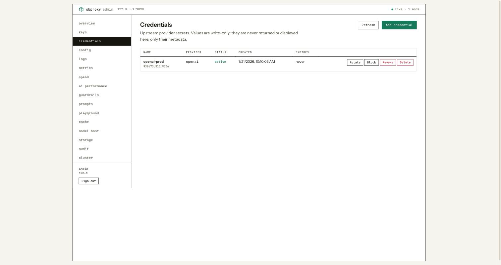

Upstream provider secrets: metadata only, never the secret itself.

- **Shows:** `GET /admin/credentials`.
- **Mutations:** `POST /admin/credentials` (create: a secret is
  either a `vault_ref` or a plaintext value the server envelope-seals
  immediately; either way it is sent once and never shown back),
  `PATCH /admin/credentials/{id}`, `POST /admin/credentials/{id}/revoke|block|unblock`,
  `DELETE /admin/credentials/{id}`.
- **Empty/error notes:** same `409` behavior as Keys when no key plane
  is configured; an empty list is normal, not an error.

## Config (`/config`)

The running configuration: the emitted OpenAPI surface, on-disk drift,
per-target health, and a raw config editor.

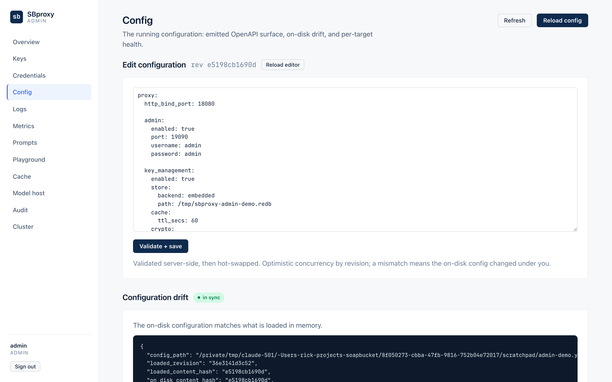

- **Shows:** `GET /api/openapi.json` (a readable summary plus the raw
  JSON), `GET /admin/drift` (in-sync or drifted badge with the
  content-hash diff), `GET /api/health/targets` (per-target health),
  `GET /admin/config` (the raw on-disk YAML, loaded into an editor on
  demand).
- **Mutations:** `POST /admin/reload` (behind a confirm dialog; this
  re-reads the config file from disk and hot-swaps the pipeline),
  `PUT /admin/config` (writes the editor's text back, with `if_match`
  set to the revision it was loaded at, so a concurrent edit surfaces
  as a conflict instead of clobbering).
- **Empty/error notes:** `GET /admin/drift` returning `503` (no
  `config_path` wired, an in-memory/test boot) renders as "drift
  unavailable," not an error banner; a reload while another reload is
  in flight (`409`) surfaces as "reload already in progress."

## Logs (`/logs`)


The queryable view over the recent-request ring buffer, with a live
tail and a runtime log-level control.

- **Shows:** `GET /api/requests` as a table filterable by method,
  status, path, cache result, retry presence, guardrail action, exact
  session ID, and exact custom property. A `guardrail_action` query
  param arrives pre-filled when you follow the "Blocked requests"
  link from Guardrails. `GET /api/ui-settings` supplies the trace-URL
  template used to link a trace ID to the tracing backend.
- **Columns and grouping:** a persisted property-column picker shows
  only redacted values from the current ring. "Group by session"
  renders roots, descendants, parents outside the ring, and ungrouped
  requests with per-session summaries. The Gateway column reads cache,
  retry, failover, load-balancer, and guardrail decisions as one causal
  rail; expanding a row shows every bounded field.
- **Mutations:** none directly on request data; `GET`/`PUT
  /admin/log-level` reads and sets the live tracing filter (e.g.
  `debug` or `sbproxy_ai=debug`) without a restart.
- **Live tail:** toggling it opens `GET /api/requests/stream`
  (Server-Sent Events) and appends new rows as they complete; the UI
  shows a "reconnecting" state if the stream drops and retries.
- **Empty/error notes:** an empty ring buffer (fresh process, no
  traffic yet) renders an empty state; the ring buffer is in-memory
  and resets on restart; for durable logs, see [access-log.md](access-log.md).

### Debugging a request

The Logs page is the debug loop for a misbehaving proxy, with no
restart at any step:

1. Raise the tracing level. The level control accepts a plain level
   (`debug`, `trace`) or a `tracing` filter directive like
   `sbproxy_ai=debug`, which turns on AI-path detail while the rest
   of the process stays at `info`. It applies immediately via
   `PUT /admin/log-level` and confirms with a toast.
2. Turn on Live tail and reproduce the problem. New requests stream
   in as they complete, with the same properties and gateway decisions
   as snapshot rows. The active filter predicate is applied to both.
3. Filter to the failure: by status (`5xx`), path substring, cache,
   retry, guardrail action, session, or custom property. The "Blocked
   requests" link from Guardrails arrives here pre-filtered.
4. Correlate with the server log. Every row carries a `request_id`
   and, when tracing is exporting, a `trace_id` that deep-links to
   your tracing backend via the `trace_url_template` setting. The
   Playground's debug toggle returns the same `request_id` plus the
   config revision, so a test request is easy to find in both
   places.
5. Drop the level back to `info` when done; leaving `trace` on is a
   log-volume hazard, not a correctness one.

## Sessions (`/sessions`, `/sessions/:sessionId`)

Recent logical interactions reconstructed entirely from the request ring.

- **Shows:** `GET /api/requests`, grouped by `session_id` and linked by
  `parent_session_id`. The index rolls up request count, input and output
  tokens, cost, wall-clock duration, and worst HTTP status. Detail pages show
  one session's calls oldest first, their gateway decision rails, properties,
  request and trace IDs, and links to a parent or child that remains in the
  ring.
- **Mutations:** none. "Open in Logs" applies the exact session filter there.
- **Retention boundary:** this is not durable trace storage, a span waterfall,
  or replay. A restart or request-ring eviction can remove some or all of a
  session, and the UI labels parents that fall outside the current ring.

## Metrics (`/metrics`)

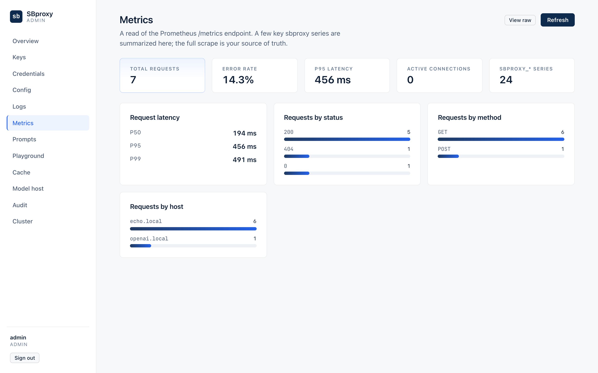

A live read of the Prometheus `/metrics` endpoint, parsed
client-side. While the page is open it samples the endpoint every
five seconds and charts what happened *between* samples: counter
deltas become per-second rates, histogram bucket deltas become
per-interval latency percentiles. The raw scrape stays one click away
and remains the source of truth.

- **Shows:** `GET /metrics`, rendered as three layers.
  - *Numeric tiles* with trend sparklines: requests/s, total
    requests, error rate, p95 latency, active connections, AI tokens,
    and AI cost.
  - *Line charts*: requests per second and error rate over the
    sampled window, p50/p95/p99 latency, and AI token throughput
    split by direction. Hovering shows a crosshair with exact values.
  - *Bar breakdowns and tables*: requests by status (2xx green, 4xx
    amber, 5xx red) and method, errors by type, cache and auth
    results, bytes by direction, tokens by provider and direction,
    per-model token throughput, and model-host gauges. An **origins
    table** lists requests, success rate, and p50/p95 latency per
    configured origin, the first place to look when several tenants
    share one gateway.
- **Filters:** with more than one configured origin, an origin picker
  scopes the page to one `Host`; "all origins" is the default. The
  tiles, traffic charts, latency percentiles, and the status, method,
  errors, cache, auth, bytes, and token panels all honor it (the AI
  panels via the `origin` label on the attributed counters). A panel
  whose series carry no origin dimension (provider errors, per-model
  throughput, model-host gauges) stays an aggregate and says
  "all origins" while a filter is active.
- **Live control:** the Live toggle pauses and resumes sampling.
  Three consecutive failed scrapes pause it automatically and say so.
- **Mutations:** none.
- **Empty/error notes:** a series with no samples yet (no traffic of
  that kind) simply does not render its tile or panel; the page never
  treats "no data" as an error. The initial fetch failing renders the
  error state; a background sample failing raises a toast instead of
  blanking charts that already have data.

## Spend (`/spend`)

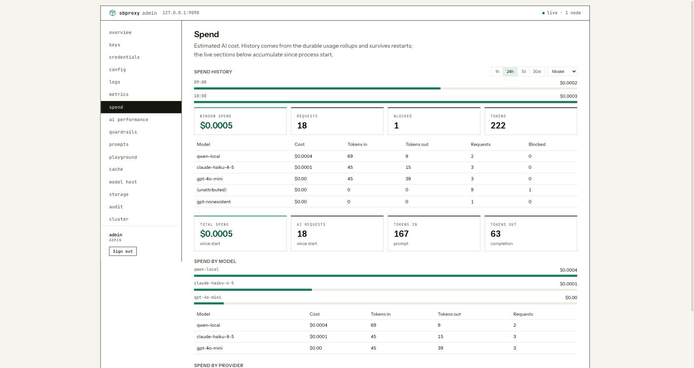

Estimated AI cost: live totals since process start, plus durable
windowed history.

- **Shows:** `GET /metrics` for live totals and breakdowns (by model,
  provider, origin, API key, team, project; attribution partitions
  are omitted from a breakdown when the label is absent, not shown as
  a zero row), `GET /api/usage/spend?window=...&group_by=...` for the
  durable rollup history chart, which survives a restart unlike the
  live counters. History groups by provider, model, tenant, team,
  API key, project, or origin; rollup rows recorded by builds that
  predate the origin dimension fold into the unattributed segment. The
  response also advertises promoted property keys, which appear as
  `Property: <key>` groupings and query as `group_by=property:<key>`.
- **Mutations:** none.
- **Empty/error notes:** no AI traffic yet renders an empty state; a
  `window`/`group_by` combination with no matching rollup data renders
  an empty chart, not an error. If a selected property disappears in
  another window, the selector preserves it with an unavailable hint
  rather than changing the operator's query.

## AI performance (`/ai-performance`)

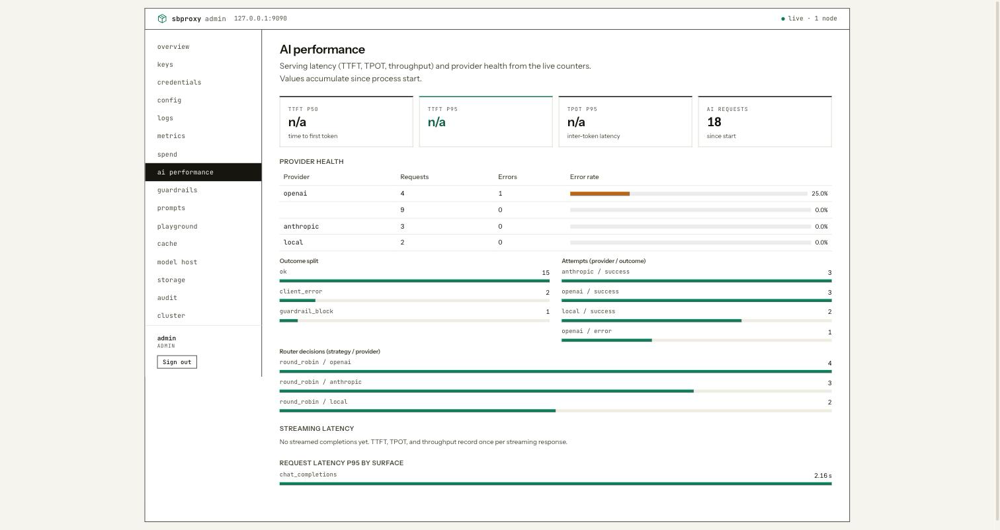

Serving latency (time-to-first-token, inter-token latency, throughput)
and provider health from the live counters.

- **Shows:** `GET /metrics`, specifically the TTFT/TPOT/throughput
  histograms, per-provider request/error counts and error rate,
  failover reasons, cascade-tier outcomes, and router-strategy
  decisions. When context-compression policies are active, a
  compression section reports compressed requests, tokens and cost
  saved, per-lever savings, request outcomes, and the average
  compression ratio per lever.
- **Mutations:** none.
- **Empty/error notes:** no AI traffic renders an empty state
  explaining that panels light up after the first request through an
  `ai_proxy` origin; streaming-latency panels specifically need at
  least one streamed completion (TPOT needs at least two tokens in
  that stream) and say so rather than showing a misleading zero.

## Guardrails (`/guardrails`)

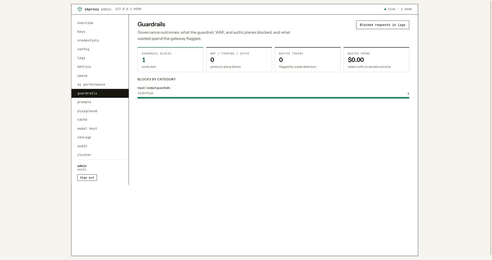

Governance outcomes: what the guardrail, WAF, and object-authz planes
blocked, and what wasted spend the gateway flagged.

- **Shows:** `GET /metrics`: guardrail blocks by category, streaming
  guardrail violations, context-poisoning findings, WAF/HTTP-framing/
  object-authz blocks, and wasted tokens/cost by kind (duplicate
  requests, abandoned streams, validation failures, context bloat,
  failover losers).
- **Mutations:** none. A "Blocked requests in Logs" action link jumps
  to Logs pre-filtered by `guardrail_action=block`.
- **Empty/error notes:** no guardrail activity since start renders an
  empty state pointing at the AI gateway guardrails config, not an
  error; this is the expected state for a config with no guardrails
  declared.

## Alerts (`/alerts`)

Read-only alert operations over the runtime installed from `sb.yml`.

- **Shows:** `GET /api/alerts`: built-in rules with thresholds, current
  reading, sample floor, state, and latest evaluation; sanitized channels with
  delivery health and bounded errors; and up to 200 process-lifetime fired,
  resolved, and test events. Webhook and Slack targets include only scheme and
  host. PagerDuty exposes only whether a routing key is configured.
- **Mutations:** `POST /api/alerts/test` queues one targeted channel test. The
  page polls briefly until that channel's `last_attempt_at` changes and then
  reports the delivery result. It cannot edit rules or channels.
- **Authority and retention:** `sb.yml` is authoritative. Rule state, channel
  health, and history reset with the process. The provider error-rate rule
  remains inactive below 10 attempts in an evaluation window.
- **Empty/error notes:** no `proxy.alerting` block renders a disabled state;
  an enabled runtime with no channels keeps tests unavailable; no history is a
  normal process-lifetime empty state.

## Prompts (`/prompts`)

The prompt overlay snapshot: managed prompt versions per host and
name, and which version is pinned.

- **Shows:** `GET /admin/prompts`.
- **Mutations:** `POST /admin/prompts/{host}/{name}/versions` (add a
  version), `PUT /admin/prompts/{host}/{name}/pin` (pin the default).
  Persisted to the operator-configured redb file only when
  `proxy.admin.prompt_persistence_path` is set; otherwise mutations
  are in-memory and reset on restart.
- **Empty/error notes:** no prompts registered is an empty state, not
  an error.

## Playground (`/playground`)

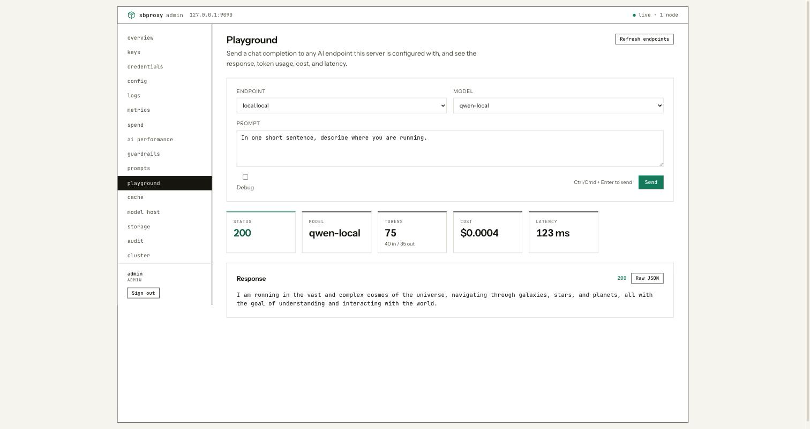

Send a chat completion to any AI endpoint this server is configured
with, and see the response, token usage, cost, and latency.

- **Shows:** `GET /admin/api/playground/endpoints` (every AI origin
  the live pipeline serves, with each provider's declared models).
- **Mutations:** `POST /admin/api/playground/chat`, which requires the
  `admin` role (a `read_only` operator gets `403` here even though the
  endpoint list is read-only). Calls the same AI client the data plane
  uses, so usage, cost, and latency are real, but it does **not**
  traverse the data-plane pipeline: per-origin guardrails, transforms,
  and routing policy do not apply here. A debug toggle adds a
  `request_id` and the config revision to the response for
  server-log correlation.
- **Empty/error notes:** no AI origins configured is an empty state
  ("nothing to talk to yet"); an upstream failure surfaces the
  provider's error, not a generic one.

## Cache (`/cache`)

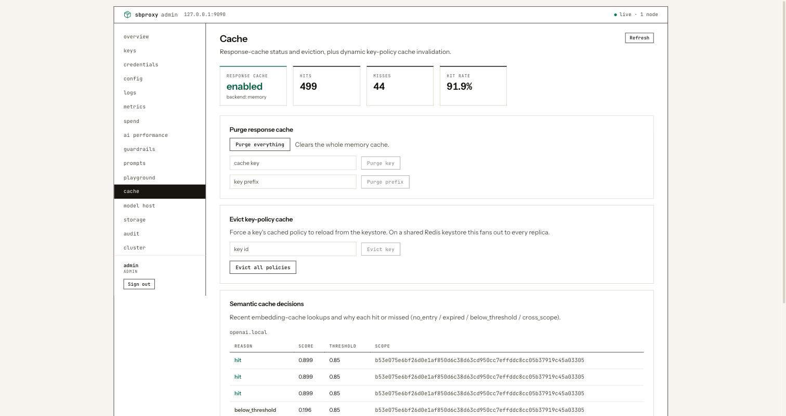

Response-cache status and eviction, plus dynamic key-policy cache
invalidation and semantic-cache debugging.

- **Shows:** `GET /admin/cache` (enabled, backend, whether prefix
  purge is supported), `GET /admin/cache/semantic` (recent embedding
  cache hit/miss decisions per AI origin), `GET /metrics` (cache-
  related counters shown alongside). With more than one origin in
  play, an origin picker scopes the hit/miss tiles and the semantic
  decisions to one origin; purge controls always act on the whole
  backend and stay global.
- **Mutations:** `POST /admin/cache/purge` (all / by exact key / by
  prefix; prefix purge is disabled in the UI when the backend does
  not support it), `POST /admin/cache/key-policy/evict` (one key or
  all).
- **Empty/error notes:** `{"enabled": false}` (no origin turned on
  response caching) renders as "not enabled," not an error; purge
  against a disabled cache returns `409` and renders the same way; no
  origin has a semantic cache configured renders that panel empty.

## Model host (`/model-host`)

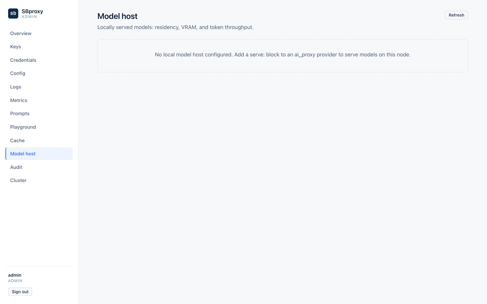

Desired model deployments and local runtime residency, controlled from
one operational view, including, on a cluster authority node, signed
fleet-wide deployment publication.

- **Shows:** `GET /admin/model-host/catalog` (bundled models and exact
  variants with support evidence), `GET /admin/model-host/deployments`
  (the desired-state document: authority, read-only flag, revision),
  `GET /admin/model-host/status` (runtime state per deployment),
  `GET /admin/cluster/status` and `GET /admin/cluster/deployments`
  (cluster roster and the signed deployment bundle, when clustered).
- **Mutations:** `PUT /admin/model-host/deployments` (add/edit/remove
  a deployment, allowed only under `admin_managed` authority; compare-and-
  swap on `expected_revision`), `POST /admin/cluster/deployments` (on
  an authority node, publish the signed complete map),
  `POST /admin/model-host/load|stop|reset` (per-deployment lifecycle).
- **Empty/error notes:** under `file_managed` authority (the deployment
  map is owned by `sb.yml`) or as a cluster verifier node, the save
  action is replaced with an explanation of why this node is read-only
  instead of a form. A revision conflict on save keeps the submitted
  form and the conflicting server state both visible and requires an
  explicit retry; it never silently discards your edit or silently
  overwrites the server's. Removal is blocked while a deployment's
  runtime evidence is stale or it is ready/preparing/draining, with the
  reason shown inline.

## Storage (`/storage`)

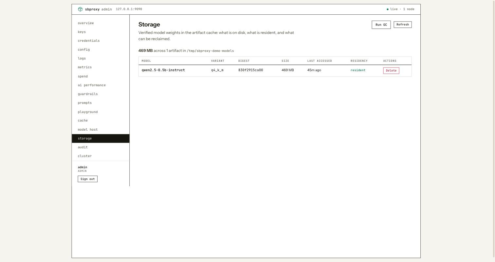

Verified model weights in the artifact cache: what is on disk, what is
resident, and what can be reclaimed.

- **Shows:** `GET /admin/model-host/files` (cache root, total bytes,
  per-artifact size, last-accessed time, and whether it currently
  backs a ready replica).
- **Mutations:** `DELETE /admin/model-host/artifacts/{digest}` (remove
  one artifact, blocked with a stated reason if it is configured,
  resident, pinned, leased, or file-locked), `POST /admin/model-host/gc`
  (protected LRU collection down to the configured cache budget).
- **Empty/error notes:** no model host configured renders an empty
  inventory (`cache_root: null`), not an error; GC with no configured
  cache budget returns `409` and disables the control with a tooltip
  explaining there is no target to collect toward.

## Audit (`/audit`)

Rate-limit budget actions (suspend, throttle, resume) with the reason
each fired.

- **Shows:** `GET /api/audit/recent?limit=100`, `GET /api/rate_limits/budget`
  (per-workspace tier and cool-down state).
- **Mutations:** `POST /api/rate_limits/resume` (manually clear a
  workspace's escalation back to `normal`).
- **Empty/error notes:** no `rate_limits:` block configured returns an
  empty audit list and a `404` on the budget snapshot; both render as
  "not configured," not an error, since there is nothing to audit.

## Cluster (`/cluster`)

Membership, model placement, and rollout health across the fleet.
For a runnable example that lights this page up, see
[a three-node mesh on one machine](#example-a-three-node-mesh-on-one-machine).

- **Shows:** `GET /admin/cluster/status` (the complete node roster,
  including failed/excluded members, never hidden to make the fleet
  look healthier, plus a health rail, prominent unhealthy-node alerts, and
  per-deployment placement/rollout detail), `GET /admin/cluster/metrics`
  (fleet-aggregated metrics, shown separately so a metrics-tier outage
  never hides roster or rollout evidence).
- **Mutations:** none on this page; publishing a signed deployment
  bundle happens from Model host. This page is read-only status and
  alerting.
- **Empty/error notes:** outside a configured cluster, this renders a
  single-node view rather than an error (there is a "fleet" of one).
  A metrics-endpoint `404` (mesh metrics tier not configured) renders
  "metrics not enabled" without blocking the roster/health sections,
  which come from a separate call.

## Example: a three-node mesh on one machine

The Cluster page (and the node count in the top bar) come alive with
a real mesh. `examples/model-cluster-symmetric/` runs the same config
file once per node with per-node environment, so three terminals give
you a three-node local cluster:

```bash
# Terminal 1 (node a, also the seed)
SB_NODE_ID=node-a SB_HTTP_PORT=8081 SB_ADMIN_PORT=9091 \
SB_GOSSIP_PORT=17946 SB_TRANSPORT_PORT=18946 SB_MODEL_PORT=19443 \
SB_STATE_DIR=./state/node-a SB_SEED=127.0.0.1:17946 \
sbproxy examples/model-cluster-symmetric/sb.yml

# Terminal 2 (node b)
SB_NODE_ID=node-b SB_HTTP_PORT=8082 SB_ADMIN_PORT=9092 \
SB_GOSSIP_PORT=17947 SB_TRANSPORT_PORT=18947 SB_MODEL_PORT=19444 \
SB_STATE_DIR=./state/node-b SB_SEED=127.0.0.1:17946 \
sbproxy examples/model-cluster-symmetric/sb.yml

# Terminal 3 (node c)
SB_NODE_ID=node-c SB_HTTP_PORT=8083 SB_ADMIN_PORT=9093 \
SB_GOSSIP_PORT=17948 SB_TRANSPORT_PORT=18948 SB_MODEL_PORT=19445 \
SB_STATE_DIR=./state/node-c SB_SEED=127.0.0.1:17946 \
sbproxy examples/model-cluster-symmetric/sb.yml
```

Open any node's admin UI (they each run their own admin server; node
a is `http://127.0.0.1:9091/admin/ui/`) and:

- The top bar reads "live · 3 nodes" once gossip converges, usually
  within a few seconds.
- **Cluster** shows the full roster with membership state,
  per-node health, roles, and last-ack age. Kill one node
  (`Ctrl-C` in its terminal) and its row degrades to `suspect`, then
  `dead`, and an unhealthy-node alert appears. The roster keeps the
  dead row visible rather than hiding failed members.
- **Keys** minted on one node propagate: the example wires the key
  cache's mesh tier, so revoking a key on node a is enforced on
  node b without a restart.
- **Model host** on a cluster-authority setup is where a signed
  deployment bundle is published fleet-wide; see
  [model-host.md](model-host.md) for that flow.

One local-topology quirk: browsers scope cookies by host, not port,
so signing into one node's admin UI on `127.0.0.1` signs you out of
the others (each login overwrites the shared session cookie). When
you want several node dashboards open side by side, use separate
browser profiles or give each node its own loopback address
(`127.0.0.2`, `127.0.0.3`).

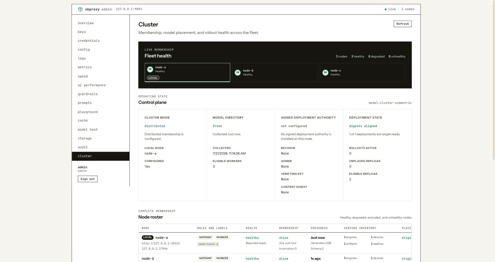

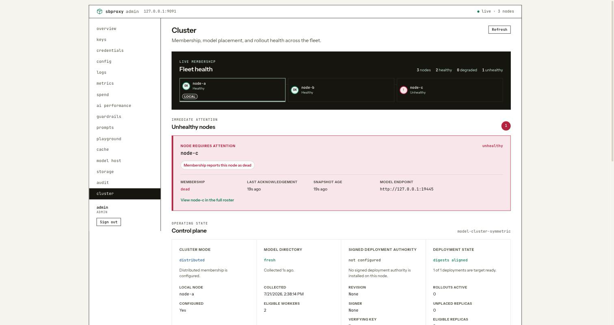

## See also

- [admin-api-guide.md](admin-api-guide.md) - the task-oriented API walkthrough this UI is a client of.
- [admin-api-reference.md](admin-api-reference.md) - every route this UI calls, in full.
- [admin.md](admin.md) - enabling the admin server, TLS, roles, and the security checklist.
- [key-management.md](key-management.md) - the policy model behind the Keys page.
- [model-host.md](model-host.md) - the config behind the Model host and Storage pages.
