# Admin UI

*Last modified: 2026-08-29*

The built-in admin UI is a Vue 3 + Vite single-page app that drives the
same [admin API](admin-api-reference.md) any curl script can call. It
adds no server-side behavior of its own. This page is the operator
guide: what each page shows, what it can mutate, and which API paths
back it. For enabling the admin server itself (port, TLS, roles), see
[admin.md](admin.md); for the raw route contracts, see
[admin-api-reference.md](admin-api-reference.md).

The chrome is constant across pages. A top bar shows the admin host,
a live dot that turns red if `GET /health` stops answering, and the
cluster size from `GET /admin/cluster/status` ("live · 3 nodes"), so
a mesh that loses a node is visible from any page. Actions confirm or
fail through toast notifications in the bottom-right corner: a
mutation that succeeds says what it did ("Key revoked"), and one that
fails names the action and carries the server's hint. Validation
detail that belongs next to a form (a config document that failed to
compile, a policy revision conflict) stays inline instead.

Every page header includes a Documentation link for that view. These
are passive external anchors to `https://sbproxy.dev/docs/`: the
console does not fetch or preload documentation, and the destination
opens in a new tab. This is an intentional air-gapped behavior. If the
browser cannot reach the public site, only the new tab fails to load;
the console and every control in it remain operational. Air-gapped
operators can mirror the same Markdown from this repository's `docs/`
directory into an internal documentation service.

Pages that refresh on a timer keep the last good data on screen when a
refresh fails, rather than blanking a dashboard over one bad response.
Because that would otherwise go stale in silence, the first failure of
a streak raises an error toast naming what stopped refreshing
("Refreshing alerts failed"); recovery is silent, and a second failure
after a recovery reports again. Polling pauses while the browser tab is
hidden and catches up immediately when you return, so a console left
open overnight neither burns requests nor shows you yesterday's numbers.

## Build and enable it

The UI is off by default and lives behind a cargo feature, so a lean
binary carries no front-end assets:

```bash
cd ui
npm ci
npm run build          # writes ui/dist/

cd ..
cargo build -p sbproxy --release --features embed-admin-ui
```

`npm run build` produces a hashed `index.html` plus `assets/*` under
`ui/dist/`; the `embed-admin-ui` feature embeds that directory into
the binary via `include_dir!` at compile time and mounts
`/admin/ui/*` on the admin server. Skip the feature and `/admin/ui`
returns a `404` whose body names the two commands above; the default
build never requires a prior `npm run build` to succeed.

`crates/sbproxy-core/build.rs` declares `ui/dist` as an input, so
changing the UI invalidates the crate and the next `cargo build` picks
it up. That script exists because cargo cannot see through
`include_dir!` to the files it reads: without it, `npm run build`
followed by `cargo build` produced a binary carrying the *previous* UI,
with nothing failing and nothing warning. The browser simply served a
stale page, and rebuilding again did not help, because cargo still
considered the crate fresh. If you are debugging a UI change that will
not appear, check that you rebuilt with the feature on before
suspecting the cache.

Then, with the admin server enabled (see [admin.md](admin.md#enabling-it)),
open:

```text
http(s)://<bind>:<port>/admin/ui/
```

The UI is served under the `/admin/ui/` base (Vue Router runs in
history mode with that base; the admin server does SPA fallback to
`index.html` so deep links and page refreshes resolve without a
server-side rewrite map).

## Login

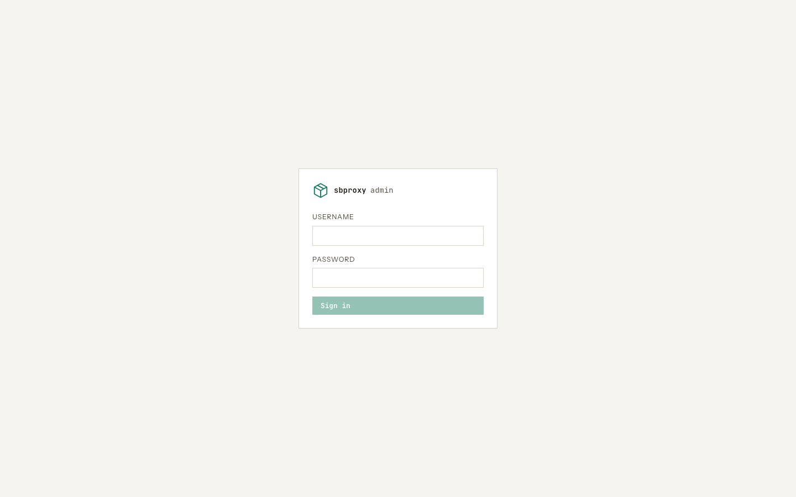

Hitting the admin server's root (`/`, `/admin`) redirects to the
console at `/admin/ui/`, so the bare host in a browser lands somewhere useful
instead of on an API 404. From there, any page you open without a live
session sends you to `/admin/ui/login` with the page you wanted preserved in
the `next` query parameter, and signing in returns you to it.

On load, the app calls `GET /admin/session` to recover an existing
session (surviving a page refresh); while that is in flight it shows a
brief loading state rather than flashing the login form. Unauthenticated,
it renders a username/password form that calls `POST /admin/login`.
Success sets the `HttpOnly` session cookie and stores the returned CSRF
token in memory for subsequent mutations; a wrong password surfaces
"Invalid username or password," other failures show the raw error. The
signed-in identity's username and role (`admin` or `read_only`) render
in the sidebar footer, with a Sign out control that calls
`POST /admin/logout`.

A session that expires while you are working is caught wherever it
surfaces: any request answered `401` clears the stored session and
redirects to the login form with a note that the session expired,
instead of leaving a page half-loaded with an error nobody can act on.
No browser credential dialog opens over the top of that. The console
marks its own calls with `X-Requested-With: XMLHttpRequest`, and the
admin server answers a marked 401 without the `WWW-Authenticate` header
that makes a browser prompt (see
[admin-api-guide.md](admin-api-guide.md#what-a-refused-request-gets-back)),
so signing back in always happens on the app's own form.

The UI does not hide pages or controls based on role: a `read_only`
operator sees every page and every button. Attempting a mutation as
`read_only` still round-trips to the server, which returns `403`; the
page's error state renders that response rather than pre-empting it
client-side. See [admin-api-guide.md](admin-api-guide.md#authenticating-basic-vs-session--csrf)
for the full login/CSRF contract this drives.

## Overview (`/`)

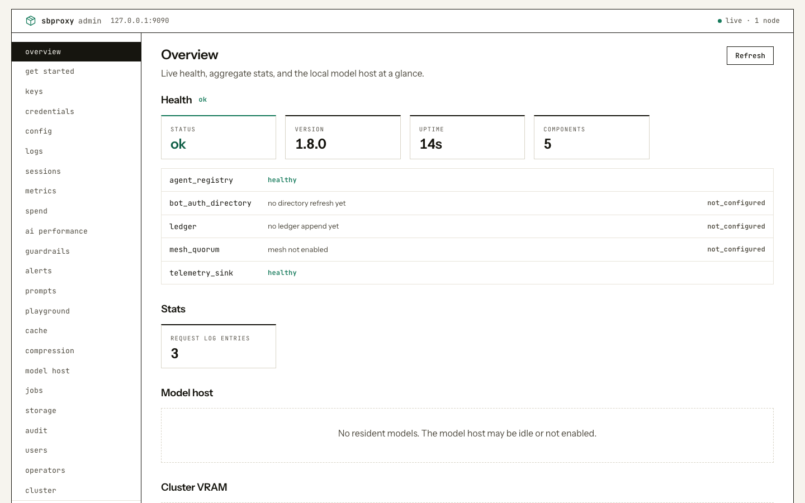

Live health with per-component checks, version and uptime, a
request-log count, the certificate store this node opened, and the
local model host at a glance.

- **Shows:** `GET /health` (status, version, build, uptime,
  per-component checks), `GET /api/stats` (request-log entry count),
  `GET /admin/model-host/status` (serving summary), and `GET /metrics`
  for the `sbproxy_cert_store_degraded{backend}` gauge.
- **Mutations:** none.
- **Empty/error notes:** a component reporting `not_configured` is
  expected on a minimal config and renders as informational, not an
  error; only an `unhealthy` component or a fetch failure renders the
  error state.

### The certificate store row

`/health` does not carry the certificate store, so this page reads the
scrape for one gauge. It has four states, and only one of them is the
plain reading of the number:

| Gauge | Row reads | What it means |
|---|---|---|
| absent | `not reported` | No certificate store was opened. Normal for a node with no ACME configuration. |
| `0`, backend not `memory` | `ok` | The backend named in `acme.storage_backend` opened, and certificates persist. |
| `0`, backend `memory` | `in memory` | The store opened and persists nothing. Certificates are lost on restart and re-issued on every boot. |
| `1` | `degraded` | The backend could not be opened and the node is serving from an in-memory store. |
| scrape failed | `unavailable` | `GET /metrics` did not answer, so the state is unknown. Not a report that no store was opened. |

The last two rows of the gauge both raise a warning block above the
component list, because neither has any other symptom until the CA
rate-limits the hostname. Certificates do not survive a restart and are
issued again on every boot.

A `1` is always a pod-local backend (`redb`, `sqlite`, `memory`); a
shared backend that cannot be opened refuses to start rather than
degrade, since an in-memory fallback inherits the single-node locking
defaults and would hand every replica its own ACME issuance lease.

Two readings would be wrong and the page avoids both. Summing the gauge
erases the absent state, since an absent family sums to zero and would
render as healthy. Reading the value alone erases
`acme.storage_backend: memory`, which opens cleanly, reports a truthful
`0`, and still costs a fresh certificate on every boot.

## Get started (`/get-started`)

The shortest path from an empty model host to a running local model.
It presents deployable catalog variants, writes the selected deployment
to desired state, starts it, and follows the resulting durable job.

- **Shows:** `GET /admin/model-host/catalog`,
  `GET /admin/model-host/deployments`, `GET /admin/model-host/status`,
  and `GET /admin/model-host/jobs`.
- **Mutations:** `PUT /admin/model-host/deployments` followed by
  `POST /admin/model-host/load` for the chosen deployment.
- **Empty/error notes:** an empty catalog explains that no deployable
  variants are configured. File-managed or cluster-verifier desired
  state remains read-only and names the authority that must be changed.
  Once a load is queued, the page shows its current job state and links
  to the Jobs view for the full history.

## Keys (`/keys`)

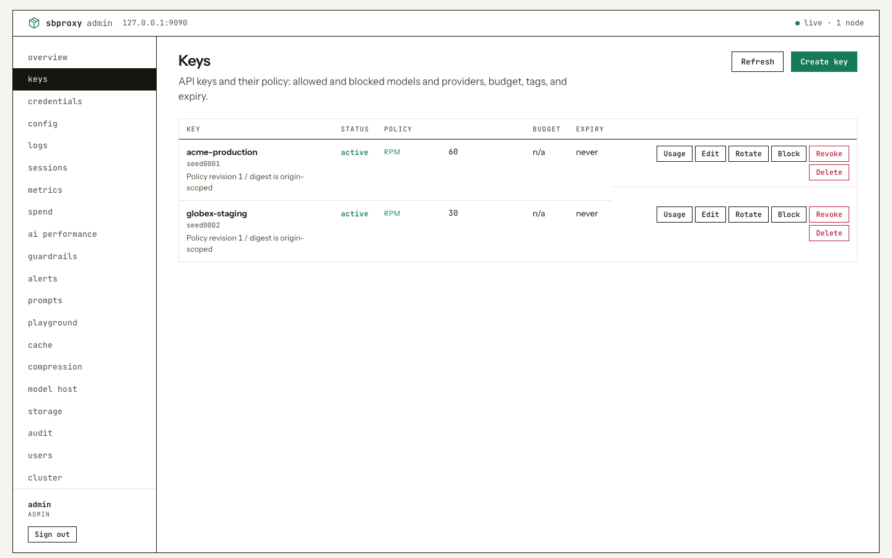

Every virtual key with its status, policy summary, budget, and expiry,
with the full lifecycle inline.

- **Shows:** `GET /admin/keys` (the table), `GET /admin/keys/policy-schema`
  (drives the create/edit form's fields and validation, read once).
- **Mutations:** `POST /admin/keys` (create: the plaintext token
  renders once in a copy-once modal and is never retrievable again),
  `PATCH /admin/keys/{id}` (edit policy, gated by `expected_revision`),
  `POST /admin/keys/{id}/revoke|block|unblock|rotate`,
  `POST /admin/keys/{id}/budget-override` (Raise budget: a temporary,
  auto-expiring raise on the base budget; the row then shows a "raised"
  badge with the increase, a countdown to expiry, and who granted it),
  `DELETE /admin/keys/{id}/budget-override` (Clear raise),
  `DELETE /admin/keys/{id}`. The edit modal also calls
  `POST /admin/keys/{id}/effective-policy/preview` live as you edit, so
  you can see the resolved policy before saving. A usage panel calls
  `GET /admin/keys/{id}/usage` for live request/token/budget counters.
- **Empty/error notes:** a revision conflict on save (someone else
  edited the key concurrently) shows the conflicting server state
  inline rather than silently overwriting it; a `409` on revoke/block
  on an already-revoked key surfaces as "revoked key is terminal." No
  keys configured renders an empty-table state, not an error; this is
  normal until `key_management` mints its first key. If
  `key_management` has no keystore backend configured at all, every
  call here returns `409`, surfaced as "Policy controls unavailable."

## Agents (`/agents`)

The owner-approval queue for agents that registered themselves, and the
signed catalog of agents somebody else vouched for. A pending registration
is a question an operator has to answer, and before this page the only way
to see one was a curl against the admin API.

- **Shows:** `GET /admin/agent-registry` for the five counts,
  `GET /admin/agent-registry/registrations` for the queue, and
  `GET /admin/agent-registry/catalog` for the verified catalog.
- **Mutations:** `POST /admin/agent-registry/registrations/{agent_id}/approve`,
  `.../reject`, `.../revoke`, and `POST /admin/agent-registry/refresh` to
  reverify the feed on disk. The reject button stays disabled until a reason
  is typed, because a rejection refuses that description for good.
- **Tenancy:** the queue is scoped to the operator's own tenant when
  `proxy.admin.operators[].tenant` names one; the catalog and the reverify
  button are deployment-wide and the page hides both for a scoped operator,
  matching the `403` the routes answer.
- **Empty/error notes:** every route answers `404` when
  `proxy.agent_registry` is absent or disabled, and the page renders that as
  "not configured" rather than as an error. A configured registry with no
  feed says so instead of showing an empty catalog that looks like a
  publisher outage. Secret rotation is deliberately not on this page: it
  authenticates with the agent's own registration access token, which an
  operator does not hold.

See [agent-registry.md](agent-registry.md) for the config block and the feed
verification chain.

## Notifications (`/notifications`)

Outbound webhook subscriptions, and the deliveries that ran out of attempts.
The deadletter queue is the reason this page exists: a delivery that used
its whole attempt budget is the one outcome that needs a human.

- **Shows:** `GET /admin/notifications` for the four counts,
  `GET /admin/notifications/subscriptions`, and
  `GET /admin/notifications/deadletters?limit=50`, which is paged and
  carries no event bodies. **load more** walks the pages.
- **Mutations:** `POST /admin/notifications/subscriptions` (create, which is
  the only response that ever carries the signing secret; the page shows it
  in a dismissible banner and does not store it),
  `PATCH .../subscriptions/{id}` (pause, resume, repoint),
  `POST .../subscriptions/{id}/rotate`, `DELETE .../subscriptions/{id}`,
  `POST /admin/notifications/deadletters/{delivery_id}/replay`, and
  `DELETE /admin/notifications/deadletters/{delivery_id}`. Rotate, delete,
  and discard each ask first, matching the rest of the console: rotating
  invalidates the receiver's secret immediately and no read path returns the
  old one, deleting takes the filters and key with it, and discarding means
  the receiver never gets that event.
- **The filter box starts empty**, and the subscribe button stays disabled
  until something is typed. A filter that reaches the per-request lifecycle
  events shows a checkbox that has to be ticked, because those fire once per
  proxied request and the server refuses them without it.
- **Empty/error notes:** every route answers `404` when
  `proxy.notifications` is absent or disabled, and the page renders that as
  "not configured" rather than as an error. That is read off the response
  status, not off the error text. An empty deadletter queue is the healthy
  state, not a missing feature.

See [notifications.md](notifications.md) for the delivery contract, the
signature construction, and why the retry budget stops at three attempts.

## Credentials (`/credentials`)

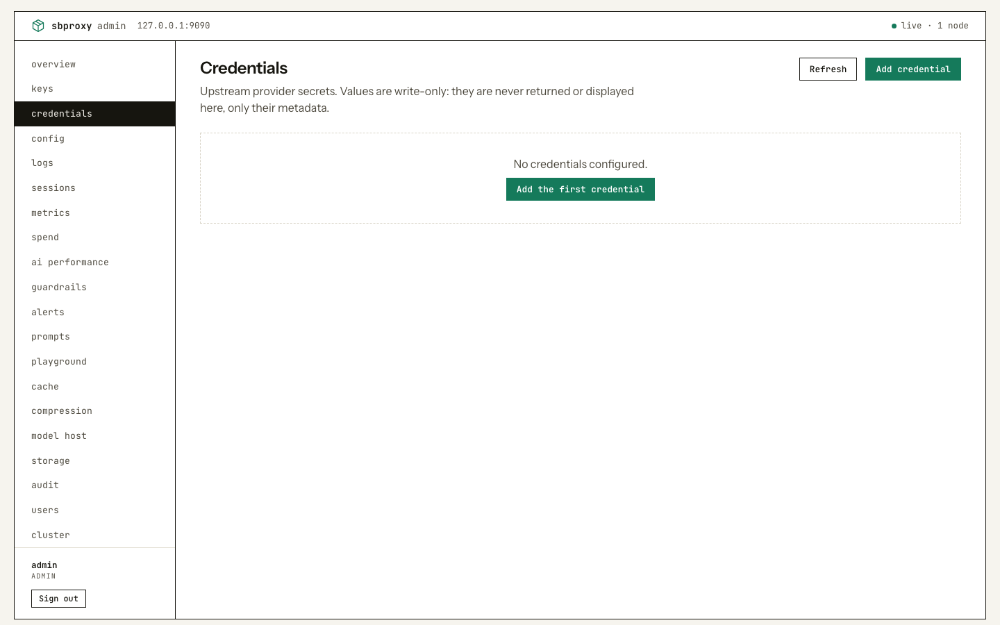

Upstream provider secrets: metadata only, never the secret itself.

- **Shows:** `GET /admin/credentials`.
- **Mutations:** `POST /admin/credentials` (create: a secret is
  either a `vault_ref` or a plaintext value the server envelope-seals
  immediately; either way it is sent once and never shown back),
  `PATCH /admin/credentials/{id}`, `POST /admin/credentials/{id}/revoke|block|unblock`,
  `DELETE /admin/credentials/{id}`.
- **Empty/error notes:** same `409` behavior as Keys when no key plane
  is configured; an empty list is normal, not an error.

## Config (`/config`)

The running configuration: where it comes from, the emitted OpenAPI
surface, on-disk drift, per-target health, and a raw config editor.

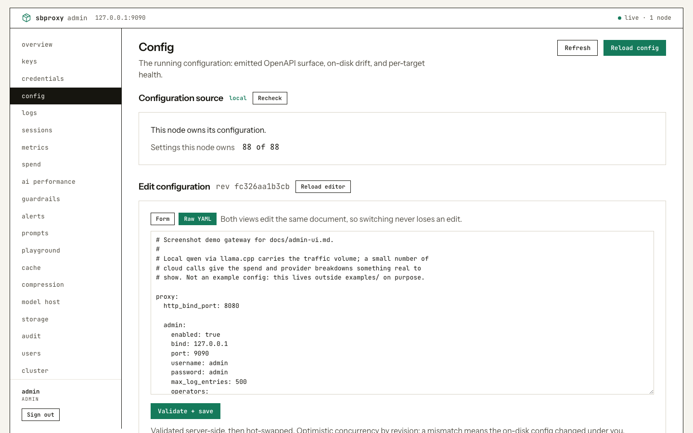

- **Shows:** `GET /admin/config/effective` (a Configuration source
  panel: a Local or Managed elsewhere badge, the resolved git commit
  and the applied authority revision where they apply, how many
  settings this node owns, and an expandable list of the ones set
  elsewhere), `GET /api/openapi.json` (a readable summary plus the raw
  JSON), `GET /admin/drift` (in-sync or drifted badge with the
  content-hash diff), `GET /api/health/targets` (per-target health),
  `GET /admin/config` (the raw on-disk YAML, loaded into an editor on
  demand).
- **Mutations:** `POST /admin/reload` (behind a confirm dialog; this
  re-reads the config file from disk and hot-swaps the pipeline),
  `PUT /admin/config` (writes the editor's text back, with `if_match`
  set to the revision it was loaded at, so a concurrent edit surfaces
  as a conflict instead of clobbering).
- **The editor locks itself where the node does not own its config.**
  When `locally_owned` is `false`, the textarea goes read-only, the save
  button is disabled, and a banner names the repository or the authority
  and says to change it there. This is a courtesy, not the enforcement:
  the server refuses the same write with a `409` whether it arrives from
  this page or from `curl`, and showing the lock only means an operator
  finds out before typing an edit rather than after. The lock requires a
  definite answer, so a request still in flight or one that failed
  leaves the editor usable rather than making an admin-API hiccup look
  like a permanent loss of control over the node.
- **Two different conflicts share `409`.** A revision mismatch renders
  as "reload the editor and reapply." An ownership refusal
  (`code: config_not_locally_owned`) names the settings at fault and the
  place they are actually set, because reapplying would fail the same
  way. In the form view the refusal also renders on the offending
  fields: a `409` naming six paths as one banner is a puzzle, and the
  same information attached to six fields is a to-do list.

### Form and raw YAML

The editor has two views of the same document, switched with the
Form / Raw YAML buttons.

**The form is generated from `GET /admin/config/schema`**, never from a
hand-maintained field list, so a field added to the config types
appears without a UI change. Fields carry the doc comment from the
Rust type as help text, enums render as pickers, and a value that
cannot be the declared type (a port typed as a word) is a red field
rather than a round trip and a `400`.

**It does not render everything, and says so where it stops.** Four
fields are `serde_json::Value` in the config types (`origins[].action`,
`policies`, `transforms`, `authentication`), so the schema describes no
shape for them and no form can. Those drop to a YAML box scoped to that
one node, labeled with why. The detection is by shape rather than by a
list of known paths, so a fifth opaque field added later falls back the
same way instead of rendering as a section with no settings in it.

**Switching views never loses an edit**, because there is only one
document: a form edit applies its change to the same text the raw view
shows. That change goes through the YAML document tree rather than a
parse and re-serialize, so **comments and key order survive an edit**.
A form that rewrote the file on every change would be a worse editor
than the textarea it replaced, and operators would be right to call it
data loss.

Fields the node does not own render locked with an `authority <id> rev
<n>` or `git <commit>` badge. One case is deliberately locked without a
definite answer: a path whose key contains a dot, which is every origin
hostname. The server's provenance map joins path segments with dots, so
`origins["api.test"].action` and `origins.api.test.action` are the same
string and a lookup cannot tell them apart. The form reports "ownership
unclear" and sends the operator to the raw editor, where the server
judges the write properly. Guessing would either lock a field they own
or unlock one they do not.

The raw textarea remains, and on a node with no remote config layer
nothing above changes anything: every field is editable, exactly as
before.
- **Empty/error notes:** `GET /admin/drift` returning `503` (no
  `config_path` wired, an in-memory/test boot) renders as "drift
  unavailable," not an error banner; a reload while another reload is
  in flight (`409`) surfaces as "reload already in progress." On a node
  with no remote layers the Configuration source panel still renders,
  reading "This node owns its configuration," because the affirmative
  answer is what tells an operator the editor is trustworthy.

### Config history

A read-only timeline of every revision this node has applied, present when
[`proxy.config_history.enabled`](configuration.md#config_history) is
turned on. It is off by default, and the panel says so with an empty-state
message naming the config key rather than rendering an error.

- **Shows:** `GET /admin/config/history` as a table (revision, state --
  `applied`, `good`, `failed`, or `reverted` -- blast radius, provenance,
  when it applied, and the actor), with the ring's `lineage` id and the
  `lkg_revision` pointer in the section header. Clicking a row fetches
  `GET /admin/config/history/{digest}` and expands a detail row showing
  the `plan_text` diff between that revision and the config running now.
- **No mutations.** There is no button here to promote a revision to
  last-known-good or to roll one back; `mark_good` is storage with no
  caller yet, so the panel is a diagnostic and audit trail, not a rollback
  control. See [configuration.md](configuration.md#config_history) and
  [admin-api-reference.md](admin-api-reference.md#get-adminconfighistory)
  for what the ring records today and what it does not do yet.

## Extensions (`/extensions`)

Use Extensions after startup or a reload to verify which extension code the
running proxy actually accepted. The page reports the active pipeline
generation, not another read of the files on disk, so it also tells you when a
candidate reload failed and the previous generation stayed live.

Start with the generation revision and the six summary counts. A nonzero
**failed** or **collisions** count opens a **Failures and collisions** section:

- For a failed bundle, read the loader phase and bounded error detail, fix the
  bundle or config, reload, then confirm that the running revision changed.
- For a collision, read the match key, competing registrations, resolution,
  and winner. This tells you which implementation receives requests without
  requiring a `doctor` run on the host.

The **Bundle ledger** is sorted by stable bundle ID. Find a bundle there to
check its version, source, runtime, artifact, and load result. Its hooks show
where that code can run: dispatch mode and chain position, request phase, body
access, timeout, buffer limit, and granted host capabilities. An **active**
hook is attached to this generation; **available** means it loaded but is not
attached; **failed** and **shadowed** rows include the reason or winning
registration when available.

The inventory refreshes every 15 seconds, or use **Refresh** after a reload.
If refresh fails, the last successful generation remains visible with a stale
warning. Extension installation and attachment are configured in `sb.yml`;
this page is read-only.

## Logs (`/logs`)

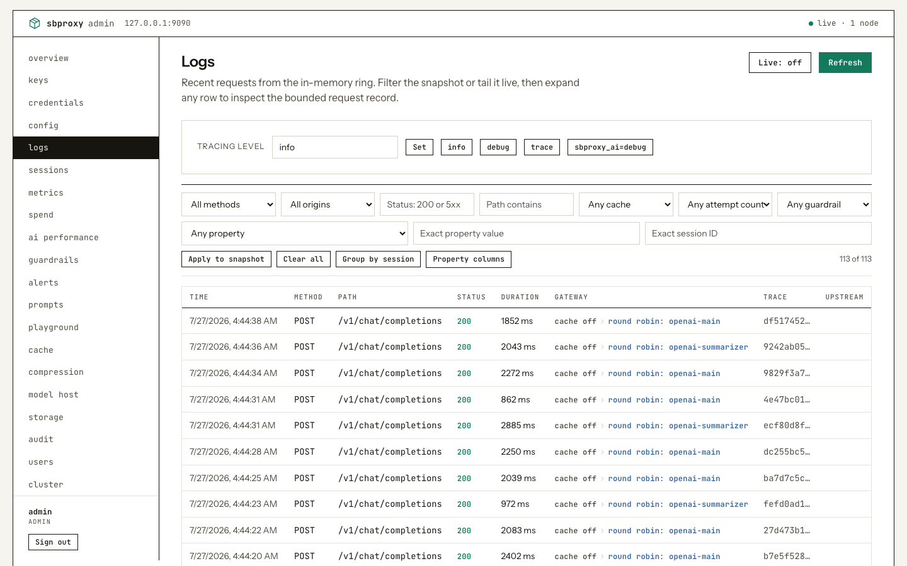

The queryable view over the recent-request ring buffer, with a live
tail and a runtime log-level control.

- **Shows:** `GET /api/requests` as a table filterable by method,
  status, path, cache result, retry presence, guardrail action, exact
  session ID, and exact custom property. A `guardrail_action` query
  param arrives pre-filled when you follow the "Blocked requests"
  link from Guardrails, and an `origin` param when you follow an
  origin from the Spend breakdown. `GET /api/ui-settings` supplies the trace-URL
  template used to link a trace ID to the tracing backend.
- **Columns and grouping:** a persisted property-column picker shows
  only redacted values from the current ring. "Group by session"
  renders roots, descendants, parents outside the ring, and ungrouped
  requests with per-session summaries. The Gateway column reads cache,
  retry, failover, load-balancer, and guardrail decisions as one causal
  rail; expanding a row shows every bounded field. For `admin`
  operators, an expanded AI-dispatched row also offers "Replay in
  playground", which re-runs the entry through the governed dispatch
  path (see [Replay a logged request](#replay-a-logged-request)).
- **Mutations:** none directly on request data; `GET`/`PUT /admin/log-level`
  reads and sets the live tracing filter (e.g.
  `debug` or `sbproxy_ai=debug`) without a restart.
- **Live tail:** toggling it opens `GET /api/requests/stream`
  (Server-Sent Events) and appends new rows as they complete; the UI
  shows a "reconnecting" state if the stream drops and retries.
- **Empty/error notes:** an empty ring buffer (fresh process, no
  traffic yet) renders an empty state; the ring buffer is in-memory
  and resets on restart; for durable logs, see [access-log.md](access-log.md).

### Debugging a request

The Logs page is the first debug loop for a misbehaving proxy:

1. Raise the tracing level. The level control accepts a plain level
   (`debug`, `trace`) or a `tracing` filter directive like
   `sbproxy_ai=debug`, which turns on AI-path detail while the rest
   of the process stays at `info`. It applies immediately via
   `PUT /admin/log-level` and confirms with a toast. Official release binaries
   compile SBproxy's own `debug!` and `trace!` events out with a static maximum
   of `info`; raising the filter cannot restore those events. It can still
   expose more detail from dependencies compiled without that ceiling. Use the
   structured request decision fields below, or reproduce with a development
   build when SBproxy-internal debug events are required.
2. Turn on Live tail and reproduce the problem. New requests stream
   in as they complete, with the same properties and gateway decisions
   as snapshot rows. The active filter predicate is applied to both.
3. Filter to the failure: by status (`5xx`), path substring, cache,
   retry, guardrail action, session, or custom property. The "Blocked
   requests" link from Guardrails arrives here pre-filtered.
4. Correlate with the server log. Every row carries a `request_id`
   and, when tracing is exporting, a `trace_id` that deep-links to
   your tracing backend via the `trace_url_template` setting. The
   Playground's debug toggle returns the same `request_id` plus the
   config revision, so a test request is easy to find in both
   places.
5. Drop the level back to `info` when done; leaving `trace` on is a
   log-volume hazard, not a correctness one.

## Sessions (`/sessions`, `/sessions/:sessionId`)

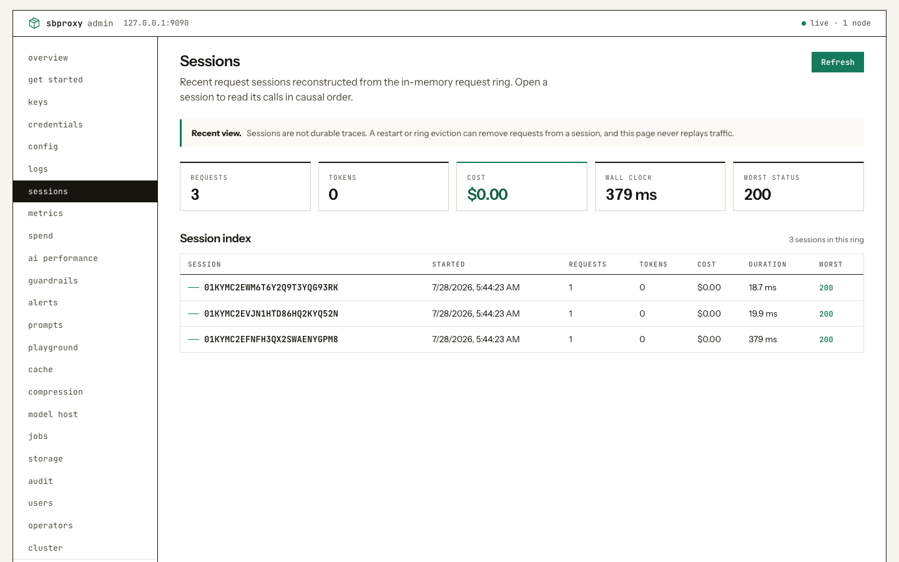

Recent logical interactions reconstructed entirely from the request ring.

- **Shows:** `GET /api/requests`, grouped by `session_id` and linked by
  `parent_session_id`. The index rolls up request count, input and output
  tokens, cost, wall-clock duration, and worst HTTP status. Detail pages show
  one session's calls oldest first, their gateway decision rails, properties,
  request and trace IDs, and links to a parent or child that remains in the
  ring.
- **Mutations:** none. "Open in Logs" applies the exact session filter there.
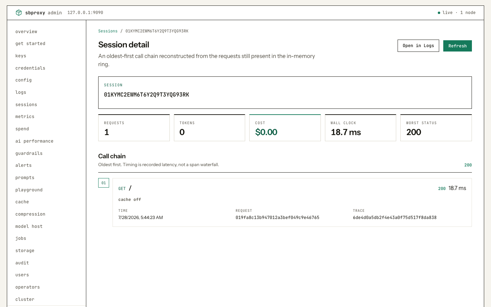

- **Retention boundary:** this is not durable trace storage, a span waterfall,
  or replay. A restart or request-ring eviction can remove some or all of a
  session, and the UI labels parents that fall outside the current ring.

### Attributing a spike to a customer

The observability surfaces compose into one attribution loop. Send
`X-Sb-Session-Id` (and `X-Sb-Parent-Session-Id` for a sub-agent) plus any
`X-Sb-Property-*` headers your callers can supply, then:

1. **Spend** shows the money. Group the window by a promoted property
   (`Property: feature`) to see which product surface moved, or by origin
   for which tenant.
2. **Logs** shows the requests behind it. Filter by that exact property key
   and value, and read the Gateway column: a run of `cache miss` where you
   expected hits, or `fallback chain` engaging, explains a cost or latency
   change without opening a single body.
3. **Sessions** shows the shape of the work. One agent task is usually many
   calls; the index ranks sessions by cost and duration, and a detail page
   reads the call chain oldest first with each call's gateway decisions.
4. **Alerts** shows whether anyone was told. Rule state and channel delivery
   health answer "should this have paged us, and did it?"

Only properties listed in the origin's `properties.rollup_keys` become
durable spend dimensions; every captured property stays filterable in Logs
for the life of the ring. Redacted keys show as `[redacted]` everywhere.

## MCP approvals (`/mcp-approvals`)

Parked MCP `tools/call` holds waiting for a human: gateway-originated
`approval.tools[]` selectors, and Cedar `@confirm` forbids when the
same action has `approval:` (store plus TTL). Approving a snapshot
lets the next matching retry through once. An unanswered hold expires
fail-closed (default 15 minutes) and never becomes an allow.

Where a row comes from: the gateway returns JSON-RPC `-32097` with
`hold_id` instead of holding the caller's HTTP connection. A fresh
Confirm park also fires alert rule `mcp_confirm` on
`proxy.alerting.channels`. This page polls `GET /api/mcp/approvals`
every five seconds.

- **Shows:** each hold's state (pending, approved, denied), advertised
  tool name, origin, principal, reason, and hold id.
- **Filters:** none. The list is the current store contents.
- **Mutations:** Approve and Deny (`POST /api/mcp/approvals/{id}/approve`
  and `/deny`), as the signed-in operator. `admin` role only for
  mutations; `read_only` can list.
- **Empty/error notes:** no `mcp` action with `approval:` renders a
  disabled empty state that says Cedar `@confirm` stays a labelled
  refusal until you add a store. A configured store with no holds
  says so rather than erroring.
- **Retention boundary:** the JSON file at `approval.store`. Holds
  expire out of that file; this page is not a durable audit log.

Cedar source, replay, and the Confirm wire shape: [cedar-policy.md](cedar-policy.md).
Runnable: [`examples/cedar-confirm-flow/`](../examples/cedar-confirm-flow/).

## Routing decisions (`/routing-decisions`)

Per-request routing traces: which strategy or operator plan decided each
request, the candidates it weighed, the winner, the reason, and the
fallback chain it actually traversed. Neither Kong nor Cloudflare AI
Gateway can answer "why this provider" per request; sbproxy already
records the underlying decision data, and this page renders it.

Where a row comes from, end to end:

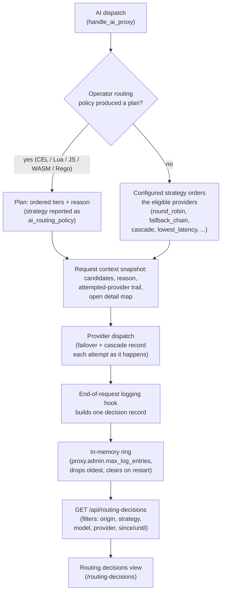
```mermaid
flowchart TD
    REQ["AI dispatch\n(handle_ai_proxy)"] --> PLANQ{"Operator routing\npolicy produced a plan?"}
    PLANQ -->|"yes (CEL / Lua / JS / WASM / Rego)"| PLAN["Plan: ordered tiers + reason\n(strategy reported as\nai_routing_policy)"]
    PLANQ -->|no| STRAT["Configured strategy orders\nthe eligible providers\n(round_robin, fallback_chain,\ncascade, lowest_latency, ...)"]
    PLAN --> SNAP["Request context snapshot:\ncandidates, reason,\nattempted-provider trail,\nopen detail map"]
    STRAT --> SNAP
    SNAP --> DISPATCH["Provider dispatch\n(failover + cascade record\neach attempt as it happens)"]
    DISPATCH --> LOG["End-of-request logging hook\nbuilds one decision record"]
    LOG --> RING["In-memory ring\n(proxy.admin.max_log_entries,\ndrops oldest, clears on restart)"]
    RING --> API["GET /api/routing-decisions\n(filters: origin, strategy,\nmodel, provider, since/until)"]
    API --> VIEW["Routing decisions view\n(/routing-decisions)"]
```

- **Shows:** `GET /api/routing-decisions`: one row per routed request,
  newest first, with strategy, winner (provider and model), the traversed
  provider chain, the decision reason, status, and latency. Expanding a
  row lists the candidates in the order the router weighed them with the
  winner marked, the failover pair, tenant, request id, and every key of
  the open `detail` map. A `substituted` badge marks rows where the served
  model differs from the requested one.
- **Filters:** origin, strategy, model (matches the requested or the
  served side of a substitution), selected provider, and a rolling time
  window, all applied server-side; deep links may pre-seed `origin`,
  `strategy`, and `model` query parameters.
- **Mutations:** none.
- **Empty/error notes:** a config with no AI origin or load-balanced
  upstream records no decisions, and the page says so rather than
  erroring; plain proxied requests that never routed do not appear.
- **Retention boundary:** the ring shares `proxy.admin.max_log_entries`
  (default 1000) with the Logs ring and clears on restart. It is a
  runtime sample for diagnosis, not durable routing history; ship the
  decision audit records to your log pipeline for that.

### Reading a failover trace

A caller reports a slow, oddly-worded answer. Open Routing decisions and
filter by the model they asked for:

1. The row's chain reads `openai › anthropic` with a `substituted`
   badge: the primary failed and the request was served by the second
   tier under a different model.
2. Expand the row. Candidates list the plan's order with `anthropic /
   claude-sonnet-5` marked `selected`; the reason field carries the
   operator plan's own words (or is empty for a built-in strategy,
   which decides by its name's criterion); the failover pair and
   attempt count quantify the detour.
3. The request id links the decision to the same request's row in
   [Logs](#logs-logs) and its access-log line, so cost, tokens, and
   the response itself are one filter away.

The four planned columns for this page (typed fallback triggers, data-
posture eligibility results, price-ceiling exclusions, and semantic-match
scores) will land as keys of the `detail` map and render in the expanded
row without a redesign.

## Metrics (`/metrics`)

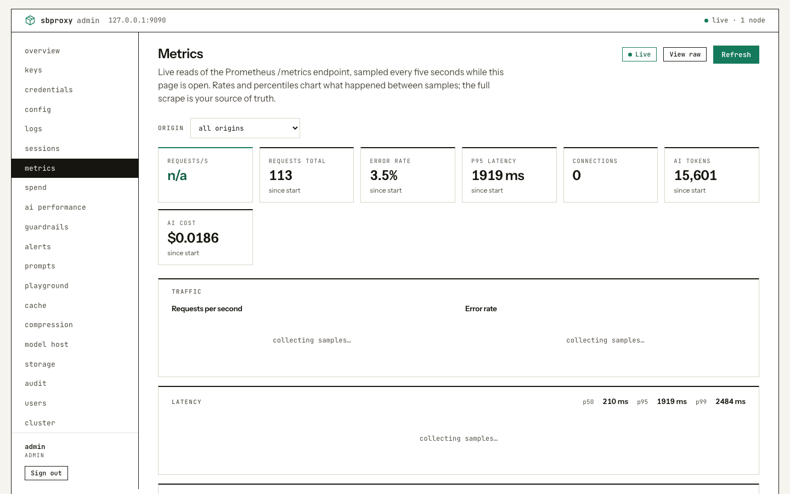

A live read of the Prometheus `/metrics` endpoint, parsed
client-side. While the page is open it samples the endpoint every
five seconds and charts what happened *between* samples: counter
deltas become per-second rates, histogram bucket deltas become
per-interval latency percentiles. The raw scrape stays one click away
and remains the source of truth. Requests to `/metrics` are excluded
from the proxy traffic totals and latency histograms, so leaving this
page open does not inflate the values it displays.

- **Shows:** `GET /metrics`, rendered as three layers.
  - *Numeric tiles* with trend sparklines: requests/s, total
    requests, error rate, p95 latency, active connections, AI tokens,
    and AI cost.
  - *Line charts*: requests per second and error rate over the
    sampled window, p50/p95/p99 latency, and AI token throughput
    split by direction. Hovering shows a crosshair with exact values.
  - *Bar breakdowns and tables*: requests by status (2xx green, 4xx
    amber, 5xx red) and method, errors by type, cache and auth
    results, bytes by direction, tokens by provider and direction,
    per-model token throughput, and model-host gauges. An **origins
    table** lists requests, success rate, and p50/p95 latency per
    configured origin, the first place to look when several tenants
    share one gateway.
- **Filters:** with more than one configured origin, an origin picker
  scopes the page to one `Host`; "all origins" is the default. The
  tiles, traffic charts, latency percentiles, and the status, method,
  errors, cache, auth, bytes, and token panels all honor it (the AI
  panels via the `origin` label on the attributed counters). A panel
  whose series carry no origin dimension (provider errors, per-model
  throughput, model-host gauges) stays an aggregate and says
  "all origins" while a filter is active.
- **Live control:** the Live toggle pauses and resumes sampling.
  Three consecutive failed scrapes pause it automatically and say so.
- **Mutations:** none.
- **Empty/error notes:** a series with no samples yet (no traffic of
  that kind) simply does not render its tile or panel; the page never
  treats "no data" as an error. The initial fetch failing renders the
  error state; a background sample failing raises a toast instead of
  blanking charts that already have data.

## Spend (`/spend`)

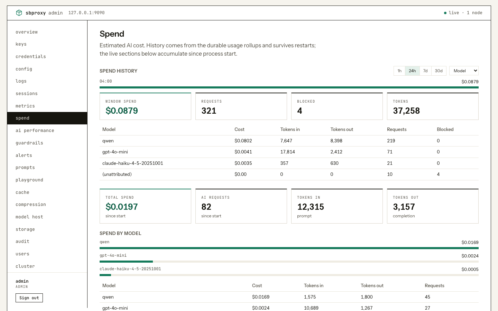

This shot predates the tiles, the two-series chart, and the trust panel.
Every screenshot in this doc carries the sidebar, so they are recaptured
together at release prep rather than one at a time.

What the gateway estimates you spent, what it saved you, and how much of
the number is measured rather than guessed. Every figure above the fold
comes from the durable usage rollups and follows the selected window.
Savings, budget headroom, and the trust readouts come from the
process-lifetime `/metrics` scrape, which resets on restart, and each of
those blocks says so in its own header rather than leaving an operator to
work out that two numbers on the page count different things.

Where each number comes from:

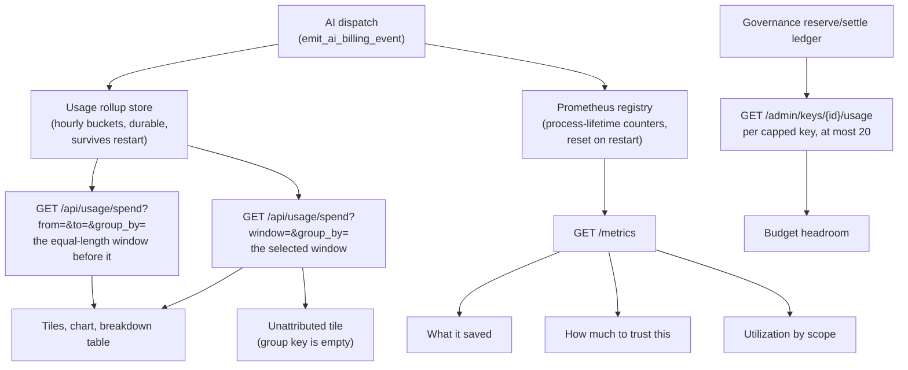
```mermaid
flowchart TD
    AI["AI dispatch\n(emit_ai_billing_event)"] --> ROLL["Usage rollup store\n(hourly buckets, durable,\nsurvives restart)"]
    AI --> PROM["Prometheus registry\n(process-lifetime counters,\nreset on restart)"]
    ROLL --> W["GET /api/usage/spend?window=&group_by=\nthe selected window"]
    ROLL --> P["GET /api/usage/spend?from=&to=&group_by=\nthe equal-length window before it"]
    PROM --> M["GET /metrics"]
    LEDGER["Governance reserve/settle ledger"] --> KU["GET /admin/keys/{id}/usage\nper capped key, at most 20"]
    W --> TILES["Tiles, chart, breakdown table"]
    P --> TILES
    W --> UNATTR["Unattributed tile\n(group key is empty)"]
    M --> SAVED["What it saved"]
    M --> TRUST["How much to trust this"]
    M --> SCOPE["Utilization by scope"]
    KU --> HEAD["Budget headroom"]
```

- **Shows:** `GET /api/usage/spend?window=&group_by=` for the selected
  window and `?from=&to=&group_by=` for the equal-length window before
  it, which is what turns a total into a change. Four tiles: window
  spend against the prior period, a run rate in dollars per day with its
  basis printed on the tile, unattributed spend for the selected
  dimension, and blended cost per million tokens. A two-series line
  chart of this window against the previous one, with a per-bucket and
  cumulative toggle. A ranked breakdown of the top eight groups plus an
  Other row carrying its own dollars, and a table with share of window,
  dollar delta against the prior window, requests, tokens each way,
  cost per million tokens, and requests blocked before dispatch.
  `GET /metrics` supplies the savings panel
  (`sbproxy_ai_cost_saved_micros_total`, `sbproxy_ai_tokens_saved_total`,
  `sbproxy_semantic_cache_results_total`, the
  `sbproxy_ai_compression_value_*` pair, and the `budget_exceeded` and
  `price_ceiling_block` outcomes of
  `sbproxy_ai_requests_attributed_total`), the scope gauge
  (`sbproxy_ai_budget_utilization_ratio`), and the trust panel
  (`sbproxy_ai_price_source_total`, `sbproxy_ai_price_ceiling_total`,
  `sbproxy_ai_token_estimate_error_ratio`, and the
  `surface="compression_summary"` slice of
  `sbproxy_ai_cost_dollars_attributed_total`). `GET /admin/keys` plus
  `GET /admin/keys/{id}/usage` fill Budget headroom, one request per
  capped key and no more than twenty of them.
- **Grouping:** provider, model, tenant, team, API key, project, origin,
  agent, promoted properties as `property:<key>`, or a single total.
  That is every dimension `GroupBy::parse` accepts.
- **Drill-down:** group labels link where the destination both accepts
  the filter and shows the operator that it applied it. Origin and API
  key go to [Logs](#logs-logs); model and tenant go to
  [Reports](#reports-reports), which filters the same ring on those
  dimensions and prices each row; a promoted property goes to Logs with
  both halves of the property pair seeded. Provider, team, project,
  agent, and the total grouping have no filter on either page and stay
  unlinked, because a label that looks clickable and lands on an
  unfiltered list is worse than plain text.
- **Mutations:** none on this page. The Resume control inside Workspace
  budgets is the one exception and belongs to that component.
- **Empty/error notes:** rollups switched off (`503`) reads as a
  configuration hint naming `proxy.observability.usage_rollups`, not as
  an error panel. A one hour window renders no chart and says why:
  hourly is the finest bucket the store keeps, so the window is a single
  point. A property that disappears from one window stays selected with
  an unavailable hint rather than silently changing the query. The
  prior-window request can fail on its own, most often as a `400` when
  the selected promoted property carries no row in the earlier range;
  the page then drops the comparison and says so instead of drawing the
  previous period at zero.

### Absent is not zero

Nine of the families this page reads only start existing once a feature
is configured, and summing an absent family returns 0. Every block here
branches on whether the family was found before it reads a value, so an
unconfigured semantic cache reads "not reported" and a configured one
that has saved nothing reads `$0.00`. The same rule covers derived
figures: a unit cost over zero tokens, a percentage change against a
prior window of zero, and a run rate with fewer than three complete
buckets all render `n/a` with the reason underneath. Percentages are
guarded the same way: a real share that would round to `0%` reads `<1%`
and one below the whole that would round to `100%` reads `>99%`, so a
small fallback price share cannot render as no fallbacks at all.

Two figures the page deliberately does not show. There is no dollar
figure for what the refused requests avoided, because nothing
accumulates the price of a request that never went out and multiplying
the count by an average price would print a number a customer could
disprove. There is no per-key savings total, because neither
cache-savings family carries `api_key_id` and the compression families
carry a different tenant label from the cache ones, so no attribution
exists on which a per-key total would be true.

### Reading a spend jump

Someone in finance asks why last week cost more than the week before.

1. Set the window to 7d and leave the grouping on Model. The Spend tile
   reads `$412.90` against `$349.61` in the previous 7d, up 18%.
2. The sentence above the breakdown splits that: `$52.10` of the rise
   came from more tokens and `$11.19` from a shift toward more expensive
   models. That is a price-volume variance computed from the rollup's
   own cost and token counts, so the two parts always reconstruct the
   whole change.
3. The table's `vs prev` column names which model moved, and the column
   reconstructs the whole change. A row marked `new` was not there last
   week, so its delta is its whole spend; a row marked `gone` kept its
   old dollars as a negative delta. If the previous window could not be
   read at all, no row carries a delta and a line above the table says
   so, because an unanswered comparison is not a comparison against
   zero.
4. Follow the model label into Reports, filtered to that model, to see
   the requests behind it. Both pages read the same 1000-entry ring,
   which clears on restart, so treat it as a recent sample rather than
   the whole window. The rollup totals above are the durable figures.
5. Before quoting the number, read the honesty line under the window
   control. If the fallback share of price lookups is climbing, some of
   those dollars were priced at the flat $5 per million rate rather than
   from the catalog, and the trust panel at the foot of the page says
   how much.

## Reports (`/reports`)

Spend and usage over the recent-request ring, grouped by any mix of
model, API key, tenant, and user at once, with the whole view encoded
in the URL and raw export a click away. OpenRouter's org exports group
by model, key, or the human who made the call; LiteLLM persists its
dashboard state in URL params so a filtered view travels as a link.
This page does both at the same time, over data sbproxy already
records on every request.

- **Shows:** `GET /api/requests/report`: one row per composite group
  with request count, tokens in/out, and estimated cost, sorted by
  spend, plus filtered totals as stat tiles. The Group by row toggles
  the four dimensions independently; grouped columns appear and
  disappear as dimensions toggle. A dimension a request lacks (an
  unkeyed call, an anonymous user) renders as `(unattributed)`.
- **Filters:** model, API key id, tenant, and user, applied
  server-side by the same parser that filters Logs, so a report and
  the log rows behind it can never disagree.
- **Shareable state:** every applied filter and the grouping selection
  serialize into URL query params (`?tenant=acme&group_by=model,user`).
  Copying the address bar shares the exact view; opening a shared link
  restores filters and grouping before the first fetch. There is no
  separate saved-filter object to manage: the URL is the saved filter.
- **Export:** two links download the current filtered view (the raw
  rows, not the grouped ones) via `GET /api/requests/export`, as CSV
  for spreadsheets or JSONL for tooling. The export is bounded by the
  ring cap and hardened against CSV formula injection; see the
  [export reference](admin-api-reference.md#get-apirequestsexport).
- **Mutations:** none.
- **Empty/error notes:** no matching requests renders an empty state
  naming the ring as the source. A hand-edited link whose `group_by`
  names an unknown or repeated dimension is normalized before the
  first fetch (unknown dropped, repeats collapsed, canonical order
  restored) and falls back to the default grouping if nothing
  survives, rather than rendering the API's `400`.
- **Retention boundary:** the ring shares `proxy.admin.max_log_entries`
  (default 1000) with Logs and clears on restart. For durable,
  windowed spend history use [Spend](#spend-spend), whose rollups
  survive restarts; this page answers "who spent what just now,
  exactly, and let me hand you the rows."

### Answering "who spent what" in one pass

Finance asks why the morning's AI spend spiked. Open Reports, group by
model and user simultaneously, and the spend-first sort puts the
answer on row one: which human drove which model, with tokens and cost
side by side. Filter to that user to confirm, copy the URL into the
thread so everyone sees the same cut, and export CSV for the
reconciliation sheet. The same questions through Logs would be a
row-by-row scroll; through Spend, a windowed chart without the
per-user cut.

## AI performance (`/ai-performance`)

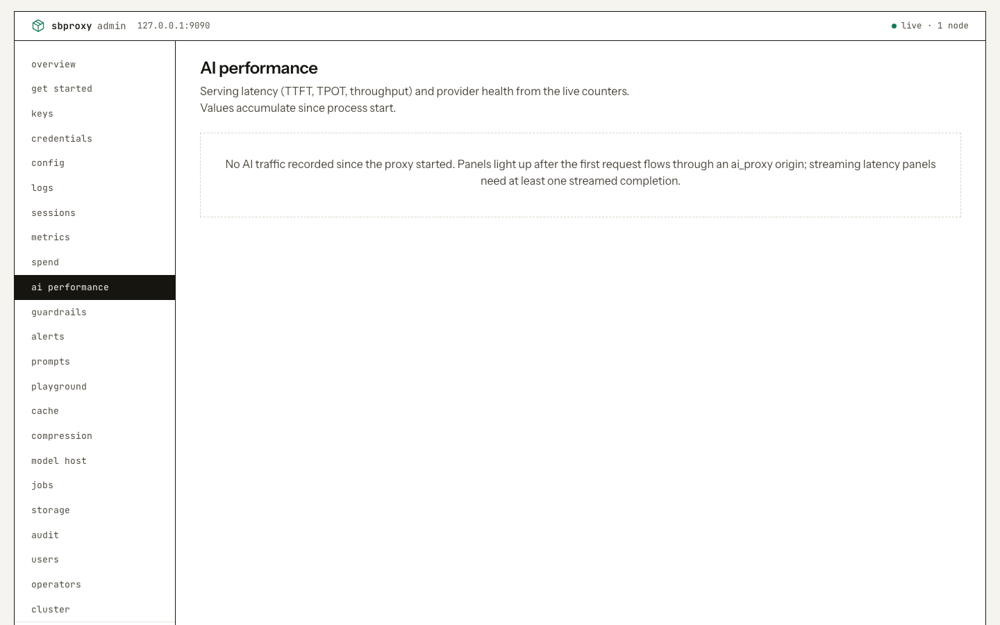

Serving latency (time-to-first-token, inter-token latency, throughput)
and provider health from the live counters.

- **Shows:** `GET /metrics`, specifically the pre-provider refusal
  panel described below, the TTFT/TPOT/throughput histograms,
  per-provider request/error counts and error rate, gateway
  admission/rejection rate with rejection reasons, failover reasons,
  cascade-tier outcomes, and router-strategy decisions. When
  context-compression policies are active, a
  compression section reports compressed requests, tokens and cost
  saved, per-lever savings, request outcomes, and the average
  compression ratio per lever.
- **Mutations:** none.
- **Empty/error notes:** no AI traffic and no pre-provider refusal
  renders an empty state explaining that panels light up after the
  first request through an `ai_proxy` origin; streaming-latency panels
  specifically need at least one streamed completion (TPOT needs at
  least two tokens in that stream) and say so rather than showing a
  misleading zero.

### Refused before dispatch

The refusals nothing else can show you. A request the AI gateway turns
away at the inbound native-format shim, or at the shared stored-prompt
resolver, never reaches a provider, so it leaves no trace in provider
health here, in your provider's own console, or in any provider-side
bill. The `Refused before dispatch` tile and the panel under it read
`sbproxy_ai_admission_decisions_total{surface,reason,outcome}`, the
counter the [`ai.admission` decision record](decision-records.md#aiadmission)
increments in the same breath.

The panel lists one row per `surface / reason` pair, with the bounded
label values rendered as the phrase they mean and the raw code printed
underneath so the row still joins the metric and the decision record.
A refusal that arrived on more than one inbound surface also gets a
per-surface breakdown.

- **Coverage:** the three refusal arms of the inbound native-format
  shim (the Anthropic Messages translate, the Responses stored-prompt
  bridge, and the Responses translate) and the two of the shared
  stored-prompt resolver. A request refused later by the model
  allow/block gate, a virtual-key policy, a guardrail, a budget, a rate
  limiter, or a CEL or Rego policy is that plane's decision and is not
  counted here.
- **Absent is not zero.** The counter is published on its first
  increment, so a proxy that has never refused a request before
  dispatch exports no family at all. The tile reads `not reported` for
  that case rather than `0`, because a flat zero over a measurement
  nobody has ever taken reads as a healthy signal.
- **Not additive with the gateway rejection rate beside it.** A refusal
  here is a 4xx on a classified AI surface, so it is also one of the
  rejections in `sbproxy_ai_gateway_decisions_total{decision="rejected"}`,
  filed under `client_error`. Reading the two tiles as separate
  populations double counts. What this panel adds is which inbound
  surface and which refusal, neither of which the `client_error` bucket
  can say.
- **`__other__` in a row is a lost label, not a reason.** The `reason`
  label is capped at 8 accepted values by the cardinality limiter
  against a 13-code vocabulary, so a proxy that sees a ninth distinct
  refusal files every later one under the limiter's sentinel from then
  on. The panel renders that row as `Beyond the label limit, reason not
  recorded` rather than as a word that reads like a refusal. The count
  is still real; only the code behind it is gone.

Triage: a caller reports a 400 that their provider dashboard has no
record of. Open AI performance. A `Refused before dispatch` count above
zero with a row reading `OpenAI Responses / MCP tool block, which would
reach an MCP server past this gateway` says the caller sent
`tools: [{"type": "mcp", ...}]` on `/v1/responses`, asking the provider
to reach an MCP server behind this gateway's MCP governance, and the
gateway refused it before dispatch. Turn on
`observability.log.decision_audit.events.ai.admission` to get the
per-request `ai.admission` record with the request id, then find the
caller in [Logs](#logs-logs).

## Guardrails (`/guardrails`)

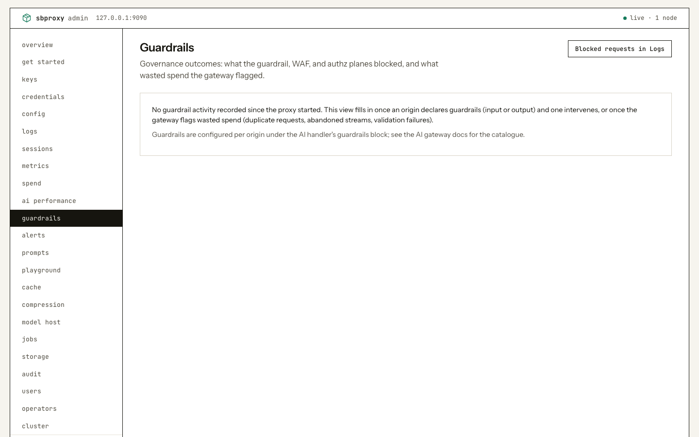

Governance outcomes: what the guardrail, WAF, object-authz, and CORS
planes refused, what wasted spend the gateway flagged, and whether any
peer still signs on the deprecated RFC 9421 request-target base.

- **Shows:** `GET /metrics`: guardrail blocks by category, streaming
  guardrail violations, context-poisoning findings, WAF/HTTP-framing/
  object-authz blocks, CORS refusals by reason, RFC 9421 legacy
  derivations by covered component, and wasted tokens/cost by kind
  (duplicate requests, abandoned streams, validation failures, context
  bloat, failover losers).
- **Mutations:** none. A "Blocked requests in Logs" action link jumps
  to Logs pre-filtered by `guardrail_action=block`.
- **Empty/error notes:** no guardrail activity since start renders an
  empty state pointing at the AI gateway guardrails config, not an
  error; this is the expected state for a config with no guardrails
  declared.

### CORS headers withheld

`sbproxy_cors_refusals_total{reason}` sits in the protocol-plane panel
next to the WAF, framing, and object-authz blocks, because it is the
same kind of thing: a refusal the edge made before the origin saw the
response.

Read the label, not just the total. The counter has one reason today,
`wildcard_with_credentials`, which is an origin configured with
`allowed_origins: ["*"]` and `allow_credentials: true` at once.
Browsers reject that pair, so sbproxy withholds the CORS headers rather
than appear to authorize something the browser will strip. An origin
that is simply not on the allowlist is denied without incrementing this
counter, so a low number here is not a statement that every
cross-origin request was allowed.

The panel is absent, not zero, when nothing has been refused: the
counter registers on its first use.

### RFC 9421 signature deprecation

`sbproxy_signature_legacy_derivation_total{component}` counts signatures
that verified only against the derivation sbproxy used before it became
RFC 9421 conformant, broken down by the covered component
(`@target-uri` or `@request-target`).

This is the number that closes the deprecation window. Acceptance is
otherwise announced in a single `warn` line per process, which tells you
a signer somewhere has not moved and nothing about whether that is still
true this week. Watch it stop climbing, then move the signing peers to a
conformant RFC 9421 library before the fallback is removed.

The panel does not appear when the counter is absent, and it does not
claim the fallback can go: an origin with no signature verification
configured produces exactly the same absent family as an origin whose
signers have all moved.

## Alerts (`/alerts`)

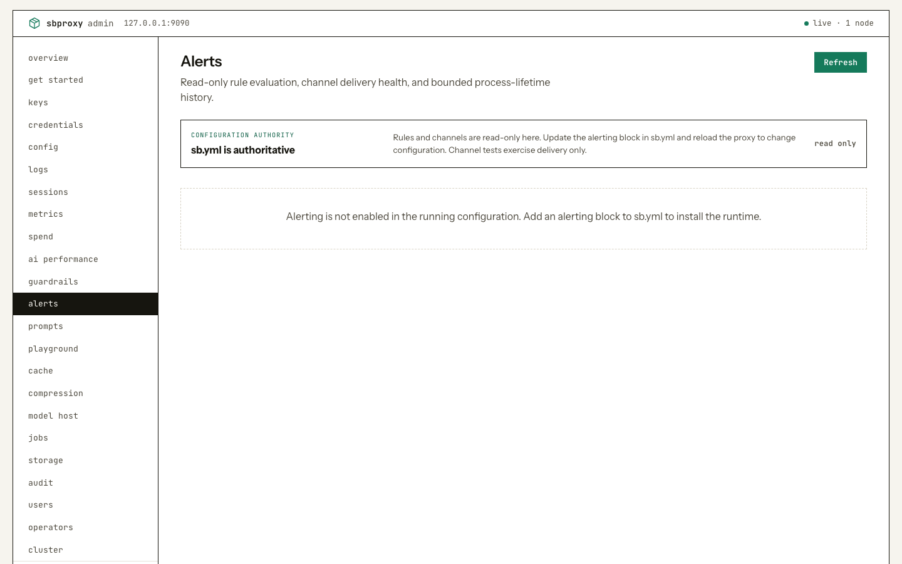

Read-only alert operations over the runtime installed from `sb.yml`.

- **Shows:** `GET /api/alerts`: built-in rules with thresholds, current
  reading, sample floor, state, and latest evaluation; sanitized channels with
  delivery health and bounded errors; and up to 200 process-lifetime fired,
  resolved, and test events. Webhook and Slack targets include only scheme and
  host. PagerDuty exposes only whether a routing key is configured.
- **Mutations:** `POST /api/alerts/test` queues one targeted channel test. The
  page polls briefly until that channel's `last_attempt_at` changes and then
  reports the delivery result. It cannot edit rules or channels.
- **Authority and retention:** `sb.yml` is authoritative. Rule state, channel
  health, and history reset with the process. The provider error-rate rule
  remains inactive below 10 attempts in an evaluation window; the gateway
  rejection-rate rule remains inactive below 10 decisions.
- **Empty/error notes:** no `proxy.alerting` block renders a disabled state;
  an enabled runtime with no channels keeps tests unavailable; no history is a
  normal process-lifetime empty state. A webhook channel pointed at a private
  or loopback address reports `failing` with "target rejected by SSRF policy":
  the delivery path enforces the same egress guard as the rest of the proxy, so
  test a local receiver through a routable address.

## Prompts (`/prompts`)

The prompt overlay snapshot: managed prompt versions per host and
name, and which version is pinned.

- **Shows:** `GET /admin/prompts`.
- **Mutations:** `POST /admin/prompts/{host}/{name}/versions` (add a
  version), `PUT /admin/prompts/{host}/{name}/pin` (pin the default).
  Persisted to the operator-configured redb file only when
  `proxy.admin.prompt_persistence_path` is set; otherwise mutations
  are in-memory and reset on restart.
- **Empty/error notes:** no prompts registered is an empty state, not
  an error.

## Playground (`/playground`)

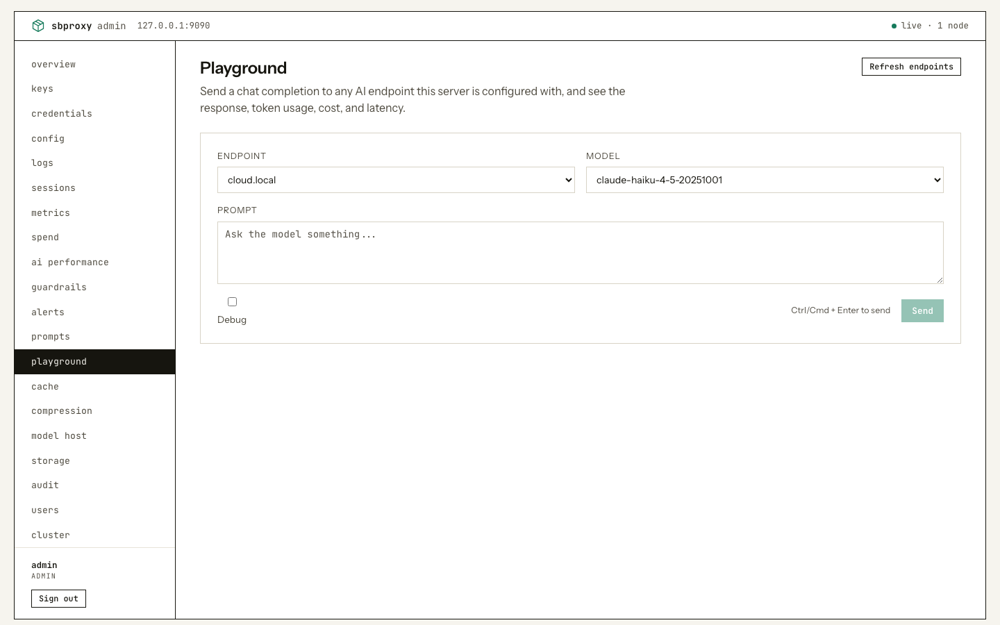

Send a chat completion to any AI endpoint this server is configured
with, and see the response, token usage, cost, and latency.

- **Shows:** `GET /admin/api/playground/endpoints` (every AI origin
  the live pipeline serves, with each provider's declared models).
- **Mutations:** `POST /admin/api/playground/dispatch`, which requires
  the `admin` role (a `read_only` operator gets `403` here even though
  the endpoint list is read-only). The page has you pick an active
  virtual key, and the request then runs through the real data-plane
  pipeline as that key: key policy, governance, routing, and
  guardrails all apply exactly as they would for the key's own
  traffic. Plain-HTTP AI origins only; an origin with `force_ssl`
  answers `501`. A debug toggle adds a `request_id` and the config
  revision to the response for server-log correlation.
- **Not used by the UI:** `POST /admin/api/playground/chat`, the
  direct engine call that skips the pipeline entirely. It refuses to
  run unless the body carries `bypass_governance: true`, and every
  completion it does run is audited. See
  [admin-api-reference.md](admin-api-reference.md#chat-playground)
  before scripting against it.
- **Empty/error notes:** no AI origins configured is an empty state
  ("nothing to talk to yet"); an upstream failure surfaces the
  provider's error, not a generic one.

### Replay a logged request

An expanded row on the Logs page offers "Replay in playground" on any
AI-dispatched entry (`admin` role only; the dispatch route refuses
`read_only` operators). It opens this page with the entry's request id
in the URL and pre-fills the form with what the request log actually
retains:

- **Always reconstructable:** the origin, the model, and the minted
  virtual key the request ran as. These live on the ring entry itself,
  so they survive even when no content was captured.
- **The body, only when it was captured:** the prompt loads from the
  redacted content sample retained when the AI origin sets
  `capture_content: true` and the governed key's policy consents with
  `allow_content_capture`. The page reads it through
  `GET /api/requests/{request_id}/content`, the same audited admin
  read behind the "View captured content" button on the Logs page, so
  a replay surfaces nothing a normal log read would not. A captured
  replay carries every captured message in order; the Prompt box edits
  the last user message. Capture redacts before storage, so the replay
  sends the redacted text, not the original bytes.
- **Never reconstructable:** sampling parameters (temperature, token
  limits) are not retained in the log, so the replay dispatches with
  the playground's defaults. When no content sample exists (capture
  not enabled, key consent absent, or the bounded sample store evicted
  or restarted), the page states the gap and pre-fills only origin,
  model, and key. It never fabricates a prompt.

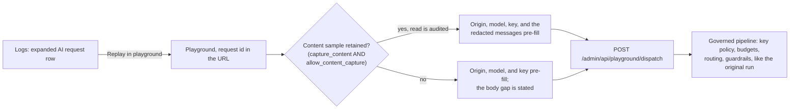
```mermaid
flowchart LR
    A[Logs: expanded AI request row] -->|Replay in playground| B[Playground, request id in the URL]
    B --> C{"Content sample retained?\n(capture_content AND\nallow_content_capture)"}
    C -->|yes, read is audited| D["Origin, model, key, and the\nredacted messages pre-fill"]
    C -->|no| E["Origin, model, and key pre-fill;\nthe body gap is stated"]
    D --> F["POST /admin/api/playground/dispatch"]
    E --> F
    F --> G["Governed pipeline: key policy, budgets,\nrouting, guardrails, like the original run"]
```

#### A worked replay

Two flags have to agree before there is a body to replay, so this runs
both sides. The origin opts in, and the key consents when it is minted:

```yaml
# /tmp/sbproxy-replay-demo/sb.yml
origins:
  "ai.local":
    action:
      type: ai_proxy
      require_governed_key: true
      # Half of the two-sided gate. The other half is the key policy's
      # allow_content_capture, set when the key is minted below.
      capture_content: true
      providers:
        - name: openai
          provider_type: openai
          api_key: ${FIXTURE_API_KEY:-fixture-local-token}
          base_url: http://127.0.0.1:18087/v1
          allow_private_base_url: true
          default_model: gpt-4o-mini
          models:
            - gpt-4o-mini
```

Mint the consenting key, then drive one two-message call through it:

```bash
TOKEN=$(curl -s -X POST -u admin:secret -H 'Content-Type: application/json' \
  -d '{"name":"replay-demo","allow_content_capture":true}' \
  http://127.0.0.1:9090/admin/keys | jq -r .token)

curl -s -o /dev/null http://127.0.0.1:8080/v1/chat/completions \
  -H 'Host: ai.local' -H "Authorization: Bearer $TOKEN" \
  -H 'X-Sb-User-Id: dev@acme.test' -H 'Content-Type: application/json' \
  -d '{"model":"gpt-4o-mini","messages":[
        {"role":"system","content":"You are a release assistant."},
        {"role":"user","content":"Summarize the v1.13 changelog."}]}'
```

"Replay in playground" on that row is a link to this page carrying the
request id and the three fields the ring retained, and nothing else:

```text
/playground?replay=01a021dde3d07cb2ac5a663f5039f782&origin=ai.local&model=gpt-4o-mini&key=5c22524e5b2675aa
```

The page then fills the form from one audited read, the same one the
Logs page's "View captured content" button makes:

```bash
curl -s -u admin:secret \
  'http://127.0.0.1:9090/api/requests/01a021dde3d07cb2ac5a663f5039f782/content' | jq
```

```json
{
    "request_id": "01a021dde3d07cb2ac5a663f5039f782",
    "api_key_id": "5c22524e5b2675aa",
    "tenant_id": "__default__",
    "origin": "ai.local",
    "model": "gpt-4o-mini",
    "captured_at": "2026-08-21T01:09:45.082442+00:00",
    "input_messages": [
        {
            "role": "system",
            "content": "You are a release assistant."
        },
        {
            "role": "user",
            "content": "Summarize the v1.13 changelog."
        }
    ],
    "output_text": "ok"
}
```

Both captured messages load in order and render above the Prompt box.
The Prompt box holds the last user message, "Summarize the v1.13
changelog."; editing it replaces that message rather than appending a
new one, and the system message travels with the dispatch unchanged.
Note `output_text` is captured too and is not replayed: a replay sends
input, and the new response is the point of running it.

Turn either flag off and this read answers `404`. The page then states
which consent is missing, pre-fills only origin, model and key, and
invents no prompt.

The dispatch is the governed one described above, pre-selected to the
original request's virtual key when that key is still active. A
replayed request is a new request: it runs the full policy chain
again, spends real budget, and lands in the log under its own request
id. The replay never touches the ungoverned `/chat` route.

## Cache (`/cache`)

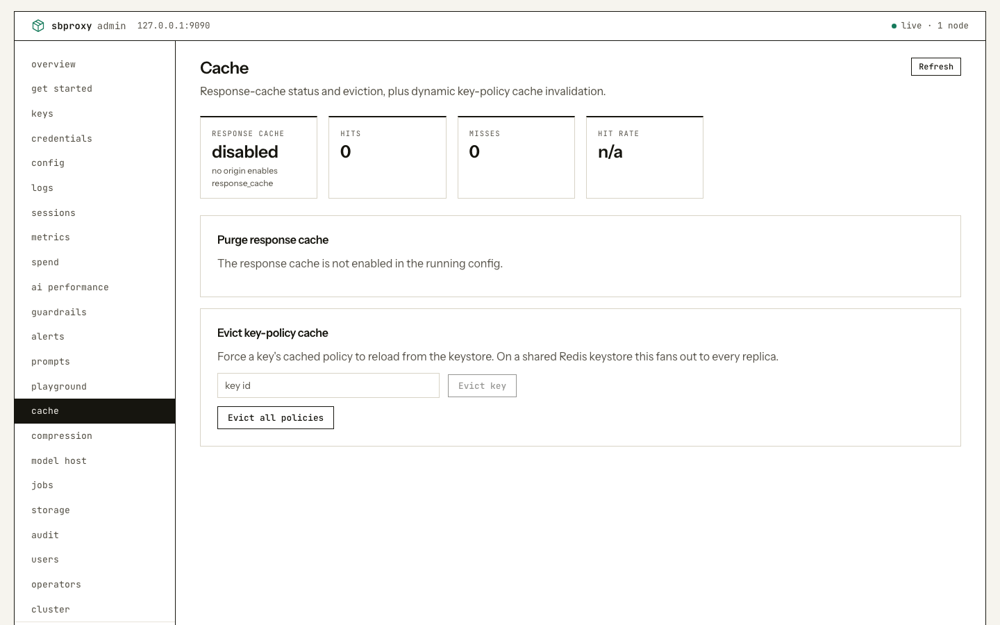

Response-cache status and eviction, plus dynamic key-policy cache
invalidation and semantic-cache debugging.

- **Shows:** `GET /admin/cache` (enabled, backend, whether prefix
  purge is supported), `GET /admin/cache/semantic` (recent embedding
  cache hit/miss decisions per AI origin), `GET /metrics` (cache-
  related counters shown alongside). With more than one origin in
  play, an origin picker scopes the hit/miss tiles and the semantic
  decisions to one origin; purge controls always act on the whole
  backend and stay global.
- **Mutations:** `POST /admin/cache/purge` (all / by exact key / by
  prefix; prefix purge is disabled in the UI when the backend does
  not support it), `POST /admin/cache/key-policy/evict` (one key or
  all).
- **Empty/error notes:** `{"enabled": false}` (no origin turned on
  response caching) renders as "not enabled," not an error; purge
  against a disabled cache returns `409` and renders the same way; no
  origin has a semantic cache configured renders that panel empty.

## Compression (`/compression`)

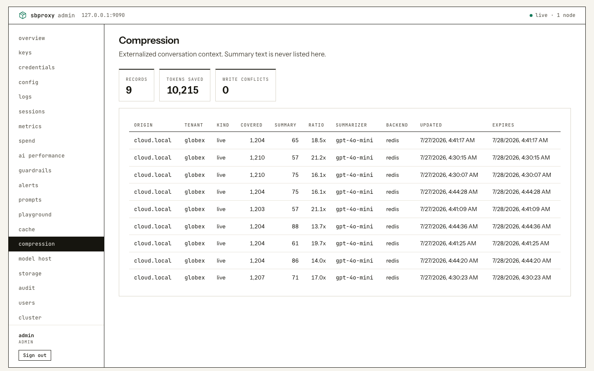

Externalized conversation context: which sessions have a stored
summary standing in for their history, and how much that saves.

- **Shows:** `GET /admin/compression/sessions`, refreshed every 20
  seconds. Per record: origin, tenant, kind, covered input tokens,
  summary tokens, the resulting ratio, the summarizer model, and the
  storage backend. The cards above total the records, the tokens saved
  (covered minus summary, floored at zero), and the count of records
  whose last write hit a concurrent-write conflict.
- **Mutations:** none.
- **Empty/error notes:** summary *text* is never listed here, only its
  size and provenance, so the page stays safe to leave open on a
  shared screen. No records renders an empty state pointing at the
  requirement: a route with a compression profile has to handle a
  conversation before anything appears. Records expire on their own,
  so a row vanishing between refreshes is expected, not a fault.

See [ai-context-compression.md](ai-context-compression.md) for what
populates these records and how to configure a profile.

## Model host (`/model-host`)

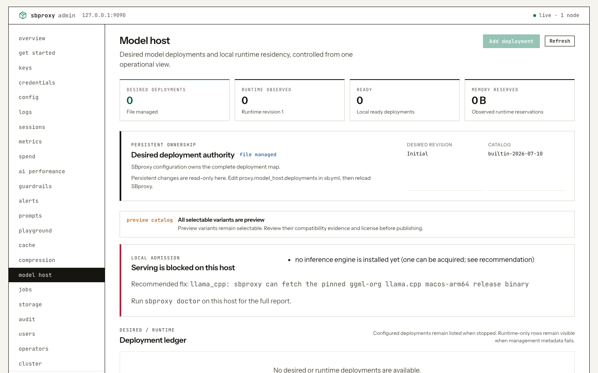

Desired model deployments and local runtime residency, controlled from
one operational view, including, on a cluster authority node, signed
fleet-wide deployment publication.

- **Shows:** `GET /admin/model-host/catalog` (bundled models and exact
  variants with support evidence), `GET /admin/model-host/deployments`
  (the desired-state document: authority, read-only flag, revision),
  `GET /admin/model-host/status` (runtime state per deployment),
  `GET /admin/cluster/status` and `GET /admin/cluster/deployments`
  (cluster roster and the signed deployment bundle, when clustered).
- **Mutations:** `PUT /admin/model-host/deployments` (add/edit/remove
  a deployment, allowed only under `admin_managed` authority; compare-and-
  swap on `expected_revision`), `POST /admin/cluster/deployments` (on
  an authority node, publish the signed complete map),
  `POST /admin/model-host/load|stop|reset` (per-deployment lifecycle).
- **Empty/error notes:** under `file_managed` authority (the deployment
  map is owned by `sb.yml`) or as a cluster verifier node, the save
  action is replaced with an explanation of why this node is read-only
  instead of a form. A revision conflict on save keeps the submitted
  form and the conflicting server state both visible and requires an
  explicit retry; it never silently discards your edit or silently
  overwrites the server's. Removal is blocked while a deployment's
  runtime evidence is stale or it is ready/preparing/draining, with the
  reason shown inline.

## Jobs (`/jobs`)

Durable model-host work, including model loads and evictions, artifact
pulls, and verification.

- **Shows:** `GET /admin/model-host/jobs`, newest first, with filters
  for deployment, kind, state, and job ID. Expanding a non-terminal row
  follows `GET /admin/model-host/jobs/{id}/stream`; the browser resumes
  the server-sent event stream after a dropped connection.
- **Mutations:** none.
- **Empty/error notes:** no retained jobs is a normal empty state.
  Terminal jobs remain inspectable without holding an event stream
  open, and a stream reconnect never blocks the list's regular refresh.

## Storage (`/storage`)

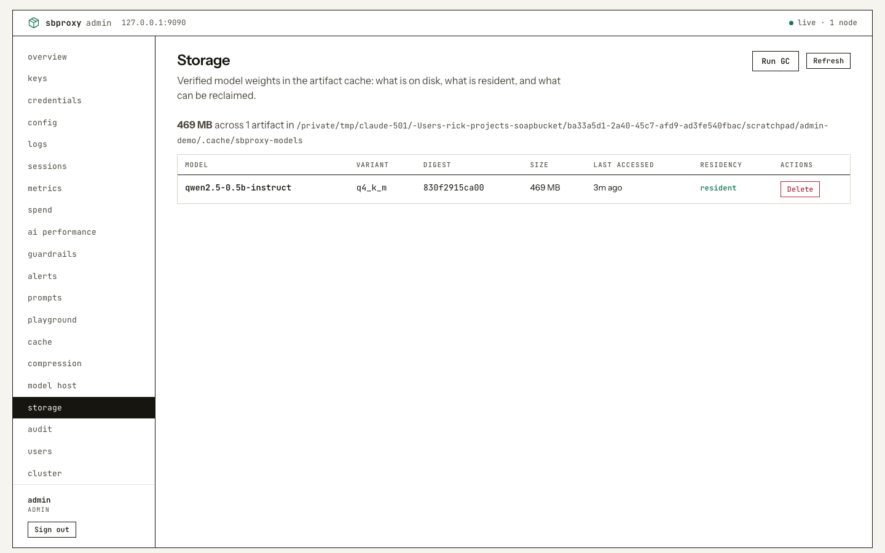

Verified model weights in the artifact cache: what is on disk, what is
resident, and what can be reclaimed. Below the inventory, whether the
storage backend the gateway reads and writes through is answering.

- **Shows:** `GET /admin/model-host/files` (cache root, total bytes,
  per-artifact size, last-accessed time, and whether it currently
  backs a ready replica), and `GET /metrics` for the **Storage backend
  operations** panel: operations completed, operations that returned an
  error, the p95 across every backend and operation, the slowest
  `backend / op` pair, and failures broken out by error kind. Those come
  from `sbproxy_storage_op_duration_seconds` and
  `sbproxy_storage_op_errors_total`, which every backend call is wrapped
  in.
- **Mutations:** `DELETE /admin/model-host/artifacts/{digest}` (remove
  one artifact, blocked with a stated reason if it is configured,
  resident, pinned, leased, or file-locked), `POST /admin/model-host/gc`
  (protected LRU collection down to the configured cache budget).
- **Empty/error notes:** no model host configured renders an empty
  inventory (`cache_root: null`), not an error; GC with no configured
  cache budget returns `409` and disables the control with a tooltip
  explaining there is no target to collect toward. The backend panel
  loads separately from the inventory, so a node with no model host
  still shows backend health. Both storage families register on the
  first backend operation, so a node where no backend has run publishes
  neither and the panel says so in words rather than drawing a zero. A
  present latency histogram with no error counter is the opposite case
  and is a real zero: nothing has failed.

## Audit (`/audit`)

Three records of what happened, ordered by how much they prove. At the
top, the tamper-evident chain viewer: the durable, hash-chained,
Ed25519-signed files themselves, re-verified on every page read. Below
it, the bounded runtime samples: the unified security and change event
ring, and the rate-limit budget actions (suspend, throttle, resume)
with the reason each fired.

The chain section shows one card per channel (`security`, `config`,
`key`, `admin`), each labeled `verified`, `broken`, `unreadable`, or
`off`, with the entry count and the signing key id. Entries from every
enabled chain merge into one table, filterable by channel, actor, and
time range, with Older/Newer paging inside a single channel. If any
walked chain fails verification, a banner names the channel, the first
broken sequence number, and the reason, and the table serves only the
records that verified; see
[audit-log.md](audit-log.md#browsing-it-from-the-console) for what the
walk checks and why a break is served rather than hidden.

- **Shows:** `GET /api/audit/chain` (the chained files, verified per
  read), `GET /api/audit/events?limit=200` (the in-memory event
  sample), `GET /api/audit/recent?limit=100`,
  `GET /api/rate_limits/budget` (per-workspace tier and cool-down
  state).
- **Mutations:** `POST /api/rate_limits/resume` (manually clear a
  workspace's escalation back to `normal`).
- **Empty/error notes:** with no chain configured, all four cards read
  "off" and the chain table explains which config keys turn each
  channel on. No `rate_limits:` block configured returns an empty audit
  list and a `404` on the budget snapshot; both render as "not
  configured," not an error, since there is nothing to audit.
- **Roles:** the whole page is readable by a `read_only` operator; the
  chain route is GET-only. A login narrowed with
  `proxy.admin.operators[].tenant` is refused the chain section with a
  `403`, since the chains are deployment-wide; the rest of the page still
  renders. Every chain read is itself recorded on the admin channel.

## Users (`/users`)

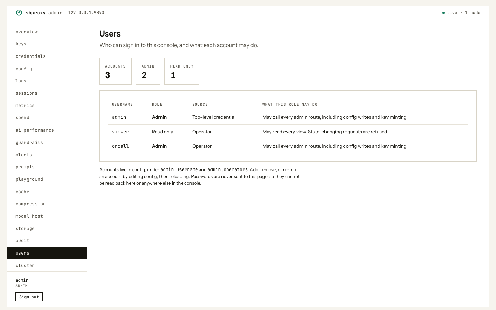

Who can sign in to this console, and what each account may do.

- **Shows:** `GET /api/admin/users`. One row per account: username,
  role (`admin` or `read_only`), whether it is the top-level admin
  credential or a configured operator, and a plain-language note on
  what that role may do. The cards count accounts by role.
- **Mutations:** none. Accounts live in config, under `admin.username`
  and `admin.operators`; add, remove, or re-role one by editing config
  and reloading. The [Config](#config-config) page can do that edit.
- **Empty/error notes:** passwords are never sent to this page and
  cannot be read back anywhere in the console, so this answers "who
  has access", not "what is the secret". The list is built from the
  same config the login route authenticates against, so it cannot
  drift from the accounts that actually work. The admin server always
  has at least the top-level credential, so an empty list means the
  build could not read its own config.

## Operators (`/operators`)

The configured RBAC operator subset, separated from Users so an
operator can quickly audit delegated accounts without the top-level
admin credential in the table.

- **Shows:** `GET /api/operators`, with each configured username and
  its `admin` or `read_only` role.
- **Mutations:** none. Edit `proxy.admin.operators` in config and
  reload to add, remove, or re-role an operator.
- **Empty/error notes:** an empty list means no delegated operators
  are configured; the top-level admin credential can still sign in.
  Passwords never leave the server and are not returned by this route.

## Cluster (`/cluster`)

Membership, model placement, and rollout health across the fleet, plus
the inbound peer connections this node refused.
For a runnable example that lights this page up, see
[a three-node mesh on one machine](#example-a-three-node-mesh-on-one-machine).

- **Shows:** `GET /admin/cluster/status` (the complete node roster,
  including failed/excluded members, never hidden to make the fleet
  look healthier, plus a health rail, prominent unhealthy-node alerts, and
  per-deployment placement/rollout detail), `GET /admin/cluster/metrics`
  (fleet-aggregated metrics, shown separately so a metrics-tier outage
  never hides roster or rollout evidence), and `GET /metrics` for the
  **Inbound peer admission** panel.

  That panel reads `mesh_transport_inbound_rejected_total` off this
  node's own scrape rather than the fleet aggregate, because the node a
  refusal landed on is the actionable part of the reading. It counts
  peers turned away, connections closed at the inbound ceiling, and
  idle connections reclaimed, then lists every `reason` with what it
  means. `idle_timeout` is kept out of the "turned away" total: the
  client half re-evaluates its connection recycle lazily, so a quiet
  cluster reclaims idle links as a matter of course and folding those
  into the refusal count makes an idle fleet look under attack. Alert
  on `reason!="idle_timeout"`. The peer address is deliberately not a
  label (it is attacker-chosen and would mint one series per source);
  it is in the node's log line instead.
- **Mutations:** none on this page; publishing a signed deployment
  bundle happens from Model host. This page is read-only status and
  alerting.
- **Empty/error notes:** outside a configured cluster, this renders a
  single-node view rather than an error (there is a "fleet" of one).
  A metrics-endpoint `404` (mesh metrics tier not configured) renders
  "metrics not enabled" without blocking the roster/health sections,
  which come from a separate call. The admission counter registers on
  its first increment, so a node that has refused nothing publishes no
  family at all; the panel says the counter is not reported rather than
  showing a zero over a signal that has never been observed.

## Example: a three-node mesh on one machine

The Cluster page (and the node count in the top bar) come alive with
a real mesh. `examples/model-cluster-symmetric/` runs the same config
file once per node with per-node environment. The example's own
README walks through two nodes; a third follows the identical
pattern (its own id, ports, state dir, and a seed pointing at an
existing node), which is what the roster below shows:

```bash
# Terminal 1 (node a, also the seed)
SB_ADMIN_PASSWORD=local-admin \
SB_NODE_ID=node-a SB_HTTP_PORT=8081 SB_ADMIN_PORT=9091 \
SB_GOSSIP_PORT=17946 SB_TRANSPORT_PORT=18946 SB_MODEL_PORT=19443 \
SB_STATE_DIR=./state/node-a SB_SEED=127.0.0.1:17947 \
sbproxy -f examples/model-cluster-symmetric/sb.yml

# Terminal 2 (node b)
SB_ADMIN_PASSWORD=local-admin \
SB_NODE_ID=node-b SB_HTTP_PORT=8082 SB_ADMIN_PORT=9092 \
SB_GOSSIP_PORT=17947 SB_TRANSPORT_PORT=18947 SB_MODEL_PORT=19444 \
SB_STATE_DIR=./state/node-b SB_SEED=127.0.0.1:17946 \
sbproxy -f examples/model-cluster-symmetric/sb.yml

# Terminal 3 (node c)
SB_ADMIN_PASSWORD=local-admin \
SB_NODE_ID=node-c SB_HTTP_PORT=8083 SB_ADMIN_PORT=9093 \
SB_GOSSIP_PORT=17948 SB_TRANSPORT_PORT=18948 SB_MODEL_PORT=19445 \
SB_STATE_DIR=./state/node-c SB_SEED=127.0.0.1:17946 \
sbproxy -f examples/model-cluster-symmetric/sb.yml
```

Open any node's admin UI (they each run their own admin server; node
a is `http://127.0.0.1:9091/admin/ui/`) and:

- The top bar reads "live · 3 nodes" once gossip converges, usually
  within a few seconds.
- **Cluster** shows the full roster with membership state,
  per-node health, roles, and last-ack age. Kill one node
  (`Ctrl-C` in its terminal) and its row degrades to `suspect`, then
  `dead`, and an unhealthy-node alert appears. The roster keeps the
  dead row visible rather than hiding failed members.
- **Keys** minted on one node propagate: the example wires the key
  cache's mesh tier, so revoking a key on node a is enforced on
  node b without a restart.
- **Model host** on a cluster-authority setup is where a signed
  deployment bundle is published fleet-wide; see
  [model-host.md](model-host.md) for that flow.

One local-topology quirk: browsers scope cookies by host, not port,
so signing into one node's admin UI on `127.0.0.1` signs you out of
the others (each login overwrites the shared session cookie). When
you want several node dashboards open side by side, use separate
browser profiles or give each node its own loopback address
(`127.0.0.2`, `127.0.0.3`).

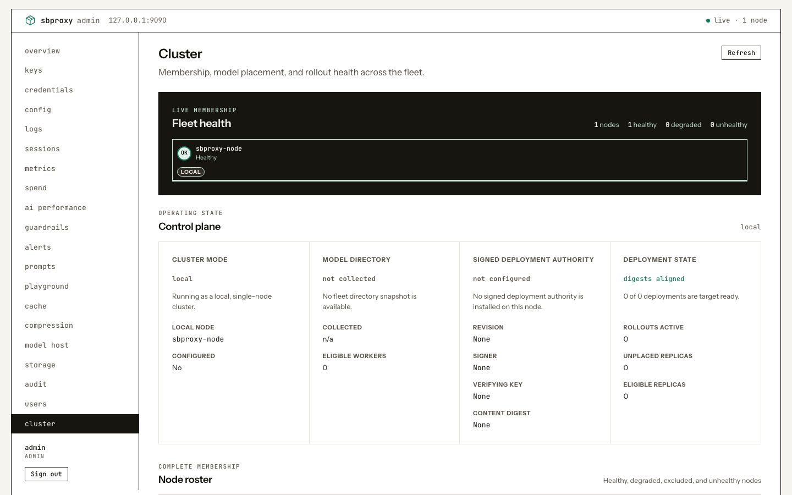

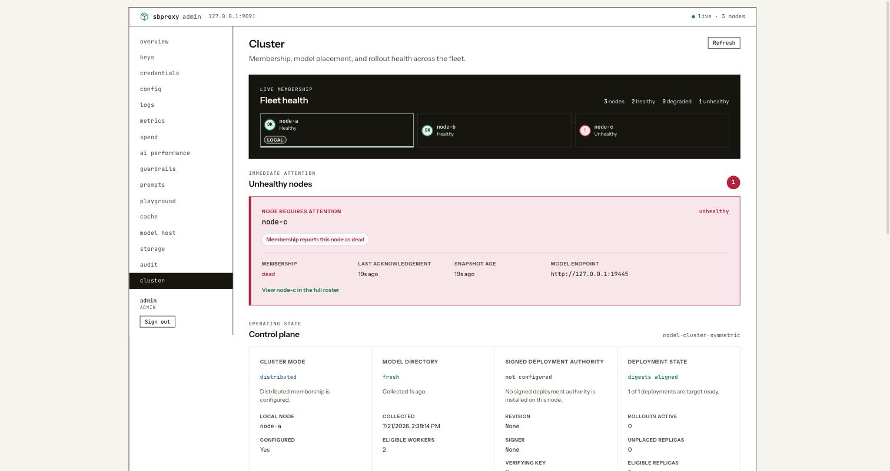

## See also

- [admin-api-guide.md](admin-api-guide.md) - the task-oriented API walkthrough this UI is a client of.
- [admin-api-reference.md](admin-api-reference.md) - every route this UI calls, in full.
- [admin.md](admin.md) - enabling the admin server, TLS, roles, and the security checklist.
- [key-management.md](key-management.md) - the policy model behind the Keys page.
- [model-host.md](model-host.md) - the config behind the Model host and Storage pages.
