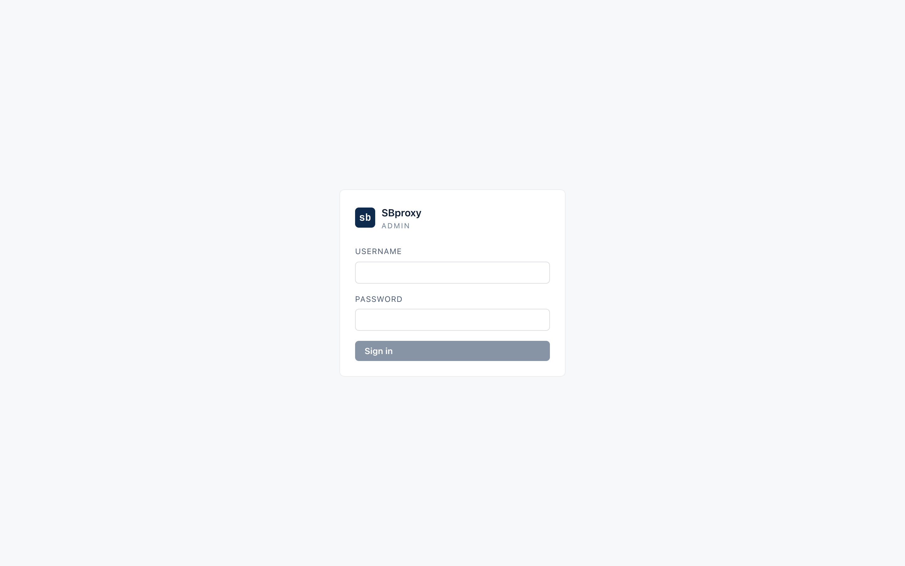
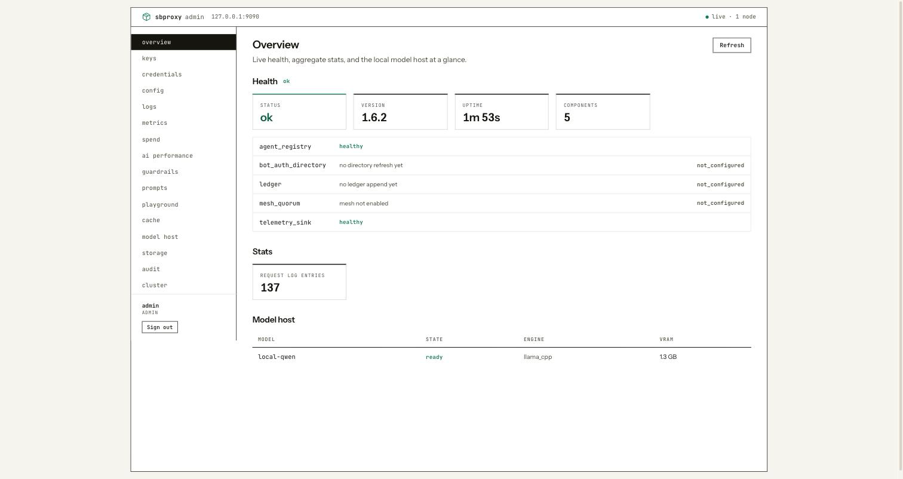
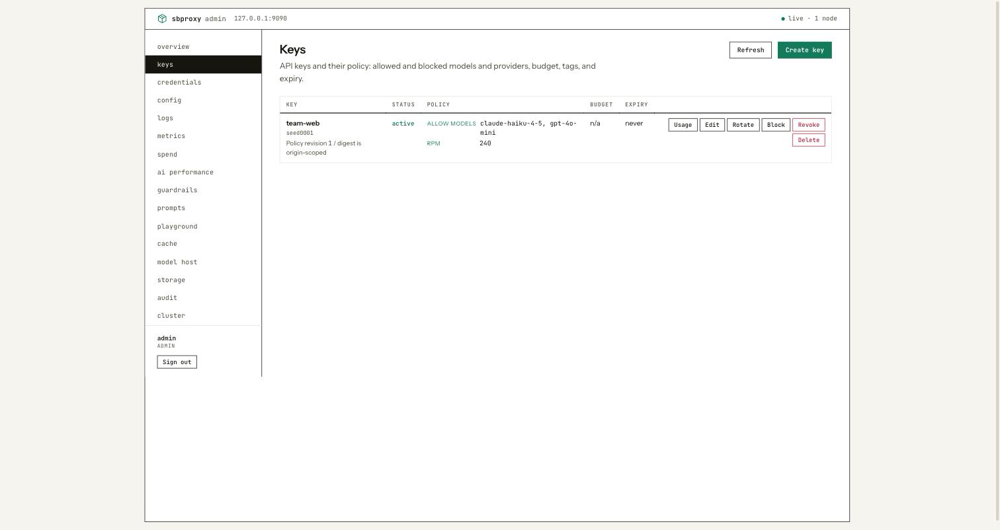
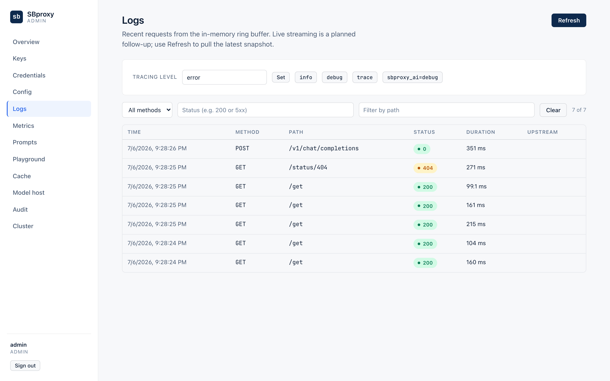

# Admin server

*Last modified: 2026-07-18*

sbproxy has a built-in admin server: a small control-plane HTTP endpoint,
separate from the data plane, for operating a running proxy. It exposes
the current config, health, metrics, and a filterable request log, and it
manages API keys, upstream credentials, prompt versions, and config
edits at runtime. A built-in web UI (off by default) sits on top of the
same endpoints.

The admin server is off unless you enable it, binds loopback only by
default, and authenticates every request. Read this page before exposing
it anywhere.

## Enabling it

Add an `admin` block under `proxy`:

```yaml
proxy:
  http_bind_port: 8080
  admin:
    enabled: true
    port: 9090
    username: admin
    password: change-this
    max_log_entries: 1000
```

| Field | Default | Meaning |
|---|---|---|
| `enabled` | `false` | Turn the admin server on. |
| `port` | `9090` | Port it binds. |
| `username` / `password` | `admin` / `changeme` | The top-level admin's HTTP Basic credentials. Change them. |
| `max_log_entries` | `1000` | Size of the in-memory recent-request ring buffer. |
| `prompt_persistence_path` | unset | redb file that persists prompt-version edits across restarts. |
| `tls` | unset | Serve HTTPS instead of plaintext (see [TLS](#tls)). |
| `bind` | `127.0.0.1` | Address to bind. Set to `0.0.0.0` or an interface for remote admin. |
| `allow_ips` | empty | IP / CIDR allowlist. Empty keeps the loopback-only default. |
| `cors_origins` | empty | Allowed CORS origins for a separately hosted UI. Empty emits no CORS. |
| `operators` | empty | Additional login identities with roles (see [Authentication and roles](#authentication-and-roles)). |

By default the server binds `127.0.0.1` and permits only loopback
clients, so it is reachable only from the same host; a per-IP and global
rate limit protects it from a local flood. To reach it from another
machine, set `bind`, an `allow_ips` allowlist, and `tls` (see [Remote
access and CORS](#remote-access-and-cors)).

## TLS

To serve the admin server (and the UI) over HTTPS, point `tls` at a PEM
certificate chain and its private key:

```yaml
proxy:
  admin:
    enabled: true
    port: 9090
    username: admin
    password: change-this
    tls:
      cert: /etc/sbproxy/admin-cert.pem
      key: /etc/sbproxy/admin-key.pem
```

Both paths are required together. The key may be PKCS#8 or RSA. If the
cert or key cannot be read or parsed, the admin server logs the error
and does not start, rather than fall back to plaintext on a port you
asked to be TLS. With `tls` set, plaintext requests to the port fail;
use `https://`.

A quick self-signed cert for local testing:

```bash
openssl req -x509 -newkey rsa:2048 -nodes -days 365 \
  -keyout admin-key.pem -out admin-cert.pem -subj "/CN=localhost"
curl -sk -u admin:change-this https://127.0.0.1:9090/metrics
```

## Authentication and roles

Protected control routes authenticate one of two ways. `POST /admin/login`,
`POST /admin/logout`, and `GET /admin/session` run before the general gate so a
browser can establish, revoke, or discover session state; they do not expose
protected control data.

- **HTTP Basic**, using the top-level `username` / `password`. Best for
  CI and scripts. The top-level admin always has the full `admin` role.
- **A browser session**, for the UI. `POST /admin/login` verifies
  credentials (a Basic header or a JSON `{"username","password"}` body)
  and sets an `HttpOnly`, `SameSite=Strict` session cookie (marked
  `Secure` when TLS is on), returning a CSRF token. `POST /admin/logout`
  revokes it. The signing key is per process, so a restart logs everyone
  out.

Because the cookie is `HttpOnly`, protected state-changing requests made with
a session must echo the CSRF token in an `X-CSRF-Token` header (a double-submit
an attacker cannot forge). Basic-auth requests are exempt. Login, logout,
session discovery, and cluster enrollment use their route-specific rules;
logout does not require a CSRF header.

Roles (`operators`) give role-based access. Each operator logs in with
its own credentials and gets a role:

```yaml
proxy:
  admin:
    enabled: true
    username: admin
    password: change-this
    operators:
      - username: oncall
        password: rotate-me
        role: read_only   # GET/read endpoints only; mutations return 403
      - username: deployer
        password: rotate-me-too
        role: admin        # every route
```

A `read_only` operator can read config, metrics, logs, and status but cannot
create keys, edit config, reload, or otherwise mutate. Protected mutations that
pass the general Admin gate emit a structured event on the
`sbproxy::admin::audit` tracing target with the operator's identity. Session
establishment, discovery, and logout use their route-specific behavior.
Persistence depends on the configured tracing sink.

## Remote access and CORS

To operate the admin server from another host, bind a reachable address,
restrict who may connect, and require TLS:

```yaml
proxy:
  admin:
    enabled: true
    bind: 0.0.0.0
    allow_ips: ["10.0.0.0/8", "192.168.1.50"]   # CIDRs or exact IPs
    cors_origins: ["https://admin.example.com"]   # for a separately hosted UI
    tls: { cert: /etc/sbproxy/admin-cert.pem, key: /etc/sbproxy/admin-key.pem }
    username: admin
    password: change-this
```

`allow_ips` matches exact addresses and CIDR networks; leaving it empty
keeps the loopback-only default (never the permit-all path). When
`cors_origins` lists an origin, the server answers preflight `OPTIONS`
and echoes the CORS headers (with credentials) so a browser SPA on that
origin can call the API cross-origin.

## What it can do

Everything below is reachable at `http(s)://<bind>:<port>`. Probe and session
establishment/discovery routes are unauthenticated; protected routes need auth
(top-level Basic or a session), and protected mutations need the `admin` role.
The separate enrollment exception is
`POST /admin/cluster/enroll`, which authenticates an expiring one-time cluster
token instead of an existing admin operator.

**Health and readiness (unauthenticated).**

| Method | Path | Returns |
|---|---|---|
| GET | `/healthz` | `{"status":"ok"}` |
| GET | `/health` | Full report: version, build, uptime, per-component checks. |
| GET | `/readyz`, `/livez` | Readiness / liveness, 200 or 503. |

**Session.**

| Method | Path | Purpose |
|---|---|---|
| POST | `/admin/login` | Verify credentials, set the session cookie, return a CSRF token. |
| POST | `/admin/logout` | Revoke the session and clear the cookie. |
| GET | `/admin/session` | Report whether the request carries a valid browser session and its role. |

**Config and pipeline.**

| Method | Path | Purpose |
|---|---|---|
| GET | `/api/openapi.json`, `/api/openapi.yaml` | OpenAPI of the live config. |
| GET | `/admin/config` | Current on-disk YAML plus the loaded revision. |
| PUT | `/admin/config` | Validate, persist, and hot-swap a new config (`?if_match=<rev>` for optimistic concurrency). |
| GET | `/admin/drift` | On-disk config hash vs the loaded one. |
| POST | `/admin/reload` | Re-read the config file and hot-swap the pipeline. |
| GET | `/admin/log-level` | Current tracing filter directive. |
| PUT | `/admin/log-level` | Change the log level at runtime, e.g. `{"level":"debug"}` or `{"level":"sbproxy_ai=debug"}`, no restart. |
| GET | `/api/health/targets` | Per-target health, outlier, and breaker state. |
| GET | `/admin/model-host/catalog` | Bundled model and exact-variant evidence, including the rendered catalog revision. |
| GET | `/admin/model-host/deployments` | Complete local desired-state document with authority, read-only state, revision, digest, and deployment map. |
| PUT | `/admin/model-host/deployments` | Replace the complete local deployment map under `admin_managed` authority with `expected_revision` compare-and-swap. |
| GET | `/admin/model-host/status` | Managed deployment generation, lifecycle, engine, artifact, memory, device, port, queue, reason, and job state. |
| POST | `/admin/model-host/load` | Start one configured deployment and wait for ready, `{"deployment":"<id>"}`. |
| POST | `/admin/model-host/stop` | Drain and stop one configured deployment, `{"deployment":"<id>"}`. |
| POST | `/admin/model-host/drain` | Alias for the bounded drain and stop operation. |
| POST | `/admin/model-host/evict` | Compatibility alias for the bounded drain and stop operation. |
| POST | `/admin/model-host/reset` | Clear retained crash-loop state for a configured deployment. |
| GET | `/admin/cluster/status` | Complete cluster roster, health and unhealthy-node alerts, model eligibility, placement, rollout, digest consistency, and authority state. |
| GET | `/admin/cluster/deployments` | Locally active verified deployment bundle and signer identity. |
| POST | `/admin/cluster/deployments` | Authority-only strict deployment draft publication. Non-authority nodes return `deployment_authority_read_only`. |
| POST | `/admin/cluster/enroll` | Exchange a valid one-time enrollment token and locally generated CSR for installed cluster identity material. |
| GET | `/admin/cluster/metrics` | Fleet-aggregated metrics (mesh tier; see [observability.md](observability.md)). |

**AI compression session state.**

| Method | Path | Purpose |
|---|---|---|
| GET | `/admin/compression/sessions` | List bounded, content-free session metadata with filters and cursor pagination. |
| GET | `/admin/compression/sessions/{id}` | Read content-free metadata for one opaque record ID. |
| GET | `/admin/compression/sessions/{id}/content` | Inspect one live, unexpired running summary when the caller is an Admin and that AI handler explicitly opts in. |
| DELETE | `/admin/compression/sessions/{id}` | Delete one Redis summary record and advance its stale-writer fence. |
| POST | `/admin/compression/sessions/purge` | Delete one explicitly scoped, bounded Redis page. |

### Compression session operations

Metadata reads allow either `read_only` or `admin`. They never return the
running summary, raw session ID, raw messages, or message digests. Listing
accepts `tenant`, `origin`, `backend=redis`, `conflict=true|false`, `cursor`,
and `limit`. The default limit is 100 and the maximum is 500. Redis removes
records at their TTL, so expired records are not retained for listing.

Content inspection has a stricter contract. It requires the `admin` role and
`allow_admin_content_inspection: true` on the current `ai_proxy` handler that
owns the record. The default is denied. Every content-inspection attempt that
reaches the compression route is emitted to the `sbproxy::admin::audit`
tracing target before a response is returned, including disabled inspection,
invalid IDs, missing or expired records, backend errors, and successful reads.
The event is content-free. The built-in sink is tracing, so durable retention
depends on the configured tracing collector. If an installed sink reports a
failure, the endpoint returns `503` without the summary. A successful response
carries `Cache-Control: no-store`, `Pragma: no-cache`, and
`X-Content-Type-Options: nosniff`.

`DELETE` and purge require the `admin` role. A browser session must also send
its `X-CSRF-Token`; HTTP Basic requests remain CSRF-exempt. Deleting a missing
record is idempotent and returns `200` with `"deleted": false`. Redis deletion
advances a fence and invalidates an in-flight lease before it can recreate the
record. A later eligible request with the same captured session can create a
fresh summary; deletion removes summary state, not the caller's session.

Purge always operates on a bounded page and returns a continuation cursor.
At least one of `tenant` or `origin` is required. `conflict`, `backend`,
`cursor`, and `limit` narrow a page but do not count as a destructive scope.
This prevents the normal `conflict: false` value from acting as an all-record
purge. An unfiltered purge must send both `"all": true` and the exact
`"confirmation": "purge-compression-sessions"`. Backend, corrupt-record, and
unsupported-schema failures during list or purge return a content-free `503`
rather than a partial metadata response.

Redis list and purge scan the shared Redis namespace using bounded pages and
opaque cursors. Metadata, delete, and purge remain available from the global
Redis L2 configuration after `summary_buffer` is disabled. Content inspection
still requires an active origin policy with explicit opt-in.

The following commands use the same HTTP Basic convention as the other admin
examples. They assume at least one compression record exists:

```bash
export SB_ADMIN_URL=http://127.0.0.1:9090
export SB_ADMIN_PASSWORD='replace-me'

# Read a metadata page, then select one opaque ID from it.
curl -fsS -u "admin:${SB_ADMIN_PASSWORD}" \
  "${SB_ADMIN_URL}/admin/compression/sessions?tenant=tenant-a&limit=100" \
  | jq '{records,next_cursor}'
SB_COMPRESSION_RECORD_ID="$(
  curl -fsS -u "admin:${SB_ADMIN_PASSWORD}" \
    "${SB_ADMIN_URL}/admin/compression/sessions?tenant=tenant-a&limit=1" \
    | jq -er '.records[0].id'
)"

# With the default handler setting, content inspection is denied with 403.
curl -sS -i -u "admin:${SB_ADMIN_PASSWORD}" \
  "${SB_ADMIN_URL}/admin/compression/sessions/${SB_COMPRESSION_RECORD_ID}/content"

# Delete one record. Repeating this returns deleted=false.
curl -fsS -X DELETE -u "admin:${SB_ADMIN_PASSWORD}" \
  "${SB_ADMIN_URL}/admin/compression/sessions/${SB_COMPRESSION_RECORD_ID}" \
  | jq

# Purge at most 100 records for one tenant.
curl -fsS -X POST -u "admin:${SB_ADMIN_PASSWORD}" \
  -H 'Content-Type: application/json' \
  --data '{"tenant":"tenant-a","limit":100}' \
  "${SB_ADMIN_URL}/admin/compression/sessions/purge" \
  | jq
```

See [Admin API reference](admin-api-reference.md#ai-compression-session-state)
for the complete schemas and status codes, and
[AI context compression](ai-context-compression.md) for the data-plane policy
and state model.

### Managed model operations

These routes adapt the same process-wide runtime used by startup, reload, and
request admission. Read the catalog before choosing a model or exact variant,
and read the current deployment document before changing desired state:

```bash
curl -u "admin:${SB_ADMIN_PASSWORD}" \
  "${SB_ADMIN_URL}/admin/model-host/catalog" \
  | jq '{catalog_revision,models}'

curl -u "admin:${SB_ADMIN_PASSWORD}" \
  "${SB_ADMIN_URL}/admin/model-host/deployments" \
  | jq '{authority,read_only,revision,content_digest,deployments}'
```

`PUT /admin/model-host/deployments` is available only under
`admin_managed` authority. Its strict JSON body contains
`expected_revision` and the complete replacement `deployments` map. Use
`null` only when creating the first revision; use the unsigned revision from
the latest read after that. A stale value returns `409 revision_conflict`.
The API validates and prepares the complete candidate before the durable
compare-and-swap. A race aborts the staged candidate. If final runtime
activation fails after the store advances, SBproxy attempts to restore prior
recreate generations. Rollback can fail, leaving the durable revision advanced
and the runtime degraded. Read the deployment document, runtime status, and
logs before recovery. Repair the reported dependency and send a corrected full
map from the current revision, use Reset or Load when status directs it, or
restart after confirming the persisted desired state is safe.

Under `file_managed` authority, the deployment endpoint is read-only and
changes continue through reviewed `sb.yml` plus `sbproxy apply -f <path>` or
`POST /admin/reload`. Under cluster authority, only the authority node can
publish a signed complete map through `POST /admin/cluster/deployments`;
verifier nodes remain read-only. Neither deployment API rewrites `sb.yml` or
provider routes under `origins[].action.providers`. Add a desired deployment
before configuring its provider route, and remove or retarget the route before
removing or renaming the deployment. See
[Model host](model-host.md#authenticated-catalog-and-local-deployment-api) for
the request schema, validation order, stable errors, and audit fields.

The lifecycle actions below do not create arbitrary deployments. The
deployment ID must already exist in active desired state.

```bash
export SB_ADMIN_URL=http://127.0.0.1:9090
export SB_ADMIN_PASSWORD='replace-me'

curl -u "admin:${SB_ADMIN_PASSWORD}" \
  "${SB_ADMIN_URL}/admin/model-host/status"

curl -u "admin:${SB_ADMIN_PASSWORD}" \
  -H 'content-type: application/json' \
  -d '{"deployment":"local-qwen"}' \
  "${SB_ADMIN_URL}/admin/model-host/stop"

curl -u "admin:${SB_ADMIN_PASSWORD}" \
  -H 'content-type: application/json' \
  -d '{"deployment":"local-qwen"}' \
  "${SB_ADMIN_URL}/admin/model-host/reset"
```

The local CLI provides the same common operations with stable JSON envelopes:

```bash
export SB_ADMIN_USERNAME=admin
sbproxy models ps --format json
sbproxy models stop local-qwen --format json
```

Lifecycle errors include bounded `reason_code` values. A stop enters drain,
rejects new requests, waits for active stream permits up to the configured
deadline, and then stops the engine. Reset does not change `sb.yml`; it clears a
retained failure so the configured generation can be started again. Detailed
paths and transport diagnostics stay in server logs and are not returned to the
browser.

The Model host page renders catalog evidence and support state, exact variant
availability, desired deployments, runtime status, and lifecycle actions.
Stable and preview variants are selectable only when their engine and
accelerator evidence is complete. Unsupported, config-only, and incomplete
entries remain visible but disabled. Pickle variants also remain disabled unless
the logical catalog model explicitly sets `allow_pickle`. Local admin-managed
deployments are always one replica and omit cluster-only label, spread, and
heterogeneous placement controls. The authority-node form adds those controls
for signed cluster placement. Both forms cover pull and warm behavior,
keepalive, concurrency, queueing, engine, and rollout. License acknowledgement
is required when selecting a model that needs it.

Admin-managed edits replace the complete map with compare-and-swap. A conflict
keeps the submitted form and attempted map visible, reloads current state, and
requires an explicit retry after the operator compares them. Removal is
blocked while runtime evidence is stale or the deployment is ready,
preparing, or draining. File-managed and cluster verifier views explain their
read-only authority instead of offering a local save action.

Any non-conflict mutation failure also reloads catalog, desired state, and
runtime status because the durable authority may already have advanced. Signed
cluster failures additionally reload the authority cursor and signed bundle.
The operator draft remains open throughout recovery.

### Cluster health and unhealthy-node callouts

`GET /admin/cluster/status` is the backend contract for the admin cluster
view. It never removes a failed node merely to make the fleet look healthy.
The `nodes` array is the complete membership roster; each row includes
membership state, acknowledgement age, local identity, roles, labels, reported
health, stable unhealthy reasons, model endpoint, snapshot age and generation,
engine/device/artifact counts, replicas, model eligibility, and exclusion
reason.

The separate `unhealthy_nodes` array is intentionally redundant. It gives the
UI a direct alert feed while the same nodes remain visible in the full table.
The directory retains bounded dead-node tombstones after SWIM routing GC, so a
failed node does not disappear merely because it is no longer a routing owner.
The summary includes total, healthy, degraded, and unhealthy nodes, eligible
workers and replicas, deployment digest mismatch, rollout count, and unplaced
replicas. Deployment rows include exact assignments, rejection reasons,
retained and draining generations, readiness, timeout, and handoff deadline.

```bash
curl -u "admin:${SB_ADMIN_PASSWORD}" \
  "${SB_ADMIN_URL}/admin/cluster/status" | jq '{summary,nodes,unhealthy_nodes}'

sbproxy cluster status \
  --admin-url "${SB_ADMIN_URL}" \
  --username admin \
  --format text
```

The Cluster page renders the local node first, then the complete roster, with a
health rail and prominent unhealthy-node alerts. It keeps stale nodes visible,
marks stale directory evidence, warns when a refresh fails, and shows rollout
assignments, rejection reasons, generations, readiness, and handoff state.
Fleet metrics come from the separate cluster metrics endpoint and do not hide
roster or rollout evidence when metrics are unavailable.

The authority node can publish the signed complete deployment map from the
Model host page. The UI accepts a deployment bundle only when its active
revision, digest, signer, key, and catalog revision form one coherent proof.
A missing bundle is valid only for a fresh authority with no active revision;
its first publication is revision 1. Stale or same-revision conflicting
publication returns `409`. Verifier nodes display the proof and remain
read-only.

Config values support environment-variable interpolation (`${ENV_VAR}`)
and secret backend references (HashiCorp Vault, AWS and GCP Secret
Manager, Kubernetes Secrets, or a local secret file). The `/admin/config`
editor reads and writes the raw config text, so those references are
stored and shown exactly as written: a secret is never resolved into the
saved config or exposed in the editor, and env vars resolve from the
running process at load time. See [secrets.md](secrets.md) for the
reference schemes.

**API keys and upstream credentials.** Full lifecycle over HTTP: create
(the plaintext token is returned once, on creation), list, get, edit
policy and attribution, delete, revoke, block, unblock, and
grace-window rotate.

| Method | Path |
|---|---|
| POST, GET | `/admin/keys` |
| GET, PATCH, DELETE | `/admin/keys/{id}` |
| POST | `/admin/keys/{id}/revoke`, `/block`, `/unblock`, `/rotate` |
| POST, GET | `/admin/credentials` |
| GET, PATCH, DELETE | `/admin/credentials/{id}` |

Key policy covers allowed and blocked models and providers, budgets, PII
rules, principal selectors, route-to-model, injected tools, tags,
tenant, and expiry. Changes take effect without a reload. These keys are
cluster-shared only when the keystore backend is Redis or the mesh tier;
the default embedded and memory backends are per-node. See
[key-management.md](key-management.md).

**Prompts.**

| Method | Path | Purpose |
|---|---|---|
| GET | `/admin/prompts` | Runtime prompt-overlay snapshot. |
| POST | `/admin/prompts/{host}/{name}/versions` | Add a prompt version. |
| PUT | `/admin/prompts/{host}/{name}/pin` | Pin the default version. |

**Observability.**

| Method | Path | Returns |
|---|---|---|
| GET | `/metrics` | Prometheus / OpenMetrics text (also on the data-plane port). |
| GET | `/api/requests` | Recent-request ring buffer. Filters: `status`, `method`, `path` (substring), `offset`, `limit`. |
| GET | `/api/requests/stream` | Server-Sent-Events tail: a `data:` event per new request. |
| GET | `/api/usage/spend` | Token and USD spend totals from the AI cost metrics. |
| GET | `/api/audit/recent?limit=` | Recent rate-limit budget audit rows. |
| GET | `/api/rate_limits/budget` | Per-workspace budget state: tier and suspend cool-down. |
| POST | `/api/rate_limits/resume` | Manually clear a workspace's escalation, `{"workspace":"<id>"}`. |

Metrics are per-instance: each process exposes only its own counters.
For a cluster, an external Prometheus scrapes every instance and
aggregates with PromQL; the Grafana dashboards in `dashboards/` already
sum across instances. See [observability.md](observability.md).

## The built-in web UI

A Vue single-page app drives the endpoints above (keys and credentials,
config and drift, logs, metrics, prompts, model management, and cluster
operations). It is off
by default and lives behind a cargo feature so the lean binary carries
no front-end assets.

Build and enable it:

```bash
cd ui && npm install && npm run build   # produces ui/dist/
cargo build --release -p sbproxy --features embed-admin-ui
```

Then open `http(s)://<bind>:<port>/admin/ui`. The UI logs in through
`POST /admin/login`, stores the returned CSRF token, and sends it on
writes; the session cookie carries the rest. It inherits whatever auth,
roles, and TLS the admin server is configured with, so put it behind TLS
before using it over anything but loopback.



After sign-in, the Overview page shows live health with per-component checks, version, uptime, and the model host at a glance:



The Keys page lists every virtual key with its status, policy, budget, and expiry, and carries the mint, edit, rotate, block, revoke, and delete actions inline:



Logs is the queryable view over the recent-request ring buffer, filterable by method, status, and path, with a control that retargets the tracing level at runtime:



The screenshots above were captured against a `--features embed-admin-ui` release build running a key-management example; to recapture after a UI change, boot `examples/use-case-own-openrouter/` and sign in.

## Security notes

- Change the default `username` and `password`. The defaults exist for a
  first run, not for anything reachable.
- Keep the server on loopback (the default) unless it is behind TLS with
  an `allow_ips` allowlist.
- Give day-to-day operators the `read_only` role and reserve `admin` for
  the accounts that actually change state; every mutation emits an audit event
  with the operator's identity.

## What is not here yet

The admin control-plane epic is complete: authentication (Basic and
browser sessions with CSRF), RBAC, remote bind with an IP allowlist and
CORS, TLS, the queryable and streamable request log, the spend and
config-write endpoints, and the embedded UI are all shipped. Remaining
follow-ups are single-sign-on / external identity providers for
operators, and per-route scopes finer than the `read_only` / `admin`
split.
