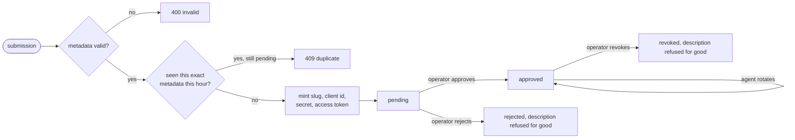
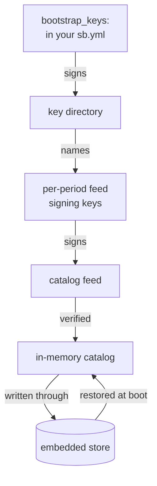

# Agent registry

*Last modified: 2026-08-27*

Two questions come up about every automated caller in front of a proxy.
Which agent is this, and did we agree to let it in?

The **catalog** answers the first. It is a list of known agents, their
expected User-Agent strings, their reverse-DNS suffixes, their Web Bot Auth
key thumbprints, and a reputation score, published as a file that somebody
signs. SBproxy verifies the signature and keeps the result in memory.

The **registration queue** answers the second. An agent that is not in
anybody's catalog submits a description of itself, gets a client id and a
secret back, and waits. Nothing is admitted until an operator approves it.

Both halves keep their state in one embedded database file. There is no
Postgres here, no broker, and no sidecar; the file named by `store_path` is
the entire deployment footprint.

## Enabling it

```yaml
proxy:
  admin:
    enabled: true
    port: 9090
    username: admin
    password: admin

  agent_registry:
    enabled: true
    store_path: /var/lib/sbproxy/agent-registry.redb
```

That is the whole minimum. It gives you the approval queue and an empty
catalog. `examples/agent-registry/sb.yml` is this config plus a walkthrough
of every call below.

The file is created owner-only (`0o600`) at the mode the `open(2)` call
asks for, not by a `chmod` afterwards, so there is no window where it is
world readable. Point it at a persistent volume: it holds decisions an
operator made, and losing it reopens all of them.

## The approval queue



`pending`, `approved`, `rejected`, and `revoked` are the whole set.

`rejected` and `revoked` are terminal, and the decision is durable and
keyed on the *description*, not on the minted id. Resubmitting metadata a
reviewer has already refused or withdrawn returns their answer rather than a
fresh queue slot, so a submitter cannot shop the same description around
until a different reviewer says yes:

```json
{"error":"this registration was already rejected as acme-research-labs-01J8ZK... and cannot be resubmitted","code":"burned"}
```

`approved` is durable in the same index for a different reason: an approved
agent's description cannot become a *second* agent with its own client id
and secret, because revoking one of the pair would leave the other live and
revocation would stop being the control it is documented as. Resubmitting
an approved description answers `409 duplicate`.

Keying on the description rather than on the id is what makes any of this
reachable. The id is `<vendor-slug>-<ULID>`, minted fresh on every
submission, so it is never the thing a resubmission reuses. Change the
description and it is a new question, which is accepted.

### Submitting

```bash
curl -s -u admin:admin -X POST \
  http://127.0.0.1:9090/admin/agent-registry/registrations \
  -H 'Content-Type: application/json' \
  -d '{"agent_metadata":{
        "vendor":"Acme Research Labs",
        "purpose":"research",
        "contact_url":"https://acme.example.com/bots",
        "expected_user_agents":["AcmeBot/1.0"],
        "expected_reverse_dns_suffixes":[".bots.acme.example.com"],
        "requested_scopes":["crawl:public"]}}'
```

```json
{
  "secrets": {
    "agent_id": "acme-research-labs-01J8ZK5R3T2WQ9V0X7A1B2C3D4",
    "client_id": "01J8ZK5R3TA6P8N4M2K0J9H7G5",
    "client_secret": "sk_agent_kR9x...",
    "registration_access_token": "rat_7Qm2...",
    "pending_approval": true,
    "created_at": "2026-08-27T10:14:03Z"
  },
  "registration": {
    "agent_id": "acme-research-labs-01J8ZK5R3T2WQ9V0X7A1B2C3D4",
    "state": "pending",
    "created_at": "2026-08-27T10:14:03Z"
  }
}
```

`client_secret` and `registration_access_token` appear in that response and
nowhere else, ever. What the store keeps is an Argon2id hash of each, at
OWASP's recommended parameters (19 MiB, two iterations, one lane). Every
read path returns a shape with no field a hash could occupy, so a listing
endpoint cannot leak one by forgetting to strip it.

`purpose` is one of `training`, `search`, `assistant`, `research`,
`archival`, `unknown`. `requested_scopes` is a non-empty subset of
`crawl:public`, `crawl:gated`, `embed:public`, `mcp:tools`. `contact_url`
must be `https://`.

Send the same metadata again within `duplicate_window_secs` and the second
call is refused as a retry of the first rather than becoming a second
agent:

```json
{"error":"a registration with identical metadata is already pending as acme-research-labs-01J8ZK...","code":"duplicate"}
```

Array order does not matter to that check: the fingerprint is a SHA-256 over
the RFC 8785 canonical form of the metadata with its arrays sorted, so a
retry with the fields shuffled is still recognized as a retry.

The window and the durable index answer different questions, and the split
is deliberate. The index owns every *decided* description, forever. The
window owns exactly the case the index does not: a submission nobody has
decided yet. A pending submission a reviewer never gets to should not block
its submitter permanently, so it expires after `duplicate_window_secs` and a
resubmission then takes a fresh slot. A submission a reviewer *has* decided
is the index's answer, and the window is not consulted for it.

### Deciding

```bash
# See what is waiting.
curl -s -u admin:admin \
  'http://127.0.0.1:9090/admin/agent-registry/registrations?state=pending'

# Approve. The reason is optional here.
curl -s -u admin:admin -X POST \
  http://127.0.0.1:9090/admin/agent-registry/registrations/$AGENT_ID/approve \
  -H 'Content-Type: application/json' -d '{"reason":"contact page checks out"}'

# Reject. The reason is required: it refuses this description for good.
curl -s -u admin:admin -X POST \
  http://127.0.0.1:9090/admin/agent-registry/registrations/$AGENT_ID/reject \
  -H 'Content-Type: application/json' -d '{"reason":"contact url 404s"}'

# Revoke an approved agent.
curl -s -u admin:admin -X POST \
  http://127.0.0.1:9090/admin/agent-registry/registrations/$AGENT_ID/revoke \
  -H 'Content-Type: application/json' -d '{"reason":"key compromised"}'
```

The operator the admin session resolved is stored on the record as
`decided_by` and published on the decision event. Every decision is a
compare-and-swap against the revision the record carried when it was read,
so two reviewers deciding the same registration at the same time produce
one decision and one `409 conflict`, never a silent overwrite of a terminal
state.

Attempting a transition the state machine does not allow answers `422`:

```json
{"error":"cannot approve a registration in state rejected","code":"invalid_transition"}
```

### Checking an agent's credential

```bash
curl -s -u admin:admin -X POST \
  http://127.0.0.1:9090/admin/agent-registry/registrations/$AGENT_ID/verify \
  -H 'Content-Type: application/json' -d "{\"client_secret\":\"$SECRET\"}"
```

```json
{"authenticated": true}
```

This is the DCR client-authentication check: it answers whether the secret
an agent is presenting is the one this registration holds, taking the
rotation grace window into account. Only an approved registration
authenticates, because a pending one has not been allowed yet and a
terminal one has been withdrawn.

A wrong secret, an unapproved registration, a registration in another
tenant, and an agent id that does not exist all answer
`{"authenticated": false}`, so the route cannot be used to tell them apart.
Every call ticks `sbproxy_agent_registry_operations_total{op="verify"}`.

No module on the request path consumes this yet; see
[What this does not do](#what-this-does-not-do).

### Rotating a secret

Rotation is the agent's own call, not the operator's, so it authenticates
with the registration access token the agent was given at submission rather
than with an admin credential:

```bash
curl -s -u admin:admin -X POST \
  http://127.0.0.1:9090/admin/agent-registry/registrations/$AGENT_ID/rotate \
  -H 'Content-Type: application/json' \
  -d "{\"registration_access_token\":\"$RAT\"}"
```

```json
{
  "agent_id": "acme-research-labs-01J8ZK...",
  "client_secret": "sk_agent_9Zq4...",
  "previous_secret_valid_until": "2026-09-26T10:14:03Z",
  "rotated_at": "2026-08-27T10:14:03Z"
}
```

The previous secret keeps authenticating until
`previous_secret_valid_until`, which is `rotation_grace_secs` after the
rotation, so a fleet of workers picks the new one up without a synchronized
restart.

Only an approved registration authenticates at all. A pending one has not
been allowed yet and a terminal one has been withdrawn, and treating either
as valid would make the approval gate decorative. A wrong token and an
unknown agent id return the identical `401`, so the route cannot be used to
find out which slugs exist.

## Tenancy

The queue is tenant-scoped. The catalog is not.

A registration is recorded against the tenant of the operator who
submitted it, taken from `proxy.admin.operators[].tenant`. An operator with
no tenant is deployment-wide: they see and act on every tenant, and their
own submissions are recorded under `default`.

A tenant-scoped operator sees and acts only inside their own tenant.
Another tenant's registration answers `404` on read, on decide, and on
rotate, and does not appear in a listing. The `404` is deliberate: a
distinct `403` would make the route an oracle for which agent ids exist in
other tenants, and there is nothing the caller can do differently either
way.

The durable replay index is tenant-qualified too, so one tenant refusing a
description does not refuse another tenant's identical one.

The catalog is one signed feed for the whole proxy, so there is no
per-tenant answer to give. A tenant-scoped operator is refused the catalog
listing and the feed refresh outright rather than handed a silently
narrowed one:

```json
{"error":"the agent catalog is deployment-wide; a tenant-scoped operator cannot read the catalog","code":"forbidden"}
```

That is the same rule the chargeback export and the meter routes follow,
and it is here for the reason those give: a quietly filtered answer reads
as a fact about the deployment rather than about the caller's permissions.

`GET /admin/agent-registry` is allowed for both, and says which scope its
queue counts cover:

```json
{"scope":"acme","catalog_writable":false,"pending":2,"approved":7,"catalog_entries":41}
```

`catalog_entries` and the two catalog timestamps are deployment-wide in
both answers. They are a size and two dates, not catalog contents.

## The signed catalog

The catalog half needs two files, and SBproxy verifies both rather than
fetching either. There is no URL in this configuration on purpose: an
outbound poller reachable from config is a fetch primitive, and syncing two
files is something every deployment already knows how to do.

```yaml
  agent_registry:
    enabled: true
    store_path: /var/lib/sbproxy/agent-registry.redb
    feed_path: /etc/sbproxy/agent-feed.json
    key_directory_path: /etc/sbproxy/agent-feed-keys.json
    stale_grace_secs: 86400
    bootstrap_keys:
      sb-bootstrap-2026-h1: "3JQ9m1tS0Nn8kK4pW7c2Yy5uH6dR1aB8fE0gJ2lM4nQ="
```

### The verification chain



Three properties fall out of that shape.

A leaked feed signing key buys one signing period and no authority over the
directory, so rotating it is a directory republish rather than a change to
every deployment's config.

A key in the directory's `revoked` list is refused even when the same key id
is also in `grace`, so a publisher who rotates a key and then discovers it
was compromised can actually withdraw it inside the overlap window.

**There are no bootstrap keys baked into the binary.** An empty
`bootstrap_keys` map means no directory can be trusted and therefore no
feed can be applied; the registry refuses rather than falling back to a key
shipped with the release. Configure the publisher's keys or the catalog
stays empty.

### Document shapes

The key directory:

```json
{
  "format_version": 1,
  "generated_at": "2026-08-01T00:00:00Z",
  "active":  {"kid": "feed-2026-h2", "alg": "ed25519", "public_key": "<base64 32 bytes>"},
  "grace":   [{"kid": "feed-2026-h1", "alg": "ed25519", "public_key": "<base64 32 bytes>"}],
  "revoked": [{"kid": "feed-2025-h2", "revoked_at": "2026-01-04T00:00:00Z", "reason": "rotated out"}],
  "signature": {"kid": "sb-bootstrap-2026-h1", "sig": "<base64 64 bytes>"}
}
```

The feed:

```json
{
  "format_version": 1,
  "generated_at": "2026-08-27T00:00:00Z",
  "expires_at": "2026-08-28T00:00:00Z",
  "entries": [
    {
      "agent_id": "acme-crawler",
      "vendor": "Acme",
      "purpose": "search",
      "expected_user_agents": ["AcmeBot/1.0"],
      "expected_reverse_dns_suffixes": [".bots.acme.example.com"],
      "expected_keyids": ["ed25519:sha256:xf9..."],
      "reputation_score": 80,
      "flags": []
    }
  ],
  "signature": {"kid": "feed-2026-h2", "sig": "<base64 64 bytes>"}
}
```

Both signatures cover the RFC 8785 canonical form of the document with the
`signature` member removed. Canonical JSON is what lets a publisher
reserialize, reindent, or reorder members without invalidating a signature,
while any change to a value invalidates it.

`agent_id` may not be `human`, `unknown`, or `anonymous`: those are the
resolver's own sentinels, and a catalog entry claiming one would shadow the
answer "this was not an agent".

### Refreshing

```bash
curl -s -u admin:admin -X POST http://127.0.0.1:9090/admin/agent-registry/refresh
```

```json
{"entries": 41}
```

Nothing is applied unless verification passes end to end. A tampered,
expired, or wrongly signed feed leaves the previous catalog exactly where it
was and answers with the reason:

```json
{"error":"signature verification failed: key feed-2026-h2 did not sign this body","code":"bad_signature"}
```

That is the fail-closed direction: an operator would rather serve
yesterday's verified catalog than today's unverified one. The refusal also
logs at `warn` and increments
`sbproxy_agent_registry_operations_total{op="feed_refresh"}` under the
matching outcome.

### When the feed is read

At boot, and then on a timer, and whenever an operator POSTs the route
above.

The timer's interval is derived from `stale_grace_secs` rather than from a
key of its own, because that value is already the operator's statement of
how stale a catalog may be: polling at most that often is what makes the
tolerance mean something. It is clamped to `[60s, 1h]`, and
`stale_grace_secs: 0` means the publisher's expiry is honored exactly,
which is a statement about acceptance rather than about polling, so it
falls back to 300 seconds.

`stale_grace_secs` extends the feed's own `expires_at`. Zero, the default,
honors the publisher's expiry exactly. An operator who would rather serve a
day-old catalog than none sets `86400`.

### The catalog on `/readyz`

The registry registers an `agent_catalog` component:
`not_configured` before any verified catalog has been applied, `degraded`
once the catalog in memory is past its expiry, and `healthy` otherwise with
the entry count.

The component named `agent_registry` on the same endpoint is a different
subsystem, the agent-class resolver, and predates this block. Read
`agent_catalog` for this one.

### Reload

Every key in `agent_registry` is applied at boot only. The block opens a
redb file and starts the refresh loop, and there is no rebuild path, so a
reload that changed it is **refused** with a message naming the key:

```
proxy.agent_registry changed; restart sbproxy to apply it. That block opens its own
store or installs a process-global sink at boot and has no rebuild path, so accepting
the reload would leave the node running the old one
```

Refusing is the lesser failure. An accepted reload that silently did
nothing is how an operator ends up watching `/admin/config` serve a rotated
`bootstrap_keys` entry while every refresh keeps answering `unknown_key`.
`proxy.notifications` and `request_events` are boot-only for the same
mechanical reason and are refused the same way.

The verified catalog is written through to the embedded store, and boot
restores it, so a restart while the publisher's file is missing or stale
still serves the last catalog a signature vouched for. The refresh is a full
replacement, not a merge: an agent the new feed dropped is deleted from the
cache too, which is what a withdrawal has to be able to do.

### Reading the catalog

```bash
curl -s -u admin:admin http://127.0.0.1:9090/admin/agent-registry/catalog
```

```json
{
  "generated_at": "2026-08-27T00:00:00Z",
  "expires_at": "2026-08-28T00:00:00Z",
  "expired": false,
  "entries": [ { "agent_id": "acme-crawler", "vendor": "Acme", "reputation_score": 80 } ]
}
```

## Configuration reference

| Key | Default | What it does |
|---|---|---|
| `enabled` | `false` | Master switch. Off means no store file is opened and every route under `/admin/agent-registry` answers `404`. |
| `store_path` | required | The embedded database holding the catalog cache and the registration queue. Created owner-only. |
| `feed_path` | none | The signed catalog feed. Absent means no refresh is possible and `POST .../refresh` says so. |
| `key_directory_path` | none | The signed key directory naming the feed signing keys. |
| `bootstrap_keys` | `{}` | Public keys that vouch for the key directory, keyed by key id and valued as base64 of the raw 32-byte Ed25519 public key. Empty means no feed can ever verify. |
| `stale_grace_secs` | `0` | How far past its own `expires_at` a feed may still be applied. |
| `duplicate_window_secs` | `3600` | How long an identical resubmission is treated as a retry. |
| `rotation_grace_secs` | `2592000` | How long a rotated-away client secret keeps authenticating. |

Three shapes parse and are still wrong, so they are refused at startup with
a message naming the problem rather than producing an empty catalog nobody
can explain: a `feed_path` with no `key_directory_path`, a
`key_directory_path` with no `feed_path`, and a `feed_path` with no
`bootstrap_keys`.

## What an operator can see

The admin console has an **Agents** page showing the catalog, the queue, and
the approve, reject, and revoke buttons.

Two metric families, both drawn on the **SBProxy AI Bot and Agent Traffic**
dashboard:

| Family | Labels | Reading it |
|---|---|---|
| `sbproxy_agent_registry_entries` | `collection` | The catalog size and the four queue states. A configured registry publishes all five at zero on boot, so no data means the registry is not configured rather than that the queue is empty. Alert on `pending`: a registration nobody has decided is a question an operator has not seen. |
| `sbproxy_agent_registry_operations_total` | `op`, `outcome` | Every operation and everything refused. `outcome="applied"` is success; the rest are the refusal vocabulary the API returns. |

Refusal outcomes divide into three groups an operator reads differently.
`bad_signature`, `unknown_key`, `expired`, and `unsupported_version` on
`op="feed_refresh"` mean the catalog stopped updating. `burned`,
`duplicate`, and `invalid_transition` on a queue operation are the state
machine working as designed. `unauthorized` on `op="rotate"` or
`op="verify"` is an agent presenting a credential that does not
authenticate.

The embedded store itself is counted separately on
`sbproxy_embedded_store_operations_total{store="agent_registry"}`, drawn on
the **SBProxy Mesh Admission and Storage** dashboard.

Every queue decision publishes an `agent_registration_decided` event on the
`events:` egress, so a SIEM subscribes rather than tailing a log:

```yaml
proxy:
  events:
    sink: webhook
    url: https://siem.example.com/ingest
    types:
      - agent_registration_decided
```

```json
{"event_type":"agent_registration_decided","tenant_id":"","timestamp":1787251963173,
 "data":{"agent_id":"acme-research-labs-01J8ZK...","decision":"approved","state":"approved","decided_by":"casey"}}
```

The payload is an explicit allowlist: an agent id, the decision, the
resulting state, and the deciding operator. It carries no minted secret, no
registration access token, no credential hash, and no submitter contact URL.
The durable record of a decision is the store, not the event; the event is
lossy under load the way every `events:` sink is.

## What this does not do

It does not fetch. `feed_path` and `key_directory_path` are files you sync;
SBproxy reads and verifies them at boot and on the refresh timer, and never
dials for them.

It does not expose an unauthenticated public registration endpoint. RFC 7591
describes a `POST /register` on the data plane, and this ships the queue on
the admin API instead, so an operator or an automation holding an admin
credential submits on an agent's behalf. An unauthenticated write path that
mints credentials and consumes durable storage is a separate security
decision. Front the admin route with your own gateway rule if you want
public self-service today.

It does not yet feed the request path. The catalog is readable and the queue
authenticates a presented secret, but no policy or auth module resolves an
inbound request against either one. Identity resolution on the hot path
stays where it is, in `IdentityResolverHook` and the agent-detect rule
packs; see [getting-started-agent-identity.md](getting-started-agent-identity.md),
[ai-crawl-control.md](ai-crawl-control.md), and
[web-bot-auth.md](web-bot-auth.md).

## Related

- [admin-api-guide.md](admin-api-guide.md) - login, CSRF, and roles for every admin call above.
- [events.md](events.md) - the typed event feed and every event it carries.
- [observability.md](observability.md) - metric conventions and the cardinality rules the labels above follow.
- [key-management.md](key-management.md) - the same at-rest hashing story for inbound API keys.
