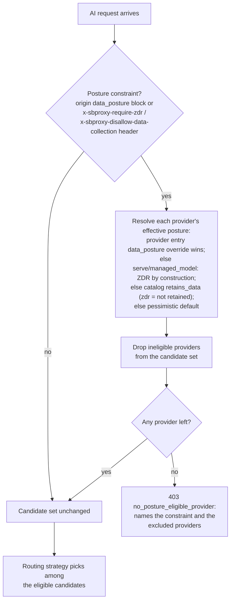
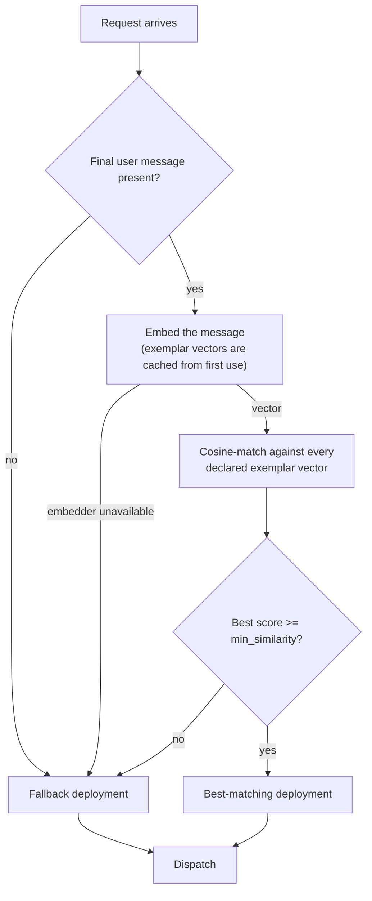
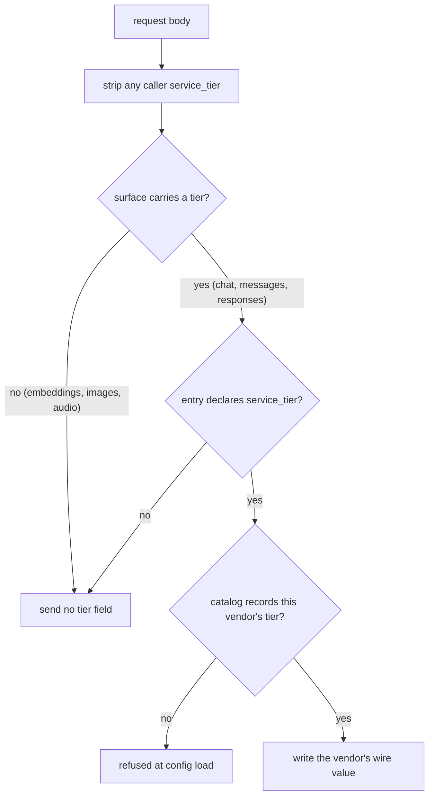
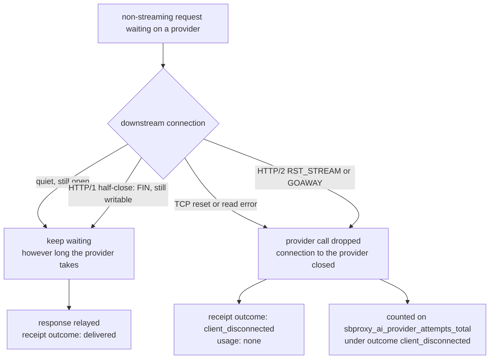
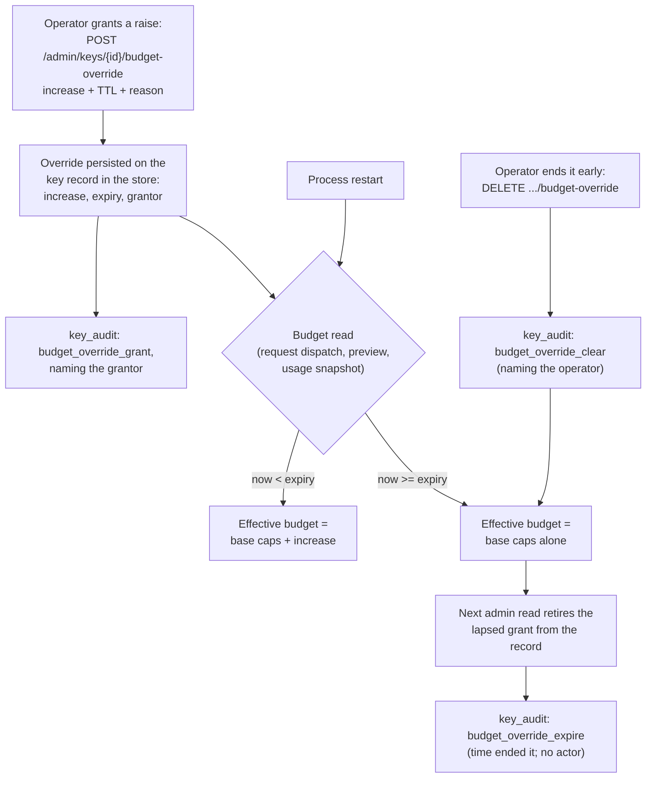
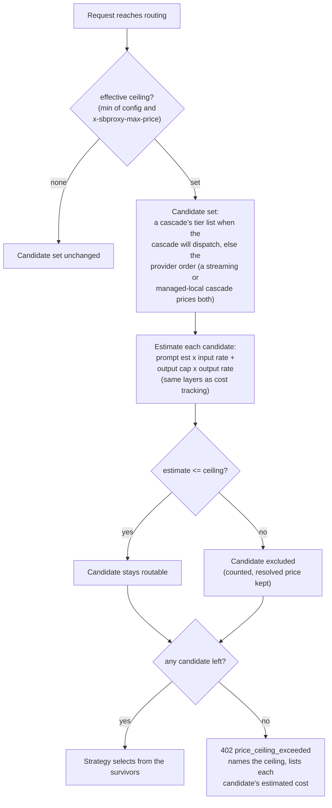
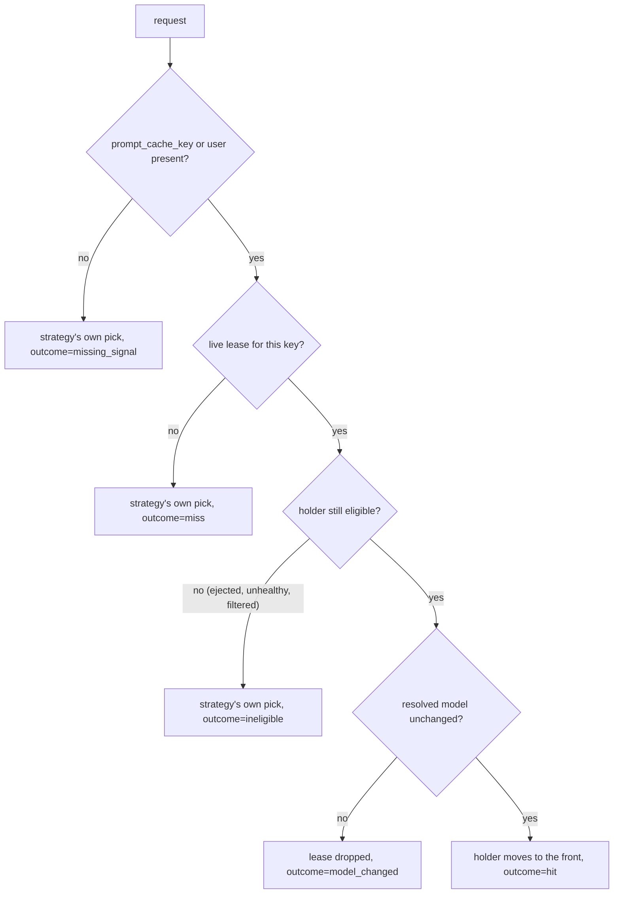
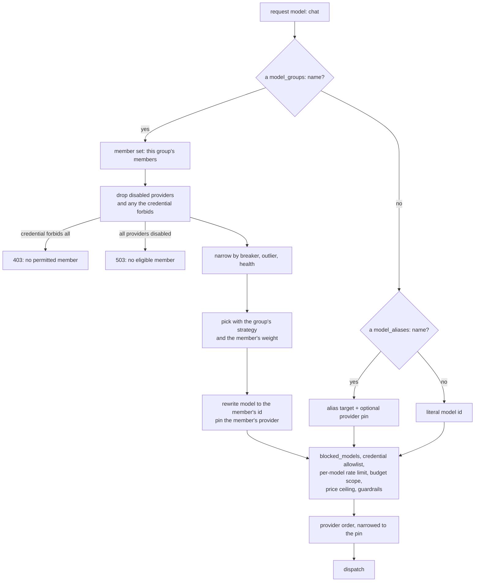
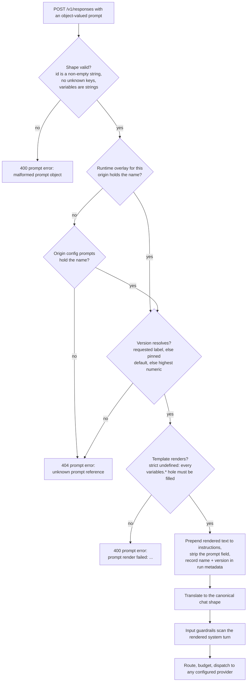

# SBproxy AI gateway guide

*Last modified: 2026-08-28*


Three providers behind one wire format ([config](../examples/ai-gateway-quickstart/)).

SBproxy includes an AI gateway that sits between your application and LLM providers. You get one API endpoint with automatic failover, cost tracking, rate limits, and programmable routing across OpenAI, Anthropic, and other providers. The proxy ships with 70 native providers behind one OpenAI-compatible API. That count is worth unpacking: 63 of the 70 catalog entries speak the OpenAI wire format and pass through unchanged, 3 (Anthropic, Gemini, Bedrock) get in-tree request and response translation, and 4 custom-format entries (SageMaker, Oracle OCI, Watsonx, Writer) are forwarded in their native shape with no translation. You bring your own provider keys and the model name passes straight through, so you reach 200+ models without waiting on us to add them.

This guide owns the end-to-end picture: provider setup, wire compatibility, routing, streaming, budgets, caching, prompt controls, and per-request attribution. Coming from an agent framework? [langchain.md](langchain.md) is the shortest path: it points LangChain's model client and MCP tools at the gateway and runs a first request end to end. Seven features get a summary here and a full page of their own: the [guardrail mesh](ai-guardrail-mesh.md), [outcome-aware routing](ai-outcome-aware-routing.md), the [AI policy plane](ai-policy-cel.md), [budget soft-landing](ai-predictive-budget.md), the [verifiable usage ledger](ai-usage-ledger.md), [LLM-aware resilience](ai-llm-aware-resilience.md), and [AI context compression](ai-context-compression.md). For those seven, the linked page is canonical; it carries the semantics, tuning advice, and reference tables.

## Provider setup

Configure one or more providers under the `action` block. Each provider needs a name, API key, and model list. A request that omits `model` falls back to the origin's `default_model`, on the hosted dispatch path as well as the locally served one, provided the origin names exactly one (see [Defaulting the model](#defaulting-the-model) below):

**Fragment:** This is one `origins` entry; it needs a sibling top-level `proxy:` block (at minimum `proxy.http_bind_port`) to be a runnable `sb.yml`. See [Full example](#full-example) below or [`examples/ai-gateway-quickstart/`](../examples/ai-gateway-quickstart/) for a complete file.

```yaml
origins:
  "ai.example.com":
    action:
      type: ai_proxy
      providers:
        - name: openai
          api_key: ${OPENAI_API_KEY}
          models: [gpt-4o, gpt-4o-mini, gpt-4-turbo]
        - name: anthropic
          api_key: ${ANTHROPIC_API_KEY}
          models: [claude-sonnet-4-20250514, claude-haiku-4-5]
      routing:
        strategy: round_robin
```

API keys support environment variable interpolation with `${VAR_NAME}` syntax. Never put raw keys in config files.

#### Defaulting the model

`default_model` is a per-provider field, not an `action`-level one; an action-level `default_model` key is ignored. A request that omits `model` takes the origin's default when every enabled provider that names one names the same one. Providers that name nothing abstain, and a provider with `enabled: false` gets no vote, because a request can never land on it. Two enabled providers naming different defaults leave the request modelless rather than routing it to whichever is listed first, which is a choice the operator did not make.

Getting a concrete model in there is not cosmetic. Every model-aware gate in the pipeline is written as "if a model was named": the `allowed_models` and `blocked_models` lists, a virtual key's per-key model scoping, model-scoped budgets, provider eligibility, and the context-compression pipeline. A request with no model skips all of them. Against an upstream that infers the model itself, an Azure deployment-scoped `base_url` or a single-model vLLM or Ollama, omitting `model` therefore reached the provider with the allowlist and the block list never consulted. With a default in place the request is gated on the model it will actually run:

```yaml
origins:
  "ai.example.com":
    action:
      type: ai_proxy
      blocked_models: [retired-model]
      providers:
        - name: openai
          api_key: ${OPENAI_API_KEY}
          models: [gpt-4o]
          default_model: retired-model
```

```bash
curl -s -o /dev/null -w '%{http_code}\n' http://127.0.0.1:8080/v1/chat/completions \
  -H 'Host: ai.example.com' \
  -H 'Content-Type: application/json' \
  -d '{"messages":[{"role":"user","content":"hi"}]}'
```

```text
403
```

The provider is never contacted. Before this, the same request reached it with an empty `model`.

Two carve-outs, called out rather than left to be discovered.

The fallback applies on the three chat-shaped surfaces only: `POST /v1/chat/completions`, `POST /v1/messages`, and `POST /v1/responses`. `default_model` names a chat model, and the other JSON surfaces on the same origin have their own model vocabularies. `POST /v1/moderations` and `POST /v1/images/generations` in particular treat `model` as optional and default it upstream, so writing a chat model into one of those bodies would turn a request the provider accepts into a 400. Those surfaces still forward no `model`, and their model gates still do not run.

The second is multipart: an audio transcription, image edit, or image variation request that carries no `model` form field is still forwarded without one, for the same reason. The multipart rewrite can replace a `model` part and cannot add one.

Two more per-provider fields bound dispatch. `timeout_ms` caps one attempt's wall clock, measured from connect through the end of the response body, so it cuts a streaming completion off mid-stream if the stream outlives it; pick it with your slowest legitimate stream in mind, not your median. `max_retries` re-dispatches on retryable failures, each attempt with a fresh timeout window, so the worst case a client waits on one provider is `(timeout_ms + backoff) x (max_retries + 1)` before routing moves on.

That is one provider. A fallback chain multiplies it again, because the dispatch loop visits each configured candidate at most once: worst case across the whole request is `(timeout_ms + backoff) x (max_retries + 1) x candidate count`. Four providers at `timeout_ms: 30000` is a two-minute wait before the caller sees an error. Nobody sizes for that on purpose, which is what the next section is about.

#### Bounding a wedged provider on a streaming request

`timeout_ms` is the wrong instrument for a provider that accepts the connection and then goes quiet. It cannot be short, because it also has to cover a legitimate three-minute completion, and while it runs no failover happens. Set `resilience.pre_header_timeout_ms` instead. It bounds connect through the provider's response headers on streaming requests only, and an elapse fails over to the next candidate:

```yaml
origins:
  "ai.example.com":
    action:
      type: ai_proxy
      routing: fallback_chain
      resilience:
        pre_header_timeout_ms: 2000
      providers:
        - name: primary
          api_key: ${OPENAI_API_KEY}
          priority: 1
          timeout_ms: 180000
        - name: secondary
          api_key: ${BACKUP_API_KEY}
          priority: 2
          timeout_ms: 180000
```

The two budgets measure different spans of the same request:

```mermaid
gantt
    title One streaming attempt, and which key bounds what
    dateFormat X
    axisFormat %s
    section Request
    connect and TLS         :a1, 0, 1
    provider thinking       :a2, 1, 2
    response headers        :milestone, m1, 3, 0
    SSE events to client    :a3, 3, 9
    section Budgets
    pre_header_timeout_ms   :crit, b1, 0, 3
    timeout_ms              :b2, 0, 9
```



`pre_header_timeout_ms` is the red span and it stops at the milestone. `timeout_ms` runs past it to the last byte, and a failover is possible only inside the red span.

The milestone is the commit point: once the provider answers `200 text/event-stream` the gateway is relaying bytes the caller is already reading, and no later candidate can take them back. A stall after that ends the stream, and it is counted on `sbproxy_ai_stream_post_commit_failures_total` rather than on the failover counter.

Send a streaming request at a primary that never answers:

```bash
curl -N -sS http://127.0.0.1:8080/v1/chat/completions \
  -H 'Host: ai.example.com' \
  -H 'Content-Type: application/json' \
  -d '{"model":"gpt-4o-mini","stream":true,"messages":[{"role":"user","content":"hi"}]}'
```

The caller gets `secondary`'s stream about two seconds in. Without the key it waits out `timeout_ms`, three minutes here, and then gets the same stream. The failover is on the metric either way, but only the bounded one carries the reason:

```
sbproxy_ai_failovers_total{from_provider="primary",to_provider="secondary",reason="pre_header_timeout"} 1
```

Two things to know about its edges. It never applies to a non-streaming request: a buffered call has no partial output to protect, so it keeps waiting out `timeout_ms`. And it only ever shortens an attempt, so a value above the attempt's own transport budget never fires: keep it under `timeout_ms`, or under 30000 on a provider that sets no `timeout_ms` and so runs on the gateway's HTTP client default.

One more, on a cluster: a `managed_model` served by another node is dispatched over the model plane from inside the same bounded attempt, so this budget bounds that dispatch too, cold start included. A cold start is legitimately slower than any hosted provider's headers. On an origin that can route to a managed model, size the budget above your cold-start allowance or leave it unset there.

With it set, the worst case above becomes `(pre_header_timeout_ms + backoff) x candidate count` for a provider that never answers, while a provider that does answer still gets its full `timeout_ms` to finish generating.

#### Letting a caller set its own budget

An agent that will abandon a call after four seconds should not be held on a provider budget sized for a two-minute batch job, and a caller doing deep research needs the opposite. `x-sbproxy-timeout-ms` lets the caller say which, replacing the selected provider's `timeout_ms` for that one request. It is off by default and the flag alone is refused at config load, because a caller who can raise a timeout holds a downstream connection, a `quota_pool` slot, and an upstream generation open for as long as you let it:

```yaml
origins:
  "ai.example.com":
    action:
      type: ai_proxy
      allow_request_timeout_override: true
      max_request_timeout_ms: 20000
      providers:
        - name: openai
          api_key: ${OPENAI_API_KEY}
          timeout_ms: 60000
```

```bash
curl -sS http://127.0.0.1:8080/v1/chat/completions \
  -H 'Host: ai.example.com' \
  -H 'Content-Type: application/json' \
  -H 'x-sbproxy-timeout-ms: 4000' \
  -d '{"model":"gpt-4o-mini","messages":[{"role":"user","content":"hi"}]}'
```

That attempt now runs on 4 seconds instead of 60. Ask for more than the ceiling and the request is refused rather than quietly clamped, so the caller can correct it in one round trip:

```bash
$ curl -sS -H 'x-sbproxy-timeout-ms: 60000' ...
{"error":{"type":"invalid_request_timeout","message":"x-sbproxy-timeout-ms of 60000 exceeds this origin's max_request_timeout_ms of 20000; ask for between 1 and 20000"}}
```

With `allow_request_timeout_override` off, the same header is dropped and the request dispatches on the configured budget. That is deliberate: callers hitting a fleet where only some origins have opted in should not collect 400s from the rest. The drop is still counted, on `sbproxy_ai_request_timeout_override_total{outcome="ignored_override_disabled"}`, along with `applied`, `over_ceiling`, and `invalid_header`.

The ceiling bounds one attempt, not the request. With `max_retries: 3` a caller asking for 20 seconds can hold four attempts of it, so the worst case is `max_request_timeout_ms x (max_retries + 1) x candidate count`. Size the ceiling against a single attempt and then do that multiplication before you pick it. Note that an honored header replaces the gateway's 30-second HTTP client default along with the provider's `timeout_ms`, so a ceiling above 30000 does buy a caller a longer attempt. Nothing else bounds it, which is why the ceiling is mandatory.

The override does not reach the gateway's own routing work. Semantic-cache embeddings, semantic-route embeddings, and shadow copies keep the shared client and its configured budgets, because a caller's completion budget is not a budget for work the caller did not ask for. It does reach a `managed_model` this process serves locally, which is dialed over the same provider HTTP client once the engine is up. It does not reach a `managed_model` served by another node in a cluster: that dispatch goes over the model plane on its own deadlines.

### Native providers
70 native providers ship in-tree. The split: 63 entries are OpenAI-format passthrough, 3 (Anthropic, Gemini, Bedrock) carry in-tree translators, and 4 custom-format entries (SageMaker, Oracle OCI, Watsonx, Writer) pass through untranslated, so clients must send those four their native body shape. You bring your own key per provider and the `model` field passes straight through, so the gateway reaches 200+ models (and any model a provider ships next) without enumerating them. Direct adapters include `openai`, `anthropic`, `gemini`, `azure`, `bedrock`, `cohere`, `mistral`, `groq`, `deepseek`, `together`, `fireworks`, `cerebras`, `sambanova`, `nvidia`, `vertex`, `databricks`, `huggingface`, `vllm`, and `openrouter`. For the AWS entries, SBproxy signs the request itself: add `aws_sigv4:` to a `bedrock` or `sagemaker` provider and the gateway computes the SigV4 `Authorization` header per request, with credentials from the standard AWS provider chain, a static key pair, or a renewed STS role session.

Any model a listed provider serves works without extra config. For a self-hosted or proprietary endpoint, point `vllm` or any provider at it with a custom `base_url`. `openrouter` is available as one of the providers when you want many vendors behind a single key. See `providers.md` for the full per-provider table.

### Managed local and cluster models

Use `provider_type: managed_model` to route a public model name to a deployment
owned by `proxy.model_host`:

**Fragment:** Nest under a top-level `proxy:` block that also configures `model_host`; see [model-host.md](model-host.md) and [`examples/model-host-managed/`](../examples/model-host-managed/) for a runnable pairing of both.

```yaml
origins:
  "ai.example.com":
    action:
      type: ai_proxy
      routing: fallback_chain
      providers:
        - name: managed-qwen
          provider_type: managed_model
          deployment: local-qwen
          models: [qwen]
          default_model: qwen
        - name: openrouter
          api_key: ${OPENROUTER_API_KEY}
          models: [qwen]
```

The normal caller authentication, provider allowlist, model allowlist, policy,
budget, and routing stages run before managed replica selection. A ready
co-located replica uses the local fast path. A ready remote replica uses the
authenticated private HTTP/2 model plane. Public bearer credentials stop at
the gateway and are not sent to workers or engines.

Every AI origin serves `GET /v1/models` and `GET /models` locally as an
OpenAI-compatible logical list built from its configured eligible providers and
models. Managed entries report aggregate `ready`, `cold`, or `unavailable`
state, ready and desired replica counts, and bounded capability names. The list
omits worker identity, engine ports, and private endpoints. It does not call an
ordinary provider's native model-list endpoint.

The list carries every name a caller may send as `model`, not only the ids in
the providers' `models:` lists: a [`model_aliases`](#model-aliases) entry
appears under its own name, and a [`model_groups`](#model-groups) entry appears
under the group name. An alias is listed under the gates that apply to the id it
resolves to, so an alias whose target `blocked_models` refuses is left off
rather than advertised as a name that answers 403.

Each entry also carries `created`, which the OpenAI `Model` object declares
required and without which an SDK-shaped client refuses to deserialize the
response. This gateway does not know when a model was published and will not
invent a date, so the value is the epoch constant: present for the schema, and
not a claim about anything.

Two token limits appear where this process knows them: `context_window` and
`max_output_tokens`. Both are **omitted rather than nulled** when it does not,
so a client can tell "the gateway was not told" from "the limit is zero". The
window comes from the built-in table the compression pipeline already sizes
prompts against, falling back to the `max_input_tokens` an operator's
[`rate_card:`](#model-prices) declares. `max_output_tokens` has only the rate
card as a source: nothing built in carries a completion cap, so an origin with
no rate card publishes no completion limits. Both are the same resolution the
`ai.catalog` routing base data reads, so a routing policy and a client are never
told different numbers for one model. No provider-specific model metadata beyond
these is reproduced.

Each entry's `capabilities` array names the surfaces this gateway will forward
for that model and that the provider catalog records the vendor as exposing.
Both halves have to agree. The first is the same per-provider surface matrix
that decides whether a request is served or answered with 501, so nothing named
here comes back 501. The second keeps a listing from claiming an endpoint on a
vendor's behalf just because its wire format implies one. Whether the upstream
then answers 200 is the upstream's business.

So the array is never wider than the 501 gate, and it is often narrower. Every
provider with `format: openai` is forwarded the whole OpenAI path set, but its
listing names only what the catalog knows that vendor serves: a DeepSeek model
lists `chat_completions`, `messages`, `responses`, and `streaming`, and not
`image_generation`. Absence is not a refusal. The request is still forwarded and
the upstream decides. Where several providers serve one public model name, a
capability appears when at least one of them has it.

The names are the surface labels from
[Supported endpoints](#supported-endpoints), narrowed to the ones a caller
reaches by naming a model, plus `streaming`. Account-scoped surfaces (`models`,
`files`, `batches`, `assistants`, `threads`, `fine_tuning`) belong to the
provider rather than to any one model, so they are left out. `GET /model/info`
and `GET /model_group/info` carry the same array. A group's array is the union
across its members and its token limits are the floor across them, for the
reasons in [Model groups](#model-groups).

Successful completions add `x-sbproxy-logical-model` and an allowlisted
`x-sbproxy-route-class` of `local`, `peer`, or `external`. Managed availability
and cold-start failures that expose a public reason use an OpenAI-style
`managed_model_error` body with a stable code, request ID, retryable flag, and
`sbproxy_reason`. Other resolution, authentication, TLS, and transport failures
use the gateway's generic error path; private detail remains in bounded logs
and metrics. Replica failover is permitted only before client output. A partial
stream is never replayed on another worker, and client cancellation propagates
to the selected engine.

Deployment `cold_start` chooses how a no-ready-replica state behaves. `wait`
coordinates one bounded launch per selected replica generation, `reject`
returns a retryable `503` with
`Retry-After: 1`, and `fallback` advances to the next provider without
launching. For `authority: file_managed`, omission follows the security
profile: production mTLS clusters use `fallback`, while development and
single-process runtimes use `wait`. Admin-managed and cluster-authority
deployments must set `cold_start` explicitly.

## Model-based provider selection

Before the routing strategy runs, the proxy narrows the candidate providers to those that declare the requested model in their `models` list. With one model per provider you get a single OpenAI-compatible endpoint where the `model` field picks the vendor:

**Fragment:** This uses the same `origins` entry shape as [Provider setup](#provider-setup) above; nest it under `proxy:` to run it. This exact shape (three providers, one model each) is the base config in [`use-case-own-openrouter.md`](use-case-own-openrouter.md) and [`examples/use-case-own-openrouter/sb.yml`](../examples/use-case-own-openrouter/sb.yml).

```yaml
origins:
  "ai.example.com":
    action:
      type: ai_proxy
      routing:
        strategy: round_robin
      providers:
        - name: openai
          api_key: ${OPENAI_API_KEY}
          models: [gpt-4o-mini]
        - name: anthropic
          api_key: ${ANTHROPIC_API_KEY}
          models: [claude-haiku-4-5]
        - name: gemini
          api_key: ${GEMINI_API_KEY}
          models: [gemini-3.5-flash]
```

A request for `gpt-4o-mini` reaches OpenAI, one for `claude-haiku-4-5` reaches Anthropic, and so on, regardless of strategy. The rules:

- A provider with an **empty** `models` list is a wildcard and stays eligible for every model (point one provider, such as `openrouter`, at many vendors this way).
- If **no** provider declares the requested model, the model name passes straight through to the configured providers unchanged, so you still reach the 200+ models a provider serves without enumerating each one.
- When more than one provider qualifies (an enumerated match plus a wildcard, say), the `routing.strategy` below picks among them.

## Provider data posture

Every entry in the provider catalog declares a data-handling posture: whether the vendor's API retains prompt data on a stock account under its published data-processing terms (`retains_data`), and whether the vendor sells a zero-data-retention arrangement at all (`zdr_available`). An origin, or a single request, can then require a posture, and the requirement is a hard eligibility filter over the provider candidate set, applied before any routing strategy runs. A request left with no eligible provider is refused, with the constraint and the excluded providers named, rather than falling back to a provider that does not meet it.

Offering an arrangement is not holding one. `zdr_available` never satisfies `require_zdr` on its own: OpenAI, Anthropic, Azure OpenAI, Bedrock, and Vertex all offer a zero-data-retention agreement and all retain by default, so reading the catalog flag as a held posture would route a `require_zdr` request straight to a stock retaining account. The flag is there so you know an agreement is available to go and sign; declaring that your deployment holds one is a line in your own config (`data_posture.zdr: true` on the provider entry). What does satisfy `require_zdr` without any declaration from you is a provider whose stock terms already store nothing (Perplexity, Cerebras) and a model you serve yourself (`serve:`, `managed_model`), where the prompt never leaves the deployment.

Bedrock used to be in that second group and is not any more. AWS still calls zero data retention the platform default, but its abuse-detection page now carves out named models: classifier-flagged traffic to the OpenAI GPT-5.x family is retained up to 30 days, and that carve-out needs no opt-in. Because the model name passes straight through from the caller, the gateway cannot tell in advance which side of the carve-out a request lands on, so the catalog records the pessimistic reading and Bedrock became `require_zdr`-eligible only by declaration.

Like the rest of the catalog, the posture fields record what each vendor's published terms say, not the result of auditing an account (the same honesty rule [providers.md](providers.md) states for base URLs and auth headers). Entries with no published commitment carry the pessimistic default, `retains_data: true, zdr_available: false`, so a constrained origin fails closed on an unknown posture rather than optimistically routing to it.



### Configuration

```yaml
origins:
  "ai.example.com":
    action:
      type: ai_proxy
      data_posture:
        require_zdr: true          # only ZDR-postured providers are eligible
        allow_data_collection: true # set false to exclude retaining providers
      routing:
        strategy: fallback_chain
      providers:
        - name: openai
          api_key: ${OPENAI_API_KEY}
          priority: 1
          # The catalog records that OpenAI offers ZDR; whether this
          # deployment operates under such an agreement is the
          # operator's declaration, made here.
          data_posture:
            zdr: true
        - name: mistral
          api_key: ${MISTRAL_API_KEY}
          priority: 2
```

| Field | Type | Default | Description |
|-------|------|---------|-------------|
| `data_posture.require_zdr` (action) | bool | `false` | Only providers whose effective posture is zero-data-retention stay eligible. |
| `data_posture.allow_data_collection` (action) | bool | `true` | When `false`, providers whose effective posture retains prompt data are excluded. |
| `data_posture.zdr` (provider entry) | bool | unset | Operator declaration that this destination operates under a ZDR agreement, which is what makes a vendor that retains by default `require_zdr`-eligible. Unless `retains_data` is set too, it implies `retains_data: false`. |
| `data_posture.retains_data` (provider entry) | bool | unset | Operator override of the catalog's retention declaration, in either direction. The two keys imply each other the way the catalog does: `retains_data: false` alone declares a destination that stores nothing, which is a ZDR posture, and `retains_data: true` alone withdraws ZDR eligibility the catalog would have granted. Set `zdr:` explicitly to say otherwise. |

A request can tighten (never relax) the origin's constraint with the headers `x-sbproxy-require-zdr: true` and `x-sbproxy-disallow-data-collection: true`; the most restrictive union wins. The effective posture of each configured provider resolves in order: a locally served (`serve:`) or `managed_model` provider is zero-data-retention by construction because the prompt never leaves the deployment; otherwise the provider entry's `data_posture:` override wins; otherwise the catalog entry for the provider type; otherwise the pessimistic default. Operators shipping a custom catalog via `proxy.ai_providers_file` declare postures the same way the embedded catalog does.

The filter runs where the credential `allowed_providers` / `blocked_providers` policy runs, ahead of every selection path: model listing, surface-capability checks, primary selection under every routing strategy, fallback order, race fan-out, shadow dispatch, and the semantic cache's embedding call all see only the eligible set. With the config above, the fallback chain serves from `openai` and `mistral` is not a fallback, because it was never a candidate.

Two paths deserve naming because a narrower filter would miss them. `/v1/messages` and `/v1/responses` are rewritten into the canonical chat body before routing, so an Anthropic-SDK or Responses-API caller is gated exactly like a Chat Completions one. And a confidence cascade does not route over the candidate order at all: each tier names its own provider, so tiers are filtered by name, an ineligible tier is skipped, and a cascade whose every tier is ineligible is refused with the same message rather than exhausting into a generic dispatch failure. A cascade with at least one posture-eligible tier proceeds, and a tier the posture constraint removed is reported as `data_posture` in the cascade's own diagnostics below, never as the calling credential's provider lock: the two are different knobs and the constraint here is the request's, not the credential's.

### When nothing qualifies

A `data_posture:` block whose own requirement excludes every provider the origin configures is refused at config load, naming the key. A strict block over a fleet that can never satisfy it is not a strict policy, it is a blackholed origin that boots green and then denies everything it is sent. The shipped example validates clean because its `openai` entry declares the ZDR agreement the block requires; delete that `data_posture:` override and nothing satisfies the constraint any more:

```console
$ sbproxy validate examples/zdr-routing/sb.yml
validate: config 'examples/zdr-routing/sb.yml' compiled, but a module failed to construct (this would fail at boot):
ai `data_posture` (require_zdr) excludes every configured provider (openai, mistral), so this origin could never route a request. Declare the posture you hold on a provider entry (`data_posture.zdr: true` for a signed zero-data-retention agreement, or `data_posture.retains_data: false`), add a provider that satisfies the constraint, or relax the block. The provider catalog records what each vendor's published terms say about a stock account, not what your own agreement says. To constrain a single request instead of the whole origin, send `x-sbproxy-require-zdr: true` or `x-sbproxy-disallow-data-collection: true`.
```

A constraint that arrives per request is not knowable at load, so that case stays a runtime refusal. The request fails closed, no upstream is contacted, and the body names the constraint and the excluded providers:

```console
$ curl -is http://127.0.0.1:8080/v1/chat/completions \
    -H 'Host: ai-any.local' \
    -H 'x-sbproxy-require-zdr: true' \
    -H 'Content-Type: application/json' \
    -d '{"model": "mistral-small-latest", "messages": [{"role": "user", "content": "hi"}]}'
HTTP/1.1 403 Forbidden
content-type: application/json
content-length: 217
Date: Fri, 21 Aug 2026 01:59:36 GMT
Connection: keep-alive

{"error":{"message":"no eligible provider under the data-handling posture constraint (require_zdr); excluded by posture: mistral","request_id":"01a0220b87a57f328f0a89069877266d","type":"no_posture_eligible_provider"}}
```

Long exclusion lists are bounded at eight names plus a count, so a large fleet cannot balloon an error body or a log record.

### Reading the effective set

`GET /admin/ai-data-posture` reports each AI origin's providers with their declared posture next to the wire format and auth header, plus the eligible and excluded sets the filter computes right now. It reads the live pipeline, so a hot reload updates it without a restart. See [admin-api-reference.md](admin-api-reference.md#get-adminai-data-posture) for the full shape, and [`examples/zdr-routing/`](../examples/zdr-routing/) for a captured response.

Each narrowing and each refusal is counted on `sbproxy_ai_data_posture_filter_total{constraint, outcome}` (`outcome="filtered"` when the set narrowed, `outcome="refused"` on the fail-closed path). A refusal is represented everywhere the gateway's other refusals are, not only in a log line: it writes a `security_audit` record (`event_type: data_posture`, carrying the hostname, request id, tenant, and resolved key id), which is the same channel WAF and rate-limit denials use, so it reaches a configured [`events:` sink](events.md) as a `policy_denied` event, appears in the admin audit feed, and lands on the tamper-evident chain when `audit.sink: chain` is on. The request's `sbproxy_ai_requests_attributed_total` series and the `sbproxy_ai_gateway_decisions_total` rejection reason carry the closed `outcome="data_posture_block"` label (a bare 403 would otherwise misread as `gateway_auth_denied`), the durable spend rollups count it as blocked rather than errored, a metered call bills as `policy_blocked` rather than `origin_4xx`, and the structured `ai.data_posture.refusal` warning names the constraint and a bounded excluded-provider list. The per-request narrowing detail (`ai.data_posture.filter`) is a debug-level diagnostic; in production, read the metric's `filtered` series to see which origins are narrowing and how much of their configured fleet the constraint is already removing.

Posture composes with the per-request training opt-out: `x-sbproxy-disallow-prompt-training` filters on the provider entry's `no_prompt_training` declaration (may the vendor train on the prompt), while `data_posture` filters on retention (does the vendor store it at all). A provider can legitimately be non-training yet retaining, so declare the two independently. The runnable pair is [`examples/zdr-routing/`](../examples/zdr-routing/): a ZDR-only origin that serves from the declared provider, plus a strict origin whose refusal names the constraint.

## Routing strategies

The `routing.strategy` field controls how the proxy picks a provider for each request, after model-based selection has narrowed the candidates.

### round_robin

Spreads requests evenly across healthy providers. A reasonable default.

```yaml
routing:
  strategy: round_robin
```

### weighted

Assigns a weight to each provider. Higher weight means more traffic.

```yaml
routing:
  strategy: weighted
```

### fallback_chain
Tries providers in priority order. When the selected provider fails or returns 5xx, the router moves to the next provider.

```yaml
routing:
  strategy: fallback_chain
```

### cost_optimized

Picks the cheapest provider that is not already loaded. The router scores each provider as `in_flight_requests * 1000 + weight` and routes to the lowest score. Set a lower `weight` on cheaper providers so they win ties when utilization is similar.

```yaml
routing:
  strategy: cost_optimized
```

### lowest_latency

Routes to the provider with the lowest observed latency based on recent request history.

```yaml
routing:
  strategy: lowest_latency
```

### least_connections

Routes to the provider with the fewest in-flight requests.

```yaml
routing:
  strategy: least_connections
```

### sticky

`strategy: sticky` behaves as `round_robin` today. The session-affinity map
exists in the router and nothing on the request path supplies it a session key,
so every request takes the round-robin fallback and no session is ever pinned.
The strategy is accepted rather than refused so existing configs keep loading.

For caller affinity that does work, use
[prompt-cache affinity](#prompt-cache-affinity) below: it keys on a cache key
the caller already sends, scopes it to the tenant and credential, and composes
with whatever strategy you have configured, including `round_robin`.

```yaml
routing:
  strategy: sticky   # equivalent to round_robin
```

### random

Picks a provider uniformly at random. Useful for spreading load when no other signal applies.

```yaml
routing:
  strategy: random
```

### token_rate (refused)

`token_rate` ranks providers by remaining tokens-per-minute headroom against a declared per-provider limit, and no configuration field declares one. With every limit at zero the score reduces to observed usage alone, which is `least_token_usage` under a different name. A config that selects it is now refused at load rather than served as a strategy other than the one it asks for.

If you have `strategy: token_rate` today, `least_token_usage` is the strategy you have actually been getting; switching to it keeps your routing unchanged. For capacity-aware routing that scores real numbers, `headroom` and `reset_aware` read the rate-limit headers providers return.

### headroom

Routes to the provider with the lowest request-quota pressure from fresh
provider rate-limit headers (`1 - remaining/limit`). Ties keep enabled-list
order. Unknown or stale snapshots are advisory only: they sort after known
fresh observations and never invent a capacity guarantee. It scores what a
provider reports about itself, which is why it is the capacity-aware
strategy to reach for.

```yaml
routing:
  strategy: headroom
```

### reset_aware

Routes to the provider whose quota window resets soonest among candidates
waiting for positive capacity. Providers that already report remaining
capacity sort first. Unknown or stale signals sort last and do not invent
a reset time. `Retry-After` is accepted as delta-seconds or HTTP-date.

```yaml
routing:
  strategy: reset_aware
```

### race


Lower tail latency at the cost of duplicate upstream calls ([config](../examples/ai-race-routing/)).

Fans the request out to every eligible provider in parallel, returns the first 2xx, cancels the in-flight losers. Optimizes p99 latency at the cost of N times the API spend per request. `resilience.outlier_detection` is meant to drop a persistently failing provider out of the race, but as of this pass it does not: see [ai-llm-aware-resilience.md](ai-llm-aware-resilience.md#what-is-adaptive-and-what-fails-over) and [`examples/ai-race/README.md`](../examples/ai-race/README.md) for the gap and a live repro.

```yaml
routing:
  strategy: race
```

See [examples/ai-race](../examples/ai-race/sb.yml). Billing implications, streaming behavior, and the interaction with the failover loop are in [ai-llm-aware-resilience.md](ai-llm-aware-resilience.md#hedged-raced-requests).

### least_token_usage

Routes to the provider with the lowest absolute observed token throughput in
the current 60-second window, regardless of any configured limit. It scores
raw observed throughput rather than headroom against a declared cap, so it
suits self-hosted vLLM or SGLang pools that do not pre-declare a token cap,
and it is the strategy `token_rate` collapsed into. Untried providers sort lowest
and are explored first. The same recent-token state breaks ties for
`prefix_affinity`.

```yaml
routing:
  strategy: least_token_usage
```

### prefix_affinity

Routes a repeated prompt prefix to a provider that has already accepted that
prefix, so a vLLM or SGLang replica can reuse its local KV cache. This is
observed affinity, not a hash assignment. On the first request for a prefix,
the router picks the eligible provider with the lowest recent token load and
records that provider as a holder only after it accepts the response. A live
holder wins on later turns. When there is no live holder, recent token load
chooses the fallback provider; exact load ties rotate with round-robin.

```yaml
routing:
  strategy: prefix_affinity
  ttl_secs: 300
  max_prefixes_per_provider: 1024
```

The default TTL is five minutes and the default capacity is 1,024 prefixes per
provider. Expired entries and least-recently-used entries beyond the capacity
are removed. Disabled or credential-ineligible providers are never selected,
even if they hold the prefix.

The affinity identity comes from the translated hub request. It includes
leading `system` and `developer` messages plus the first `user` message, and
ignores later conversation turns. The normalizer preserves roles, content,
part order, whitespace, case, and Unicode, canonicalizes JSON object keys, and
caps the canonical input at a valid UTF-8 boundary before hashing it. The
resolved model or deployment is part of the namespace, so incompatible caches
do not share an identity. A request without a usable first user message falls
back to the least-loaded eligible provider.

Prefix locations are deliberately process-local. Each gateway replica learns
its own bounded directory; locations are not looked up through the cluster
mesh. This keeps remote cluster latency out of every routing decision. Use
`sbproxy_ai_prefix_affinity_decisions_total{outcome}` to distinguish hits,
misses, and missing signals, and
`sbproxy_ai_prefix_affinity_evictions_total{reason}` to see TTL and capacity
evictions.

### peak_ewma

Power-of-two-choices over time-decayed latency and current in-flight load:
sample two eligible providers and route to the lower effective cost. A latency
spike takes effect immediately and decays toward the pool's neutral latency.
After one configured half-life without a completed attempt, the provider
re-enters at neutral cost so it can prove recovery. In-flight requests multiply
the cost, so a provider that has just started queueing is deprioritized before
a slow response completes. Providers without observations use the same nonzero
pool-neutral score.

```yaml
routing:
  strategy: peak_ewma
  half_life: 10s
```

The default half-life is `10s`. Set `half_life` as integer seconds or a
human-readable duration such as `10s`. Shorter values react and recover faster;
longer values retain spike penalties longer. Provider eligibility and
power-of-two candidate sampling are unchanged.

### cascade

Tries a sequence of `(provider, model)` tiers from cheapest to most expensive. Each tier's response is graded against its `quality_threshold`; a response that is below threshold, empty, or refused retries on the next tier. `max_total_cost` (micro-USD) is an optional cumulative budget cap, and each tier can also carry its own `cost_cap` (micro-USD): a tier is skipped, not retried elsewhere, when dispatching it would push the cumulative cost past either cap. Streaming requests dispatch only to the first tier.

```yaml
routing:
  strategy: cascade
  max_total_cost: 100000
  tiers:
    - provider_id: openai
      model: gpt-4o-mini
      quality_threshold: 0.7
    - provider_id: openai
      model: gpt-4o
      quality_threshold: 0.85
      cost_cap: 80000
```

**When no tier dispatches.** Every tier can be excluded before it is sent: by the calling credential's `provider` allow/block policy, by the request's [data-handling posture](#provider-data-posture), by a cost cap, by `enabled: false`, by the resilience layer (unhealthy, ejected, or breaker-open), or by naming a provider the config does not carry. Each skipped tier is counted on `sbproxy_ai_cascade_tier_outcomes_total{tier, outcome}` under its own closed reason (`credential_lock`, `data_posture`, `cost_cap`, `disabled`, `unhealthy`, `not_found`), and the exhaustion error names each tier's reason rather than collapsing them: `cascade exhausted without dispatching any tier (skipped: openai (data_posture), anthropic (credential_lock))`. `retry` on that metric stays reserved for a tier that did dispatch and did not produce an accepted response, so an alert on it is unaffected by any of these.

One of those reasons is a policy refusal rather than a dispatch failure. When the calling credential's provider policy is the only reason nothing dispatched, the refusal is represented everywhere the gateway's other refusals are, not only in a log line. The log line (`event="ai.cascade.credential_lock"`) names the credential's allow and block lists and the providers the routing plan asked for. The request carries the closed `credential_provider_lock` value on the `outcome` label of `sbproxy_ai_requests_attributed_total` and on the rejection `reason` of `sbproxy_ai_gateway_decisions_total`, rather than the `upstream_5xx` a bare 502 would otherwise read as, so a credential whose policy drifted away from its routing plan does not wake whoever pages on provider outages; the durable spend rollups count it as blocked rather than errored; a metered call bills as `policy_blocked` rather than `origin_5xx`; the admin Routing Decisions row carries `credential_provider_lock: <providers>`; and a `security_audit` record (`event_type: credential_provider_policy`) reaches a configured [`events:` sink](events.md) as a `policy_denied` event. The caller gets a 502 whose `Proxy-Status` `error` token is `credential_provider_locked` where the origin sets `proxy_status.enabled: true`, and whose problem document's `detail` is that same token where it sets `problem_details.enabled: true`. The token is the whole of what the caller learns: which providers this credential may reach, and which exist behind the gateway at all, stay server-side.

Grading looks for a top-level `confidence_score` JSON number (`[0.0, 1.0]`) in the tier's response. A score at or above `quality_threshold` accepts the response. When the field is absent, the response is treated as quality `1.0` and accepted outright: a tier only actually gets graded against `quality_threshold` when the provider (or a policy in front of it) returns a `confidence_score`, which plain OpenAI- and Anthropic-shaped completions do not. Without one, `cascade` still retries on a 5xx or an empty/refused response, but otherwise behaves like `fallback_chain` ordered cheapest-first, not like a quality-scored router.

See [examples/ai-cascade-routing](../examples/ai-cascade-routing/sb.yml).

### cost_quality

Scores each prompt's difficulty and routes simple prompts to a cheap model and hard prompts to a frontier model, on a single `cost_threshold` dial (`0.0` sends almost everything to the frontier, `1.0` sends almost everything to the cheap model).

```yaml
routing:
  strategy: cost_quality
  cheap_provider: openai-mini
  frontier_provider: openai
  cost_threshold: 0.5
```

### outcome_aware

Scores each provider by realized cost per successful request, learned from the gateway's own completed calls. A provider whose refusal or error rate is rising gets demoted; between two healthy providers, the one with the lower realized cost-per-success wins, which is not always the lower list price. Until every provider has a few samples the strategy round-robins, so enabling it on a fresh deployment is safe.

```yaml
routing: outcome_aware
```

The strategy blends learned picks with deterministic round-robin during
warm-up instead of waiting for a hard threshold. The scoring formula,
confidence schedule, and feedback lifetime are in
[ai-outcome-aware-routing.md](ai-outcome-aware-routing.md).

### semantic_route

Routes on what the request means. Each deployment declares its specialty as
exemplar prompts (or precomputed embedding centroids); the proxy embeds the
request's final user message once, cosine-matches it against the exemplar
vectors, and pins the best-scoring deployment when the score clears
`min_similarity`. Distinct from `prefix_affinity`, which routes byte-stable
prompt prefixes back to the worker holding their KV cache: prefix affinity
optimizes cache reuse, semantic routing sends a newly worded request to the
pool that specializes in its topic.



```yaml
routing:
  strategy: semantic_route
  min_similarity: 0.75
  fallback: chat-pool
  routes:
    - deployment: code-pool
      exemplars:
        - "Write a function that parses JSON and handles errors"
        - "Review this pull request and point out bugs"
    - deployment: chat-pool
      exemplars:
        - "Have a friendly conversation about everyday topics"
  source: openai
  openai:
    base_url: https://api.openai.com/v1
    api_key: ${OPENAI_API_KEY}
    model: text-embedding-3-small
```

`routes` declares up to 64 deployments with up to 64 exemplars each, and at
most 256 exemplar texts across every route combined. The aggregate is a
config-load refusal rather than a runtime truncation: the per-route cap on
its own would admit 4,096 texts, and every one of them is a billed embedding
call on whichever request happens to build the index. A config over it is
named at load, with the count it declared (`semantic_route routes: must
declare at most 256 exemplar texts across every route, and this config
declares 300`), and the proxy does not start.

A rule may carry a precomputed `centroid` vector instead of (or alongside)
exemplar texts; centroids never trigger an embedding call and count against
neither exemplar cap. A rule's score is the best cosine similarity over all
of its vectors, and the best-scoring rule wins. Score ties keep the earliest
declared exemplar, so decisions are deterministic.

The embedding source reuses the semantic cache's source shapes: `provider`
(an `embedding: {provider, model}` block naming one of the origin's
providers), `sidecar` (the local classifier sidecar, no egress), or `openai`
(a standalone OpenAI-compatible `/v1/embeddings` endpoint). An embedding
source is required: a `semantic_route` block without one fails config
compile with a named error, the same refusal posture `token_rate` gets. The
cache's fourth shape, `source: inprocess`, is refused here: the in-process
embedder is not reachable from the routing seam, and the error says so
rather than degrading at runtime. Route deployments, the `fallback`, and
`embedding.provider` must all name configured providers or the config is
refused, the way cascade tiers are.

Exemplar texts embed once per process on first use and the vectors are
cached, so the steady-state cost is one embedding call per request, bounded
by the embedding source's own timeout. The first-use build is single-flighted:
one request holds the gate and embeds the whole index, and a request that
arrives while that build is in flight takes the fallback rather than waiting
on it, so a cold start under load pays for one build instead of one per
request. A build that fails is negatively cached behind a retry floor that
starts at 30s and doubles per consecutive failure up to a 300s ceiling;
requests arriving inside that window also take the fallback, without touching
the embedder at all. A permanently unbuildable index (a mistyped
`embedding.model`, a centroid whose dimensions disagree with the embedder's
real output) therefore costs one attempt per window rather than one per
request.

Every non-match is a fallback, never a failure: a below-floor score, a
request with no user message, an unavailable embedder, a build already in
flight, and a build inside its retry floor all route to the declared
`fallback` deployment (or round-robin across the eligible set when none is
declared). The request is never failed or hung on this strategy's account.
The last three report the same `embed_error` outcome, so a burst of it in the
first seconds after a deploy is the cold start rather than an embedder
outage; a rate that persists is the outage.

Each decision ticks
`sbproxy_ai_semantic_route_decisions_total{outcome}` (`matched`,
`below_floor`, `no_prompt`, `embed_error`, `target_ineligible`); the
fallback outcomes also tick
`sbproxy_ai_routing_fallbacks_total{strategy="semantic_route"}`, so an
embedder outage is a visible fallback rate rather than silence.
`sbproxy_ai_semantic_route_similarity{provider}` records the best cosine
score of every scored request, matched and below-floor both, which is the
histogram to consult when tuning the floor. The score is the observation,
never a label.

Per-request, the decision lands on the admin request log as
`routing_detail` (the console renders it as **Routing detail** beside the
strategy and the selected target), which is the durable record. Three log
events carry the same decision: `ai.semantic_route.route` at `debug` for a
match, with the deployment, the winning exemplar's ordinal, the score, and
the floor; `ai.semantic_route.route_miss` at `warn` when the best-scoring
deployment is not eligible for this request; and
`ai.semantic_route.fallback` for the rest, at `debug` for a below-floor
score or a promptless request and at `warn` for an unavailable embedder.

See [examples/semantic-routing](../examples/semantic-routing/) for a
runnable two-pool config with a below-floor fallback walkthrough.

## Service tier

Several vendors sell the same model at more than one latency and price point,
selected by a `service_tier` field on the request. That field is the operator's
decision, not the caller's, because it sets the price and the operator pays the
bill. Declare it on the provider entry:

```yaml
origins:
  - match: { host: ai.internal }
    action:
      type: ai_proxy
      providers:
        - name: openai-flex
          provider_type: openai
          api_key: ${OPENAI_API_KEY}
          service_tier: flex
        - name: openai-standard
          provider_type: openai
          api_key: ${OPENAI_API_KEY}
          service_tier: standard
      routing:
        strategy: cost_optimized
```

The call, with a caller trying to buy themselves faster capacity:

```bash
curl https://ai.internal/v1/chat/completions \
  -H 'content-type: application/json' \
  -d '{"model":"gpt-5","service_tier":"priority",
       "messages":[{"role":"user","content":"summarize this"}]}'
```

The outcome: whichever entry the router picks, the body that reaches OpenAI
carries that entry's tier (`"service_tier": "flex"` or `"service_tier":
"default"`), never `priority`. An entry that declares no tier sends no tier
field at all, and the caller's is removed on the way through, so the vendor
serves on its own default.

Two tiers of one vendor are two `providers[]` entries, as above. The tier is a
property of the destination, not of a request, so the router treats them as two
candidates with independent weights, health, cooldowns, and observed latency,
and every existing strategy works over them unchanged.



The canonical tiers are `flex`, `standard`, and `priority`. Each is translated
to the vendor's own spelling by the provider catalog: OpenAI's entry maps
`standard` to its wire value `default`, and keeps `flex` and `priority` as
written. A vendor whose catalog entry declares no `service_tiers` block has no
tier the gateway knows how to ask for, and an entry naming one is refused at
config load rather than booted and served on a tier nobody chose:

```
ai provider "claude" service tier: `service_tier: flex` is not available: the
provider catalog records no service-tier vocabulary for provider type
"anthropic".
```

Only vendors whose tier vocabulary has been read off their own API reference
are declared in the shipped catalog. To add one, override the catalog with
`proxy.ai_providers_file` and give the vendor a `service_tiers` block naming
the request field and its wire value for each tier you use.

`sbproxy_ai_service_tier_decisions_total{disposition}` counts every attempt
whose tier the gateway decided, so a caller quietly losing the tier they asked
for is visible rather than silent. `caller_tier_replaced` overwrote a
caller-supplied tier, `caller_tier_stripped` removed one from an entry that
declares no tier, and `operator_tier_applied` wrote the entry's tier onto a
request that asked for none. Nothing is counted when the caller sent no tier
and the entry declares none, so an untiered deployment reads flat zero here
instead of tracking its whole request rate. It counts attempts rather than
requests, because two entries in one failover chain can carry two tiers.

## Routing policy

The strategies above are a fixed menu. `ai_routing_policy` lets you write
the routing decision yourself: a CEL expression that returns an ordered
list of provider/model candidates, and the request runs down that list
through the same executor the `cascade` strategy uses. The point is to
route on things a menu cannot express, like the caller's tier or how much
of their budget is already spent, without shipping a fork of the proxy.

```yaml
action:
  type: ai_proxy
  routing: least_token_usage      # runs whenever the policy declines
  providers:
    - name: cheap
      provider_type: openai
      api_key: ${OPENAI_API_KEY}
      models: [gpt-4o-mini]
    - name: frontier
      provider_type: openai
      api_key: ${OPENAI_API_KEY}
      models: [gpt-4o]
  ai_routing_policy:
    expression: |
      ai.principal.tier == "free"
        ? {"candidates": [{"provider_id": "cheap", "model": "gpt-4o-mini"}],
           "reason": "free tier downgrade", "reason_code": "tier"}
        : null
    reason_codes: [tier]
    on_error: decline
```

The expression reads the same `ai.*` decision view the
[AI policy plane](ai-policy-cel.md) reads (`ai.principal.tier`,
`ai.model`, `ai.budget.fraction`, the guardrail verdicts, and the rest),
and returns one of three shapes:

- A plan, `{"candidates": [{"provider_id", "model", "quality_threshold"?, "cost_cap"?}], "reason", "reason_code"?}`. The candidates are tried in order, and a `quality_threshold` or `cost_cap` on one means exactly what it means on a `cascade` tier. `reason` is required and reaches the access log, so you can see why a request routed the way it did rather than guessing. An absent `quality_threshold` or `cost_cap` means no limit, and so does an explicit null, because encoders emit null for an unset optional constantly; if you compute a limit in CEL, guard the arithmetic against non-finite values, which arrive as null and therefore as no limit.
- A decline: `null`, `{}`, or an empty candidate list. This is the common case and it is meant to be the cheapest thing to write. The configured `routing` strategy runs unchanged, so a policy that has an opinion about a few requests and none about the rest just declines for the rest.
- Nothing usable: an evaluation error, a plan with no reason, or a plan none of whose candidates survive the provider check below. `on_error` decides what happens next. `decline` (the default) falls through to the strategy; `block` refuses the request. A broken optimization policy should not take the gateway down, which is why the default fails open.

A candidate naming a provider the origin does not configure is handled
more gently: the gateway drops that candidate with a warning and runs
the plan on the survivors, and only a plan with no surviving candidate
follows `on_error`. Earlier releases refused the whole plan at the first
unknown name, which turned a partly stale plan, say one written before a
provider rename, into a failed request even when its other candidates
were fine. Degrading to the survivors keeps the request alive, and the
warning keeps the stale name visible.

One input on that decision view is worth calling out, because it turns a
built-in strategy into something you author. `ai.prompt.difficulty` is a heuristic
in `[0.0, 1.0]` over the prompt's shape (length, code, math, multi-step
reasoning), the same score the built-in `cost_quality` strategy routes
on. Reading it in a policy is the operator-authored version of that
strategy: route the hard prompts to a frontier model and let the easy
ones fall through, on your own threshold and your own providers, without
adopting the whole strategy.

```yaml
  ai_routing_policy:
    expression: |
      ai.prompt.difficulty > 0.7
        ? {"candidates": [{"provider_id": "frontier", "model": "gpt-4o"}],
           "reason": "hard prompt", "reason_code": "difficulty"}
        : null
    reason_codes: [difficulty]
```

`ai.prompt.fingerprint` sits alongside it: a salted, non-reversible
`pf_<hex>` digest of the model plus every message, stable for an identical
prompt and never embedding the prompt text. It is for keying on prompt
identity, for example pinning the same prompt shape to the same provider so a
downstream cache stays warm, without the policy ever seeing the prompt.

The policy can also read each provider's live state through `ai.providers`, a
list the gateway fills from the same per-provider health, latency, in-flight,
token-usage, and circuit-breaker signals the built-in latency and
load-aware strategies select on. That is the piece no fixed strategy exposes:
the operator, not the gateway, decides how to weigh those signals. Each entry
carries `name`, `healthy`, `latency_ms` (p50), `in_flight`, `tokens_used`,
and `circuit_open`, so a policy can steer around a slow or tripped provider
with a comprehension:

```yaml
  ai_routing_policy:
    expression: |
      ai.providers.exists(p, p.name == "primary" && p.healthy
                              && !p.circuit_open && p.latency_ms < 800)
        ? {"candidates": [{"provider_id": "primary", "model": "gpt-4o"}],
           "reason": "primary is healthy and fast", "reason_code": "provider_health"}
        : {"candidates": [{"provider_id": "backup", "model": "gpt-4o"}],
           "reason": "primary degraded, shed to backup", "reason_code": "provider_health"}
    reason_codes: [provider_health]
```

The values are a point-in-time read, the same snapshot the built-in strategies
act on, so a policy sees the provider the way the gateway does. The signals are
per provider (upstream), never per caller, so nothing tenant-specific crosses
into the decision.

Alongside the live signals sits `ai.catalog`, the base data a routing
decision consults but does not own: what each of the origin's declared
models costs (`input_per_million` and `output_per_million`, USD per million
tokens, the unit `model_prices` is already written in) and how much context
it holds (`context_window`). Prices resolve the way cost accounting
resolves them, your `model_prices` and rate card first, then the built-in
catalog, and the document rebuilds on config reload, so a price change is a
config edit, never a policy edit. A model no layer knows is omitted, so
`ai.model in ai.catalog` is the guard.

The catalog is keyed by the models your providers declare, verbatim: a
provider that omits `models` defers to the provider catalog and contributes
nothing here, so an origin whose providers all defer gets an empty catalog
and a load-time warning, because a policy reading it can never match.
Declare `models` in the casing callers request them with:

```yaml
  ai_routing_policy:
    # Send expensive prompts to the cheap tier unless the caller paid.
    expression: |
      ai.principal.tier != "pro"
        && ai.model in ai.catalog
        && ai.catalog[ai.model].input_per_million > 10.0
        ? {"candidates": [{"provider_id": "cheap", "model": "gpt-4o-mini"}],
           "reason": "pricey model on a free plan", "reason_code": "price"}
        : null
    reason_codes: [price]
```

Two things the policy is not allowed to do. It cannot route to a model
your origin or the caller's key does not allow: every candidate's model
is re-checked against the same allowlist the request already passed, and
a plan that names a blocked model is refused with a 403 instead of
served. And it does not run at all for a bring-your-own-key (native)
request, because fanning that request across your providers would replay
the caller's own credential somewhere it was never meant to go. A
security `route_to:` from the AI policy plane also wins over the plan: if
a guardrail downgrades the model, that downgrade is what ships.

`reason_code` is only for the metric. Each decision increments
`sbproxy_ai_routing_policy_decisions_total{outcome, reason_code}`, and
only codes you list in `reason_codes` pass through as themselves.
Anything else collapses to `other`, and an absent code reads as `policy`,
which keeps a policy from filling the label with unbounded distinct
values.

The `outcome` label separates a plan that ran whole (`plan`) from one
the gateway had to degrade first (`plan_degraded`, at least one tier
dropped for naming a provider this origin does not configure), from
`decline`, `overridden` (a security `route_to` cleared the plan), and
`error`. Alert on `plan_degraded`: the request was served, but not by
the plan as written, and the reason in the access log still describes
the plan the policy returned.

The policy is not tied to CEL. The `engine` + `source` form authors the
same decision in Lua, JavaScript, or Rego, and `engine: wasm` attaches
compiled code instead of inline source. Every engine reads the same `ai`
document (Lua and JavaScript as an `ai` global, Rego as `input.ai`,
WebAssembly as the `ai` field of its request envelope) and returns the
same plan shape, so a policy ported between engines renames nothing.
`on_error` and `reason_codes` work identically in every engine.

```yaml
  # Lua: return a plan table, or nil to decline.
  ai_routing_policy:
    engine: lua
    source: |
      if ai.prompt.difficulty < 0.3 then
        return { candidates = {{provider_id = "cheap", model = "gpt-4o-mini"}},
                 reason = "easy prompt", reason_code = "cost" }
      end
      return nil
    reason_codes: [cost]
```

```yaml
  # Rego: the queried rule's value is the plan; undefined declines.
  # `data` is a base-data table the rules read as `data.*`, so the
  # routing map changes without the policy changing.
  ai_routing_policy:
    engine: rego
    source: |
      package sbproxy
      route := {"candidates": [{"provider_id": data.cheap_provider, "model": "gpt-4o-mini"}],
                "reason": "over budget"} if {
          input.ai.budget.fraction > 0.8
      }
    data:
      cheap_provider: cheap
    reason_codes: [cost]
```

```yaml
  # WebAssembly: a compiled bundle hook, attached by type.
  ai_routing_policy:
    engine: wasm
    type: acme_router          # an `ai_routing` hook a loaded bundle declares
    vars: { aggressiveness: 2 }  # validated by the bundle's config_schema
```

There is no `source` to inline here. The `type` names an `ai_routing`
hook a loaded [extension bundle](extension-bundles.md) declares in its
manifest, running under the envelope WASM runtime, and `vars` is that
attachment's config, checked against the hook's `config_schema`. The
hook reads the same `ai` document as every other engine and returns the
same plan envelope. It declares no capabilities and takes no request
body, because a routing decision does no I/O and the `ai` document is
its whole input.

Lua and JavaScript run inline source on a fresh sandboxed VM per
evaluation, the same cost model as every other inline script surface.
Lua source is parse-checked at config load; JavaScript has no
compile-only seam in the embedded engine, so a JS syntax error surfaces
at the first evaluation under `on_error` rather than at load. Rego
evaluates on a shared in-process interpreter with a 50 ms budget
(`budget_ms` to change it, which must be greater than zero), a `query`
defaulting to `data.sbproxy.route`, and load-time validation: a module
whose query names no rule refuses at config load rather than declining
forever. In place of inline `source`, Rego also accepts `module_path`, a
filesystem path to a `.rego` file read when the config compiles (the two are
mutually exclusive), and `rego_v0: true` for a module written before OPA
1.0's `if`/`contains` requirement; see
[scripting.md](scripting.md#3a-rego-policies) for both. A `wasm` hook runs
its compiled module under the sandbox budget its bundle manifest declares,
not a knob in this block, and it resolves at config load too: a `type` no
loaded bundle declares, or a config that loads no bundle at all, refuses
then rather than at the first request.

## Resilience

Per-provider circuit breaker, outlier detection, and active health probes layered on top of the routing strategy. Each signal independently ejects a provider; when every provider is ejected, the router falls back to the unfiltered enabled list rather than refusing the request.

`health_check` is unconditionally live: it runs its own background probe task regardless of routing strategy. `circuit_breaker` and `outlier_detection` are enforced as a selection gate and fed by production traffic: every settled provider attempt records one outcome against both, on every routing strategy and whether the request streams or not, so a provider that fails every request is ejected. See [ai-llm-aware-resilience.md](ai-llm-aware-resilience.md#what-is-adaptive-and-what-fails-over) for which status counts which way.

```yaml
resilience:
  circuit_breaker:
    failure_threshold: 5
    success_threshold: 2
    open_duration_secs: 30
  outlier_detection:
    threshold: 0.5
    window_secs: 60
    min_requests: 5
    ejection_duration_secs: 30
  health_check:
    path: /models
    interval_secs: 30
    timeout_ms: 5000
    unhealthy_threshold: 3
    healthy_threshold: 2
```

Each signal also recovers on its own terms, and none of them writes to another. A breaker admits a probe once `open_duration_secs` has passed and closes after `success_threshold` probes succeed. An outlier ejection lapses after `ejection_duration_secs`. A probe verdict flips back after `healthy_threshold` consecutive passes, whether or not the provider is receiving traffic. A provider that failed on two signals returns when both have cleared, and no signal can hold it out on another's behalf.

See [examples/ai-resilience](../examples/ai-resilience/sb.yml). Field reference in [configuration.md#resilience-resilience](configuration.md#resilience-resilience).

### LLM-aware resilience

Status-code retries treat every failure the same. The gateway can instead classify each upstream failure into a typed cause (rate limit, context-window overflow, content-policy refusal, auth, malformed request) and apply a retry count per class, so a transient failure retries while a request that would only fail again goes to a fallback. Switch it on with a `retry_policy` under `resilience`:

```yaml
resilience:
  retry_policy:
    rate_limit: 3      # retry a 429 up to 3 times
    server_error: 2
    content_policy: 0  # never retry a refusal in place
```

A sibling `cooldown_policy` maps the same failure classes to provider cooldowns: a classified failure of a mapped class removes that provider from candidate rotation for the configured seconds (a `429` can park a provider for 30s; a dead credential can stop eating the first attempt on every request). Both policies default to current behavior when unset.

The same block hosts the legacy `llm_aware.context_compress` shorthand, which maps to stateless `window_fit` when no explicit compression policy is present, and `content_policy_fallback`, which routes a refusal to the next provider in priority order. The failure-cause table and hedged-request behavior are in [ai-llm-aware-resilience.md](ai-llm-aware-resilience.md). Ordered summary, query selection, token pruning, retrieval shaping, and final fitting are documented in [AI context compression](ai-context-compression.md).

### Typed fallback triggers

The fallback chain is generic: any retryable failure advances to the next provider in priority order. Two failure classes deserve a different next hop, and each gets its own list as a sibling of `routing:` on the action:

```yaml
routing:
  strategy: fallback_chain
context_window_fallbacks: [big-window]   # prompt overflows the model's window
content_policy_fallbacks: [permissive]   # provider refused on safety grounds
```

Each list names providers from the same action's `providers:` (a name matching nothing fails config load). An oversized prompt is caught by the pre-flight token estimate and rerouted to a larger-window provider before anything dispatches, so streaming requests participate too. The estimate runs on the three token-priced chat surfaces, `/v1/chat/completions`, `/v1/messages`, and `/v1/responses`, since the last two reach the trigger already normalized to the canonical chat body; on any other surface the pre-flight half stands down and only a provider that answers with a recognizable context-overflow body trips the trigger. A content-policy refusal reroutes to the aimed list instead of whatever the chain had queued next. A typed reroute is visible on `sbproxy_ai_failovers_total{reason="context_window"|"content_policy"}`. The generic availability hop is on the same counter under a different spelling: `reason="http_<status>"` for a status-code failover, `reason="transport"` for a connection failure, and `reason="managed_cold_fallback"` for a cold managed replica. `generic` is not a value of that label; it is the `failover_trigger` value on the admin console's request log, where the closed set is `context_window`, `content_policy`, and `generic`. Full decision-path diagram, scope notes, and the per-class retry and cooldown interplay are in [ai-llm-aware-resilience.md](ai-llm-aware-resilience.md#typed-fallback-triggers); the runnable, credential-free walkthrough is [examples/typed-fallbacks](../examples/typed-fallbacks/).

### Credential rejection is not a failover

A `401` or `403` from a provider is a statement about the credential, not about the provider, and the two get different machinery. This is the single most misreadable thing in the resilience surface, so the ruling, in one line: **key fallback owns `401` and `403`; the provider failover and `cooldown_policy` own everything else.**

A `429`, a `5xx`, or a timeout says the provider cannot serve you right now, and a different key against a rate-limited provider is still rate limited, so those advance to the next provider. A `401` is not retryable by default and opens no failover, so with nothing else configured it reaches the caller verbatim. An entry can instead name an operator-held credential to retry the *same* provider on, once:

```yaml
providers:
  - name: openai
    api_key: vault://primary/secret/data/acme/openai?key=api_key
    fallback_credential_id: house-openai   # a key_management.seed.credentials[] id
    on_key_failure: fallback               # the default; `fail_closed` opts out
```

The retry keeps the provider, the model, the base URL, and the price the request was quoted at. It does not spend the availability budget, and it happens at most once per request. When the operator's credential is also refused, or does not resolve, the untried tail of the failover chain is still there behind it, so an availability failover runs exactly as it would have.

A request that arrived carrying a caller-owned native provider key never falls back, whatever the entry says: the caller presented their own credential and the provider refused it, so spending yours would bill you for their authorization failure.

`credential_source` on the admin request row (`provider_entry`, `native_caller`, `fallback`) says which secret paid, one `credential_fallback` event lands on the typed feed per swap, and `sbproxy_ai_key_fallbacks_total{provider,outcome}` counts the same decision for anyone alerting off the scrape rather than off the feed. Full decision path, the `fail_closed` argument, and a runnable walkthrough are in [multi-tenant.md](multi-tenant.md#when-a-tenants-provider-key-is-refused) and [examples/tenant-key-fallback](../examples/tenant-key-fallback/).

### When a broken connection stops the meter

A non-streaming completion spends nearly all of its wall clock waiting on the provider's response header, and the caller is on the other end of that wait. When that caller's connection breaks first, the gateway drops the provider call instead of paying for a response nobody will read. The connection to the provider closes, and the request settles on a `client_disconnected` receipt whose usage is whatever the provider had reported, which for a call abandoned before its response header is none.

There is no timer in this. No deadline, no "the caller has been quiet for N seconds", no heuristic about how long a model ought to take. A slow client is still a client and a slow provider is still worth waiting for, so the gateway watches the downstream connection itself and acts only on an unambiguous break.



**What cancels.** A TCP reset or any read failure on an HTTP/1 connection, and an `RST_STREAM` or `GOAWAY` on an HTTP/2 stream. Each of those says the connection is broken: no response can reach the caller whatever the gateway does next, so continuing to pay for one is pure waste. HTTP/2 is the exact case, because a client that cancels sends a frame that says so.

**What does not, and the gap that leaves.** A bare HTTP/1 half-close does not cancel. RFC 9112 section 9.6 lets a client shut down its write side and go on reading the response, and on the wire that polite half-close is byte-for-byte identical to a client that walked away: both are one FIN, and nothing distinguishes them without writing to the socket. Cancelling on it would abort live callers, so the gateway treats it as "this client has finished sending" and carries on.

The residual is worth stating plainly rather than hiding behind the guarantee: **a client that half-closes its write side and then silently vanishes keeps its generation running until a write to it fails.** For an HTTP/1 client that simply closes its socket while waiting, that is what happens, and the disconnect is caught at the response write instead of during the generation. That write failure is attributed to the caller by both relays. The receipt reads `client_disconnected`, and a streamed response carries the usage it had received before the write failed; a buffered one carries whatever the provider reported, since the response was already complete. The residual is narrower and is a property of the socket rather than of the relay: a write Pingora buffered and never flushed cannot fail, which is the ordinary case for a small body, so a client that vanishes without its FIN ever reaching a write is still billed as delivered. Nothing in this process learns it left. What the gateway will not do is guess, because the guess it would have to make cannot be made from a FIN.

**The opt-in, where a half-close really does mean gone.** If you know your callers never half-close after sending, set `cancel_on_half_close: true` on the `ai_proxy` action and the FIN is read as the departure it usually is:

```yaml
origins:
  ai.example.com:
    action:
      type: ai_proxy
      cancel_on_half_close: true    # default false
      providers:
        - name: openai
          api_key: ${OPENAI_API_KEY}
```

That is what makes the ordinary HTTP/1 abandonment reachable: a caller whose own deadline fired and closed its socket sends a FIN and nothing else, so with the flag off the generation runs to completion and is billed, and with it on the provider call is dropped where it stands.

Enable it only on that knowledge, because the cost of being wrong is paid by a live caller: a client that half-closes and is still reading has its request cancelled and receives an error instead of the completion it was waiting for. Plain HTTP client libraries do not half-close; hand-rolled tools, some load generators, and a fronting proxy configured to shut the request side down do. The scope is the origin, so it applies to every caller and tenant routed to that action, and it changes exactly one answer: a reset, a read error, an `RST_STREAM` and a `GOAWAY` all cancel with the flag off, and a client that keeps its connection whole is never cancelled with it on. There is still no timer.

**Scope.** The wait for the provider's response header on the sequential non-streaming dispatch path. A streaming response learns the caller left from its own per-chunk write failing: it drops the upstream body there, prices the receipt as `client_disconnected`, and settles the usage it received before the write failed. See [what a stream is billed](#what-a-stream-is-billed). A hedged (`strategy: race`) dispatch and a confidence `cascade` resolve on their own paths and are not watched. A caller who leaves after the response header has arrived is past the window; the generation is already paid for.

**Watching a request never changes how it is billed.** The watch reads the downstream connection without recording anything about it, so a request that was not cancelled is priced exactly as it was before this existed. That matters more than it sounds: the receipt classifier treats a recorded half-close plus a failed delivery as a client disconnect, so a watch that recorded what it saw would have turned provider outages into partially billable client departures on signed documents.

**The `on_error` fallback does not run for a cancelled call.** An origin's `fallback_origin: {on_error: true}` exists to give a waiting caller something rather than a 502, and a cancelled call has no waiting caller; on an `ai_proxy` fallback it would also dispatch a second paid provider call and hand back the spend the cancellation saved. Every other failure, including one Pingora attributes to the client such as a malformed request header, still serves the fallback exactly as before. See [routing.md](routing.md#failing-over-fallback-origin).

Operators see a cancellation three ways: on `sbproxy_ai_provider_attempts_total{outcome="client_disconnected"}`, on the request's span as `error.type=client_disconnected`, and on the consumption receipt, whose outcome is `client_disconnected` and whose billable treatment is whatever the origin's `billable:` table says for it. See [metering.md](metering.md#billable-the-outcome-table) for the table.

## Shadow eval

Mirror a sampled set of non-streaming chat evaluation requests to a second provider. V1 includes Chat Completions plus Messages and Responses requests after those native formats are normalized to the chat hub. Mutating and non-chat surfaces, including Assistants, Threads, Batches, Fine Tuning, Files, images, audio, embeddings, moderation, and reranking, are never copied. The copy is taken after request policy, guardrails, model rewrites, and context compression. Shadow admission is bounded by both 16 in-flight tasks and a 64 MiB reservation budget per live AI client, and the upstream call is fire-and-forget: a slow, failed, timed-out, policy-disallowed, or saturated shadow never delays or rejects the primary. Streaming requests are intentionally skipped.

When a fair-share quota pool is enabled, a sampled shadow copy reserves its
own request unit after the local shadow gates and commits it only at the
background send boundary. A quota denial suppresses only the optional copy;
it never replaces or delays the primary response.

The shadow body is drained while at most 1 MiB is retained for comparison metadata, which is logged at `target=sbproxy_ai_shadow` (status, latency, prompt/completion tokens, finish reason). The answer *text* is kept only when the content-recording consent below is on, and is dropped with the frame otherwise. Configured usage sinks also receive a separate row with `tag: shadow` and a fresh server-generated request ID ending in `:shadow`. That row estimates shadow cost for comparison, but it never debits the primary budget tracker.

### Two or more targets

```yaml
shadow:
  targets:
    - provider: anthropic
      model: claude-sonnet-4
      sample_rate: 0.1
      timeout_ms: 30000
      task_timeout_ms: 30000
    - provider: gemini
      sample_rate: 0.1
```

Each target sees the same request and produces its own upstream call, its own usage-ledger row, and its own metric series. Two entries naming the same provider are refused at config load, and so is an empty `targets:` list: the provider name identifies the target everywhere it appears, and an empty list is a block that looks configured and evaluates nothing.

The single-target form is still accepted verbatim and means a one-entry list:

```yaml
shadow:
  provider: anthropic
  sample_rate: 0.1
  timeout_ms: 30000
  task_timeout_ms: 30000
```

**One admission ceiling, shared.** The 16-task and 64 MiB bounds are process-wide limits on how much optional work the gateway carries, so admission runs once per target rather than once per request. Three targets take three slots. A target that cannot get one is dropped as `saturated` and the others still run; the primary is never affected either way.

**One sampling draw, shared.** `sample_rate` still means "one request in ten", but the ten are chosen once per request and every target is compared against that same draw. Target populations therefore nest rather than diverge: everything a `0.1` target saw, a `0.5` target on the same route also saw. That is what makes two targets comparable, on the smaller one's whole population. Independent per-target draws would give disjoint populations, and cost and latency measured on different requests do not compare.

### Reading the comparison

Per target, from the usage ledger:

| Field | Says |
|---|---|
| `tag` | `shadow` on every shadow row |
| `provider` | which target produced this row |
| `shadow_of` | the primary request this row evaluated, and the join key back to the primary's row |
| `request_id` | this row's own id, freshly minted per target and ending in `:shadow` |
| `finish_reason` | the target's terminal finish reason, which is the cheapest disagreement signal: one target on `length` where another said `stop` truncated. Shadow rows only. The primary's finish reasons reach the request span as `gen_ai.response.finish_reasons`, not the ledger row, so a primary-versus-target comparison joins the ledger to the trace |
| `cost_usd`, `latency_ms`, `prompt_tokens`, `completion_tokens` | the usual per-row figures |

`shadow_of` is carried as data and is never the ledger's dedup key. The correlation-id feature lets a caller choose its own request id through `X-Request-Id`, so a shadow row whose key was derived from the primary's would let one caller suppress another caller's rows on ledger replay.

Per target, from Prometheus:

- `sbproxy_ai_shadow_calls_total{target, status_class, finish_reason}` counts completed calls. `finish_reason` is closed to the OpenAI chat vocabulary plus `none` and `other`, because the raw value comes off a provider response body.
- `sbproxy_ai_shadow_latency_seconds{target}` uses the same buckets as `sbproxy_ai_request_duration_seconds`, so a target's distribution reads against the primary's without rescaling.

Cost per target is answerable from the ledger rather than from a metric, deliberately: the ledger is non-lossy and the metrics feed is not, and a cost figure that silently drops samples under load is worse than no cost figure.

### Retaining the pair

Numbers say a candidate cost less and answered faster. They never say it answered *worse*. Reading that needs the two answers side by side, which means keeping text, which means consent.

Retention rides the same two-sided gate the primary content store uses, and nothing widens it: the origin sets `capture_content: true` **and** the calling key's policy sets `allow_content_capture`. With either side off, the target's response body is drained exactly as before, and no sink is installed in the first place, so the text is never held rather than held and then discarded.

```yaml
origins:
  "ai.local":
    action:
      type: ai_proxy
      capture_content: true      # half the gate; the key policy is the other half
      shadow:
        targets:
          - provider: anthropic
            model: claude-haiku-4-5
```

The pair is whole or absent. A target's answer whose primary was not captured is refused by the store rather than kept on its own, because half a pair is not a comparison and keeping it would retain content whose counterpart the gate declined. Both halves go through the same redaction stack as the primary sample: the always-on secret redactor, then the origin's PII rules, then the payload cap. At most eight targets are retained per request.

Read the pair on the existing per-request content endpoint, where it arrives beside the primary's own answer:

```bash
curl -su admin:secret \
  http://127.0.0.1:9090/api/requests/$REQUEST_ID/content | jq
```

```json
{
  "request_id": "01J...",
  "input_messages": [{"role": "user", "content": "What is 2+2?"}],
  "output_text": "4",
  "shadow_responses": [
    {"target": "anthropic", "model": "claude-haiku-4-5", "status": 200, "output_text": "Four."}
  ]
}
```

Reading a sample is audited with the operator's name, the same as any other content read.

### The comparison view

One row per target, over a window:

```bash
curl -su admin:secret \
  'http://127.0.0.1:9090/api/ai/shadow/report?window=1h' | jq
```

`window` takes `15m`, `1h` (the default), `24h`, `7d`, or `30d`.

```json
{
  "window_secs": 3600,
  "targets": [
    {
      "target": "anthropic",
      "provenance": {
        "requests_seen": 412,
        "sample_rate": 0.1,
        "pairs_retained": 38,
        "pairs_dropped": {"sampled_out": 371, "shadow_timeout": 2, "shadow_error": 1},
        "responses_retained": 38,
        "evicted_before_primary": 0
      },
      "cost": {
        "shadow_usd": 0.147,
        "primary_usd": 0.226,
        "delta_usd": -0.079,
        "delta_usd_per_request": -0.00208,
        "delta_usd_extrapolated": -0.857
      },
      "latency": {
        "shadow_p50_ms": 610, "shadow_p95_ms": 1840,
        "primary_p50_ms": 720, "primary_p95_ms": 1490,
        "delta_p50_ms": -110, "delta_p95_ms": 350
      },
      "finish_reasons": {"stop": 35, "length": 3},
      "errors": {
        "shadow_rate": 0.073,
        "primary_rate": 0.0,
        "shadow_status_classes": {"2xx": 38, "5xx": 2, "none": 1}
      },
      "agreement": {
        "status": "not_configured",
        "pairs_judged": 0,
        "judge_spend_usd": 0.0,
        "paused": false,
        "wins": 0, "ties": 0, "losses": 0
      },
      "cost_to_decide_usd": 0.147
    }
  ]
}
```

Read it in the order it renders, because that order is the argument:

- **Provenance first.** A delta over four pairs and a delta over four thousand look identical once each is a single number. `requests_seen` counts every request that reached per-target admission, `pairs_retained` counts the ones where both halves landed, and `pairs_dropped` accounts for the rest by reason. The three sum. `responses_retained` says how many pairs also kept their text, which is zero unless the consent gate above is on.

  The `pairs_dropped` key set is closed, and it is this: `sampled_out`, `provider_not_found`, `provider_not_allowed`, `prompt_training_disallowed`, `egress_denied`, `saturated`, `quota_denied`, `shadow_timeout`, `shadow_error`, `primary_missing`, `not_reported`. A key is absent when its count is zero, so write a dashboard against the whole set rather than against the keys one sample happened to produce. It is not the same vocabulary as `sbproxy_ai_shadow_dropped_total`'s `reason` label below: that counter reports route-level skips including `streaming`, which never opens a pair at all.

  `not_reported` is the copy that has been admitted and has not answered yet, or whose task died without answering. It is deliberately off the error axis: a call still in flight has failed nothing, and charging it to `errors.shadow_rate` would make that rate climb with concurrency on a target whose every call succeeds. Expect a non-zero `not_reported` on any window narrower than a target's own latency.

- **`evicted_before_primary` is the sample's error bar.** The ledger is a ring of the last 512 requests, and a request's primary leg is recorded at the end of the request, seconds after its slot opened. A route busy enough to turn 512 requests over inside that gap loses pairs the windowed counts above can never mention, so those evictions are counted here instead, since process start rather than over the window. Zero means the window's counts are the whole population. Non-zero means they are a truncated sample biased toward the primaries that finished fastest, which is the direction that hides a tail regression, and that a narrower `window` will read truer than a wider one.
- **Every delta is over the retained pairs and nothing else.** A failed or timed-out call is on the error axis and off the cost and latency ones, because a call that produced nothing has no comparable price. Negative means the candidate was cheaper or faster. `delta_usd_extrapolated` projects the per-request delta across `requests_seen`, which is what promoting the candidate would have cost or saved on the whole eligible population rather than the sampled slice.
- **Latency is p50 and p95, never a mean.** A candidate whose median matches and whose tail doubles is exactly the migration that should not happen, and a mean hides it.
- **The finish-reason distribution is the cheapest disagreement signal there is.** A candidate stopping on `length` where the primary stopped on `stop` truncated its answer, and no amount of cost comparison says that. A call that produced no reason at all is counted under `none` rather than folded into `stop`.
- **`shadow_status_classes` counts every call that answered or timed out**, so it sums to `pairs_retained` plus the calls on the error axis and not to `requests_seen`. A supervisor timeout carries status `504` and lands under `5xx`; a call that never produced a response at all carries `0` and lands under `none`. In the example above that is 38 retained, the two `shadow_timeout` drops under `5xx`, and the one `shadow_error` under `none`.
- **`cost_to_decide_usd`** is what running the evaluation cost: the target's own spend over the window plus whatever a judge spent on it. The shadow leg is a real second bill, and it belongs beside the saving it is measuring.

The source is a bounded in-process ring of the **last 512 requests** that reached per-target admission. It clears on restart and it is not a metric: the per-target counters above already carry the scrapeable series, and this answers what a PromQL query cannot, which is what one target cost *relative to the primary that ran beside it*. A window wider than the ring's turnover reports the ring rather than the window, which is why `requests_seen: 512` on a `30d` window is a saturated ring and not thirty days of traffic, and why `evicted_before_primary` is the number to read beside it.

### Scoring agreement

Whether the candidate answered *better* is a judge's question, and this gateway answers it as a batch job over retained pairs rather than inline on the request path. Inline is structurally wrong here: the shadow leg exists precisely because it is fire-and-forget, so by the time the candidate answers, the caller has already been served the primary and there is nothing to block on. A survey of shipped gateways on 2026-08-27 found one product running a judge inline, at roughly 1.5 seconds of user-visible latency, to score a single response rather than compare two; every other shipped judge runs asynchronously.

Configure the judge under `shadow:`:

```yaml
shadow:
  targets:
    - provider: anthropic
      sample_rate: 0.1
  judge:
    provider: judge-openai   # a providers[] entry, never the model under evaluation
    max_spend_usd: 5.0       # required, and refused at zero
    spend_window: daily      # daily (default) or weekly
```

Those three keys are the whole surface. `provider` is resolved against this action's `providers[]` at config load and a name that matches nothing is refused there, rather than booting clean and surfacing when the scorer ships.

`max_spend_usd` has no default on purpose. An unbounded judge is the failure the key exists to prevent, so a `judge:` block without it is refused at config load, on the same reasoning as the request-timeout ceiling. **One `max_spend_usd` is one ceiling for the whole block**: every target under this `shadow:` draws on the same budget, so a two-target block written with `5.0` is exposed to five dollars and not ten. Two routes naming the same candidate provider also share that candidate's budget, because the bill for judging one candidate is one bill.

`spend_window` rolls from when the window opened rather than from a calendar boundary: `daily` is a rolling 24 hours from process start or the last reset, not midnight UTC, and `weekly` is a rolling 7 days. A restart opens a fresh window. When the cap refuses a pair, judging auto-pauses for the rest of the batch and `agreement.paused` says so; it reads `true` from the first refusal, which happens while the spend is still under the cap, because a pair reserves two calls up front.

**Nothing behind this key is running yet.** Two pieces of it are implemented and tested and have no caller:

- **The deterministic divergence pre-filter.** Two answers that are byte-identical, or identical once whitespace and JSON key order are normalized, need no judge and must not be billed for one. A finish-reason mismatch counts as divergence even when the texts match, because two answers can read the same and still have stopped differently.
- **The spend cap and its auto-pause**, which admit a pair by reserving two calls, because the reverse-order run is part of the method rather than an option.

Both are waiting on the batch job that would call them, which is the judge prompt and the scoring loop, and that is the scoped follow-up. Until it ships, the entire runtime effect of a `judge:` block is that `agreement.status` reads `scoring_pending` instead of `not_configured` and `judge_spend_cap_usd` appears in the row. `judge_spend_usd` reads zero because nothing has spent anything. Do not read the cap as a control in force: it is a number the scorer will honor, not a limit anything is currently enforcing.

The design the scorer will implement is fixed, and is why the budget already reserves two calls per pair: blind pairwise comparison with randomized A/B labels, plus a second pass of the same pair in the opposite order, with the flip rate between the two published per candidate. That is not fastidiousness. Across 36 models the first-shown candidate is picked 64.3% of the time, and a content-free null model scores 86.5% on AlpacaEval 2.0 by exploiting exactly that bias, so a single-order verdict is closer to a coin flip than to a score. Both responses will be carried as untrusted data in structured fields the prompt never interpolates as instructions, and every verdict row will be stamped with judge model and prompt version so a suspect batch can be re-judged.

### Streaming stays out of scope

A streamed answer is committed to the caller frame by frame. There is no complete candidate text to compare until the stream ends, and buffering one to get it would put the primary's memory ceiling under the candidate's control, which is the opposite of what the 16-task and 64 MiB admission bounds exist to guarantee. So streaming requests are skipped for shadow dispatch, and there is nothing to retain or score for them. Evaluate a candidate on the non-streaming population and promote it for both.

Every shadow target must appear in `providers`. Set `enabled: false` on a shadow-only provider to exclude it from primary routing; explicit shadow selection still uses it. Credential `allowed_providers` and `blocked_providers` rules apply to it independently; a disallowed shadow is suppressed while the primary continues. The `x-sbproxy-disallow-prompt-training` opt-out also suppresses a shadow provider unless it declares `no_prompt_training: true`. If the hosting process attaches a purpose-scoped egress authorizer to `AiClient`, v1 shadow dispatch fails closed because the shadow transport cannot yet consume authorized DNS pins and redirect checks. `sbproxy_ai_shadow_dropped_total{reason=...}` reports the closed skip/drop reasons `streaming`, `provider_not_found`, `provider_not_allowed`, `prompt_training_disallowed`, `egress_denied`, and `saturated`. Deliberate sample misses are not failures and do not increment that counter.

See [examples/ai-shadow](../examples/ai-shadow/sb.yml).

## Proxy-native AI patterns

SBproxy is a proxy first, so AI traffic composes with everything else the proxy offers: CEL policies, forward rules, regex guardrails, request modifiers. Patterns that are awkward or impossible to express in a pure AI gateway library:

| Pattern | Mechanism | Example |
|---------|-----------|---------|
| Tenant access control before any AI call | `policies` (CEL expression) | [93-ai-cel-tenant-gate](../examples/ai-cel-tenant-gate/sb.yml) |
| Mixed AI + non-AI on one hostname (health probes, docs, model catalog) | `forward_rules` with inline child origins | [94-ai-mixed-traffic](../examples/ai-mixed-traffic/sb.yml) |
| Custom DLP beyond built-in PII (codenames, ticket IDs, internal hostnames) | `guardrails.input` with `regex` patterns | [95-ai-regex-dlp](../examples/ai-regex-dlp/sb.yml) |
| Topic enforcement (allow-list of approved keywords) | `regex` guardrail with `action: allow` | [95-ai-regex-dlp](../examples/ai-regex-dlp/sb.yml) |


Regex DLP rules run in the guardrail stage, so the rejection costs no tokens ([config](../examples/ai-regex-dlp/)).

CEL policies and request modifiers run before the AI handler dispatches, so a rejection costs no provider tokens. Forward rules dispatch by path, which means health checks and probe traffic can stay on the same hostname without billing a model. Regex guardrails inspect the parsed prompt body and slot in next to PII, injection, jailbreak, and schema guardrails.

## Native format translation

Clients always speak the OpenAI chat completions shape; sbproxy rewrites the body, path, and response back to OpenAI shape when the upstream provider speaks a different protocol.

| Provider format | Direction | Status |
|-----------------|-----------|--------|
| OpenAI | pass-through | always |
| Anthropic Messages API | bidirectional, non-streaming | shipped |
| Anthropic SSE events | native stream to hub stream | shipped |
| Google Gemini `generateContent` | bidirectional, non-streaming | shipped |
| Google Gemini `streamGenerateContent` | native stream to hub stream | shipped |
| Google Gemini embeddings | bidirectional `/v1/embeddings` | shipped |
| AWS Bedrock Converse | bidirectional, non-streaming | shipped |
| AWS Bedrock Converse stream | native stream to hub stream | shipped |

For Anthropic, the request hoists `system` and `developer` role messages to the top-level `system` field, defaults `max_tokens` when missing, maps `user` onto Anthropic's `metadata.user_id`, strips OpenAI-only knobs (`logit_bias`, `n`, `presence_penalty`, `frequency_penalty`, `response_format`, `seed`), and rewrites the path from `/v1/chat/completions` to `/v1/messages`. The response converts text and tool_use blocks back into the OpenAI `choices[].message.content` and `tool_calls` shape, surfaces `thinking` blocks as `message.reasoning_content`, maps `stop_reason` to `finish_reason`, and renames `usage.input_tokens` / `output_tokens` to `prompt_tokens` / `completion_tokens`.

The whole tool surface is translated, not just the tool definitions. Anthropic has no `tool` role and no top-level `tool_calls` key, so a multi-turn tool conversation needs all three of these to reach the provider at once:

| OpenAI shape the client sends | Anthropic shape the provider gets |
|---|---|
| `tools: [{type: function, function: {name, description, parameters}}]` | `tools: [{name, description, input_schema}]` |
| an assistant turn's `tool_calls` | `tool_use` content blocks on that turn, with `arguments` parsed into `input` |
| a `role: "tool"` turn with `tool_call_id` | a `user` turn holding one `tool_result` block keyed by `tool_use_id` |

A definition already carrying `input_schema` is Anthropic's own and passes through untouched, so a `/v1/messages` client whose body took the internal round trip and one that skipped it send the same tools upstream.

What the Anthropic request direction still cannot carry, and how you see it: every drop below records a lossiness note, counted on `sbproxy_ai_translation_dropped_total{surface="anthropic_translator", field}` and named in the same one-warn-per-request line the inbound seams use. The `anthropic_translator` surface is deliberately not an inbound surface value, so it adds a row to a drop-rate panel rather than changing one.

| Dropped | Field label | What the caller loses |
|---|---|---|
| `logit_bias`, `n`, `presence_penalty`, `frequency_penalty`, `response_format`, `seed` | `anthropic.request.{key}` | the sampling control or structured-output shape the request asked for. `n: 1` and an explicit `null` are not counted, because neither changes the reply |
| a `tool_choice` shape Anthropic has no name for | `anthropic.request.tool_choice` | the model chooses tools as if it were `auto` |
| a `user` value that is not a string | `anthropic.request.user` | end-user attribution the provider never sees |
| a tool definition with no function name | `anthropic.request.tools` | that one tool, rather than the whole request, which Anthropic would refuse over it |
| a `system` or `developer` turn carrying no text | `anthropic.request.system` | those instructions, since Anthropic's `system` field is text only |

Two gaps are still open and are not surfaced this way, because nothing is dropped: an `image_url` content part and the deprecated `role: "function"` turn are both forwarded verbatim and answered with the provider's 400. Multimodal parts need a base64 conversion and an egress decision about remote image URLs; the deprecated role carries no `tool_call_id` to key a `tool_result` with.

For Gemini, chat completions are rewritten to `generateContent`: roles become Gemini `contents`, system messages become `systemInstruction`, sampling options move under `generationConfig`, and Gemini candidates plus `usageMetadata` are converted back into OpenAI choices and usage. Gemini embeddings translate OpenAI `/v1/embeddings` requests to Gemini embedding calls and normalize the response back to OpenAI embedding objects.

For Bedrock, chat completions are rewritten to the model-agnostic Converse API. System messages become Bedrock `system` entries, user and assistant turns become `messages`, supported sampling and tool fields move into Bedrock's native request shape, and Converse responses are converted back to OpenAI choices and usage. Bedrock and SageMaker requests are signed by SBproxy at the transport boundary, after this translation runs, so the SigV4 payload hash covers the translated Converse body.

For streaming responses, the relay parses native Anthropic, Gemini, and Bedrock frames into the internal hub stream, then re-emits the client-facing format selected by the inbound route. Oracle OCI, Watsonx, SageMaker, and other `Custom` formats are not translated in-tree; send their native body shape or route through a custom/OpenRouter adapter.

See [examples/ai-claude](../examples/ai-claude/sb.yml) and [providers.md](providers.md).

## Rate limits

Apply rate limits per client or globally to control costs and prevent abuse:

```yaml
origins:
  "ai.example.com":
    action:
      type: ai_proxy
      providers:
        - name: openai
          api_key: ${OPENAI_API_KEY}
          models: [gpt-4o-mini]
          default_model: gpt-4o-mini
      routing:
        strategy: round_robin
    policies:
      - type: rate_limiting
        requests_per_minute: 100
```

Clients exceeding the limit receive a `429 Too Many Requests` response with a `Retry-After` header.

### Fair-share quota pools

An AI action can reserve every upstream attempt against a weighted request
pool. Pool members are immutable virtual-key or API-key ids from the resolved
request principal, not provider names. Use the credential's immutable public
`key_id` in `weights`; a mutable display `name` is never an accounting key.
Only traffic on an origin with no authentication or explicit `noop`
authentication uses the literal `__anonymous__` member. A request accepted by
Bearer, forward-auth, plugin, or another authentication provider without an
immutable key id fails closed when a quota pool is enabled; add `key_id` to
legacy inline credentials before enabling the pool. Every admitted identity
must appear in `weights`; an unknown member is denied instead of borrowing
another member's share.

```yaml
action:
  type: ai_proxy
  providers:
    - name: openai
      api_key: ${OPENAI_API_KEY}
    - name: anthropic
      api_key: ${ANTHROPIC_API_KEY}
  quota_pool:
    name: shared-agents
    window: 1m
    total_limit: 120
    weights:
      team-a: 3
      team-b: 1
    policy: hard
    dimension: request
    consistency: local
    failure_mode: closed
```

`local` is the dependency-free default. `approximate` reuses the installed
approximate governance store and its cluster-mesh dissemination. `strong`
reuses the installed strict Redis governance store for atomic cross-process
admission. A shared pool's consistency must match
`proxy.key_management.governance.consistency`: quota `approximate` pairs with
governance `approximate`, while quota `strong` pairs with governance `strict`.
See [Governed admission: strict and approximate](key-management.md#governed-admission-strict-and-approximate)
for the mesh and Redis configuration.

The policies have these admission guarantees:

| Policy | Behavior |
| --- | --- |
| `hard` | Enforces both the aggregate limit and each member's weighted entitlement. |
| `soft` | Enforces the aggregate limit, admits over-entitlement use while capacity remains, and meters the over-share. |
| `burst` | Lets a busy member borrow idle aggregate capacity while preserving the pool total. |

Each failover or retry is a separate upstream attempt and receives its own
reservation. Failures before dispatch release the reservation; once an
attempt can leave the process it is committed even if the upstream later
returns an error. A real policy denial returns `429` and never fails open.

Shared-backend failure defaults to `failure_mode: closed`, which returns `503`
before dispatch. `allow_unreserved` admits an attempt only when the backend is
unavailable; it does not bypass a real quota denial. Every such admission
increments `sbproxy_ai_quota_pool_fail_open_total{pool}`.

`failure_posture` is the preferred spelling and supersedes `failure_mode`
when both are set: `closed` behaves the same as `failure_mode: closed`, and
`degraded` behaves the same as `allow_unreserved`. `open` is also accepted.
`observe` is rejected here, because a reservation that could not be taken has
no counterfactual verdict to record.

### Per-surface rate limits

Per-model and per-tenant rate limits cap each user, key, or model independently. The AI gateway also supports per-surface caps that apply to a classified API surface (chat completions, assistants, image generation, audio speech, ...) so expensive paths can be throttled without affecting cheap ones.

```yaml
origins:
  "ai.example.com":
    action:
      type: ai_proxy
      providers:
        - name: openai
          api_key: ${OPENAI_API_KEY}
      per_surface_rate_limits:
        image_generation:
          requests_per_minute: 30
        audio_speech:
          requests_per_minute: 60
        chat_completions:
          requests_per_minute: 600
```

Keys are the `AiSurface` labels emitted on metrics (`chat_completions`, `messages`, `responses`, `models`, `embeddings`, `assistants`, `threads`, `batches`, `fine_tuning`, `files`, `realtime`, `image_generation`, `image_edits`, `image_variations`, `audio_transcription`, `audio_speech`, `moderations`, `reranking`). Surfaces without an entry are uncapped. When the cap fires, the proxy returns 429 before any upstream call.

The sliding window is one minute, shared across all configured origins
(state is process-global). Realtime runs configured hard-budget admission
before its WebSocket upgrade, but the byte-transparent relay does not inspect
or charge individual frames. Frame-derived audio or token caps therefore
remain unavailable.

## Guardrails


Input guardrails inspect the parsed prompt ahead of egress ([config](../examples/ai-guardrails/)).

The built-in pipeline supports ten guardrail types: `pii`, `injection`, `jailbreak`, `toxicity`, `content_safety`, `schema`, `regex`, `context_poisoning`, `agent_alignment`, and `classifier`. Built-in guardrails run on input (before the provider call) or output (after), and they can block, flag, or rewrite content. For HTTP policy services, use [external guardrail adapters](guardrails.md). For CEL-based request gating see the CEL section below, and [configuration.md](configuration.md#guardrails-guardrails) for the per-type field schema.

An external guardrail entry carries two independent settings that are easy to confuse. `mode` picks when the adapter runs and, in the `logging_only` case, says it must never refuse; that is the enforcement axis. `failure_posture` says what happens when the adapter cannot be reached, is too slow, or returns something that is not a verdict; that is the failure axis. They compose: a guardrail can sit in `mode: logging_only` during rollout while already declaring `failure_posture: closed` for the day it starts enforcing. Accepted values are `closed` (refuse, the default), `open` (admit), and `degraded` (admit, and record that the content was never scanned; prefer this over `open`). `observe` is rejected on this axis, because a provider that never answered leaves no verdict to shadow-record; `mode: logging_only` is the observe-shaped setting, on the other axis. The older boolean spelling `fail_open: true|false` still parses and still means `open` and `closed`; setting both to values that disagree is a config-load error naming both keys. Field reference and the per-provider contracts are in [guardrails.md](guardrails.md). A Bedrock provider entry can also carry `bedrock_guardrail`, which asks Bedrock to evaluate the guardrail inside the `Converse` generation instead of as a separate `ApplyGuardrail` call; that control has no failure posture, and the two are compared in [guardrails.md](guardrails.md#bedrock-guardrails-inline-on-the-converse-call).

Input guardrails apply to whichever body field the surface carries user text in:

| Surface | Field guarded |
|---|---|
| `chat_completions`, `assistants`, `threads` | `body["messages"][].content` |
| `image_generation`, `image_edits`, `image_variations` | `body["prompt"]` |
| `audio_speech` | `body["input"]` |
| `reranking` | `body["query"]` |
| `moderations` | `body["input"]` |

A single built-in guardrail block on the AI handler config covers every supported surface; the proxy picks the right field automatically based on the classified surface. A request whose inbound `Content-Type` starts with `multipart/` bypasses the built-in input check on the surfaces that actually accept multipart bodies (image edits, image variations, audio transcription, audio translation, file uploads, and any request the proxy cannot classify), because its body is forwarded byte-transparently and never parsed as JSON; see [Multipart bodies](#multipart-bodies) below for which surfaces those are and what happens on the rest. Built-in output scanning for those requests is reserved for a follow-up. External adapters apply their documented [unavailable-content policy](guardrails.md#streaming-and-multipart-content) to multipart bodies.

A multipart `Content-Type` on a classified JSON surface such as `chat_completions` or `embeddings` does not take that path. `AiSurface::accepts_multipart` is the allowlist, and a multipart `Content-Type` on any surface it excludes is refused with `403` and a `security_audit` entry (`multipart_disallowed_surface`; see [audit-log.md](audit-log.md)) before any budget check, guardrail, or upstream dispatch runs. Each bypassed check on a surface the allowlist does permit still increments `sbproxy_ai_multipart_inspection_skipped_total`, labeled by `check` (`input_guardrails` or `pii_redaction`) and by `surface`; that counter can no longer fire for `chat_completions` or any other disallowed surface, since those requests are refused before reaching it. It now means legitimate multipart surfaces that skipped body inspection, and a nonzero rate on `audio_transcription` or `image_edits` is expected traffic, not a bypass attempt.

### Gateway-side retrieval (RAG)

An `ai_proxy` route can carry a `rag:` block that makes the gateway perform retrieval itself: it embeds the request's query, runs a tenant-scoped search against a configured vector store, and injects the retrieved chunks as marked system context before dispatch. The stage order is fixed: input guardrails run over the original request, then retrieval, then context injection, then the input guardrails run again over the augmented request, and only then do the AI policy plane, budgets, caching, and routing proceed. Retrieved text therefore gets the same screening as user text, and a prompt the original pass rejects never causes embedding egress. Field reference, failure policy, limits, build features, and metrics are in [rag.md](rag.md); the runnable fixture walkthrough is [`examples/ai-rag-local/`](../examples/ai-rag-local/). The optional `use_stale` retrieval cache is in-memory and per route, and it deliberately has no admin listing or purge endpoint; restarting or reloading the process is what clears it.

### Safety guardrail modes

`toxicity`, `jailbreak`, and `content_safety` each have two explicit modes.
`mode: keyword` is the default and preserves the zero-dependency behavior:
case-insensitive substring matching over operator-supplied words or the
built-in jailbreak/content-safety lists. Keyword mode is fast and requires no
model files, but it does not understand paraphrases, obfuscation, translation,
or meaning. Do not describe it as ML classification.

`mode: classifier` uses the local embedding classifier and is enforcing. It
does not silently fall back to keyword matching. Structural errors such as a
missing classifier block, unknown taxonomy class, or ignored keyword-only
field make the candidate configuration fail before publication. Startup and
reload construct enforcing safety classifiers before publishing the pipeline.
If either artifact is unavailable or its digest does not match the centroid
pin, boot or reload fails with a configuration error; keyword matching is
never substituted.

```yaml
guardrails:
  input:
    - type: jailbreak
      mode: classifier
      classifier:
        backend:
          kind: embedding
          model_path: /var/lib/sbproxy/models/minilm/model.onnx
          tokenizer_path: /var/lib/sbproxy/models/minilm/tokenizer.json
        scope: last_user_message
        max_chars: 2000
```

The files in that example are operator-supplied and are not part of the
binary. Download the pinned revision and place both files with the commands in
[Local inference: Download the models](local-inference.md#download-the-models)
before validating or starting the proxy.

The class sets are closed and intentionally separate:

| Guardrail | Required classifier classes | Blocked classes |
|---|---|---|
| `toxicity` | `toxic`, `safe` | `toxic` |
| `jailbreak` | `jailbreak`, `safe` | `jailbreak` |
| `content_safety` | `violence`, `self_harm`, `sexual`, `hate_speech`, `illegal`, `safe` | the nonempty `blocked_categories` selection |

The three enforcing taxonomies ship versioned, precomputed centroids, so
`classes` is optional. Operator examples under a known class extend its
shipped centroid instead of replacing it. The artifact pins
`sentence-transformers/all-MiniLM-L6-v2` at revision
`5641a7880f40ebf4035d05e60c5f9b7a9c272c84`, its ONNX and tokenizer SHA-256
digests, and the artifact's own detached SHA-256. Any mismatch is a hard
configuration error. Omitted thresholds use the calibrated artifact values;
explicit threshold fields remain available for operator tuning. The measured
precision and recall, fixtures, method, false-positive budget, and
regeneration command are recorded in
[the default centroid evaluation](ai-default-centroids-evaluation.md).
Run `scripts/regenerate-default-safety-centroids.sh --write` with the pinned
model available locally to rebuild the vectors and report. CI-style freshness
checks use the same script with `--check`.

Classifier entries that resolve to the same artifacts share one loaded
embedder. Input classification defaults to the last user message;
set `scope: full_text` to classify the complete prompt. Output classification
always sees the complete assistant text, extracted from OpenAI Chat, Anthropic
Messages, or OpenAI Responses envelopes using the same concatenation as
decoded streaming deltas. An explicit `scope: last_user_message` is therefore
rejected under `output:`.

Classifier-backed output checks default to `stream_policy: close`. For a
non-streaming response this blocks before the response is returned. For a
streaming response the relay holds every response-body frame until it evaluates
the accumulated assistant text at stream close. A clean verdict releases the
original frames in order. A blocked verdict, classifier error, decode failure,
or 1 MiB decoded-text or relay-buffer overflow fails closed without releasing
body bytes and prevents cache admission. Response headers may already have
been sent, so a blocked client sees an empty terminated stream rather than a
new error status. Use `stream_policy: off` only as an explicit coverage
tradeoff; `stream_policy: chunk` is rejected because a full-text classifier is
not prefix-stable.

Every evaluation increments
`sbproxy_ai_safety_guardrail_verdicts_total{guardrail,class,backend,verdict}`.
The `backend` label distinguishes `keyword` from `classifier`, so dashboards
can verify which path is actually active. This is an evaluation counter, not
a request counter: streaming keyword mode can record more than one allowed
evaluation while successive deltas are scanned. Classifier inference errors
use `class="error"` and `verdict="block"`; they are never counted or cached as
allows. The complete enforcing example is
[ai-safety-classifiers](../examples/ai-safety-classifiers/).

### Embedding classifier

The input-only `classifier` guardrail labels a prompt with the nearest
operator-defined class. It runs a local sentence-embedding model, embeds each
configured example once when the guardrail is built, averages those vectors
into one unit centroid per class, and compares each request with cosine
similarity. A class wins only when it clears both `min_score` and the
`min_margin` over the runner-up.

```yaml
guardrails:
  input:
    - type: classifier
      backend:
        kind: embedding
        model_path: /var/lib/sbproxy/models/minilm/model.onnx
        tokenizer_path: /var/lib/sbproxy/models/minilm/tokenizer.json
        min_score: 0.30
        min_margin: 0.05
        max_model_bytes: 209715200
      classes:
        documentation:
          - "write the readme"
          - "prepare an upgrade guide"
        coding:
          - "implement the parser"
          - "fix the request handler"
      scope: last_user_message
      max_chars: 2000
```

Classifier output is a non-enforcing routing label, separate from security
guardrail block verdicts. The winning class appears in
`ai.guardrails.labels` in both the serial and mesh paths, where an `ai_policy`
expression can select `route_to:<model>`. A classifier label never contributes
to the mesh's `flagged_count`, block quorum, or redaction decision. Putting
`classifier` under `output:` is a hard config error because the backend needs
message scope and cannot safely classify streaming response chunks.

Classifier configuration fails before publication when it contains unknown
fields, blank artifact paths or labels, a class without a nonblank example, or
non-finite/out-of-range score thresholds. `max_chars` is a Unicode-character
limit for both request subjects and configured centroid examples; an example
over the limit is rejected rather than silently embedding an unbounded string.

The released binary includes `inprocess-classify`. Source builds that disable
default features must enable it explicitly. Model and tokenizer files remain
operator-supplied. For the routing-only `classifier` guardrail, artifacts are
opened lazily and a load or inference failure emits a warning and no class, so
existing routing continues and neighboring security guardrails remain active.
Classifier-backed safety guardrails are constructed during startup or reload;
an artifact load or digest failure rejects the candidate pipeline, and a later
inference failure produces a fail-closed block.

The public JSON schema deliberately leaves `action` as raw JSON so the module
registry can accept built-in and external actions without regenerating one
union for every plugin. It therefore cannot enumerate the nested classifier
fields in editor completion. The field table in
[configuration.md](configuration.md#classifier-input-guardrail) is the
normative public schema, and the AI action compiler validates the tagged
backend shape when it builds the pipeline.

Internally, `sbproxy-ai` owns the `TextClassifier` trait and config shape,
while `sbproxy-core` installs the ONNX implementation. That split is
intentional: `sbproxy-classifiers` already depends on `sbproxy-ai`, so naming
its `OnnxEmbedder` directly inside `sbproxy-ai` would create a crate cycle.
Classifier entries share one loaded embedder when the resolved artifact paths
and digests match and each entry's model-size limit accepts the current file.
Replacing either file at the same path invalidates reuse on reload.

The runnable configuration is
[ai-classifier-routing](../examples/ai-classifier-routing/).


### Guardrail mesh

By default the input guardrails run as a serial chain that blocks on the first security detector to flag. The opt-in mesh runs them as a cascade instead, collects security verdicts plus routing labels, and fuses the security verdicts under a quorum rule, with optional redact-and-continue, a verdict cache, and a latency budget for the expensive classifiers. Switch it on with a `mesh` block under `guardrails`:

```yaml
guardrails:
  input:
    - type: injection
    - type: pii
      patterns: [email]
  mesh:
    block_threshold: 2     # block only when >= 2 detectors flag
    redact_on_flag: true   # below the threshold, mask the prompt and continue
```

Fusion semantics, verdict-cache keying, and the latency cascade are in [ai-guardrail-mesh.md](ai-guardrail-mesh.md).

### Streaming policy

Every built-in output guardrail runs on streaming responses, and the verdicts match what the buffered path would decide for the same assistant text. The proxy decodes each streamed delta (the JSON content, not the raw SSE frame bytes) and feeds it to a per-stream guardrail session that keeps matcher state across chunks, so a pattern split across two deltas still matches.

| Guardrail | On streaming output | How |
|---|---|---|
| `regex` | yes | runs per decoded delta; set `stream_policy: close` when a pattern must span delta boundaries |
| `pii` | yes | runs per decoded delta |
| `schema` | yes | the complete accumulated response is validated once, at stream close; per-delta evaluation never runs because an intermediate delta is incomplete JSON |
| `context_poisoning` | yes | rule matches are per-message |
| `injection` | yes | case-insensitive substring set, matched over a cumulative window |
| `toxicity` | yes | keyword mode matches over a cumulative window; classifier mode holds body frames for full-response evaluation at close |
| `jailbreak` | yes | keyword mode includes the standalone-DAN word rule and a cumulative window; classifier mode holds body frames for full-response evaluation at close |
| `content_safety` | yes | keyword mode matches category terms over a cumulative window; classifier mode holds body frames for full-response evaluation at close |
| `agent_alignment` | yes | streamed `tool_calls` deltas are assembled per call and judged when each call completes; block mode holds tool-call frames back until their call is judged, while text deltas flow |

A block terminates the stream and the response is never admitted to any cache. Live keyword and chunk-policy guards can only withhold the violating chunk and everything after it. Classifier-backed close-policy guards hold the entire response body, so a block releases no body bytes. Headers may already be sent, so the client sees the stream terminate rather than receive a new error status. Input guardrails always run against the full request regardless of `stream`.

Each output entry takes an optional `stream_policy` when the default live evaluation is not what you want:

```yaml
guardrails:
  output:
    - type: toxicity
      keywords: [badword]          # default: evaluated live as deltas arrive
    - type: regex
      patterns: ["(?s)BEGIN.*END"] # spans deltas: check the full text at stream end
      stream_policy: close
    - type: content_safety
      blocked_categories: [violence]
      stream_policy: "off"         # never evaluated on streaming responses
```

`close` defers the check to stream end over the accumulated text. Mid-stream bytes have already reached the client by then, so its guarantees are the recorded verdict, the violation metric, and cache denial, not recall of delivered content. `off` skips the guardrail on streaming responses entirely and increments `sbproxy_ai_stream_guardrail_skipped_total` so the coverage gap stays visible. Violations under any policy increment `sbproxy_ai_stream_guardrail_violations_total`.

`schema` entries default to `stream_policy: close` and reject an explicit `chunk`, for the same reason classifier-mode entries do: the verdict is only meaningful over the complete result. A schema block on a streaming response is therefore a close-time verdict with the close-policy guarantees above; it does not hold body frames back, so it cannot recall bytes the client already received.

### Schema guardrail

`type: schema` on the output side enforces that the model produced structured output matching a JSON Schema ([config](../examples/ai-guardrails/)):

```yaml
guardrails:
  output:
    - type: schema
      schema:
        type: object
        required: [summary, tags]
        properties:
          summary:
            type: string
          tags:
            type: array
```

The schema compiles once, when the configuration is published, and the full compiled schema is enforced on every response: property types, nested `required`, `additionalProperties`, array constraints, `enum` and `const`, numeric and string bounds, and `allOf` / `anyOf` / `oneOf` / `not` composition. In-document `#/...` references resolve. A configuration whose schema is missing, invalid, larger than 64 KiB serialized, nested deeper than 32 levels, or carrying an external `$ref` fails to load with an error naming the problem. Remote reference fetching is disabled outright, the same SSRF posture as the `json_schema` transform and the OpenAPI validator.

The guardrail judges the assistant payload, not the transport envelope. For OpenAI Chat responses that is `choices[].message.content` (multiple choices concatenate in index order), for OpenAI Responses it is the assistant message output items, and for Anthropic Messages it is the text content blocks. This is the same canonical extraction the classifier-backed output guardrails use, so a route that translates between provider formats validates the same payload on every surface. The extracted text is parsed as JSON before validation; when the schema's top-level `type` is exactly `string`, the text is validated directly as a string instance instead. A response the gateway cannot map to an assistant payload fails closed with a `schema` block: an unrecognized response shape, a tool-call-only turn with no content, or a body that is not valid UTF-8.

A block reports the failing JSON path and the schema keyword in the form `Schema validation failed at /summary (keyword: type)`. The offending value never appears in the error, because it is model output that would otherwise be relayed into the client-visible error body. Missing `required` property names are the one exception; those names come from the operator's schema, not from the response.

### Context-poisoning guardrail


The guardrail scans tool and retrieval content, not just the user turn ([config](../examples/ai-context-poisoning/)).

The `context_poisoning` input guardrail flags untrusted retrieval content that tries to manipulate the model before a downstream tool call. This is the indirect prompt injection vector from Greshake et al. (2023): a RAG pipeline pulls a poisoned page into the model's context, and the model then issues a tool call influenced by that content.

The check runs on the full input, including any `role: tool` or `role: function` messages that the AI gateway treats as retrieval content. Findings carry a stable `rule_id` and a confidence weight; the `min_confidence` setting filters out low-weight rules.

```yaml
guardrails:
  input:
    - type: context_poisoning
      enabled: true
      action: deny           # log | score | deny (default deny)
      min_confidence: 0.5
      rules:                 # optional allowlist; omit for all rules
        - cp_instruction_ignore_previous
        - cp_tool_call_scaffold
        - cp_encoded_instruction
        - cp_conflicting_directive
```

The rule catalog covers four families:

| Family | Sample rule IDs | Detects |
|---|---|---|
| Instruction-like patterns | `cp_instruction_ignore_previous`, `cp_instruction_you_are_now`, `cp_instruction_system_prompt_leak`, `cp_suspicious_url` | "ignore previous instructions" style payloads, role-swap framings, exfiltration URL shapes |
| Tool-call hints | `cp_tool_call_scaffold`, `cp_tool_call_json_shape` | Literal `<tool_use>`, `function_call:`, or JSON tool invocations inside passive content |
| Encoded instructions | `cp_encoded_instruction` | Base64 and hex blobs that decode to instruction-like text |
| Conflicting directives | `cp_conflicting_directive`, `cp_instruction_imperative_regex` | Imperative second-person language in `role: tool` or `role: function` content |

Every hit emits `sbproxy_ai_context_poisoning_findings_total{rule_id, action}`. When `action: deny`, the request is also counted in `sbproxy_ai_context_poisoning_blocked_total` and the proxy returns a 4xx before any upstream call. `action: log` and `action: score` keep the request flowing; they differ only in the metric label so dashboards can separate observability volume from scoring volume.

See `examples/ai-context-poisoning/` for a complete sample configuration and curl commands.

### Agent-alignment guardrail


The guardrail compares each tool call against the stated user goal ([config](../examples/ai-agent-alignment/)).

The `agent_alignment` input guardrail audits the assistant's `tool_calls` array against operator-declared rules: an allow list of tools the agent is permitted to invoke, an explicit deny list that always trips even when allowed elsewhere, a forbidden-substring scan over the tool arguments, and a per-turn budget on the number of tool calls. The check is the LlamaFirewall (arXiv:2505.03574) "Agent Alignment Check" use case rendered as a deterministic ruleset so the per-request cost is bounded; an LLM-judge advisory variant rides a follow-up and slots into the same configuration.

Unlike the other guardrails this one runs against the raw request body so it can read the OpenAI / Anthropic / MCP tool-call shapes; the flat-text view that backs `pii` / `injection` / etc. strips `tool_calls` and would silently miss the goal-divergence cases.

```yaml
guardrails:
  input:
    - type: agent_alignment
      enabled: true
      mode: flag                # flag (default, observability only) | block
      allowed_tools: [search, fetch]
      denied_tools: [delete_account]
      forbidden_arg_substrings:
        - "/etc/passwd"
        - "AKIA"                # leaked AWS-key shapes
      max_tool_calls_per_turn: 4
```

`mode: flag` records every violation as a log line + access-log entry but lets the request through; once the operator has tuned the rule lists they flip to `mode: block` so the dispatch loop short-circuits to a 400 on the next violation. Tool calls in any of three shapes are recognized: OpenAI (`tool_calls[*].function.name` + `function.arguments`), Anthropic (`tool_calls[*].name` + `input`), and MCP (`tool_calls[*].tool` or `tool_calls[*].name` + `arguments`). The forbidden-substring scan is case-insensitive against the JSON encoding of whichever argument field is present.

See `examples/ai-agent-alignment/` for a runnable configuration that exercises every rule.

## Lua hooks

Lua request modifiers run on AI origins the same way they do on plain proxy origins: an entry in the `request_modifiers` list carries a `lua_script` that defines `modify_request(req, ctx)` and returns headers to set. Scripts run in a sandboxed VM with wall-clock and memory budgets; see [scripting.md](scripting.md) for the full contract.

Note that a header set from Lua does not steer AI provider selection; the gateway picks a provider from the requested model and the `routing.strategy`. Use Lua for tagging and classification, and model-based selection for routing:

```yaml
origins:
  "ai.example.com":
    action:
      type: ai_proxy
      providers:
        - name: openai
          api_key: ${OPENAI_API_KEY}
          models: [gpt-4o-mini]
          default_model: gpt-4o-mini
        - name: anthropic
          api_key: ${ANTHROPIC_API_KEY}
          models: [claude-sonnet-4-20250514]
      routing:
        strategy: round_robin
    request_modifiers:
      - lua_script: |
          function modify_request(req, ctx)
            local caller = "human"
            local ua = req.headers["user-agent"] or ""
            if string.find(ua, "python") or string.find(ua, "node") then
              caller = "sdk"
            end
            return {
              set_headers = { ["X-Caller-Kind"] = caller }
            }
          end
```

## CEL request gating

Block AI requests with a CEL `expression` policy. The expression returns a boolean; `false` denies the request with the configured `deny_status` and `deny_message`. There is no `cel:` key under `request_modifiers`.

```yaml
origins:
  "ai.example.com":
    action:
      type: ai_proxy
      providers:
        - name: openai
          api_key: ${OPENAI_API_KEY}
          models: [gpt-4o-mini]
          default_model: gpt-4o-mini
      routing:
        strategy: round_robin
    policies:
      - type: rate_limiting
        requests_per_minute: 100
      - type: expression
        expression: 'request.headers["x-department"] != ""'
        deny_status: 403
        deny_message: "requests must carry an x-department header"
```

For CEL over the AI pipeline's own signals (surface, guardrail verdicts, budget state), use the AI policy plane below.

## AI policy plane (CEL)

Where CEL guardrails and request modifiers act on the raw HTTP request, the AI policy plane is one sandboxed CEL expression over the signals the AI pipeline itself computes: `ai.surface`, `ai.principal.*`, `ai.guardrails.*`, `ai.budget.*`, `ai.tokens.*`, `ai.prompt.*`, `ai.providers.*`, `ai.catalog`. It runs after guardrail evaluation and before provider selection, and it can only emit actions from a closed set (allow, block, redact, `route_to:<model>`, `set_sink_tag:<tag>`, `audit:<priority>`). Off until you add an `ai_policy` block:

```yaml
action:
  type: ai_proxy
  providers:
    - name: openai
      api_key: ${OPENAI_API_KEY}
  ai_policy:
    expression: |
      ai.principal.tier == "free" && ai.guardrails.flagged_count >= 2
        ? ["redact", "route_to:gpt-4o-mini", "audit:high"]
        : ["allow"]
    on_error: allow
```

The action table, the full `ai.*` namespace, and the fail-open semantics are in [ai-policy-cel.md](ai-policy-cel.md).

`on_error` is the one failure setting in the AI gateway that does not use the shared `closed` / `open` / `degraded` / `observe` posture words, and that is deliberate. A posture answers a single question, does the request proceed. `on_error` is a whole fallback decision drawn from the same action set the expression itself emits, so it can route, redact, tag, and audit in one go: `on_error: redact route_to:gpt-4o-mini audit:high` is a real configuration that no posture word can express. Two of the seven tokens do line up, and it is worth knowing which: `block` is the shared `closed`, and `allow` is the shared `open`. Every token is parsed and validated when the policy is compiled at config load, so a bad `on_error` is a startup failure rather than a request-time surprise.

The default is `allow`, and it is the one place in the gateway where defaulting open is correct. `on_error` fires when the operator's own expression could not be evaluated: a typo in a field path, a type error, a token outside the closed set. That is a bug in a rule, not evidence that the request is dangerous, and the guardrails, budgets, and rate limits that do enforce security boundaries have already run and are unaffected. Defaulting closed would let one malformed expression black-hole every request on the route. Set `on_error: block` for the strict reading, or `on_error: allow audit:high` to keep the failure visible without refusing traffic.

## Budgets

Set token or dollar caps that apply across a workspace, a single virtual key, an end user, a model, an origin, a metadata tag, or a single agent. The `budget` block sits under `action` and is parsed by `BudgetConfig` in `crates/sbproxy-ai/src/budget.rs`.

By default the counters are per-instance (an in-process tracker), so a cluster of N replicas enforces roughly N times a given cap. When the key store runs on Redis (a `key_management` Redis backend, which is the clustered deployment shape), the same Redis also accumulates the spend and enforcement reads the shared total, so the fleet enforces one budget. Nothing extra is configured: cluster-shared budgets turn on whenever a Redis key store is present. If Redis is briefly unreachable the shared read fails open to the local tracker, so the per-instance count stays the floor.

```yaml
action:
  type: ai_proxy
  providers:
    - name: openai
      api_key: ${OPENAI_API_KEY}
  budget:
    on_exceed: downgrade
    limits:
      - scope: workspace
        max_cost_usd: 500
        period: monthly
      - scope: api_key
        max_tokens: 1000000
        period: daily
        downgrade_to: gpt-4o-mini
      - scope: user
        max_cost_usd: 5
        period: daily
      - scope: model
        max_tokens: 200000
        period: daily
      - scope: origin
        max_cost_usd: 50
        period: daily
      - scope: tag
        max_cost_usd: 25
        period: monthly
```

### `budget` fields

| Field | Type | Default | Notes |
|-------|------|---------|-------|
| `limits` | list | `[]` | One or more `BudgetLimit` entries. Each is checked on every request. |
| `on_exceed` | enum | `block` | One of `block`, `log`, `downgrade`. Applies to whichever limit fires. |

### `BudgetLimit` fields

| Field | Type | Default | Notes |
|-------|------|---------|-------|
| `scope` | enum | required | One of `workspace`, `api_key`, `user`, `model`, `origin`, `tag`, `agent`. |
| `max_tokens` | u64 | unset | Total prompt + completion tokens allowed for the scope. |
| `max_cost_usd` | f64 | unset | Total cost ceiling in USD across all requests in the scope. |
| `period` | string | unset | `daily`, `weekly`, `monthly`, `total`, `lifetime`, or a LiteLLM-style duration such as `30d` or `1h`. Window over which usage accumulates; an unrecognized value is not caught at config load and is silently treated as `total`. See [ai-predictive-budget.md](ai-predictive-budget.md) for the exact parsing rules. |
| `downgrade_to` | string | unset | Model name routed to when this limit fires and `on_exceed` is `downgrade`. |

### Behavior notes

- A limit fires the first time `usage >= max_tokens` or `usage >= max_cost_usd`. Limits are checked in declaration order and the first match wins.
- `on_exceed: log` records a warning and a `sbproxy_ai_budget_utilization_ratio` gauge update, then lets the request through.
- `on_exceed: downgrade` swaps the request's model to the firing limit's
  `downgrade_to` and proceeds. When that field is unset, the gateway selects
  the cheapest configured model it can price; it blocks only when no target is
  available.
- Setting only `max_tokens` and leaving `max_cost_usd` unset (or vice versa) is supported. A limit with neither field is a no-op.
- Multiple limits on the same scope with different `period` values (for example daily and monthly) accrue in separate window buckets. Each limit is checked against its own key; the tightest binding that is exceeded fires first in declaration order. There is no separate org/team/project hierarchy tracker: `BudgetScope` is the single enum (`workspace`, `api_key`, `user`, `model`, `origin`, `tag`, `agent`) used by `BudgetLimit`.
- An `agent`-scoped limit keys on the agent-to-agent caller identity, so per-agent spend is enforced rather than only reported. It names an agent only when the proxy verified that identity: asserted by a peer listed in `proxy.trusted_proxies`, or lifted from the RFC 8693 `act` chain of a signed token. An unverified caller names itself, so honoring the name would let it spend to the cap and then rename itself for a fresh allowance, or burn through the budget of an agent whose name it borrowed. Unverified and unidentified spend therefore pools into one shared bucket that is still capped, which is the same `__unattributed__` fallback a request missing `x-user-id` gets. That fails closed: one noisy unverified caller can exhaust the shared bucket, and no unverified caller can reach a named agent's budget. Reporting keeps the finer grain, since the usage ledger records the claimed id and the trust flag either way. This is a different mechanism from the [`agent_budget` policy](agent-budget.md), which rate-limits requests per fingerprinted agent class; this caps spend per asserted agent identity.
- Realtime WebSocket requests run the same hard-limit preflight before the
  upgrade. `block` returns 402 without an upstream WebSocket handshake, `log`
  permits the upgrade, and `downgrade` replaces every inbound `model` query
  value with one effective model while preserving unrelated query parameters.
  Realtime frames are byte-transparent and do not debit token or cost
  counters, so this is admission control over usage already recorded by other
  requests, not per-frame accounting.

### Soft-landing budget thresholds

A hard budget is a cliff: requests pass until the cap, then block at 100%. The opt-in `soft_landing` block tapers instead. It is a ladder of fixed threshold fractions checked against the current window's accumulated spend before each dispatch; nothing forecasts future spend. Past `warn_at` the request is allowed and a warning is logged; past `downgrade_at` the model is rewritten to a cheaper target; at the cap the hard `on_exceed` action takes over as before.

```yaml
budget:
  limits:
    - scope: workspace
      max_cost_usd: 10.0
      period: daily
  on_exceed: block
  soft_landing:
    warn_at: 0.8
    downgrade_at: 0.95
    downgrade_to: gpt-4o-mini
```

Window selection, the downgrade-target resolution order, and how a downgrade is tagged in the spend history are in [ai-predictive-budget.md](ai-predictive-budget.md).

### Temporary budget overrides

A governed key's base budget lives on its dynamic key record (see
[key-management.md](key-management.md)). When a launch day or a load test
needs more headroom for a few hours, editing that durable limit means
remembering to put it back. A temporary override raises the effective
budget instead: it applies on top of the base caps until an expiry you
choose, then the base resumes on its own. The same mechanic LiteLLM ships
as `temp_budget_increase` / `temp_budget_expiry`.



Three properties fall out of evaluating the expiry at read time rather
than running a timer. A restart changes nothing, because the override is
persisted in the key store and every read re-derives the effective budget
from it. The revert cannot be forgotten, because there is nothing to
revert. And the enforcement path, the admin preview, and the usage
snapshot cannot disagree, because all three read the budget through the
same seam.

Granting and clearing:

```bash
# Raise the key's caps by 100k tokens and $50 for one hour.
curl -u admin:admin -X POST http://127.0.0.1:9090/admin/keys/<key_id>/budget-override \
  -H 'Content-Type: application/json' \
  -d '{"max_tokens_increase": 100000, "max_cost_usd_increase": 50.0,
       "ttl_secs": 3600, "reason": "launch-day spike"}'

# End it early; the base budget resumes immediately.
curl -u admin:admin -X DELETE http://127.0.0.1:9090/admin/keys/<key_id>/budget-override
```

The grant body takes `max_tokens_increase` and `max_cost_usd_increase`
(at least one, each raising the matching base cap), an expiry as either
`ttl_secs` or an RFC 3339 `expires_at`, and an optional `reason`. A raise
only lifts caps that exist: an axis the base budget leaves uncapped stays
uncapped, and a key with no base budget cannot be raised at all. While the
raise is live, `GET /admin/keys/{id}` shows the untouched `budget`, the
`budget_override` (increase, expiry, grantor, reason), and the
`effective_budget` the enforcement path is comparing spend against. The
console's Keys page renders the same three as a "raised" badge with a
countdown and a Clear raise action.

Three points in the raise's life land in the `key_audit` trail, and the
difference between the last two is what makes the trail reconcilable.
`budget_override_grant` names the operator who granted the raise.
`budget_override_clear` names the operator who ended a live one early
through `DELETE`. `budget_override_expire` is the unattributed,
time-driven end, written when an admin read (or a `DELETE` arriving
after the fact) first observes the lapsed grant and retires it from the
record. A compliance rule that reconciles every raise against its
termination has to match `clear` OR `expire`; matching only `expire`
leaves every operator-cancelled raise looking like it is still
running. Overrides are granted at
runtime only; a key seeded from `key_management.seed` gets its override
dropped if the seed re-applies on reload, the same as any other runtime
mutation of a config-sourced record.

The runnable walkthrough, with the refusal at the base cap, the grant, the
admitted request, and the expiry, is
[examples/temp-budget-override/](../examples/temp-budget-override/):

<!-- sbproxy-config: examples/temp-budget-override/sb.yml -->
```yaml
proxy:
  http_bind_port: 8080

  admin:
    enabled: true
    port: 9090
    username: admin
    password: admin

  key_management:
    enabled: true
    store:
      backend: embedded
      path: /tmp/sbproxy-temp-budget-override.redb
    cache:
      ttl_secs: 60
    crypto:
      pepper: env:SBPROXY_KEY_PEPPER
      master_key: env:SBPROXY_KEY_MASTER
    failure_posture: closed
    seed:
      keys:
        - key_id: seed0001
          secret: demo-secret-please-rotate
          name: launch-day-demo-key
          # The base cap the override temporarily raises: 200 total
          # tokens across the key's lifetime. Small on purpose, so one
          # fixture request can exhaust it.
          max_budget_tokens: 200

origins:
  "ai.local":
    action:
      type: ai_proxy
      providers:
        - name: openai
          provider_type: openai
          # The fixture ignores the credential; OpenAI-shaped provider
          # config carries one. Against the real provider this would be
          # ${OPENAI_API_KEY}.
          api_key: ${FIXTURE_API_KEY:-fixture-local-token}
          base_url: http://127.0.0.1:18080/v1
          allow_private_base_url: true
          default_model: gpt-4o-mini
          models:
            - gpt-4o-mini
```

### Per-request price ceiling

Budgets cap what a scope spends over a period. The price ceiling caps what a single request may cost before it dispatches: "never route this one call to anything over $0.05," where a budget can only say "stop me once I have spent too much this hour." The two are disjoint and compose: the ceiling gates each request against its own estimated cost and keeps no state, budgets accumulate real usage per scope and never look at an individual request's price. A request can pass a generous budget and still be refused by the ceiling, or clear the ceiling and be blocked by an exhausted budget.

Set an origin-level ceiling in USD per request:

```yaml
action:
  type: ai_proxy
  max_price_per_request: 0.05
  providers:
    - name: openai
      api_key: ${OPENAI_API_KEY}
```

The value must be positive. A ceiling of zero or below admits nothing, so the config is refused at load rather than booting an origin that answers 402 to everything.

A caller can tighten it per request with the `x-sbproxy-max-price` header (USD). The header only ever lowers the effective ceiling; a request cannot raise a guard the operator set. A malformed or non-positive header value is refused with 400 rather than ignored, since a caller who asked for a bound and mistyped it must not dispatch unbounded.

Before provider selection, the gateway estimates what each routing candidate would charge for this request and drops every candidate whose estimate exceeds the effective ceiling. The estimate reuses the exact price resolution that cost tracking bills with (`model_prices`, then the rate card, then the built-in catalog, then the pessimistic $5 / $5 fallback), so there is no second price table to drift: a model your cost reports price at $2.50 per million input tokens is gated at $2.50 per million input tokens. Each candidate is priced against the model it would actually dispatch, after its `model_map` rename. The token volumes are the same pre-dispatch prompt estimate budget accounting uses, plus the request's declared output cap (`max_tokens`, `max_completion_tokens`, or `max_output_tokens`); a request that declares no output cap is assumed to produce 1,024 completion tokens, so an output-priced frontier model cannot slip under the ceiling on a short prompt alone. On an origin with a [`reasoning:` budget](#reasoning-policy) the priced output volume also carries what that budget will add, because the gateway raises the cap itself after selection: the Anthropic-shaped transform rewrites `max_tokens` to `declared + budget` so the visible answer survives the thinking spend. The ceiling runs that same transform ahead of time and prices the cap it reads back, so a `{budget: 8192}` origin prices a request declaring 1,000 output tokens at 9,192 of them. Pricing the declared cap alone would clear a request the gateway then dispatches at several times the estimate it cleared on. A model no price layer knows gets the same $5 / $5 fallback as billing, which usually excludes it under a tight ceiling: unpriced is treated as expensive, not free.



When every candidate is over the ceiling the request fails closed with 402. The gateway will not quietly route to something more expensive than the caller was willing to pay. The refusal names the ceiling and carries each excluded candidate's estimated cost and the price layer that produced it, so the caller sees what the request would have cost:

```console
$ curl -s http://127.0.0.1:8080/v1/chat/completions \
    -H 'Host: ai.local' \
    -H 'Content-Type: application/json' \
    -H 'x-sbproxy-max-price: 0.001' \
    -d '{
      "model": "gpt-4o",
      "max_tokens": 1000,
      "messages": [{"role": "user", "content": "Draft the quarterly summary."}]
    }' | jq .
{
  "error": {
    "ceiling_usd": 0.001,
    "excluded": [
      {
        "estimated_cost_usd": 0.01003,
        "model": "gpt-4o",
        "price_source": "catalog",
        "provider": "openai"
      }
    ],
    "message": "no eligible provider can serve this request under the price ceiling of $0.001 per request; each candidate's estimated cost is listed in error.excluded",
    "request_id": "01a02141ab5673718591887fb0169d6b",
    "type": "price_ceiling_exceeded"
  }
}
```

That $0.01003 is the whole estimate: a prompt the gateway sizes at 12 tokens, at `gpt-4o`'s $2.50 per million input tokens, plus the declared 1,000-token output cap at $10.00 per million. Raise the ceiling above it and the same request dispatches.

With more than one candidate the ceiling usually narrows rather than refuses. Give the same origin a second provider that renames `gpt-4o` down to `gpt-4o-mini`:

```yaml
providers:
  - name: openai
    api_key: ${OPENAI_API_KEY}
  - name: openai-mini
    provider_type: openai
    api_key: ${OPENAI_API_KEY}
    model_map:
      gpt-4o: gpt-4o-mini
```

At `x-sbproxy-max-price: 0.005` the frontier candidate is dropped and the mini candidate serves the request. Each drop is traced at debug on `ai.price_ceiling.exclude`:

```
DEBUG sbproxy_core::server::ai_dispatch: price ceiling excluded a routing candidate
  event="ai.price_ceiling.exclude" provider=openai model=gpt-4o
  estimated_cost_usd=0.01003 price_source=catalog ceiling_usd=0.005
```

Every request the ceiling ran on carries its verdict in the admin request record's policy decisions: `price_ceiling:allow` when every candidate fit, `price_ceiling:narrowed` when some were dropped, and `price_ceiling:deny` on a refusal, where the deny reason names the ceiling and the excluded candidates' prices. One verdict per request, so a row never carries two.

`sbproxy_ai_price_ceiling_total{outcome}` carries a closed set of four: `candidate_excluded` per dropped candidate, `refused` per fully excluded request, `invalid_header` when `x-sbproxy-max-price` was not a positive USD amount, and `unsupported_surface` when that header arrived on a surface the estimate cannot price. A rising `candidate_excluded` rate against a flat `refused` rate is the ceiling trimming the expensive tier; a rising `refused` rate is the ceiling blocking traffic outright. The two 400 outcomes are caller mistakes rather than gateway decisions, so alert on them separately or not at all: a client library that defaults the header onto `/v1/embeddings` shows up on `unsupported_surface` and nowhere else. [metrics-stability.md](metrics-stability.md) lists the same four.

A 402 refusal is represented everywhere the gateway's other refusals are, not only in a log line. It writes a `security_audit` record (`event_type: price_ceiling`, carrying the hostname, request id, tenant, and resolved key id), which reaches a configured [`events:` sink](events.md) as a `policy_denied` event, appears in the admin audit feed, and lands on the tamper-evident chain when `audit.sink: chain` is on. The request carries the closed `price_ceiling_block` value on both the `outcome` label of `sbproxy_ai_requests_attributed_total` and the rejection `reason` of `sbproxy_ai_gateway_decisions_total`, rather than the `budget_exceeded` a bare 402 would otherwise read as, so a ceiling refusal stays separable from an exhausted tenant budget, and the durable spend rollups count it as blocked rather than errored.

#### Confidence cascades and the ceiling

A [confidence cascade](#cascade) does not route over the provider order. Each tier names its own provider and its own model, and the tier's model overrides the request's, so the tier list is a second candidate set. The ceiling filters it the same way, pricing each tier against the model that tier would dispatch after its provider's `model_map` rename. Tiers over the ceiling are skipped. It is also the only set priced when the cascade owns the whole of dispatch: the provider-order filter stands down there, because pricing the provider order against a model the request will never send would refuse a request every tier could have served under the ceiling. On that non-streaming path, a cascade with no tier left under the ceiling refuses with the same 402. Without that, an origin could set a ceiling and still be billed for tier one at the frontier model the tier names.

A streaming request on that same cascade does not refuse from the tier list. Streaming pins tier one and hands the response to the relay unchanged, so an emptied tier list leaves nothing to pin and the request falls through to the provider order. That fall-through is still gated. The provider-order filter only stands down when the cascade is the thing that will dispatch, which on a streaming request it is not, so the provider order is priced and narrowed here exactly as it would be on an origin with no cascade at all, and it answers the same 402 when nothing survives. A cascade origin carrying a managed local model behaves the same way, because that origin also dispatches from the provider order rather than from the tiers. What the streaming request does not get is the cascade's tier models: it serves from the surviving provider order at the request's own model. One ordering detail matters if you are tuning this: on a streaming cascade the provider-order refusal runs before the tier pin, so a tier priced under the ceiling only keeps the request alive when that tier's provider also survived the provider-order filter at the request's own model. Set the ceiling low enough that the provider order empties and the streaming request refuses; leave one provider above water and it serves from the provider order at the request's model, whatever the tiers say.

A tier naming a provider that is not configured is left alone: it cannot dispatch either way, and the cascade's own skip-and-warn handling covers it.

#### Limits worth knowing

The gate covers the three token-priced chat surfaces: `/v1/chat/completions`, `/v1/messages`, and `/v1/responses`. The last two arrive in their own wire formats, and the native inbound shim rewrites both into the canonical chat body before routing, so all three reach the ceiling as the same shape priced by the same per-million rates. An Anthropic-SDK client and an OpenAI-Responses-SDK client pointed at the same origin get the same guard the chat clients do.

Everything else is priced on units this estimate does not model: per-image, per-second, per-character, and multipart surfaces, plus the control-plane endpoints. An origin-level ceiling does not reach them. A caller who sends `x-sbproxy-max-price` to one of those surfaces gets a 400 rather than an ungated dispatch, because a per-request demand the gateway cannot honor should be refused out loud.

The estimate is a routing guard rather than a bill. Settlement still comes from the provider's reported usage, and a response that runs past its declared output cap settles at its real cost. A locally served model with no entry in `model_prices` or the rate card takes the $5 / $5 fallback like any other unpriced model, which a tight ceiling will exclude; price it explicitly if you want it eligible.

The runnable [`examples/price-ceiling/`](../examples/price-ceiling/) config ships a ceiling set below every configured provider's price, proving the clean refusal.

### Model prices

Cost tracking and cost-based routing need a per-model price. SBproxy ships a built-in catalog of current families (GPT-5 / 4.1 / 4o / o-series, Claude 4.x and 3.x, Gemini 2.x and 1.5); a model the catalog does not know is billed at a deliberately high $5 / $5 per million tokens so a budget cap fires early rather than late. You can supply prices two ways, both layered over the catalog.

Inline prices, per model, in USD per million tokens:

```yaml
action:
  type: ai_proxy
  providers:
    - name: openai
      api_key: ${OPENAI_API_KEY}
  model_prices:
    claude-haiku-4-5:
      input_per_million: 1.0
      output_per_million: 5.0
    my-local-qwen:
      input_per_million: 0.0        # self-hosted, no marginal token cost
      output_per_million: 0.0
```

Or point at an external rate card in the LiteLLM `model_prices_and_context_window.json` schema (the ecosystem's canonical dataset, 2,900+ models):

```yaml
  rate_card: /etc/sbproxy/model_prices.json
```

Refresh the vendored file out of band with `scripts/refresh-model-prices.sh /etc/sbproxy/model_prices.json`; the gateway loads it at config load and never fetches at runtime, so an egress-restricted host is unaffected. Resolution order for a model's price is: `model_prices` (highest), then the rate card, then the built-in catalog, then the $5 / $5 fallback. Each `ai_proxy` origin keeps its own table, so two origins with different `model_prices` do not clobber each other, and a validation-only compile never installs the candidate. A missing or malformed rate card is logged and skipped, not fatal. Cache-read and cache-write rates carry through from both sources; the built-in catalog does not yet include them.

## Virtual API keys (`credentials:`)

Issue per-team or per-app keys that the gateway checks on every request, once the origin also turns enforcement on. A `credentials:` block by itself only declares named keys; it does not make the gateway check them. The origin (or the tenant or proxy scope the credential lives at) must also set `action.require_governed_key: true`, or config compile now rejects it: without that flag, a `credentials:` block would silently do nothing, and the origin would accept any bearer token, or none, and dispatch every request ungoverned. See `require_governed_key` below.

Each key can pin a provider, restrict models, set its own request rate, carry its own budget ceiling, and tag requests for downstream attribution. The shipped shape is a `credentials:` list of `type: ai_provider` entries next to the origin's `action:` block; the same block also lives at `tenants[].credentials` and `proxy.credentials` scope, with origin shadowing tenant shadowing proxy for entries that share a `name`. The legacy `virtual_keys:` key is rejected at config compile with a pointer to [migration-credentials.md](migration-credentials.md).

With key management enabled, exact configured values are resolved from every
carrier in `key_management.inbound.headers`, including its configured scheme;
the defaults cover `Authorization: Bearer`, `x-api-key`, and `x-sb-api`.
Canonical and stored legacy keys take precedence, and provider-native policy is
the final fallback. Without key management, configured values retain the
legacy `Authorization: Bearer` lookup.

Set `action.require_governed_key: true` to reject requests that do not resolve
to a governed public key identity on that origin. Dynamic mutation, the full
policy field contract, effective-policy preview, and fail-closed behavior are
documented in [Dynamic key management](key-management.md).

Stored-key token-per-minute and lifetime token or cost caps currently settle
only on standard JSON POST inference surfaces when the provider response
reports parseable usage. Multipart and non-POST requests can dispatch, but do
not settle those stored-key counters, so treat the caps as advisory for those
surfaces. For a strict cluster-wide ceiling on JSON inference traffic, govern
the key and set `key_management.governance.consistency: strict`; see
[Governed admission](key-management.md#governed-admission-strict-and-approximate).

```yaml
origins:
  "ai.example.com":
    action:
      type: ai_proxy
      require_governed_key: true
      providers:
        - name: openai
          api_key: ${OPENAI_API_KEY}
          models: [gpt-4o-mini, gpt-4o]
    credentials:
      - name: team-a
        type: ai_provider
        provider: openai
        key: ${TEAM_A_KEY}
        models:
          allow: [gpt-4o-mini]
          deny: [gpt-4o]
        policies:
          - type: rate_limit
            rpm: 60
        attrs:
          project: checkout
          tags: [team-a, beta]
          budget:
            max_tokens: 5000000
            max_cost_usd: 100
```

### `credentials[]` fields (type: ai_provider)

| Field | Type | Default | Notes |
|-------|------|---------|-------|
| `name` | string | required | Stable operator-supplied name, unique within its scope. Used in logs and metrics. |
| `type` | string | required | `ai_provider` for gateway-validated AI keys. |
| `key` | string | required | The token clients send. Treat it like a secret and inject via `${VAR}` or a secret-reference scheme. |
| `provider` | string | unset | Pins the credential to one configured provider. Requests that resolve to a different provider are rejected. |
| `models.allow` | list of string | `[]` | Empty allows all models; otherwise the request model must match one entry. |
| `models.deny` | list of string | `[]` | Takes precedence over `models.allow`. |
| `principals` | list | `[]` | Principal selectors gating who may use the credential. Empty matches everyone. |
| `policies` | list | `[]` | Closed set: `rate_limit` (with `rpm`) and `require_pii_redaction`. There is no per-key tokens-per-minute knob; cap token spend with `attrs.budget.max_tokens`. |
| `attrs` | object | unset | Attribution: `project`, `user`, `cost_center`, `tags`, `metadata`, and `budget`. `team` is accepted with a config-only warning but is not copied into the principal; use `tags` or `metadata` instead. `budget.max_tokens` and `.max_cost_usd` add total per-key ceilings; `.reset` is also accepted with a config-only warning and does not install a reset schedule. The per-key budget is independent of the global `budget` block. |
| `route_to_model` | string | unset | Pins every request from this credential to one model. |
| `compression_profile` | string | unset | Selects `on`, `off`, or a named compression profile declared by this AI route. |
| `inject_tools` | list | `[]` | Provider-native tool definitions injected into requests from this credential. |

At compile time each `ai_provider` credential is lowered onto the runtime key registry (`VirtualKeyConfig` in `crates/sbproxy-ai/src/identity.rs`) that AI dispatch reads. Per-key usage shows up in the attributed spend metrics: filter or `sum by (api_key_id)` on `sbproxy_ai_requests_attributed_total`, `sbproxy_ai_tokens_attributed_total`, and `sbproxy_ai_cost_dollars_attributed_total`.

## Caching

Two caches run on the serving path: the semantic cache and the idempotency middleware, both described below. A third control, prompt-cache affinity, caches nothing itself; it routes a caller back to the provider whose own prompt cache is already warm for them. Cache hit and miss counts land in `sbproxy_ai_cache_results_total`.

### Exact replay

For byte-identical replay of retried requests, use the idempotency middleware
below. The gateway does not have a separate exact-prompt-cache configuration
surface. For near-duplicate prompts, use the semantic cache.

### Prompt-cache affinity

Providers cache prompt prefixes on their own side and bill the cached part at a
discount. That cache lives on one provider, so a caller who is routed somewhere
else on their next turn pays full price for a prefix that is already warm
elsewhere. `cache_affinity` remembers which provider served a caller's cache key
and prefers that provider next time.

This is not a routing strategy. It layers over the strategy you already
configured, `round_robin` included, and only moves a live lease holder to the
front of the order that strategy produced.

Four strategies are the exception, because they own their ordering outright:
`fallback_chain` sorts by declared priority, `cascade` walks tiers in cost
order, `cost_quality` splits cheap against frontier per request, and a
`routing_policy` plan names its providers. Each of those is an order an
operator wrote down on purpose, so a lease would defeat it rather than compose
with it. On those origins no lease is read and none is recorded.

```yaml
origins:
  - match: { host: ai.internal }
    action:
      type: ai_proxy
      providers:
        - name: openai-a
          provider_type: openai
          api_key: ${OPENAI_API_KEY}
        - name: openai-b
          provider_type: openai
          api_key: ${OPENAI_API_KEY_B}
      routing:
        strategy: round_robin
      cache_affinity:
        ttl_secs: 300
        max_keys_per_provider: 1024
```

`cache_affinity` sits beside `routing:`, not inside it. Written inside, config
load refuses it and says so.

The call. The caller sends its own key, the same one OpenAI reads to steer a
request at the machine holding its warm cache:

```bash
curl https://ai.internal/v1/chat/completions \
  -H 'content-type: application/json' \
  -d '{"model":"gpt-5","prompt_cache_key":"agent-run-8f21",
       "messages":[{"role":"system","content":"<12k of instructions>"},
                   {"role":"user","content":"first question"}]}'
```

The outcome. Round robin would have sent the second turn to `openai-b`. The
lease sends it back to `openai-a`, and the second response reports cache-read
tokens where the first reported none:

| turn | provider | `usage.prompt_tokens_details.cached_tokens` |
|---|---|---|
| 1 | `openai-a` | 0 |
| 2 | `openai-a` | 12,032 |

Those tokens are also counted on
`sbproxy_ai_tokens_attributed_total{direction="cache_read"}`, and the cache
writes on `direction="cache_write"`.



The key the gateway leases on is `prompt_cache_key`, or `user` when that is
absent. Nothing on the request path writes either field, so a caller who sends
neither gets no lease and is routed by the strategy alone, and a caller who
sends one has it forwarded unchanged.

The lease is scoped, not global. Its identity is a digest over the tenant, the
credential, the origin, the API surface, and the caller's key, so one tenant
sending another tenant's key string never inherits their lease. The surface is
part of that scope because provider prompt caches are per endpoint: the same key
on `/v1/chat/completions` and on `/v1/responses` names two upstream caches, so
it names two leases.

It is a preference, never a pin. An unhealthy, breaker-open, ejected, or
policy-ineligible holder is skipped and the strategy's own pick stands. A lease
recorded against a different resolved model is dropped rather than followed,
because the warm prefix on that provider is for a model this request is no
longer asking for.

State is process-local and bounded, the same as `prefix_affinity`: each replica
learns its own directory, nothing is looked up across the cluster mesh, and
nothing survives a restart. Behind a load balancer the hit rate is per gateway
instance. Defaults are a five-minute TTL and 1,024 leases per provider; set
`ttl_secs` near the provider's own prompt-cache lifetime, since a lease that
outlives the upstream cache steers traffic for no benefit.

`sbproxy_ai_cache_affinity_decisions_total{outcome}` carries the five outcomes
in the diagram, and
`sbproxy_ai_cache_affinity_evictions_total{reason}` counts removals by `ttl`,
`capacity`, and `model_changed`. They are deliberately separate from the
`prefix_affinity` counters: the two tables key on different things, and you need
to be able to tell which one is working.

`cache_affinity` and `routing.strategy: prefix_affinity` solve neighboring
problems and compose. Prefix affinity keys on the prompt content, for
self-hosted replicas reusing a local KV cache. Cache affinity keys on a
caller-chosen string, for vendor prompt caches you are billed against.

### Semantic cache


Different words, same meaning, no provider call ([config](../examples/semantic-cache-openai/)).

Serves cached responses to prompts that mean the same thing without a provider call. Implemented in `semantic_cache.rs` as `EmbeddingCache`: on a miss the dispatcher embeds the prompt once via the configured source, and on later requests a cosine-similarity scan over the stored vectors replays the closest response that meets `threshold`. Vectors are L2-normalized at insert time, eviction is LRU with a `max_entries` cap, entries past `ttl_secs` are dropped lazily on lookup, and every entry is scoped to the calling tenant and credential so one caller's cached response is never replayed to another. Embedding failures fail open to an uncached upstream call.

A request bypasses semantic-cache reads and writes when it carries an explicit
header, governed-key, or CEL compression selector; when its route declares
named profiles; when the route default uses `token_prune`, `query_select`, a
retrieval-aware lever, or an explicit input budget; or when a captured session
could use `summary_buffer`. A supported chat surface also bypasses the cache
when its route has a non-`off` reasoning policy, because current cache keys do
not include that policy or its output budget. The decision happens before
lookup and also prevents write-back. A legacy default-only compatibility
`window_fit` route keeps its prior cache behavior. See
[Semantic cache interaction](ai-context-compression.md#semantic-cache-interaction).

| Field | Type | Default | Notes |
|-------|------|---------|-------|
| `enabled` | bool | `false` | Opts an origin into semantic-cache lookup and storage. |
| `threshold` | float | `0.85` | Minimum cosine similarity for a near-duplicate prompt to hit. |
| `ttl_secs` | u64 | `3600` | Seconds before an entry is treated as a miss and removed. |
| `max_entries` | usize | `1024` | Hard cap on cached responses. The oldest insert is evicted on overflow. |
| `source` | string | `provider` | `provider`, `sidecar`, `inprocess`, or `openai`. |
| `embedding` | object | unset | Provider and model used when `source: provider`. |
| `sidecar` | object | unset | gRPC endpoint, model, and timeout used when `source: sidecar`. |
| `inprocess` | object | unset | ONNX model path, tokenizer path, and memory guard used when `source: inprocess`. |
| `openai` | object | unset | Standalone OpenAI-compatible endpoint (base URL, model, auth) used when `source: openai`. |

The semantic cache is configured on each AI origin under `action.semantic_cache`. The default `source: provider` calls the configured embedding provider's `/v1/embeddings` endpoint:

```yaml
origins:
  ai.example.com:
    action:
      type: ai_proxy
      providers:
        - name: openai
          api_key: ${OPENAI_API_KEY}
          models: [gpt-4o, text-embedding-3-small]
      routing:
        strategy: round_robin
      semantic_cache:
        enabled: true
        threshold: 0.85
        ttl_secs: 3600
        max_entries: 1024
        source: provider
        embedding:
          provider: openai
          model: text-embedding-3-small
```

For local embeddings with no provider egress, set `source: sidecar` and run the classifier sidecar with an embedding model. For single-process experiments, `source: inprocess` loads the ONNX model into the proxy process and should be paired with `max_model_bytes`. See [local-inference.md](local-inference.md) and [examples/semantic-cache-local](../examples/semantic-cache-local/sb.yml).

To vectorize via an OpenAI-compatible endpoint that is not one of the origin's chat providers, set `source: openai`. This points the cache at any `/v1/embeddings` URL with its own key, so you can embed through another sbproxy that fronts an embedding model, through OpenRouter, or through a hosted provider, without adding it to `providers`:

```yaml
      semantic_cache:
        enabled: true
        threshold: 0.85
        source: openai
        openai:
          base_url: https://openrouter.ai/api/v1   # or http://sbproxy.internal/v1
          api_key: ${EMBEDDING_API_KEY}
          model: text-embedding-3-small
          timeout_ms: 2000
```

Auth defaults to `Authorization: Bearer ${api_key}`. For endpoints that expect a different header (Azure `api-key`, an `x-api-key` gateway), set `auth_header` and clear `auth_prefix`; endpoints that need extra headers (such as OpenRouter's `HTTP-Referer` / `X-Title`) take a `headers` list of name/value pairs, sent verbatim. For header-only auth, omit `api_key` and carry the credential in `headers`. The endpoint base URL joins `/v1/embeddings` the same way chat provider base URLs do (an overlapping trailing `/v1` is collapsed). Embedding transport or parse errors degrade to an uncached upstream call. A configured fair-share quota still applies to an external embedding attempt; quota denial or closed-backend failure returns `429` or `503` instead of failing open. See [local-inference.md](local-inference.md) and [examples/semantic-cache-openai](../examples/semantic-cache-openai/sb.yml).

### Idempotency middleware (RFC 8594)

Engages on `action: ai_proxy` origins when an `Idempotency-Key`
header is present on a POST / PUT / PATCH request. The middleware
sits ahead of the upstream provider call: on a cache hit the
gateway replays the cached `(status, headers, body)` triple
directly to the client with `x-sbproxy-idempotency: HIT` and
never contacts the provider, so Stripe-style retries do not
double-bill the upstream. On a body conflict the gateway returns
409 `ledger.idempotency_conflict`. On a miss the gateway forwards
and records the final client-wire bytes after native-format wrapping
and reversible PII restoration. Retries replay those bytes without
running the format adapter again. Semantic-cache entries remain in
the canonical hub shape. For native client formats, the conflict hash
uses the original client request bytes. Changing a vendor-only field
therefore produces a conflict instead of replaying a response for a
different request.

Per-origin caps (`max_request_body_bytes`,
`max_response_body_bytes`, `max_concurrent_buffers`) bound memory
and skip caching gracefully when a request exceeds them. Skip
reasons stamp on the outgoing response as
`x-sbproxy-idempotency: SKIPPED-...` so operators can spot
graceful degradation in dashboards.

Configuration is identical to general HTTP origins: see the
`idempotency:` block reference under
[`configuration.md`](configuration.md). v1 limitations: multipart
request bodies (audio transcription, image edit / variation, file
upload) are not cached, and successful SSE event streams are not
recorded. A `stream: true` request that receives buffered JSON still
uses the normal idempotency path.

## Per-provider limits

The proxy reads rate limit headers off provider responses into advisory
`ProviderQuotaSnapshot` values and pre-emptively throttles when remaining
capacity falls under a configured fraction of a *known* limit. Implemented
in `provider_ratelimit.rs` as `ProviderRateLimitTracker`, wired from
`ai_dispatch` before retry/reselect so `headroom` and `reset_aware` see
live signals.

Signal quality is explicit:

| Quality | Meaning | Routing / throttle behavior |
|---------|---------|-----------------------------|
| `KnownFresh` | Header-derived observation inside the freshness window | May score pressure / reset; throttle uses real `remaining/limit` |
| `Stale` | Observed before, but aged past freshness or cleared after reset | Advisory only; must not invent hard guarantees |
| `Unknown` | Never observed for that provider | No invented capacity; throttle stays off |

Recognized response headers (case-insensitive):

- `x-ratelimit-remaining-requests`, `x-ratelimit-remaining-tokens`
- `x-ratelimit-limit-requests`, `x-ratelimit-limit-tokens`
- `x-ratelimit-reset-requests`, `x-ratelimit-reset-tokens` (formats: `1s`, `500ms`, plain seconds)
- `retry-after` (delta-seconds or HTTP-date)
- `anthropic-ratelimit-requests-remaining`, `anthropic-ratelimit-tokens-remaining`
- `anthropic-ratelimit-requests-limit`, `anthropic-ratelimit-tokens-limit`
- `anthropic-ratelimit-requests-reset`

A `429` response marks remaining requests as exhausted when the upstream
omits an explicit remaining count.

The tracker takes a single `throttle_threshold: f64` between 0.0 and 1.0.
Throttling uses the real limit from headers: remaining requests at or below
`floor(limit * threshold)`. Without a known limit, remaining alone does not
invent a synthetic denominator. Hard blocks still apply when remaining
requests or tokens are reported as zero. Default threshold: `0.1`.

| Field | Type | Default | Notes |
|-------|------|---------|-------|
| `throttle_threshold` | f64 | `0.1` | Clamped to `[0.0, 1.0]`. Lower values delay throttling until the provider is closer to its hard limit. |

Per-provider throttling is a runtime construct. There is no top-level YAML field; the tracker is instantiated alongside the provider router and updated from every upstream response on the dispatch path.

For per-model rate limits configurable in YAML, use `model_rate_limits` on the `action` block. The struct is `ModelRateConfig` in `ratelimit.rs`:

```yaml
action:
  type: ai_proxy
  providers:
    - name: openai
      api_key: ${OPENAI_API_KEY}
  model_rate_limits:
    gpt-4o:
      requests_per_minute: 200
      tokens_per_minute: 400000
    claude-sonnet-4-20250514:
      requests_per_minute: 100
      tokens_per_minute: 200000
```

| Field | Type | Default | Notes |
|-------|------|---------|-------|
| `requests_per_minute` | u64 | unset | Sliding one-minute window cap on requests for the model. |
| `tokens_per_minute` | u64 | unset | Sliding one-minute window cap on tokens for the model. |

## Model aliases

A model alias is one friendly name your callers send as `model`, bound to the upstream model id it stands for and, when you want it, to the provider that answers it. Aliases live on the `ai_proxy` action next to the providers they name:

```yaml
action:
  type: ai_proxy
  providers:
    - name: openai
      api_key: ${OPENAI_API_KEY}
      models: [gpt-4o-mini, gpt-4o]
    - name: anthropic
      api_key: ${ANTHROPIC_API_KEY}
      models: [claude-sonnet-4-20250514]
  model_aliases:
    - alias: fast
      provider: openai
      model_id: gpt-4o-mini
    - alias: smart
      provider: anthropic
      model_id: claude-sonnet-4-20250514
    - alias: claude-old
      provider: anthropic
      model_id: claude-sonnet-4-20250514
      deprecated: true
      replacement: smart
```

A caller then asks for the name rather than the vendor's model id, and never has to know which vendor answers:

```bash
curl -s http://127.0.0.1:8080/v1/chat/completions \
  -H 'Host: ai.example.com' \
  -H 'Content-Type: application/json' \
  -d '{"model": "smart", "messages": [{"role": "user", "content": "hello"}]}'
```

That request reaches Anthropic with `"model": "claude-sonnet-4-20250514"`. The alias itself never reaches the wire.

### Aliases and `model_map`

A provider's `model_map` renames a model **after** the router has already picked that provider. It is a per-provider synonym: it can turn `fast` into `gpt-4o-mini` on the way to OpenAI, but it has no say in whether the request goes to OpenAI at all. Put `fast` in two providers' maps, and the model your caller ends up with depends on which provider the routing strategy picked for that request.

An alias is resolved once, before provider selection, so `model: fast` reaches the same model every time. A per-provider map has no way to promise that, which is why a name your callers depend on belongs in an alias.

Both mechanisms compose, in a fixed order:

1. The alias resolves the caller's name to an upstream model id, and pins the provider when it names one.
2. Every model gate below then judges the resolved id: `allowed_models`, `blocked_models`, the credential's own model lists, the budget, and the per-model rate limits. An alias is never a way around a block list.
3. Model-based provider routing runs on the resolved id, so a provider that declares it in `models:` is still preferred when the alias named no provider.
4. The selected provider's `model_map`, if it has an entry for the resolved id, renames it one last time on the wire.

Aliases do not chain. An alias whose `model_id` names another alias is refused at config load, so resolution is always one lookup.

A pin is a hard constraint. If the provider an alias names is disabled, refused by the calling credential's provider policy, or otherwise out of the candidate set for that request, the gateway answers **503** rather than sending another vendor a model id it does not serve.

### `model_aliases` fields

| Field | Type | Default | Notes |
|-------|------|---------|-------|
| `alias` | string | required | The friendly name callers send as `model`. |
| `provider` | string | unset | Provider this alias is pinned to. When set, the routing set is narrowed to that provider before any strategy runs. When omitted, the alias is a rename and provider selection follows the usual path. |
| `model_id` | string | required | The model id sent upstream in place of the alias. |
| `deprecated` | bool | `false` | When true, a warning is logged on every resolution, naming the alias and its replacement. |
| `replacement` | string | unset | Alias to migrate to. Only valid together with `deprecated`, whose log line is the only place it appears. |

### What is refused at config load

Aliases are validated when the config compiles, because every one of these is a misrouting that goes invisible once traffic is flowing:

- An alias that **shadows a real model name**: a name that a provider already declares in `models:`, uses as a `model_map` key, or names as its `default_model`. Left alone, every request asking for the real model would be silently rewritten to something else.
- A **duplicate** alias, an alias that resolves to itself, or an alias whose target is another alias.
- A **pin at a provider that is not configured** on the origin, or at one whose declared `models:` list does not include the target.
- A `replacement` on an alias that is not `deprecated`, or one that names an alias that does not exist.

`model_aliases:` is an AI-gateway key and belongs to the action. Setting it at the top level of the config is refused with a pointer at the action path, rather than parsed and ignored.

### Deprecating a name

Marking an alias `deprecated` keeps it serving while making its use visible. Every resolution logs a warning that names the alias, the model it resolved to, and the `replacement` to move to, so you can watch the log go quiet before you delete the entry.

## Model groups

A model group is one public name your callers send as `model`, served by several deployments. Each member names a provider on the same action, the upstream model id that provider serves, and its share of traffic. Members may serve **different** model ids, which is the point: one name can front an OpenAI model and an Azure deployment at once.

Groups live on the `ai_proxy` action, beside the providers their members name:

```yaml
action:
  type: ai_proxy
  routing: round_robin          # the action's own strategy, unchanged
  providers:
    - name: openai-primary
      api_key: ${OPENAI_API_KEY}
      models: [gpt-4o-mini]
    - name: azure-secondary
      api_key: ${AZURE_API_KEY}
      base_url: https://contoso.openai.azure.com/openai/deployments/mini
      models: [mini-prod-2]
    - name: openai-overflow
      api_key: ${OPENAI_OVERFLOW_KEY}
      models: [gpt-4o-mini]
  model_groups:
    # A 90/10 split across two vendors serving different model ids.
    - name: chat
      routing: weighted
      members:
        - provider: openai-primary
          model: gpt-4o-mini
          weight: 9
        - provider: azure-secondary
          model: mini-prod-2
          weight: 1
    # A second group over overlapping providers, with its own strategy
    # and its own rotation cursor. The two never interleave.
    - name: chat-spillover
      routing: least_connections
      members:
        - provider: openai-primary
          model: gpt-4o-mini
        - provider: openai-overflow
          model: gpt-4o-mini
```

Callers address the group and never learn which member answered:

```bash
curl -s http://127.0.0.1:8080/v1/chat/completions \
  -H 'Host: ai.example.com' \
  -H 'Content-Type: application/json' \
  -d '{"model": "chat", "messages": [{"role": "user", "content": "hello"}]}' \
  | jq -r .model
```

Nine of every ten of those requests reach OpenAI carrying `"model": "gpt-4o-mini"`; the tenth reaches Azure carrying `"model": "mini-prod-2"`. The name `chat` never reaches a provider. The tenth request's admin row reads `model_group: chat -> azure-secondary/mini-prod-2`, and `sbproxy_ai_model_group_selections_total{group="chat", provider="azure-secondary"}` counts it.

### Where a group resolves

A group resolves at the same point in the request as a [model alias](#model-aliases): before every model gate and before provider selection. That is what makes members with different model ids safe. Each gate below the pick judges the member's real model id, so a group can never be a way around a block list, a per-key allowlist, a per-model rate limit, or a budget scope.



Three consequences worth stating outright.

A pick is **resilience-aware but not fail-closed**. An open circuit breaker, an outlier ejection, or a failed health probe moves the group's traffic to a sibling member rather than refusing, which is what those three axes promise everywhere else in this gateway. A group whose members are *all* ejected still routes, because three advisory signals must not combine into an outage none of them can cause alone.

A pick **does** fail closed on policy, rather than falling through to some other provider: falling through would dispatch a model id nobody declared for that vendor. The two ways that happens answer differently, because one is retryable and the other is not. When the calling credential's provider policy forbids every member, the request answers `403`, the same status every other credential refusal on this path uses. When every member's provider is switched off, it answers `503`. Either way the refusal is logged with the group name and published as an `ai.admission` decision record carrying `model_group_forbidden` or `model_group_no_member`, so a group that has quietly stopped serving is visible in the SIEM feed and not only in a client's error rate. See [events.md](events.md#decision-audit-the-other-twenty).

A pick is made **once per request**. The chosen member's provider becomes the request's routing pin, the same pin a `model_aliases` entry sets, so a transport failure or a retryable 5xx from that member does not move the request to a sibling member; whatever retry policy the action configures applies to that one member. Handing the request to a sibling would dispatch the first member's model id to a vendor that does not serve it. Health signals move the *next* request instead: the failure trips the breaker or the outlier ejector, and the pick that follows skips that member. Configure `resilience:` on the action if you want that to happen quickly.

### Groups, aliases, and same-name pools

Three mechanisms front one name over several upstreams. They are not interchangeable.

| | What it fronts | Strategy | Weights |
|---|---|---|---|
| Same-name pool (several providers declaring one model in `models:`) | one model id | the action's `routing:` | the providers' `weight:` |
| `model_aliases` entry | one model id, optionally pinned to one provider | the action's `routing:` | the providers' `weight:` |
| `model_groups` entry | a mix of model ids | the group's own `routing:` | the members' `weight:` |

The same-name pool still works and is still the right answer when every deployment serves the same model id and the action's strategy is the one you want. Reach for a group when the deployments' model ids differ, or when one public name needs a balancing policy of its own.

One name cannot be two of these at once. A group that shadows a served model, a `model_map` key, a `default_model`, or an alias is refused at config load, and so is an alias whose `model_id` names a group: aliases resolve in one pass, so the group would never be looked up.

### Which strategies a group may name

A group accepts the thirteen selection strategies: `round_robin`, `weighted`, `fallback_chain`, `random`, `lowest_latency`, `peak_ewma`, `least_connections`, `cost_optimized`, `least_token_usage`, `sticky`, `outcome_aware`, `headroom`, and `reset_aware`. Omitting `routing:` gives `round_robin`.

Six are refused at config load: `cascade`, `cost_quality`, `race`, `semantic_route`, `prefix_affinity`, and `token_rate`. Each of the first five runs a second dispatch pass at the action level (a tier walk, a prompt score, a fan-out, an embedding match, a prefix digest) that a per-group pick never reaches, so a group naming one would quietly get a plain rotation instead of the strategy you wrote. `token_rate` is refused origin-wide already. Set any of them on the action.

Each group gets its own rotation cursor, so two `round_robin` groups over the same providers rotate independently, and neither is advanced by the action's own selections.

### `model_groups` fields

| Field | Type | Default | Notes |
|-------|------|---------|-------|
| `name` | string | required | The public name callers send as `model`. |
| `routing` | string | `round_robin` | This group's selection strategy, independent of the action's. |
| `members` | list | required | At least one. No two may name the same provider. |

### `model_groups[].members` fields

| Field | Type | Default | Notes |
|-------|------|---------|-------|
| `provider` | string | required | A provider configured on this action. |
| `model` | string | required | The upstream model id this member serves, sent verbatim in place of the group name. |
| `weight` | integer | `1` | Share of traffic under `routing: weighted`, relative to the other members. Ignored by every other strategy. |

### What is refused at config load

Every one of these is a misrouting that goes invisible once traffic is flowing:

- A group whose **name shadows a real name**: a model a provider declares in `models:`, a `model_map` key, a `default_model`, or a `model_aliases` entry.
- An **alias that resolves to a group name**. Aliases resolve in one pass, so the group would never be looked up and the group name would go upstream as a literal model id.
- A **duplicate group name**, a name with leading or trailing whitespace, or an empty `members` list.
- A member naming a **provider that is not configured** on the origin, or one whose declared `models:` list does not include the member's model.
- **Two members on one provider.** A member is addressed by the provider that serves it, so a second member on the same provider could never be selected. Declare a second provider entry for the second deployment.
- An **all-zero weighted split**. A zero total sends everything to the first member without saying so.
- One of the **six refused strategies** above.

`model_groups:` is an AI-gateway key and belongs to the action. Setting it at the top level of the config is refused with a pointer at the action path, rather than parsed and ignored.

### Reading a group back

A group is a name callers may send, so it appears in both model listings.

```bash
# The OpenAI-shaped listing carries the group alongside the model ids.
curl -s -H 'Host: ai.example.com' http://127.0.0.1:8080/v1/models | jq '.data[] | select(.id == "chat")'
# => {"id":"chat","object":"model","created":0,"owned_by":"sbproxy",
#     "availability":{"state":"ready","ready_replicas":2,"desired_replicas":2},
#     "capabilities":["chat_completions","messages","responses","streaming", ...],
#     "context_window":128000}

# The LiteLLM-parity endpoint carries the members.
curl -s -H 'Host: ai.example.com' http://127.0.0.1:8080/model_group/info | jq '.data[] | select(.model_group == "chat")'
# => {"model_group":"chat","num_deployments":2,
#     "providers":["openai-primary","azure-secondary"],
#     "capabilities":[...],
#     "members":[{"provider":"openai-primary","model":"gpt-4o-mini","weight":9},
#                {"provider":"azure-secondary","model":"mini-prod-2","weight":1}],
#     "routing":"weighted"}
```

A group's `capabilities` array is the union across its members, matching the surface gate, which admits a request when any eligible provider handles it. Its `context_window` is the **floor** across the members whose window is known, because a prompt has to fit whichever member serves the request; publishing the largest would let a caller build a prompt the smaller member rejects. A group whose every member the calling credential's model or provider policy refuses is left off both listings, rather than advertised as a name that answers 503.

## Supported endpoints

Every inbound request to an `action: ai_proxy` origin is classified into an `AiSurface` by `classify_surface(method, path)` in `crates/sbproxy-ai/src/handler.rs`. The classifier accepts canonical OpenAI paths with optional `/v1` or `/api/v1` prefix and any trailing slash. The surface label appears on the per-surface metrics, on the request tracing span, and on every per-surface decision (rate limit, guardrail extractor, 501 gate).

Provider capability is the source of truth for which surfaces a configured provider can serve. The matrix lives in `crates/sbproxy-ai/src/api_routes.rs::provider_supports_surface` and keys on the provider type: the entry's `provider_type`, falling back to `name` when no type is set. A custom-named entry such as `name: team-openai` with `provider_type: openai` therefore keeps the full OpenAI surface set; the display name never narrows or widens capability. When no configured provider supports the requested surface, the proxy returns **501 Not Implemented** before any upstream call. The universal surfaces are chat completions, Anthropic Messages, OpenAI Responses, and models. Unknown surfaces fall through to the existing dispatch and 404 at the upstream.

This matrix is a permission, not an advertisement. It answers on the wire format, so every entry with `format: openai` is forwarded the whole OpenAI path set; narrowing that would 501 an aggregator that does serve the surface. The model listings (`GET /v1/models`, `GET /model/info`, `GET /model_group/info`) publish the intersection of this matrix with the provider catalog's `supports_streaming`, `supports_embeddings`, and `supports_chat` keys in `crates/sbproxy-ai/data/ai_providers.yml`. A published `capabilities` array can therefore never name a surface this gate refuses, and can be narrower than the gate in two ways: the catalog may carry no per-vendor claim for the surface, and the array is a union across the providers serving that one model while the gate scans every allowed provider on the origin.

The `Providers (today)` column below is the advertised set: which entries name each surface in a model listing, and what a reader should expect to see. The gate is wider than this column, in the safe direction.

| Surface label | Method(s) | Path(s) | Providers (today) |
|---|---|---|---|
| `chat_completions` | POST | `/v1/chat/completions` | All, except the `supports_chat: false` entries (Voyage, Jina, Mixedbread) |
| `messages` | POST | `/v1/messages` | Same as `chat_completions`; the gateway translates down to it |
| `responses` | POST | `/v1/responses` | Same as `chat_completions`, with stateless boundaries (see "Responses API boundaries" below) |
| `models` | GET | `/v1/models`, `/v1/models/{id}` | All (account-scoped, so never in a model's `capabilities`) |
| `embeddings` | POST | `/v1/embeddings` | The 32 entries with `supports_embeddings: true` on the `openai` or `google` formats (OpenAI, Gemini, Vertex, Cohere, Azure, Mistral, and 26 more). Bedrock and the `Custom` formats carry the flag but are not forwarded |
| `assistants` | POST, GET, DELETE | `/v1/assistants[/{id}[/files[/{file_id}]]]` | OpenAI |
| `threads` | POST, GET, DELETE | `/v1/threads[/{id}[/messages[/{id}] \| /runs[/{id}[/cancel]]]]`, `/v1/threads/runs` | OpenAI |
| `batches` | POST, GET | `/v1/batches[/{id}[/cancel]]` | OpenAI |
| `fine_tuning` | POST, GET | `/v1/fine_tuning/jobs[/{id}[/cancel \| /events]]` | OpenAI |
| `files` | POST, GET, DELETE | `/v1/files[/{id}[/content]]` | OpenAI |
| `realtime` | GET (WebSocket upgrade) | `/v1/realtime` | OpenAI |
| `image_generation` | POST | `/v1/images/generations` | OpenAI |
| `image_edits` | POST (multipart) | `/v1/images/edits` | OpenAI |
| `image_variations` | POST (multipart) | `/v1/images/variations` | OpenAI |
| `audio_transcription` | POST (multipart) | `/v1/audio/transcriptions`, `/v1/audio/translations` | OpenAI |
| `audio_speech` | POST | `/v1/audio/speech` | OpenAI |
| `moderations` | POST | `/v1/moderations` | OpenAI |
| `reranking` | POST | `/v1/rerank`, `/v1/reranking` | Cohere |

### Response shape contract

Being named in the table above means the gateway accepts the surface, routes it, and advertises it on a model listing. It does NOT mean the gateway normalizes the response, and it is not the full set of what gets forwarded: the wire-format matrix admits more (see above). Per-surface translation behavior:

| Surface | Response shape |
|---|---|
| `chat_completions` | normalized to / from the OpenAI shape on Anthropic and Google (gemini) formats; passthrough on OpenAI-compatible upstreams |
| `messages`, `responses` | accepted in their native client shapes and governed through the chat hub. Successful generations return in the shape the client used. Provider error envelopes keep the provider's status and body. A safe Anthropic-to-Anthropic request can use the native bypass described below. |
| `models` | `GET /v1/models` and `GET /models` are served locally for every AI origin as an OpenAI `{"object": "list", "data": [...]}` logical listing. Other model endpoints use the ordinary GET dispatch path and have no unified response shape. |
| everything else | passthrough wherever the wire-format matrix forwards it; clients see the upstream's native response shape |

The local list contract is deliberate: it gives clients one topology-free
discovery shape across ordinary and managed providers without pretending to
preserve provider-specific metadata. Call the provider directly when native
model-list fields are required.

#### Native Anthropic bypass

An Anthropic client calling `/v1/messages` can bypass the internal format round trip when the selected upstream also uses Anthropic Messages. The gateway substitutes the resolved model and sends the original native request shape to the upstream `/v1/messages` path. After output governance and reversible PII restoration, the upstream response keeps its native shape and fields.

The bypass is deliberately narrow. Every request content and control field must have a lossless representation in the governed canonical tree. Unknown extensions and unsupported blocks such as `document` and `search_result` use the normal hub path, so the gateway never forwards content its policies could not inspect. The bypass is also disabled for streaming requests and whenever request processing changes content, including request PII redaction, prompt or tool injection, policy redaction, compression, and reasoning controls.

A request with `stream: true` enters the SSE relay only when the upstream returns a successful `text/event-stream` response. Provider errors keep their original status, content type, and body. A successful buffered JSON response uses the normal provider translation and returns in the client's inbound shape. Both buffered paths have a bounded body read and can be replayed by idempotency.

#### Responses API boundaries

`/v1/responses` is served for every provider by translating the request into the canonical chat shape, so routing, guardrails, budgets, and cost tracking all apply. Translation covers `input` in all three wire shapes (string, content parts, message list), `instructions`, sampling controls, and `function` tools in both the Responses-native flat shape and the Chat-style nested shape. Replies come back as Responses objects, and streaming re-emits typed `response.*` SSE frames.

What the gateway does not do is hold server-side response state, and it refuses rather than pretending:

- `previous_response_id` and `conversation` are refused with a 400. Honoring either would return a response that silently lacks the prior turns it references. Resend the full conversation history in `input` instead.
- `store: true` is refused with a 400, because the response id would never be retrievable from the gateway. `store: false`, or omitting the field, works: the stateless translation persists nothing, which is exactly what it asks for.
- An `mcp` tool block is refused with a 400. It asks the model provider to contact an MCP server directly, bypassing the gateway's MCP governance (RBAC, sessions, audit, egress inventory). Front the server with a `type: mcp` action and point the client at that origin instead.
- Every other non-`function` tool block (`file_search`, `web_search_preview`, `code_interpreter`, `image_generation`, and any unrecognized type) is dropped, never forwarded upstream, counted on `sbproxy_ai_translation_dropped_total`, and named in the request's one aggregated `AI proxy: request fields dropped in translation` warn. That warn lists at most eight distinct field labels; past eight, a drop is still counted but no longer named, so the log line cannot grow with the request body.
- A `prompt` object (`{"id": ..., "version": ..., "variables": ...}`) is served from the gateway's own prompt store: `id` names a stored prompt on the origin, `version` picks a stored version label, and omitting `version` resolves the pinned default. The rendered template is prepended to `instructions` before translation, so it reaches every configured provider, not only OpenAI. An `id` or `version` the store does not hold is a 404 with one generic unknown-reference message, so a caller probing versions cannot tell a missing version from a missing prompt; the precise miss is logged server-side at debug level. A malformed object is a 400, and neither falls through to the raw input. A string-valued `prompt` is the `name@version` reference form and resolves against the same store, with no caller variables. See "Stored prompts and offline optimization" below.

The refusals are deliberate. A request that references state the gateway does not hold would otherwise succeed while quietly missing context, and that failure is harder to notice than a 400 that names the field and the fix.

#### What translation drops, and how you see it

`/v1/messages` and `/v1/responses` are translated into the canonical chat
shape, and that shape cannot carry everything either wire format can express.
Every field the translator reads past without honoring is counted on
`sbproxy_ai_translation_dropped_total{surface, field}` and named in one
aggregated warn per request:

```text
WARN AI proxy: request fields dropped in translation surface="messages" origin="ai.example.com" tenant="acme" dropped=3 fields="anthropic.metadata, anthropic.messages.content.text.cache_control" first_note="metadata dropped: the canonical request does not carry it, so the provider never sees the request metadata (user_id included)"
```

Grep that message to find them. On the inbound seams `surface` uses the same
values as `sbproxy_ai_surface_requests_total`, so a drop-rate panel divides
cleanly:

```promql
sum by (surface) (rate(sbproxy_ai_translation_dropped_total[5m]))
  / sum by (surface) (rate(sbproxy_ai_surface_requests_total[5m]))
```

One more leg reports here, and it deliberately uses a `surface` value no
inbound surface can produce, so it adds a row to that panel instead of
skewing one. `anthropic_translator` is the provider leg: the canonical body
being rewritten into Anthropic's Messages shape on its way upstream, after
routing has already chosen the provider. Its rows read
`anthropic.request.*`, and its warn carries an empty `origin` and `tenant`,
because the provider translator runs on the body alone and has neither in
scope.

`field` is a bounded class label (`anthropic.messages.content`,
`responses.tools`, `responses.text`, `anthropic.request.seed`, ...), never a
client-supplied string, so a hostile body cannot mint metric series. `origin`
and `tenant` ride the warn rather than the counter for the same reason. One
request emits one warn no matter how many fields it dropped, and that warn
names at most eight distinct field labels, so a large body cannot turn into a
log flood.

Two fields go the other way and are now forwarded rather than dropped:

- `tool_choice` on `/v1/messages` and `/v1/responses` is honored end to end,
  including a forced tool. Each provider translator rewrites it into that
  provider's spelling: Anthropic gets `{"type": "any"}` or
  `{"type": "tool", "name": ...}`, Gemini gets
  `toolConfig.functionCallingConfig`, Bedrock gets `toolConfig.toolChoice`. It
  used to be parsed and discarded, so a client that demanded a specific tool
  got whatever the model felt like calling.
- `top_k` is honored for providers whose wire format has the knob: Anthropic
  takes it natively and Gemini re-homes it to `generationConfig.topK`. It is
  removed on the way to an OpenAI-format upstream, because `top_k` is not an
  OpenAI Chat Completions argument and `api.openai.com` answers an
  unrecognized one with a 400. Bedrock's Converse shape has no top-level
  equivalent, so its translator drops it as it always has. An operator
  fronting an OpenAI-compatible server that does honor `top_k` should give
  that provider `format: custom`, which relays the body untouched.


### Method coverage

The gateway accepts any standard HTTP method for any supported surface. GET,
POST, PUT, DELETE, PATCH, HEAD, and OPTIONS share credential resolution,
provider policy, rate admission, and observability. PUT and PATCH JSON bodies
also apply governed model routing, model allow/block policy, request PII
redaction, and token/cost budget preflight before idempotency lookup or
dispatch. Locally served discovery endpoints filter their results by provider
and model policy. Other bodyless methods cannot interpret a model or redact a
body, so a credential that requires either fails closed on those requests.

Non-POST responses do not yet settle stored-key token and cost counters.
Method-aware dispatch is what makes `DELETE /v1/assistants/{id}`,
`POST /v1/threads/{id}/runs/{id}/cancel`, and the other non-POST verbs work
end-to-end when their credential policy is satisfiable. Strict settlement for
these methods is not implemented yet.

### Multipart bodies

Image edits, image variations, audio transcription, audio translation, and file
uploads send multipart request bodies; a request the proxy cannot classify also
takes this path. `AiSurface::accepts_multipart` is the allowlist for all of
these, and it is checked against the classified surface, not only against the
inbound `Content-Type`. The proxy still detects multipart from the inbound
`Content-Type`; when it starts with `multipart/` on one of the allowed
surfaces, the body is forwarded with that Content-Type preserved. A multipart
`Content-Type` on any other classified surface, such as `chat_completions` or
`embeddings`, is a caller relabeling a JSON surface to route around body
inspection, and it is refused with `403` before this branch runs, along with a
`security_audit` entry (`multipart_disallowed_surface`); see
[audit-log.md](audit-log.md). A governed key's model policy is checked against
the bounded `model` part, and `route_to_model` or a budget downgrade rewrites
only that part. A required model with no interpretable model part fails closed.
Because the gateway cannot safely apply JSON PII redaction to arbitrary
multipart bytes, a credential with `require_pii_redaction` is rejected before
idempotency, cache, or provider dispatch.

Everything downstream of the JSON parse is skipped for these requests: the
built-in input guardrails, origin-level `pii:` request redaction, body-aware
`prompt_injection_v2` scanning, and the AI policy plane. Only the
credential-level `require_pii_redaction` gate above rejects; the rest are
permitted and counted under
`sbproxy_ai_multipart_inspection_skipped_total`. The counter now means
legitimate multipart surfaces that skipped body inspection: it can no longer
fire for `chat_completions` or any other classified JSON surface, since those
requests are refused before reaching it. Scan the counter before you assume a
configured guardrail covers your upload traffic.

Provider *request* translation does not run for multipart, so the inbound bytes
reach the provider unchanged. The response is still translated and rewrapped
for the inbound format like any other, which is a no-op only when the provider
already speaks the OpenAI shape. Multipart responses do not currently settle
stored-key token-per-minute or lifetime token and cost counters; that work is
not implemented yet.

### Per-surface configuration

Per-surface knobs live under `per_surface_rate_limits` (see [Per-surface rate limits](#per-surface-rate-limits)) and apply automatically based on the classified surface. Surfaces have no dedicated YAML config block beyond that; they share the top-level `providers`, `routing`, `budget`, `model_rate_limits`, `max_concurrent`, and `guardrails` settings, plus the origin's `credentials:` list.

### Reranking

`reranking` ships. It classifies the surface, dispatches it when a configured provider supports it (Cohere today), and captures the request's document count for per-unit billing. When no configured provider supports reranking, the proxy returns 501 before any upstream call, the same as every other surface.

## Reasoning policy

An AI route can ask eligible models to use less reasoning:

```yaml
origins:
  "ai.example.com":
    action:
      type: ai_proxy
      providers:
        - name: openai
          api_key: ${OPENAI_API_KEY}
          models: [gpt-5-mini]
      reasoning: concise
```

The closed values are:

```yaml
reasoning: off
reasoning: concise
reasoning:
  budget: 2048
```

`off` is the default and leaves the body unchanged at this stage. `concise`
selects the provider's lowest known native reasoning setting. `{budget: N}`
requires a positive integer and uses a native token budget when the provider
offers one. A provider attempt sees this policy after its `model_map` rewrite,
so support is decided from the model that will reach that provider. Retries,
fallback tiers, cascade tiers, race participants, and admitted shadow calls
each apply the policy to their own mapped model.

Because reasoning transforms happen after provider selection, a supported
chat surface with `concise` or `{budget: N}` bypasses semantic-cache reads and
writes. This prevents an older cached response from skipping the current
reasoning policy. Exact idempotency replay remains a separate contract: an
accepted key replays its original response until that entry expires, even
across a route-policy reload. New keys and cache misses use the current
reasoning policy, and every replay still passes current output guardrails.

`N` has provider-specific wire semantics. Anthropic and Gemini use it as the
native thinking-token budget when the mapped model accepts that value.
Anthropic requires `budget_tokens` to remain below `max_tokens`, so SBproxy
keeps a separate visible-output allowance and raises `max_tokens` to cover the
thinking budget plus that allowance. OpenAI exposes effort rather than a
numeric reasoning-token budget. SBproxy therefore selects low effort and caps
the available completion at `N`, using `max_completion_tokens` for Chat
Completions or `max_output_tokens` for a direct Responses-shaped call. The
fixed fallback also caps the available completion or output field at `N`.
Native values outside a model's supported range use that fallback safely.

| Provider capability | `concise` | `{budget: N}` |
|---|---|---|
| OpenAI, Azure OpenAI, or Azure Foundry reasoning model | Chat Completions uses `reasoning_effort: low`; direct Responses uses `reasoning.effort: low` | Keep low effort; cap Chat Completions `max_completion_tokens` or Responses `max_output_tokens` at `N` |
| Anthropic model with adaptive thinking | Set `thinking.type: adaptive` and `output_config.effort: low` | Use manual thinking only when that model supports it and `N` meets Anthropic's 1,024-token minimum; otherwise use the fixed fallback |
| Anthropic model with manual thinking | Use the fixed prompt fallback when adaptive thinking is unavailable | Set `thinking.type: enabled` and `thinking.budget_tokens: N`; preserve the visible-output allowance in `max_tokens` |
| Gemini model with thinking levels | Set `generationConfig.thinkingConfig.thinkingLevel: low` | Use a native budget only when that model exposes one and `N` is within its model-specific bounds; otherwise use the fixed fallback |
| Gemini model with thinking budgets | Set `thinkingBudget: 1024` | Set `thinkingBudget: N` when `N` is within the model-specific minimum and maximum |
| Bedrock with an Anthropic model | Use the matching Anthropic control under `additionalModelRequestFields` | Use the matching Anthropic budget under `additionalModelRequestFields`, subject to the same support and minimum checks |
| Other providers and models | Fixed prompt fallback | Fixed prompt fallback with a completion cap |

The runtime keeps the provider capability checks, including new adaptive
Anthropic families and Gemini budget ranges. Treat the table as the wire
behavior for a matched capability, not a permanent model-name allowlist.

For Chat Completions and Messages, the fallback prepends this fixed system
message once:

```text
Use brief, compact draft reasoning with only essential intermediate steps, then give the answer.
```

For a Responses-shaped call, SBproxy prepends the same fixed text to
`instructions` instead. The fallback contains no request text. A budget
fallback caps `max_output_tokens` for Responses. For other request shapes, it
caps an existing `max_completion_tokens` or `max_tokens` at `N`; when neither
exists it adds `max_tokens: N`.

Tool and code safety takes priority. A non-empty top-level `tools` or legacy
`functions` declaration bypasses reasoning changes. Code-shaped input also
bypasses them. The detector recognizes fenced code, common source declarations,
source syntax, common source-file paths such as `src/main.rs`, and explicit
requests such as "debug this Rust function." It does not treat a prose mention
of "code" or "function" as sufficient. SBproxy captures these eligibility
facts before context compression, so a compression lever cannot erase the
evidence and make the request eligible later.

Only Chat Completions, Anthropic Messages, and OpenAI Responses use this
policy. Images, audio, embeddings, reranking, moderation, assistants, threads,
batches, files, fine tuning, model listing, and Realtime keep their existing
request behavior.

`sbproxy_ai_reasoning_policy_attempts_total{provider,outcome}` records one
closed result per provider attempt. `outcome` is `native`, `prompt_fallback`,
`off`, `tool_bypass`, or `code_bypass`. It contains no prompt or tool content.

## Context handling

The shipped answer to a prompt that approaches a model's context window is an
ordered, per-handler compression pipeline. `query_select` keeps sentences
related to a marked question, and `token_prune` can use a local classifier
sidecar to make that text shorter. `summary_buffer` compacts eligible older
history into external state. `window_fit` can keep the legacy model-window
behavior or enforce a positive `input_budget_tokens` target with the
target-model counter. Levers run in declaration order, only strict token
reductions commit, and a skip or runtime failure leaves the last committed
messages in place while later levers continue.

### Context compression (shipped)

Configure the route default in `compression.levers` and optional named
pipelines in `compression.profiles`. A request chooses `on`, `off`, or a named
profile with precedence `X-Compression` header, governed key, CEL, then route
default. Explicit-budget fitting preserves leading system and developer
instructions, the newest complete turn, contiguous recent history, and
OpenAI/Anthropic tool-call groupings.

Marked retrieval blocks can run a quality-first fallback sequence:
`query_select`, `token_prune`, then `window_fit`. The first lever is local and
deterministic. The second calls an operator-supplied
LLMLingua-2-compatible ONNX model through the classifier sidecar. If the
query has no usable sentence, the sidecar is down, or its response fails
validation, later levers still receive the last valid message list.

A stateful summary requires a captured session ID. A stateful pipeline with no
explicit `state` block uses a process-owned Local redb file with a 24-hour TTL.
Choose `backend: redis` explicitly for serialized state shared across processes,
or `backend: mesh` for an eventually consistent Redis-free fleet already
running `proxy.cluster.replication`. Explicit backends fail startup when their
dependency is unavailable and never fall back to Local. There is no OmniRoute
dependency, import, or migration path.

The legacy `resilience.llm_aware.context_compress` switch remains a shorthand
for one `window_fit` lever only when the explicit block is absent.

The complete configuration, session and structured-content safety rules,
state-backend guarantees, failure table, metrics, logs, and PromQL are
in [AI context compression](ai-context-compression.md).

### Context overflow

There is no `context_overflow:` key. An earlier version of this page described one as parsed and ignored, which was an invitation to write it and wait for it to start working. A config that carries it now fails to compile, with an error naming what to use instead.

Fitting an oversized prompt to the model's window is what the compression pipeline above does. Add a `window_fit` lever under `compression.levers`, or set `resilience.llm_aware.context_compress: true` for the one-lever shorthand. To reroute an oversized prompt to a model with a larger window instead, name that provider in [`context_window_fallbacks:`](#typed-fallback-triggers); the two compose, with compression running first and the reroute firing only when the prompt still does not fit.

## Stored prompts and offline optimization

The prompt store keeps named, versioned prompts. A request can refer to
`"prompt": "name@version"`, to `"prompt": "name@label"` (see
[Labels](#labels-a-stable-reference-the-operator-repoints)), or use a
bare name. An explicit version resolves only through the stored-prompt
layers. A bare name uses this precedence:

1. the mutable runtime prompt overlay;
2. a scoped generation-owned `proxy.ai_toolkit.prompt_rollouts` rollout;
3. the config-declared prompt store's pinned default, or its highest numeric
   version label when no version is pinned.

Stored-prompt content is rendered, prepended as a system message, and removed
from the gateway-only `prompt` field. Rollout content is inserted verbatim; it
does not interpolate stored-prompt variables. Both paths record the resolved
name and version in run metadata before provider dispatch. Runtime stored-prompt
versions are added, replaced, and pinned through the authenticated Admin API.
Use a new version label when you need immutable history. See
[Weighted prompt versioning](prompt-versioning.md) for rollout config, stable
cohort assignment, the dry-run CLI, and content-safe observability.

### Labels: a stable reference the operator repoints

A version is immutable and numbered. A **label** is a movable pointer at
one, so a caller ships `support-bot@production` once and never changes
it while an operator moves which version that string renders.

```bash
curl -u admin:admin -X PUT \
  http://127.0.0.1:9090/admin/prompts/ai.example.com/support-bot/labels/production \
  -H 'Content-Type: application/json' -d '{"version":"2"}'
```

A label goes exactly where a version goes: `name@production` on the
string form, and `{"id": "name", "version": "production"}` on the
`/v1/responses` object form. Nothing else about resolution changes.

This is not the same thing as the pin. `default_version` is one pointer
per prompt and serves callers who name no version at all, so it cannot
express staging sitting on version 2 while production is still on
version 1. Labels can, and a prompt can carry as many as an operator
wants.

**An exact version always wins over a label of the same name.** That
ordering is the safety property the rest of the store rests on: a
reference naming a version has to keep meaning that exact version, or
adding a label would silently change what already-shipped callers
resolve to. The collision is refused at write time in both directions,
so the two rules never disagree:

- creating a label named after an existing version is refused, because
  it could never resolve;
- adding a version named after an existing label is refused, because it
  would silently repoint every caller of that label.

Both answer `409` naming which side collided.

**Removing a label makes its references fail rather than fall back to
the pin.** A caller that asked for `@production` and quietly received
the pinned version instead is exactly the outcome labels exist to
prevent, so the reference reports an unknown version and the error names
the label the operator actually typed.

Labels are part of the persisted record and round-trip through the
prompt store's redb persistence. A prompt written before labels existed
loads with an empty label set rather than failing the store open.

See [`examples/prompt-labels/`](../examples/prompt-labels/) for the full
promote-and-refuse walkthrough, and
[admin-api-reference.md](admin-api-reference.md#put-adminpromptshostnamelabelslabel)
for the route contracts.

### Which surfaces resolve a reference

`prompt` is a gateway field, not a field of any provider's wire format, so what
happens to it depends on which inbound surface the request arrived on:

| Inbound surface | `"prompt": "name@version"` (string) | `"prompt": {"id": ...}` (object) |
|---|---|---|
| `POST /v1/chat/completions` | Runtime overlay, then a configured rollout for a bare name, then the config prompt store. Selected content is prepended as a system turn and the key is stripped. An explicit `name@version` bypasses rollout selection. On an origin with none of these layers the key passes through untouched because `prompt` is also a legacy completions field a provider may accept. | Not the reference form. Passed through as-is. |
| `POST /v1/messages` | The same precedence, with the selected content prepended as a system turn and the key stripped before translation. An unresolved reference is refused rather than forwarded. | Not the reference form. Dropped in translation and counted on `sbproxy_ai_translation_dropped_total`. |
| `POST /v1/responses` | As `/v1/messages`. | A valid bare `id` uses runtime overlay, then a configured rollout, then the config prompt store and is prepended to `instructions`. An explicit `version` bypasses rollout selection. An unknown reference is a 404, a malformed object a 400. |

The last column of the middle row is the difference worth knowing. On the two
native surfaces `prompt` cannot be anything but a gateway reference, so a
request naming one an origin cannot resolve is a caller error rather than a
field the provider might want; forwarding it would ship a gateway-only key
upstream while running the request without the template it named. On the
canonical chat path the same case stays a pass-through, so an origin with no
`prompts:` block behaves exactly as it did before the store existed.

A refusal on either native surface publishes an `ai.admission` decision record
when `observability.log.decision_audit.events.ai.admission` is on, carrying
`surface` and a `verdict` of `prompt_reference_not_found` or
`prompt_render_failed`. See [events.md](events.md).

```yaml
origins:
  "ai.example.com":
    action:
      type: ai_proxy
      providers:
        - name: openai
          provider_type: openai
          api_key: "${OPENAI_API_KEY}"
          models: [gpt-4o]
      prompts:
        templates:
          greeting:
            default_version: "1"
            versions:
              "1":
                template: "You are a bot for {{ variables.product }}."
                variables:
                  product: "Acme"
```

```bash
curl -s http://127.0.0.1:8080/v1/messages \
  -H 'Host: ai.example.com' \
  -H 'Content-Type: application/json' \
  -d '{"model":"gpt-4o","max_tokens":64,
       "prompt":"greeting@1",
       "messages":[{"role":"user","content":"hi"}]}'
```

The upstream receives the rendered template as the leading system turn, and no
`prompt` key:

```json
{
  "model": "gpt-4o",
  "max_tokens": 64,
  "messages": [
    {"role": "system", "content": "You are a bot for Acme."},
    {"role": "user", "content": "hi"}
  ]
}
```

Before this, the same request reached the provider with no system turn at all:
the Anthropic translator has no representation for `prompt`, so it noted the
drop on `sbproxy_ai_translation_dropped_total{surface="messages",field="anthropic.prompt"}`
and carried on without the template.

On `/v1/responses` the same store serves the OpenAI Responses `prompt`
object. `id` maps onto the stored prompt name, `version` onto a stored
version label, and omitting `version` resolves the pinned default:

```json
{
  "model": "gpt-4.1",
  "input": "Where should I eat tonight?",
  "prompt": {"id": "concierge", "version": "2", "variables": {"city": "Berlin"}}
}
```

Resolution happens in the dispatcher, before the body is translated for the
upstream, and it fails closed at every branch:



The 404 body is the same for a missing prompt and a missing version, so a
caller probing version labels learns nothing about which ones exist; the
precise miss is logged server-side at debug level. It does not hide whether a
prompt exists at all, and it is not meant to: a stored name answers 200 and an
absent one answers 404. Prompt names are configuration, not secrets. Note that
the render branch answers 400 rather than 404, which is a second way a resolved
name is distinguishable from an absent one.

Three requests against the same store, which declares `concierge` with versions
`1` and `2` and pins `2` as the default:

```bash
# 1. A stored prompt with a caller variable. The rendered version 2
#    becomes the system turn; the client never sends the template.
curl -s http://127.0.0.1:8080/v1/responses \
  -H 'Host: ai.example.com' \
  -H 'Content-Type: application/json' \
  -d '{"model":"gpt-4.1","input":"Where should I eat tonight?",
       "prompt":{"id":"concierge","variables":{"city":"Berlin"}}}'
```

```json
{
  "id": "resp_01",
  "object": "response",
  "status": "completed",
  "output": [
    {
      "type": "message",
      "id": "resp_01__msg",
      "role": "assistant",
      "content": [{"type": "output_text", "text": "Try Markthalle Neun...", "annotations": []}]
    }
  ],
  "usage": {"input_tokens": 41, "output_tokens": 96, "total_tokens": 137}
}
```

```bash
# 2. A name the store does not hold. Same body a wrong version gets.
curl -s -o /dev/null -w '%{http_code}\n' http://127.0.0.1:8080/v1/responses \
  -H 'Host: ai.example.com' \
  -H 'Content-Type: application/json' \
  -d '{"model":"gpt-4.1","input":"hi","prompt":{"id":"no-such-prompt"}}'
```

```text
404
```

```json
{"error": {"message": "prompt error: unknown prompt reference", "type": "invalid_request_error"}}
```

```bash
# 3. A stored prompt whose template needs a variable the caller omitted.
#    Strict undefined refuses rather than rendering an empty hole.
curl -s http://127.0.0.1:8080/v1/responses \
  -H 'Host: ai.example.com' \
  -H 'Content-Type: application/json' \
  -d '{"model":"gpt-4.1","input":"hi","prompt":{"id":"concierge"}}'
```

```json
{"error": {"message": "prompt error: prompt render failed: undefined value (in <string>:1)", "type": "invalid_request_error"}}
```

Variables must be strings. They fill the template's `variables.*` scope and
overwrite a same-named static variable on the stored version. That is a trust
boundary worth stating plainly: the `variables:` an operator declares on a
version are defaults the caller can rewrite, not values the caller cannot
touch. A version pinning `variables: {role: "customer"}` whose template says
`You are talking to a {{ variables.role }}` will say whatever the caller's
`variables.role` says. Put a constraint that has to hold regardless of the
caller in the template text, not in `variables:`. The `"prompt": "name@version"`
string form carries no variables at all, so the same stored version is
caller-writable through the object form on `/v1/responses` and operator-only
everywhere the string form is used, including `/v1/chat/completions` and
`/v1/messages`; there is no per-version variable lock today.

A malformed prompt object (a non-string `id`, an unknown key, a typed
content-part variable) is a 400. The string form above is unchanged.

`sbproxy ai prompt optimize` compiles a shorter static system prompt offline.
It never changes live route state. The command first scores the source prompt,
asks an OpenAI-compatible model for shorter instruction-only candidates, then
scores each shorter candidate against the same customer-owned JSONL cases. It
writes an artifact only after one candidate stays within the configured quality
noise.

Each nonblank JSONL line has this shape:

```json
{"id":"approved","input":"Access granted","expected":"approved"}
```

`id` must be unique and nonblank. `input` must be nonblank. `expected` must be
a string for `exact-match` and `contains`, or any non-null JSON value for
`json-exact`.

| Metric | Match rule |
|---|---|
| `exact-match` | Trim the response and expected string, then require equality |
| `contains` | Require the response to contain the expected string |
| `json-exact` | Parse the complete trimmed response as JSON and require value equality |

The aggregate score is matched cases divided by total cases. A candidate passes
when its score is at least `baseline_score - noise_tolerance`. The default
noise tolerance is `0.02`; accepted values range from 0 through 1.

The runnable prompt fixture lives in
[`examples/ai-hosted-prompts/`](../examples/ai-hosted-prompts/):

```bash
cargo run -p sbproxy -- ai prompt optimize \
  --prompt examples/ai-hosted-prompts/source-prompt.txt \
  --eval-set examples/ai-hosted-prompts/eval-set.jsonl \
  --endpoint http://127.0.0.1:8080/v1 \
  --host-header test.sbproxy.dev \
  --task-model claude-haiku-4-5 \
  --optimizer-model claude-haiku-4-5 \
  --metric exact-match \
  --noise-tolerance 0 \
  --max-candidates 4 \
  --max-requests 24 \
  --timeout-secs 60 \
  --name access-decision \
  --prompt-version 2 \
  --output /tmp/access-decision-v2.json
```

`--endpoint` accepts an HTTP or HTTPS base URL or a full
`/chat/completions` URL. It rejects embedded credentials, query parameters, and
fragments. `--host-header` keeps the dial address from `--endpoint` but
overrides the HTTP `Host` header, which lets the local command reach the
`test.sbproxy.dev` origin. Use `--api-key-env OPENAI_API_KEY` when the endpoint
expects a Bearer key; the flag names an environment variable and does not
accept the key itself. `--optimizer-model` defaults to `--task-model`.

The source prompt is capped at 1 MiB and the eval set at 16 MiB. Each model
response is capped at 1 MiB. `--max-candidates` accepts from 1 through 64.
`--max-requests` covers the baseline cases, one candidate-generation request,
and candidate evaluations. For `C` cases, the minimum useful budget is
`2 * C + 1`: one baseline, one candidate, and the generation call. SBproxy
sorts usable shorter candidates by token count, then evaluates only the number
of complete `C`-request evaluations that fit. To evaluate up to `K` candidates,
allow `C * (K + 1) + 1` requests. The command never crosses the cap. It fails
without writing an artifact if no evaluated candidate passes or a model
request fails.

The source must be a static instruction without Minijinja markers. The
optimizer response must be a JSON array of strings, with an optional JSON code
fence. SBproxy discards blank, duplicate, unchanged, and non-shorter
candidates. It also discards candidates with common few-shot markers such as
`Example:`, paired `Input:` and `Output:`, or paired `User:` and `Assistant:`.
Minijinja markers such as `{{`, `{%`, and `{#` are also rejected. These checks
are conservative syntax guards, not a semantic proof that a candidate contains
no demonstration. Optimize dynamic templates and few-shot prompts with a
task-specific process that evaluates their rendered form.

Among candidates that pass, SBproxy chooses the lowest target-model token
estimate. A token-count tie prefers the higher quality score, then lexical
order for determinism. The JSON artifact includes the source SHA-256, metric,
both scores, noise tolerance, token counts, and an Admin-ready
`prompt_version` object with an empty `variables` map.

Install the selected version explicitly:

```bash
jq '.prompt_version' /tmp/access-decision-v2.json \
  | curl -u admin:change-this \
      http://127.0.0.1:9090/admin/prompts/test.sbproxy.dev/access-decision/versions \
      -H 'Content-Type: application/json' \
      --data-binary @-
```

Review the artifact before this call. The optimizer proves only the chosen
metric on the supplied cases, and the Admin mutation changes the live prompt
overlay. Pinning remains a separate Admin operation, which gives operators a
clear review and rollback point. The full runnable flow is in
[`examples/ai-hosted-prompts/`](../examples/ai-hosted-prompts/).

## Streaming analytics

The dispatch pipeline measures streaming responses inline: time to first token,
output throughput, and average inter-token latency are recorded in
`sbproxy_ai_ttft_seconds`,
`sbproxy_ai_output_throughput_tokens_per_second`, and
`sbproxy_ai_inter_token_latency_seconds`, labeled by provider and model.

## Structured output

Provider-enforced JSON output works where the upstream supports it:
`response_format` passes through to OpenAI-compatible upstreams (the Gemini
translator drops it as an unsupported knob). The proxy does not re-validate
the returned JSON, and there is no `structured_output:` config key. When you
need the gateway itself to enforce a shape, that is what the
[schema guardrail](#schema-guardrail) is for: a `type: schema` output
guardrail validates the response against a compiled JSON Schema and blocks
on mismatch, independent of whatever the provider did with
`response_format`.

## OpenAI surface-area routing

Assistants, threads, batches, image generation, audio, and fine-tuning remain
live passthrough surfaces. `classify_surface(method, path)` in
`crates/sbproxy-ai/src/handler.rs` labels every request with an `AiSurface`,
and `provider_supports_surface(provider_type, surface)` in
`crates/sbproxy-ai/src/api_routes.rs` answers whether that provider exposes it,
keyed on the provider's effective type (`provider_type`, falling back to
`name`), never on the display name alone.
Those two are the whole path: a surface the classifier names is a surface the
matrix answers for. The gateway forwards the request to an eligible provider;
it does not emulate those provider APIs locally, and there are no per-surface
emulation config blocks.

### `realtime`

Realtime WebSocket proxying ships and is documented in the
[Realtime](#realtime-1) section below. The gateway resolves credential policy,
checks provider and model eligibility, applies per-key and per-surface RPM plus
budget preflight, and then forwards frames byte-transparently. A credential
that requires PII redaction is rejected because opaque WebSocket frames cannot
meet that requirement. There is no `realtime:` config key on the action;
writing one is silently ignored.

The action-level `budget` block and governed-key identity also participate in
pre-upgrade admission. Provider and bound key-plane credentials are selected
at the final outbound header seam; origin `outbound_credential` resolvers do
not run for Realtime.

The `realtime.rs` module itself is design-stage shape code with no serving-path callers: `RealtimeConfig { enabled, model }`, `RealtimeSession { session_id, model, created_at, status }`, and `RealtimeEvent { event_type, data }` round-trip through serde but nothing constructs them. Source: `crates/sbproxy-ai/src/realtime.rs`.

## Per-request attribution

The gateway records provider and model when they are resolved, and token counts
or estimated cost when the surface and provider response make them
interpretable. It does not invent token/cost values for opaque multipart,
method-aware, or Realtime traffic. Available values are exposed through
Prometheus metrics (see below); direct response headers are not emitted today.

### Authoritative identity: tenant and credential

The attributed AI request, token, and cost metric families are partitioned by
two authoritative identity dimensions in addition to provider/model:

- `tenant_id`: the tenant the request resolved to (`__default__` in single-tenant deployments), taken from the matched origin.
- `api_key_id`: a stable id for the credential (API key) that authenticated the request and injected its policy. This is the join key that ties spend back to the agent routing traffic through the gateway.

Both are sourced from the resolved principal, never from a request header, so a caller cannot misattribute its own spend. The business attribution tags (`project`, `feature`, `team`, ...) remain caller-overridable through `SB-Attr-*` headers over the credential defaults; the trust dimensions above do not, and neither does `agent_id` (see the next section).

`api_key_id` resolution:

- For an `api_key` auth credential, set a stable id explicitly with `key_id:` on the entry. When omitted, the gateway derives a non-reversible `sk_<hex>` fingerprint of the secret so the key is still attributable. The raw secret never reaches a metric label, span, or log line.
- For a config-defined virtual key, the operator-supplied virtual-key `name` is
  used. For an admin-managed governed key, the immutable public `key_id` is
  used instead of its mutable display name.

**Fragment:** This is an origin's `authentication:` block (alias `auth:`; this page uses the canonical name). Nest it under an origin alongside `action:`; see [key-management.md](key-management.md) for the full key lifecycle.

```yaml
authentication:
  type: api_key
  api_keys:
    - secret: ${TEAM_A_KEY}
      key_id: team-a-prod      # stable reporting id; spend rolls up here
      project: checkout
      team: payments
    - secret: ${TEAM_B_KEY}    # no key_id -> derived sk_<hex> fingerprint
      team: growth
```

The access log stamps both `api_key_id` and `tenant_id`. The request-event
envelope stamps `api_key_id`; use the access log or usage sink when a durable
tenant/key join is required. Usage sinks and enabled access logs retain
operator-supplied project, user, tags, and metadata. Request spans and metrics
use a smaller fixed field set, and security audit events exclude free-form
metadata.

### Cost per agent

`api_key_id` answers "which credential spent this". It stops answering the
question you actually have the moment one service runs several agents behind one
key, which is the normal shape: a planner, a researcher, and a summarizer all
holding the same credential, and a bill that says only that the credential spent
$4,000.

So spend is also attributed to the agent that spent it, to the run it happened
inside, and to the workflow that run belongs to.

| Dimension | Where it comes from | Metric label | Usage ledger | Request span | Access log |
|---|---|---|---|---|---|
| agent | the resolved agent-to-agent identity (`x-a2a-caller-agent-id`, or an RFC 8693 `act` chain) | `agent_id` | `agent_id` | `sbproxy.a2a.caller_agent_id` | `attribution.agent_id` |
| run | the A2A `contextId` | none, deliberately | `a2a_context_id` | `session.id` | `a2a_context_id` |
| workflow | the `SB-Attr-Trace-Id` header | none, deliberately | join through `request_id` | none | `attribution.trace_id` |
| trust | whether the proxy verified the identity | none | `a2a_identity_verified` | `sbproxy.a2a.identity_verified` | `a2a_identity_verified` |

Only the agent becomes a metric label. An agent id names a member of your agent
roster, so its distinct values are bounded by how many agents you run. A run id
or a workflow id takes a fresh value every time, so as a label each one would
mint a Prometheus time series per run and the series count would grow with your
traffic instead of with your system. Those two live on the span, the access log,
and the usage ledger, which is where an unbounded correlation key belongs, and
the build fails if anyone tries to make either a label.

One caveat on the run column. The A2A `contextId` travels in the JSON-RPC request
body, and the AI gateway answers the request before the body phase that parses
it, so on this surface the run id is currently absent and `session.id` falls back
to the capture session. `sbproxy.run.id_source` on the span says which of the two
filled it, so a query never has to guess. The agent id has no such gap: it
arrives in a header and is resolved before dispatch.

With that in place, per-agent burn is one query and no join:

```promql
# USD per minute, by agent, over the last 5 minutes
sum by (agent_id) (rate(sbproxy_ai_cost_dollars_attributed_total[5m])) * 60

# The same, split by model, to see which agent is on the expensive one
sum by (agent_id, model) (rate(sbproxy_ai_cost_dollars_attributed_total[5m])) * 60
```

#### The agent cannot name itself

There is no `SB-Attr-Agent-Id` header. Sending one is a `400`, the same as any
other unrecognized `SB-Attr-*` key. (`SB-Attr-Agent` is a different tag and still
works: it carries `agent_type`, the `runtime` versus `development` bucket.)

The reason is that a caller who can name its own agent can charge its spend to a
different agent, or invent a fresh agent per request until the label's
cardinality budget demotes every real agent to `__other__` and the whole view
goes dark. So `agent_id` is filled from the agent-to-agent identity the proxy
resolved, and it reaches a metric label only when that identity was verified:
supplied by a peer in `proxy.trusted_proxies`, or lifted from the RFC 8693 `act`
chain of a signed token. Spend the gateway could not tie to a verified agent
still counts, under an empty `agent_id`, which reads as "not attributed" rather
than as somebody else's bill.

The usage ledger is stricter about this than the metrics are, because it is the
record you would take to a chargeback argument. It keeps the agent id and the
run id even when they were not verified, and writes `a2a_identity_verified:
false` beside them. Dropping the ids would lose real spend; recording them
without the flag would launder a number the caller chose into a number you
signed. Filter on that flag before you total anything per agent or per run. It is
the same trust decision the access log writes as `a2a_identity_verified` and the
`sbproxy_a2a_hops_total` metric splits with its `allow:verified` and
`allow:unverified` labels.

Every identifier is capped at 128 bytes, once, at the point the request context
first records it. The span, the ledger entry, and the metric label then all read
the same capped string, so a long agent id cannot end up looking like two
different agents on two different surfaces.

#### Nobody else does this, and here is why that matters

Per-agent cost has no industry convention to follow. That is not a gap we are
filling ahead of a standard; there is no standard in progress.

OpenTelemetry's GenAI semantic conventions, which this gateway otherwise tracks
closely (currently pinned at v1.36.0), define no cost attribute and no cost
metric at all. Tokens are covered. Money is not. So there is no
`gen_ai.usage.cost` in the spec to be compliant with, and certainly no
convention for attributing it to an agent.

Observability vendors do not model it either. Langfuse is the clearest case
because its limit is structural rather than a missing feature: cost lives on
`generation` and `embedding` observations, and an agent is not one of those, so
there is no place in the data model for "what this agent cost". You can put an
agent id in metadata, which is what our Langfuse sink does, but that is a tag on
a span, not a cost dimension you can roll up.

The part worth insisting on is where the numbers come from. Our token counts and
USD figures are parsed out of the provider's own response, in
`crates/sbproxy-ai/src/usage_parser.rs`, at the point the response passes through
the proxy. They are the provider's numbers, priced against a pinned catalog
whose revision is stamped on the span so a re-price can reproduce the original
math. A tool that only observes the agent protocol never sees the provider
response. It has to take the agent's word for what it spent, which means an agent
with a bug, or an agent that never reports at all, is invisible in its own cost
report. Sitting on the wire is what makes the attribution worth attributing.

### Request-path prompt accounting

For chat-completions requests the gateway computes, on the request path before any upstream call, an estimated prompt-token count and a salted, non-reversible prompt fingerprint (`pf_<hex>`). Both ride on the request-event envelope (`prompt_tokens_est`, `prompt_fingerprint`). The fingerprint lets identical prompts be correlated for cache/value analysis without persisting prompt text; the salt is per-process so fingerprints are not reversible or cross-deployment correlatable. When a request is blocked or fails before producing upstream usage, the estimated prompt tokens are still attributed (see the outcome metric below), so request-path value is never lost.

Trace content capture is opt-in per AI origin with `trace_content: true`.
When enabled, the request span records redacted prompt and completion text as
OpenInference `input.value` / `output.value` attributes and emits role-aware
message events for trace backends such as Phoenix and Langfuse. The capture is
off by default; every captured value runs through the secret redactor, the
origin's configured PII redactor when present, and an 8 KiB payload cap with a
`...[truncated]` marker. Streaming responses are assembled from forwarded
chunks before the completion is recorded.

### Console content samples

`capture_content: true` on an AI origin retains a redacted sample of the
prompt and response in a bounded in-memory store so an operator can inspect
one request's content from the admin console without a trace backend. The
gate is two-sided and fails closed: a sample is retained only when the origin
sets this flag AND the governed key's policy sets `allow_content_capture`.
Unkeyed and native-key traffic is never sampled, because only a minted key's
policy can carry the consent bit.

The same redaction stack as `trace_content` always applies (the secret
redactor, the origin's PII redactor when configured, the 8 KiB cap), and
configured credential carriers never reach capture surfaces. The store holds
the most recent 200 samples, at most 50 per tenant, and clears on restart.
Samples are fetched with `GET /api/requests/{request_id}/content` (admin role
only; every read is audited with the operator's name). For durable content
capture, use `trace_content` with your collector; this store is a runtime
inspection sample, not a log.

## Verifiable usage ledger

The `ledger` usage sink turns the stream of completed LLM calls into a tamper-evident record: each entry is hash-chained to the one before it, so editing any past record breaks every link after it, and with a signing seed configured each entry is Ed25519-signed. Appends happen after the response is already sent, so the ledger never adds latency to the call it records.

```yaml
action:
  type: ai_proxy
  providers:
    - name: openai
      api_key: ${OPENAI_API_KEY}
  usage_sinks:
    - type: ledger
      path: /var/lib/sbproxy/usage-ledger.jsonl
      signing_seed_hex: ${LEDGER_SIGNING_SEED_HEX}   # optional; enables signing
```

Verify the chain (and, with the seed, the signatures) with `sbproxy ai ledger verify <path>`. The proxy writes and verifies the chain locally; publishing entries to an external transparency log is out of scope, so anchoring to one is something you build on top of the same entries. The entry format, dedup semantics, durability guarantees, and the verify CLI are in [ai-usage-ledger.md](ai-usage-ledger.md).

## Token usage metrics

The proxy exposes aggregate AI usage as Prometheus metrics. The `/metrics` endpoint is served on the proxy listener itself and on the admin listener when the admin API is enabled; there is no separate `telemetry.bind_port` key. The following counters and gauges appear under the `sbproxy_ai_*` namespace:

| Metric | Type | Labels | Description |
|--------|------|--------|-------------|
| `sbproxy_ai_surface_requests_total` | Counter | `surface`, `method` | Total AI requests partitioned by classified surface (chat completions, assistants, image generation, ...) and HTTP method |
| `sbproxy_ai_surface_request_duration_seconds` | Histogram | `surface`, `method` | Per-surface request latency. Buckets match `sbproxy_ai_request_duration_seconds` for side-by-side dashboards |
| `sbproxy_ai_cost_usd_micros_total` | Counter | `provider`, `model`, `tenant_id` | Derived request cost in micro-USD (`1e-6` USD); mirrored to OTLP as `sbproxy.ai.cost_usd_micros` when `telemetry.export_metrics` is enabled |
| `sbproxy_ai_request_duration_seconds` | Histogram | `provider`, `model` | End-to-end AI request latency. Now recorded on the live path for every accepted upstream response |
| `sbproxy_ai_inter_token_latency_seconds` | Histogram | `provider`, `model` | Average inter-token latency (TPOT) per streaming response, derived from the generation window. Completes the TTFT / TPOT / throughput serving triple |
| `sbproxy_ai_tokens_attributed_total` | Counter | `origin`, `provider`, `model`, `surface`, `direction`, `project`, `feature`, `team`, `agent_type`, `environment`, `tenant_id`, `api_key_id`, `agent_id` | Per-attribution token spend. `sum by (tenant_id, model)` for multi-tenant multi-model token volume; `sum by (agent_id)` for per-agent volume |
| `sbproxy_ai_cost_dollars_attributed_total` | Counter | same as above minus `direction` | Per-attribution USD spend. `sum by (api_key_id)` for per-credential chargeback, `sum by (agent_id)` for per-agent chargeback. `agent_id` is empty unless a verified agent identity resolved; see [Cost per agent](#cost-per-agent) |
| `sbproxy_ai_request_duration_attributed_seconds` | Histogram | `provider`, `model`, `surface`, `tenant_id`, `api_key_id` | Model latency sliceable per tenant / credential / model. `histogram_quantile(0.95, sum by (le, tenant_id, model) (rate(..._bucket[5m])))` |
| `sbproxy_ai_requests_attributed_total` | Counter | `origin`, `provider`, `model`, `surface`, `tenant_id`, `api_key_id`, `outcome` | One row per request with a closed `outcome` label (`ok`, `guardrail_block`, `content_filter`, `budget_exceeded`, `rate_limited`, `timeout`, `upstream_5xx`, `gateway_auth_denied`, `upstream_auth_denied`, `policy_block`, `data_posture_block`, `price_ceiling_block`, `refusal`, `client_error`, `other`). `sum by (tenant_id, outcome)` answers value-vs-waste |
| `sbproxy_ai_gateway_decisions_total` | Counter | `decision`, `reason` | One terminal admission decision per AI request. `decision="rejected"` counts requests refused before provider dispatch, with the bounded outcome in `reason`; admitted requests use `reason="none"`. This is the numerator and denominator for gateway rejection-rate panels and alerts |
| `sbproxy_ai_data_posture_filter_total` | Counter | `constraint`, `outcome`, `tenant` | Requests whose provider candidate set the data-posture constraint narrowed (`outcome="filtered"`) or refused outright (`outcome="refused"`). See [Provider data posture](#provider-data-posture) |
| `sbproxy_ai_failovers_total` | Counter | `from_provider`, `to_provider`, `reason` | Provider failover events |
| `sbproxy_ai_guardrail_blocks_total` | Counter | `category` | Guardrail block events (pii, injection, jailbreak, etc.) |
| `sbproxy_ai_translation_dropped_total` | Counter | `surface`, `field` | Request fields dropped in translation: an inbound `/v1/messages` or `/v1/responses` body becoming the canonical chat shape, or that canonical body becoming an Anthropic Messages body on the way upstream. On the inbound seams `surface` matches `sbproxy_ai_surface_requests_total`, so the ratio is a drop rate; the provider leg reports under `anthropic_translator`, which no inbound surface uses. `field` is a bounded class (`anthropic.messages.content`, `responses.text`, `anthropic.request.seed`, ...). The matching log line is `AI proxy: request fields dropped in translation`, which carries the origin and tenant on the inbound seams |
| `sbproxy_ai_safety_guardrail_verdicts_total` | Counter | `guardrail`, `class`, `backend`, `verdict` | Toxicity, jailbreak, and content-safety evaluations, including whether keyword or classifier mode produced the verdict |
| `sbproxy_ai_reasoning_policy_attempts_total` | Counter | `provider`, `outcome` | Per-provider concise-reasoning result: `native`, `prompt_fallback`, `off`, `tool_bypass`, or `code_bypass` |
| `sbproxy_ai_cache_results_total` | Counter | `provider`, `cache_type`, `result` | AI response cache results (`cache_type` is `exact` or `semantic`, `result` is `hit` or `miss`) |
| `sbproxy_ai_budget_utilization_ratio` | Gauge | `scope` | Current budget utilization as a fraction of the limit. Above 1 means the scope is over budget; the hard `on_exceed` action fires at 1 |
| `sbproxy_ai_realtime_sessions_active` | Gauge | | Currently open OpenAI Realtime API WebSocket sessions |
| `sbproxy_ai_realtime_session_duration_seconds` | Histogram | `provider`, `close_reason` | Wall-clock duration of a Realtime WebSocket session, observed at close. `close_reason` is `client_closed` or `error` |
| `sbproxy_ai_audio_seconds_attributed_total` | Counter | `provider`, `model`, `surface`, `project`, `feature`, `team`, `agent_type`, `environment`, `tenant_id`, `api_key_id` | Audio seconds consumed across the Realtime and audio surfaces. A Realtime session contributes its wall-clock duration at close, because the proxy forwards frames rather than terminating the WebSocket, and the session lifetime is the audio call. This is the counter to build Realtime audio dashboards and budget alerts on |

Use these to build spending dashboards, set budget alerts, and track provider reliability without any application-level instrumentation.

Two Realtime families used to be listed here and are not: `sbproxy_ai_realtime_audio_seconds_total` and `sbproxy_ai_realtime_frames_forwarded_total`. Both are declared and scraped, and nothing increments either one, so a panel reading them draws a flat zero and an alert on them cannot fire. Per-frame counts need terminate-and-relay, which the proxy does not do, and the audio-seconds signal is already carried with richer attribution by `sbproxy_ai_audio_seconds_attributed_total` above. [metrics-stability.md](metrics-stability.md) marks both `config_only` and is the list to check before building a panel on any metric.

Context compression adds selection, lever, request, token-savings,
success-time value, state-operation, and Redis-coordination metrics under
`sbproxy_ai_compression_*`. The Admin value report keeps per-model, per-lever
token and gross cost savings separate from local-serving completions and marks
the counter precision as `model_tokenizer` or `heuristic`. Exact labels and
accounting rules are in
[AI context compression metrics](ai-context-compression.md#metrics).

## Dashboards

The metrics above can be wired into any Prometheus-compatible dashboard tool. Point your existing Prometheus or Grafana setup at `/metrics` and chart the counters and histograms listed above.

The repo ships per-credential / per-tenant / per-model recording rules and alerts in `dashboards/prometheus/` (`recording-rules.yml`, `alerts.yml`), including per-tenant and per-credential spend alerts, an AI waste-ratio alert (share of requests ending in a non-served outcome), and a per-tenant/model latency alert. Sample queries:

```promql
# Spend by tenant and model, last 5m
sum by (tenant_id, model) (rate(sbproxy_ai_cost_dollars_attributed_total[5m]))

# Top credentials by cost
topk(10, sum by (api_key_id) (rate(sbproxy_ai_cost_dollars_attributed_total[5m])))

# Value vs waste: non-served share of a tenant's requests
sum by (tenant_id) (rate(sbproxy_ai_requests_attributed_total{outcome!="ok"}[5m]))
  / sum by (tenant_id) (rate(sbproxy_ai_requests_attributed_total[5m]))

# p95 model latency per tenant + model
histogram_quantile(0.95,
  sum by (le, tenant_id, model) (rate(sbproxy_ai_request_duration_attributed_seconds_bucket[5m])))
```

## Streaming

The proxy supports streaming responses. When your client sends a streaming request (e.g. `"stream": true` in the OpenAI API), the proxy:

1. Validates the request (auth, rate limits, guardrails).
2. Picks a provider using the configured routing strategy.
3. Opens a streaming connection to the provider.
4. Forwards SSE chunks to the client as they arrive.
5. Settles the stream once it ends, however it ends. Token usage, budgets, reservations, the receipt, the access log and the usage sinks all come from one finalizer; see [what a stream is billed](#what-a-stream-is-billed).

No special configuration is needed. Streaming works with all routing strategies and all providers.

### Usage extraction

Different providers report streaming token counts in different SSE shapes. The streaming relay scans every chunk through a pluggable parser and records the captured tokens against the configured budget scopes when the stream closes. Pick the parser explicitly with `usage_parser`, or leave it at the default `auto` and the proxy resolves it from the upstream URL host, response `Content-Type`, and an optional `X-Provider` response header.

| `usage_parser` | Wire format | Notes |
|---|---|---|
| `openai` | `data: {..., "usage": {...}}\n\n` terminal frame | OpenAI, Azure OpenAI, OpenAI-compatible relays |
| `anthropic` | `event: message_start` plus `event: message_delta` with `usage` | Max-of across both events; `input_tokens` from start, `output_tokens` from delta |
| `vertex` | `data: {..., "usageMetadata": {...}}` on every chunk | Vertex AI / Gemini; values grow monotonically |
| `bedrock` | `data: {"bytes": "<base64>"}` envelope | Decodes the envelope and delegates to the Anthropic parser for the inner stream |
| `cohere` | `data: {..., "event_type": "stream-end", ..., "billed_units": {...}}` | Reads `response.meta.billed_units` or `meta.billed_units` |
| `ollama` | NDJSON: `{..., "done": true, "prompt_eval_count": N, "eval_count": M}\n` | Line-delimited JSON instead of SSE |
| `generic` | Best-effort across all of the above | Default fallback when `auto` cannot match a known upstream |
| `auto` | Resolved at request time | See order below |
| `none` | Skip parsing | Ignores the provider's own usage frame for this origin. The tokenizer fallback still runs, so the origin is billed from an estimate rather than from nothing |

`auto` resolves in this order:

1. Response `X-Provider` header (operator-controlled).
2. Upstream URL host: `*.openai.com` plus `*.openai.azure.com` -> `openai`, `*.anthropic.com` -> `anthropic`, `*.googleapis.com` or any host containing `aiplatform` -> `vertex`, `bedrock-*` or `*.amazonaws.com` -> `bedrock`, `*.cohere.ai` or `*.cohere.com` -> `cohere`, `localhost:11434` or any host containing `ollama` -> `ollama`.
3. Response `Content-Type`: `application/x-ndjson` or `application/jsonl` -> `ollama`.
4. Fall back to `generic`.

Unknown values warn once and fall back to `generic` so a typo never silently disables budget recording.

```yaml
origins:
  "ai.example.com":
    action:
      type: ai_proxy
      usage_parser: anthropic    # or auto, openai, vertex, bedrock, cohere, ollama, generic, none
      providers:
        - name: anthropic
          api_key: ${ANTHROPIC_API_KEY}
          base_url: https://api.anthropic.com/v1
```

```python
from openai import OpenAI

client = OpenAI(
    base_url="http://localhost:8080/v1",
    api_key="unused",
    default_headers={"Host": "ai.example.com"},
)

stream = client.chat.completions.create(
    model="gpt-4o-mini",
    messages=[{"role": "user", "content": "Write a haiku about proxies."}],
    stream=True,
)
for chunk in stream:
    if chunk.choices[0].delta.content:
        print(chunk.choices[0].delta.content, end="")
```

### What a stream is billed

Every way a stream can end goes through one settlement: a clean close, an upstream truncation or error, an output guardrail or stream-safety cut, a client that hangs up mid-response, and a request the proxy itself abandons (a shutdown that drops in-flight streams, an outer timeout, or a panic in the relay). That settlement decides one set of numbers.

**Where the numbers come from,** in order:

1. The provider's own `usage` frame, when the stream carried one. That is the measured answer, and it is the one the billing event records.
2. Otherwise the tokens this gateway counted for itself: the assistant text the stream actually delivered, run through the model's tokenizer, plus the prompt estimate computed on the request path. Every wire shape in the `usage_parser` table is covered, including Vertex / Gemini `candidates[].content.parts[]` and Bedrock's base64 `bytes` envelope. One SSE frame larger than 1 MiB is skipped, and the rest of the stream is still counted; the estimator retains 32 KiB of text per stream whatever the response size.
3. Otherwise nothing. A stream that carried no usage frame and delivered no assistant text has nothing to price, and its reservations are refunded in full.

`sbproxy_ai_usage_parse_miss_total{provider, surface, usage_source}` ticks on both of the last two, labeled `estimated` and `absent`. Watch the `absent` series in particular: it counts 2xx streams that were billed nothing at all.

**Estimated and measured are not the same thing, and are not reported as the same thing.** Both are on your request context and both reach the access log, which carries a `usage_source` field of `measured`, `estimated` or `absent` beside `tokens_in` and `tokens_out`, so any one request can be attributed.

What an estimate reaches:

* your budget caps, both the token caps and `max_usd` (the estimate is priced from the model catalog for enforcement, not for reporting)
* the tokens-per-minute reservation, the governance lease and the agent budget
* the router's per-provider token signal
* the access log

What an estimate does not reach: the payment bridge, the usage sinks, the verifiable ledger, and the `AiBillingEvent` that carries spend reports. Those all report a customer-facing quantity, and a quantity you may have to defend in a dispute has to be one the provider stands behind. An estimated stream reports zero to them and prices no cost: a figure the provider never reported is not one this gateway invents.

Two surfaces carry the counts without the marker, because their schemas have no provenance column yet: the request-event envelope and the admin console log row. Read `usage_source` from the access log when you need to know.

**A partial stream is billed for what arrived.** A stream cut short by an upstream error, by a guardrail, or by the caller hanging up is settled from the frames received up to the cut: the provider's usage frame if one had already arrived, the tokenizer count of the delivered text if not. Nothing after the cut is billed, because nothing after the cut is read: the upstream body is dropped at the failure rather than left draining. The cut itself is visible on `sbproxy_ai_stream_post_commit_failures_total{provider, cause}` (see [LLM-aware resilience](ai-llm-aware-resilience.md#after-the-commit-point)) and, when the spend produced a rejected or abandoned outcome, on `sbproxy_ai_wasted_tokens_total` and `sbproxy_ai_wasted_cost_dollars_total`.

**A caller that hangs up mid-stream gets a `client_disconnected` receipt.** The relay learns it from its own write failing, drops the provider stream at that point, settles what it had received, and prices the request as a disconnect rather than as a delivered sale. What that costs is whatever the origin's `billable:` table says for `client_disconnected`; see [metering.md](metering.md#billable-the-outcome-table). The same now holds for a non-streaming AI response the caller walked away from during the write.

#### Asking the provider for a usage frame

The fallback exists because most providers leave usage out of a stream. OpenAI and Azure OpenAI omit it unless the caller asks for `stream_options.include_usage`.

Set `stream_include_usage: true` on the origin's action and the gateway adds that option for you:

```yaml
origins:
  "ai.example.com":
    action:
      type: ai_proxy
      stream_include_usage: true
      providers:
        - name: openai
          api_key: ${OPENAI_API_KEY}
          base_url: https://api.openai.com/v1
```

Off by default, because it changes what your callers receive. With it on, the provider appends one extra terminal chunk before `[DONE]` whose `choices` is `[]` and whose `usage` is populated. A client that reads `chunk.choices[0]` unconditionally, which includes the Python example above, throws on that chunk; guard the index or filter empty `choices` first.

The gateway adds the option only where it is understood: providers whose wire format is OpenAI's, on streaming chat completions, and only when the caller did not send `stream_options` itself. Anthropic, Vertex / Gemini, Bedrock, Cohere and Ollama have no such field. Among OpenAI-compatible upstreams, older Azure API versions and several self-hosted runtimes answer 400 to an unknown top-level body key, so test the flag against your own upstream before enabling it in production. The option is added to a per-attempt copy of your callers' body, so it does not move your prompt fingerprint or any cache key.

## Realtime

The AI gateway routes OpenAI Realtime API WebSocket sessions through the same dispatch path as the rest of the surface set. A client opens `GET /v1/realtime` with `Upgrade: websocket` against the proxy, the gateway runs its standard pre-upgrade gating, picks an enabled provider whose effective provider type supports Realtime (today: the `openai` type, whatever the entry is named), and lets Pingora forward bytes between the client and the provider after the `101 Switching Protocols` handshake.

What runs before the upgrade:
- Surface classification stamps `ai.surface = "realtime"` on the request span and the access log.
- The 501 capability gate fires if no configured provider supports Realtime.
- The per-surface rate limit (`per_surface_rate_limits.realtime`) fires before the upgrade is attempted, returning 429 when the cap is hit.
- Governed-key identity is resolved before dispatch. Its immutable public key
  id scopes any per-key budget; the plaintext key is never used as a budget
  key or stored on the realtime request context.
- Provider allow/block policy and explicit native-credential destination
  binding constrain the selected Realtime provider. `provider_type` alone
  never authorizes caller-secret forwarding. Model allow/block policy is applied to the
  query model; a required model that is absent fails closed. A
  `route_to_model` override becomes the authoritative upstream query value.
- Per-key RPM is charged once before upgrade. A credential requiring PII
  redaction fails closed because frame-transparent proxying cannot inspect and
  rewrite the session safely.
- Hard budget admission uses the action budget merged with the governed key's
  budget. `block` returns the existing 402 `budget_exceeded` JSON response,
  `log` warns and continues, and `downgrade` makes the target model
  authoritative in the upstream query.
- One trusted upstream credential is selected. A credential bound to a
  governed key wins. For admitted native traffic, the caller credential is
  used only when the selected provider sets a matching
  `accept_native_credentials_for`; otherwise selection fails before upgrade.
  All other traffic uses the selected provider's nonblank `api_key`. If no
  authoritative credential exists, the request fails closed with 503 and no
  upstream WebSocket handshake.

Credential headers are finalized after ordinary header modifiers and Lua
scripts. The proxy removes caller-controlled `Authorization`,
`Proxy-Authorization`, `DPoP`, `x-api-key`, `api-key`, `x-goog-api-key`,
`x-sb-api`, every primary carrier from `inbound.headers` and
`inbound.provider_hints`, the origin
`outbound_credential` presentation header, and the selected credential's own
header, then inserts exactly one trusted credential. This means a Lua script
cannot replace the provider credential. Credential carriers cannot claim
WebSocket handshake, tracing, or Web Bot Auth signature headers. WebSocket
handshake metadata (`Upgrade`, `Connection`, and every `Sec-WebSocket-*`
header) and `OpenAI-Beta` are preserved.

Realtime deliberately skips the origin-level `outbound_credential` and DPoP
minting paths. Those mechanisms retain their existing semantics for ordinary
HTTP proxy requests, but they neither authorize nor add a second credential
to a Realtime upgrade.

After the provider accepts the upgrade with `101 Switching Protocols`, the
active-sessions gauge `sbproxy_ai_realtime_sessions_active` ticks up. A
non-`101` provider response does not change that gauge and does not emit
session-duration or realtime billing events.

What runs during the session:
- Pingora forwards WebSocket frames byte-transparently. The proxy does not inspect individual frames. Per-frame guardrails require a future terminate-and-relay implementation.
- Admission is evaluated once. A hot policy/config update applies to new
  upgrades; a socket that already received 101 continues relaying frames and
  can complete its close handshake.
- There is no per-frame token, cost, or audio accounting. In particular, an
  accepted session is not rechecked against a budget after each frame.

What runs at session close (the `logging` hook):
- For an accepted session, the active-sessions gauge ticks down.
- `sbproxy_ai_realtime_session_duration_seconds` records the wall-clock session lifetime.
- An `AiBillingEvent` fires with `usage = AudioSeconds { seconds = wall_clock }` so operators see realtime usage on the standard billing event bus. Cost is reported as 0.0 until the realtime rate card lands in the pricing helper; downstream consumers can compute cost from the duration.

```yaml
origins:
  "ai.example.com":
    action:
      type: ai_proxy
      providers:
        - name: openai
          api_key: ${OPENAI_API_KEY}
          base_url: https://api.openai.com/v1
          models: [gpt-4o-realtime-preview]
      per_surface_rate_limits:
        realtime:
          requests_per_minute: 30
```

A client connects with the standard OpenAI Realtime URL, replacing the OpenAI host with the proxy host:

```python
import websocket  # websocket-client

ws = websocket.create_connection(
    "wss://ai.example.com/v1/realtime?model=gpt-4o-realtime-preview",
    header=[
        "Authorization: Bearer <virtual-key>",
        "OpenAI-Beta: realtime=v1",
    ],
)
```

The proxy enforces gating before the upgrade and emits a session-end billing event after close. Per-frame inspection requires a future terminate-and-relay implementation alongside a dedicated Pingora `Service` implementation.

## Full example

An AI gateway with two providers, fallback routing, API key auth, and a rate limit:

```yaml
proxy:
  http_bind_port: 8080

origins:
  "ai.example.com":
    action:
      type: ai_proxy
      providers:
        - name: openai
          api_key: ${OPENAI_API_KEY}
          priority: 1
          models: [gpt-4o, gpt-4o-mini, gpt-4-turbo]
          default_model: gpt-4o-mini
        - name: anthropic
          api_key: ${ANTHROPIC_API_KEY}
          priority: 2
          models: [claude-sonnet-4-20250514, claude-haiku-4-5]
      routing:
        strategy: fallback_chain
    authentication:
      type: api_key
      api_keys:
        - ${AI_GATEWAY_KEY}
    policies:
      - type: rate_limiting
        requests_per_minute: 200
```

## Hot-reload behavior

A `SIGHUP`, an admin-API reload, or an in-place edit of `sb.yml` (when the file watcher is on) refreshes the AI gateway without restarting the proxy. The provider catalog under `proxy.ai_providers_file`, the live `AiClient`, and the compiled handler chain are rebuilt and swapped atomically; in-flight requests continue against their existing snapshot until they finish, and subsequent requests pick up the new state. Adding a provider, rotating a `default_base_url`, or fixing a typo in `ai_providers.yml` no longer requires shedding connections.

The process-wide AI budget tracker is deliberately left alone on reload. Budget windows are wall-clock-relative (daily, monthly, custom), so the per-scope token and cost accumulators must outlive a config reload. Wiping the tracker would silently roll counters back to zero and let already-spent budget through a second time. To clear a budget intentionally, restart the process or call the per-scope reset path on the admin surface.

## Examples in Practice

To help you get started with the AI gateway, we provide several runnable examples demonstrating these concepts:

| Example | What it is | How to use it | Outcome |
|---------|------------|---------------|---------|
| [`ai-bedrock-direct`](../examples/ai-bedrock-direct/) | Direct integration with AWS Bedrock. | Add a provider named `bedrock` (or set `provider_type: bedrock` on any name) with an `aws_sigv4:` block naming the region; the gateway signs each request itself and needs no `api_key`. | Exposes Bedrock via the standard OpenAI-compatible API. |
| [`ai-gemini-direct`](../examples/ai-gemini-direct/) | Direct integration with Google Gemini. | Add a provider named `gemini` (or set `provider_type: gemini`) with a Gemini API key. | Seamless integration with Gemini models without client SDK changes. |
| [`ai-model-group`](../examples/ai-model-group/) | Model pooling. | A `model_groups:` entry binds one public name to several members, each with its own provider, upstream model id, and weight; a same-model-name pool across providers' `models:` lists still works for the simpler case. | The group's own strategy load-balances across its members, and the member's model id is what reaches the wire. |
| [`ai-streaming`](../examples/ai-streaming/) | Streaming LLM completions. | Send requests with `stream: true`. | SBproxy streams Server-Sent Events (SSE) securely back to the client. |
| [`ai-routing-fallback`](../examples/ai-routing-fallback/) | High-availability failover. | Set `routing.strategy: fallback_chain` and give each provider a `priority`; there is no separate generic `fallbacks:` key. | Transport failures and retryable 5xx responses from the primary provider fail over to the next provider in priority order. |
| [`typed-fallbacks`](../examples/typed-fallbacks/) | Typed fallback triggers. | Set `context_window_fallbacks:` and/or `content_policy_fallbacks:` as siblings of `routing:`, each naming providers. | An oversized prompt reroutes to a larger-window model before dispatch; a content-policy refusal reroutes to a more permissive provider; the admin request log names the trigger that fired. |
| [`semantic-routing`](../examples/semantic-routing/) | Routing on what a request means. | Set `routing.strategy: semantic_route` with `routes:` (a deployment plus exemplar prompts each), a `min_similarity` floor, a `fallback`, and an embedding source. Runs keyless on loopback stand-ins. | A code-shaped request lands on the code pool and a chat-shaped one on the chat pool, both matched by embedding similarity rather than by wording; a below-floor score falls back and says so in `routing_detail`. |
| [`price-ceiling`](../examples/price-ceiling/) | Per-request hard price ceiling. | Set `max_price_per_request` on the action, in USD. The shipped `0.0001` sits below every candidate. | Every chat request answers `402 price_ceiling_exceeded` listing each candidate's estimated cost. Raise it to `0.001` and the cheap candidate serves while the pricier one stays excluded. |
| [`ai-cost-optimized`](../examples/ai-cost-optimized/) | Cost-optimized routing. | Set `routing.strategy: cost_optimized` and a per-provider `weight`. | Traffic is routed to the provider scoring lowest on `in_flight_requests * 1000 + weight`. |
| [`ai-attribution-tags`](../examples/ai-attribution-tags/) | Request tagging for cost attribution. | Set `credentials[].attrs.tags` in config, or send `SB-Attr-*` headers (for example `SB-Attr-Project`) per request. | Emitted metrics and logs include the tags for fine-grained cost allocation. |

## See also

- [providers.md](providers.md) - full provider table and per-provider model lists.
- [`examples/ai-hosted-prompts/`](../examples/ai-hosted-prompts/) - prompt
  versioning and the offline optimizer with a runnable eval set.
- [local-inference.md](local-inference.md) - classifier-sidecar models used by
  token pruning, embeddings, and safety checks.
- [scripting.md](scripting.md) - CEL and Lua reference, including AI selector and guardrail variables.
- [configuration.md](configuration.md) - general configuration model, origin schema, and the full `sb.yml` field reference.
- [features.md](features.md) - the capability tour across the whole proxy, AI and non-AI.

Deep-dive pages summarized in this guide:

- [ai-guardrail-mesh.md](ai-guardrail-mesh.md) - quorum blocking, redact-and-continue, verdict cache.
- [ai-outcome-aware-routing.md](ai-outcome-aware-routing.md) - routing on realized cost-per-success.
- [ai-policy-cel.md](ai-policy-cel.md) - one CEL expression over the AI decision pipeline.
- [ai-predictive-budget.md](ai-predictive-budget.md) - soft-landing budget degradation.
- [ai-usage-ledger.md](ai-usage-ledger.md) - hash-chained, signable spend records.
- [ai-llm-aware-resilience.md](ai-llm-aware-resilience.md) - typed failure causes, per-error retries, hedging.
- [ai-context-compression.md](ai-context-compression.md) - ordered context compression, external summary state, degradation, and observability.
