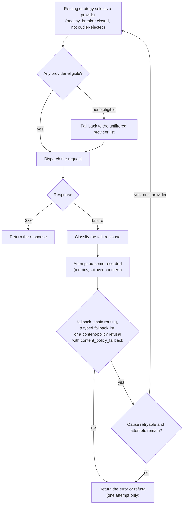
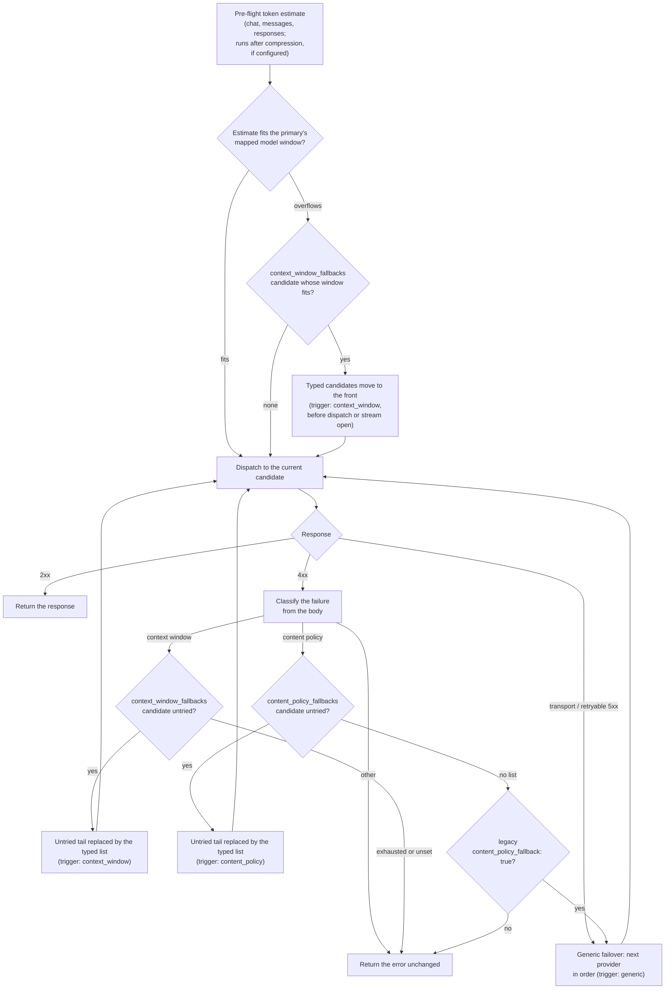

# LLM-aware resilience

*Last modified: 2026-08-27*

Status-code retries treat every `5xx` the same and ignore the LLM-specific
failure modes a provider signals in the response: a context-window
overflow, a content-policy refusal, a rate limit. LLM-aware resilience
classifies each upstream failure into a typed cause and lets an operator
set retry counts per error class, so a transient failure is retried while a
request that would only fail again is sent to a fallback instead.

This is an opt-in addition to the failover loop. Without a `retry_policy`
the default status-code retry set is unchanged.

One request can touch provider selection, failure classification, and a
fallback all in the same attempt loop. The gate worth calling out: a class
beyond the default retryable set only gets another attempt when
`routing: fallback_chain` is set, on a content-policy refusal with
`content_policy_fallback: true`, or when a typed fallback list
(`context_window_fallbacks:` / `content_policy_fallbacks:`, below) is
configured. Outside those cases, every request is exactly one attempt,
`retry_policy` or not.



The breaker and outlier boxes in step A are a real eligibility gate, not
decoration: `Router::provider_eligible` checks both before a provider is
offered to the strategy, and every settled provider attempt on the
request path feeds them. See "What is adaptive, and what fails over"
below for which outcomes count which way.

## Failure classification

Each upstream failure is classified into a `FailureCause`:

| Cause | Trigger | Retryable by default |
|---|---|---|
| `timeout` | `408`, `504` | yes |
| `rate_limit` | `429` | yes |
| `server_error` | `5xx` | yes |
| `context_window_exceeded` | `400`/`422` with an overflow message | no |
| `content_policy` | a refusal / safety message (even on `200`) | no |
| `auth` | `401`, `403` | no |
| `bad_request` | a malformed `400`/`422` | no |

Each cause also carries a fallback trigger (any, context-window, or
content-policy) that separates it from the general fallback list. Both
specific triggers are wired to real provider routing through their own
candidate lists, `context_window_fallbacks:` and
`content_policy_fallbacks:`, described in
[Typed fallback triggers](#typed-fallback-triggers) below. A
context-window failure can also go through the compress-in-place path
described further down, and the two compose: compression runs first, and
the reroute fires only when the prompt still does not fit.

## Per-error retry policy

```yaml
action:
  type: ai_proxy
  routing: fallback_chain
  resilience:
    retry_policy:
      rate_limit: 3      # retry a 429 up to 3 times
      server_error: 2    # retry a 5xx up to 2
      content_policy: 0  # never retry a refusal in place
      bad_request: 0
```

During failover the loop retries when the status is in the default retry
set (`500`/`502`/`503`) or when the classified cause clears the policy. A
class with an explicit count caps its retries; a class with no entry uses
its default retryability. The classification used for this decision is
status-only (the retryable classes do not need the body); the total attempt
count is bounded by the number of configured providers rather than by a
separate config key, since the dispatch loop visits each one at most once.
A `retry_policy` count above the provider count therefore does not buy
extra tries.

## Per-error cooldown policy

`retry_policy` decides whether the same request gets another attempt.
`cooldown_policy` decides whether the *provider* keeps taking new
requests: a classified failure of a mapped class removes that provider
from candidate rotation for the configured number of seconds.

```yaml
action:
  type: ai_proxy
  routing: fallback_chain
  resilience:
    retry_policy:
      rate_limit: 3
    cooldown_policy:
      rate_limit: 30   # a 429 parks the provider for 30s
      auth: 300        # a dead credential stops eating first attempts
```

A class with no entry (or an explicit `0`) never triggers a cooldown, so
an empty policy preserves current behavior exactly. The axis is advisory
in the same sense as the circuit breaker and outlier ejection: when
every candidate is cooling down, the router routes to the full permitted
set rather than manufacturing an outage. Its write side is the dispatch
loop's own failure classification, on both the sequential and the raced
path, so a configured `cooldown_policy` acts on real traffic
immediately.

Each cooldown ticks
`sbproxy_ai_provider_cooldowns_total{provider, cause}` and logs a `WARN`
naming the provider, the cause, and the duration. The counter is the
alertable half and the `WARN` line is the per-event detail: parking a
provider is the moment traffic stops reaching it, and
`rate(sbproxy_ai_provider_cooldowns_total{cause="auth"}[5m]) > 0` is the
expression for a rotated credential parking the whole pool. `cause` is
the classified failure that parked it, so it takes one of the seven
values `cooldown_policy` accepts: `timeout`, `rate_limit`,
`server_error`, `content_policy`, `auth`, `bad_request`, and
`context_window`, which reports on the counter under the classifier's
own name, `context_window_exceeded`. `provider` is a declared
`providers[].name`, so neither label grows with traffic; the stability
tier is in [metrics-stability.md](metrics-stability.md).

Transport-level failures (connection refused, DNS) carry no HTTP status
to classify and do not feed this axis; the generic failover chain
handles them as before.

## Pre-header streaming budget

A provider that refuses a connection fails over in milliseconds. A
provider that accepts the connection and then goes quiet does not: the
only thing bounding it is `providers[].timeout_ms`, and that budget has
to be long enough for a legitimate completion, so it is the wrong
instrument. `resilience.pre_header_timeout_ms` is the right one. It
bounds connect through the provider's response headers on streaming
requests, and an elapse hands the request to the next candidate.

```yaml
action:
  type: ai_proxy
  routing: fallback_chain
  resilience:
    pre_header_timeout_ms: 2000
  providers:
    - name: primary
      priority: 1
      timeout_ms: 180000
    - name: secondary
      priority: 2
      timeout_ms: 180000
```

"The next candidate" is whatever the attempt budget lets the request
reach, so the budget is only half of the arrangement. The rule is not
the strategy on its own. The attempt loop runs the whole provider order
when any of three things is true: the strategy is `fallback_chain`, the
origin sets `resilience.content_policy_fallback: true`, or the origin
configures a typed fallback list (`context_window_fallbacks` or
`content_policy_fallbacks`, both documented below). Otherwise the loop
gets one attempt and there is no successor to hand anything to.

So a `round_robin` origin with none of those three gets the refusal
rather than the sibling: the elapse bounds the attempt and the caller
sees a `502` naming the budget. The same origin with
`context_window_fallbacks:` set does hand the elapse to the next
candidate, even though nothing about that reroute is a context-window
failure, because the key opened the budget. Size the budget knowing
which of the two you are running.

Where the request is handed on, the failover is labeled, so it does not
disappear into the generic transport bucket:

```
sbproxy_ai_failovers_total{from_provider="primary",to_provider="secondary",reason="pre_header_timeout"} 1
```

That series ticks only when a handoff happens. It is emitted at the
handoff, so an origin whose attempt budget is one records nothing on
it: alerting on
`rate(sbproxy_ai_failovers_total{reason="pre_header_timeout"}[5m]) > 0`
on such an origin reads zero through an incident in which every
streaming request is failing at the budget. What always ticks is
`sbproxy_ai_provider_errors_total{provider,error_kind="timeout"}`, which a
pre-header elapse is classified as, alongside the `502` the caller
receives. Alert on that one where the budget cannot hand anything on.

The other `reason` values on the failover counter are `http_<status>`
for an availability failover, `transport` for a connection-level
failure, `managed_cold_fallback` for a managed local model that could
not be brought up, and the typed reroute reasons the sections above
cover.

Three limits worth knowing before you size it. The key is ignored on
non-streaming requests, which have no partial output to protect and keep
waiting out `timeout_ms`. It only ever shortens an attempt, so a value
above the attempt's own transport budget never fires: keep it under
`timeout_ms`, or under 30000 on a provider that sets no `timeout_ms` and
so runs on the gateway's HTTP client default. And on a cluster it also
bounds a `managed_model` served by another node, cold start included,
because that dispatch happens inside the same bounded attempt; a cold
start is legitimately slower than any hosted provider's headers, so size
the budget above your cold-start allowance on such an origin or leave it
unset there. A `0` is refused at config load, because a zero budget would
fail every streaming request over the whole candidate list.

### After the commit point

Once the provider answers with `200 text/event-stream` (or
`application/x-ndjson`), the request is committed to that provider. The
dispatch loop has closed by then and the relay is writing bytes the
caller is already reading, so a later candidate cannot replace them. A
stall, a reset, or a guardrail block past that point ends the stream
rather than failing over.

Those endings used to be invisible unless the origin had a budget
recorder wired. They now tick
`sbproxy_ai_stream_post_commit_failures_total{provider, cause}`, whatever
else is configured. `cause` is one of three:

| `cause` | What happened | What to do about it |
|---|---|---|
| `upstream_timeout` | Reading the next chunk hit a transport timeout, so `timeout_ms` or the 30-second client default cut a generation that was still running | Raise `timeout_ms` on that provider, or accept truncated long completions |
| `upstream_error` | The provider's stream ended in a reset or a truncated body | Provider-side fault; correlate with `sbproxy_ai_provider_errors_total` |
| `guardrail` | An output guardrail or a stream-safety verdict ended the stream | Working as configured. Read it against `sbproxy_ai_stream_guardrail_violations_total` |

The counter cannot see a caller that disconnects mid-stream: the failed
downstream write ends the relay before the counter is reached, so a
client cancel is counted nowhere in this family rather than being
guessed at as one of the three above. It also does not fire for an
extension `close` hook that blocks after the upstream stream already
finished, since it keys on the upstream stream not reaching its end.

Read the two counters together. A rising
`sbproxy_ai_failovers_total{reason="pre_header_timeout"}` means a
provider is going quiet before it commits, and the budget is doing its
job. A rising
`sbproxy_ai_stream_post_commit_failures_total{cause="upstream_timeout"}`
means the opposite problem: the provider answers fine and then gets cut
off mid-generation by a budget sized too tight for the completions this
origin actually serves.

## Typed fallback triggers

The generic chain answers "the provider is unavailable, try the next
one". Two failure classes deserve a different next hop, and each gets
its own candidate list, sibling keys of `routing:` on the `ai_proxy`
action:

```yaml
action:
  type: ai_proxy
  routing:
    strategy: fallback_chain
  context_window_fallbacks: [big-window]   # larger-window model
  content_policy_fallbacks: [permissive]   # more permissive model
  providers:
    - name: small
      provider_type: openai
      api_key: ${OPENAI_API_KEY}
      priority: 1
      models: [gpt-4]
    - name: big-window
      provider_type: openai
      api_key: ${OPENAI_API_KEY}
      priority: 2
      models: [gpt-4]
      model_map:
        gpt-4: gpt-4-turbo      # the larger-context model it dispatches
    - name: permissive
      provider_type: anthropic
      api_key: ${ANTHROPIC_API_KEY}
      priority: 3
      models: [gpt-4]
      model_map:
        gpt-4: claude-sonnet-4-5
```

Each list names providers from the same action's `providers:`; a name
that matches nothing fails config load, and nesting either key inside
`routing:` or inside `resilience:` is refused rather than silently
ignored. `resilience:` is checked because it is the likelier of the two
misplacements: `content_policy_fallback`, the singular boolean, is a
real key that already lives there, so the plural list is one character
and one nesting level away from a spelling operators already use. The
lists are ordered and can never widen what a request may reach:
candidates are filtered by the same credential provider policy, model
eligibility, and `enabled` checks as every other selection.

How a request moves through the triggers:



The context-window trigger fires in two places. The main one is the
pre-flight estimate: the same token estimate the compression levers use
is compared against the primary provider's mapped model window (from the
built-in context-window table), and an overflowing prompt is rerouted
before anything dispatches. A pre-flight estimate is portable across
every OpenAI-compatible provider, where error prose is not, and it
happens before a streaming response opens, which is what lets streaming
requests participate. The second place is the body classification: a
provider that rejects with a `context_length_exceeded`-shaped error
despite the estimate still reroutes to the same list.

When a trigger fires mid-loop, its list replaces the untried tail of the
attempt order rather than merging with it: the generic tail was queued
for availability, not for this failure class. Candidates already tried
are skipped; when the typed list is exhausted, the failure is returned
to the caller rather than falling back to the generic chain.

Scope, stated plainly: typed fallbacks act on the sequential dispatch
loop (including streaming requests, via the pre-flight estimate). A
content-policy refusal that only becomes visible mid-stream is out of
scope for v1 and is relayed as received, matching the streaming posture
of the guardrail pipeline. The `race` and `cascade` strategies build
their own candidate plans, so the pre-flight reroute leaves their order
untouched; a cascade that falls through to the sequential loop (a
managed local provider in a tier does this) still gets the mid-loop
reroute. A pre-flight reroute needs the primary's mapped model to be in
the context-window table; an unlisted model falls back to body
classification.

Every reroute is visible in three places: the
`sbproxy_ai_failovers_total{reason="context_window"|"content_policy"}`
counter, a `WARN` log line naming both providers, and the admin
console's request log, where each rerouted request carries a
`failover_trigger` of `context_window`, `content_policy`, or `generic`
(the LogsView failover badge is prefixed with the typed trigger). The
runnable end-to-end walkthrough is
[`examples/typed-fallbacks/`](../examples/typed-fallbacks/).

## Context-window fitting compatibility

A context-length overflow is not worth retrying as-is; the same prompt only
fails again. The legacy `llm_aware.context_compress` switch enables stateless
window fitting before dispatch, so an over-long prompt can stay on the same
model instead of being rejected:

```yaml
action:
  type: ai_proxy
  resilience:
    llm_aware:
      context_compress: true
      completion_reserve_tokens: 1024  # reserve room for the response
```

When no explicit `compression` block is present, this lowers to one
`window_fit` lever. The leading system message is preserved and remaining
messages are considered newest to oldest using the existing content-byte
heuristic after the completion reserve. A message that does not fit is skipped,
so a smaller older message may still be retained. It is a no-op for unknown
models and prompts that already fit that heuristic. This compatibility behavior
is not an exact tokenizer or hard provider-window guarantee. An explicit
compression policy is authoritative, including an empty lever list.

For the ordered compression pipeline, including `query_select`,
sidecar-backed `token_prune`, `summary_buffer`, and `window_fit`, see the
captured-session requirements, structured-content protection, failure
semantics, and telemetry in
[AI context compression](ai-context-compression.md).

## Hedged (raced) requests

For latency-sensitive traffic, the `race` routing strategy fans a single
request out to every eligible provider concurrently and keeps the first 2xx
response, dropping (canceling) the losers. It trades extra upstream calls
for a lower tail latency: a slow or stuck provider no longer holds up the
request, because a peer answers first.

```yaml
action:
  type: ai_proxy
  routing:
    strategy: race
  providers:
    - name: openai-primary
      provider_type: openai
      api_key: ${OPENAI_API_KEY}
      models: [gpt-4o-mini]
    - name: openai-secondary
      provider_type: openai
      api_key: ${OPENAI_API_KEY}
      models: [gpt-4o-mini]
```

Every racer is charged, so reserve `race` for traffic where tail latency
matters more than the duplicate call. Streaming requests fall through to a
single dispatch (mid-stream racing is out of scope); a single-provider
origin dispatches normally. Because the operator opted into the extra calls,
a raced request does not also run the sequential failover loop afterward.

## Content-policy fallback (legacy next-in-order form)

The aimed form of this is the `content_policy_fallbacks:` list above,
which names exactly which providers a refusal should reroute to. The
older boolean form remains for configs that predate it: a provider may
refuse a request on content-policy or safety grounds with a 4xx rather
than answer it, and with `resilience.content_policy_fallback` that
refusal is routed to the next provider in order instead of being
returned, so an operator can list a more permissive model after a
stricter one. When both are configured, the typed list wins:

```yaml
action:
  type: ai_proxy
  routing:
    strategy: fallback_chain   # providers are tried in priority order
  resilience:
    content_policy_fallback: true
  providers:
    - { name: strict, provider_type: openai, api_key: ${OPENAI_API_KEY}, priority: 1, models: [gpt-4o] }
    - { name: permissive, provider_type: anthropic, api_key: ${ANTHROPIC_API_KEY}, priority: 2, models: [claude-sonnet-4-5] }
```

The failover only fires when the response body marks a content-policy or
safety block (a plain `400` bad request is not rerouted). Reading the body
to classify consumes the response, so a 4xx that is not a content-policy
refusal, or one with no more permissive provider left to try, is returned as
a passthrough rather than re-wrapped through the relay. A refusal embedded in
a 200 response is a valid completion and is not intercepted. Off by default.

## What is adaptive, and what fails over

`circuit_breaker` and `outlier_detection` configure a real eligibility
gate: `Router::provider_eligible` checks a breaker's state and an
outlier ejection before offering a provider to the routing strategy, and a
provider failing either check is skipped until it recovers. Both are fed
by production traffic. Every settled provider attempt on the
`/v1/chat/completions` path records one outcome against all three
health axes at once, whatever the routing strategy and whether the
request streams or not: the raced fan-out records each leg as it
settles, and the sequential loop records each failover leg and the
response it keeps.

Which way an outcome counts:

| Attempt settled as | Attempt metric | Breaker and outlier detector | Cooldown policy |
|---|---|---|---|
| `1xx`-`3xx` | `success` | success | not consulted |
| `4xx` | `error` | success | classified and consulted |
| `5xx` | `error` | failure | classified and consulted |
| transport error or timeout | `error` | failure | not consulted |
| local engine never started | `error` | no sample | not consulted |
| raced loser the winner cancelled | not recorded | no sample | not consulted |

A `4xx` counting as upstream health is deliberate and matches Envoy's
`consecutive_5xx` detector: the caller sent a bad request and the
provider answered it correctly, so ejecting on it would take a healthy
provider out of the pool for someone else's malformed prompt. The
consequence worth knowing is that a provider answering `429` to
everything reads as healthy to the breaker and the outlier detector;
`cooldown_policy: { rate_limit: <seconds> }` is the axis that parks it,
and sbproxy has no `consecutive_gateway_failure` equivalent that would
separate the two. `health_check` is independent of all of this: its
active probes run on a background task and never depend on request-path
recording. The PeakEWMA latency model is a
separate, independently selected routing strategy
(`routing: { strategy: peak_ewma }`); it does not run automatically
alongside `circuit_breaker` or `outlier_detection`. Failover itself
routes to a different provider, so a retry never re-runs a
side-effecting request against the same upstream.

## Calling it

The runnable configuration is
[`examples/ai-llm-aware-resilience/`](../examples/ai-llm-aware-resilience/). It
puts the `retry_policy` above on a `fallback_chain` across two deployments,
`openai-primary` at `priority: 1` and `openai-secondary` at `priority: 2`.
Start it:

```bash
export OPENAI_API_KEY=sk-...
make run CONFIG=examples/ai-llm-aware-resilience/sb.yml
```

Send an ordinary chat request. The retry policy is server-side, so the client
sends nothing extra:

```bash
curl -sS http://127.0.0.1:8080/v1/chat/completions \
  -H 'Host: ai.local' \
  -H 'Content-Type: application/json' \
  -d '{"model":"gpt-4o-mini","messages":[{"role":"user","content":"Say hi in one word."}]}'
```

With a working key that returns the provider's own chat completion, so the
body comes from the model rather than from SBproxy. The part this page is
about is not visible in a successful response: it is what happens when the
provider fails.

The classifier half is reachable without any provider key. Send a body that is
not JSON:

```bash
curl -sS -i http://127.0.0.1:8080/v1/chat/completions \
  -H 'Host: ai.local' \
  -H 'Content-Type: application/json' \
  -d 'not json'
```

That returns `400` with:

```json
{"error": "invalid JSON body"}
```

Note the shape. This is the flat parse-failure body the gateway emits before a
request is understood well enough to have a provider, a model, or an error
class. It is deliberately not the structured `{"error": {"message", "type",
"code", "request_id"}}` envelope that a guardrail block or a classified
provider failure returns, because at this point nothing has been classified.
Neither deployment was touched and no retry was counted.

To watch the retry policy itself, point a provider at an upstream you control
and have it answer `429`. Each rejected attempt logs at `WARN` with the
message `AI proxy: provider returned error, trying next` and the fields
`provider`, `status`, and `attempt`, where `attempt` is a zero-based index
into the fallback chain, one entry per configured provider, not a
per-provider retry counter. `max_attempts` is capped at the provider count,
so in the two-deployment example above a `429` from `openai-primary`
(`attempt` `0`) logs the line once and the chain advances to
`openai-secondary` (`attempt` `1`); with only two providers configured, the
chain is exhausted there regardless of `rate_limit: 3`, so a third attempt
never happens against either deployment. Watching `rate_limit: 3` actually
cap a retry needs three or more providers in the chain. A `400` that
classifies as `bad_request` logs the line once and advances immediately,
because its policy entry is `0`.
