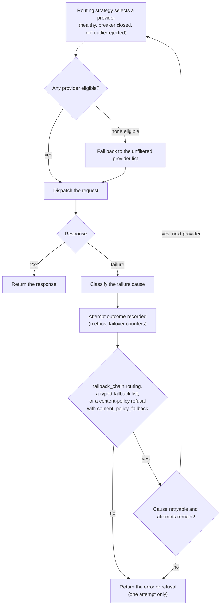
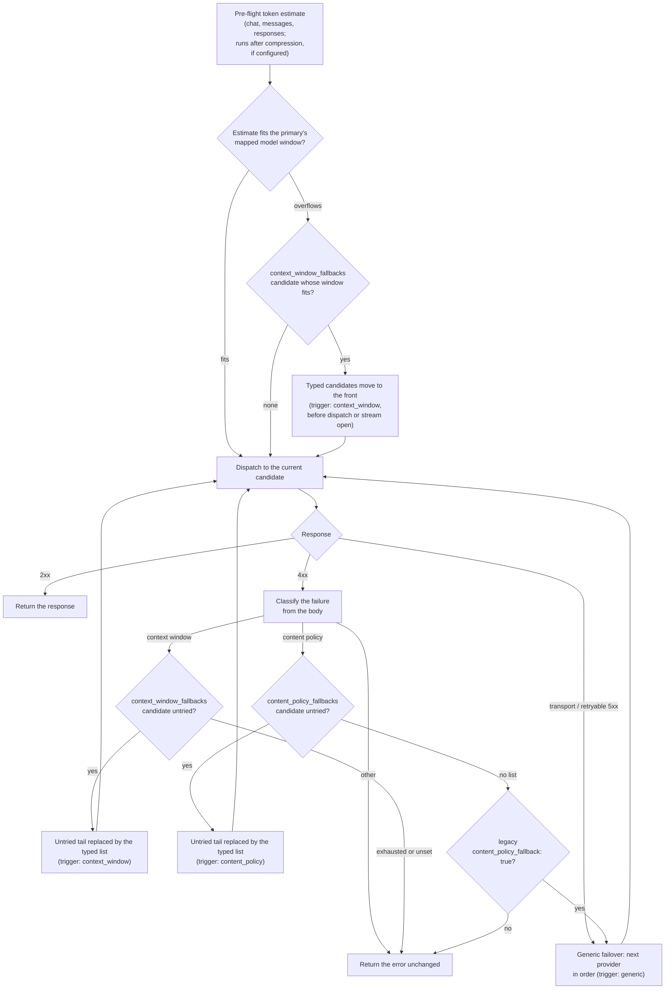

# LLM-aware resilience

*Last modified: 2026-08-21*

Status-code retries treat every `5xx` the same and ignore the LLM-specific
failure modes a provider signals in the response: a context-window
overflow, a content-policy refusal, a rate limit. LLM-aware resilience
classifies each upstream failure into a typed cause and lets an operator
set retry counts per error class, so a transient failure is retried while a
request that would only fail again is sent to a fallback instead.

This is an opt-in addition to the failover loop. Without a `retry_policy`
the default status-code retry set is unchanged.

One request can touch provider selection, failure classification, and a
fallback all in the same attempt loop. The gate worth calling out: a class
beyond the default retryable set only gets another attempt when
`routing: fallback_chain` is set, on a content-policy refusal with
`content_policy_fallback: true`, or when a typed fallback list
(`context_window_fallbacks:` / `content_policy_fallbacks:`, below) is
configured. Outside those cases, every request is exactly one attempt,
`retry_policy` or not.



The breaker and outlier boxes in step A are a real eligibility gate, not
decoration: `Router::provider_eligible` checks both before a provider is
offered to the strategy. What is missing today is the write side. See
"What is adaptive, and what fails over" below for the gap between that gate
and what actually feeds it.

## Failure classification

Each upstream failure is classified into a `FailureCause`:

| Cause | Trigger | Retryable by default |
|---|---|---|
| `timeout` | `408`, `504` | yes |
| `rate_limit` | `429` | yes |
| `server_error` | `5xx` | yes |
| `context_window_exceeded` | `400`/`422` with an overflow message | no |
| `content_policy` | a refusal / safety message (even on `200`) | no |
| `auth` | `401`, `403` | no |
| `bad_request` | a malformed `400`/`422` | no |

Each cause also carries a fallback trigger (any, context-window, or
content-policy) that separates it from the general fallback list. Both
specific triggers are wired to real provider routing through their own
candidate lists, `context_window_fallbacks:` and
`content_policy_fallbacks:`, described in
[Typed fallback triggers](#typed-fallback-triggers) below. A
context-window failure can also go through the compress-in-place path
described further down, and the two compose: compression runs first, and
the reroute fires only when the prompt still does not fit.

## Per-error retry policy

```yaml
action:
  type: ai_proxy
  routing: fallback_chain
  resilience:
    retry_policy:
      rate_limit: 3      # retry a 429 up to 3 times
      server_error: 2    # retry a 5xx up to 2
      content_policy: 0  # never retry a refusal in place
      bad_request: 0
```

During failover the loop retries when the status is in the default retry
set (`500`/`502`/`503`) or when the classified cause clears the policy. A
class with an explicit count caps its retries; a class with no entry uses
its default retryability. The classification used for this decision is
status-only (the retryable classes do not need the body); the total attempt
count is bounded by the number of configured providers rather than by a
separate config key, since the dispatch loop visits each one at most once.
A `retry_policy` count above the provider count therefore does not buy
extra tries.

## Per-error cooldown policy

`retry_policy` decides whether the same request gets another attempt.
`cooldown_policy` decides whether the *provider* keeps taking new
requests: a classified failure of a mapped class removes that provider
from candidate rotation for the configured number of seconds.

```yaml
action:
  type: ai_proxy
  routing: fallback_chain
  resilience:
    retry_policy:
      rate_limit: 3
    cooldown_policy:
      rate_limit: 30   # a 429 parks the provider for 30s
      auth: 300        # a dead credential stops eating first attempts
```

A class with no entry (or an explicit `0`) never triggers a cooldown, so
an empty policy preserves current behavior exactly. The axis is advisory
in the same sense as the circuit breaker and outlier ejection: when
every candidate is cooling down, the router routes to the full permitted
set rather than manufacturing an outage. Unlike those two axes, the
write side is the dispatch loop's own failure classification, so a
configured `cooldown_policy` acts on real traffic immediately (see "What
is adaptive, and what fails over" for the breaker's read-side-only
status). Each cooldown logs a `WARN` naming the provider, the cause, and
the duration. Transport-level failures (connection refused, DNS) carry
no HTTP status to classify and do not feed this axis; the generic
failover chain handles them as before.

## Typed fallback triggers

The generic chain answers "the provider is unavailable, try the next
one". Two failure classes deserve a different next hop, and each gets
its own candidate list, sibling keys of `routing:` on the `ai_proxy`
action:

```yaml
action:
  type: ai_proxy
  routing:
    strategy: fallback_chain
  context_window_fallbacks: [big-window]   # larger-window model
  content_policy_fallbacks: [permissive]   # more permissive model
  providers:
    - name: small
      provider_type: openai
      api_key: ${OPENAI_API_KEY}
      priority: 1
      models: [gpt-4]
    - name: big-window
      provider_type: openai
      api_key: ${OPENAI_API_KEY}
      priority: 2
      models: [gpt-4]
      model_map:
        gpt-4: gpt-4-turbo      # the larger-context model it dispatches
    - name: permissive
      provider_type: anthropic
      api_key: ${ANTHROPIC_API_KEY}
      priority: 3
      models: [gpt-4]
      model_map:
        gpt-4: claude-sonnet-4-5
```

Each list names providers from the same action's `providers:`; a name
that matches nothing fails config load, and nesting either key inside
`routing:` is refused rather than silently ignored. The lists are
ordered and can never widen what a request may reach: candidates are
filtered by the same credential provider policy, model eligibility, and
`enabled` checks as every other selection.

How a request moves through the triggers:



The context-window trigger fires in two places. The main one is the
pre-flight estimate: the same token estimate the compression levers use
is compared against the primary provider's mapped model window (from the
built-in context-window table), and an overflowing prompt is rerouted
before anything dispatches. A pre-flight estimate is portable across
every OpenAI-compatible provider, where error prose is not, and it
happens before a streaming response opens, which is what lets streaming
requests participate. The second place is the body classification: a
provider that rejects with a `context_length_exceeded`-shaped error
despite the estimate still reroutes to the same list.

When a trigger fires mid-loop, its list replaces the untried tail of the
attempt order rather than merging with it: the generic tail was queued
for availability, not for this failure class. Candidates already tried
are skipped; when the typed list is exhausted, the failure is returned
to the caller rather than falling back to the generic chain.

Scope, stated plainly: typed fallbacks act on the sequential dispatch
loop (including streaming requests, via the pre-flight estimate). A
content-policy refusal that only becomes visible mid-stream is out of
scope for v1 and is relayed as received, matching the streaming posture
of the guardrail pipeline. The `race` and `cascade` strategies build
their own candidate plans, so the pre-flight reroute leaves their order
untouched; a cascade that falls through to the sequential loop (a
managed local provider in a tier does this) still gets the mid-loop
reroute. A pre-flight reroute needs the primary's mapped model to be in
the context-window table; an unlisted model falls back to body
classification.

Every reroute is visible in three places: the
`sbproxy_ai_failovers_total{reason="context_window"|"content_policy"}`
counter, a `WARN` log line naming both providers, and the admin
console's request log, where each rerouted request carries a
`failover_trigger` of `context_window`, `content_policy`, or `generic`
(the LogsView failover badge is prefixed with the typed trigger). The
runnable end-to-end walkthrough is
[`examples/typed-fallbacks/`](../examples/typed-fallbacks/).

## Context-window fitting compatibility

A context-length overflow is not worth retrying as-is; the same prompt only
fails again. The legacy `llm_aware.context_compress` switch enables stateless
window fitting before dispatch, so an over-long prompt can stay on the same
model instead of being rejected:

```yaml
action:
  type: ai_proxy
  resilience:
    llm_aware:
      context_compress: true
      completion_reserve_tokens: 1024  # reserve room for the response
```

When no explicit `compression` block is present, this lowers to one
`window_fit` lever. The leading system message is preserved and remaining
messages are considered newest to oldest using the existing content-byte
heuristic after the completion reserve. A message that does not fit is skipped,
so a smaller older message may still be retained. It is a no-op for unknown
models and prompts that already fit that heuristic. This compatibility behavior
is not an exact tokenizer or hard provider-window guarantee. An explicit
compression policy is authoritative, including an empty lever list.

For the ordered compression pipeline, including `query_select`,
sidecar-backed `token_prune`, `summary_buffer`, and `window_fit`, see the
captured-session requirements, structured-content protection, failure
semantics, and telemetry in
[AI context compression](ai-context-compression.md).

## Hedged (raced) requests

For latency-sensitive traffic, the `race` routing strategy fans a single
request out to every eligible provider concurrently and keeps the first 2xx
response, dropping (canceling) the losers. It trades extra upstream calls
for a lower tail latency: a slow or stuck provider no longer holds up the
request, because a peer answers first.

```yaml
action:
  type: ai_proxy
  routing:
    strategy: race
  providers:
    - name: openai-primary
      provider_type: openai
      api_key: ${OPENAI_API_KEY}
      models: [gpt-4o-mini]
    - name: openai-secondary
      provider_type: openai
      api_key: ${OPENAI_API_KEY}
      models: [gpt-4o-mini]
```

Every racer is charged, so reserve `race` for traffic where tail latency
matters more than the duplicate call. Streaming requests fall through to a
single dispatch (mid-stream racing is out of scope); a single-provider
origin dispatches normally. Because the operator opted into the extra calls,
a raced request does not also run the sequential failover loop afterward.

## Content-policy fallback (legacy next-in-order form)

The aimed form of this is the `content_policy_fallbacks:` list above,
which names exactly which providers a refusal should reroute to. The
older boolean form remains for configs that predate it: a provider may
refuse a request on content-policy or safety grounds with a 4xx rather
than answer it, and with `resilience.content_policy_fallback` that
refusal is routed to the next provider in order instead of being
returned, so an operator can list a more permissive model after a
stricter one. When both are configured, the typed list wins:

```yaml
action:
  type: ai_proxy
  routing:
    strategy: fallback_chain   # providers are tried in priority order
  resilience:
    content_policy_fallback: true
  providers:
    - { name: strict, provider_type: openai, api_key: ${OPENAI_API_KEY}, priority: 1, models: [gpt-4o] }
    - { name: permissive, provider_type: anthropic, api_key: ${ANTHROPIC_API_KEY}, priority: 2, models: [claude-sonnet-4-5] }
```

The failover only fires when the response body marks a content-policy or
safety block (a plain `400` bad request is not rerouted). Reading the body
to classify consumes the response, so a 4xx that is not a content-policy
refusal, or one with no more permissive provider left to try, is returned as
a passthrough rather than re-wrapped through the relay. A refusal embedded in
a 200 response is a valid completion and is not intercepted. Off by default.

## What is adaptive, and what fails over

`circuit_breaker` and `outlier_detection` configure a real eligibility
gate: `Router::provider_eligible` checks a breaker's state and an
outlier ejection before offering a provider to the routing strategy, and a
provider failing either check is skipped until it recovers. That gate needs
a live feed of request outcomes, and the production AI dispatch path
(`crates/sbproxy-core/src/server/ai_dispatch.rs`) does not currently supply
one: neither the sequential failover loop nor the `race` dispatch calls the
router methods that update the breaker or the sliding-window detector
(`record_provider_success` / `record_provider_failure`). Those two are
wired end to end only on the admin playground's chat path
(`crates/sbproxy-core/src/admin_playground.rs`), not on the
`/v1/chat/completions` path real traffic takes. A configured
`circuit_breaker` or `outlier_detection` block is accepted without error,
but a provider failing every request is not ejected by either signal today
(SUSPECTED PRODUCT BUG; ticketed for the `race` case as WOR-2532, see
`examples/ai-race/README.md` for a live repro). `health_check` is
unaffected: its active probes run on an independent background task and
never depend on request-path recording. The per-error-class
`cooldown_policy` axis is also unaffected, in the other direction: its
write side is the dispatch loop's own failure classification, so it is
fed by production traffic from the day it is configured. The PeakEWMA latency model is a
separate, independently selected routing strategy
(`routing: { strategy: peak_ewma }`); it does not run automatically
alongside `circuit_breaker` or `outlier_detection` even once that gap
closes. Failover itself routes to a different provider, so a retry never
re-runs a side-effecting request against the same upstream.

## Calling it

The runnable configuration is
[`examples/ai-llm-aware-resilience/`](../examples/ai-llm-aware-resilience/). It
puts the `retry_policy` above on a `fallback_chain` across two deployments,
`openai-primary` at `priority: 1` and `openai-secondary` at `priority: 2`.
Start it:

```bash
export OPENAI_API_KEY=sk-...
make run CONFIG=examples/ai-llm-aware-resilience/sb.yml
```

Send an ordinary chat request. The retry policy is server-side, so the client
sends nothing extra:

```bash
curl -sS http://127.0.0.1:8080/v1/chat/completions \
  -H 'Host: ai.local' \
  -H 'Content-Type: application/json' \
  -d '{"model":"gpt-4o-mini","messages":[{"role":"user","content":"Say hi in one word."}]}'
```

With a working key that returns the provider's own chat completion, so the
body comes from the model rather than from SBproxy. The part this page is
about is not visible in a successful response: it is what happens when the
provider fails.

The classifier half is reachable without any provider key. Send a body that is
not JSON:

```bash
curl -sS -i http://127.0.0.1:8080/v1/chat/completions \
  -H 'Host: ai.local' \
  -H 'Content-Type: application/json' \
  -d 'not json'
```

That returns `400` with:

```json
{"error": "invalid JSON body"}
```

Note the shape. This is the flat parse-failure body the gateway emits before a
request is understood well enough to have a provider, a model, or an error
class. It is deliberately not the structured `{"error": {"message", "type",
"code", "request_id"}}` envelope that a guardrail block or a classified
provider failure returns, because at this point nothing has been classified.
Neither deployment was touched and no retry was counted.

To watch the retry policy itself, point a provider at an upstream you control
and have it answer `429`. Each rejected attempt logs at `WARN` with the
message `AI proxy: provider returned error, trying next` and the fields
`provider`, `status`, and `attempt`, where `attempt` is a zero-based index
into the fallback chain, one entry per configured provider, not a
per-provider retry counter. `max_attempts` is capped at the provider count,
so in the two-deployment example above a `429` from `openai-primary`
(`attempt` `0`) logs the line once and the chain advances to
`openai-secondary` (`attempt` `1`); with only two providers configured, the
chain is exhausted there regardless of `rate_limit: 3`, so a third attempt
never happens against either deployment. Watching `rate_limit: 3` actually
cap a retry needs three or more providers in the chain. A `400` that
classifies as `bad_request` logs the line once and advances immediately,
because its policy entry is `0`.
