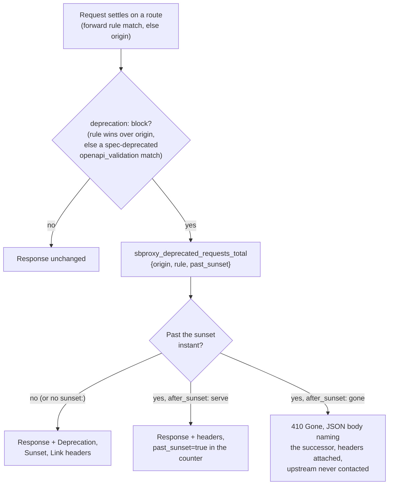

# API gateway guide

*Last modified: 2026-08-20*

SBproxy is a reverse proxy first. Before it routes to an AI provider or federates an MCP server, it does the job Nginx, Envoy, or Kong do: match a hostname, authenticate the caller, apply rate limits and a WAF, load-balance across upstreams, and proxy the request. This guide is the entry point for that traditional pillar. If you are putting SBproxy in front of an existing HTTP API, or evaluating it as a replacement for a reverse proxy you already run, start here.

This page links out to deep-dive docs rather than restating them. For the full request lifecycle, read [core-concepts.md](core-concepts.md) first; for the five-pillar overview (API, AI, MCP, A2A, Agent), see [features.md](features.md#1-api-traditional-reverse-proxy--gateway); for the field-by-field schema, [configuration.md](configuration.md) is canonical.

## Minimal config

The smallest working gateway is one origin with a `proxy` action:

```yaml
proxy:
  http_bind_port: 8080

origins:
  "myapp.example.com":
    action:
      type: proxy
      url: https://test.sbproxy.dev
```

```bash
sbproxy serve -f examples/basic-proxy/sb.yml
curl -H 'Host: myapp.example.com' http://127.0.0.1:8080/echo
```

The `Host` header picks the origin; everything else in this guide (load balancing, auth, WAF, rate limits, scripting) is additive configuration on the same shape, and none of it requires touching AI or MCP features. Runnable as-is: [`examples/basic-proxy/`](../examples/basic-proxy/). For a longer guided walkthrough, see [getting-started.md](getting-started.md).

## Routing and traffic shaping

An origin matches an exact hostname or a dynamic forward rule, then dispatches to an action. An origin key can also be a wildcard, `"*.example.com"`, which matches any subdomain (`a.example.com`, `a.b.example.com`) but never the bare `example.com` itself; an exact origin always wins over a wildcard for the same request, and between two wildcards the longest matching suffix wins:

```yaml
origins:
  "api.example.com":          # exact match wins when both could apply
    action:
      type: proxy
      url: https://api-backend.internal
  "*.example.com":            # catches every other subdomain
    action:
      type: proxy
      url: https://catch-all-backend.internal
```

Zero-downtime reload validates and compiles a candidate configuration, swaps it in atomically on success, and lets in-flight requests finish on the pipeline they started with; see [core-concepts.md](core-concepts.md#configuration-compilation-and-reload) for the contract. Blue-green and canary rollouts are configuration patterns layered on top of this.

Load distribution across upstreams supports 8 algorithms, including round-robin, least connections, and ketama-style consistent hashing (`ring_hash`), with active health checks, a circuit breaker, and outlier detection independently removing failing targets from the pool. Custom upstream-selection logic beyond the built-in algorithms is an extension point; see [routing-strategies.md](routing-strategies.md). [routing.md](routing.md) is the full reference for hostname matching, forward rules, load balancing, deployment patterns, and fallback origins; see [performance.md](performance.md) for tuning and [architecture.md](architecture.md#3-request-pipeline) for the pipeline internals.

**Examples:** [basic-proxy](../examples/basic-proxy/), [forward-rules](../examples/forward-rules/), [host-override](../examples/host-override/), [load-balancer](../examples/load-balancer/), [active-health-checks](../examples/active-health-checks/), [circuit-breaker](../examples/circuit-breaker/), [load-balancer-deployment](../examples/load-balancer-deployment/), [grpc-h2c](../examples/grpc-h2c/), [error-pages](../examples/error-pages/), [headers-and-cors](../examples/headers-and-cors/), [compression](../examples/compression/)

## Deprecating endpoints

Version routing (above) creates the problem this block solves: once `/v2/` exists, `/v1/` has to tell its callers to leave, and the gateway is the right place to say it because the upstream never has to change. A `deprecation:` block on an origin or a forward rule stamps the standard announcement headers on matching responses: `Deprecation` (RFC 9745), `Sunset` (RFC 8594), and `Link` relations for the successor version and the migration docs. Marking `/v1/*` deprecated while `/v2/*` stays clean is one block on the `/v1/` rule:

```yaml
forward_rules:
  - rules:
      - path: { prefix: /v1/ }
    deprecation:
      deprecated: 2026-09-01
      sunset: 2026-12-31T23:59:59Z
      successor: https://api.example.com/v2/
      after_sunset: gone      # 410 after the sunset instant; default is serve
    origin:
      id: v1-legacy
      action: { type: proxy, url: https://legacy.internal }
```

What a request sees, over the lifecycle:



Three details worth knowing. A bare `deprecated: true` emits no `Deprecation` header, because RFC 9745 requires a date value (the draft-era literal `true` did not survive into the RFC); config load warns and asks for a date. Config load also refuses a `sunset` earlier than the `deprecated` instant, which RFC 9745 forbids. And the announcement is kept consistent across surfaces: the emitted OpenAPI document marks covered operations `deprecated: true` with `x-sbproxy-sunset` / `x-sbproxy-successor` extensions, so the spec at `/.well-known/openapi.json` and the wire headers cannot disagree ([openapi-emission.md](openapi-emission.md)). The reverse direction works too: if your uploaded spec already marks operations `deprecated: true`, the `deprecation_headers` sub-block on the `openapi_validation` policy emits the headers for exactly those operations ([configuration.md](configuration.md#openapi_validation)).

The `sbproxy_deprecated_requests_total` counter is the migration tracker: `rule` names which announcement matched and `past_sunset` separates the stragglers still calling after the retirement date. Unretired old versions are also the classic improper-inventory finding; see [api-security.md](api-security.md).

Field-by-field reference: [configuration.md](configuration.md#api-deprecation-rfc-9745--rfc-8594).

**Examples:** [api-deprecation](../examples/api-deprecation/)

## Protocols: HTTP/2, WebSocket, gRPC, and GraphQL

Everything above assumes plain HTTP/1.1. SBproxy also terminates HTTP/2 and proxies WebSocket, gRPC, and GraphQL traffic through the same origin/auth/policy/transform pipeline as a `proxy` action.

**HTTP/2** is negotiated automatically over TLS: the HTTPS listener advertises `h2` via ALPN, so an HTTP/2-capable client gets it with no extra config once `https_bind_port` and a certificate are set. For a plaintext HTTP/2 listener (`h2c`), for example a gRPC client that never speaks TLS to the gateway, set `proxy.http2_cleartext: true` on the plain HTTP listener. See [configuration.md](configuration.md#proxy-fields) and the runnable [`examples/grpc-h2c/`](../examples/grpc-h2c/), which pairs the two.

**WebSocket**, **gRPC** (including gRPC-Web bridging for browser clients and REST-to-gRPC transcoding), and **GraphQL** are each a dedicated action (`type: websocket`, `type: grpc`, `type: graphql`) rather than a `proxy` variant, so each gets its own field set. [routing.md#protocol-specific-routing](routing.md#protocol-specific-routing) is the canonical page for how each one behaves; field-by-field schemas are in configuration.md: [websocket](configuration.md#websocket), [grpc](configuration.md#grpc), [graphql](configuration.md#graphql).

## Authentication and authorization

Twelve built-in auth types cover the common cases: API key, Basic, Bearer, JWT (with JWKS and JWE), Digest, HMAC signed requests, LDAP bind, Forward Auth, mTLS, Web Bot Auth, CAP, and OIDC. Configure one per origin under `auth:`, or accept several at once with a composition list; [authentication.md](authentication.md) is the chooser.

- [auth-oidc.md](auth-oidc.md) - the OIDC relying-party flow: authorization-code + PKCE, sealed session cookie, RP-initiated logout.
- [key-management.md](key-management.md) - dynamic virtual keys: mint, revoke, rotate at runtime, hashed at rest.
- [web-bot-auth.md](web-bot-auth.md) - verifying RFC 9421-signed crawlers against a published key directory.
- [outbound-dpop.md](outbound-dpop.md) - RFC 9449 sender-constrained credentials for calls SBproxy makes upstream, as opposed to inbound caller auth.
- [object-authz.md](object-authz.md) - BOLA/BFLA fine-grained access control once a caller is authenticated.

**Examples:** [auth-jwt](../examples/auth-jwt/), [auth-forward](../examples/auth-forward/), [mtls-client-auth](../examples/mtls-client-auth/), [auth-api-key](../examples/auth-api-key/), [auth-basic](../examples/auth-basic/), [auth-bearer](../examples/auth-bearer/), [auth-bearer-dpop](../examples/auth-bearer-dpop/), [auth-cap](../examples/auth-cap/), [keys-inbound-headers](../examples/keys-inbound-headers/), [sessions](../examples/sessions/)

## Rate limiting, WAF, and abuse controls

The built-in WAF ships a curated CRS-derived baseline (4 built-in patterns plus a 12-rule managed bundle), extendable through a signed remote rule feed. It is a baseline layer, not full OWASP CRS coverage; [waf-options.md](waf-options.md) is explicit about the gap and the three ways to close it (a CRS-capable WAF in front, the signed feed, or layering the policies already in the binary). Token-bucket rate limiting, DDoS mitigation, and HTTP request-smuggling defenses run alongside it.

- [policy.md](policy.md) - the policy engine and the general-purpose policy reference (`request_validator`, `concurrent_limit`, `rate_limit_budget`, `http_framing`).
- [security.md](security.md) - the security map: what the gateway enforces, what stays with your services.
- [api-security.md](api-security.md) - API-specific threat classes mapped to the policy that covers each.
- [threat-model.md](threat-model.md) - trust boundaries and the per-wave review checklist.
- [exposed-credentials.md](exposed-credentials.md) - detecting known-leaked basic-auth passwords.

**Examples:** [waf](../examples/waf/), [waf-layered](../examples/waf-layered/), [ddos-protection](../examples/ddos-protection/), [rate-limiting](../examples/rate-limiting/), [ip-filter](../examples/ip-filter/), [csrf](../examples/csrf/), [defense-in-depth](../examples/defense-in-depth/), [dlp-catalog](../examples/dlp-catalog/), [hsts](../examples/hsts/), [page-shield](../examples/page-shield/), [security-headers](../examples/security-headers/), [sri](../examples/sri/), [request-limit](../examples/request-limit/)

## Custom logic: scripting and transforms

When declarative config is not enough, sbproxy gives you four extension surfaces that load from config and hot-reload: CEL, Lua, JavaScript, and WebAssembly. They rewrite headers, transform payloads, or implement bespoke policy and auth logic, with no rebuild of the binary. [plugins.md](plugins.md) is the hub for choosing among them and for extension bundles, self-contained, versionable units of logic loaded from a directory or a git source ([extension-bundles.md](extension-bundles.md) has the full manifest reference). [scripting.md](scripting.md) is the language reference, and [transforms.md](transforms.md) catalogs every built-in response transform and where a scripted one fits alongside them.

## OpenAPI and the admin API

SBproxy can emit an OpenAPI 3.0 document from a live config ([openapi-emission.md](openapi-emission.md)) and validate incoming request bodies against one at startup ([openapi-validation.md](openapi-validation.md)). The admin API is the separate control plane for configuration, keys, metrics, and logs; start with [admin.md](admin.md) for what it is and [admin-api-guide.md](admin-api-guide.md) for a task-oriented walkthrough (login, CSRF, roles, curl cookbook). Keep it on a protected network; a successful data-plane request never requires an admin-plane one.

**Examples:** [openapi-emission](../examples/openapi-emission/), [openapi-validation](../examples/openapi-validation/)

## Where to next

- New to SBproxy entirely? [getting-started.md](getting-started.md).
- Coming from Nginx, Envoy, Kong, or another reverse proxy and want the operational story (deploy, observe, upgrade)? [use-case-production-ops.md](use-case-production-ops.md), then [observability.md](observability.md) and [capacity-planning.md](capacity-planning.md).
- Adding AI traffic to an API you already proxy? [ai-gateway.md](ai-gateway.md).
- Adding MCP tool traffic? [mcp.md](mcp.md).
