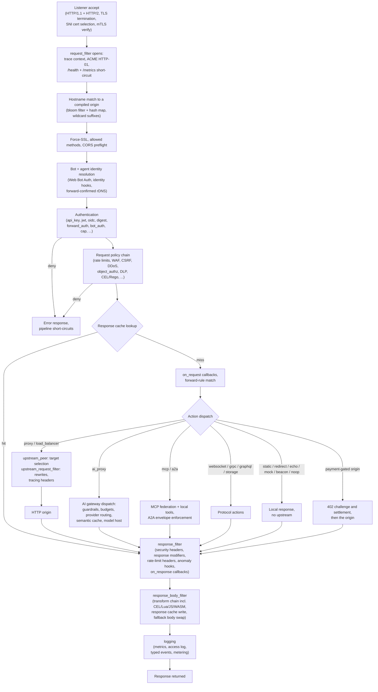

# SBproxy architecture and deployment guide

*Last modified: 2026-08-18*

This document covers the internal architecture of SBproxy, the request lifecycle, the plugin
system, the AI gateway, caching, events, and common deployment topologies.

It is reference material rather than a walkthrough: it explains how the parts fit together and
what each one is for, and there is nothing here to run. Every claim about how a feature behaves
belongs to that feature's own page, and those pages carry the config, the commands, and the
output. Start at [getting-started.md](getting-started.md) to stand a proxy up, and use
[configuration.md](configuration.md) for the field-by-field schema. The performance numbers in
§11 are reproduced in [performance.md](performance.md), which owns the harness and the
methodology behind them.

---

## 1. Overview

Public release archives contain a prebuilt SBproxy executable. Linux release artifacts
are linked against glibc. Running them does not require a Rust or C toolchain, a JVM, a
Python interpreter, or a Node.js runtime. Source builds can target `musl` with
`--target *-unknown-linux-musl` when a musl-linked executable is required.

The proxy is built on Cloudflare's [Pingora](https://github.com/cloudflare/pingora)
framework. Pingora supplies the tokio runtime, listener management, HTTP/1.1, HTTP/2
(HTTP/3 is currently disabled pending native Pingora HTTP/3), TLS termination, and a
phase-based callback model for the request
pipeline. SBproxy layers its host router, compiled origin pipeline, plugin registry, and
hot-reload machinery on top of those primitives.

The plugin system is modeled on Caddy's module pattern. Every extensible component type
(action handlers, auth providers, policy evaluators, transforms, middleware) registers
itself at compile time through the `inventory` crate. The proxy crate is the binary
composition root; pulling a feature in or out is a matter of which workspace crates are
linked into the final executable.

Key properties:

- Single binary. One file to copy, one process to manage. mimalloc is the global
  allocator, typically 5 to 10 percent faster than glibc's allocator under contention.
- Zero-dependency startup. Runs without Redis, a database, or a sidecar. External
  integrations (Redis cache, webhook events, OTEL tracing) are opt-in and fail gracefully
  when unavailable.
- Hot reload. Config changes are applied without restarting. The watcher detects file
  changes and atomically swaps the compiled origin map via `arc-swap`. In-flight requests
  finish on their snapshot; new requests pick up the new map immediately.
- Embeddable. The `sbproxy-core` crate exposes `run(config_path, GraceConfig)` as its public
  entry point for use as a library inside another Rust binary. Shutdown is signal-driven
  (SIGINT for a fast stop, SIGTERM for a graceful drain) inside Pingora's own server loop;
  `GraceConfig` configures the drain grace period, but there is no separate callable
  `shutdown()` function for an embedder to invoke.

---

## 2. Workspace layout

```
sbproxy/
  crates/
    sbproxy/              - Binary entry point. Wires modules and starts the server.
    sbproxy-core/         - Pingora server, host router, phase dispatch,
                              hot reload, hook registry.
    sbproxy-config/       - YAML/JSON schema, type definitions, parsing,
                              compilation (RawOrigin -> CompiledOrigin).
    sbproxy-plugin/       - Plugin trait definitions and `inventory` registry
                              (PUBLIC API for third-party modules).
    sbproxy-modules/      - Built-in modules (representative type strings,
                              not exhaustive; the authoritative list is the
                              match arms in sbproxy-modules/src/compile.rs):
                              action/   - proxy, load_balancer, redirect,
                                          static, echo, mock, beacon,
                                          websocket, grpc, graphql, ai_proxy,
                                          mcp, storage, noop
                              auth/     - api_key, basic_auth, bearer, jwt
                                          (with an optional jwks_url for
                                          RS256 key resolution), digest,
                                          forward_auth, bot_auth (Web Bot
                                          Auth), cap, oidc
                              policy/   - rate_limiting, ip_filter, waf, ddos,
                                          csrf, security_headers, request_limit,
                                          assertion, sri, rego, expression
                                          (CEL-based)
                              transform/- json, json_projection, html, markdown,
                                          template, lua_json, javascript, css,
                                          encoding, format_convert, normalize,
                                          payload_limit, replace_strings,
                                          html_to_markdown, sse_chunking, cel,
                                          noop
    sbproxy-ai/           - AI gateway: 72 native providers, routing,
                              guardrails, budget enforcement, virtual keys,
                              semantic cache, usage ledger.
    sbproxy-rag/          - Bounded retrieval-augmented generation runtime
                              for the AI gateway: extracts a query, embeds
                              it, searches a vector store, selects a bounded
                              context window.
    sbproxy-model-host/   - Local model-serving subsystem: model catalog,
                              GPU fit planner, engine supervisor. Single-node,
                              engine-agnostic.
    sbproxy-classifiers/  - Pure-Rust ONNX inference and tokenizer wrapper
                              for in-process detectors (guardrails, agent
                              scoring).
    sbproxy-classifier-client/ - gRPC client for the classifier sidecar's
                              InferenceService (used by compression's
                              token_prune lever and other sidecar-backed
                              detectors).
    sbproxy-classifier-proto/  - Shared gRPC InferenceService contract
                              between the client and the sidecar.
    sbproxy-classifier-sidecar/ - Standalone OSS classifier sidecar binary:
                              serves InferenceService over gRPC, backed by
                              the tract ONNX engine.
    sbproxy-extension/    - Scripting and extension runtimes:
                              cel/       - cel-rust expression evaluation
                              rego/      - Rego (OPA) policy evaluation via
                                           the Regorus interpreter
                              lua/       - mlua + Luau scripting
                              wasm/      - wasmtime sandboxed plugins
                              js/        - QuickJS via rquickjs
                              mcp/       - Model Context Protocol server
    sbproxy-middleware/   - CORS, HSTS, compression (gzip/brotli/zstd),
                              header modifiers, error pages, forward rules.
    sbproxy-cache/        - Response cache trait, memory backend,
                              pluggable store interface, cache key partitioning.
    sbproxy-storage/      - Storage abstraction (ephemeral KV, persistent KV,
                              set, pub/sub) with a Redis backend, shared by
                              the OSS mesh and the dynamic key plane.
    sbproxy-security/     - Cross-cutting security primitives: crypto helpers,
                              host filter (bloom + HashMap lookup), client-IP
                              extraction with trusted-proxy CIDRs, PII redactor,
                              SSRF guard, plus optional headless-browser
                              detection and bot/agent verification helpers.
                              The WAF, DDoS, CSRF, and security_headers
                              policies live in sbproxy-modules/src/policy/.
    sbproxy-agent-detect/  - Agent fingerprinting: scores TLS / HTTP /
                              payload signals into a single typed
                              `AgentDetection` (0-100 score, named id,
                              provenance, confidence) that policies and
                              scripting read off the request context.
    sbproxy-tls/          - TLS termination via rustls 0.23 with the `ring`
                              crypto provider, ACME auto-cert (Let's Encrypt),
                              HTTP/3 listener wiring (currently disabled
                              pending native Pingora HTTP/3), OCSP stapling
                              for the manual fallback certificate only.
    sbproxy-transport/    - Outbound transport: retry with exponential backoff,
                              request coalescing, hedged requests,
                              circuit breaker, upstream rate limiting.
    sbproxy-vault/        - Secret management across multiple backends (local
                              encrypted file, AWS Secrets Manager, Azure,
                              GCP, HashiCorp Vault, Kubernetes), rotation
                              hooks, secret-reference URI resolution.
    sbproxy-keystore/     - Mutable system of record for inbound virtual
                              keys and upstream credentials: pluggable
                              backends, a fail-closed TTL cache, at-rest
                              hashing and encryption.
    sbproxy-billing/      - Authoritative payment settlement domain,
                              independent of the request pipeline.
    sbproxy-meter/        - Attested consumption metering: the vocabulary a
                              usage receipt is written in.
    sbproxy-mesh/         - Shared local/distributed cluster substrate:
                              identity, SWIM liveness, typed state, caches,
                              metrics, managed models.
    sbproxy-capability/   - Executable capability registry: one vocabulary
                              for what a build of SBproxy claims to support.
    sbproxy-openapi/      - Emits an OpenAPI 3.0 document describing the
                              routes a compiled config exposes.
    sbproxy-observe/      - tracing-based structured logging,
                              Prometheus metrics, typed event bus.
    sbproxy-platform/     - Infrastructure primitives: KV store abstraction,
                              DNS cache, health tracking, circuit breaker.
    sbproxy-httpkit/      - HTTP utilities: client IP extraction,
                              host:port splitting, buffer pools, body limit
                              readers.
    sbproxy-util/         - Small dependency-free helpers shared across the
                              workspace (duration parsing, UTF-8 truncation,
                              and similar).
    sbproxy-k8s-controller/ - Kubernetes Gateway API controller: watches
                              GatewayClass / Gateway / HTTPRoute / GRPCRoute
                              and renders an sb.yml the data plane reads.
    sbproxy-k8s-operator/ - OSS Kubernetes operator scaffold: reconciles
                              SBProxy and SBProxyConfig CRDs into
                              Deployments, Services, and ConfigMaps.
  examples/               - Working sb.yml examples per feature
  docs/                   - Documentation
  e2e/                    - End-to-end test harness
  schemas/                - JSON schema for sb.yml
```

The dependency graph is enforced by the workspace structure. `sbproxy-plugin` is the public
API surface and sits at the bottom: it depends on no other workspace crate, only on small
external ones (`inventory`, `serde`, `http`, `bytes`, `arc-swap`). `sbproxy-config` depends
on `sbproxy-plugin`, not the other way round; its other workspace dependencies are
`sbproxy-platform` and `sbproxy-observe`. Built-in modules depend on `sbproxy-plugin`,
never on `sbproxy-core`. Third-party plugins built against the published `sbproxy-plugin`
crate are link-compatible with the binary.

---

## 3. Request pipeline

Every inbound request passes through the following stages in order. A rejection at any stage
short-circuits the rest and writes the error response immediately. The pipeline is
implemented as a sequence of `ProxyHttp` callbacks; the per-request work happens inside
those callbacks rather than in a separate dispatcher.

The full path, from listener to access log. Every box is a stage this section names; the
action-dispatch branches are the fifteen action types cataloged in
[features.md](features.md#6-reference-every-action-type):



The exact stage order inside those callbacks:

```
request_filter:
  1.  Trace context extract (W3C / B3)
  2.  ACME HTTP-01 challenge interception
  3.  /health and /metrics short-circuit
  4.  Hostname extraction and origin resolution (bloom + HashMap)
  5.  Force-SSL redirect
  6.  Allowed methods check
  7.  CORS preflight handling
  8.  Bot detection
  9.  Threat protection (JSON body checks)
  10. Authentication
  11. Policy enforcement (rate limit, IP filter, WAF, CSRF, DDoS, CEL, ...)
  12. Response cache lookup
  13. on_request callbacks
  14. Forward rule matching
  15. Non-proxy action dispatch (static, redirect, echo, mock, beacon, AI, ...)

upstream_peer:
  Resolve upstream peer for proxy actions.

upstream_request_filter:
  URL rewrite, query injection, method override, body replacement, request
  header modifiers, distributed tracing headers.

response_filter:
  CORS, HSTS, security headers, response modifiers, forward rule echo,
  rate limit headers, Alt-Svc, CSRF cookie, session cookie, on_response
  callbacks, traceparent echo.

response_body_filter:
  Response cache write on miss, transform pipeline, fallback body swap.

logging:
  Metrics emission, access log, event publication.
```

Action types dispatched inside `request_filter` step 15 (or via `upstream_peer` for
`proxy` actions): `proxy`, `load_balancer`, `ai_proxy`, `static`, `mock`, `redirect`,
`echo`, `beacon`, `noop`, `websocket`, `grpc`, `graphql`, `storage`, `a2a`, and `mcp`,
the complete set of match arms in `sbproxy-modules/src/compile.rs`.
[features.md](features.md#6-reference-every-action-type) catalogs what each one does.
Built-in actions are enum variants; the compiler turns the dispatch site into a
branch-predicted match. Third-party plugins use `Plugin(Box<dyn ActionHandler>)` and pay
one indirect call per request.

---

## 4. Plugin system

The config compiler resolves each `type` string that appears in YAML through three
tiers, in order: built-in modules (explicit match arms in
`sbproxy-modules/src/compile.rs`), linked plugins (typed `inventory` registrations from
`sbproxy-plugin`), and config-loaded extension bundles (JavaScript / WASM, see
[extension-bundles.md](extension-bundles.md)).

### Registry traits (sbproxy-plugin)

```rust,no_run
pub trait ActionHandler: Send + Sync + 'static {
    fn handler_type(&self) -> &'static str;
    fn handle(
        &self,
        req: &mut http::Request<bytes::Bytes>,
        ctx: &mut dyn std::any::Any,
    ) -> Pin<Box<dyn Future<Output = Result<ActionOutcome>> + Send + '_>>;
}
// Same shape for AuthProvider, PolicyEnforcer, and TransformHandler.
```

For a linked plugin, the registration unit is a factory function that constructs a
concrete handler from a `serde_json::Value` config blob and returns the boxed trait
object for its kind (`Box<dyn PolicyEnforcer>`, `Box<dyn ActionHandler>`, and so on).

### Registration pattern (linked plugins)

Each plugin kind has a typed registration struct: `ActionPluginRegistration`,
`AuthPluginRegistration`, `PolicyPluginRegistration`, `TransformPluginRegistration`.

```rust,no_run
inventory::submit! {
    PolicyPluginRegistration {
        name: "rate_limit_custom",
        factory: |raw| {
            let cfg: MyConfig = serde_json::from_value(raw)
                .map_err(|e| PluginError::Config(e.to_string()))?;
            Ok(Box::new(MyPolicy::new(cfg)))
        },
    }
}
```

`inventory::submit!` writes a static descriptor into a link-section that the binary
enumerates at startup. A linked plugin needs no central wiring: implement the trait,
submit the typed registration, and compile the crate into the `sbproxy` binary.

Register through the typed structs, never through the generic `PluginRegistration`
(the one carrying a `PluginKind` and a `Box<dyn Any>` factory). That channel feeds
diagnostics and the extension inventory listing only; the config compiler builds
handlers exclusively from the typed registrations, so a plugin submitted only as a
`PluginRegistration` compiles, shows up in listings, and never loads.

Adding a built-in (in-tree) module is different, because built-ins do have a central
wiring file:

1. Create the module file under `sbproxy-modules/src/{action,auth,policy,transform}/`
   and implement the trait.
2. Add `pub mod my_policy;` to the parent `mod.rs` and a variant to that kind's enum
   (`Policy`, `Action`, `Auth`, `Transform`).
3. Add a match arm for the config `type` string in `sbproxy-modules/src/compile.rs`.

The compile step matches built-in names against those arms first, then falls through to
`sbproxy_plugin::build_policy_plugin` (and its action / auth / transform siblings),
which consult the typed inventory registrations, and finally to the bundle registry
populated from config for JavaScript and WASM bundles. Built-ins are enum variants
(`Policy::RateLimit(...)`); plugin and bundle handlers ride `Policy::Plugin(...)` and
pay dynamic dispatch.

### Built-in vs plugin dispatch

Built-in modules are enum variants. Match dispatch over enums is a single
branch-predicted jump that the compiler typically inlines. Third-party plugins go through
`Box<dyn Trait>` for dynamic dispatch. That costs one indirect call per phase but keeps
the plugin ABI stable across compiler versions.

```rust,no_run
enum Action {
    Proxy(ProxyAction),
    Static(StaticAction),
    Redirect(RedirectAction),
    LoadBalancer(LoadBalancerAction),
    AiProxy(AiProxyAction),
    // ... built-ins
    Plugin(Box<dyn ActionHandler>), // third-party
}
```

### Signal hooks (identity, classification, anomaly)

Alongside the four handler kinds, `sbproxy-plugin` exposes three narrower seams for
embedders, registered by a function call at startup rather than through `inventory`
(`crates/sbproxy-plugin/src/identity.rs`):

- `IdentityResolverHook` (`register_identity_hook`) runs inside agent-identity
  resolution in `request_filter`, between Web Bot Auth verification and
  forward-confirmed rDNS. Hooks run in registration order; the first to return a
  verdict wins, and `None` falls through to the next resolver step.
- `MlClassifierHook` (`register_ml_classifier_hook`) is a defined seam for an
  embedder-supplied traffic classifier. Nothing in the OSS pipeline calls it today;
  do not depend on it firing until an embedder wires it in.
- `AnomalyDetectorHook` (`register_anomaly_hook`) dispatches in `response_filter`,
  once per request, after the identity, fingerprint, and rate signals are populated.
  The OSS pipeline forwards verdicts to whatever sink the hook wires and does not act
  on them itself.

OSS builds register none of the three. [request-flow.md](request-flow.md) shows their
exact pipeline placement next to every other attachment point.

### Thread safety

`inventory` is populated at link time before `main` runs. All registry reads happen after
that, against an immutable slice. There is no lock on the hot path: the compiled origin
holds direct `Arc` pointers to the handler instances, so per-request dispatch is a pointer
dereference followed by a virtual or static call.

---

## 5. Config architecture

### Pure types layer (sbproxy-config)

The `sbproxy-config` crate contains type definitions, serde derives, and the
compilation step. Its workspace dependencies are limited to `sbproxy-plugin`,
`sbproxy-platform` (the `KVStore` trait used by `build_l2_store`),
and `sbproxy-observe`. It does not pull in Pingora, the module set, or any networking
runtime.

The serde tags in `sbproxy-config` are the canonical field names. When in doubt about a
YAML field name, read the struct definition, not prose documentation.

### Config lifecycle

```
sb.yml (YAML file or API-delivered bytes)
    |
    v
serde_yaml::from_str -> ConfigFile { proxy, origins, tenants, ... }
                            |
                            v
           env interpolation  - Expand ${VAR} (with shell-style defaults)
                                in string values.
                            |
                            v
           compile_config()  - For each origin:
                              build CompiledOrigin {
                                action,
                                auths: SmallVec<[Auth; 2]>,
                                policies: SmallVec<[Policy; 4]>,
                                request_modifiers, response_modifiers,
                                transforms, hooks, cache, error_pages, ...
                              }
                            |
                            v
           secret resolution  - The binary resolves secret-reference URIs
                                (secret://, vault://, awssm://, ...) at
                                boot; a dangling reference fails the load.
                                The config crate itself stays vault-free.
                            |
                            v
           build host_map: bloom filter + HashMap of hostname -> origin index
                            |
                            v
           Arc<CompiledConfig>  - Immutable snapshot.
                            |
                            v
           ArcSwap::store()    - Atomic publish. Old readers continue
                                 against the previous snapshot.
```

There is no `secrets:` key on `ConfigFile` and no `${secret.X}` interpolation form; secret
material enters through `${ENV}` interpolation or through the secret-reference URI schemes
on secret-bearing fields. There is also no parent/child origin inheritance: every origin
is declared complete, and reuse happens at the YAML layer (anchors) or by generating the
file.

### Hot reload

The config watcher (`sbproxy-core::reload`) uses the `notify` crate to detect file changes.
On change it re-parses, re-resolves, and recompiles the config. The new
`Arc<CompiledConfig>` is published via `ArcSwap::store`. Requests that already loaded a
snapshot continue with it; new requests pick up the new pointer on their next snapshot
load. Old snapshots are dropped when their refcount hits zero, after all in-flight
requests using them complete. There is no global lock and no quiescence period.

---

## 6. AI gateway architecture

The `ai_proxy` action delegates entirely to the `sbproxy-ai` crate. It presents an
OpenAI-compatible API surface and routes requests to any supported LLM provider.

```
  Client (OpenAI-compatible request)
    |
    v
+------------------+
| AI Handler       |  Validates request format. Extracts consumer identity.
|                  |  Checks per-key concurrency limits.
+------------------+
    |
    v
+------------------+
| Guardrails       |  Pre-request evaluation. CEL/Lua selectors determine
| (pre-request)    |  which guardrail rules apply. Rules may block, flag,
|                  |  or redact content before the request leaves the proxy.
|                  |  Built-in types: PII, prompt injection, toxicity,
|                  |  jailbreak, content safety, JSON schema, regex.
+------------------+
    |
    v
+------------------+
| Compression      |  Resolves X-Compression, governed key, CEL, then route
| policy           |  default. Pins one default or named runtime before any
|                  |  semantic-cache lookup and transforms messages safely.
+------------------+
    |
    v
+------------------+
| Router           |  Selects provider and model based on routing strategy
|                  |  (17 selectable strategies; see the table below).
+------------------+
    |
    v
+------------------+
| Budget Enforcer  |  Hierarchical scopes (workspace, key, route).
|                  |  Action on exceed: log, downgrade to cheaper model,
|                  |  or hard-block with 402.
+------------------+
    |
    v
+------------------+
| Provider         |  Translates normalized request to provider-specific
|                  |  wire format. Injects the configured API key.
+------------------+
    |
    v
  LLM API (OpenAI / Anthropic / Gemini / Bedrock / ...)
    |
    v
+------------------+
| Response Handler |  For streaming: SSE relay running the streaming-safe
|                  |  output guardrails per chunk. Token usage and cost
|                  |  recorded when the stream closes.
|                  |  For non-streaming: full response passed to every
|                  |  output guardrail before returning to client.
+------------------+
    |
    v
  Client
```

### Compression runtime boundary

Each compiled AI origin owns an immutable default compression pipeline, an
immutable `off` pipeline, and immutable named pipelines. Request dispatch pins
one of them with precedence header, governed key, CEL, then route default. The
selector is resolved before either semantic-cache implementation can read or
arm write-back state. Routes with named profiles, an explicit-budget default,
or a marked-context lever, and requests with an explicit selector, bypass
caches that cannot partition by compression behavior. This keeps a cache hit
from crossing profile boundaries. The legacy default-only compatibility
pipeline retains its old cache scope.

`window_fit` is stateless. Explicit-budget fitting preserves the leading
instruction prefix, newest protocol unit, contiguous recent suffix, and tool
call/result groups. `query_select` ranks marked text sentences against the
marked query without external state. `token_prune` uses a shared lazy client to
the classifier sidecar, validates its extractive result, and fails open at
the lever boundary. `summary_buffer` defaults to a process-owned Local redb
store and accepts explicit Redis or mesh state. Redis serializes updates across
processes; mesh uses the replicated substrate's eventual last-writer-wins
contract. Admin deletion and purge operate on the same selected store. There is
no OmniRoute runtime, import, or migration seam.

Compression produces pending per-lever value after it changes the message list.
The response phase commits that value only for a billable terminal provider
success, then updates bounded metrics and the process-wide Admin value ledger.
Logs and metrics carry closed selectors, outcomes, numeric counts, and timing;
they never include message or summary content.

### Provider registry

Providers do not use the `inventory` mechanism and there is no per-provider trait to
implement. The catalog is data: `data/ai_providers.yml` in the `sbproxy-ai` crate maps
provider names to base URLs, auth header shapes, and aliases, and a gzipped copy is
embedded in the binary at compile time so a fresh build needs no file on disk. Operators
can override or extend the catalog at runtime by pointing `proxy.ai_providers_file` at
their own YAML; the registry is held behind an `ArcSwap` and rebuilt on hot reload.
Request serialization and response normalization are handled by the shared client plus
the format translators (Anthropic, Gemini, Bedrock).

72 native providers ship in-tree alongside a native Anthropic
translator. The `model` field passes straight through to the upstream,
so the gateway reaches 200+ models without enumerating them.
Direct adapters include OpenAI, Anthropic, Google Gemini, Azure
OpenAI, AWS Bedrock, Cohere, Mistral, DeepSeek, xAI / Grok, Perplexity,
Groq, Together AI, Fireworks AI, OpenRouter, Ollama, vLLM, AWS SageMaker,
Databricks, Oracle Cloud GenAI, IBM Watsonx, plus three local-runtime
adapters (Hugging Face TGI, LM Studio, llama.cpp).

### Routing strategies

| Strategy            | Behavior |
|---------------------|----------|
| `round_robin`       | Rotate through providers in order. |
| `weighted`          | Distribute proportional to provider weight. |
| `fallback_chain`    | Try providers in priority order, falling back on failure. |
| `random`            | Uniform random pick. |
| `lowest_latency`    | Provider with the lowest observed latency (microseconds, atomic counter). |
| `least_connections` | Provider with the fewest in-flight requests. |
| `cost_optimized`    | Lowest score of `connections * 1000 + weight`. Utilization dominates; weight breaks ties in favor of cheaper providers. |
| `least_token_usage` | Provider with the lowest recorded token throughput. |
| `prefix_affinity`   | Hash the prompt prefix to a provider so shared-prefix sessions land on the same upstream cache. |
| `sticky`            | Pin a session key to one provider. Falls back to round robin without a session key. |
| `race`              | Fan out to every healthy provider in parallel; first non-error response wins, the rest are canceled. |
| `peak_ewma`         | Power-of-two-choices over time-decayed peak latency and in-flight load: sample two eligible providers, route to the lower effective cost. |
| `cascade`           | Tiered dispatch from cheapest to most expensive (provider, model) pairs; a response below the tier's quality threshold retries on the next tier. |
| `cost_quality`      | Score the prompt's difficulty and route simple prompts to a cheap model, hard prompts to a frontier model, on a `cost_threshold` dial. |
| `outcome_aware`     | Route on realized cost-per-success; see [ai-outcome-aware-routing.md](ai-outcome-aware-routing.md). |
| `headroom`          | Prefer the provider with the lowest request-quota pressure (`1 - remaining/limit`) from fresh header-derived snapshots. Unknown or stale signals sort after known fresh observations. |
| `reset_aware`       | Prefer the provider whose quota window resets soonest among candidates waiting for positive capacity; providers already reporting remaining capacity sort first. |

An eighteenth wire value, `token_rate`, parses but is refused at config load: it would score
providers by remaining tokens-per-minute headroom against a per-provider limit no
configuration field supplies, so every limit would be zero and the score would silently
collapse to `least_token_usage`. The config compiler rejects it outright and names
`least_token_usage` as the replacement rather than aliasing it quietly.

### Streaming

The SSE relay reads chunks from the upstream provider and forwards them to the client
immediately. On the streaming output path only the streaming-safe guardrails (`regex`,
`pii`, `schema`, `context_poisoning`) run against each chunk; classifier-style guardrails
are skipped because partial windows produce unreliable verdicts. Token usage is parsed
from the stream's terminal frames and recorded against budgets when the stream closes.
The per-guardrail streaming policy table is in
[ai-gateway.md](ai-gateway.md#streaming-policy).

### Streaming and the semantic cache

Semantic caching is not a hook. It compiles per action into a
`SemanticCacheRuntimeRegistry` owned by the pipeline (one slot per compiled origin action
plus one per forward-rule action that carries its own `semantic_cache:` block), so the
request path reaches it directly rather than through an optional extension slot. A
forward rule without its own `semantic_cache:` block never inherits the origin's, because
it may route to a different model, guardrail set, or credential policy.

A streaming request skips semantic-cache embedding, lookup, and write outright: an SSE
stream cannot be admitted as one buffered cache entry, and gating only the later write
would still pay for the embedding call and still touch the backend. There is no
streaming-response cache recorder in the current codebase; the `Hooks` bundle in
`sbproxy-core/src/hooks.rs` has slots for `startup`, `prompt_classifier`,
`intent_detection`, `quality_scoring`, and `stream_safety` only.

### MCP federation

`sbproxy-extension::mcp` implements a Model Context Protocol server. Tools from upstream
MCP endpoints can be federated and exposed as a single combined tool surface to clients.
Tool calls are routed to the registered upstream by name, with optional auth injection.

---

## 7. Event system

There is no single general-purpose event bus on the serving path. What ships is a set of
narrow, purpose-built channels:

### Policy verdict bus

Every policy decision emits a `PolicyVerdictEvent` (type defined in
`sbproxy-observe::events`) onto a bounded `tokio::sync::mpsc` channel in
`sbproxy-core::policy_bus` (capacity 10,000). The hot path finishes as soon as the event
is enqueued; a downstream consumer drains it asynchronously. The default consumer writes
JSON lines to stderr. On overflow the dispatcher drops the event, increments
`sbproxy_policy_audit_events_dropped_total{tenant}`, and continues; the hot path never
blocks on the bus.

### Tracing channels

Structured operator-facing streams (the access log, request events, and the config and
security audit channels) are emitted as `tracing` events on dedicated targets, so the
logging pipeline routes them like any other log output. The audit channels are documented
in [audit-log.md](audit-log.md).

### Webhook callbacks

Per-origin `on_request` / `on_response` callbacks POST a JSON envelope to an operator URL,
with optional HMAC signing via a per-entry `secret`, a timeout, and an error policy. This
is the shipped push mechanism for request lifecycle events; the envelope and signing are
specified in [configuration.md](configuration.md#webhook-envelope-and-signing).

### Typed event egress

`sbproxy-observe` defines a closed `EventType` enum (`request_started`, `policy_denied`,
`config_reloaded`, ...) with two independent consumers.

The `events:` block is the shipped one. It sends selected types to an NDJSON file or an
HTTP endpoint through a bounded queue drained by a background worker, so a slow collector
cannot add latency to a request, and a full queue drops the event and counts it on
`sbproxy_events_dropped_total`.

`EventBus` is the other, a library-only seam for code-level embedders. It fans out to
handler closures synchronously on the publisher's thread and is not what the `events:`
sinks use. See [events.md](events.md) for both.

---

## 8. Caching architecture

### Response cache

The response cache sits inside the request pipeline at two points: before the action handler
(cache hit check) and after the action handler (cache write on miss). It is keyed by a
signature derived from the request method, URL, selected request headers, and optionally
the request body hash.

Configurable per origin:

- `ttl` - Time-to-live for cached entries.
- `stale_while_revalidate` - Serve stale content while a background refresh runs.
- `vary` - List of request headers to include in the cache key.
- `methods` - Which HTTP methods are eligible for caching (default: GET, HEAD).

### Store backends

| Backend   | Use case |
|-----------|----------|
| `memory`  | Single-instance deployments. LRU eviction. No persistence. |
| `file`    | Survives restarts. Suitable for low-traffic origins with slow upstreams. |
| `memcached` | Distributed cache via memcached protocol. |
| `redis`   | Shared cache across multiple proxy instances. JSON serialization with TTL (`SET key value EX ttl`). Pooled connections (default 8) track a healthy/failed status per store for observability; a failed connection is discarded and replaced rather than fast-failed by a breaker. |

The `CacheStore` trait (in `sbproxy-cache::store`) is the pluggable surface; new backends
are added without touching the pipeline.

### Object cache

Separate from the response cache. Stores arbitrary objects (compiled CEL programs, parsed
Lua scripts, provider capability metadata). Backed by the same store interface. TTL and
LRU eviction policy are configured independently.

### Cache key partitioning

Response cache keys are built as
`workspace:hostname:method:path:canonical_query:vary_fp`, where `canonical_query` is the
query string canonicalised under the origin's query mode and `vary_fp` is a fingerprint of
the configured `vary` header values. The leading workspace segment prevents cross-tenant
collisions when multiple origins share a backend store.

---

## 9. Observability

The observability stack has three components: Prometheus metrics, OpenTelemetry tracing,
and structured logging via `tracing`.

### Prometheus metrics

SBproxy serves `/metrics` in Prometheus exposition format on the proxy listener itself,
and on the admin listener when the admin API is enabled; there is no separate
`telemetry.bind_port` key or dedicated metrics server. Metric names share a single
`sbproxy_*` namespace. Core HTTP counters include `sbproxy_requests_total` and
`sbproxy_request_duration_seconds`. AI gateway metrics carry `sbproxy_ai_*`. Auth, policy,
cache, and circuit breaker counters follow the same convention; the full stable list is in
[metrics-stability.md](metrics-stability.md).

### Grafana dashboards and alert rules

The repo-root `dashboards/` directory ships Grafana dashboards under `dashboards/grafana/`
(overview, origins, security, policy verdicts, AI gateway, AI value, bot traffic, model
host, judge backend) plus Prometheus recording rules and alerts under
`dashboards/prometheus/` (`recording-rules.yml`, `alerts.yml`), including per-tenant and
per-credential spend alerts. Two additional dashboards (`proxy-overview.json`,
`mesh-overview.json`) live in `crates/sbproxy-observe/dashboards/`.

### Structured logging

Logging uses the `tracing` crate. `release_max_level_info` is set at the workspace level,
which compile-strips `debug!` and `trace!` calls from release builds entirely. On hot paths
the macro arguments are eliminated rather than evaluated and filtered at runtime.

### Distributed tracing

Distributed tracing extracts W3C Trace Context (`traceparent` / `tracestate`)
and B3 single / multi-header formats, generates a child span ID for each
upstream call, and echoes the propagation headers back to the downstream
client. OTLP export is shipped and wired: configure the
`proxy.observability.telemetry` block (endpoint, transport, sampling) and the
binary initializes the OTLP trace and metrics pipelines at startup via
`sbproxy-observe::telemetry`. An OTLP logs sink is also available for shipping
structured logs to the same collector. See [observability.md](observability.md).

---

## 10. Deployment topologies

### Single instance (simplest)

```
  Internet
     |
     v
 [ sbproxy ]  <-- single binary, one process
     |
     v
 [ Upstream services / APIs ]
```

One process, one config file. TLS handled by SBproxy via ACME (Let's Encrypt). Fine for
internal tools, development environments, and low-traffic production services.

### Behind a load balancer (horizontal scaling)

```
  Internet
     |
     v
[ Load Balancer ]  (e.g., AWS ALB, Nginx, HAProxy)
     |       |
     v       v
[ sbproxy ] [ sbproxy ]  (2+ instances, same sb.yml)
     |           |
     v           v
[ Upstream services / APIs ]
```

For shared cache and session state, configure the `redis` store backend. All instances
connect to the same Redis. TLS is terminated at the load balancer.

### Kubernetes with Ingress

```
  Internet
     |
     v
[ Ingress Controller ]  (nginx, traefik, etc.)
     |
     v
[ sbproxy Service ]  (ClusterIP or NodePort)
  /     |     \
 v      v      v
[pod] [pod] [pod]  (3+ replicas, Deployment)
  |
  v
[ Upstream Services ]  (other Deployments or external APIs)
```

Sample topology:

```yaml
apiVersion: apps/v1
kind: Deployment
metadata:
  name: sbproxy
spec:
  replicas: 3
  template:
    spec:
      containers:
      - name: sbproxy
        image: sbproxy:latest
        args: ["--config", "/config/sb.yml"]
        ports:
        - containerPort: 8080
        readinessProbe:
          httpGet:
            path: /health
            port: 8080
        livenessProbe:
          httpGet:
            path: /health
            port: 8080
        volumeMounts:
        - name: config
          mountPath: /config
      volumes:
      - name: config
        configMap:
          name: sbproxy-config
```

Config is supplied via a ConfigMap. The hot-reload watcher detects the kubelet's atomic
symlink swap when the ConfigMap updates.

### Docker Compose (dev and test)

```
  Browser / curl
     |
     v
[ sbproxy ]  (port 8080)
     |
     +---> [ mock-api ]    (local upstream for testing)
     |
     +---> [ redis ]       (shared cache for multi-instance testing)
```

Sample `docker-compose.yml` fragment:

```yaml
services:
  sbproxy:
    image: sbproxy:latest
    ports:
      - "8080:8080"
    volumes:
      - ./sb.yml:/config/sb.yml:ro
    command: ["--config", "/config/sb.yml"]
    depends_on:
      - redis

  redis:
    image: redis:7-alpine
    ports:
      - "6379:6379"
```

---

## 11. Performance characteristics

### Compiled pipeline, not interpreted

The biggest win in the request path is that auth chains, policy chains, modifier chains,
and the action handler are compiled exactly once per origin and stored as inline
collections of trait objects (or enum variants for built-ins). A request through a
compiled pipeline is a slice iteration with no map lookups, no JSON re-parsing, and no
config re-reads.

### Per-request allocation budget

The goal is near-zero heap allocations on the hot path for a proxy-type request:

- Per-request state lives in a `bumpalo` arena that resets after the response is written.
  Many small allocations become a single bump-pointer increment.
- `bytes::Bytes` and `BytesMut` carry request and response bodies, avoiding copies as
  data moves through pipeline phases.
- `compact_str::CompactString` keeps short strings (hostnames, IDs, header names) inline
  on the stack without heap allocation.
- `smallvec::SmallVec<[T; N]>` keeps policies, transforms, and modifiers inline; most
  origins have 1 to 3 of each.
- The compiled pipeline itself allocates nothing at call time.

### Connection pooling and HTTP/2

Pingora maintains a connection pool per upstream peer with tuned idle connection limits.
HTTP/2 multiplexing is enabled for upstreams that negotiate it via ALPN. Connection reuse
eliminates TCP and TLS setup cost for repeated requests to the same upstream. Pingora is
production-tested at Cloudflare scale; SBproxy inherits its IO model directly.

### DNS cache

`sbproxy-platform::dns` provides a `DnsCache`: a `DashMap` keyed by hostname whose entries
carry a configurable TTL and a bounded maximum entry count, so lookups are lock-striped
O(1) reads with lazy expiry. A `RefreshingResolver` layers proactive re-resolution on top
so hot hostnames stay warm instead of taking a miss when their TTL lapses. This matters
most for AI proxy routes, which resolve provider hostnames on every request.

### Bloom filter for hostname pre-check

The host router maintains an in-memory bloom filter over all exactly configured hostnames.
On each request, the filter is checked before any HashMap lookup. Requests for unconfigured
hostnames (scanners, bots, misconfigurations) are rejected in sub-microsecond time without
touching the HashMap. Wildcard origin keys (`*.example.com`) live in a separate suffix map
consulted only after the exact lookup misses, walking the inbound hostname one leading
label at a time, so configs without wildcards keep the pure fast-reject path.

### Sharded counters for hot state

Subsystems that track per-consumer or per-origin state (rate limiters, AI session counters)
shard their state across N buckets based on a hash of the key. Each shard uses
`parking_lot::Mutex` or atomic counters. That cuts lock contention by a factor of N
under concurrent load from many distinct keys. The rate limiter also has atomic-only fast
paths when the bucket has clear capacity.

### Lock-free config reads

`arc-swap` provides atomic pointer swap with no locking on the read side. Every request
loads the current `Arc<CompiledConfig>` once, which is a single atomic read plus a refcount
increment. Hot reload publishes a new pointer; in-flight requests continue against their
existing snapshot until they complete and drop their `Arc`.

### Circuit breaker design

Each upstream has a circuit breaker backed by atomic compare-and-swap operations. The
open / half-open / closed state transition uses a single atomic int. Only one probe request
is allowed through per recovery cycle. All other requests during the open state fail fast
without acquiring any lock or making any network call.

### Compiler optimizations

Release builds use `opt-level = 3`, `lto = "fat"`, `codegen-units = 1`, and
`strip = "symbols"`; the release profile keeps the default unwinding panic runtime rather
than `panic = "abort"`. mimalloc replaces the system allocator. `tracing`'s
`release_max_level_info` feature compile-strips all debug and trace logging from the
binary.

### Observed overhead

Under typical workloads (no Lua, no CEL, no response transforms), the proxy adds well
under 1 millisecond of overhead at p99 to end-to-end request latency. The dominant cost
is the upstream network round-trip. Microbenchmarks for static and echo actions clear
100k requests per second on a single core; full-pipeline scenarios with auth, rate
limiting, CORS, and HSTS sustain 80k or more.

For benchmark methodology, scenario definitions, and how to reproduce these numbers, see
[performance.md](performance.md). For feature-by-feature comparisons against other proxies
and AI gateways, see [comparison.md](comparison.md). For the YAML schema reference, see
[configuration.md](configuration.md).
