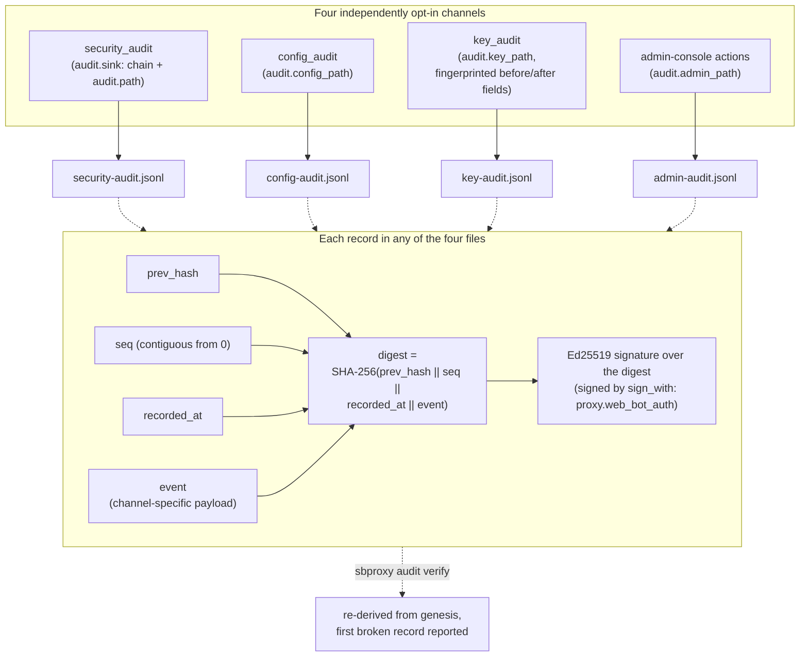
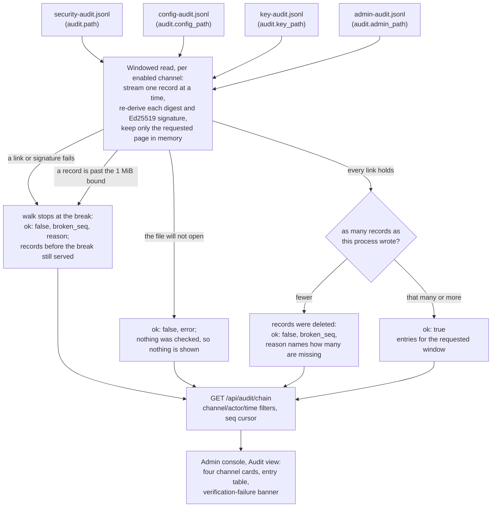

# Audit log
*Last modified: 2026-08-30*

SBproxy's audit surface is a set of narrow, structured channels rather than one audit framework. This page documents what actually ships: the admin-action audit rows served at `/api/audit/recent`, the `config_audit` / `security_audit` / `key_audit` / `sbproxy::admin::audit` tracing channels, the tamper-evident chains each of those four can be written to, the `AdminAuditEmitter` plugin seam, and the emission metric. There is no `sbproxy_audit` crate and no envelope middleware.

One thing on this page is durable and provable, and the rest is not. `audit.sink: chain` writes every `security_audit` event to a hash-chained, Ed25519-signed file that `sbproxy audit verify` re-derives from genesis. `audit.config_path`, `audit.key_path`, and `audit.admin_path` each opt one more channel into its own chained file under the same signing identity, verified the same way with `--channel config`, `--channel key`, or `--channel admin`; see [Tamper-evident security audit trail](#tamper-evident-security-audit-trail). Everything else here is either an in-memory ring that dies with the process or a tracing stream whose durability is whatever your collector gives it. Read the sections below with that split in mind, because a log stream is a record of what the proxy said rather than a record of what happened: whoever can write the file can rewrite it.

## Admin-action audit rows

Admin actions that change runtime state record an `AuditRow` (defined with the
module-owned state machine in
`crates/sbproxy-modules/src/policy/rate_limit_budget/runtime.rs`):

| Field | Type | Notes |
|---|---|---|
| `timestamp` | RFC 3339 string | Wall-clock time of the action. |
| `action` | string | What happened, e.g. `rate_limit_suspend`. |
| `target_kind` | string | The kind of entity acted on, e.g. `workspace`. |
| `target_id` | string | The identifier of the targeted entity. |
| `reason` | string | Human-readable explanation of why the action fired. |

The workspace rate-limit budget's auto-suspend and resume transitions are the emitters today. Each row is retained in an in-memory ring of the most recent 256 rows and also goes through `SecurityAuditEntry::emit` (`event_type` `rate_limit_auto_suspend` / `rate_limit_resume`) so `audit.sink: chain` records the same transition the admin ring shows.

Query the ring through the admin API:

```
GET /api/audit/recent?limit=50
```

The response is a JSON array of rows, newest first. `limit` defaults to 50.

### The `audit:` block

The top-level `audit:` block selects whether the audit trail has a durable
form. It has two accepted values:

```yaml
audit:
  sink: memory        # the default: no durable trail
```

`memory` is what a proxy with no `audit:` block does. The most recent 256
admin-action rows stay queryable via `/api/audit/recent`, the unified ring
behind `/api/audit/events` holds the most recent 1000 events across every
channel, and each channel keeps emitting on its tracing target. All of it
is lost when the process is.

`chain` adds the durable, tamper-evident half; see the next section.

`tracing` was removed. It never selected anything: emission to the
`config_audit`, `security_audit`, `key_audit`, and `sbproxy::admin::audit`
targets has always been unconditional, so `tracing` and `memory`
described the same proxy. A
config that still names it is refused at load with a message pointing at
both replacements, rather than being accepted and quietly meaning
`memory`. A `path` or a `sign_with` under any sink other than `chain` is
refused for the same reason: a path nothing writes to is the more
dangerous of the two mistakes, because it looks configured.

## Tamper-evident security audit trail

`audit.sink: chain` appends every `security_audit` event to a SHA-256
hash-chained, Ed25519-signed file:

```yaml
proxy:
  web_bot_auth:
    key_id: sbproxy-audit-2026
    ed25519_seed_hex: ${SBPROXY_AUDIT_SEED}

audit:
  sink: chain
  path: /var/lib/sbproxy/security-audit.jsonl
  sign_with: proxy.web_bot_auth
```

Three keys, and each one is doing something.

`sink: chain` turns the chain on. Nothing else changes: the tracing
targets and the in-memory rings keep working exactly as they did, and the
chained record is byte-for-byte the record the `security_audit` target
already ships, so your SIEM's copy of an event and the chain's copy cannot
disagree.

`path` is the file. It is opened once at boot, appended to under a mutex,
and flushed per record, so a record that reached the file survives the
process that wrote it. Put it on durable storage; parent directories are
created at boot.

`sign_with` is the signing identity, and the only value this build
resolves is `proxy.web_bot_auth`. That is deliberate: it is the proxy's
one Ed25519 identity, the same one `proxy.attestation.sign_with` names for
metering receipts, so a deployment that already publishes that key does
not acquire a second key-distribution problem by turning this on. Source
the seed from the environment or a vault reference rather than committing
it.

### The config chain

`audit.config_path` opts `config_audit` events into a second chained file,
signed with the same identity:

```yaml
audit:
  sink: chain
  path: /var/lib/sbproxy/security-audit.jsonl
  sign_with: proxy.web_bot_auth
  config_path: /var/lib/sbproxy/config-audit.jsonl
```

It is off by default: with no `config_path`, `config_audit` stays a
tracing stream and nothing else changes, which is the same behavior this
proxy has always had. Setting it requires `sink: chain`; naming it under
`sink: memory` is refused at load. It must also name a different file
than `path`, because the security and config chains carry different
payload shapes and verify independently, and one file cannot hold both
without breaking the digest walk partway through.

Everything the security chain gives you above applies to this one too:
each `ConfigAuditEntry` is hash-chained and signed the same way, the file
is its own write-ahead log, and `sbproxy audit verify` re-derives it from
genesis. What is chained is the change, never the document. A
`ConfigAuditEntry` carries which origins moved, which revision it moved
between, and who asked for it, and not one config value, which is why
chaining the record of a reload is safe even though chaining what it
loaded would not be.

### The key chain

`audit.key_path` opts `key_audit` mutations into a third chained file:

```yaml
audit:
  sink: chain
  path: /var/lib/sbproxy/security-audit.jsonl
  sign_with: proxy.web_bot_auth
  key_path: /var/lib/sbproxy/key-audit.jsonl
```

Off by default, on the same terms as `config_path`: it requires `sink:
chain` and must name a file distinct from `path`, `config_path`, and
`admin_path`.

What lands in this chain is not `key_audit`'s tracing entry. That entry
carries a full before/after diff of the mutated key or credential
record, and a diff is exactly the field a chain cannot hold: the whole
point of a chain is that nobody, including someone with disk access,
can quietly edit it later, so a secret written into one can never be
quietly removed either. Instead the chain gets a `KeyAuditChainEntry`:
every metadata field the tracing entry carries (timestamp, operation,
resource kind, public id, actor, tenant), plus a keyed-HMAC-SHA256
fingerprint of each before/after field in place of its value.

The fingerprint key is derived once per boot from
`key_management.crypto.master_key`, under its own HKDF purpose, and
never leaves process memory. A field's name reaches the chain one of
two ways. `status`, the one field name the key-mutation path diffs
today, is copied in verbatim, because it is a closed, reviewed
vocabulary rather than a caller-supplied string. Any other field name
gets its own keyed fingerprint too, prefixed `f:` so a reader can tell
a name from a fingerprint at a glance. Either way, the value itself is
never copied: it goes through the same keyed HMAC, bound to its field
name, so `{"status": "blocked"}` and a future `{"role": "blocked"}`
fingerprint differently even though the value is the same string.

Each entry also carries a `key_epoch`, a short tag derived from the
same fingerprint key. Two entries with the same `key_epoch` were
fingerprinted under the same key and their fingerprints can be
compared; two with different epochs cannot, because a rotated or
ephemeral master key re-derives a fresh fingerprint key on the next
boot and silently re-bases everything that follows. `key_epoch` is how
a reader tells that happened.

The `key_audit` tracing target and the in-memory ring both keep the
full, unredacted before/after diff, exactly as they always have.
Fingerprinting is a property of the chain file alone.

### The admin chain

`audit.admin_path` opts authenticated admin-console actions into a
fourth chained file: mutating admin API calls, logins, and
content-inspection actions, the same events the `sbproxy::admin::audit`
tracing target and the admin ring's `admin` channel already carry.

```yaml
audit:
  sink: chain
  path: /var/lib/sbproxy/security-audit.jsonl
  sign_with: proxy.web_bot_auth
  admin_path: /var/lib/sbproxy/admin-audit.jsonl
```

Off by default, on the same terms as `config_path` and `key_path`.
Unlike the key chain, nothing here needs fingerprinting: an
`AdminActionAuditEntry` carries the operator, the tenant, the public
key id (never the secret), a request correlation id, and a bounded
free-text `detail` (an HTTP method and path, or a role label; never a
header value or a credential), and every one of those fields was
already reviewed as secret-free for the ring. The chained record is
that entry, byte for byte.

`detail` is capped at 512 bytes on both the ring and the chain, and by
the same helper, so the ring's copy of one action and the chain's copy
never disagree about what that action said. The admin-action ring at
`/api/audit/recent` stays the fast, bounded read model the console
queries; the chain is the durable, tamper-evident record of the same
actions. Losing the process loses the ring; it does not lose the
chain.

### What the chain proves



Each record is `SHA-256(prev_hash || seq || recorded_at || event)` and
carries an Ed25519 signature over that raw digest. Three consequences an
auditor can rely on:

- **Editing a record is detectable.** The record's own digest stops
  matching its bytes, and every record after it chains onto a head that no
  longer exists.
- **Deleting a record is detectable.** Sequence numbers are contiguous
  from zero, so a removed line leaves a gap that verification reports.
  This is the case a plain log file cannot cover at all.
- **Rewriting the whole file is detectable.** Somebody with write access
  can produce an internally consistent chain, but not one that verifies
  against the published key.

### Verifying it

`sbproxy audit verify` re-derives a chain from genesis and reports the
first record that does not check out. Exit 0 verifies, exit 1 does not, so
it drops straight into cron or a CI lane:

```bash
sbproxy audit verify /var/lib/sbproxy/security-audit.jsonl \
  --signing-seed-hex "$SBPROXY_AUDIT_SEED"
```

`--channel` picks which chain the file at `path` is: `security` (the
default, the trail `audit.sink: chain` writes), `config` (the trail
`audit.config_path` writes), `key` (the trail `audit.key_path` writes),
or `admin` (the trail `audit.admin_path` writes). Each channel writes a
different payload shape to its own file, so pass the channel that
matches the file:

```bash
sbproxy audit verify /var/lib/sbproxy/config-audit.jsonl \
  --channel config --signing-seed-hex "$SBPROXY_AUDIT_SEED"
```

The same pattern verifies the key and admin chains, pointed at
`audit.key_path` or `audit.admin_path` with `--channel key` or
`--channel admin`.

Without `--signing-seed-hex` only the hash chain is checked, which catches
an edit made by somebody who could not re-link the file and misses one
made by somebody who could. `--format json` emits a single object with
`entries`, `ok`, `broken_seq`, `reason`, and `signature_checked` for
tooling.

The command reads the file and nothing else. No config, no admin API, no
running proxy: an auditor with a copy of the trail and the public key can
verify a file the proxy that wrote it no longer has. The digest layout is
fixed and documented in the ledger module, so an auditor who would rather
not run our binary at all can reproduce it from any SHA-256 and Ed25519
implementation.

### Browsing it from the console

`sbproxy audit verify` is the auditor's tool: it runs anywhere, against
a copy, with no proxy involved. Day to day, though, the person who wants
to know what the chains hold is an operator with the admin console
already open. `GET /api/audit/chain` serves that reader: it reads the
chained files themselves, verifies every link on the way, and the
console's Audit view renders the result with the verification status in
the same place as the entries.



The read is windowed, and the window is the memory bound. Chains are
append-only files with no rotation, so a busy security chain can be
large; the route never loads a whole file. Each request streams the file
one record at a time, re-deriving every digest and checking every
signature exactly as `sbproxy audit verify` does, and keeps only the
page it was asked for: 100 records by default and 500 at most, per
channel walked, so a merged read across all four holds at most four
such pages before it cuts them down to one. Any single record past
1 MiB stops the walk and is reported as a verification failure, since
no writer of ours produces one; `sbproxy audit verify` stays the
unbounded authority for a file in that state. Verification is
not optional and not cached: it is the same walk that finds the entries,
so a page of entries and a claim that the chain holds always describe
the same read of the same bytes.

A verification failure is served, never hidden. If a record fails the
walk, the response still carries every record before the break, plus
`ok: false`, the sequence number the walk stopped at, and the reason.
The console shows the same thing as a banner over the table. This is
the point of the feature: a viewer that quietly skipped a broken record
would be a log reader, and the chain would be decoration.

Two things fail a walk, and the second is the one a hash chain cannot
catch by itself. A record that was *edited* breaks its own digest, and
the walk stops there. A record that was *deleted*, or a file that was
truncated or replaced wholesale, leaves nothing behind to disagree
with: what is left links and signs perfectly. So the read compares the
walk's count against the number of records this process wrote and
flushed to that chain, and a file holding fewer than that is reported
as a failure with the count of what is missing. Deleting the trail is
the most obvious tamper there is, and it must not be the one that
renders green.

Query parameters, all optional:

| Parameter | Meaning |
|---|---|
| `channel` | One of `security`, `config`, `key`, `admin`. Without it, the response merges the newest window across every enabled channel. |
| `actor` | Exact match on the acting identity: the operator on the config, key, and admin channels; the client IP on the security channel, which has no operator. |
| `since` / `until` | RFC 3339 bounds on each record's chained `recorded_at`, inclusive. |
| `before_seq` | Cursor: only records with a lower sequence number, for paging back through one channel. Requires `channel`, because sequence numbers only mean something inside one chain. |
| `limit` | Page size, default 100, capped at 500. |

The response reports all four channels every time, the disabled ones
included, so the console can show "not configured" rather than nothing.
A channel the request did not walk carries no `ok` at all, which is a
third answer next to true and false: this read proved nothing about that
chain. A status object that could only say "fine" or "broken" would let a
channel-filtered read render the other three as healthy on the strength
of having ignored them.

The route is GET-only and carries no state to mutate, so a `read_only`
operator can use it exactly as an `admin` can; reading the trail is the
job that role exists for. A login narrowed to one tenant with
`proxy.admin.operators[].tenant` is refused instead, with a `403`. The
chains are deployment-wide, and the narrowing does not fit them: records
with no tenant at all (a file-watcher reload, an operator login) belong
to the deployment rather than to anyone, and the sequence numbers and
entry counts describe every tenant's activity whatever the payloads say.
Serving a filtered slice would answer "was there anything else" with
"no", which is worse than a refusal because somebody will believe it.

The trail is readable by any authenticated operator whose login is not
narrowed to a tenant, `read_only` included, and that is wider than the
bounded ring at `GET /api/audit/events` on two axes worth stating
plainly. History here is the whole chain rather than the last
`max_audit_events` records, so a `read_only` operator reaches the
deployment's entire audit history rather than a recent window. And each
entry carries the chained payload verbatim rather than the ring's
`detail` projection, so the key channel's `before_fingerprint` and
`after_fingerprint` maps and the security channel's full field set
(hostname, method, status code, `key_provider`, `key_mode`) reach that
operator where previously only `detail` did. No secrets cross either
way. A deployment that wants the trail narrower than that turns the
channel's chain path off, or fronts the admin port.

Reading the trail is itself audited, because an auditor must be
auditable: a served read records `read_audit_chain` on the admin channel
and a refused one records `read_audit_chain_denied`, each naming the
operator, the channel asked for, and how many records came back, and
never the caller's own filter strings. The record lands after the page is
built, so a reader never finds their own read inside the window they just
asked for, and the next one does.

Each channel walked also increments
`sbproxy_audit_chain_read_total{channel, outcome}` with an `outcome` of
`verified`, `broken`, or `unreadable`, and a refusal increments all four
channels with `denied`. That counter, not the console banner, is what
pages somebody:
`increase(sbproxy_audit_chain_read_total{outcome!="verified"}[15m]) > 0`
fires whether or not anyone had the page open, and covers the refusal
without a second rule.

One thing that rule does not cover, so nobody sizes their response
wrong: `broken` on a truncated file compares against what *this process*
wrote. Truncate a chain at the tail and restart the proxy, and the boot
re-baselines on what is left, every link and signature holds, and the
read is `verified`. Records written before the last restart are covered
by `sbproxy audit verify` against an offsite copy, not by this counter.

Here is the whole surface against a demo stack. The config turns all
four channels on under one signing identity, with the chain files
somewhere a demo can reach:

```yaml
# /tmp/sbproxy-audit-demo/sb.yml
proxy:
  http_bind_port: 8080

  web_bot_auth:
    key_id: sbproxy-audit-2026
    ed25519_seed_hex: ${SBPROXY_AUDIT_SEED}

  admin:
    enabled: true
    port: 9090
    username: admin
    password: secret

  key_management:
    enabled: true
    store:
      backend: embedded
      path: /tmp/sbproxy-audit-demo/keystore.redb
    crypto:
      pepper: env:SBPROXY_KEY_PEPPER
      master_key: env:SBPROXY_KEY_MASTER

audit:
  sink: chain
  path: /tmp/sbproxy-audit-demo/security-audit.jsonl
  sign_with: proxy.web_bot_auth
  config_path: /tmp/sbproxy-audit-demo/config-audit.jsonl
  key_path: /tmp/sbproxy-audit-demo/key-audit.jsonl
  admin_path: /tmp/sbproxy-audit-demo/admin-audit.jsonl

origins:
  "waf.local":
    action:
      type: proxy
      url: https://test.sbproxy.dev
    policies:
      - type: waf
        owasp_crs:
          enabled: true
          managed_bundle: true
        action_on_match: block
        test_mode: false
        failure_posture: closed
```

Three calls put a record on each of the four chains. A refused request
writes to the security chain; a reload writes to the config chain and
to the admin chain; minting a key writes to the key chain and to the
admin chain again.

```bash
curl -s -o /dev/null -H 'Host: waf.local' \
  "http://127.0.0.1:8080/get?id=1%27%20OR%20%271%27=%271"
curl -s -o /dev/null -X POST -u admin:secret \
  http://127.0.0.1:9090/admin/reload
curl -s -o /dev/null -X POST -u admin:secret \
  -H 'Content-Type: application/json' \
  -d '{"name":"demo-agent-key"}' http://127.0.0.1:9090/admin/keys
```

#### One window across all four chains

```bash
curl -s -u admin:secret 'http://127.0.0.1:9090/api/audit/chain?limit=5' | jq
```

```json
{
  "channels": [
    {
      "chain_entries": 1,
      "channel": "security",
      "enabled": true,
      "key_id": "sbproxy-audit-2026",
      "ok": true,
      "path": "/tmp/sbproxy-audit-demo/security-audit.jsonl",
      "total_matched": 1,
      "verified_entries": 1
    },
    {
      "chain_entries": 1,
      "channel": "config",
      "enabled": true,
      "key_id": "sbproxy-audit-2026",
      "ok": true,
      "path": "/tmp/sbproxy-audit-demo/config-audit.jsonl",
      "total_matched": 1,
      "verified_entries": 1
    },
    {
      "chain_entries": 1,
      "channel": "key",
      "enabled": true,
      "key_id": "sbproxy-audit-2026",
      "ok": true,
      "path": "/tmp/sbproxy-audit-demo/key-audit.jsonl",
      "total_matched": 1,
      "verified_entries": 1
    },
    {
      "chain_entries": 2,
      "channel": "admin",
      "enabled": true,
      "key_id": "sbproxy-audit-2026",
      "ok": true,
      "path": "/tmp/sbproxy-audit-demo/admin-audit.jsonl",
      "total_matched": 2,
      "verified_entries": 2
    }
  ],
  "entries": [
    {
      "actor": "admin",
      "channel": "key",
      "event": {
        "actor": "admin",
        "id": "057964c716c28e62",
        "key_epoch": "9df71214",
        "op": "create",
        "resource": "key",
        "timestamp": "2026-08-21T01:07:04.666044+00:00"
      },
      "recorded_at": "2026-08-21T01:07:04.666098+00:00",
      "seq": 0
    },
    {
      "actor": "admin",
      "channel": "admin",
      "event": {
        "action": "admin_action",
        "actor": "admin",
        "detail": "POST /admin/keys",
        "timestamp": "2026-08-21T01:07:04.647214+00:00"
      },
      "recorded_at": "2026-08-21T01:07:04.647233+00:00",
      "seq": 1
    },
    {
      "actor": "admin",
      "channel": "config",
      "event": {
        "actor": "admin",
        "next_revision": "0766cb44897f",
        "origins_added": [],
        "origins_modified": [],
        "origins_removed": [],
        "prior_revision": "0766cb44897f",
        "source": "api",
        "timestamp": "2026-08-21T01:07:04.613756+00:00"
      },
      "recorded_at": "2026-08-21T01:07:04.616506+00:00",
      "seq": 0
    },
    {
      "actor": "admin",
      "channel": "admin",
      "event": {
        "action": "admin_action",
        "actor": "admin",
        "detail": "POST /admin/reload",
        "timestamp": "2026-08-21T01:07:04.555142+00:00"
      },
      "recorded_at": "2026-08-21T01:07:04.555159+00:00",
      "seq": 0
    },
    {
      "actor": "127.0.0.1",
      "channel": "security",
      "event": {
        "client_ip": "127.0.0.1",
        "event_type": "waf",
        "hostname": "waf.local",
        "key_mode": "none",
        "method": "GET",
        "reason": "WAF: SQL injection detected",
        "request_id": "01a021db70af79c3a4de58ec184f44f7",
        "status_code": 403,
        "tenant_id": "__default__",
        "timestamp": "2026-08-21T01:07:04.533433+00:00"
      },
      "recorded_at": "2026-08-21T01:07:04.535145+00:00",
      "seq": 0
    }
  ]
}
```

Four verdicts and one merged window. The security denial names the
client IP as its actor, because that channel has no operator; the other
three name the console login that acted. Every channel reports its own
`ok`, its own entry count, and the `kid` it signs under, so a reader can
tell which chains this answer actually covers.

#### One channel, paged

```bash
curl -s -u admin:secret 'http://127.0.0.1:9090/api/audit/chain?channel=admin&limit=2' | jq
```

```json
{
  "channels": [
    {
      "channel": "security",
      "enabled": true
    },
    {
      "channel": "config",
      "enabled": true
    },
    {
      "channel": "key",
      "enabled": true
    },
    {
      "chain_entries": 3,
      "channel": "admin",
      "enabled": true,
      "key_id": "sbproxy-audit-2026",
      "next_before_seq": 1,
      "ok": true,
      "path": "/tmp/sbproxy-audit-demo/admin-audit.jsonl",
      "total_matched": 3,
      "verified_entries": 3
    }
  ],
  "entries": [
    {
      "actor": "admin",
      "channel": "admin",
      "event": {
        "action": "read_audit_chain",
        "actor": "admin",
        "detail": "GET /api/audit/chain channel=all entries=5",
        "timestamp": "2026-08-21T01:07:05.735858+00:00"
      },
      "recorded_at": "2026-08-21T01:07:05.735868+00:00",
      "seq": 2
    },
    {
      "actor": "admin",
      "channel": "admin",
      "event": {
        "action": "admin_action",
        "actor": "admin",
        "detail": "POST /admin/keys",
        "timestamp": "2026-08-21T01:07:04.647214+00:00"
      },
      "recorded_at": "2026-08-21T01:07:04.647233+00:00",
      "seq": 1
    }
  ]
}
```

The three channels this request did not walk carry `enabled` and nothing
else: no `ok`, because this read proved nothing about them.
`next_before_seq` is the cursor for the next page back. And the newest
record on the admin chain is the previous call to this route, which is
the audit-of-the-audit doing its job.

#### An edited record

Edit a chained record on disk and ask again. The walk stops where the
digest stops matching:

```bash
sed -i '' 's|POST /admin/keys|POST /admin/health|' \
  /tmp/sbproxy-audit-demo/admin-audit.jsonl
curl -s -u admin:secret 'http://127.0.0.1:9090/api/audit/chain?channel=admin' | jq
```

```json
{
  "channels": [
    {
      "channel": "security",
      "enabled": true
    },
    {
      "channel": "config",
      "enabled": true
    },
    {
      "channel": "key",
      "enabled": true
    },
    {
      "broken_seq": 1,
      "chain_entries": 4,
      "channel": "admin",
      "enabled": true,
      "key_id": "sbproxy-audit-2026",
      "ok": false,
      "path": "/tmp/sbproxy-audit-demo/admin-audit.jsonl",
      "reason": "entry_hash does not match recomputed digest (tampered event)",
      "total_matched": 1,
      "verified_entries": 1
    }
  ],
  "entries": [
    {
      "actor": "admin",
      "channel": "admin",
      "event": {
        "action": "admin_action",
        "actor": "admin",
        "detail": "POST /admin/reload",
        "timestamp": "2026-08-21T01:07:04.555142+00:00"
      },
      "recorded_at": "2026-08-21T01:07:04.555159+00:00",
      "seq": 0
    }
  ]
}
```

The record before the edit still verifies and is still served. The
edited record and everything after it are not, and the response says
which sequence and why.

#### A deleted trail

The other tamper is deleting rather than editing, and a hash chain
alone cannot see it: what is left of a truncated file links and signs
perfectly, because there is nothing in the file to disagree with. The
comparison the viewer adds is the count of records this process wrote.

```bash
: > /tmp/sbproxy-audit-demo/security-audit.jsonl
curl -s -u admin:secret 'http://127.0.0.1:9090/api/audit/chain?channel=security' | jq
```

```json
{
  "channels": [
    {
      "broken_seq": 0,
      "chain_entries": 1,
      "channel": "security",
      "enabled": true,
      "key_id": "sbproxy-audit-2026",
      "ok": false,
      "path": "/tmp/sbproxy-audit-demo/security-audit.jsonl",
      "reason": "this process wrote 1 records to this chain and the file holds 0: 1 are missing from it",
      "total_matched": 0,
      "verified_entries": 0
    },
    {
      "channel": "config",
      "enabled": true
    },
    {
      "channel": "key",
      "enabled": true
    },
    {
      "channel": "admin",
      "enabled": true
    }
  ],
  "entries": []
}
```

An empty file that reads as a clean chain is the failure this check
exists for. The count only ever runs short in one direction: a record
appended while the walk was running makes the walk's count larger, which
is ordinary on a live chain and not reported. It also only covers what
this process wrote, so records written before the last restart are
covered by `sbproxy audit verify` against a copy and by the offsite copy
you keep, not by this.

### What it does not cover yet

All four channels are chainable now, but all four are opt-in, and none
is chained until its path is set. `config_audit` needs
`audit.config_path`; `key_audit` needs `audit.key_path`; the admin
channel needs `audit.admin_path`; the security channel is on as soon as
`audit.sink: chain` and `audit.path` are set. A deployment that never
names a channel's path keeps that channel as a tracing stream, plus (for
admin actions) the bounded ring at `/api/audit/recent`, exactly as this
proxy has always behaved. See [The config chain](#the-config-chain),
[The key chain](#the-key-chain), and [The admin chain](#the-admin-chain)
above.

There is no rotation or segmentation on any chain: each is one file
that grows, and truncating it is by construction indistinguishable from
tampering with it. Size it accordingly, and archive by copying rather
than by trimming.

### What a record may contain

The chained record is a `SecurityAuditEntry` on the security chain, a
`ConfigAuditEntry` on the config chain, a `KeyAuditChainEntry` on the key
chain, or an `AdminActionAuditEntry` on the admin chain, and nothing more
in any case. Every field of the security entry is an identifier, a
label, or a status: hostname, client IP, request id, method, status
code, tenant, the recognized provider label, the credential mode, and
the public `api_key_id`. The config entry's fields are listed in
[`config_audit`: configuration changes](#config_audit-configuration-changes)
below: which origins moved, which revision to which revision, and the
operator name, never a config value. The admin entry carries the
operator, the tenant, the public key id, a request id, and a detail
string capped at 512 bytes, the same fields the admin ring already
carries for the `admin` channel.

The key chain is the one exception to "the same fields the tracing
target ships": a `KeyAuditChainEntry` replaces `KeyAuditEntry`'s
before/after diff with a keyed-HMAC-SHA256 fingerprint of each field,
plus a `key_epoch` tag naming which fingerprint key produced them; see
[The key chain](#the-key-chain) above. None of the four types carries a
credential, a token, a header value, a resolved config value, or (on the
key chain) a raw field value, which is a property each is required to
keep rather than one it happens to have. Durability is why it matters: a
secret written into a hash chain cannot be quietly removed later,
because quiet removal is the thing the chain exists to prevent.

The one operator-authored field on the security chain is `reason`, which
carries a policy's deny message. It is written verbatim, in the chain and
on the tracing target alike. If your deny messages interpolate request
data, that data reaches both.

### If the chain cannot be written

Opening any chain is a boot condition. A path that cannot be created, a
seed that is not 32 bytes of hex, or an existing file whose last line was
torn by a crash all stop the proxy from starting, and the error names
the config key for the chain that failed: `audit.path` for the security
chain, `audit.config_path` for the config chain, `audit.key_path` for
the key chain, or `audit.admin_path` for the admin chain.

That is the opposite of what the metering chain does with the same
conditions, and the difference is deliberate. Metering defaults to
`degraded` because a full ledger disk must not take an API down and
billing can be reconciled afterwards. An audit trail cannot be
reconciled afterwards: the events that would fall in the hole are the ones
an investigator needs, and no later moment recovers them. An operator who
would rather have the proxy sets `sink: memory` and leaves the four path
fields unset.

An append that fails after boot cannot stop anything, because the request
or reload being audited is already going through and failing it a second
way would turn a full disk into an outage. Instead the emitter records the
loss: the outcome of that emission on
`sbproxy_audit_emit_duration_seconds` is `chain_error` rather than `ok`,
so the failure is visible on a dashboard, not just in the log; see
[Metrics](#metrics). The first such failure, and the first after any
recovery, is also logged at `error` on the failing chain's own target
(`security_audit`, `config_audit`, `key_audit`, or
`sbproxy::admin::audit`), which is the pipe you are already watching.
Repeats are suppressed so an attack against a proxy with a full disk
does not also produce one log line per refused request.

## Calling it

The runnable configuration is
[`examples/audit-log/`](../examples/audit-log/). It boots a proxied origin so
there is something to reload, enables the admin server on `:9090` behind basic
auth, and turns the access log on so both streams are visible together. Start
it:

```bash
make run CONFIG=examples/audit-log/sb.yml
```

`POST /admin/reload` is the canonical state-mutating admin call. The password
is the one in that config, `demo-change-me`:

```bash
curl -sS -X POST -u admin:demo-change-me http://127.0.0.1:9090/admin/reload
```

The call itself answers with the new revision:

<!-- CAPTURE: curl -sS -X POST -u admin:demo-change-me http://127.0.0.1:9090/admin/reload -->

```json
{"config_revision":"8f10eba811d1","loaded_at":"2026-08-01T15:02:21.996698+00:00","fully_applied":true,"degraded":[]}
```

`8f10eba811d1` is reproducible: this config produces that revision on
any machine, on every boot, which is why the block above is checked
against a real run character for character rather than having the
revision treated as noise. Earlier versions did move it across restarts
when a config declared more than one origin, so treat a revision change
recorded by one of those as unreliable.

Be precise about what the value identifies, because it is narrower than
the name suggests. `config_revision` is a hash of the routable surface:
the set of hostnames the proxy serves. It moves when an origin is added,
removed or renamed. It does **not** move when the behavior behind an
unchanged hostname changes, so a reload that swaps an auth provider,
edits a policy, or rewrites a forward rule reports the revision it
started with. Two nodes agreeing on a revision are serving the same set
of origins, which is not the same claim as serving the same file.

For "has the loaded config drifted from what is on disk", use
`GET /admin/drift`, which compares a hash of the bytes. `config_revision`
is for correlation: it tells you which routable generation a row was
written under, and it is stable enough to group by.

Two lines land on the proxy's stdout. First the admin-action line, on the
`sbproxy::admin::audit` target, which records who called what:

```
INFO sbproxy::admin::audit: admin action operator=admin role=admin method=POST path=/admin/reload
```

Then the `config_audit` envelope, which is JSON because it is meant for a
sink rather than a human:

```json
{"timestamp":"2026-08-01T15:02:15.368528+00:00","source":"api","origins_added":[],"origins_removed":[],"origins_modified":[],"actor":"admin","prior_revision":"8f10eba811d1","next_revision":"8f10eba811d1"}
```

`source` is `api` because the change arrived through the admin endpoint; the
same reload triggered by editing the file on disk records `file_watcher` and
carries no `actor`. The three `origins_*` arrays are empty and
`prior_revision` equals `next_revision` because nothing in the file actually
changed between the two reads. That is the useful shape to recognize: a reload
that was applied but was a no-op looks exactly like this, and a reload that
changed something names the hostnames and moves the revision.

The admin-action audit ring is a separate surface, and on a fresh proxy it is
empty:

```bash
curl -sS -u admin:demo-change-me 'http://127.0.0.1:9090/api/audit/recent?limit=50'
```

<!-- CAPTURE: curl -sS -u admin:demo-change-me 'http://127.0.0.1:9090/api/audit/recent?limit=50' -->

```json
[]
```

That empty array is correct rather than a misconfiguration. As described
above, the rows in this ring come from the workspace rate-limit budget's
auto-suspend and resume transitions, which are its only emitters today. A
config reload does not produce one. If you are looking for a record of the
reload, it is the `config_audit` line, not this endpoint.

## Tracing audit channels

Four structured channels in `crates/sbproxy-observe/src/audit.rs` emit records on dedicated `tracing` targets, so operators can route each one to its own sink (a SIEM, ClickHouse, a file) independently of the main application log.

### `config_audit`: configuration changes

One `ConfigAuditEntry` per applied configuration update, emitted at INFO on the `config_audit` target:

| Field | Notes |
|---|---|
| `timestamp` | RFC 3339. |
| `source` | What triggered the change: `file_watcher`, `api`, or `mesh_broadcast`. |
| `origins_added` | Hostnames added in this update. |
| `origins_removed` | Hostnames removed. |
| `origins_modified` | Hostnames whose configuration changed. |
| `tenant_id` | Tenant scope, omitted for proxy-wide changes. |
| `actor` | Operator that made the change, when it arrived through an authenticated admin surface. Omitted for file-watcher and mesh-broadcast changes. |
| `prior_revision` | Config revision before the change, when known. |
| `next_revision` | Config revision after the change, when known. Equal to `prior_revision` when the reload found nothing to change. |

Every field after `origins_modified` is omitted rather than nulled when it
does not apply.

### `security_audit`: security-relevant rejections

One `SecurityAuditEntry` per security-relevant rejection, on the `security_audit` target. The `event_type` names the class of rejection and the `reason` field carries a stable discriminator within it, so a SIEM rule can route on the pair without parsing prose. `framing_violation` (request-smuggling defenses) uses `dual_cl_te`, `duplicate_cl`, `malformed_te`, `duplicate_te`, and `control_chars`, which match the `sbproxy_http_framing_blocks_total{reason}` metric label exactly. `mcp_transport_denied` uses `mcp_modern_missing_trust_anchor`, `mcp_modern_authority`, and `mcp_modern_origin`. Rate limiting, the WAF, A2A, and object authorization emit here too.

The schema deliberately omits the offending header value: including attacker-controlled bytes in a SIEM log is a poisoning vector. Entries carry hostname, client IP, request id, method, status code, and tenant when known. `hostname` is always the request's origin, so denials correlate across event classes.

### `key_audit`: key and credential mutations

One `KeyAuditEntry` per key or credential mutation (`create`, `update`, `delete`, `revoke`, `block`, `unblock`, `rotate`) on the `key_audit` target. The record carries the public record id, the acting principal when known, the tenant, and redacted before/after snapshots. It never carries a plaintext secret or hash.

The four operations worth a real-time alert additionally bridge to typed proxy events on the `events:` egress: `create` publishes `key_minted`, `revoke` publishes `key_revoked`, `rotate` publishes `key_rotated`, and `block` publishes `key_blocked`, for keys and upstream credentials alike, so a SIEM subscribes to the feed instead of tailing this tracing target. The typed copy carries an allowlisted payload (never the before/after diff) and is lossy under load where this channel and its chain are not; [events.md](events.md#key-lifecycle-events-the-dual-record) documents the dual-record design.

### `sbproxy::admin::audit`: admin-console actions

One `AdminActionAuditEntry` per authenticated admin-console action (`admin_action`, `login`, `login_failed`, `inspect_request_content`) on the `sbproxy::admin::audit` target. See [Admin-action audit rows](#admin-action-audit-rows) above for the ring this channel also feeds and the fields it carries, and [The admin chain](#the-admin-chain) for its durable form.

## Plugin seam: `AdminAuditEmitter`

`crates/sbproxy-plugin/src/audit.rs` defines the seam between the request path and an out-of-tree audit sink:

```rust,no_run
pub trait AdminAuditEmitter: Send + Sync + 'static {
    fn record_projection_refresh(&self, event: ProjectionRefreshEvent);
}
```

The default build registers a no-op emitter (`NoOpAdminAuditEmitter`); a downstream build installs its own with `install_admin_audit_emitter`. Projection regeneration is the first consumer: every refresh emits one `ProjectionRefreshEvent` per `(hostname, projection_kind, config_version)` tuple, carrying the SHA-256 of the canonical document body and its byte length so an external auditor can verify that the served document matches what was recorded at reload time. Implementations must not block, panic, or propagate errors back to the request path.

## Failure handling

Audit emission failure never fails the underlying request or config operation. A `ConfigAuditEntry` that fails JSON serialization is dropped and the drop is visible in the metric below. A configured chain that rejects an append (a full disk, for instance) also does not fail the request or reload; the emitter records the loss on the same metric instead. The tracing channels otherwise inherit the logging pipeline's delivery semantics.

## Metrics

Each emission on the tracing channels records its wall-clock duration on:

```
sbproxy_audit_emit_duration_seconds{channel, outcome}
```

`channel` is `config`, `security`, `key`, or `admin`. `outcome` is `ok`, `serialize_error`, or `chain_error`. `serialize_error` means the audit record failed to encode to JSON and was dropped from the tracing target it belongs to; the `admin` channel never reports it, because an `AdminActionAuditEntry` does not go through that JSON-encode-to-tracing step the other three channels' entries do, it goes straight to the ring and, when a chain is installed, to the chain. `chain_error` means a configured chain (`audit.path` on security, `audit.config_path` on config, `audit.key_path` on key, `audit.admin_path` on admin) rejected the append, so that record reached whatever read model the channel has, a tracing line, the ring, or both, but is not in the durable trail. Any non-`ok` outcome is worth alerting on: `outcome!="ok"` firing means either an audit record vanished or your tamper-evident trail has a gap. The histogram carries the active trace as an exemplar so a slow audit sink links back to the originating span.

The key-mutation channel and the admin-console action channel carry a second, narrower signal:

```
sbproxy_audit_write_failures_total{channel}
```

Two channels, not two key-management channels: `key_path` is the key and credential mutation trail, `admin_path` is the console action trail described just above (logins, `inspect_request_content`, and the rest). The family is named for the signal rather than for the key plane so the label set can grow without the name lying about what it covers.

It counts only the durability failures on those channels, which makes it the one an alert can baseline against: the series is touched at 0 on every emission, so `increase(...[5m]) > 0` is meaningful from the first scrape rather than from the first failure. Read the `channel` label carefully, because the two families deliberately do not share a vocabulary. The histogram's `channel` names the audit channel (`key`, `admin`); this counter's names the config key that turned the trail on (`key_path`, `admin_path`, with `key_access_path` reserved for the read-audit channel). The counter complements the histogram rather than replacing it: `sbproxy_audit_emit_duration_seconds{outcome!="ok"}` is still the workspace-wide signal across all four channels, and it is what `SBPROXY-AUDIT-WRITE-FAILURE` pages on.

Reads of the chains have their own counter:

```
sbproxy_audit_chain_read_total{channel, outcome}
```

`channel` is the chain that was walked. `outcome` is `verified` when
every link and signature held, `broken` when the walk stopped at a bad
record, `unreadable` when the file could not be walked at all, and
`denied` when the read was refused before any walk started. One
increment per channel per call to
[`GET /api/audit/chain`](admin-api-reference.md), so a console that is
open and refreshing keeps re-asserting the answer rather than caching a
stale one; a refusal increments all four channels, because it refuses
all four. The alert to write is
`increase(sbproxy_audit_chain_read_total{outcome!="verified"}[15m]) > 0`,
which covers `denied` for the same reason it covers `broken`. It does
not cover a tail truncation that survived a restart; see the note above.

The two families answer different questions and both are needed. The
emit histogram catches a record that never reached the trail; this
counter catches a record that reached it and was changed afterwards.
Neither sees the other's failure.

## See also

- [ai-usage-ledger.md](ai-usage-ledger.md) and [metering.md](metering.md) - the other two chains built on the same primitive, for LLM spend and for metering receipts.
- [observability.md](observability.md) - the logging pipeline the tracing targets flow through.
- [access-log.md](access-log.md) - routine request records; reads are not audited, they are access-logged.
- [admin-api-reference.md](admin-api-reference.md) - the admin surface that serves `/api/audit/recent` and the chain viewer at `/api/audit/chain`.
- [admin-ui.md](admin-ui.md) - the console's Audit view, which renders the chain viewer.
