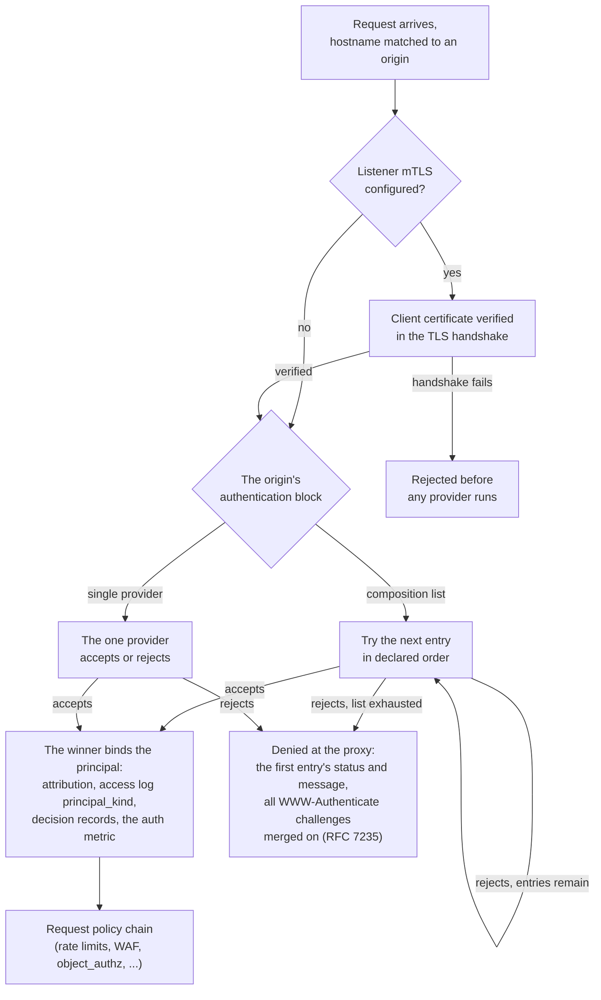
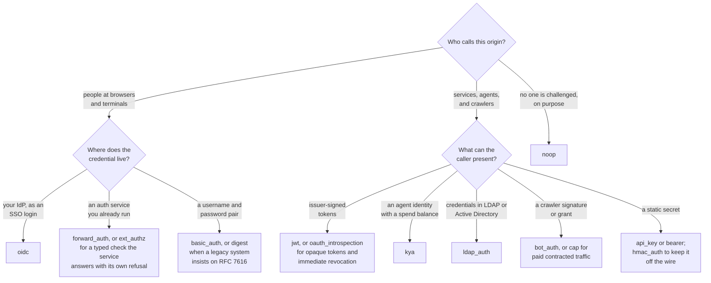
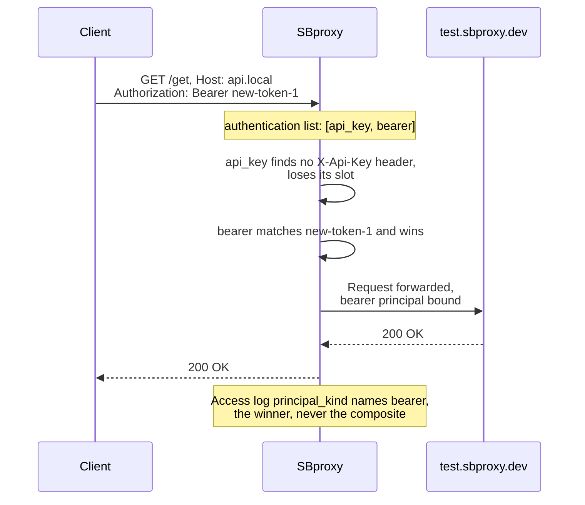

# Authentication

*Last modified: 2026-08-27*

Every origin decides who may call it with an `authentication` block, a sibling of `action` in `sb.yml` (`auth` is an accepted alias). SBproxy ships fifteen built-in providers, from a static API key to a full OpenID Connect login. This page is the chooser: which provider fits which caller, how to accept more than one on the same origin, and what the rest of the gateway does with the identity a provider establishes. The field-by-field reference for all fifteen lives in [configuration.md](configuration.md#authentication).

Two related things are deliberately absent from the tables below. mTLS client certificates are verified during the TLS handshake, before any auth provider runs, so they are configured on the listener rather than per origin; see [what rides alongside](#what-rides-alongside-authentication). And a `type:` value that names none of the fifteen falls through to the auth plugin registry, so a linked plugin crate can add a type such as `saml` without patching the proxy ([configuration.md](configuration.md#authentication)).

The whole decision path, socket to policy chain. Stages the pipeline runs between these boxes (CORS preflight, bot and agent identity resolution, and the rest) are in [architecture.md](architecture.md#3-request-pipeline):



## Which provider

### People at browsers and terminals

| Provider | What it proves | Reach for it when | Example |
|---|---|---|---|
| [`basic_auth`](configuration.md#basic_auth) | The caller knows a username and password pair. | A simple internal service or admin panel needs a lock on it. | [auth-basic](../examples/auth-basic/) |
| [`digest`](configuration.md#digest) | The caller knows a password, proven by an RFC 7616 hash exchange that keeps the password off the wire. | A legacy system insists on digest auth. SHA-256 is the default; MD5 stays available but you have to ask for it. | [auth-digest](../examples/auth-digest/) |
| [`oidc`](auth-oidc.md) | The caller completed a login at your IdP and holds a sealed session cookie. | You want SSO in front of an app that has none, the oauth2-proxy and Cloudflare Access use case. | [oidc](../examples/oidc/) |
| [`forward_auth`](configuration.md#forward_auth) | An external HTTP service you run answered the success status for a per-request subrequest. | Auth logic already lives in its own service and the gateway should defer to it. | [auth-forward](../examples/auth-forward/) |
| [`ext_authz`](configuration.md#ext_authz) | An authorization service you run answered a typed JSON check with `allowed: true`. | The decision is authorization rather than authentication: an entitlement lookup, a per-tenant quota, a policy engine the gateway does not host. Speaks Envoy's `ext_authz` shape. | [auth-ext-authz](../examples/auth-ext-authz/) |

### Services, agents, and crawlers

| Provider | What it proves | Reach for it when | Example |
|---|---|---|---|
| [`api_key`](configuration.md#api_key) | Possession of a static key, sent in a header or an opt-in query parameter. | The plainest machine-to-machine handshake is enough. | [auth-api-key](../examples/auth-api-key/) |
| [`bearer`](configuration.md#bearer) | Possession of a static token, optionally bound to a DPoP proof-of-possession key so a stolen token alone is not enough. | Token-based service auth without an issuer in the loop. | [auth-bearer](../examples/auth-bearer/), [auth-bearer-dpop](../examples/auth-bearer-dpop/) |
| [`jwt`](configuration.md#jwt) | A token signed by an issuer you trust, with issuer, audience, algorithm, and claim checks. Accepts JWE-encrypted tokens (decrypt, then verify) and can require DPoP or mTLS-bound `cnf` claims. | Callers hold OAuth2/OIDC-issued tokens and the gateway should verify them locally. | [auth-jwt](../examples/auth-jwt/) |
| [`oauth_introspection`](configuration.md#oauth_introspection) | The authorization server that issued the token says it is still active, right now (RFC 7662). | Tokens are opaque rather than JWTs, or a revocation has to take effect immediately instead of at the token's expiry. | [auth-oauth-introspection](../examples/auth-oauth-introspection/) |
| [`hmac_auth`](configuration.md#hmac_auth) | The caller holds a shared secret and signed this exact request (RFC 9421, `hmac-sha256`), so a captured request replays nowhere else. | Webhook senders and API clients that should never put a reusable credential on the wire. | [auth-hmac](../examples/auth-hmac/) |
| [`ldap_auth`](configuration.md#ldap_auth) | The directory accepted a bind with the presented credentials. | Service accounts, and people, whose credentials live in LDAP or Active Directory and should stop working the moment the directory says so. | [auth-ldap](../examples/auth-ldap/) |
| [`bot_auth`](web-bot-auth.md) | An RFC 9421 signature from a key in your agent directory, Ed25519 in the IETF Web Bot Auth pattern. | You admit known AI crawlers by signature and reject anything merely claiming to be one. | [web-bot-auth](../examples/web-bot-auth/) |
| [`cap`](cap.md) | A capability token from a trusted issuer, carrying its own path and rate grants. | Paid or contracted crawler traffic proves its grant per request. | [auth-cap](../examples/auth-cap/) |
| [`kya`](configuration.md#kya) | An issuer-signed agent identity: who the agent is, who operates it, what class it claims, and how much it can spend. | You admit AI agents by identity, and want to refuse one whose spend balance is exhausted before the request reaches an upstream that bills. | [auth-kya](../examples/auth-kya/) |

### Scaffolding

| Provider | What it proves | Reach for it when | Example |
|---|---|---|---|
| [`noop`](configuration.md#authentication) | Nothing. Every request passes. | You want the config to say out loud that an origin is deliberately unauthenticated. | One line of config; no example needed. |

The same split, as a triage. The tables above carry the detail:



## Accepting more than one provider

`authentication` also takes a list of providers. The list is an OR: entries run in declared order and the first one that accepts the request wins.

- **Order matters.** Every request walks the list from the top, so put the provider most callers use first.
- **The winner binds the request.** Audit events, decision records, and the auth metric name the provider that authenticated, and principal attribution comes from the winning entry's own credential metadata. Nothing merges across entries.
- **Rejection is collective, challenges are merged.** When every provider rejects, the response carries the first provider's status and message, with each provider's `WWW-Authenticate` challenge merged onto it (RFC 7235 allows several challenges on one response). A client that failed everywhere sees every scheme the origin accepts.
- **A failing provider loses only its own slot.** Whatever the reason, the next entry still runs.

Four shapes are refused when the config compiles, each for a stated reason. A one-entry list: write a single provider as a plain mapping. `noop` in a list: it would admit every request and make the other entries decorative. `forward_auth` in a list: it runs as a separate subrequest and works only as an origin's sole provider. `oidc` in a list: it needs the login-callback endpoint that only a sole `oidc` block wires up.

### The migration shape

The list exists mostly for credential cutovers. Keep the credential your callers hold today in the first slot, add the one you are moving them to underneath, and there is no flag day: both work on the same origin until the old one stops winning. This is [examples/auth-composition/](../examples/auth-composition/), runnable as shipped:

<!-- sbproxy-config: examples/auth-composition/sb.yml -->
```yaml
proxy:
  http_bind_port: 8080

origins:
  "api.local":
    action:
      type: proxy
      url: https://test.sbproxy.dev

    # Providers run top to bottom; the first success wins and names
    # itself in the audit and decision records. Put the provider most
    # callers still use first.
    authentication:
      - type: api_key
        header_name: X-Api-Key
        api_keys:
          - legacy-key-1
      - type: bearer
        tokens:
          - new-token-1
```

For a cutover to issuer-signed tokens instead, the second entry becomes a `jwt` block with your `jwks_url` and `issuer`; [configuration.md](configuration.md#accepting-more-than-one-provider) shows exactly that pairing. Either way, progress is measurable: the access log's `principal_kind` column names the provider that won each request, so you can watch legacy traffic drain and delete the old entry when it reaches zero.

One round trip through that config, from a caller already moved to the new token:



## What rides alongside authentication

- **Principal attribution.** Each credential entry can carry `project`, `user`, `team`, `tags`, and free-form `metadata`; a match stamps them on the request principal, and they surface in the [access log](access-log.md)'s `principal_kind` and attribution columns, in metric labels, and in policy scripts as `principal.attrs.*`. See [per-credential metadata](configuration.md#per-credential-metadata).
- **Decision records.** Every auth allow and deny publishes an `auth` record on the decision-audit feed for SIEM consumers. The record carries the method, never the subject. See [decision-records.md](decision-records.md).
- **Trust tiers.** Verifier outcomes feed the four-value trust tier: a verified `bot_auth` signature or CAP token earns `strong`, a failed one drops the request to `suspicious`, and policies read the result as `request.trust_tier`. See [trust-tiers.md](trust-tiers.md).
- **mTLS at the listener.** `proxy.mtls` verifies client certificates in the TLS handshake, before any provider here runs, and passes the verified cert metadata upstream as `X-Client-Cert-*` headers. See [mTLS client authentication](configuration.md#mtls-client-authentication) and [mtls-client-auth](../examples/mtls-client-auth/).
- **DPoP binding.** `bearer` and `jwt` take `require_dpop` to demand an RFC 9449 proof on every request, and `jwt` additionally takes `require_mtls_bound` for RFC 8705 certificate-bound tokens. See [sender-constrained Bearer](configuration.md#sender-constrained-bearer-rfc-9449). For the proofs SBproxy itself mints on upstream calls, see [outbound-dpop.md](outbound-dpop.md).

## A misspelled key is a config error, not a missing control

Every one of the fourteen configurable providers refuses a key it does not recognize, at `serve`, `validate`, and hot reload alike. The error names the key you wrote and lists the ones the provider takes:

```
unknown field `require_dp0p`, expected `tokens` or `require_dpop`
```

The reason this is worth its own section: the keys most worth misspelling are the ones that turn a control on. `require_dpop`, `require_mtls_bound`, `require_agent_binding`, `tls_verify`, `nonce_policy`, `clock_skew_seconds`, `failure_mode_allow`, `required_scopes`, `min_kyab_balance`. Each of them defaults to the permissive value, so until this landed a typo in one of them produced a config that compiled, booted, and served with that control off while the file said it was on. `require_dp0p: true` on a bearer block, with a zero for the `o`, ran with DPoP proof-of-possession disabled and nothing anywhere said so.

Two surfaces stay permissive, deliberately:

- `noop` has no configuration, so there is nothing to check and a stray key on a `noop` block is still accepted.
- Individual credential entries inside `api_keys:`, `tokens:`, `users:`, and `hmac_auth`'s `keys:` accept unknown keys, because each entry folds the free-form attribution metadata (`project`, `team`, `tags`, and anything under `metadata`) into the same mapping as the secret. An unknown key there is indistinguishable from an intended one.

If you are upgrading and a config that used to boot now refuses, the key it names is one the proxy was already ignoring. Fix the spelling or delete the line; either way the running behavior is what you had before. See [config-stability.md](config-stability.md#unknown-keys-inside-an-authentication-block).

## Honest notes

**Five providers make a network call while the request waits.** `ldap_auth` binds against the directory on every request; bind results are deliberately not cached, so a password the directory revokes stops working immediately, and an unreachable directory answers `503` rather than admitting anyone. `forward_auth` sends one subrequest per request, and an unreachable auth service is likewise a `503`, never a pass. `ext_authz` posts one check document per request and answers `503` when the authorization service cannot be reached, unless you set `failure_mode_allow: true`, in which case the request proceeds without a decision and is counted as a fail-open. `oauth_introspection` asks the authorization server about a token it has not seen inside `cache_ttl`, and answers `503` when it cannot, per RFC 7662 section 2.3. `oidc` touches the IdP only during login, where the code exchange is a live POST to `token_endpoint`; requests carrying a session cookie authenticate locally until the session expires, so an IdP outage blocks new logins, not established sessions. Budget latency accordingly, and set the timeouts ([`http_client_timeouts`](configuration.md#http-client-timeouts), `ldap_auth.timeout_secs`) for your backends' real behavior. Everything else verifies against local state, with one caveat: providers configured with remote key material (`jwt` with a `jwks_url`, `cap`, `bot_auth` with a hosted directory, `kya`) fetch and cache those keys over the network, and `cap`, `bot_auth`, and `kya` refuse rather than admit when a fetch fails past the cache's stale-grace window.

**Secrets in auth config ride the central resolver.** API keys, tokens, HA1 hashes, HMAC secrets, and client secrets all accept the same reference forms as every other secret-bearing field: `${VAR}`, `env:`, `file:`, or a backend URI such as `vault://`. A reference nothing can resolve refuses to boot instead of becoming the credential. See [secrets.md](secrets.md).

## See also

- [configuration.md](configuration.md#authentication) - the field tables for all fifteen providers.
- [api-gateway.md](api-gateway.md#authentication-and-authorization) - where auth sits in the traditional reverse-proxy pillar.
- [key-management.md](key-management.md) - dynamic virtual keys minted and revoked at runtime. A request authenticated by a minted key skips the origin's configured provider; the two paths are alternatives, never a chain.
- [object-authz.md](object-authz.md) - fine-grained authorization after a caller is authenticated.
