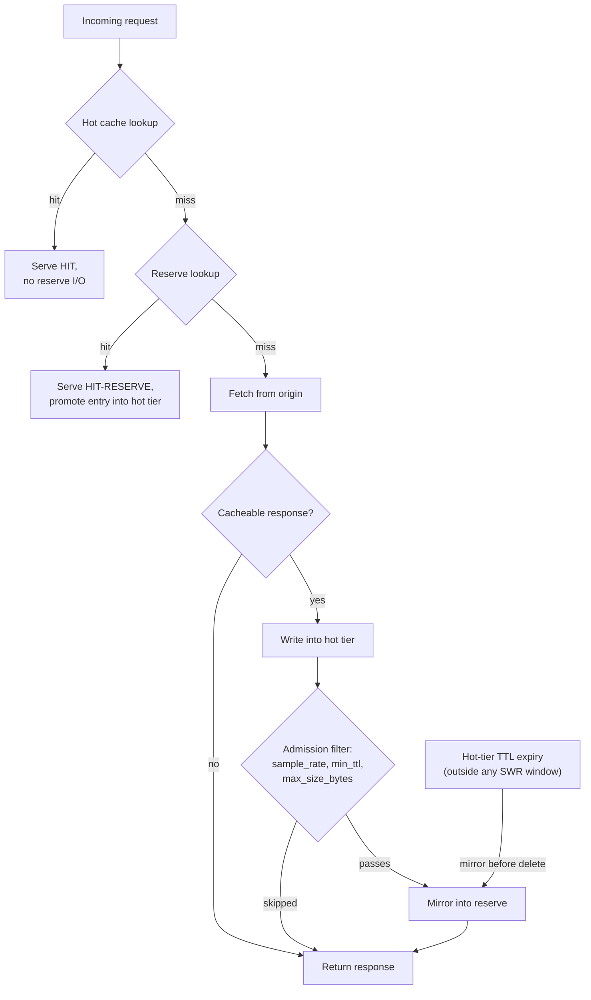

# Cache Reserve
*Last modified: 2026-08-27*

Cache Reserve is a long-tail cold tier sitting under the per-origin response cache. Items evicted from the hot cache are admitted into the reserve subject to a sample rate and size threshold; on a hot miss the proxy consults the reserve before falling through to origin and promotes the entry back into the hot tier on hit.

SBproxy ships four reserve backends out of the box: memory, filesystem, redis, and S3.

## Configuration

Cache Reserve is configured at the top level of `sb.yml`. It applies to every origin whose `response_cache.enabled` is true.

```yaml
proxy:
  http_bind_port: 8080
  cache_reserve:
    enabled: true
    backend:
      type: filesystem
      path: /var/lib/sbproxy/reserve
    sample_rate: 0.1     # mirror 10% of hot-cache writes
    min_ttl: 3600        # only items with TTL >= 1 hour are admitted
    max_size_bytes: 1048576  # skip entries above 1 MiB

origins:
  "api.example.com":
    action: { type: proxy, url: "https://upstream.example.com" }
    response_cache:
      enabled: true
      ttl: 7200
      cacheable_status: [200]
```

### Backends

| `type` | Required fields | Notes |
|--------|-----------------|-------|
| `memory` | none | In-process map. For tests and ephemeral single-replica setups; nothing survives a restart. |
| `filesystem` | `path` | One body file plus a sidecar metadata JSON per key, fanned out by SHA-256 hash. Survives restarts. |
| `redis` | `redis_url`, optional `key_prefix` | Connection pooling via `ConnectionManager`. Entries self-evict on the server side via `PEXPIREAT`. |
| `s3` | `bucket`, `region`, `kms_key_id`, optional `prefix`, `replication_target_bucket`, `sse_kms_bucket_default` | A cold, cross-region-replicable tier. AWS KMS envelope encryption by default; see [S3 + KMS](#s3--kms) below. |

The pipeline ignores unknown backend types with a warning.

```yaml
proxy:
  cache_reserve:
    enabled: true
    backend:
      type: s3
      bucket: sbproxy-cache-reserve-prod
      region: us-west-2
      kms_key_id: alias/sbproxy-cache-reserve
      prefix: "reserve/"
```

#### S3 + KMS

Every `put` calls `KMS:GenerateDataKey` to mint a fresh 256-bit data key, seals the body locally with AES-256-GCM, and stores the KMS-wrapped data key alongside the ciphertext as S3 object metadata. `get` sends the wrapped key back through `KMS:Decrypt` and decrypts in-process. This envelope-encryption pattern keeps KMS request volume bounded to one call per object rather than one per byte, and lets the master key rotate without rewriting object bodies. Deployments that prefer S3's bucket-default SSE-KMS encryption instead can set `sse_kms_bucket_default: true`; in that mode the body uploads in plaintext and S3 encrypts at rest, and neither `put` nor `get` calls KMS.

AWS credentials resolve through the standard chain (environment, shared profile, EC2/ECS instance role, container credentials); nothing under `backend:` carries a secret. Cross-region replication is configured at the bucket level with an S3 replication rule and IAM role; `replication_target_bucket` is a diagnostics-only hint this backend does not act on.

`evict_expired` lists the bucket and issues one `HeadObject` per listed key to read its expiry. That does not scale to a large bucket: past 100,000 objects a log line suggests configuring an S3 lifecycle rule instead of relying on this sweep.

### Admission filter

| Field | Default | Behavior |
|-------|---------|-----------|
| `sample_rate` | `0.1` | Fraction of hot-cache writes mirrored into the reserve. Use a low rate when the reserve is on a paid object store. |
| `min_ttl` | `3600` | Skip entries whose TTL is below this (seconds). Items that won't outlive a typical hot eviction window aren't worth carrying. |
| `max_size_bytes` | `1048576` | Skip oversize objects. `0` disables the cap. |

The filter runs before any reserve I/O happens so a misconfigured admission window doesn't show up as a reserve write spike.

## Request flow



1. Hot cache lookup runs first.
2. On a hot miss, the proxy consults the reserve. A reserve hit replays the body to the client with `x-sbproxy-cache: HIT-RESERVE` and promotes the entry back into the hot tier so subsequent reads stay hot.
3. On a hot miss + reserve miss, the request goes to origin as normal.
4. On the response path, every cacheable upstream reply lands in the hot tier; the reserve admits a sampled subset that passes the TTL and size filters.
5. When a hot entry's TTL is exhausted (and it's outside any SWR window), the entry is mirrored to the reserve before being deleted from the hot tier so the long-tail content gets a second life.
6. `POST` / `PUT` / `PATCH` / `DELETE` invalidations evict the no-Vary canonical reserve key alongside the hot-tier prefix sweep. Vary-based variants in the reserve must wait for natural expiry; the trait surface is intentionally narrow so backends like S3 don't need to scan keys.

## Seeing the tiers

The reserve only shows itself once an entry has left the hot tier, which normally means waiting out an eviction window. [`examples/cache-reserve/`](../examples/cache-reserve/) shortens that to one request by setting `response_cache.max_size: 1`, so the next distinct path pushes the previous one out. The example's upstream counts the requests that actually reach it, so the cache header and the body agree or the demo is lying.

```bash
cd examples/cache-reserve
docker compose up -d --wait
```

First fetch of `/a`: both tiers empty, the request reaches the upstream, and `upstream_hits` reads 1.

```bash
curl -s -D - -H 'Host: cache.local' http://127.0.0.1:8080/a
```

```
HTTP/1.1 200 OK
Server: BaseHTTP/0.6 Python/3.14.4
Date: Sun, 02 Aug 2026 05:24:12 GMT
Content-Type: application/json
Content-Length: 108
X-Sb-Session-Id: 01KZ0EW1FFHFESCXYK4687AV05
traceparent: 00-85d311d8846e44a699871ae90933ab2e-c1e6dd2060f44c10-01
X-Request-Id: 019fc0ee05ee7290bcfd97ce6adcc171
Connection: keep-alive

{"path":"/a","upstream_hits":1,"note":"this number only moves when the request really reached the upstream"}
```

Second fetch: the hot tier answers, and the counter has not moved.

```bash
curl -s -D - -H 'Host: cache.local' http://127.0.0.1:8080/a
```

```
HTTP/1.1 200 OK
server: BaseHTTP/0.6 Python/3.14.4
Date: Sun, 02 Aug 2026 05:24:12 GMT
content-type: application/json
content-length: 108
x-sb-session-id: 01KZ0EW1FFHFESCXYK4687AV05
traceparent: 00-85d311d8846e44a699871ae90933ab2e-c1e6dd2060f44c10-01
x-request-id: 019fc0ee05ee7290bcfd97ce6adcc171
x-sbproxy-cache: HIT
Connection: keep-alive

{"path":"/a","upstream_hits":1,"note":"this number only moves when the request really reached the upstream"}
```

Now fetch `/b`, which fills the one-entry hot tier and pushes `/a` out of it, then fetch `/a` again. It comes back from the reserve, and the upstream still has not been asked twice:

```bash
curl -s -o /dev/null -H 'Host: cache.local' http://127.0.0.1:8080/b
curl -s -D - -H 'Host: cache.local' http://127.0.0.1:8080/a
```

```
HTTP/1.1 200 OK
server: BaseHTTP/0.6 Python/3.14.4
Date: Sun, 02 Aug 2026 05:24:12 GMT
content-type: application/json
content-length: 108
x-sb-session-id: 01KZ0EW1FFHFESCXYK4687AV05
traceparent: 00-85d311d8846e44a699871ae90933ab2e-c1e6dd2060f44c10-01
x-request-id: 019fc0ee05ee7290bcfd97ce6adcc171
x-sbproxy-cache: HIT-RESERVE
Connection: keep-alive

{"path":"/a","upstream_hits":1,"note":"this number only moves when the request really reached the upstream"}
```

The reserve hit promotes the entry back into the hot tier on the way out, so the read after it is a plain `HIT` rather than another reserve round trip:

```bash
curl -s -D - -H 'Host: cache.local' http://127.0.0.1:8080/a
```

```
HTTP/1.1 200 OK
server: BaseHTTP/0.6 Python/3.14.4
Date: Sun, 02 Aug 2026 05:24:12 GMT
content-type: application/json
content-length: 108
x-sb-session-id: 01KZ0EW1FFHFESCXYK4687AV05
traceparent: 00-85d311d8846e44a699871ae90933ab2e-c1e6dd2060f44c10-01
x-request-id: 019fc0ee05ee7290bcfd97ce6adcc171
x-sbproxy-cache: HIT
Connection: keep-alive

{"path":"/a","upstream_hits":1,"note":"this number only moves when the request really reached the upstream"}
```

`docker compose down -v` tears it down. `max_size: 1` is a demo device, not a recommendation; leave it at the default of 10000 and let the reserve catch what falls out on its own.

## Backend trait

The integration point for cold-tier backends is the async [`CacheReserveBackend`](../crates/sbproxy-cache/src/reserve/mod.rs) trait.

```rust,no_run
use async_trait::async_trait;
use bytes::Bytes;
use std::time::SystemTime;
use sbproxy_cache::{CacheReserveBackend, ReserveMetadata};

pub struct MyBackend { /* ... */ }

#[async_trait]
impl CacheReserveBackend for MyBackend {
    async fn put(&self, key: &str, value: Bytes, metadata: ReserveMetadata) -> anyhow::Result<()> {
        // ...
        Ok(())
    }
    async fn get(&self, key: &str) -> anyhow::Result<Option<(Bytes, ReserveMetadata)>> {
        // ...
        Ok(None)
    }
    async fn delete(&self, key: &str) -> anyhow::Result<()> {
        // ...
        Ok(())
    }
    async fn evict_expired(&self, before: SystemTime) -> anyhow::Result<u64> {
        // ...
        Ok(0)
    }
}
```

The trait is small on purpose. Admission control, sampling, and metric emission live above the backend so a custom backend only has to answer "store this", "fetch this", and "drop this". Implementations should be `Send + Sync` so a single instance backs every origin in a multi-tenant proxy.

`ReserveMetadata` carries the response shape needed to replay an entry verbatim:

```rust,no_run
pub struct ReserveMetadata {
    pub created_at: SystemTime,
    pub expires_at: SystemTime,
    pub content_type: Option<String>,
    // Ordered response headers needed to replay and promote the entry
    // (including ETag and Last-Modified). `serde(default)` so metadata
    // written before this field existed still decodes.
    pub headers: Vec<(String, String)>,
    pub vary_fingerprint: Option<String>,
    pub size: u64,
    pub status: u16,
}
```

Backends should treat metadata as opaque once written: every field is round-tripped exactly through `get`.

## Metrics

The reserve emits four Prometheus counters via the standard `sbproxy_*` registry:

| Metric | Description |
|--------|-------------|
| `sbproxy_cache_reserve_hits_total` | Reserve hits served after a hot-cache miss. |
| `sbproxy_cache_reserve_misses_total` | Hot + reserve both empty. |
| `sbproxy_cache_reserve_writes_total` | Entries written into the reserve. |
| `sbproxy_cache_reserve_evictions_total` | Explicit reserve deletions (invalidate-on-mutation). |

Each counter is labeled by `origin`. Watch the hits / (hits + misses) ratio to size the reserve appropriately and the writes counter to confirm the admission filter is actually limiting reserve I/O.

Two more report the tier's health rather than its traffic:

| Metric | Type | Labels | Description |
|--------|------|--------|-------------|
| `sbproxy_cache_reserve_degraded` | gauge | `backend` | `1` while the reserve is degraded, `0` while it is healthy. This is the alerting signal: a reserve that is failing every operation still serves every request, so nothing else goes red. |
| `sbproxy_cache_reserve_health_transitions_total` | counter | `backend`, `to` | One tick per healthy-to-degraded or degraded-to-healthy edge, not one per operation. A high rate with the gauge near zero is a reserve flapping. |

Each transition also publishes a `cache.reserve.health` decision-audit record (see [events.md](events.md)), so the change reaches a SIEM without a Prometheus scrape.

## When the reserve helps

- **Long-tail content.** Pages that get one hit per hour drop out of an LRU primary quickly. The reserve keeps them around so the second hit still serves from cache instead of paying the origin round trip.
- **Cold-start churn.** When the primary is evicted on restart, the reserve carries enough warm entries that the cache hit ratio recovers in seconds rather than minutes.
- **Large payloads with high origin egress cost.** Object-store costs are usually dominated by per-request operations, not per-byte storage; a reserve trades a small storage bill for the egress fees you would otherwise pay every time the origin re-renders the same page.

## Failure semantics

- A failed reserve `put` is logged at `warn` level and does not fail the request. The hot tier already accepted the entry.
- A failed reserve `get` falls through to origin. The hot tier's value, when present, is returned before the reserve is consulted, so primary hits are unaffected by reserve outages.
- A failed reserve construction (e.g. an invalid Redis URL, or an S3 backend missing `bucket`/`region`/`kms_key_id`) is logged at warn and degrades to "no reserve" rather than failing the whole config load. Plain hot-cache behavior resumes.

None of those fails a request, which is the point and also the problem: an operator has no per-request signal that the reserve stopped working. `GET /admin/cache` carries a `reserve` object with the current state, when it entered that state, when it last recovered, the operation that set it, and a bounded reason code and error string. See [admin-api-reference.md](admin-api-reference.md#get-admincache). The "Cache Reserve Backend State" tile in [`dashboards/grafana/sbproxy-mesh-storage.json`](../dashboards/grafana/sbproxy-mesh-storage.json) points there for the reason.

## Tuning

| Workload | `sample_rate` | `min_ttl` | `max_size_bytes` |
|----------|---------------|-----------|------------------|
| HTML pages, JSON API responses | `0.25` | `3600` | `1048576` |
| Image / asset edge cache | `0.1` | `86400` | `10485760` |
| AI completion bodies | `0.05` | `600` | `524288` |

Lower sample rates are appropriate for backends with per-request operation costs (S3, Redis Cluster); a filesystem reserve can afford `sample_rate: 1.0` because writes are local.

## Library composer

The `crates/sbproxy-cache/src/reserve/composer.rs` module also exposes a synchronous `ReserveCacheStore` that wraps two `CacheStore` implementations into a hot/cold pair. It remains the in-process building block when both tiers are cheap (memory + filesystem) and a code-level integration is preferred over the YAML config block. See the doc comment on `ReserveCacheStore` for usage.

## See also

- [`examples/cache-reserve/`](../examples/cache-reserve/) - the runnable three-state walkthrough above.
- [configuration.md](configuration.md#response-cache) - response cache schema.
- `crates/sbproxy-cache/src/reserve/mod.rs` - backend trait + implementations.
