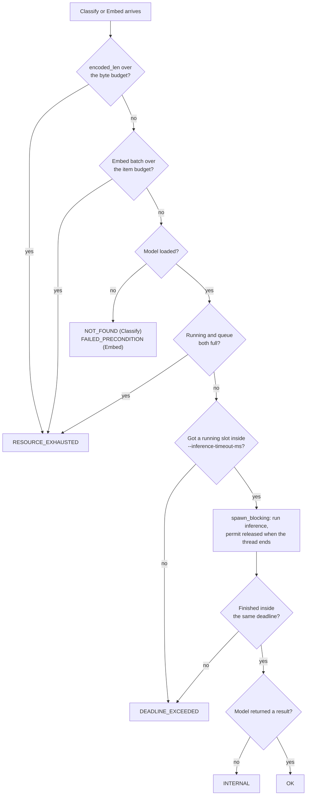

# Classifier Sidecar

*Last modified: 2026-08-22*

SBproxy heavily invests in out-of-process AI safety via the `sbproxy-classifier-sidecar`, `sbproxy-classifier`, and `sbproxy-classifier-client` crates. These components allow you to run remote or local Machine Learning safety classifiers (e.g., prompt injection detection, PII detection, toxicity) outside of the main proxy process using gRPC, plus (for `sbproxy-classifier`) TCP + MessagePack.

Two sidecar binaries exist, both built from this OSS tree, and a caller reaches either through the same `sbproxy-classifier-client`:

- **`sbproxy-classifier-sidecar`** - minimal: `InferenceService` only (`Classify`, `Embed`, `Compress`, backed by ONNX), with hardened per-RPC admission control (request-byte budgets, running/queued semaphores, a bounded deadline). Sections 1-5 below cover it.
- **`sbproxy-classifier`** - rich: the same ONNX-backed `InferenceService` contract with bounded admission and deadlines, plus multi-tenant heuristic classification, quality scoring, intent/content-type detection, and bounded per-token streaming safety checks. Section 6 covers it, including the optional-degrade architecture every caller of either sidecar should use.

Running the primary classifier in a sidecar isolates its process: if that model or ONNX engine crashes, it does not take down the main proxy serving traffic. A `prompt_injection_v2` sidecar policy also loads a small verified local ONNX fallback so loss of that isolated primary cannot silently bypass classification.

## 1. The `InferenceService` Contract

SBproxy communicates with classifier sidecars via a protobuf contract named `InferenceService`, defined in `crates/sbproxy-classifier-proto/proto/classifier.proto`. Any gRPC service that implements this contract can be used as a classifier backend.

The contract defines five RPCs: `Classify`, `Embed`, and `Compress` on the hot request path, plus `ModelInfo` and `Version` as capability probes. The proxy submits one text string at a time to `Classify` (usually a canonicalized prompt or assistant response) and gets back an array of scored labels, highest score first. `sbproxy-classifier-client` exposes `Version` (sidecar build and the model ids it can serve) and `ModelInfo` (per-model description) as public calls a custom integration can use to check a sidecar before relying on it; the in-tree policy and compression levers dial `Classify`, `Embed`, and `Compress` directly and do not call either probe today.

The sidecar that ships with SBproxy (`sbproxy-classifier-sidecar`) implements this contract and wraps the pure-Rust `tract` ONNX runtime. It can load `bert`-style classification models (such as a fine-tuned `deberta-v3-base` prompt-injection classifier) to evaluate traffic in real time.

## 2. Running the Sidecar

You can run the `sbproxy-classifier-sidecar` natively or inside a container. The sidecar listens on a TCP port (`--listen`, default `127.0.0.1:9440`) or a Unix Domain Socket (`--listen-uds`); the two are mutually exclusive.

### TCP listener

Point the policy's `detector_config.endpoint` at this address; that field only accepts an `http://` URL, so this is the transport the standalone `prompt_injection_v2` sidecar detector actually connects over:

```bash
cargo run -p sbproxy-classifier-sidecar -- \
  --listen 127.0.0.1:9440 \
  --model prompt-injection=/opt/models/deberta-injection.onnx:/opt/models/tokenizer.json
```

`--model` takes one `id=<model.onnx>:<tokenizer.json>` entry and is repeatable for more than one loaded classifier.

### Unix Domain Socket

`--listen-uds <path>` is the transport SBproxy's own supervised child-process wiring (`sbproxy-classifier-client`'s `Supervisor`) uses for a co-located sidecar it spawns itself. It removes the loopback TCP round trip for that pattern:

```bash
cargo run -p sbproxy-classifier-sidecar -- \
  --listen-uds /run/sbproxy/classifier.sock \
  --model prompt-injection=/opt/models/deberta-injection.onnx:/opt/models/tokenizer.json
```

## 3. Request Limits and Load Shedding

The sidecar accepts caller-supplied text and hands it to a synchronous,
CPU-bound model on Tokio's blocking pool. Every RPC that does that is
bounded, and every bound has a finite default, so a sidecar started with
no limit flags at all is still bounded.

### What the defaults are

| Flag | Applies to | Default | Ceiling |
|---|---|---|---|
| `--inference-max-request-bytes` | `Classify`, `Embed` | `1048576` (1 MiB) | `16777216` |
| `--inference-max-items` | `Embed` batch size | `64` | `4096` |
| `--inference-max-concurrent` | `Classify`, and separately `Embed` | this host's available parallelism, held between `4` and `64` | `64` |
| `--inference-max-queued` | `Classify`, and separately `Embed` | eight per running slot | `1024` |
| `--inference-timeout-ms` | `Classify`, `Embed`, `Compress` | `30000` | `600000` |
| `--token-max-request-bytes` | `Compress` | `1048576` (1 MiB) | `16777216` |
| `--token-max-concurrent` | `Compress` | `2` | `64` |
| `--token-max-queued` | `Compress` | `8` | `1024` |

`Classify`, `Embed`, and `Compress` each hold their own running and queue
semaphores, so a burst of one RPC cannot consume the slots another needs.
`Compress` keeps the tighter concurrency default because a token-pruning
pass over a long document costs far more than one classification.

The two concurrency defaults print in `--help` as the numbers this host
resolved them to. They are derived rather than written down because a
classification is CPU-bound work: one forward pass holds one thread until
it returns, so how many a box can genuinely run at once is its core count,
and any literal is wrong on every box but the one it was chosen on. Being
wrong low is the expensive direction. A sidecar that sheds below what the
hardware can serve does not show up only as latency an operator can watch;
the detector gives up after its configured timeout and routes the request
through the policy's mandatory verified local ONNX fallback.

Queue depth follows the running set for the same reason in reverse. What
matters about a queue slot is how long its occupant waits, and a request
`n` deep behind a full running set starts after roughly
`n / max_concurrent` service times, so a flat count is a different wait on
every machine and the small machine draws the long one. Eight slots per
running slot holds the wait steady instead. At the floor that is four
running and thirty-two queued, so no host gets a shallower queue than a
flat default would have handed it.

### Setting the limits on a supervised sidecar

When the proxy spawns the sidecar itself (the `Supervisor` in
`sbproxy_classifier_client`, described in
[prompt-injection-v2.md](prompt-injection-v2.md#child-supervisor-auto-spawn)),
the operator never types the child's command line. `SupervisorConfig`
carries the five inference limits as optional overrides, and the supervisor
appends the matching flag for each one it is given:

```rust,ignore
Supervisor::spawn(SupervisorConfig {
    binary: PathBuf::from("/opt/sbproxy/sbproxy-classifier-sidecar"),
    uds_path: uds_path.clone(),
    models: vec!["prompt-injection=/models/model.onnx:/models/tokenizer.json".into()],
    default_model: Some("prompt-injection".into()),
    inference_max_concurrent: Some(24),
    inference_max_queued: Some(96),
    ..SupervisorConfig::default()
});
```

Leave a field `None` and the child applies its own default, which for
concurrency and queue depth means deriving it from the host it lands on.
That is the right answer in almost every case: the supervisor has no better
view of that machine than the child does. The `--token-*` limits have no
passthrough because the supervisor emits no `--token-model` either, so a
supervised child never serves `Compress`.

The gRPC transport decoder is separate and shared: it admits
`max(4 MiB, the largest configured per-RPC budget)`. Each handler then
applies its own exact budget to `encoded_len` before the model is
resolved and before any text reaches a tokenizer.

### What a refused request gets back



Two of those deserve a note.

**The deadline frees the caller, not the thread.** Blocking work cannot
be cancelled, so when `--inference-timeout-ms` fires the caller gets
`DEADLINE_EXCEEDED` while the wedged model keeps its running slot until
it returns. That is deliberate: handing the slot back while the thread
is still burning a core would let a stuck model oversubscribe the box.
A sidecar that keeps returning `DEADLINE_EXCEEDED` and then
`RESOURCE_EXHAUSTED` is telling you the model is stuck, not that it is
merely busy.

The clock starts when the request arrives, so the deadline covers the
wait for a running slot as well as the inference itself. Bounding only
the inference would leave the half that actually grows under load
unbounded. It is not, and is not meant to be, the deadline your caller
observes: callers set their own and theirs are far shorter, and a caller
that gives up drops the gRPC stream, which cancels the handler wherever
it is parked. The 30 s default is the backstop for the caller that sets
no deadline at all, which is why it sits above the slowest inference the
sidecar will accept (a `Compress` across `--token-max-windows` windows)
rather than anywhere near the detector's 250 ms.

**A panic inside inference does not take the sidecar down.** The Tokio
runtime contains it and the RPC returns `INTERNAL` with a fixed message
(`classify inference ended without a result`). The panic payload is
derived from the caller's own text, so it goes to the sidecar's stderr
through the panic hook and never onto the wire. The running slot is
released as the task unwinds, so one panicking request does not leak
capacity.

### Watching for shedding

Every refusal increments a per-reason counter for the life of the
process: `request_bytes`, `batch_items`, `queue_full`,
`admission_unavailable`, `deadline_exceeded`, and `task_failed`. The
first refusal of each reason logs a `warn` carrying `rpc`, `reason`, and
the running `total`, and every hundredth after that logs again. The
sampling is on purpose: a refusal storm is exactly the load these bounds
exist to shed, and a line per refusal would turn it into a log flood.
The counts stay exact regardless of what is logged.

The minimal sidecar has no `/metrics` endpoint of its own yet, so those
counters are process-local today. On the proxy side, a refused call is a
failed primary call: `prompt_injection_v2` classifies the prompt with its
mandatory verified local ONNX fallback, the same as when the sidecar is
down.

## 4. Configuring the Proxy

Once your sidecar is running, select it as the detector on a `prompt_injection_v2` policy. `detector_config.endpoint` must be an `http://` URL:

```yaml
policies:
  - type: prompt_injection_v2
    threshold: 0.8
    action: block
    detector: sidecar
    detector_config:
      endpoint: http://127.0.0.1:9440
      model: prompt-injection
      injection_label: INJECTION
      timeout_ms: 250
      fallback:
        model_path: /var/lib/sbproxy/models/injection/model.onnx
        tokenizer_path: /var/lib/sbproxy/models/injection/tokenizer.json
        model_sha256: 0123456789abcdef0123456789abcdef0123456789abcdef0123456789abcdef
        tokenizer_sha256: abcdef0123456789abcdef0123456789abcdef0123456789abcdef0123456789
        labels: ["SAFE", "INJECTION"]
        injection_label: INJECTION
```

`model` selects the sidecar classifier by the id used on `--model` above (`prompt-injection` in the example). `fallback` is required and is verified and loaded at config construction, before traffic can be served. It handles transport, timeout, RPC, admission, and response-validation failures from the primary. See [local-inference.md](local-inference.md#enable-first-class-onnx-prompt-injection) for the full local artifact field reference.

See [`examples/prompt-injection-sidecar/`](../examples/prompt-injection-sidecar/) for a complete working config, including both a `tag` and a `block` origin against the same sidecar.

## 5. Building a Custom Sidecar

Because the proxy uses a standard gRPC contract, you can build a custom sidecar in any language (Python, Go, Node.js) to run your own proprietary ML models.

To do this, you simply need to implement the `InferenceService` protobuf (located in `crates/sbproxy-classifier-proto/proto/classifier.proto`) and expose the `Classify` endpoint. A `prompt_injection_v2` detector only ever calls `Classify`, so that RPC is enough to back it. Implement `Embed` and `Compress` as well if your sidecar backs the semantic cache or token pruning; those levers call the matching RPC directly. `ModelInfo` and `Version` are part of the same contract for a caller that wants to probe a sidecar's loaded models before dispatch, but nothing in this tree calls either one today.

When SBproxy encounters an AI request with a sidecar-backed guardrail, it automatically:
1. Buffers and canonicalizes the request (e.g. assembling all messages into a unified prompt).
2. Connects to your sidecar via the `sbproxy-classifier-client` (which handles lazy connection and, for the supervised co-located pattern, UDS dialing).
3. Invokes `Classify` with the text payload.
4. On any sidecar failure, classifies the same text with the configured verified local ONNX fallback.
5. If the local fallback also fails, preserves both closed failure stages. `block` returns a generic `503`; `tag` or `log` continues as explicitly degraded. The failure is never cached or reported as clean.
6. Otherwise, compares the resulting score against `threshold` and either allows the request or applies the policy's action.

See [guardrails.md](guardrails.md) and [prompt-injection-v2.md](prompt-injection-v2.md) for more details on wiring guardrails into your AI pipelines.

## 6. The Rich Sidecar (`sbproxy-classifier`) and the Optional-Degrade Architecture

`sbproxy-classifier` (port to OSS, WOR-2665) is the superset sidecar the `InferenceService` proto comment refers to: same `Classify` / `Embed` / `ModelInfo` / `Version` contract as the minimal sidecar (so `prompt_injection_v2`'s `detector: sidecar` config, unchanged, works against either binary), plus additional capability the minimal sidecar does not carry.

### What it adds

| Capability | Transport | Notes |
|---|---|---|
| Multi-tenant heuristic classification | TCP + MessagePack, port 9400 | Per-tenant regex-pattern label sets, registered at runtime via the `register` command (no config file, no hostname pattern matching); `delete` and `list` manage the registry. |
| Quality scoring | gRPC `ClassifierService.Quality`, and TCP `quality_score` | Heuristic AI-response quality score: refusal-phrase detection, length, repetition, formatting, casing. Sub-100us, no model. |
| Text normalization / PII redaction | TCP, applied to `classify` text before scoring | Unicode NFKC plus a regex substitution pipeline per tenant; an operator registers `email` / `phone` / `credit_card` rules (or its own) with a `<REDACTED>`-style replacement in `normalization.rules`. |
| Intent / content-type detection | TCP `intent_detect` / `content_type_detect` | Coarse heuristic categories (coding / vision / analysis / summarization / general; image / audio / video / text). |
| Per-token streaming safety | gRPC `ClassifierService.StreamSafety` (bidi), and TCP `streaming_safety` | Checks accumulated streamed tokens against a rule set as they arrive, so a caller can cut a response short instead of waiting for the full body. After the first match, `safe` remains false and carries the matching reason; `blocked` is true only on the message that first caused that transition. |

`Compress` (token-classification pruning) is not ported and returns `UNIMPLEMENTED` on this binary; run the minimal sidecar for that RPC. See the crate's module docs (`crates/sbproxy-classifier/src/*.rs`) for the full scope note, including what was deliberately not ported from the enterprise source (LLM-judge backends, license-leak detection, the Wave 5 agent-classifier ML path, Ed25519 model-signing, OpenTelemetry).

### Running it

```bash
cargo run -p sbproxy-classifier -- \
  --listen 127.0.0.1:9500 \
  --listen-tcp 127.0.0.1:9400 \
  --metrics-addr 127.0.0.1:9402 \
  --model prompt-injection=/models/model.onnx:/models/tokenizer.json
```

`--model` / `--embed-model` / `--default-model` / `--default-embed-model` mirror the minimal sidecar's flags of the same name. `/healthz`, `/readyz`, `/metrics` (Prometheus text), and `/tenants` are served on `--metrics-addr`.

### The optional-degrade architecture

Per the epic's rule that a sidecar a deployment must run and keep running is the same category of hard dependency as an external database: **nothing in this OSS workspace may require either classifier sidecar to be up.** The shipping `prompt_injection_v2` compiler enforces this directly: selecting `detector: sidecar` requires a pinned real-ONNX fallback and constructs one composite detector. `sbproxy-classifier-client`'s `FallbackClassifier` offers the same primary/fallback control flow to custom callers, but those callers remain responsible for supplying and bounding a real fallback implementation.

- No sidecar configured (the common OSS case: an operator who never deploys one) - every call goes straight to a caller-supplied in-process classifier. No connection is ever attempted.
- A sidecar is configured but unreachable, times out, or returns a malformed response - the call degrades to the in-process classifier for that request. Closed stage metrics and bounded health state record the outage; warnings are aggregated for 60 seconds by configured origin and reason.
- A sidecar is configured and healthy - its verdict is used, and the in-process classifier is not invoked at all.

For `prompt_injection_v2`, the fallback is not an arbitrary stub: config construction verifies the model and tokenizer paths, mandatory SHA-256 pins, size limits, and any configured detached signatures, then uses the same bounded admission/deadline mechanism as the explicit in-process detector. A local queue, deadline, worker, runtime, or inference failure remains unavailable and follows the policy's blocked/degraded action; it never becomes a clean verdict.

```rust,ignore
use sbproxy_classifier_client::{ClassifierClient, FallbackClassifier, InProcessClassifier, Verdict};

struct MyOnnxWrapper(sbproxy_classifiers::OnnxClassifier);

impl InProcessClassifier for MyOnnxWrapper {
    fn classify(&self, text: &str) -> Verdict {
        let out = self.0.classify(text).unwrap_or_default();
        Verdict { label: out.label, score: out.score as f64 }
    }
}

// `sidecar` is `None` when the operator never configured one; `Some(..)`
// when they did, whether or not it turns out to be reachable.
let classifier = FallbackClassifier::new(sidecar, "prompt-injection", MyOnnxWrapper(onnx));
let verdict = classifier.classify(&prompt).await;
```

Run `cargo run -p sbproxy-classifier-client --example fallback` for a live demonstration of all three cases.

### Shipping deployment contract

The two tiers coexist: local ONNX is the zero-extra-process baseline and verified fallback, while either sidecar is an optional isolated primary. Deploying a sidecar adds capability and isolation; losing it does not remove the configured prompt-injection classification policy.

### Metrics

`sbproxy-classifier` exposes seven Prometheus families on `--metrics-addr`'s `/metrics` (see `crates/sbproxy-classifier/src/metrics.rs`): `sbproxy_classifier_admission_queue{cmd}`, `sbproxy_classifier_admission_refusals_total{cmd,reason}`, `sbproxy_classifier_requests_total{transport,cmd}`, `sbproxy_classifier_errors_total{transport,cmd,reason}`, `sbproxy_classifier_tenants`, `sbproxy_classifier_quality_score{transport}`, and `sbproxy_classifier_safety_verdicts_total{verdict}`. All seven are in the central [metric stability catalog](metrics-stability.md), even though this standalone process serves them from its own scrape endpoint. `dashboards/grafana/sbproxy-classifier.json` graphs all seven; import it alongside the existing `sbproxy-model-host.json` and `sbproxy-mesh-storage.json` dashboards, which chart their own similarly out-of-process binaries the same way.

## See also

- [`examples/prompt-injection-sidecar/`](../examples/prompt-injection-sidecar/) - the `prompt_injection_v2` policy against an out-of-process classifier sidecar, `tag` and `block` variants.
- [`examples/classifier-rich-sidecar/`](../examples/classifier-rich-sidecar/) - the same policy pointed at the rich sidecar's gRPC port, plus a note on its additional TCP capabilities.
- [`crates/sbproxy-classifier-client/examples/fallback.rs`](../crates/sbproxy-classifier-client/examples/fallback.rs) - runnable demonstration of the optional-degrade architecture (`cargo run -p sbproxy-classifier-client --example fallback`).
- [`examples/sidecar/`](../examples/sidecar/) - a different sense of "sidecar": sbproxy itself deployed per-pod as a workload sidecar rather than a classifier process. Relevant if the classifier sidecar above is going to run alongside a proxy deployed this way.
