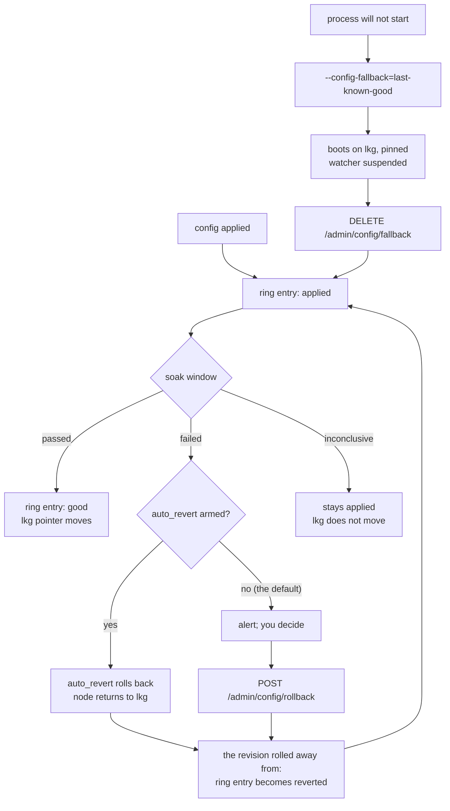

# Config rollback

*Last modified: 2026-08-28*

Your config broke production. This page answers "what do I type", in
order, for the four shapes that failure takes: the change is still
running and traffic is bad, the process is down and will not start, the
whole fleet took the change, and you want to know what changed before
you undo anything.

Everything here needs `proxy.config_history` turned on. It is off by
default, and a node that never recorded a revision has nothing to roll
back to. Turn it on before you need it:

```yaml
proxy:
  config_history:
    enabled: true
    dir: /var/lib/sbproxy/config-history
```

See [configuration.md](configuration.md#config_history) for every field.

## The shape of the thing



Three separate mechanisms, and they answer different questions.

| Mechanism | Answers | Needs a running process |
|---|---|---|
| The soak | "did this change actually work" | yes |
| `POST /admin/config/rollback` | "put the old document back now" | yes |
| `--config-fallback=last-known-good` | "the process will not start at all" | no |

## 1. Find out what changed

Before undoing anything, read what the node thinks it is running.

```console
$ sbproxy config history --admin-url http://127.0.0.1:9090 --password "$SB_ADMIN_PASSWORD"
lineage 4f2a0b18-6c11-4b7a-9a3e-2d1f6c8e0b44, last-known-good revision 41
REVISION	STATE	BLAST RADIUS	PROVENANCE	APPLIED AT	ACTOR	DIGEST
43	failed	reload	local_file	2026-08-28T09:12:04.311Z	admin	9f86d081884c7d659a2feaa0c55ad015a3bf4f1b2b0b822cd15d6c15b0f00a08
42	reverted	reload	local_file	2026-08-28T08:57:31.084Z	admin	b3a10c77a1e4f0d2b0b822cd15d6c15b0f00a08c55ad015a3bf4f1b2b0b822cd
41	good	hitless	git	2026-08-27T22:04:19.902Z	boot	2c26b46b68ffc68ff99b453c1d3041341340d0d0d0d0d0d0d0d0d0d0d0d0d0d0
```

The columns are tab separated, so `| column -t` renders it and `| cut -f1,2`
scripts it.

`state` is the whole story:

| State | Means |
|---|---|
| `applied` | recorded and serving, and no soak verdict has moved it. Usually the window is still open; an inconclusive verdict also closes without moving it, and `soak_revision` on the JSON route is what tells those two apart |
| `good` | it survived its soak. The `lkg` pointer names exactly one of these |
| `failed` | its soak closed on a failing verdict. Still serving unless something moved it |
| `reverted` | a rollback moved off it. Either an operator ran one or a failed soak with `soak.auto_revert` armed did, because both go through the same path and write the same mark |

**`failed` is the row to look for.** A revision that broke traffic and
lost its soak is `failed`, not `applied`, and that is the situation this
page is about. An `lkg` several revisions behind, with `failed` rows
above it, is changes landing and none of them surviving.

`state` is one field, so a revert writes `reverted` over a `failed` mark
rather than beside it. The soak's own answer is not lost: it stays on
`soak_verdict`, which is what the boot walk reads when it decides what
may boot. A `reverted` row is not evidence the soak passed.

`PROVENANCE` is where the *base* document came from, and this release
emits only `local_file` or `git`. It does not say what triggered the
apply; `ACTOR` does. Its values are `file_watcher`, `boot`,
`boot_fallback`, `config_authority`, `config_refresh_poller`,
`auto_revert`, `rollback` or `rollback:<operator>`, and `api` or the
authenticated operator's own id. The CLI prints `-` only when the field
is absent, which no apply path produces, so a `-` in this column means
you are reading a record this release did not write.

Then diff the two:

```console
$ sbproxy config diff 41 --admin-url http://127.0.0.1:9090 --password "$SB_ADMIN_PASSWORD"
config diff: the running configuration -> revision 41, largest blast radius reload
  ~ origins."api.example.com".action [reload] upstream url changed

Plan: 0 added, 1 changed, 0 removed. max-blast-radius: reload
```

This is a plan, not a unified diff: one line per changed path with the
blast radius that change carries, and a summary. It answers *what would
move and how disruptively*, which is the question before a rollback. It
does not print the old and new values; `sbproxy config show 41` prints
the stored document itself when you need them.

The stored document is pre-resolution bytes: exactly what was read off
disk before `${VAR}`, `vault://`, and `secret://` references resolved. A
diff never shows you a secret that a resolution step produced.

## 2. The change is running and traffic is bad

```console
$ sbproxy config rollback --to last-known-good \
    --admin-url http://127.0.0.1:9090 --password "$SB_ADMIN_PASSWORD"
config rollback: restored revision 41 (2c26b46b68ffc68ff99b453c1d3041341340d0d0d0d0d0d0d0d0d0d0d0d0d0d0), blast radius hitless
config rollback: revision 43 is marked reverted
config rollback: appended as revision 44; history is append-only, so this rollback is itself in the history
config rollback: the restored revision is soaking like any other candidate. POST /admin/config/confirm promotes it early; a failed soak leaves the last-known-good pointer where it is
config rollback: warning: this node's config file is unchanged: the next file-watcher event, SIGHUP, source: poll, or authority bundle re-applies whatever the source of truth still says. fix it before then
```

Read that warning. A rollback applies a *document*; it does not rewrite
your config file, your git repository, or your ConfigMap. Whatever put
the bad configuration there will put it back.

Three refusals you will meet, and what each one wants:

| Refusal | What it means | What to do |
|---|---|---|
| `no_last_known_good` | nothing has ever survived a soak | roll back to a numbered revision instead: `--to 41` |
| `restart_not_confirmed` | the two documents differ in something an arc-swap cannot undo (a listener port, an origin's action type) | name the target back: `--confirm 41`, and plan a restart |
| `stale_expected_current` | another operator moved the pointer while you were reading | re-read the history and try again |

A rollback is an ordinary candidate. It resolves, compiles, publishes
through the same reload transaction, and soaks. A stored document that no
longer constructs on this build is refused with the compile error, the
running configuration keeps serving, and the refused candidate is kept
under `rejected/`, where
[`GET /admin/config/rejected`](admin-api-reference.md#get-adminconfigrejected)
shows it with the stage that refused it.

## 3. The process is down and will not start

This is the case a running admin API cannot help with. The node reads its
own revision ring at boot instead.

```console
$ sbproxy --config /etc/sbproxy/sb.yml --config-fallback=last-known-good
WARN reading the config revision ring for a bootable configuration
WARN this node booted on a configuration restored from its revision ring, not on the
     config file it was pointed at. the file watcher, SIGHUP, and the source: refresh
     poller are suspended until an operator clears the pin with DELETE
     /admin/config/fallback. config-authority polling stays live, so a fleet-wide fix
     still reaches this node
```

Set it in the unit file rather than typing it once, so a restart under
your feet does the same thing:

```ini
[Service]
Environment=SB_CONFIG_FALLBACK=last-known-good
```

The node is now **pinned**. That is the part to understand before you
touch anything:

```console
$ curl -su "admin:$SB_ADMIN_PASSWORD" http://127.0.0.1:9090/admin/config/fallback | jq
{
  "active": true,
  "revision": 41,
  "digest": "2c26b46b68ffc68ff99b453c1d3041341340d0d0d0d0d0d0d0d0d0d0d0d0d0d0",
  "reason": "unknown action type: proxyy",
  "suspended": ["file_watcher", "sighup", "config_refresh_poller"]
}
```

While the pin is in place, editing the config file does nothing. That is
the point: the file is what broke the node, and a watcher that reapplied
it would restart the crash loop the fallback just rescued you from.
`sbproxy_config_fallback_active` reads 1 for as long as this lasts, and a
node quietly serving a configuration nobody wrote is worse than one that
is down.

Config-authority polling is deliberately still live. A fleet-wide fix
pushed from the control plane is how a fallback boot is supposed to end.

Fix the file, then clear the pin. Clearing it applies the file in the
same call, so you do not have to also touch it:

```console
$ curl -su "admin:$SB_ADMIN_PASSWORD" -X DELETE http://127.0.0.1:9090/admin/config/fallback | jq
{
  "cleared": true,
  "revision": 41,
  "digest": "2c26b46b68ffc68ff99b453c1d3041341340d0d0d0d0d0d0d0d0d0d0d0d0d0d0",
  "resumed": ["file_watcher", "sighup", "config_refresh_poller"],
  "reloaded": true,
  "reload_error": null
}
```

`"reloaded": false` with a `reload_error` means the file is still broken.
The pin is gone either way, and the node keeps serving what it was
serving. Fix it and `POST /admin/reload`.

If the ring cannot rescue the node either, the process exits `78`
(`EX_CONFIG` from `sysexits.h`) rather than the plain `1` every other
fatal boot failure uses, and the log names every revision it tried and
why each one did not boot. An init system can tell that case apart
without parsing a log line.

## 4. The whole fleet took the change

A node-side rollback fixes one node. If the change came from a config
authority, the authority is where to undo it, or the next poll puts it
straight back.

```console
$ sbproxy config authority status --admin-url http://127.0.0.1:9443 \
    --password "$SB_ADMIN_PASSWORD" --format json | jq '{current_revision, archived_revisions, applied_current_count, apply_failed_count}'
{
  "current_revision": 43,
  "archived_revisions": [39, 40, 41, 42, 43],
  "applied_current_count": 31,
  "apply_failed_count": 3
}
```

Then undo one step, or name a revision from further back:

```console
$ sbproxy config authority rollback --admin-url http://127.0.0.1:9443 --password "$SB_ADMIN_PASSWORD"
config authority rollback: republished revision 42's payload as revision 44, replacing revision 43
config authority rollback: the number moves forward because a subscriber refuses a revision that is not greater than the one it applied. Subscribers take it on their next poll.

$ sbproxy config authority rollback --to-revision 41 \
    --admin-url http://127.0.0.1:9443 --password "$SB_ADMIN_PASSWORD"
config authority rollback: republished revision 41's payload as revision 45, replacing revision 44
config authority rollback: the number moves forward because a subscriber refuses a revision that is not greater than the one it applied. Subscribers take it on their next poll.
```

`--to-revision` is a body field, not a query parameter. A
`?to_revision=41` on the URL is refused with `400` and
`invalid_to_revision` rather than quietly running the one-step rollback.

The number always moves forward. A subscriber's anti-replay cursor
refuses any revision that is not greater than the one it applied, so
re-serving revision 41 under its old number would reach only the nodes
that had not yet taken 43, which is a rollback that reaches nobody.

How far back you can go is `proxy.config_authority.publish.archive_keep`,
20 by default, and it counts revisions you can roll back *to*: the one
currently serving does not use up a slot. A revision the ring no longer
holds is refused by name, and the refusal lists what is available in
both the message and an `archived_revisions` array.

This is the **authority's** ring, distinct from `proxy.config_history` on
each node. The node's ring is what a node-side rollback and a fallback
boot read; this one is what the fleet rolls back through.

## What to alert on

| Signal | Means |
|---|---|
| `sbproxy_config_fallback_active == 1` | a node is serving a configuration nobody applied |
| `sbproxy_config_apply_total{outcome="reverted"}` moving | a node undid a change on its own, with `auto_revert` armed. This label is narrower than the ring state of the same name: the metric is keyed on the trigger, so an operator-run rollback counts as `applied` here while still writing `reverted` in the history |
| `sbproxy_config_soak_verdict_total{verdict="failed"}` moving | changes are landing and failing their windows |
| `sbproxy_config_lkg_revision` flat while revisions land | nothing is being promoted; the fallback target is going stale |
| `sbproxy_config_authority_rollback_total{result="refused"}` moving | a fleet rollback is being refused at the authority |
| `sbproxy_operator_config_delivery_total{state!="delivered"}` moving | under Kubernetes, config is not reaching a fleet's pods, and `state` says why |

The bundled Grafana dashboard draws all of these on
`dashboards/grafana/sbproxy-overview.json`.

These are signals worth alerting on, not shipped alert rules. Every
paging alert in `deploy/alerts/alerting-rules.yml` resolves through a
`runbook_id` in [operator-runbook.md](operator-runbook.md), and none of
these has one yet; wire them with your own severity and runbook mapping
rather than pointing a pager at a rule that does not exist.

## `auto_revert` and why it ships off

`proxy.config_history.soak.auto_revert` makes a node re-apply its last
known good on its own when a soak fails. It is the one key in that block
that defaults off.

A node that undoes an operator's change without being asked is surprising
in a way that costs trust, and it is only ever half a fix: the config
file, the git repository, or the ConfigMap that produced the bad document
still says what it said. Argo CD ships `selfHeal: false` for the same
reason.

Arm it only after running with the soak on long enough to calibrate
`min_requests` and `max_error_rate_delta` against your real traffic. And
know what it will not do: it arms only for a diff an arc-swap can undo. A
listener port change or an origin's action type change is left to boot
fallback and a manual rollback, and the node says so with a
`config_rollback` event carrying `outcome: "declined"` and a reason of
`not_arc_swappable`.

Under the Kubernetes operator, `auto_revert` is refused at validation on
the document the `SBProxyConfig` carries inline. The operator reapplies
the ConfigMap on every reconcile, so a node that reverts loses that race
and the two take turns. A `spec.config` that is a bare `source:` pointer
is not read through, so a document that arms it behind a pointer is not
caught there; the node still ships it off by default. See
[kubernetes.md](kubernetes.md#auto_revert-is-refused-under-operator-ownership).

## Try it

`examples/config-rollback/` is a runnable version of section 2: a good
config, a change that compiles cleanly and breaks traffic, a soak that
fails on it, and a node that holds its last known good. It needs nothing
but the binary and two terminals.

## Related

- [configuration.md](configuration.md#config_history) - every field in the block.
- [admin-api-reference.md](admin-api-reference.md#post-adminconfigrollback) - per-route schema.
- [config-authority-drills.md](config-authority-drills.md) - two-process drills for signed config distribution.
- [kubernetes.md](kubernetes.md#a-node-that-rescued-itself-is-not-drift) - what the operator does with a pinned node.
