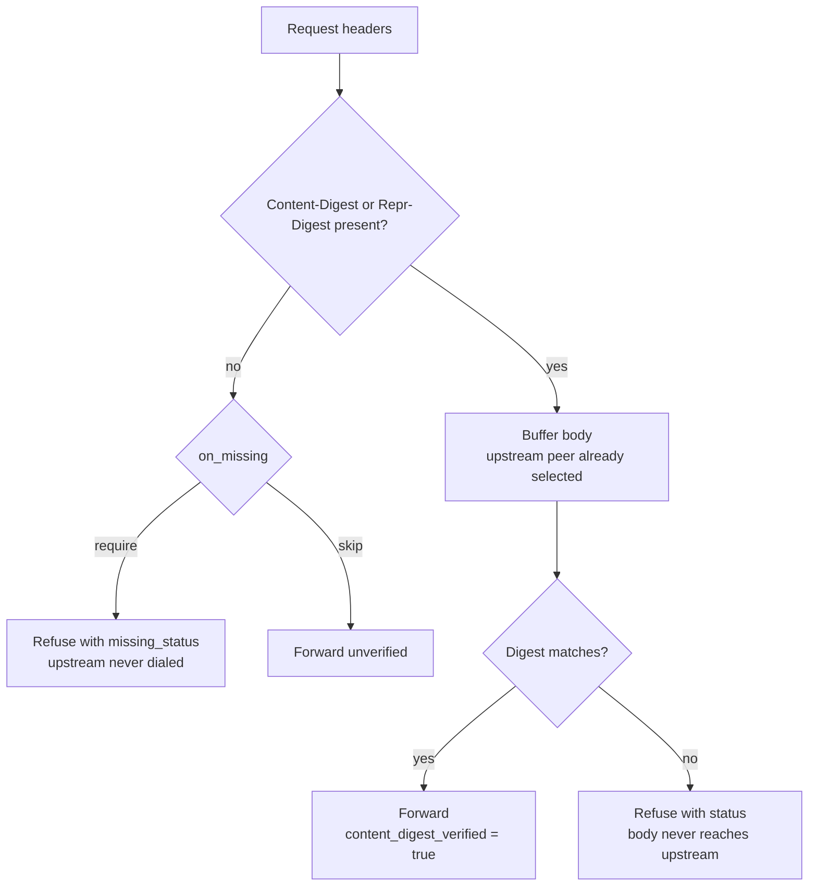

# content_digest policy
*Last modified: 2026-08-20*

The `content_digest` policy verifies an inbound request body against the digest the client advertises in the `Content-Digest:` header (RFC 9530). On mismatch, malformed header, missing header, or unsupported algorithm, the proxy rejects the request with the configured status. The intended audience is integrity-critical inboxes: webhook receivers, agent endpoints, payment callbacks, audit-ingest paths.

The policy honors `Content-Digest:` first and falls back to `Repr-Digest:` if `Content-Digest:` is absent. RFC 9530 §2 makes the two interchangeable for inbound traffic that does not decode `Content-Encoding`. SHA-256 and SHA-512 are supported; unknown algorithms fall through to the configured failure mode.

## When each decision runs

The policy makes two decisions and they become answerable at different points in the request, so the proxy settles them in different phases.

**The header is absent.** Nothing about that verdict depends on the body, so `on_missing: require` refuses in the header phase, before the proxy picks an upstream peer. The upstream is never dialed. This matters for more than latency: pointed at an upstream that is slow or unreachable, a refusal that waited for the connection would hand the client the upstream's failure instead of the policy's verdict, and would hold the connection slot for the whole dial.

**The header is present.** Whether it matches needs the body, so the pairing enforcer sets `ctx.validate_request_body = true` and verification runs in `request_body_filter` once the body is fully buffered. That phase is reached after the upstream connection is established. The body bytes never reach the upstream, but the dial has already happened, and that is inherent to deciding on the body rather than something the policy can avoid. Bypass the policy on routes that do not need the check.



## Config

```yaml
origins:
  "webhook.example.com":
    upstream: https://api.internal
    policies:
      - type: content_digest
        # Algorithms accepted in the header. Defaults to both active
        # entries in the RFC 9530 IANA registry. Narrow to [sha-256]
        # to refuse sha-512 for cost reasons.
        algorithms: [sha-256, sha-512]
        # What to do when the client did not send any digest header.
        # `require` (default): reject. `skip`: pass through unverified
        # (useful when the origin mixes integrity-required and
        # integrity-optional traffic on the same hostname).
        on_missing: require
        # HTTP status returned on mismatch, malformed header, or
        # unsupported algorithm.
        status: 400
        # HTTP status returned when the header is absent and
        # on_missing: require. Defaults to `status` when unset, so a
        # deployment can answer 400 on a mismatch and a different
        # status (422, for instance) on a missing header.
        missing_status: 400
        # Response body on rejection. Omitted: the proxy sends the
        # small JSON {error, detail} envelope shown below.
        error_body: null
        # Content-Type for the rejection body.
        error_content_type: application/json
        # Cap on body bytes buffered for verification; above this the
        # body filter rejects with 413 instead of buffering unboundedly.
        max_body_bytes: 10485760   # 10 MiB
```

## Failure modes

| Condition | Behavior |
|---|---|
| Header present, digest matches | Pass; sets `ctx.content_digest_verified = true` |
| Header present, digest mismatch | Reject with `status` after the body is buffered; the upstream is dialed but never sees the body |
| Header present, algorithm not in the configured `algorithms` set | Reject with `status` |
| Header present, parse error | Reject with `status` |
| Header absent, `on_missing: require` | Reject with `missing_status` (defaults to `status`), in the header phase, before the upstream is dialed |
| Header absent, `on_missing: skip` | Pass through unverified |

## Calling it

The runnable configuration is
[`examples/content-digest/`](../examples/content-digest/): the block above,
`on_missing: require` and `status: 400`, in front of a proxied webhook
origin. Start it:

```bash
make run CONFIG=examples/content-digest/sb.yml
```

The header value is RFC 9530 structured-field syntax: the algorithm name, `=`,
then the base64 digest wrapped in colons. Compute it over the exact bytes you
are going to send:

```bash
BODY='{"event":"order.created","id":"ord-42"}'
DIGEST=$(printf '%s' "$BODY" | openssl dgst -sha256 -binary | openssl base64)
# LpIbFdddPyiKq5wV0XUOTWdb9kASIU+Rr2nMdu0b0BY=

curl -sS -o /dev/null -w '%{http_code}\n' -X POST \
  -H 'Host: webhook.local' \
  -H "Content-Digest: sha-256=:${DIGEST}:" \
  -H 'Content-Type: application/json' \
  -d "$BODY" \
  http://127.0.0.1:8080/anything
# 200
```

A `200` here is the upstream's own response. The policy is invisible when it
passes, which is the point: a verified body is forwarded unchanged and the
sender sees whatever the origin would have said anyway.

Use `printf '%s'` rather than `echo` to compute the digest. `echo` appends a
newline, so the hash covers a different byte string than the one `curl -d`
sends, and the result is a mismatch that looks like a proxy bug.

Each failure path answers with the same `error` and a different `detail`, so
the reason is machine-readable without parsing prose. A body that does not
match its digest:

```bash
WRONG=$(printf '%s' 'some other body' | openssl dgst -sha256 -binary | openssl base64)
curl -sS -X POST -H 'Host: webhook.local' \
  -H "Content-Digest: sha-256=:${WRONG}:" \
  -H 'Content-Type: application/json' \
  -d "$BODY" http://127.0.0.1:8080/anything
```

```json
{"detail":"Content-Digest value does not match the request body","error":"content_digest verification failed"}
```

No digest header at all, under `on_missing: require`:

```json
{"detail":"Content-Digest header required but absent","error":"content_digest verification failed"}
```

And a header that is not valid structured-field syntax, which is a distinct
case from a mismatch:

```json
{"detail":"Content-Digest header is malformed per RFC 9530 structured-fields syntax","error":"content_digest verification failed"}
```

That last one is easy to trigger by accident and easy to misread. A value like
`sha-256=:wronghashbase64==:` never gets as far as being compared, because it
is not a well-formed digest; it reports malformed rather than mismatch. If you
are testing the mismatch path, use a real base64 digest of different content,
as above, or you will be exercising the parser instead.

Mismatch, malformed, and unsupported-algorithm all carry `status`, so
changing that one field moves those three failure paths together. The
missing-header path carries its own `missing_status`, which defaults to
`status` but can be set separately, so a config can answer `400` on a
mismatch and `422` on a missing header.

## Why the verified flag matters

`ctx.content_digest_verified = true` propagates the verification result to downstream phases. HTTP Message Signatures audit can attest that the body matches the signed digest component without re-hashing, and billing surfaces that quote by body size get an integrity guarantee for free. The flag is consumed inside the proxy; it does not leak to clients.

## Watching it

Every refusal increments `sbproxy_policy_triggers_total{policy_type="content_digest",action="deny"}`, whichever phase decided it, and logs on the `sbproxy::content_digest` target with a `reason` naming the outcome: `missing_required`, `mismatch`, `malformed`, `unsupported_algorithm`, or `body_over_cap`. Alert on the counter; use the reason to tell a misconfigured sender apart from a tampered body.

The policy audit event bus is narrower. It records the verdict of the policy chain, which runs in the header phase, so `sbproxy_policy_audit_events_total{policy_id="content_digest"}` reports `deny` for a missing-header refusal and `allow` for a request whose header was present, including one the body filter went on to refuse. Use the trigger counter, not the audit counter, to count digest failures.

## Out of scope

RFC 9530 §6.4 trailer-section digests are not supported because Pingora 0.8's `ProxyHttp` trait does not expose an `request_trailer_filter` hook. Clients that send the digest in the trailer section are treated as if the header is absent, so `on_missing: require` rejects them in the header phase (the safer default), and it rejects them before reading any trailer that might have carried the digest.

A header value that is not valid UTF-8 counts as absent for the same reason: it cannot be parsed as an RFC 9530 structured-fields dictionary, so both phases treat it as no header at all rather than as a malformed one.

## See also

* [features.md](./features.md) - tour with policy examples.
* [examples/content-digest/](../examples/content-digest/) - runnable webhook receiver fixture.
* [configuration.md](./configuration.md) - the full schema.
