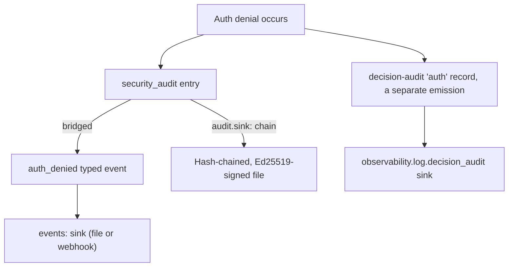
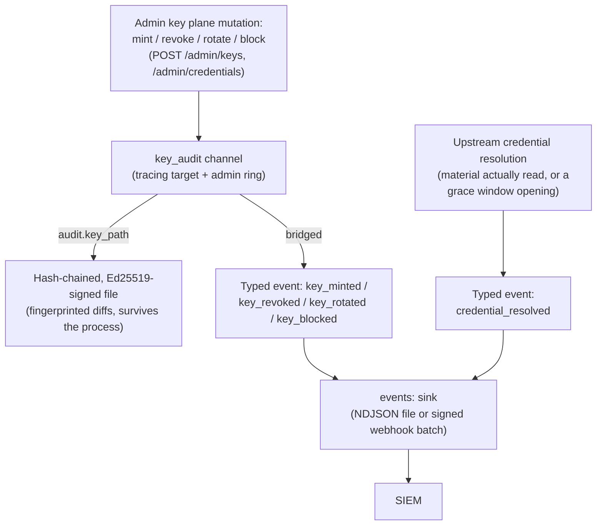

# SBproxy events

*Last modified: 2026-08-29*

SBproxy hands a SIEM three different things, and this page is the map of how they fit together: typed proxy events (the `events:` block, a closed set of twenty-three), decision-audit records (`observability.log.decision_audit`, twenty pipeline decisions normalized to OCSF), and four audit channels that write to their own tracing targets (`security_audit`, `config_audit`, `key_audit`, and the admin action ring). Two of those four, `security_audit` and `config_audit`, can additionally be hash-chained and Ed25519-signed for tamper evidence.

If you only read one section, read [How the four audit channels relate to the event stream](#how-the-four-audit-channels-relate-to-the-event-stream). It is the piece that is easy to miss: `events:` is a delivery mechanism, not a source of truth, and most of what it delivers is a typed copy of a record another channel already produced.

Most facts take one path only: `provider_selected` and the rest of the
typed events with no audit-channel counterpart publish straight to
`events:` and nowhere else. An auth denial is the illustrative exception,
because it is the one fact wired into all three mechanisms at once:



Treat this as a worked example, not a universal map: most typed events
(`request_completed`, `provider_selected`, `budget_exceeded`,
`guardrail_triggered`, `mcp_governance_decision`, and the rest) publish
directly with no audit-channel or decision-audit record behind them at
all.

## The typed proxy events

`ProxyEvent::event_type` is a closed enum. Variants serialize to snake_case JSON, and those are the names `events.types:` accepts.

| Name | When | Has an emitter |
|------|------|------|
| `request_started` | A new request entered the pipeline. | Yes |
| `request_completed` | The request finished without an error. | Yes |
| `request_error` | The request terminated with an error. | Yes |
| `auth_denied` | Authentication rejected the request. | Yes |
| `policy_denied` | A policy (rate limit, IP filter, WAF, request limit, AI data-posture routing) blocked the request, or an HTTP framing violation was refused. | Yes |
| `egress_refused` | An outbound dial (AI provider, MCP OAuth token exchange, model artifact fetch, telemetry sink, ...) was refused by egress authorization. | Yes |
| `provider_selected` | An AI request failed over to a different provider. | Yes, on the transition only |
| `budget_exceeded` | An AI spend or quota budget was exhausted and the request was blocked. | Yes, on the deny only |
| `guardrail_triggered` | An AI guardrail blocked a request or a response. | Yes, on the block only |
| `config_reloaded` | The proxy configuration changed, or a reload was refused. | Yes |
| `mcp_governance_decision` | An MCP interaction was decided: a `tools/call` allowed or refused by a governance gate, a pre-dispatch RBAC or quota refusal, a tool-contract change against its version lockfile, or a federated server's approval-status transition. | Yes |
| `key_minted` | A key or upstream credential record was created through the admin key plane. | Yes |
| `key_revoked` | A key or upstream credential was marked revoked, the terminal state. | Yes |
| `key_rotated` | A key's secret was rotated; the prior secret keeps working for the grace window. | Yes |
| `key_blocked` | A key or upstream credential was marked blocked. | Yes |
| `credential_resolved` | An upstream credential's material was actually resolved, or a rotation grace window started serving the last known-good value. Never once per request. | Yes |
| `credential_fallback` | An AI provider refused a provider entry's own key with a `401`/`403` and the request was retried against the same provider on the operator's `fallback_credential_id`, or that credential could not be resolved. | Yes |
| `ai_workflow_operation` | An authenticated governed workflow execution completed or was refused. | Yes |
| `ai_evaluation_operation` | An authenticated governed evaluation run completed or was refused. | Yes |
| `ai_prompt_rollout_selected` | An admin dry-run or real AI request selected a concrete weighted prompt version. | Yes |
| `agent_registration_decided` | An agent entered the owner-approval queue, or an operator approved, rejected, or revoked one. | Yes |
| `config_soak_verdict` | A config revision's soak window closed with a verdict: promoted to last known good, failed, or inconclusive because every signal abstained. | Yes |
| `config_rollback` | This node re-applied a stored config revision, or refused to: an operator through `POST /admin/config/rollback`, or the node itself through `soak.auto_revert` after a failed soak. | Yes |
| `cache_hit` | A response was served from the response cache. | No |
| `cache_miss` | The cache lookup found no usable entry. | No |

Twenty-three of the twenty-five publish today. The other two, `cache_hit` and `cache_miss`, are declared on purpose and will not be wired: both fire on every cacheable request, and putting an NDJSON line on a configured webhook per cache lookup is a cost nobody asked to pay. The forensic question either answers, "did this response come from cache," already has a home: the `cache.admit` and `cache.key` decision-audit events (below) and the access log's `cache_status` column. If you write `events.types: [cache_hit]`, the proxy still boots, because refusing a name here would also block pre-configuring a type a later release wires. It just tells you at startup that nothing will ever arrive.

### The boot warning, so a quiet sink is a fact, not a guess

An empty `events:` sink and a broken one look identical from the outside: neither delivers anything. So at boot, the proxy checks every name in `events.types:` (or, when `types:` is absent, every name that means "all twenty-three") against the emitters that actually exist, and warns once, by name, for anything that will never fire:

```
WARN events.types selects event types that nothing publishes yet; the configured sink will not
     see these until their emitters ship events=cache_hit,cache_miss
```

This is the same shape `observability.log.decision_audit` has used for a while, extended to this channel. Read [observability.md](observability.md) for that side; the short version is in the next section.

### Verdict-level, not per-request

Eight of the twenty wired events are worth being explicit about, because "wired" does not mean "fires on every request that touches the feature":

- **`provider_selected`** fires on a provider failover or advance, never on the provider chosen for an ordinary first attempt. The data carries `from_provider`, `to_provider`, and the reason (`http_503`, `transport`, `pre_header_timeout`, `content_policy`, `managed_cold_fallback`). A deployment with healthy providers and no failovers sees none of these, which is correct: routing choice by itself is not a security-relevant event, a transition off the configured plan is.
- **`budget_exceeded`** fires once per request that actually crosses a configured cap and gets blocked, at the same site that already builds the 402 response body. It does not fire for a request that stays under budget, and it does not fire on a soft-landing downgrade, only on a hard block. The data carries `scope` (the limit's scope label), `reason`, `max_tokens`, `max_cost_usd`, and `window_secs`.
- **`guardrail_triggered`** fires once per guardrail evaluation stage (input, RAG-augmented input, or output) that ends in a block, never per streamed chunk and never on an allow. The data carries `stage`, `guardrail` (which one blocked), `flagged_count` (how many others flagged without blocking), `spans`, and `spans_dropped`. The span fields are populated on a `pii` block: each span is an entity type plus a byte offset and length into the scanned text (positions, never the matched value), capped at 32 with `spans_dropped` counting anything past the cap; every other guardrail publishes them empty. See [observability.md](observability.md#decision-audit-records) for which text the offsets index on each stage.
- **`credential_resolved`** fires once per actual resolution of an upstream credential's material (an envelope opened, a vault reference dereferenced, or a plaintext record read), never on the per-request cache hit. The data carries `op`, `resource`, `id`, `outcome` (`resolved` or `stale_served`), and, on a fresh resolution only, `source` (`plaintext`, `envelope`, or `vault_ref`). A `stale_served` event is the one worth an alert rule: it means the secret backend was unreachable and the credential kept working from the last known-good value. It fires **once per outage, not once per request in the grace window**: the grace path deliberately does not refresh the cached value's timestamp (a refresh would make it look fresh and cancel the grace deadline), so every request for the length of the window retries and falls back, and only the transition into stale serving publishes. The next successful resolution arms the next one. If you want the per-request count, `sbproxy_credential_resolution_duration_seconds{cache="stale"}` has it as a rate, which is the shape an alert wants anyway. A resolution *refusal* publishes nothing here; the request that needed it is refused, and that refusal is carried by the request-side channels.
- **`credential_fallback`** fires once per AI provider-key fallback *decision*, not once per request that carries a fallback credential. The data carries `op`, `resource`, `id` (the credential named by `fallback_credential_id`), `provider` (the entry whose own key was refused), `status` (`401` or `403`), and `outcome`. `outcome: engaged` means the operator's credential resolved and the retry was queued; `outcome: unavailable` means it did not resolve and the provider's rejection was returned unchanged. The second one is the alertable event: it means your house credential is broken, and the only other evidence is a `401` that reads like the tenant's fault. Neither payload carries the entry's own key, the fallback credential's material, or a vault reference. A request whose credential came from the caller (`inbound_key_mode: native`) never falls back and so never publishes here.
- **`ai_workflow_operation`** records one terminal bounded workflow execution, not discovery or validation. Its data is exactly `origin_id`, `workflow_id`, `outcome`, `steps`, and `duration_ms`. Agent inputs and outputs, invocation endpoints, authentication tokens, and secret references are excluded.
- **`ai_evaluation_operation`** records one terminal bounded evaluation run, not dataset registration. Its data is exactly `origin_id`, `dataset`, `dataset_version`, `experiment_id`, `outcome`, `cases`, and `duration_ms`. Dataset entries, model or judge response content, scores, judge endpoints, credentials, and secret references are excluded.
- **`ai_prompt_rollout_selected`** records the concrete version selected by an admin dry-run or on a real AI request before provider dispatch. Its data is exactly `origin_id`, `prompt`, `version`, `outcome`, and `cohort_digest`. It never carries prompt content, request content, rollout salt, or the raw cohort key; the digest must be 64-character lowercase SHA-256 hex before the payload builder accepts it.

## Decision-audit: the other twenty

Most of the twenty-three typed proxy events map onto request lifecycle and infrastructure facts. The gateway's actual security decisions, "did the WAF block this," "did the AI guardrail block this," "did this MCP tool dispatch succeed," live on a separate, wider channel: `DecisionEvent`, configured under `proxy.observability.log.decision_audit` and documented in full in [observability.md](observability.md#decision-audit-records) and the generated [decision-records.md](decision-records.md).

The short version, because this page is where the two channels need to be told apart:

- **Twenty-one named decision points.** `auth`, `policy`, `rate_limit`, `waf`, `cache.key`, `cache.admit`, `cache.reserve.health`, `route.decide`, `ai.guardrail.input`, `ai.guardrail.output`, `ai.tool_call`, `ai.stream.event`, `ai.close`, `ai.failure`, `ai.admission`, `transform`, `action`, `log.custom_field`, `mcp.tool`, `payment.lifecycle`, `anomaly`.
- **Six coverage states**, because "wired or not" turned out to be the wrong question for at least four of these:
  - *Emitted*: publishes its own record. As of this sweep that is `auth`, `cache.key`, `cache.admit`, `cache.reserve.health`, `route.decide`, `ai.guardrail.input`, `ai.guardrail.output`, `ai.tool_call`, `ai.close`, `ai.failure`, `ai.admission`, `mcp.tool`, and `anomaly`. The MCP OAuth surface publishes on two of those rather than under a name of its own: an `auth` record for every in-process broker refusal (`/authorize`, `/token`, `/register`, `/device_authorization`, `/verify`, `/par`, `/revoke`, `/introspect`) and for the resource server's 401, with `auth_type` naming the endpoint (`mcp_oauth_token`, `mcp_oauth_resource_server`), and an `mcp.tool` record for a per-operation scope refusal, with `verdict = "insufficient_scope"` and the JSON-RPC method as the tool. Both surfaces also write `sbproxy_mcp_gateway_decisions_total` and one `mcp_gateway::decision` log line per decision; see [mcp-oauth-gateway.md](mcp-oauth-gateway.md).
  - *SupersededByPolicy*: `waf` and `rate_limit` compile to policy modules, so their decisions already publish as `policy` records carrying a `policy_id`. A second emitter under their own label would double-record one decision.
  - *ConfigDependent*: `policy` always reaches the bus, but arrives as the legacy `policy_verdict_event` shape until `policy_record_format: decision` moves it onto this feed.
  - *DurableElsewhere*: `payment.lifecycle` is recorded by the settlement store, which is non-lossy by design. This queue drops records under load (a sound trade for a security decision, the wrong one for money), so publishing the same event here would offer a second, weaker answer beside an authoritative one.
  - *NeverPublishes*: `ai.stream.event` fires once per streamed chunk. Enabling it is refused at config load, not warned about, because there is no configuration under which it will ever emit.
  - *Unwired*: `transform`, `action`, and `log.custom_field` accept configuration and publish nothing, on purpose for now. Transforms rewrite response bodies with no deny/allow semantics to record. Most of what `action` would report already has its own event under a more specific label. `log.custom_field` is operator-authored telemetry that belongs in the access log it was configured into, not a second copy on this bus.

`anomaly` carries two decisions on one label, because they are two halves of one mechanism: a behavioral verdict is what moves the reputation score, and the score is what an admission threshold reads. A detection record carries `anomaly_kind` and a severity, and its outcome is an allow, because a verdict is an observation and the request proceeds. An admission record carries `reputation_bucket` and an action, and its outcome is a deny. Both carry `identity_source`, and neither carries the raw score, the fingerprint, or the client address. See [anomaly-detection.md](anomaly-detection.md).

`ai.close` and `ai.failure` are new to the *Emitted* set as of this sweep. `ai.failure` fires at the one funnel every provider-response failure classification already ran through, carrying `selected_provider` and a closed failure kind (`rate_limited`, `content_filter`, `upstream_5xx`, `provider_error`) under `unmapped`. `ai.close` fires once a streamed response finishes, carrying the terminal `finish_reason`, and is the intentional counterweight to `ai.stream.event`'s refusal: without it, the per-chunk feed that gets refused on volume grounds would have no summary anywhere in SIEM-land either.

`ai.guardrail.output` publishes for every non-streaming AI response the gateway materializes: the live provider response, a cascade tier's response, an idempotency replay, and a semantic-cache hit, each once, for the allow as well as for the block. Until this sweep the live provider response and the cascade arm published nothing, so a route with output guardrails and `decision_audit` on recorded decisions only for the replays. Two things it still does not see, both because there is no body to evaluate: a streamed response, and a live multipart response, which runs its own external-adapter path. A provider-native output verdict, such as an inline Bedrock `Converse` guardrail intervention, publishes here under the guardrail name `bedrock_guardrail`.

`ai.close` carries one honest caveat the others do not. It publishes only for a request whose AI extension chain (JS, Lua, or WASM bundle hooks on `ai.*` events) is non-empty for that generation, because that is the only place the stream's finish-reason aggregate exists today. A deployment with zero AI extension bundles configured never builds that chain, so `ai.close` publishes nothing there even with `decision_audit` enabled and the boot warning silent (the warning cannot see a gap that is config-shaped rather than code-shaped). If you rely on `ai.close`, confirm you have at least one AI extension hook registered, linked or bundle. This is a narrower guarantee than the funnel-per-event shape the other *Emitted* events carry, and it is called out here rather than left for you to discover against a quiet feed.

`ai.admission` is the pre-provider refusal record. It fires at the inbound native-format shim, where `/v1/messages` and `/v1/responses` bodies become the canonical chat shape, on the three arms that refuse a request there (the Anthropic Messages translate, the Responses stored-prompt bridge, and the Responses translate), at the two refusal arms of the shared stored-prompt resolver (a template that fails to render, and a reference on a native surface that no prompt layer holds), and on a request naming a [model group](ai-gateway.md#model-groups) with no eligible member (`model_group_forbidden` when the credential's provider policy excludes every member, `model_group_no_member` when every member's provider is switched off), which is decided at the same point and for the same reason: the request names something this origin cannot dispatch, and no provider has been chosen. `outcome` is always `deny`. Under `unmapped` it carries `surface` (the inbound surface, drawn from the same vocabulary `sbproxy_ai_surface_requests_total` uses: `messages` or `responses` for a shim refusal, and whatever surface the request arrived on for a resolver refusal, which includes `chat_completions`) and `verdict`, a bounded reason code. The refusal's own message is deliberately absent: several of these codes interpolate caller bytes into the message (a serde parse error, an unrecognized role name) and `unmapped` ships unscrubbed.

The refusal this exists for is `tools_mcp_unsupported`. A `/v1/responses` body carrying `tools: [{"type": "mcp", "server_url": "..."}]` is asking the model provider to reach an MCP server directly, behind the gateway's MCP governance. The gateway refuses it, but before this event the only trace was a bare 400, which reads in a SIEM exactly like a typo'd JSON body:

```yaml
proxy:
  observability:
    log:
      decision_audit:
        enabled: true
        events:
          ai.admission: true
origins:
  "ai.example.com":
    action:
      type: ai_proxy
      providers:
        - name: openai
          api_key: "${OPENAI_API_KEY}"
```

```bash
curl -sS -X POST https://ai.example.com/v1/responses \
  -H 'content-type: application/json' \
  -d '{"model":"gpt-4o","input":"hi","tools":[{"type":"mcp","server_url":"https://internal/?token=REDACTED"}]}'
```

The client gets a 400 naming the governed alternative, and one record reaches the audit feed:

```json
{
  "class_uid": 6003,
  "activity_id": 2,
  "metadata": { "correlation_uid": "01J8..." },
  "unmapped": { "surface": "responses", "verdict": "tools_mcp_unsupported" }
}
```

`sbproxy_ai_admission_decisions_total{surface="responses",reason="tools_mcp_unsupported",outcome="deny"}` increments in the same breath, so the alert can live on the metric and the forensics on the record. Neither carries `server_url`.

What `ai.admission` does not cover: those six arms are the whole of it. A request refused later by the model allow/block gate, a virtual-key policy, a guardrail, a budget, a rate limiter, or a CEL or Rego policy is that plane's decision and publishes under that plane's own event. The canonical `/v1/chat/completions` path has no inbound shim, so the refusals that reach this event from there are a stored-prompt render failure and an unservable model group. A request that is only *lossy* (an unsupported non-`mcp` tool block, a `prompt` value the translator cannot represent) is admitted, not refused, and leaves its trace on `sbproxy_ai_translation_dropped_total` instead.

`mcp.tool` here covers a successful (or gateway-declined) tool dispatch attribution. It does not cover an MCP request refused before dispatch on RBAC, quota, or a lethal-trifecta session check (tool access, private data, and external communication in one session): those denials are carried by the MCP governance evidence channel, a separate, purpose-built record for exactly that shape of decision, rather than by any channel this page documents.

## Event shape

```rust,no_run
pub struct ProxyEvent {
    pub event_type: EventType,
    pub hostname: String,
    pub tenant_id: String,         // empty when no tenant resolved
    pub timestamp: u64,            // Unix epoch milliseconds
    pub data: serde_json::Value,   // event-specific payload
}
```

`data` is built by whichever channel produced the underlying fact, not invented at the bridge:

- `auth_denied` and `policy_denied` carry the `security_audit` entry: timestamp, event type, reason, hostname, client IP, request id, method, status code, tenant id, credential provider and mode, and the public key id.
- `config_reloaded` carries the `config_audit` entry: source, origin delta, actor, the before and after revisions, and, on a rejection, a `rejection_reason`. That field is bounded to 512 bytes and has the local config path scrubbed out of it, but it is not scrubbed of config content in general: a compile or validation error routinely echoes the fragment it is complaining about (an invalid expression, an unrecognized key, a hostname), because naming the fragment is how the error explains itself. Point a rejection-reason sink at somewhere you already trust with your config's shape.
- `egress_refused` carries the four fields `record_egress_refused` already puts on its Prometheus series: `purpose`, `reason`, `tenant`, `origin`, all closed, bounded labels.
- `provider_selected`, `budget_exceeded`, and `guardrail_triggered` carry the fields listed under [Verdict-level, not per-request](#verdict-level-not-per-request) above.
- `request_completed` and `request_error` carry the full request envelope: latency, status, provider, model, token counts, and cost.
- `mcp_governance_decision` carries OTel GenAI/MCP semantic-convention attribute names (Development stability) plus sbproxy's own `sbproxy.*` namespace: the tool name and call id, the MCP method and protocol version, the decision verdict and redacted reason, a salted hash of the tool arguments (never the arguments themselves, unless `mcp_audit.capture_arguments` opts a deployment into the redacted, size-bounded verbatim arguments too), the tenant id, and a sequence number a SIEM can use to detect a dropped record (gapless per tenant per emitting process, with `sbproxy.evidence.instance` naming that process). It is emitted from the one funnel every MCP tool dispatch passes through, plus the RBAC and per-tool-quota denial sites that refuse a call before that funnel, the tool-version lockfile gate's per-refresh contract check, and the federated-server approval-status transition check. A tool-definition-change or registry-status-change record instead carries digest prefixes or the old/new status labels; see [mcp-security.md](mcp-security.md#no-usable-record-of-what-happened) for the full field mapping.
- `key_minted`, `key_revoked`, `key_rotated`, and `key_blocked` carry an explicit allowlist rather than the `key_audit` entry they bridge from: `op`, `resource` (`key` or `credential`), the public `id`, `outcome` (`applied`; the entry only emits after the store accepted the mutation), the acting `actor` when the admin session resolved one, and, when the mutation was a status change, the closed-vocabulary `prior_status` / `new_status` labels. The `key_audit` channel's redacted before/after diff does not pass through: the chain fingerprints those values and the typed event drops them, so the SIEM copy carries strictly less than the local record. `credential_resolved` carries the same `op`/`resource`/`id`/`outcome` vocabulary plus `source`; see [Key lifecycle events: the dual record](#key-lifecycle-events-the-dual-record). `credential_fallback` carries that same vocabulary plus `provider` and `status`, so one SIEM rule set covers the whole credential family.

- `agent_registration_decided` carries four fields and no more: the `agent_id`, the `decision` (`submitted`, `approve`, `reject`, or `revoke`), the resulting `state`, and `decided_by` when an admin session resolved an operator. The minted client secret, the registration access token, both Argon2id hashes, and the submitter's contact URL are all held by the same call site and none of them can reach this payload: the type has no field for one. The durable record of the decision is the registry's own store, which is what to read when the feed is lossy; see [agent-registry.md](agent-registry.md).

- `config_soak_verdict` carries the revision, its digest, the verdict, and one row per signal with its outcome and explanation. Never a config value.
- `config_rollback` carries the `trigger` (`manual` or `auto_revert`), the `actor` when an operator asked, the `target` as it was named, and the `outcome`, which is one of three. `applied` carries both revisions, the appended revision (`null` when the restored document was already running and the ring deduplicated it), the blast radius, and whether the secrets fingerprint moved. `rejected` carries the stable `reason` label and deliberately **not** the refusal's free text, which can quote the offending YAML. `declined` is the automatic path deciding not to revert: it carries `reason` (`not_arc_swappable`, `radius_unknown`, `would_loop`, `already_on_last_known_good`, `no_last_known_good`, or `history_unavailable`), the `failed_revision` and `failed_digest` of the revision whose soak failed, and the `blast_radius` when that was the reason. All three publish. A refused rollback during an incident is exactly as interesting as an accepted one, and a `declined` fleet is the case the `reverted` counter cannot distinguish from nothing having failed at all.

None of those payloads carries a credential, and that is a property under test rather than a convention. `api_key_id` is the public id or a derived `sk_<hex>` fingerprint and never the secret. `prompt_fingerprint` is salted and non-reversible. No field holds prompt text, a header value, or a resolved config value. A field added to any of these records fails a test until somebody has confirmed it can be sent to a third party, because with a webhook sink these bytes leave your network.

## The `events:` block

```yaml
events:
  sink: webhook                             # none | file | webhook
  url: https://siem.example.com/sbproxy     # webhook only
  signing_secret: secret://local/siem-hmac  # webhook only, optional
  types:                                    # empty or absent means all
    - policy_denied
    - auth_denied
    - egress_refused
  queue_capacity: 4096
```

| Key | Meaning |
|-----|---------|
| `sink` | `none` (the default) publishes nothing and costs one atomic load per event site. `file` appends NDJSON. `webhook` POSTs batches. |
| `path` | Output file for `sink: file`. Parent directories are created at boot. Required by `file`, refused otherwise. |
| `url` | Destination for `sink: webhook`. Must be `http://` or `https://`. Required by `webhook`, refused otherwise. |
| `signing_secret` | HMAC-SHA256 key for the webhook signature. Takes a secret reference and nothing else; see below. |
| `types` | Which event types to deliver. Empty or absent means all twenty-three. An unrecognized name is refused at compile time with the accepted list; a recognized but unwired name compiles and warns at boot (see above). |
| `fail_closed` | Event type names that must never be silently dropped. Empty by default. Same accepted set and refusal as `types`. See [Fail-closed delivery](#fail-closed-delivery). |
| `queue_capacity` | Depth of the hand-off queue. Defaults to 4096. Zero is refused. |

A worked example for an AI-heavy deployment that wants the abuse and cost signals in one place:

```yaml
events:
  sink: file
  path: /var/log/sbproxy/ai-events.ndjson
  types:
    - budget_exceeded
    - guardrail_triggered
    - provider_selected
    - egress_refused
    - ai_workflow_operation
    - ai_evaluation_operation
    - ai_prompt_rollout_selected
```

The file form is a line per event, the same shape a `jq` filter or a Vector source expects:

```yaml
events:
  sink: file
  path: /var/log/sbproxy/events.ndjson
  types:
    - policy_denied
```

The file is created owner-only (`0600`), as is a directory SBproxy
creates for it (`0700`). A decision event names the tenant, the rule,
and what was refused, so the feed is a map of the policy surface. A
file already on disk at a wider mode is tightened when the sink opens
it, which means a collector running as another user loses access after
an upgrade unless it runs as the proxy user or reads a fifo instead.

### The webhook contract

One POST per batch, up to 256 events, `Content-Type: application/json`:

```json
{
  "source": "sbproxy",
  "version": "1.11.0",
  "events": [
    {
      "event_type": "policy_denied",
      "hostname": "api.example.com",
      "tenant_id": "acme",
      "timestamp": 1754697600000,
      "data": { "reason": "rate limit exceeded", "status_code": 429 }
    }
  ]
}
```

Headers: `X-Sbproxy-Event: proxy_events`, `X-Sbproxy-Event-Count`, `X-Sbproxy-Timestamp` (Unix seconds), and, when `signing_secret` is set, `X-Sbproxy-Signature: v1=<hex>`. The signature is HMAC-SHA256 over `<timestamp>.<body>`, the same construction the alert webhook uses, so a receiver that already verifies one verifies the other with the same code.

Any 2xx is success. Anything else drops the batch and counts it.

### Where the batch is allowed to go

The batch carries an HMAC signature over its own body, so where that body ends up is a security question rather than a routing one. Four rules decide it, and all four are enforced on every batch rather than once at boot.

The URL goes through the SSRF guard at boot and again before every batch, so a collector hostname that starts resolving to a private address stops being posted to rather than becoming an internal probe. `egress.usage_sinks.allow_private: true` plus a host in `egress.usage_sinks.hosts` exempts those hostnames from the private-address block. Without that pair the guard still runs and still refuses private and loopback collectors.

The events webhook destination and that SSRF allowlist are taken at boot. `install_event_egress` is set-once, so a SIGHUP cannot newly permit a private collector that was refused at start. Restart the process after adding `allow_private` or a listed host if the current `events.url` was refused on the previous start.

**The dial is pinned to the addresses that check resolved.** The guard resolves the hostname and the connection goes to that answer, not to a second lookup the HTTP client runs for itself. A DNS answer that changes between the check and the connect cannot steer the batch anywhere, because the connect was never going to ask again.

**Redirects are not followed; they are re-authorized.** A `3xx` `Location` is put back through the same allowlist, private-address, and DNS-pinning checks the original URL passed, and only then dialed, on that hop's own pinned addresses. At most ten hops, after which the chain is refused as `too_many_redirects`, and all of them inside the one five-second budget the first request started on: a collector that stalls on every hop cannot hold the delivery thread for ten times the timeout.

**A cross-origin redirect is refused outright.** Any hop that changes scheme, host, or port leaves the collector you configured. Because the batch body is the thing the signature covers, there is no version of that hop that is safe: forwarding the body hands your signed events to a host you never named, and stripping it would send an empty POST your collector cannot use. So the hop is refused and the batch is dropped. A collector that legitimately lives behind a redirect needs its real URL in `events.url`.

**The collector's reply is read under a 64 KiB ceiling.** Nothing here reads the reply body, only its status, but a reply past the ceiling is refused rather than buffered.

If you have armed the `egress:` block's `usage_sinks` allowlist (see [configuration.md](configuration.md#egress-allowlists)), it now gates this sink too, and your collector's host has to be on it. Until that block is set to `mode: deny_by_default`, the events collector shows up in `GET /api/egress` as `ungated`: recorded, reached, and never denied.

What a refusal looks like: a `warn` on the `events` target naming the closed reason, one `sbproxy_events_dropped_total{sink="webhook",reason="egress_denied"}` per event in the dropped batch, one `sbproxy_egress_refused_total{purpose="webhook",reason=...}`, a `denied` row for the destination in `GET /api/egress`, and an `egress_refused` typed event if your `events:` block selects that type. The reason is one of a closed set (`redirect_to_unlisted_host`, `unlisted_host`, `private_address`, `dns_pin_mismatch`, `too_many_redirects`, and the rest of [the egress vocabulary](admin-api-reference.md#get-apiegress)); no surface ever carries the URL.

### Authenticating the webhook

`signing_secret` accepts a secret reference and there is no plaintext field beside it. Every scheme the rest of the config takes works here: `${VAR}`, `file:`, `secret://`, `vault://`, `awssm://`, `gcpsm://`, `azurekv://`, `k8ssecret://`. References resolve at boot, and one that cannot be resolved stops the proxy from starting rather than posting the literal reference text to your collector.

```yaml
proxy:
  secrets:
    backends:
      - type: local
        name: local

events:
  sink: webhook
  url: https://siem.example.com/sbproxy
  signing_secret: secret://local/siem-hmac
```

## Fail-closed semantics

SBproxy names three request-time postures rather than a binary "fail open or closed," and the full matrix, with every subsystem that honors it, lives in [degradation.md](degradation.md). Summarized here because it decides what a missing or errored record means:

| Posture | The request | What is left behind |
|---|---|---|
| `closed` | Refused | The refusal itself is the record. |
| `degraded` | Admitted | An explicit record that the guarantee was not made. |
| `open` | Admitted | Nothing. |

The rule of thumb, stated once in [a2a-gateway.md](a2a-gateway.md): fail closed for anything enforcing a security boundary, fail open only where refusing would turn a non-security failure into an outage.

Two decision events illustrate both ends on the same request. `cache.key` fails closed on an engine fault: the decision could not be made, so the outcome is `error` and the record says so. `cache.admit` fails open on the same class of fault: an admission decision that could not be made still lets the response through, and the event records `outcome=allow` on the family plus a separate `sbproxy_decision_event_fail_open_total` counter, because a fail-open is a different operational fact than an error and wants a different alert. Neither state is silent. That is the property to check when a SIEM rule assumes "no record means nothing happened": for anything on the decision-audit or typed-event feed, no record can also mean the feed dropped it (see Backpressure, below) or, for `cache.admit`-shaped events, that the decision fired open rather than closed. The fail-open counter is what tells those two apart.

## OTel field-name conventions used here

There is no single schema file to point at; the convention is consistent rather than centralized. Every structured emission in this codebase, whether it is a `tracing::warn!` line, a decision-audit record, or one of these typed events, follows the same shape: a discriminator field named `event` carrying a stable string, plus a closed set of named fields beside it. Circuit-breaker transitions log `event = "circuit_breaker_transition"`; a SIGTERM mid-startup logs `event = "shutdown_signal_received"`; a policy decision logs under its own `cache.admit`-style dotted label. Grep for `event = "` across the tracing call sites in `sbproxy-core` and `sbproxy-observe` and the pattern is the same everywhere: name the fact, then attach the fields a rule would select on.

Two vocabularies get reused deliberately rather than invented per feature:

- **The OCSF envelope**, for decision-audit. Every record is API Activity (6003) with the Security Control profile: `class_uid`, `metadata.correlation_uid` (the request id), `cloud.org.name` (tenant), `api.service.name` (the origin id, never the request `Host`), `disposition_id` / `is_alert`, and per-event structured detail under `unmapped`, OCSF's sanctioned home for attributes the class does not define. [observability.md](observability.md) and [decision-records.md](decision-records.md) have the full field-by-field reference.
- **The OTel GenAI and error vocabulary**, for the AI request/response spans this page's events correlate with. `gen_ai.*` attributes follow the OTel GenAI semantic conventions, and a failed span sets `otel.status_code = ERROR` with `error.type` drawn from a closed set: `guardrail_blocked`, `rate_limited`, `content_filter`, `budget_exceeded`, `invalid_request`, `upstream_5xx`, `timeout`, `client_disconnected`, `provider_error`. `client_disconnected` is the one member that is nobody's failure: the caller's connection broke and the gateway abandoned the provider call rather than pay for an answer nobody would read, and it is kept out of `provider_error` so a provider's reliability numbers are not charged for callers who left. `ai.failure`'s decision-audit `verdict` field (`rate_limited`, `content_filter`, `upstream_5xx`, `provider_error`) is drawn from the same closed vocabulary on purpose, so a rule written against the span's `error.type` and a rule written against the decision-audit record agree about what a failure was.

Standard resource attributes (`service.name`, `service.version`, `host.name`, `k8s.pod.name`, and the rest) and the `sbproxy.*` namespace (`sbproxy.request_id`, `sbproxy.tenant_id`, `sbproxy.route`) are documented in full in [observability.md](observability.md#traces).

## Retention is the SIEM's job

Nothing in SBproxy retains an event once it has been handed off. The `events:` queue is bounded and in-memory; a process restart discards whatever was still queued. The two chainable audit channels, `security_audit` and `config_audit` under `audit.sink: chain`, are durable and tamper-evident, but they are not a retention system either: there is no rotation or built-in expiry, each is one append-only file that grows for the life of the deployment, and the documented way to manage its size is to archive by copying, not by trimming a file whose whole value is that nothing in it can be quietly removed.

That is a deliberate division of labor, not a gap. A proxy that buffered, indexed, and aged out its own security event history would be reimplementing the thing you already run a SIEM for, badly, on the request path's memory budget. SBproxy's job is to produce the record, attribute it correctly, and get it off the box with the least possible cost to the request that triggered it. Your SIEM's job is everything after that: indexing, long-term storage, retention policy, and cross-tenant search. Point `events:` and `audit.sink: chain` at storage you control, and let that system own how long a record lives.

One thing this section is not claiming: apart from `mcp_governance_decision`, which carries `sbproxy.evidence.seq` and `sbproxy.evidence.instance` (see [Fail-closed delivery](#fail-closed-delivery) below), no event on the typed-event feed and nothing on decision-audit carries a sequence number a consumer could use to detect a gap. Both feeds are lossy under load by design (see Backpressure, below). If your compliance posture needs a provable, gapless record for an event type other than that one, it is not implemented here.

## How the four audit channels relate to the event stream

Four channels write structured records, and only some of that traffic ever reaches `events:`:

| Channel | Tamper-evident | Reaches `events:`? |
|---|---|---|
| `security_audit` | Yes, under `audit.sink: chain` | Yes, bridged: `auth_*` and `forward_auth_*` reasons become `auth_denied`; everything else (framing violations, policy labels) becomes `policy_denied`. |
| `config_audit` | Yes, under `audit.sink: chain` | Yes, bridged one to one to `config_reloaded`, for both an accepted and a rejected reload, on every reload path: the admin API, the file watcher, SIGHUP, the config-authority bundle apply, the remote config-source refresh poller, and the Git-backed extension-bundle refresh poller. |
| `key_audit` | Yes, under `audit.key_path` (metadata plus fingerprinted before/after fields, never the raw diff; see [audit-log.md](audit-log.md)) | Yes for the four alertable operations, bridged by operation: `create` becomes `key_minted`, `revoke` becomes `key_revoked`, `rotate` becomes `key_rotated`, `block` becomes `key_blocked`, for keys and upstream credentials alike. `update`, `delete`, and `unblock` stay on the `key_audit` channel only. |
| Admin action ring | No | No. Console logins, content-inspection reads, and other admin-console actions stay on the `sbproxy::admin::audit` tracing target and the bounded in-memory ring `GET /api/audit/recent` reads. |

The egress-refusal event follows the same bridge shape as the other two, just from a funnel that does not itself belong to any of the four named channels: `record_egress_refused` (the one function every purpose, AI provider, MCP token exchange, model artifact fetch, webhook and usage-sink delivery, and the OTLP telemetry exporters, already goes through) already writes a Prometheus series and a `tracing::warn!` line under `target: "sbproxy::egress"`. Since it lives in a leaf crate that cannot depend on the observability crate, the bridge to `EventType::EgressRefused` is a function pointer installed once at boot rather than a direct call, but the effect is the same as the security-audit bridge: one funnel, one typed event, covering every purpose that funnel serves.

The practical read for a SIEM integration: subscribe to `events:` for a typed, filterable copy of denials, config changes, and key-lifecycle changes, cheap to deliver and safe to lose the occasional record under load. Subscribe to the audit chains separately (`audit.path`, `audit.config_path`, `audit.key_path`) when you need the tamper-evident original those typed copies were built from. Read the admin ring directly if you need console-action history; it is the one channel with no typed-event mirror, along with `key_audit`'s `update`, `delete`, and `unblock` operations.

## Key lifecycle events: the dual record

Every admin mutation of a key or an upstream credential already produces one `key_audit` record, and the four operations worth a real-time alert additionally publish a typed event. The design is deliberately dual: the chain is the durable, tamper-evident record that survives the process and proves nothing was quietly removed; the typed event is the lossy, real-time copy that gets "a credential was just revoked" into a SIEM in seconds instead of at the next chain archive. Neither substitutes for the other, and losing a typed event under load (see Backpressure, below) never loses the chain entry, because the chain append happens first, in the same emission.



The operation-to-event mapping, and what deliberately stays off the feed:

| Admin operation | Typed event | Notes |
|---|---|---|
| `POST /admin/keys` (mint) | `key_minted` | Also fires for `POST /admin/credentials`, with `resource: "credential"`. |
| `POST /admin/keys/{id}/revoke` | `key_revoked` | Also for credential revoke. Terminal; carries `prior_status` / `new_status`. |
| `POST /admin/keys/{id}/rotate` | `key_rotated` | Keys only; credentials have no rotate endpoint. |
| `POST /admin/keys/{id}/block` | `key_blocked` | Also for credential block. Carries `prior_status` / `new_status`. |
| `unblock`, `PATCH` (update), `DELETE` | none | Chain and `key_audit` tracing only. The feed carries the four operations an alert rule names; the trail carries everything. |

The payload posture is an explicit allowlist, the same idea as Vault's `audit_non_hmac_request_keys` exception list read in reverse: named non-secret fields cross in the clear (`op`, `resource`, the public `id`, `actor`, tenant, `outcome`, the closed `prior_status` / `new_status` vocabulary), and everything unnamed is withheld. The `key_audit` diff values never cross; the plaintext token, the verifier hash, and the envelope never exist anywhere near this path to begin with, and the tests pin both properties.

Two captured events, exactly as the file sink writes them, one line per event (the block carries the status diff; the webhook sink wraps the same objects in the batch envelope above):

```json
{"event_type":"key_minted","hostname":"","tenant_id":"acme","timestamp":1787251963170,"data":{"id":"a7237f88fdd6fb04","op":"create","outcome":"applied","resource":"key"}}
{"event_type":"key_blocked","hostname":"","tenant_id":"acme","timestamp":1787251963173,"data":{"id":"a7237f88fdd6fb04","new_status":"blocked","op":"block","outcome":"applied","prior_status":"active","resource":"key"}}
```

One honesty note for anyone mapping this feed into a normalized schema: OCSF (checked against the schema browser at 1.3.0) has **no key-management or secrets-management event class**. Its Identity and Access Management category models account changes, authentication, and entity management, and nothing in it models a credential being minted, rotated, or revoked. These events therefore ship in sbproxy's own typed shape rather than claiming an OCSF mapping that does not exist. That is specific to key-lifecycle events: the decision-audit channel's records really are OCSF API Activity, and nothing here changes that.

## Backpressure, and the drops it causes

The queue is bounded. When it is full, the newest event is discarded and `sbproxy_events_dropped_total{sink,reason}` ticks. Dropping the newest rather than evicting the oldest loses the tail of a burst instead of events that were already accepted and may already be in flight.

Every other way an event fails to arrive lands on the same counter, so an empty SIEM always has an answer:

| `reason` | What happened |
|-----|-----|
| `queue_full` | A publish site found the queue at capacity. Raise `queue_capacity`, narrow `types`, or find out why the sink is slow. |
| `worker_stopped` | The delivery thread is gone. |
| `serialize_error` | The event would not encode as JSON. |
| `write_error` | The file write or flush failed. |
| `http_error` | The endpoint answered a non-2xx status. |
| `delivery_failed` | The request never got an answer: connection refused, DNS failure, the five-second timeout on the whole delivery including any redirect hops, or a reply past the 64 KiB ceiling. |
| `ssrf_rejected` | The URL resolved to an address the SSRF guard refuses. |
| `egress_denied` | The collector, or a host it redirected to, is not one this proxy may reach. See [Where the batch is allowed to go](#where-the-batch-is-allowed-to-go); the specific reason is on the `warn` line and on `sbproxy_egress_refused_total`. |

A steady `queue_full` rate against a healthy collector usually means `types:` is too broad. `request_completed` fires once per request; `policy_denied` fires once per denial; `provider_selected`, `budget_exceeded`, and `guardrail_triggered` fire only on the verdict transitions described above, so a high rate on any of those three is itself worth looking at before you widen the queue.

## Fail-closed delivery

Everything above this line describes the default, best-effort contract: a full queue drops the newest event and counts it, and the request that produced it keeps going. `events.fail_closed` is the one way to opt an event type out of that.

```yaml
events:
  sink: webhook
  url: https://siem.example.com/sbproxy
  types:
    - mcp_governance_decision
  fail_closed:
    - mcp_governance_decision
```

`mcp_governance_decision` is the only publisher wired to this today. When it is named in `fail_closed` and the record cannot be handed to the queue (`queue_full`, `worker_stopped`, or no sink is configured to deliver it at all), the MCP tool call that would have produced that record is refused with a JSON-RPC internal error rather than served with no evidence behind it. `sbproxy_mcp_evidence_fail_closed_total{tenant}` counts every refusal.

A `fail_closed` entry does not have to also appear in `types`, but if it does not, nothing will ever deliver that type, so every governed call is refused. That is a valid configuration (it reads as "block MCP tool calls until the sink is fixed"), not a bug, but it is worth naming so it is not the surprise that turns up in an incident review.

`sbproxy.evidence.seq` only advances while something installed would actually receive `mcp_governance_decision`, so the sequence covers the period evidence emission is enabled: turning it off freezes the counter rather than creating a gap, and turning it back on resumes from where it left off.

The counter lives in the proxy process, so the tenant alone does not identify a sequence. Every record therefore carries `sbproxy.evidence.instance`, the identifier of the process that minted the number, and the property to write rules against is **gapless per `(sbproxy.evidence.instance, sbproxy.tenant.id)`**. Two things make the instance load-bearing rather than decorative:

- **Two replicas, one tenant.** Each replica counts from 1, so a SIEM grouping on tenant alone sees `1, 1, 2, 2, 3, 3` and can neither find a hole nor deduplicate. Grouped with the instance, it sees two clean runs.
- **A restart.** A replica that reached 901 counts from 1 again on the next start. Grouped on tenant alone that reads as a 900-record rollback; grouped with the instance it is a new sequence, because the identifier is drawn fresh on every process start.

One thing this does not give you: a run whose tail was cut off. A replica killed mid-stream and a replica shut down cleanly both leave a sequence that simply stops, and nothing in the record distinguishes them. Holes *inside* a run, which is what a lossy transport produces, are detectable; a missing tail is not.

A gap inside that enabled period does not automatically mean a lost record. The sequence number is allocated before the delivery attempt, not after it succeeds, so a `fail_closed`-refused call still consumes one: the record was never queued, never delivered, and the caller was refused instead of served un-evidenced. That number then reads to a SIEM exactly like a genuinely dropped best-effort record would, a hole with nothing behind it, even though nothing was actually lost, because nothing was ever produced to lose. A SIEM rule alerting on a gap in this stream should therefore treat it as "a governed call may have been refused for lack of evidence, or a record was dropped," not "a record was dropped" alone, and corroborate against `sbproxy_mcp_evidence_fail_closed_total{tenant}` (ticks on exactly the refusal case) before assuming data loss over a fail-closed refusal.

## Retention

There is no `retention:` key anywhere in the `events:` block, and that is deliberate rather than an omission. The gateway is a producer, not a store: it appends to a file or POSTs to a webhook and moves on, and a per-event-type retention window would mean the proxy owning a decision it has no way to enforce once the bytes have left the process.

`sbproxy.evidence.seq` is what makes retention safe to delegate entirely. Because the sequence is gapless per `(sbproxy.evidence.instance, sbproxy.tenant.id)` while emission is enabled, a consumer on the SIEM side can always prove it has received every record in a range rather than trusting that it has: a missing number is a detectable hole, not a silent one. That is the property a retention policy actually needs, and it lives on the SIEM side of the wire, where the durable store, the query engine, and the compliance window already are. Configure retention there, the same as you would for any other ingested log stream.

## Shutdown does not flush

Stated plainly so nobody assumes otherwise. On `SIGTERM` or `SIGKILL` the process exits with whatever is still queued still queued: up to `queue_capacity` events, plus the batch the worker was mid-delivery on.

Two things bound the loss. The file sink flushes after every drained batch, so what reached the file is on the file rather than in a userspace buffer. The webhook sink delivers one batch at a time and never buffers across batches.

If you need a record that survives the process and detects tampering, this is the wrong channel. Use `audit.sink: chain`, which appends every `security_audit` or `config_audit` event to a hash-chained, Ed25519-signed file that `sbproxy audit verify` re-derives from genesis.

## What the config refuses

Every one of these is a config that would compile, boot, serve traffic, and deliver nothing, which is the failure an event sink is worst at surfacing: the evidence it works is events arriving, and the evidence it is broken looks identical to a quiet afternoon.

- A `path` with any sink other than `file`, or a `url` or `signing_secret` with any sink other than `webhook`. An ignored key reads as configured.
- `sink: file` with no `path`, or `sink: webhook` with no `url`.
- A `url` that is not `http://` or `https://`.
- `queue_capacity: 0`.
- `types:` or `queue_capacity:` under `sink: none`.
- An event name `types:` or `fail_closed:` does not recognize. The error quotes the name and lists all twenty-three.
- Any key the block does not define, so a hopeful `retries:`, `batch_size:`, or `retention:` fails rather than being dropped. See [Retention](#retention) for why the last one is absent on purpose.

A recognized but unwired name (`cache_hit`, `cache_miss`) is different from all of the above: it compiles, because the config layer cannot know which names a future release will wire, and it warns once at boot instead. See [The boot warning](#the-boot-warning-so-a-quiet-sink-is-a-fact-not-a-guess).

## Not implemented

Kafka, NATS, and EventBridge are follow-ups. Each needs a client library, a partitioning decision, and a delivery guarantee that a bounded queue and a best-effort POST do not have. Their names are refused today rather than accepted into a sink that would not deliver.

There are no retries. One attempt per batch, and a failure is counted rather than requeued: a retry queue in front of a bounded queue turns a slow endpoint into dropped events plus a stall, and choosing otherwise means choosing how long an event is worth holding.

One `events:` block selects one sink. Two collectors means one sink plus a forwarder.

## Subscribing in process

`EventBus` is a separate mechanism for code that embeds the workspace crates. Each `subscribe` call binds a closure to one event type, and publishers fan out to all bound closures synchronously.

```rust,no_run
use sbproxy_observe::events::{EventBus, EventType, ProxyEvent};

let bus = EventBus::new();

bus.subscribe(EventType::BudgetExceeded, Box::new(|event: &ProxyEvent| {
    eprintln!("budget tripped on {}: {}", event.hostname, event.data);
}));
```

Handlers run on the publisher's thread, in registration order, so a slow handler stalls whatever emitted the event. Keep the body short. The `events:` sinks do not go through this bus and are not affected by a handler registered on it.

The set a `publish` fans out to is the subscribers registered when that `publish` started, and the handler map is unlocked before the first handler runs. Four consequences are worth knowing before you write a handler:

- **A slow handler delays its own publisher and nobody else.** Other threads keep publishing, subscribing, and counting subscribers while it runs.
- **A handler may call back into the bus.** `publish`, `subscribe`, and `subscriber_count` all return when called from inside a handler instead of waiting on a lock the handler's own caller is holding.
- **A handler that subscribes is delivered to from the next publish**, never the one in flight, because that fan-out already took its snapshot.
- **Nested publishes on one thread stop at eight.** Past the cap the event is dropped and a `warn` names its type, so two handlers that publish each other's event type end in a dropped event rather than a stack overflow.

A panicking handler unwinds through `publish` and the handlers registered after it do not run for that event. The bus stays usable: the next publish reads the same subscriber list and runs it from the start.

## See also

- [observability.md](observability.md) - the full decision-audit reference: every event's coverage state, the OCSF field mapping, the boot warning, and OTel traces and metrics.
- [decision-records.md](decision-records.md) - the generated, code-checked contract for exactly what each *Emitted* decision event's `unmapped` object carries. Regenerated from the source of truth; do not hand-edit.
- [degradation.md](degradation.md) - the full fail-open / fail-closed / degraded matrix referenced above.
- [audit-log.md](audit-log.md) - `security_audit` and `config_audit` under `audit.sink: chain`, and why `key_audit` and the admin ring are not chained yet.
- [metrics-stability.md](metrics-stability.md) - `sbproxy_events_dropped_total`, `sbproxy_decision_audit_events_total`, and the rest of the metric families that overlap with these events.
- [ai-usage-ledger.md](ai-usage-ledger.md) - per-request AI usage records, the built-in path for accounting these AI-shaped events summarize rather than duplicate.
- [architecture.md](architecture.md) - the request pipeline these event types map onto.
- [troubleshooting.md](troubleshooting.md) - debugging missed events.
