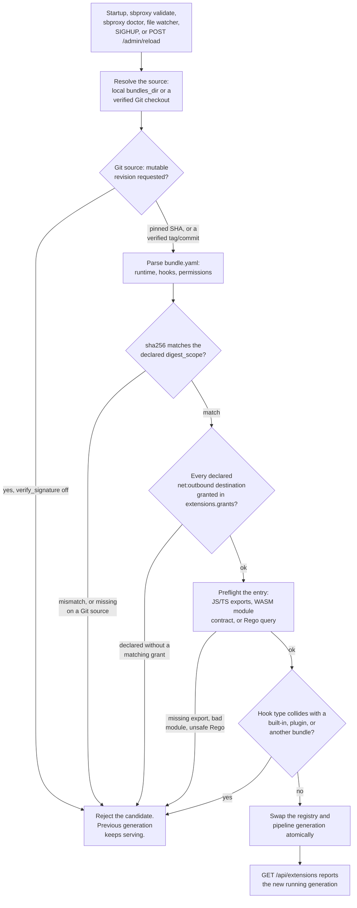

# Extension Bundles
*Last modified: 2026-08-27*

Dynamic bundles add policies, request authentication, transforms, actions, HTTP filters, provider-neutral event hooks, and AI routing decisions without linking a new proxy binary. A local installation is a directory of bundle directories:

```text
examples/extension-bundles/
├── sb.yml
└── bundles/
    ├── hello-javascript/
    │   ├── bundle.yaml
    │   └── entry.js
    └── queued-envelope-wasm/
        ├── bundle.yaml
        └── action.wasm
```

Point the config at the parent directory:

```yaml
extensions:
  bundles_dir: bundles
```

A relative `bundles_dir` uses the directory containing `sb.yml` as its base. The loader visits each child directory, reads its `bundle.yaml`, then reads the declared entry artifact without following a path outside that bundle. The runnable layout is in [examples/extension-bundles](../examples/extension-bundles/).

The same `extensions:` block carries capability grants, keyed by bundle manifest name:

```yaml
extensions:
  bundles_dir: bundles
  grants:
    jwks-refresher:
      - "net:outbound=https://issuer.example.com"
```

A bundle's hooks declare the destinations they want (see the manifest section below); the grant here is what makes any of them usable. The two lists must agree at load: a declared destination without a matching grant refuses the candidate, naming both sets, and a grant nothing declares is harmless. An absent grant list is an empty one.

Git sources use the same bundle layout from a verified checkout:

```yaml
extensions:
  sources:
    - type: git
      repo: https://github.com/acme/sbproxy-extensions.git
      revision: production
      path: bundles
      credential: secret://primary/extension-git-token
      verify_signature: true
      timeout_secs: 60
      refresh_interval_secs: 60
```

`revision` must be a full 40- or 64-character commit SHA, or a reference whose tag or commit Git can verify when `verify_signature: true`. Every Git bundle must also declare a `sha256`; see [What the digest covers](#what-the-digest-covers) for how much of the bundle that digest is a digest of. A relative `path` stays inside the verified checkout.

`credential` is a secret reference, not a token literal. It accepts the same `env:NAME`, `${NAME}`, `file:/path`, `secret://`, and provider-backed references as the rest of the config. SBproxy resolves it through the process secret resolver and gives Git command-scoped HTTP authorization. The resolved value is not added to the repository URL, Git arguments, checkout metadata, logs, errors, or extension inventory. SSH repositories continue to use the host's SSH credentials.

`refresh_interval_secs` accepts `0` or 1 through 86400. Zero fetches at startup and on ordinary reload only. Positive values start one jittered refresh loop at the shortest enabled interval across all Git bundle sources. An unchanged set of verified commits skips publication. A changed source builds and validates the complete registry, then uses the normal atomic reload transaction. Fetch, digest, export, runtime, or lifecycle failure leaves the last verified generation serving.

`GET /api/extensions` keeps the redacted repository, requested reference, verified commit, and latest refresh health in each Git bundle's bounded `load.detail`. It never includes the credential reference or resolved value. A rejected candidate also moves that bundle to `load.status: degraded`, which holds until a poll reaches the source and succeeds; a poll skipped because a reload was in progress clears neither the status nor the failure count. The bundle's `state` stays what it was, because the generation it loaded is still serving, so `summary.failed` does not count it.

## Bundle manifest

This JavaScript bundle exports one action and one transform:

```yaml
apiVersion: sbproxy.dev/v1alpha1
kind: Bundle
name: hello-javascript
version: 1.0.0
runtime: javascript
entry: entry.js
sha256: c3e22fb687e2cafe791daed266d028f043ec700594d20caa9caf1e65f4506524
hooks:
  - kind: action
    type: hello_javascript
    export: respond
    config_schema:
      type: object
      additionalProperties: false
      properties:
        response_header:
          type: string
          default: x-extension-runtime
      required: [response_header]
  - kind: transform
    type: example_javascript_transform
    export: transformResponse
failure_posture: closed
sandbox:
  budget_ms: 50
  memory_mb: 16
  stack_kb: 512
  max_buffer_bytes: 1048576
  max_output_bytes: 1048576
  max_fuel: 100000000
permissions: []
```

- `apiVersion` is `sbproxy.dev/v1alpha1` and `kind` is `Bundle`.
- `name` is a stable lowercase bundle ID. Each hook `type` is the name used in `sb.yml`.
- `runtime` is `javascript`, `wasm`, `proxy_wasm`, or `rego`.
- `entry` is a file inside the bundle directory. JavaScript accepts `.js` or `.ts`; both WASM runtimes accept `.wasm`; `rego` accepts `.rego`.
- `sha256` pins a digest and `digest_scope` says what that digest is a digest of. The example above omits `digest_scope`, so it means `entry`, the narrower of the two scopes. See [What the digest covers](#what-the-digest-covers).
- `hooks` declares at least one typed hook. A JavaScript hook names its ES module export. WASM hooks omit `export`.
- `config_schema` is an optional Draft 7 JSON Schema for one attachment. Defaults are applied before the hook starts, and invalid attachment config refuses the candidate.
- `secret_vars` names `config_schema` properties that hold a secret. Each is resolved through the same [reference forms](secrets.md) any other secret-bearing field accepts (`${VAR}`, `env:NAME`, `file:`, or a provider URI) before the hook ever runs; an unresolvable reference refuses the candidate. A property not listed here is never inspected for a reference, so resolution is always something a bundle author declared, not something the config compiler guessed at.
- `masked_vars` names `config_schema` properties to keep out of logs, errors, and diagnostics without resolving them, for a sensitive literal that is not a secret reference (a tenant ID, an internal hostname). Both lists require the named property to exist in `config_schema`, and a property cannot appear in both.
- `failure_posture` defaults to `closed`. `open`, `degraded`, and `observe` are only valid where that hook contract defines them. An `action` hook is terminal and accepts only `closed`, because there is nothing to fall through to when it fails.
- `sandbox` bounds wall time, buffered input, and output on every runtime. `memory_mb` and `stack_kb` bound a guest, so they apply to `runtime: wasm`, `proxy_wasm`, and `javascript`, and `max_fuel` applies to the two WASM runtimes. A `runtime: rego` hook has neither a guest heap nor a guest stack: it evaluates on the Regorus interpreter in the proxy's own process, bounded by `budget_ms` plus `max_buffer_bytes` and `max_output_bytes`. Writing `memory_mb` or `stack_kb` on a Rego manifest refuses the candidate at load rather than accepting a number that bounds nothing. The values shown are the defaults.
- The manifest-level `permissions` list stays reserved and must remain empty. Capabilities are declared per hook: a JavaScript hook may list `permissions:` entries of the form `net:outbound=https://api.example.com` or `net:outbound=http://internal.example.com:8080` (http or https, one exact hostname, optional port). Declaring is asking, not having: nothing works until the operator grants the same destinations in `sb.yml` under `extensions.grants.<bundle-name>`, and a candidate declaring destinations the operator has not granted refuses at load naming both sets. The wasm runtimes have no host-call surface, so a declaration there refuses at parse. Both the per-hook declarations and the empty reserved list sit inside the `digest_scope: bundle_v1` signed content, so the capabilities an operator audits are the capabilities the artifact was signed with.

A granted hook calls `sbproxy_fetch(JSON.stringify({url, method, headers, body_base64}))` and receives a JSON envelope string back: `{"status", "headers", "body_base64"}` on success, `{"error": "<bounded reason>"}` on refusal. The host authorizes every call against the granted destinations, pins resolution (the address the guard checked is the address dialed), follows no redirects (a redirect is a destination that was never granted), runs the whole call inside the hook's remaining `budget_ms`, and caps the response at `sandbox.max_buffer_bytes`. Grants naming only literal addresses (or `localhost`) may reach private address space, because the operator typed the address and no DNS answer is involved; grants naming hostnames refuse resolutions into private space, which is what stops a rebinding answer from steering a public name inward. The call is synchronous from the guest's view and occupies one JavaScript worker for its duration, so a hook doing outbound work should set `sandbox.budget_ms` accordingly.

Hook types cannot replace a built-in or linked registration of the same kind. Duplicate claims fail candidate construction instead of choosing a winner by load order.

Two linked registrations claiming one name are refused the same way, for all four typed channels. A binary that links two crates each registering an `auth`, `policy`, `transform`, or `action` plugin under the same name fails the config load with `duplicate <kind> plugin registration: <name>` and the number of claims, rather than binding whichever one the linker emitted first. Which crates they are is a question for the binary's dependency graph: a registration carries a name and a factory and nothing that says where it came from.

Where a hook's `failure_posture` applies, an attachment in `sb.yml` can override it. The precedence has three steps, and it matters that the middle one exists:

1. An explicit `failure_posture` (or the legacy `fail_on_error`) written on the attachment. The operator wiring the bundle into an origin outranks whoever wrote the bundle.
2. The bundle manifest's own `failure_posture`.
3. The attachment's default, which for a `transforms:` entry is `open`.

Writing nothing on the attachment is not the same as writing `open` there. A bundle that ships `failure_posture: closed` keeps it unless you say otherwise, which is what makes step two worth having: the bundle author's judgment about their own hook is the fallback, not the wrapper's default.

## What the digest covers

`sha256` is 64 lowercase hexadecimal characters with no `sha256:` prefix. `digest_scope` says how much of the bundle those characters are a digest of, and there are two answers.

`digest_scope: entry` is the default and covers the exact bytes of the single file named by `entry`. Nothing else: not `bundle.yaml`, not the WAT or TypeScript source used to build the entry, not any other file in the directory. Every manifest written before `digest_scope` existed means this, which is why it stays the default.

Read that scope carefully before relying on it, because the manifest sits outside it. `bundle.yaml` is where a bundle's hook kinds, sandbox limits, failure posture, `permissions`, and a `runtime: rego` hook's `query` all live, and the permission lines are what decide which destinations guest code may ask for. Pinning the code while leaving the file that declares its capabilities unpinned is the verification the wrong way round. An unpinned `query` is a narrower version of the same problem: a `bundle.yaml` edit can point evaluation at a different rule without touching the pinned module's bytes at all, but only among whatever rules that already-pinned module happens to define, not arbitrary new logic.

`digest_scope: bundle_v1` covers `bundle.yaml` and every other file the bundle ships:

```yaml
sha256: 1f0a4c7e6b25d3908c11a4f52e7b0d63c9a8f4e21b5d7c6083ae95f2d41b7c60
digest_scope: bundle_v1
```

### How a bundle_v1 digest is built

The digest is a SHA-256 over a text index, one line per file:

```text
sbproxy-bundle-digest/v1
<64 lowercase hex of the file's content>  <bundle-relative path>
...
```

The rules that make the same directory produce the same value on any machine:

- **Ordering.** Lines sort by bundle-relative path, comparing UTF-8 bytes ascending, which is what `LC_ALL=C sort` gives you. `bundle.yaml` takes its natural place in that order rather than a reserved slot.
- **Separator.** Path components join with `/` on every platform.
- **The path is hashed, not only the bytes.** Each line carries the file's path, so giving two files each other's names changes the index even though the set of content hashes did not move.
- **Coverage.** Every regular file in the directory, recursively. Empty directories carry no content and do not appear.
- **Self-exclusion.** A digest cannot be inside its own input, so `bundle.yaml` contributes the hash of its own bytes with the single top-level `sha256:` line deleted, terminating newline included. That is exactly `grep -v '^sha256:' bundle.yaml`, and nothing else in the file is rewritten, reordered, or normalized. The manifest has to be UTF-8, has to end with a newline, and has to write `sha256` as one unquoted top-level key with its value on the same line. Anything else refuses the bundle instead of guessing which bytes to drop.
- **File modes are not covered.** Mode bits do not survive the transports a bundle travels through, and sbproxy reads guest files into a sandbox rather than executing them from disk, so the executable bit grants a bundle nothing the digest would be protecting.
- **Symlinks are refused, never followed.** The bytes a symlink names live outside the hashed content, and one pointing out of the bundle directory reads a file you never shipped. Any symlink anywhere in the directory refuses the bundle.
- **File names have to be portable.** A name that is not valid UTF-8, or that carries a control character, `/`, or `\`, refuses the bundle. A name holding a newline could otherwise forge an index line.

Content is hashed byte for byte, so a checkout that rewrites line endings produces a different digest. Add `* -text` to a `.gitattributes` beside the bundle if anyone on your team runs `core.autocrlf`.

One bundle may ship at most 512 files, nested at most 8 directories deep, at most 16 MiB per file and 64 MiB in total.

### Computing a digest

Under `digest_scope: entry`, one command over the final entry artifact:

```bash
# macOS
shasum -a 256 bundles/hello-javascript/entry.js

# Linux
sha256sum bundles/hello-javascript/entry.js
```

Under `digest_scope: bundle_v1` no single command produces it, so the repository ships the recipe:

```bash
scripts/bundle-digest.sh bundles/hello-javascript
```

The script is a convenience for bundle authors and is not part of the trusted path. sbproxy recomputes the digest itself on every candidate load and compares against the manifest.

Copy the value into `bundle.yaml` only once every file in the bundle is final, and recompute it after any later edit to any of them.

### What a mismatch does

A mismatch refuses startup, `sbproxy validate`, doctor candidate inspection, or reload before the candidate can become active. So does an unreadable file, a symlink under `bundle_v1`, a manifest that cannot be canonicalized, and a bundle over any of the limits above. None of these warn and continue. The previous generation keeps serving, and no hook from the refused candidate reaches the running registry.

Local directory bundles may omit `sha256` entirely, which pins nothing at all. Production bundles should pin it, and Git-sourced bundles must.

### Moving a bundle to bundle_v1

Bundles already in production keep loading untouched, and the two scopes coexist across bundles in the same installation. To upgrade one:

1. Run `scripts/bundle-digest.sh <bundle-directory>`.
2. Replace that manifest's `sha256` value with what the script printed.
3. Add `digest_scope: bundle_v1` beside it.

A manifest that declares `digest_scope: bundle_v1` without a `sha256` fails validation rather than loading with nothing pinned.

## JavaScript and load-time TypeScript

JavaScript and TypeScript entries are ES modules with named exports. The host passes one JSON value to the selected export and accepts one strict JSON result. For the configurable HTTP hooks:

The sandbox is QuickJS with `eval` removed. The only host-provided globals beyond the language itself are `json_encode` (an alias of `JSON.stringify`) and `json_decode` (an alias of `JSON.parse`). There is no `atob`, `btoa`, `Buffer`, `TextEncoder`, `console.log`, or `crypto`. A hook that needs encoding or HMAC carries its own; see [Authentication](#authentication) and the worked `hmac-auth-javascript` bundle.

| Hook | Input field | Valid result |
|---|---|---|
| `policy` | `request` plus `config` | `allow` or `deny`, with bounded status, message, and headers |
| `auth` | `request` plus `config` | `allow` (with an optional resolved subject), `deny`, or `deny_with_headers` |
| `transform` | `body.body_base64`, `body.content_type`, `body.origin`, plus `config` | A replacement `body_base64` |
| `action` | `request` plus `config` | A bounded local `response` with status, headers, and `body_base64` |

Every input and result carries `"version": "sbproxy-envelope/v1"`. Unknown result fields, invalid headers, invalid base64, or an out-of-range status fail the invocation.

A hook that ends the request has to return a status the client can act on, so two further rules apply to any response a bundle produces, including a Proxy-Wasm local response:

- The status must be final, in the range 200 to 599. An informational 1xx says "keep going", but the host has already stopped dispatch by the time it sees the result, so the caller would wait for a final status that never arrives. A 1xx is refused before any byte is written.
- A 204 or a 304 must carry an empty body. Those statuses carry no content by definition, and framing a body under one desynchronizes an HTTP/1 connection. A guest body there is refused rather than dropped, because dropping it would leave a bundle that believes it is returning content looking like it works.

Both refusals name the status and nothing else. No guest-supplied bytes reach the error, so a bundle cannot use a rejection to place content in the operator's logs.

An action bundle finishes the request locally. Its attachment has no upstream configuration, so returning `outcome: "proxy"` fails with `unsupported_action_outcome`. Configure a concrete `type: proxy` or `type: load_balancer` action when the origin should forward traffic. For extension logic around a forwarded stream, attach a Proxy-Wasm filter to that concrete action.

A `.ts` entry is parsed and stripped to ES2020 JavaScript exactly once while a candidate loads. Every declared export is preflighted then. TypeScript is a source convenience; the runtime is still JavaScript.

sbproxy adds no TypeScript CLI, package manager, install command, module loader, or runtime dependency resolution. Imports, re-exports, and dynamic `import()` are rejected. If the extension uses dependencies, resolve them in your own build and ship one prebuilt flat `.js` artifact. Point `entry` at that final artifact and calculate its digest from those final bytes.

## Authentication

An `auth` hook runs before the origin action and decides whether the request is authenticated. It attaches through the origin's `auth:` block, the same slot a built-in provider like `jwt` or `api_key` uses, and a bundle type never shadows a built-in of the same name: the built-in wins and the bundle name is only reached when nothing built-in or linked claims it.

The hook returns one of three results. `allow` admits the request and may carry a resolved subject as `sub` with a `source` label (`header`, `jwt`, `forward_auth`, or `cookie`), which the observability layer stamps as the request's user; `sub` and `source` travel together or not at all. `deny` rejects with a bounded 4xx or 5xx status and message. `deny_with_headers` rejects and appends response headers, which is how a hook returns a `WWW-Authenticate` challenge.

An auth hook always fails closed: a hook that throws (it could not reach a decision, or its runtime faulted) denies the request, and `failure_posture` does not change that. Because a non-closed posture would be silently inert, a bundle whose manifest declares an `auth` hook must set `failure_posture: closed`; any other value is refused at load.

One classification detail matters for detection. A header-bearing denial (`deny_with_headers`) is scored for trust by its `denial_kind`: `challenge` (the default) is neutral and does not raise the suspicious-trust tier, while `invalid_proof` marks a rejected credential and does. Set `denial_kind: "invalid_proof"` when a presented credential failed, even though the response also carries a `WWW-Authenticate` header, so a brute-force attempt stays visible to trust scoring; leave it unset for the "no credentials presented" case. A plain `deny` is always an invalid-proof denial and takes no `denial_kind`. The worked example marks a bad HMAC signature `invalid_proof` with an RFC 6750 `error="invalid_token"` header and leaves a missing-credential request as a bare challenge.

Auth hooks are JavaScript-only this release. A wasm bundle that declares an `auth` hook is refused at load with a named error rather than compiling to a handler that does not exist.

The sandbox exposes no crypto primitive, so a hook that checks a signature carries its own. The worked `hmac-auth-javascript` bundle under `examples/extension-bundles/` ships a compact HMAC-SHA256 in pure JavaScript: the client signs `${keyId}.${timestamp}` with a shared secret and sends the key id, timestamp, and hex signature as headers, and the hook recomputes the HMAC and compares in constant time. The shared secret arrives through the hook's `secret_vars`, so the operator stores it as a reference and the plaintext never appears in config.

## Envelope WASM

An envelope WASM manifest uses:

```yaml
runtime: wasm
abi: sbproxy-envelope/v1
entry: action.wasm
```

The artifact is a WASI preview 1 command module with an exported `_start`. On each invocation, sbproxy creates a fresh Wasmtime store, writes the same versioned JSON hook envelope to stdin, runs `_start`, and parses one strict JSON result from stdout. The module receives no filesystem, network, environment, or host-clock access. The compiled module is shared, but guest state is not.

The worked example keeps `action.wat` beside the committed `action.wasm` and rebuilds it with `wat2wasm`. A production build can use any language that emits a compatible WASI preview 1 command module.

## Rego

A Rego bundle manifest uses:

```yaml
runtime: rego
entry: policy.rego
hooks:
  - kind: policy
    type: acme_authz
    execution:
      body_mode: none
  - kind: transform
    type: acme_rewrite
    execution:
      body_mode: buffered
```

A `runtime: rego` bundle rides the same signing, digest verification, and candidate load-or-refuse flow as every other bundle asset; see [Candidate load and reload](#candidate-load-and-reload). What differs is evaluation: sbproxy compiles the `.rego` module once per hook, at candidate load, on the same [Regorus](https://github.com/microsoft/regorus) interpreter `policy: rego` uses (see [scripting.md](scripting.md)), and proves each pinned query evaluable before the candidate can activate, the same load-time guarantee `entry.js`'s declared exports and `action.wasm`'s module contract already get. A `.rego` module performs no I/O during evaluation, so `runtime: rego` accepts only `kind: policy` and `kind: transform` hooks and must omit `abi` and `export`. A policy hook must declare `execution.body_mode: none`; a transform hook must declare `execution.body_mode: buffered`, because the buffered response body is exactly what it evaluates.

Bundled Rego is v1 only: the manifest has no `rego_v0` flag, so a pre-OPA-1.0 module fails at candidate load with a parse error. This is narrower than the config-inline surfaces: `policy: rego` and the `rego_module`/`rego_module_path` modifier fields both accept `rego_v0: true` for a pasted-in legacy module.

`type:` is the same `sb.yml` attachment name any other policy or transform hook uses. The `query` field pins the rule reference evaluated per request (`data.<package>.<rule>`). When omitted it follows the hook kind: a policy hook defaults to `data.sbproxy.allow`, matching `policy: rego`'s own default, and a transform hook to `data.sbproxy.transform`:

```yaml
hooks:
  - kind: policy
    type: acme_authz
    query: data.sbproxy.allow
    execution:
      body_mode: none
```

The rule reads the same JSON envelope a JavaScript or WASM policy hook reads: `input.request.method`, `input.request.uri`, `input.request.headers`, and `input.config` (the attachment's resolved `vars`, after `config_schema` defaults and `secret_vars` resolution). This is the wire-level request, not the internally resolved `CelContext` `policy: rego` reads from `sb.yml`; a bundle hook never sees trust tier or principal the way a built-in enforcer can. The query must evaluate to a Rego boolean: `true` allows and `false` denies, both with the fixed status and message `policy: rego` itself defaults to. A budget-exceeded, non-boolean-result, or other internal evaluation fault is not a decision, so it does not deny by itself: it reaches the same `failure_posture` handling every other bundle policy hook's fault reaches (`open` admits, `closed` refuses), rather than always denying the way `policy: rego`'s own unconditional fail-closed posture does.

A denial is always a fixed `403` with body `forbidden by policy`. `policy: rego`'s `deny_status`/`deny_message` knobs do not apply inside a bundle.

### Rego transform hooks

A `kind: transform` hook attaches under `transforms[]` by its `type` name, the same way a JavaScript or WASM bundle transform does, and evaluates once per buffered response body. Its input is the transform shape of the same envelope: `input.body.body_base64` (the complete response body, base64), `input.body.content_type`, `input.body.origin`, and `input.config`. The queried rule must evaluate to a base64 string, which becomes the replacement body, bounded by the sandbox's `max_output_bytes`:

```rego
package sbproxy

transform := base64.encode(upper(base64.decode(input.body.body_base64))) if {
    input.body.content_type == "text/plain"
}
```

A rule that is undefined for an input is the transform declining, and the body passes through unchanged; that is how a conditional rewrite skips the responses it does not care about. Anything else is a fault, not a rewrite: a non-string result, invalid base64, a replacement over `max_output_bytes`, a body over `max_buffer_bytes`, or a budget-exceeded evaluation each fail the transform without touching the body, and reach the same `failure_posture` handling every other bundle transform fault does. That now holds on a `static` or `mock` origin too: until this was fixed, a generated body was the one place where a `closed` transform's fault logged a warning and served the untransformed bytes anyway.

What bounds a Rego transform is worth being exact about, because it is the surface where a runaway rule matters most. `budget_ms` is a cooperative wall clock: Regorus checks it between interpreter work units, so it stops a runaway rule body but cannot interrupt a single builtin that allocates before it yields. `max_buffer_bytes` is what keeps request-scaled work bounded, since it caps the body the rule ever sees. There is no memory ceiling on a Rego hook; a rule that allocates without bound inside one builtin call is bounded by the host, not by the sandbox. Keep bundled Rego to decisions and rewrites over the body it is handed, and treat `numbers.range`, `net.cidr_expand`, and comprehensions over request-sized input as the shapes to avoid.

Like every scripted transform surface (`lua`, `lua_json`, `javascript`, `js_json`, and bundle transforms of any runtime), a Rego bundle transform counts as request-dependent for caching, so an origin combining it with `response_cache` is refused at config load; see [transforms.md](transforms.md).

`sbproxy rego test` (see [scripting.md](scripting.md#3a-rego-policies)) is engine-agnostic: it evaluates a fixture's `input` document exactly as authored, so it works as an offline pre-flight for a `.rego` file destined for a bundle just as well as for `policy: rego`. Write the fixture's `input` in the bundle envelope shape the hook actually receives, not the `CelContext` shape `policy: rego` fixtures use: `input.request.method`, `input.request.uri`, `input.request.headers`, and `input.config` for a policy hook, and `input.body.body_base64`, `input.body.content_type`, `input.body.origin`, and `input.config` for a transform hook.

## Proxy-Wasm HTTP and AI stream hooks

A Proxy-Wasm manifest uses ABI 0.2.1 and may declare only `proxy_wasm` or `ai_stream_event` hooks:

```yaml
runtime: proxy_wasm
abi: 0.2.1
entry: filter.wasm
hooks:
  - kind: proxy_wasm
    type: example_http_filter
    execution:
      body_mode: streamed
```

Attach HTTP filters to an origin in request order:

```yaml
origins:
  "filtered.extension.local":
    action:
      type: proxy
      url: https://api.example.com
    filters:
      - type: example_http_filter
        config:
          label: worked-example
        failure_posture: closed
```

`filters` is an ordered list of `type`, `config`, and an optional `failure_posture` override. Body access comes from each manifest hook, not from the attachment. The chain buffers only when at least one attached filter declares `buffered`, using the smallest configured input limit among filters that consume a body. `none` plus `streamed` still streams, while a `none`-only chain passes bodies through untouched.

An origin with filters must use a proxy action. If it has forward rules, every action those rules can select must also be a proxy action. A filtered origin cannot configure `fallback_origin`. Candidate validation rejects any other combination before publication.

The same compile-time rule applies to `transforms:`: they are a `response_body_filter` stage, and `ai_proxy` never enters that pipeline. Attach `ai_guardrail_output` or `ai_tool_call` instead; a transform list on an `ai_proxy` origin is refused at config load.

The host implements a bounded HTTP subset of Proxy-Wasm. Unsupported imports fail candidate load. A callback that returns `Pause` without resolving it is treated as a filter failure, so a guest cannot leave a request stalled. The attachment or bundle failure posture decides whether traffic is admitted or refused after that failure.

`proxy_log` is bounded on three axes. One message is capped at 4 KiB and one callback at 1 MiB of total guest output; past the callback budget, lines are dropped, one `warn` says so, and the guest still sees `STATUS_OK` so it has no backpressure signal to branch on. The bytes are split on newlines and emitted one record per line, with control characters escaped, so a payload cannot forge a log record the proxy did not write. The level the guest asks for is recorded as `log_level` but does not pick the channel: trace and debug emit at `debug`, info at `info`, and warn, error, and critical all emit at `warn`. A guest cannot mint an `error` line in its host's log.

For `ai_stream_event`, sbproxy maps normalized AI chunks onto Proxy-Wasm request-body callbacks and keeps one filter session for the model stream. The manifest must declare `body_mode: streamed`. JavaScript and envelope WASM do not accept this hook kind.

## AI events

AI hooks receive a provider-neutral event with `schema_version: 1`, a monotonically increasing request-local `sequence`, optional `request_id` and `model`, and one payload:

| Manifest kind | Event payload |
|---|---|
| `ai_guardrail_input` | Canonical messages and an evaluation stage such as `original` |
| `ai_tool_call` | One complete tool call with assembled JSON arguments |
| `ai_guardrail_output` | Canonical buffered assistant text |
| `ai_stream_event` | Normalized message-start, text-delta, usage, or message-stop chunk |
| `ai_close` | One terminal summary with finish reason, byte and delta counts, tool-call count, and token usage when known |
| `ai_failure` | A classified `cause` (`timeout`, `rate_limit`, `context_window_exceeded`, `content_policy`, `auth`, `server_error`, `bad_request`, `unknown`), the upstream `status` when one was received, the `provider` dispatched to, and a bounded, client-safe `message` |
| `ai_routing` | Not an event. The hook attaches by `type` from a routing policy and answers with a routing plan; see [Routing hooks](#routing-hooks) |

JavaScript and envelope WASM event hooks return `release`, `flag`, `block`, or `mutate`. A `block` carries an HTTP status from 400 through 599 plus a bounded code and client-safe message. A `flag` carries the code and message but does not stop traffic. `enforcement_mode: observe` moves a hook onto a bounded observation lane; the default `block` mode waits for the decision before releasing the corresponding operation or bytes.

`ai_failure` is the one AI event kind whose verdict is never consulted: the call has already failed, and a hook that blocked here would only turn one error into a different one, so whatever the hook returns is recorded and discarded. `ai_close` is different, and easy to misread as the same: it fires after the upstream generation has completed, but before the end-of-stream marker reaches the client, so a `block` verdict from an `ai_close` hook in `enforcement_mode: block` is honored. If no response headers have been sent yet the whole response is replaced by the block; if the stream is already flowing it is cut short with the block delivered as the final frame. Either outcome is recorded as an `ai.close` decision (select `ai.close` in `decision_audit`; see [Decision records](decision-records.md#aiclose)), with outcome `allow` for a clean close and `deny` when the hook refused. The refusal record names the hook's `code` and never its `message`, which is prose your bundle wrote and can quote the generation it just read. `ai_close` and `ai_failure` are also the two payloads `execution.mutates: true` is refused on, since both carry facts about work already finished rather than content a hook could faithfully rewrite:

```yaml
hooks:
  - kind: ai_failure
    type: acme_failure_logger
    export: onFailure
```

Today this fires from exactly one call site, gated on `routing.content_policy_fallback` being on for the origin: every `4xx` response from a provider is classified and reported there, on the way to deciding whether it is a content-policy refusal worth retrying against a more permissive provider. Within that gate, most of `AiFailureCause` is reachable in practice: a `408` classifies as `timeout`, a `429` as `rate_limit`, `401`/`403` as `auth`, and `400`/`422` as `context_window_exceeded`, `content_policy`, or `bad_request` depending on the body, with any other `4xx` falling to `unknown`. Only `server_error` (any `5xx`, including a `504` timeout) is structurally unreachable here, because the call site's own gate excludes every status at or above 500. A provider error on an origin that leaves `content_policy_fallback` unset or off never reaches this hook at all, regardless of status. Treat it as a content-policy-fallback-scoped signal, not general upstream-failure observability, until it is wired to more call sites.

A `mutate` rewrites the event's content in place and releases it. The decision carries a bounded `code` and a `body_base64` payload holding the replacement content: plain UTF-8 text for `ai_guardrail_output`, the JSON of the canonical message list for `ai_guardrail_input`, the JSON of the complete call object for `ai_tool_call`, and the JSON of the one stream chunk for `ai_stream_event` (see below). The host applies the rewrite before the next hook runs, so hooks compose: a redactor followed by a classifier classifies the redacted content. What ships is the rewritten content, spliced back into the provider-shaped body; a rewrite the body shape cannot faithfully carry (for example, one replacement text against a multi-choice completion) refuses the response rather than shipping the original.

A rewritten tool call replaces the held argument fragments with one canonical frame carrying the whole call. Three rewrites refuse as unrepresentable: a changed `index` (the call's identity is host-owned), `arguments_json` that does not parse as JSON (the frame carries it into a field clients parse), and any rewrite of a call whose assembled arguments were truncated at the stream buffer cap, because an edit of a prefix must not ship as if it were the whole value.

The input splice is content-only. The canonical message list is a lossy view (it carries no tool calls, drops non-text content parts, and folds provider role spellings), so the host never rebuilds the body from it: the original request stays authoritative, and only the text of messages the rewrite actually changed lands back in its original slot. Tool calls, images, and role spellings on untouched messages survive byte for byte. A rewrite that adds, removes, reorders, or relabels messages, or changes a message whose content has more than one text part, refuses as unrepresentable.

Mutation is declared, not inferred. A hook may return `mutate` only when its manifest entry sets `execution.mutates: true`, which is accepted on `ai_guardrail_input`, `ai_guardrail_output`, `ai_tool_call`, and `ai_stream_event` hooks; declaring it elsewhere, or combining it with `enforcement_mode: observe` (whose decisions are discarded), refuses at config load. An undeclared or oversized rewrite (the payload is capped by `sandbox.max_buffer_bytes`) is an engine fault handled under the bundle's failure posture: refused under `closed`, released unmodified under an admitting posture. Identity fields such as `sequence` and `request_id` are host-owned and cannot be rewritten.

A mutating `ai_stream_event` hook may only rewrite a content-delta chunk's text, and only the exact index it was shown; the host tracks what each hook saw and diffs the returned text against it, so an echoing hook (`text` unchanged) costs nothing downstream. Rewriting a `message_start`, `usage`, `message_stop`, or tool-call chunk is refused rather than silently dropped, because those numbers feed cost tracking, the budget path, and the metering ledger, and a hook that could rewrite them could rewrite a bill through a surface that looks like content moderation. A stream rewrite reaches the client on both the translated and passthrough response lanes: it is spliced into the parsed chunk on the translate lane and substituted inside the raw upstream bytes on the passthrough lane, so a client sees the same rewritten text regardless of which wire format it asked for.

### Routing hooks

An `ai_routing` hook picks which provider and model serve one AI request. It rides no event chain: it attaches by name from an origin's `ai_routing_policy`, so it evaluates on every request through that origin without appearing in the guardrail, tool-call, or stream lanes.

```yaml
hooks:
  - kind: ai_routing
    type: acme_router
    execution:
      body_mode: none
```

Four constraints hold on the kind, each refused at candidate load rather than at the first request:

- Envelope WASM only. A JavaScript bundle cannot declare it, because a JavaScript hook holding a `net:outbound` grant gains the `sbproxy_fetch` host function, and that would put I/O inside a routing decision.
- No capabilities. Everything the decision needs arrives in the request envelope, so a declared capability is refused on the kind before the runtime is even considered.
- `body_mode: none`, declared explicitly. The hook receives the routing document, never a request or response body, and `buffered` is the field default, so silence would promise data the host never delivers.
- `enforcement_mode: observe` is refused too. Declining to return a plan already is the observe posture, so the knob would load cleanly and change nothing.

The request envelope carries the `ai` decision document, the same vocabulary the CEL, Lua, JavaScript, and Rego forms of the policy read:

```json
{
  "version": "sbproxy-envelope/v1",
  "hook": {"kind": "ai_routing", "type": "acme_router"},
  "config": {"aggressiveness": 2},
  "ai": {"model": "gpt-4o", "principal": {"tier": "free"}, "budget": {"fraction": 0.82}}
}
```

`config` is the attachment's `vars` with the hook's `config_schema` defaults applied and its declared `secret_vars` resolved. The fields of the `ai` document are listed in [ai-gateway.md](ai-gateway.md).

The response envelope carries exactly two fields:

```json
{
  "version": "sbproxy-envelope/v1",
  "plan": {
    "candidates": [{"provider_id": "cheap", "model": "gpt-4o-mini"}],
    "reason": "budget over 80 percent",
    "reason_code": "cost"
  }
}
```

- `"plan": null` declines, and so do `{}` and a plan with an empty candidate list. The gateway falls through to the configured `routing` strategy, exactly as a decline from any other engine does.
- A missing `plan` field is a malformed envelope, not a decline. Declining is a decision the hook makes on purpose and writes down; a response that never mentions `plan` is a guest that did not answer, so it is refused as `invalid_envelope` and handled as a fault under the policy's `on_error` and the bundle's failure posture rather than read as "no opinion".
- Any other top-level field is refused, and so is a `version` that is not `sbproxy-envelope/v1`, which fails as `invalid_version`.

The plan's own shape (`candidates`, the required `reason`, the optional `reason_code`, and the per-candidate `quality_threshold` and `cost_cap`) is engine-neutral and documented in [ai-gateway.md](ai-gateway.md). The bundle runtime never inspects it: the envelope decoder hands the plan through untouched and the gateway decodes it, so a plan that is valid JSON but wrong for the gateway fails there as a routing error rather than here as a bundle fault.

## Payment and x402 events

A payment hook declares `execution.body_mode: none`. It receives a credential-free lifecycle event with `schema_version: 1`, a phase (`challenge`, `verify`, `settle`, or `reconcile`), an outcome, rail, monetary amount, and bounded identifiers. Optional fields include method, network, asset, intent ID, request ID, and a sanitized provider reference after success.

x402 uses the shared payment extension ABI as a rail. An x402 verification can report `rail: x402`, `method: exact`, a CAIP-2 network such as `eip155:84532`, and an asset such as `USDC`. Raw payment credentials and raw provider responses never enter the event.

For a `started` outcome, a blocking hook returns `continue` or `reject` before the provider write or access release. Terminal outcomes (`succeeded`, `rejected`, `failed`, `ambiguous`, or `unsupported`) are observation-only. A terminal return value cannot reverse a payment or retroactively deny access.

## Candidate load and reload

Startup, `sbproxy validate`, `sbproxy doctor <config>`, the file watcher, `SIGHUP`, and `POST /admin/reload` all build a candidate before publication. Candidate construction checks the source path, manifest, declared digest at its declared scope, hook collisions, config schemas, JavaScript or TypeScript exports, and WASM module contract. The running registry and pipeline generation swap together only after every required check succeeds.



If a bundle edit has a bad digest, syntax error, missing export, unsupported import, invalid WASM module, or conflicting hook name, reload rejects that candidate and the prior generation keeps serving. No hook from a rejected candidate leaks into the running registry.

Use the two inventory views for different questions:

- `sbproxy doctor sb.yml --format json` reports a stopped `doctor` snapshot. `active` means the candidate selected and wired the hook after preparing its chain. It does not mean traffic ran or that a runtime health check passed. A hook that loaded but has no attachment is `unconsumed`. `not_evaluated` is reserved for the loader-level fallback when doctor cannot finish candidate construction.
- Authenticated `GET /api/extensions` reports the `running` generation, including active, available, unconsumed, failed, or shadowed state, chain position, execution limits, and collisions. AI hooks become active with their compiled lifecycle chain. Payment hooks become active after the payment dispatcher installs successfully.

## Context from other extension systems

The design comparison points are:

- Envoy recommends Proxy-Wasm ABI 0.2.1 and loads Wasm configuration before request callbacks. See [Envoy's Wasm architecture overview](https://www.envoyproxy.io/docs/envoy/latest/intro/arch_overview/advanced/wasm) (accessed 2026-08-02).
- Kong's JavaScript plugin server can load TypeScript directly and resolve packages from `node_modules`. sbproxy intentionally does neither at runtime. See [Kong JavaScript plugins](https://developer.konghq.com/custom-plugins/javascript/) (accessed 2026-08-02).
- Apache APISIX runs external plugins in sidecar processes over a Unix-socket RPC RPC path and restarts the runner on reload. sbproxy bundle guests run inside the proxy sandbox and swap with the pipeline candidate. See [APISIX external plugins](https://apisix.apache.org/docs/apisix/external-plugin/) (accessed 2026-08-02).
- OPA activates a downloaded bundle only after verification and keeps the existing bundle when activation fails. sbproxy uses the same last-good operational model for the full pipeline candidate. See [OPA bundle management](https://www.openpolicyagent.org/docs/management-bundles) (accessed 2026-08-02).
