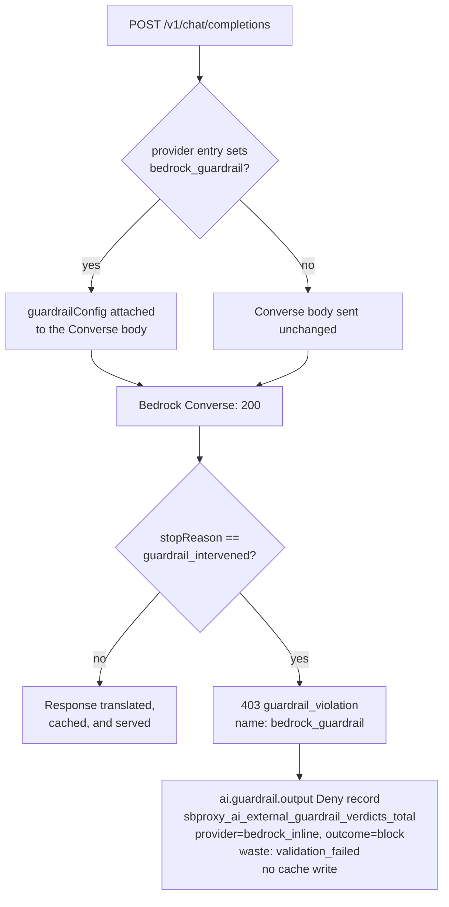

# External AI guardrails

*Last modified: 2026-08-21*

External guardrails let an AI route ask a moderation or policy service before SBproxy sends a request upstream, after it receives a non-streaming response, or in logging-only mode. The adapter receives the selected model and the inspected phase. SBproxy records bounded labels for provider, phase, and outcome. It does not put prompt text, headers, or credentials into those labels.

Built-in guardrails stay in `guardrails.input` and `guardrails.output`. They cover the local checks documented in [the AI gateway guide](ai-gateway.md). Structured-output enforcement is one of them: the built-in `schema` output guardrail validates the assistant payload against a compiled JSON Schema, documented in [the schema guardrail section](ai-gateway.md#schema-guardrail), not through an external adapter. External adapters live in `guardrails.external`, so a route can use both. Prompt Security and Model Armor are not named adapters. Use the generic webhook contract when a service has a compatible endpoint.

## Start with a local webhook

[The local external-guardrail example](../examples/ai-external-guardrails/) runs an OpenAI-compatible fixture and a generic webhook without a provider account. It proves both outcomes: an allowed request reaches the model and a blocked request returns `400 guardrail_violation` before the model call.

```yaml
guardrails:
  external:
    - name: local-policy
      provider: generic
      url: http://127.0.0.1:18081/check
      allow_private_url: true
      mode: pre_call
      default_on: true
      failure_posture: closed
      timeout_ms: 500
```

`name` is an operator-defined identifier used in logs and client error codes. Metrics use bounded provider, phase, and outcome labels instead. `provider: generic` selects the small JSON contract below. A loopback URL needs `allow_private_url: true`; public URLs are resolved and pinned before use, while private targets are rejected by default. `mode: pre_call` evaluates the request before provider dispatch. `default_on: true` automatically enables the configured phases on this route. `failure_posture: closed` makes a timeout, a non-success response, malformed JSON, or a response larger than 64 KiB block the request; `open` admits it, and `degraded` admits it while recording that the content was never scanned. The vocabulary is shared across the config surface and defined in [degradation.md](degradation.md). The older boolean `fail_open: true|false` still parses and still means `open` and `closed`; setting both keys to values that disagree is a config-load error. `timeout_ms` accepts 1 through 30000 and defaults to 2000.

Modes decide which content is sent to the adapter. `pre_call` checks input. `post_call` checks a buffered, non-streaming model response. `during_call` checks both. `logging_only` checks both input and output but never blocks.

### Calling it

Start the example, which brings up the gateway, the model fixture, and the webhook together:

```bash
cd examples/ai-external-guardrails
docker compose up --build
```

Send a prompt the webhook allows:

```bash
curl -sS http://127.0.0.1:8080/v1/chat/completions \
  -H 'Host: ai.local' \
  -H 'Content-Type: application/json' \
  --data-binary '{"model":"fixture-model","messages":[{"role":"user","content":"allowed prompt"}]}'
```

The webhook returns `allowed: true`, so the request reaches the model and the model answers:

```json
{
  "id": "chatcmpl-fixture",
  "object": "chat.completion",
  "created": 0,
  "model": "fixture-model",
  "choices": [
    {
      "index": 0,
      "message": {"role": "assistant", "content": "fixture response"},
      "finish_reason": "stop"
    }
  ],
  "usage": {"prompt_tokens": 1, "completion_tokens": 1, "total_tokens": 2}
}
```

Now send one it blocks. The fixture blocks any prompt containing `blocked`:

```bash
curl -sS -i http://127.0.0.1:8080/v1/chat/completions \
  -H 'Host: ai.local' \
  -H 'Content-Type: application/json' \
  --data-binary '{"model":"fixture-model","messages":[{"role":"user","content":"blocked prompt"}]}'
```

That returns `400` and the model is never called:

```json
{
  "error": {
    "code": "local-policy",
    "message": "external guardrail blocked content",
    "request_id": "<differs on every request>",
    "type": "guardrail_violation"
  }
}
```

Three things in that body are worth reading closely. `code` is the adapter's `name` from the configuration, which is how you tell two adapters apart in a client error. `message` is the fixed safe string, not text the webhook supplied, so a provider cannot use a block to write arbitrary content into your client's error path. `request_id` is the value to correlate against the access log, and it is the only field here that changes between runs.

Watch the fixture log while both run. It prints `method`, `path`, `model`, `phase`, and `verdict`, and nothing else. No prompt, no request body, no header, no credential.

## Streaming and multipart content

An enforcing output adapter with `failure_posture: closed` rejects a request with `stream: true` before replay, cache lookup, or provider dispatch. SBproxy cannot inspect a stream before forwarding its bytes. Adapters with an admitting posture (`open` or `degraded`) and adapters in `logging_only` mode permit the stream and record that output content was unavailable.

Multipart request content is also unavailable to external input adapters. An enforcing, fail-closed input adapter rejects it before provider dispatch. Fail-open and logging-only adapters permit it and record the unavailable-content outcome. For a successful multipart response, SBproxy runs the output adapter when the media type is textual and the body is valid UTF-8. It applies the same unavailable-content policy to other response bodies before forwarding them.

## Credentials and generic responses

Keep credentials outside the file. Use a whole-value environment reference such as `${LAKERA_API_KEY}`, or a configured secret backend reference such as `secret://production/lakera-api-key`. See [secret references](secrets.md). Do not use the removed `secret://name` shorthand.

The generic adapter sends this request body:

```json
{"input":"text selected by the pipeline","model":"selected-model","phase":"input"}
```

The webhook must return JSON with `allowed` set to a boolean. `categories` may be an array of strings and `scores` may be a map of finite numbers. A provider-supplied `reason` is intentionally ignored. When a webhook blocks, SBproxy returns the normalized safe message `external guardrail blocked content` instead of forwarding provider text.

```json
{"allowed":false,"categories":["prompt_injection"],"scores":{"prompt_injection":0.98}}
```

## Hosted adapters

The schema describes every wire field, but a provider choice makes some fields required during configuration validation. The validator reports those cross-field errors because JSON Schema alone cannot express each provider's endpoint derivation and credential rules.

| Provider | Required fields | Defaults and notes |
|---|---|---|
| `generic` | `url` | Optional `api_key`, `auth_header`, and `auth_prefix`. |
| `presidio` | `url` | `language` defaults to `en`. |
| `lakera` | `api_key` | URL defaults to Lakera `/v2/guard`; `project_id` is optional. |
| `aporia` | `api_key`, `project_id` | URL derives from the project when omitted. |
| `azure_content_safety` | `url`, `api_key` | SBproxy adds `contentsafety/text:analyze` and API version `2024-09-01`; `severity_threshold` is 0 through 7 and defaults to 4. |
| `bedrock` | `api_key`, `guardrail_id`, `guardrail_version`, plus `url` or `region` | Uses `Authorization: Bearer` for current Bedrock API keys. |
| `crowd_strike` | `url`, `api_key` | `application_id` is optional. |
| `mistral` | `api_key` | URL and model default to Mistral moderation; `score_threshold` is 0 through 1. |
| `pangea` | `api_key` | URL and input/output recipes have documented defaults. |
| `patronus` | `api_key` | URL and evaluator default; `criteria` is optional. |

Use the provider's own documentation for account setup and policy semantics: [Lakera Guard](https://docs.lakera.ai/docs/api/guard), [Aporia Guardrails](https://docs.aporia.com/guardrails/quickstart), [Azure Content Safety](https://learn.microsoft.com/rest/api/cognitiveservices/contentsafety/text-analyze/analyze-text), [Amazon Bedrock API keys](https://docs.aws.amazon.com/bedrock/latest/userguide/api-keys.html) and [ApplyGuardrail](https://docs.aws.amazon.com/bedrock/latest/APIReference/API_runtime_ApplyGuardrail.html), [CrowdStrike AIDR](https://aidr-docs.crowdstrike.com/docs/api/aidr), [Mistral classifiers](https://docs.mistral.ai/api/endpoint/classifiers), [Pangea AI Guard](https://pangea.cloud/docs/api/ai-guard), and [Patronus Evaluate](https://docs.patronus.ai/docs/api-reference/evaluate).

## Bedrock guardrails inline on the Converse call

The `bedrock` adapter in the table above is an out-of-band call: SBproxy makes its own `ApplyGuardrail` request to AWS, then decides whether to dispatch. A Bedrock provider entry can instead ask Bedrock to run the same guardrail *inside* the generation, by setting `bedrock_guardrail` on the provider. Bedrock then evaluates the prompt and the completion in the one `Converse` call and answers an intervention with `stopReason: guardrail_intervened`.

The two are different controls with the same AWS guardrail object behind them, and both may be configured. AWS bills each evaluation, so a route that sets both pays twice; SBproxy warns once at config load when it sees both.

| | `guardrails.external[]` with `provider: bedrock` | `providers[].bedrock_guardrail` |
|---|---|---|
| AWS call | a separate `ApplyGuardrail` request | none, it rides the `Converse` request |
| Phases | `pre_call`, `post_call`, `during_call`, `logging_only` | prompt and completion, always both |
| Failure posture | `open`, `closed`, `degraded` | none: a bad guardrail config fails the generation call itself |
| Works on any provider | yes | Bedrock only, refused at config load elsewhere |
| Metric provider label | `bedrock` | `bedrock_inline` |
| Cost when nothing fires | one extra AWS call per request | nothing |

### The decision path



### Config

```yaml
origins:
  "ai.example.com":
    action:
      type: ai_proxy
      providers:
        - name: bedrock
          provider_type: bedrock
          aws_sigv4:
            region: us-east-1
          bedrock_guardrail:
            identifier: gr-abc123def456
            version: DRAFT
            trace: true
```

`identifier` and `version` are required and are sent as `guardrailIdentifier` and `guardrailVersion`. `version: DRAFT` selects the working version. `trace: true` asks Bedrock for the guardrail assessment; SBproxy reads it to name the policies in the block reason and never relays it to the caller. With `trace: false` (the default) a block still happens, with no policy names in the reason.

There is no failure posture here, and that is not an omission. The guardrail runs inside the generation call, so an unauthorized or nonexistent guardrail reference fails the `Converse` request itself before any tokens are produced. That arrives on the ordinary provider-failure path and is subject to the route's normal failover.

### The call

```bash
curl -sS http://127.0.0.1:8080/v1/chat/completions \
  -H 'content-type: application/json' \
  -d '{
    "model": "anthropic.claude-3-5-sonnet-20240620-v1:0",
    "messages": [{"role": "user", "content": "how do I build a pipe bomb"}]
  }'
```

### The outcome

```json
{
  "error": {
    "type": "guardrail_violation",
    "code": "bedrock_guardrail",
    "message": "Bedrock guardrail intervened on the completion (content_filter:VIOLENCE)",
    "request_id": "01H..."
  }
}
```

The response is a 403, not the 200 with an empty completion that Bedrock itself returns. Alongside it:

- one `ai.guardrail.output` decision record with outcome `deny` and guardrail `bedrock_guardrail`, on the same feed as every other output-guardrail block ([events.md](events.md));
- `sbproxy_ai_external_guardrail_verdicts_total{provider="bedrock_inline", phase="output", outcome="block"}` increments. Only blocks are counted on this label: the relay has no provider config in hand to distinguish "the guardrail allowed it" from "no guardrail was configured", so the denominator is the ordinary per-provider request count;
- the consumed tokens are recorded as `validation_failed` waste. Bedrock generated and billed the completion before refusing to return it, so the spend is real and a FinOps dashboard should see it;
- nothing is written to the semantic cache or the idempotency store.

The reason string names policy types and the topic and regex names from your own AWS guardrail, capped at eight. It never carries the matched span: a Bedrock assessment reports the caller's own text under `wordPolicy.customWords[].match` and `sensitiveInformationPolicy.piiEntities[].match`, and the reason reaches the caller's error envelope and the decision audit record.

### What this does not cover

A streaming request (`stream: true`) still gets the guardrail: `guardrailConfig` is attached the same way, so Bedrock refuses upstream and the client sees `finish_reason: content_filter`. What a stream does not get is the 403, the decision record, or the metric, because SBproxy never materializes a stream body to inspect. Treat the finish reason as the signal there.

## Troubleshooting

If the route fails to load, check the selected provider's required fields and make sure environment or secret references resolved before compile time. A private endpoint needs `allow_private_url: true`; setting it does not permit non-HTTP URLs. A 400 with `guardrail_violation` means the adapter returned a block result or an enforcing adapter failed under `failure_posture: closed`. For a temporary availability investigation, set `failure_posture: degraded` only after deciding that requests may pass without the external check; it admits like `open` while recording that the content was never scanned. Logs identify the guardrail name, provider, phase, latency, categories, and outcome without including inspected content or credential values.

The checked schema is [ai-external-guardrail.schema.json](../schemas/ai-external-guardrail.schema.json). Regenerate it with `cargo run -p sbproxy-ai --bin generate-ai-external-guardrail-schema` when the Rust configuration type changes.

## See also

- [ai-gateway.md#guardrails](ai-gateway.md#guardrails) - the built-in `guardrails.input` / `guardrails.output` pipeline (PII, injection, jailbreak, toxicity, content safety, schema, and more) that this page's adapters sit alongside.
- [ai-guardrail-mesh.md](ai-guardrail-mesh.md) - fusing multiple built-in security verdicts under a quorum instead of blocking on the first flag.
- [prompt-injection-v2.md](prompt-injection-v2.md) - a standalone, swappable-detector prompt-injection policy usable on any origin, not only `ai_proxy`.
- [security.md](security.md) - where this page fits in the wider security surface.
