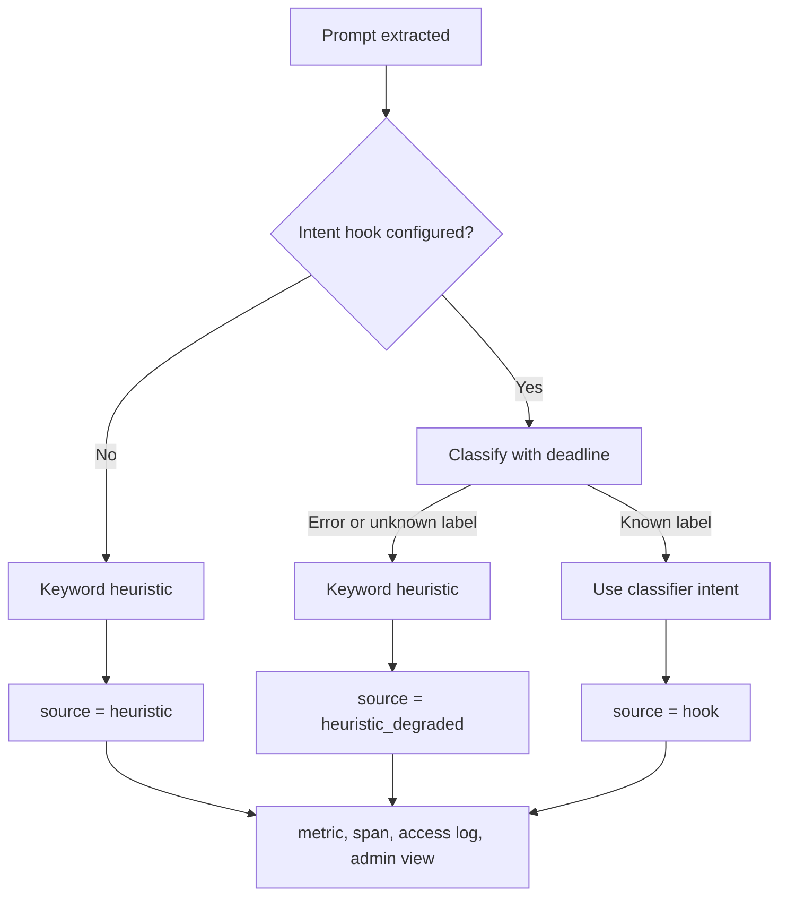

# Intent detection and quality-based routing
*Last modified: 2026-08-25*

SBproxy can classify each AI prompt into a coarse intent and use prompt-aware
classifier scores to choose among eligible providers. Both capabilities are
available in the stock binary through `proxy.classifier_hooks`. Omitting the
block keeps intent on the built-in keyword heuristic and leaves quality
reranking disabled.

## Configure the classifier hooks

```yaml
proxy:
  classifier_hooks:
    endpoint: https://classifier.internal:9440
    timeout_ms: 250
    tls:
      ca_pem: file:/etc/sbproxy/classifier-ca.pem
      server_name: classifier.internal
      client_identity:
        cert_pem: file:/etc/sbproxy/classifier-client-cert.pem
        key_pem: file:/etc/sbproxy/classifier-client-key.pem
    authentication:
      type: bearer
      credential: ${CLASSIFIER_HOOK_BEARER_TOKEN}
    intent:
      model: intent-v1
    quality:
      minimum_score: 0.8
      provider_models:
        primary:
          model: quality-primary-v1
          label: preferred
        secondary:
          model: quality-secondary-v1
          label: preferred
```

`endpoint` is a gRPC endpoint for either classifier sidecar. Local loopback
deployments may keep the old `http://127.0.0.1:9440` shape. Any nonlocal
destination must use `https://` and must authenticate with bearer metadata,
client mTLS, or both. `timeout_ms` is an end-to-end deadline in the closed
range 1 through 30,000 milliseconds. The proxy validates the URI and all
bounds at configuration load, but opens the shared channel lazily on the first
AI request. A sidecar is therefore optional at boot and every request failure
remains fail-open.

The transport hardening fields map directly onto the sidecars' gRPC listener
flags:

- `tls.ca_pem` is an optional custom CA bundle for the remote classifier.
- `tls.server_name` overrides the TLS server name / SNI; otherwise the endpoint
  host is used.
- `tls.client_identity.cert_pem` and `tls.client_identity.key_pem` carry the
  client certificate and private key for classifier-hook mTLS.
- `authentication.type: bearer` sends one metadata value on every request. The
  default metadata key is `authorization` and the default scheme prefix is
  `Bearer`, so the example above emits `authorization: Bearer <token>`.

For nonlocal endpoints, secret-bearing fields must be secret references rather
than inline literals. `authentication.credential`, `tls.ca_pem`, and
`tls.client_identity.*` accept `${ENV}`, `env:NAME`, `file:/path`, and the
configured provider-backed secret-reference URIs. Inline bearer tokens and
inline PEM blocks are refused. Resolved values are redacted from debug output
and errors identify the config field rather than echoing the secret.

For quality routing, `provider_models` must contain a contract for every
provider that may be considered on a hooked route. Each contract names the
classifier model and the exact label whose score represents that provider's
suitability for the current prompt. At most 64 contracts are accepted. If a
contract is missing, a call fails, a label is absent, the common deadline
expires, or every score is below `minimum_score`, SBproxy preserves the
configured router's decision.

Run `sbproxy validate --config sb.yml` before publication to check the
configuration without dialing the sidecar.

## Intent detection

Every AI request with a non-empty prompt receives one of five categories,
recorded on the request context, access log, and request span:

| Category | Example prompt |
|---|---|
| `coding` | "Implement a binary search tree in Rust" |
| `vision` | "Describe this image for me" |
| `analysis` | "Compare two model responses" |
| `summarization` | "Give me a TL;DR of this report" |
| `general` | anything that matches none of the above |

The configured intent model must return one of those exact lowercase labels.
An unknown label is treated as a degraded classifier answer and falls back to
the local heuristic.



The source counter has a closed vocabulary:

- `sbproxy_ai_intent_detection_source_total{source="hook"}` means the
  configured classifier answered with a known label.
- `source="heuristic"` means no intent hook was configured. This preserves
  the metric's original unconfigured label value.
- `source="heuristic_degraded"` means a configured hook failed open.
- `source="unknown"` is the defensive normalization bucket.

The "Intent Classifier State" Grafana panel and the AI performance admin view
display the same labels. Alert on a sustained increase in
`heuristic_degraded`; normal unconfigured operation remains separately visible
and is not an outage.

## Quality-based routing

The live POST dispatcher asks the configured classifier models to score the
current eligible provider set concurrently. It runs after eligibility filters
and semantic routing, but before the configured load-balancer strategy. It
stands down when fallback, cascade, or cost-quality routing already owns the
order. A highest score at or above `minimum_score` pins that eligible provider.

This path uses the sidecar's generic `Classify` RPC. It does not use the rich
sidecar's completed-response `Quality` RPC because provider selection happens
before any response exists.

Live outcomes are visible in three places:

- `sbproxy_ai_quality_routing_decisions_total{outcome="selected"|"hook_unavailable"|"target_ineligible"}`.
- The "Quality Hook Routing Outcomes" Grafana panel and AI performance admin
  view.
- Structured `ai.quality_routing.*` events and the `quality_hook:` reason on
  the admin routing row.

`hook_unavailable` includes transport/deadline failures, incomplete provider
contracts, malformed classifier responses, and the valid case where no score
meets the configured threshold. All preserve configured routing.

## See also

- [classifier-sidecar.md](classifier-sidecar.md) for deploying the optional
  classifier service.
- [ai-gateway.md](ai-gateway.md) for the routing strategies these hooks feed.
