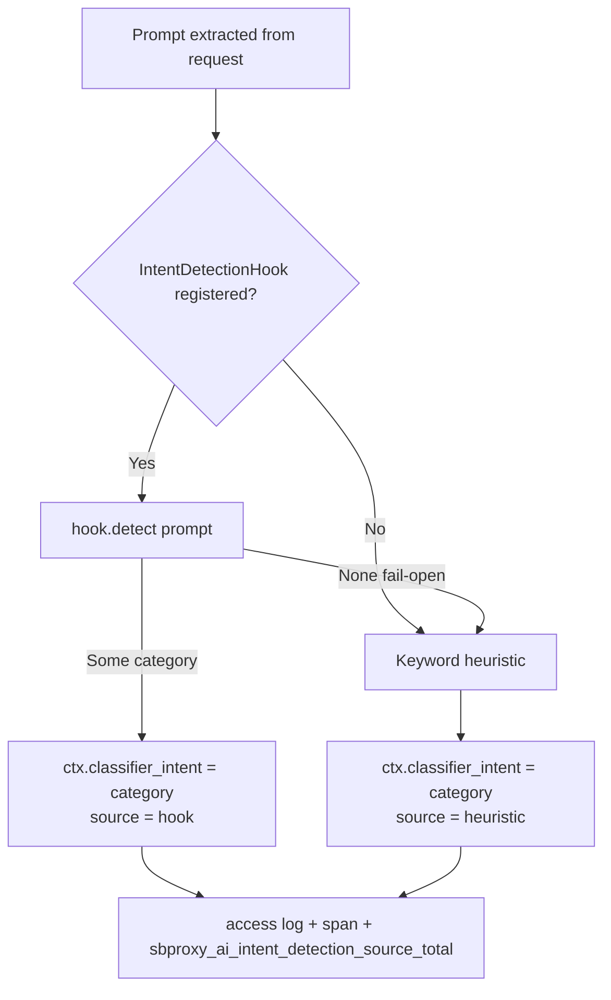

# Intent detection and quality-based routing
*Last modified: 2026-08-22*

Two optional AI gateway hooks, ported from the enterprise value-feature
survey (WOR-2672): coarse intent detection and quality-based provider
selection, both live on the request path. Both follow the same shape: an
optional hook an extension can register, a closed-vocabulary answer, and
a fallback that never blocks a request.

## Intent detection

Every AI request with a non-empty prompt is classified into one of five
coarse categories, used to inform provider routing and recorded on the
access log and the request span:

| Category | Example prompt |
|---|---|
| `coding` | "Implement a binary search tree in Rust" |
| `vision` | "Describe this image for me" |
| `analysis` | "Compare GPT-4 and Claude" |
| `summarization` | "Give me a TL;DR of this report" |
| `general` | anything that matches none of the above |

### The two-path answer



`ClassifierIntentHook` is the shipped sidecar-backed implementation. It
uses `sbproxy-classifier-client`'s `FallbackClassifier`, so a missing,
unreachable, or failing sidecar degrades to the keyword heuristic for that
request. Nothing registers the hook by default. An extension or embedder
opts in through the pipeline lifecycle hook, while an ordinary OSS
deployment remains 100% heuristic by design.

### What changed in this port

Before WOR-2672, a missing or declining `IntentDetectionHook` left the
request's detected intent unset (`None`): the field existed
(`ctx.classifier_intent`) but nothing populated it without a hook. The
port added the local keyword heuristic as an always-on fallback, so every
request with a prompt now carries an intent, and made the hook-vs-heuristic
split observable:

- `sbproxy_ai_intent_detection_source_total{source="hook"|"heuristic"}`
  (Prometheus counter). See the "Intent Detection Source" panel on the
  `sbproxy-ai-gateway` Grafana dashboard.
- `classifier.intent` and (via `tracing`) `source` fields on the AI
  request span, and on the structured debug log line `"AI proxy: intent
  detected"`.

On a deployment that *does* configure a sidecar hook, watch the `heuristic`
share of that counter: a rising share on such a deployment means the
sidecar has stopped answering (unreachable, timing out, or returning
malformed responses) and every request is falling back silently to
keyword matching. A deployment with no hook configured is 100%
`heuristic` by design; the metric distinguishes "no hook exists" from "a
hook exists and stopped answering" only by cross-referencing whether the
deployment configured one at all, since both report the same label.

### Library surface

```rust,ignore
use sbproxy_core::intent_detection::{detect_intent_heuristic, detect_intent_with_source, IntentSource};

// Pure, synchronous: no hook involved.
let category = detect_intent_heuristic("Summarize this article");

// The request-path shape: prefers an optional hook, reports which path answered.
let (category, source) = detect_intent_with_source(hook.as_ref(), prompt).await;
assert_eq!(source, IntentSource::Heuristic); // when no hook is registered
```

## Quality-based routing

`sbproxy_core::quality_routing` selects the AI provider with the highest
quality score above a configurable minimum threshold, via an optional
`QualityScoringHook`. The reusable helper below falls back to the first
candidate provider on failure:

```rust,ignore
use sbproxy_core::quality_routing::select_by_quality_async;
use sbproxy_core::hooks::QualityRequest;

let req = QualityRequest {
    origin: "api.example.com".to_string(),
    model_id: None,
    prompt: prompt.clone(),
    candidate_providers: vec!["openai".into(), "anthropic".into()],
};
// hook: Option<&Arc<dyn QualityScoringHook>>
let picked = select_by_quality_async(hook.as_ref(), req, 0.75).await;
// picked is the first candidate when hook is None, scores everyone below
// 0.75, or the hook itself declined.
```

The live POST dispatcher invokes the same hook after eligibility filters
and semantic routing, but before the configured load-balancer strategy.
It stands down when fallback, cascade, or cost-quality routing already
owns the order. A valid hook result pins the selected eligible provider.
A declining hook, a below-threshold result, or an ineligible provider
preserves the configured router's order instead of replacing it with a
guess.

Live outcomes are visible in three places:

- `sbproxy_ai_quality_routing_decisions_total{outcome="selected"|"hook_unavailable"|"target_ineligible"}`.
- The "Quality Hook Routing Outcomes" Grafana panel and the AI performance
  admin view.
- Structured `ai.quality_routing.*` log events and the routing decision's
  `quality_hook:` reason in the admin routing row.

## Runnable example

[`crates/sbproxy-core/examples/intent_detection_fallback.rs`](../crates/sbproxy-core/examples/intent_detection_fallback.rs)
runs `detect_intent_with_source` against a handful of prompts with no
hook registered, then against a stub hook that answers for some prompts
and declines for others, printing which path answered each one:

```bash
cargo run -p sbproxy-core --example intent_detection_fallback
```

## See also

- [classifier-sidecar.md](classifier-sidecar.md) - the sidecar used by
  `ClassifierIntentHook` and the `FallbackClassifier` optional-degrade
  wrapper it is built on.
- [ai-gateway.md](ai-gateway.md) - routing strategies these hooks feed
  into.
