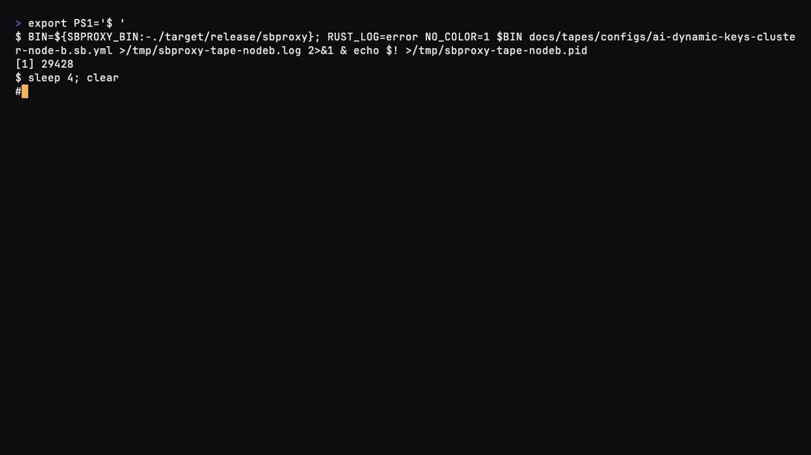

# SBproxy dynamic key management

*Last modified: 2026-07-10*

A virtual key is a live, governed resource, not a line of YAML. With the
`key_management:` block enabled, you mint, revoke, and rotate inbound keys at
runtime through an admin API. Each change takes effect on the next request
without a reload, because every request resolves its key through a cache and
then the store. Inbound keys are hashed at rest; upstream provider credentials
can be encrypted at rest. One pluggable store, one policy cache, and one admin
API sit underneath both.

This is the runtime layer on top of the static `credentials:` block. The static
block still works; it lowers into the same store as config-sourced records.

## When to use it

Reach for dynamic key management when keys outlive a config file: a fleet of
agents that each need their own key, keys you must revoke the instant a laptop is
lost, per-customer keys with their own rate limits and budgets, or keys minted by
another system through the API. If your keys rarely change, the static
`credentials:` block is simpler and enough.

## The block

```yaml
proxy:
  key_management:
    enabled: true
    store:
      backend: embedded              # embedded | redis | secrets_manager
      path: /var/lib/sbproxy/keystore.redb
    cache:
      ttl_secs: 60                   # how long a resolved key stays cached
      negative_ttl_secs: 5           # how long an unknown key stays cached
      max_entries: 10000
      tier: none                     # none | redis | mesh
    crypto:
      pepper: env:SBPROXY_KEY_PEPPER       # HMAC key for inbound hashing
      master_key: env:SBPROXY_KEY_MASTER   # envelope key for upstream creds
    failure_mode_allow: false        # fail closed when the store is down
    allow_api_override: false        # config records win on reload
    oidc_claim_map:
      claim_field: virtual_key       # JWT/OIDC claim that names the record
    seed:
      keys: []                       # optional declarative keys
      credentials: []                # optional declarative credentials
```

When `enabled` is false (the default) the block is inert and inbound auth keeps
using the compiled `credentials:` blocks.

## Store backends

The store is sbproxy's own mutable system of record. It is distinct from the
vault, which reads external secrets you do not own.

- `embedded` (default): a redb file on local disk. Single node, no dependencies.
  Good for one replica or a shared volume.
- `redis`: a Redis instance, usable as the source of truth for a replica fleet
  or as a coherence tier behind the embedded store. Every mutation bumps a
  revision counter and publishes the changed id, so peers drop their cached copy
  and pick up the change. Set `store.url` to the Redis connection string.
- `secrets_manager`: an external secrets manager is itself the system of record,
  for operators who want exactly one place secrets live. Configured under
  `store.secrets_manager` with a `provider` of `hashicorp` (token auth, token
  from `token_env`), `aws` (default credential chain), or `local` (in-memory, for
  dev and tests). Only writable managers are supported; read-only backends are
  not offered here.



Two replicas share a Redis store with a mesh cache in front ([config](../examples/ai-dynamic-keys-cluster/)).

## The policy cache

A small in-memory cache sits in front of the store so per-request resolution is
fast and does not hammer the store. A found key is cached for `ttl_secs`
(default 60); an unknown key is cached for `negative_ttl_secs` (default 5) so a
flood of bad keys cannot stampede the store. Mutations invalidate the entry, so a
revoke or a limit change is visible on the next request.

For a multi-replica deployment, set `cache.tier: redis` (or `mesh`) to add a
shared second tier. With Redis, a peer's mutation publishes an invalidation that
drops the matching entry on every node, so a revoke is clusterwide.

```
request -> L1 in-memory cache -> L2 tier (redis/mesh, optional) -> store
```

The mesh tier makes the L2 a gossip cluster instead of Redis: a SWIM membership
protocol feeds a consistent-hash ring, and reads and writes route to the replica
that owns a key, so the resolution order is L1, then the mesh cache, then the
store. A durable shared store still sits behind it as the source of truth (Redis,
or a secrets manager for a Redis-free fleet); the mesh keeps the cache coherent
and carries CRDT-based per-key spend and rate counters across replicas. Bootstrap
it with a `cache.mesh:` block of seed peers plus gossip and transport ports:

```yaml
cache:
  tier: mesh
  mesh_node_id: node-a            # unique per replica
  mesh:
    seeds: ["node-b:7946"]        # another replica's gossip endpoint
    gossip_port: 7946
    transport_port: 8946
    advertise_addr: node-a:7946   # what this node advertises to peers
    transport_advertise_addr: node-a:8946 # optional when host is the same
    # shared_key: env:SBPROXY_MESH_KEY  # encrypt gossip + transport (optional)
```

See the runnable `examples/ai-dynamic-keys-cluster/` for a two-replica setup.

## The security model

Two kinds of secret, two different treatments.

Inbound virtual keys are **hashed**, never stored in a form you can read back.
The at-rest verifier is `HMAC-SHA256(secret, pepper)`. The server pepper means a
stolen store is useless without it, which a bare SHA-256 of the key would not
give you. A minted token has the shape `sk-<key_id>-<secret>`; the `key_id` is a
public prefix, the `secret` is shown once and never stored. Verification is
constant-time.

Upstream provider credentials are **encrypted**, because the proxy has to present
them to the provider. Two options: a vault reference (`vault://`, `awssm://`,
`gcpsm://`, ...) resolved at use, which is first-class and keeps the secret out
of the store entirely; or an AEAD envelope. The envelope generates a per-record
data key, encrypts the secret with AES-256-GCM bound to the record id, then wraps
the data key under a key derived from the `master_key`. Only the wrapped data key
reaches disk, so you can rotate the master without re-encrypting every payload.

Set `pepper` and `master_key` to a stable secret in production. Both accept
`env:NAME` or `file:PATH` so you can inject them from your secret manager. If you
leave them unset, sbproxy generates an ephemeral value and warns: stored hashes
and encrypted credentials will not survive a restart.

By default the plane fails closed. If the store cannot be reached, a request
carrying a virtual key is denied. Set `failure_mode_allow: true` only if you have
weighed an outage of the store against an outage of your gateway.

## The admin API

Mounted on the existing admin server, under the same bind and basic auth. Every
call below also has a point-and-click equivalent on the Keys page of the
[built-in web UI](admin.md#the-built-in-web-ui):


Enable the admin server first:

```yaml
proxy:
  admin:
    enabled: true
    port: 9090
    username: admin
    password: change-me
```

Mint a key. The plaintext token comes back exactly once.

```bash
curl -s -u admin:change-me -X POST http://127.0.0.1:9090/admin/keys \
  -H 'Content-Type: application/json' \
  -d '{"name":"ci-runner","max_requests_per_minute":60,"allowed_models":["gpt-4o-mini"]}'
# { "token": "sk-ab12cd34-...", "key": { "key_id": "ab12cd34", ... } }
```


The plaintext token appears once at mint; list calls only ever show the key_id ([config](../examples/ai-dynamic-keys/)).

| Method and path | Effect |
|---|---|
| `POST /admin/keys` | Mint a key (token shown once) |
| `GET /admin/keys` | List keys (no secrets) |
| `GET /admin/keys/{id}` | Fetch one key |
| `PATCH /admin/keys/{id}` | Update limits, budget, models, attribution |
| `DELETE /admin/keys/{id}` | Delete a key |
| `POST /admin/keys/{id}/revoke` | Mark revoked (terminal) |
| `POST /admin/keys/{id}/block` | Mark blocked (reversible) |
| `POST /admin/keys/{id}/unblock` | Mark active |
| `POST /admin/keys/{id}/rotate` | Rotate with a grace window |
| `POST /admin/credentials` | Create an upstream credential |
| `GET /admin/credentials` | List credentials (no secrets) |
| `GET/PATCH/DELETE /admin/credentials/{id}` | Read, update, delete |
| `POST /admin/credentials/{id}/revoke\|block\|unblock` | Lifecycle |

Revoke is instant. The next request with that key is denied.

```bash
curl -s -u admin:change-me -X POST http://127.0.0.1:9090/admin/keys/ab12cd34/revoke
```

Rotation mints a fresh secret for the same `key_id` and keeps the prior secret
valid for a grace window (default one hour). Both tokens work during the window,
so a client fleet can pick up the new token before the old one stops working.

```bash
curl -s -u admin:change-me -X POST http://127.0.0.1:9090/admin/keys/ab12cd34/rotate \
  -d '{"grace_secs":3600}'
# { "token": "sk-ab12cd34-<new>", "grace_expires_at": "...", "key": { ... } }
```

Responses never carry a hash, an envelope, or a plaintext secret, apart from the
one-time minted token on create and rotate.

## Live policy

A key is not just an auth token; it carries its own policy. Everything below
rides on the record, so a `PATCH` takes effect on the next request without a
reload. Across a replica fleet, per-key spend and rate are kept coherent through
the mesh counters.

- **Model and provider access:** `allowed_models`, `blocked_models`,
  `allowed_providers`. Empty allow-lists mean "all".
- **Rate and budget:** `max_requests_per_minute` and `max_tokens_per_minute`
  cap the key's one-minute windows (requests admitted, then tokens actually
  consumed by responses), and a `budget` with `max_tokens` and `max_cost_usd`
  caps lifetime totals. Budgets reconcile with the multi-window budgets in the
  AI gateway.
- **Scheduling lane:** `priority` (`interactive`, `standard`, or `batch`)
  places the key's requests in a lane on the locally served model's admission
  queue. Unset means standard. See the model host doc for how lanes queue and
  spill.
- **Lifecycle:** `status` (active, blocked, revoked) and `expires_at`.
- **Guardrails:** `require_pii_redaction` lists redaction rules that must be
  active before the key can dispatch; `bypass_prompt_injection` skips the
  body-aware injection scan for a trusted caller (eval pipelines, red-team
  tooling). Default off, so every key is scanned.
- **Model pinning and tools:** `route_to_model` overwrites the request's `model`
  before routing, so the caller cannot pick another; `inject_tools` replaces the
  client's tool list with a set the key owns; `inject_mcp` (an object naming a
  federated MCP gateway, for example `{"ref": "toolhub"}`) attaches that
  gateway's tools to the key's requests. Together these make a key a fixed
  "model plus tools" surface.
- **Principal gate:** `principal_selectors` restricts which inbound identities
  may present the key, matched by `virtual_key`, `team`, `project`, `user`,
  `role`, or `claim`. Empty means any principal.
- **Attribution:** `project`, `user`, `tenant_id`, `tags`, and `metadata` flow
  to the access log and cost reports.

Set any of these at mint time or with `PATCH /admin/keys/{id}` at runtime. Seed
keys accept a subset with slightly different names: the budget caps are the flat
fields `max_budget_tokens` and `max_budget_usd` rather than a `budget` object,
tenant attribution is `tenant`, and `tags`, `metadata`, and `status` are not
seedable (a seeded key is always active; manage lifecycle through the API). For
example:

```bash
curl -s -u admin:change-me -X PATCH http://127.0.0.1:9090/admin/keys/ab12cd34 \
  -H 'Content-Type: application/json' \
  -d '{"allowed_models":["gpt-4o-mini"],"max_requests_per_minute":60,
       "budget":{"max_cost_usd":50},"route_to_model":"gpt-4o-mini",
       "require_pii_redaction":["email"],"tags":["team:payments"]}'
```

Beyond the structured fields, the resolved key becomes the request principal, so
the CEL policy plane can make decisions keyed on `project`, `user`, `tenant_id`,
`tags`, or `key_id`.

## OIDC and JWT

If your callers authenticate with an OIDC or JWT identity instead of a bearer
key, set `oidc_claim_map.claim_field` to the claim whose value names a key
record. After the token is verified, the claim value resolves the record and its
policy applies, so a bearer key and an OIDC identity converge on the same record
and the same limits. No secret is checked on this path, since the identity was
already proven by the token.

Revocation applies to this front door the same way it applies to bearer keys: a
token whose mapped claim names a revoked, blocked, or expired record is denied
with 403 on the next request, and a claim naming a record that does not exist
is denied with 401. A token that carries no mapped claim at all is simply
unmapped; it authenticates on its own terms with no per-key policy. When the
store is unreachable this path fails closed unless `failure_mode_allow` is set,
matching the bearer path.

## Migrating from static credentials

You do not have to move everything at once. The static `credentials:` blocks
keep working and lower into the same store as config-sourced records. To
migrate a key:

1. Enable `key_management:` with a stable `pepper` and a store backend.
2. Move the key into `key_management.seed.keys` (or mint a fresh one through the
   API and hand the new token to the client).
3. Remove it from `credentials:` once the client uses the new token.

Config-seeded records are authoritative on reload: they are re-applied every time
the config is reloaded, so the file stays the source of truth. Set
`allow_api_override: true` if you want runtime API changes to a seeded key to
survive a reload instead.

## Seeding

For a self-contained config, declare keys and credentials inline. A seed key
takes either a `secret` (hashed at boot) or a precomputed `secret_hash`.

The `key_management:` block nests under `proxy:`; a top-level `key_management:`
key is silently dropped with a warning and the feature stays off.

```yaml
proxy:
  key_management:
    enabled: true
    crypto:
      pepper: env:SBPROXY_KEY_PEPPER
      master_key: env:SBPROXY_KEY_MASTER
    seed:
      keys:
        - key_id: ci0001
          secret: rotate-me-in-production
          name: ci-runner
          max_requests_per_minute: 60
          allowed_models: [gpt-4o-mini]
      credentials:
        - id: openai-prod
          provider: openai
          vault_ref: vault://openai
```

See the runnable `examples/ai-dynamic-keys/` config for the full setup.
