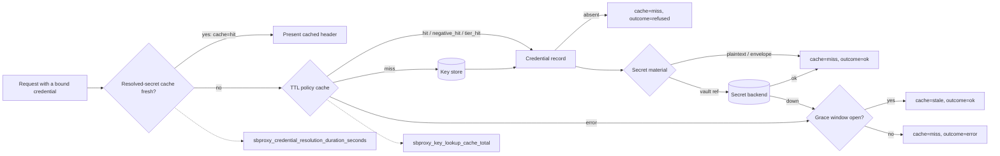

# SBproxy dynamic key management

*Last modified: 2026-08-20*

A virtual key is a live, governed resource, not a line of YAML. With the
`key_management:` block enabled, you mint, revoke, and rotate inbound keys at
runtime through an admin API. Each change takes effect on the next request
without a reload, because every request resolves its key through a cache and
then the store. Inbound keys are hashed at rest; upstream provider credentials
can be encrypted at rest. One pluggable store, one policy cache, and one admin
API sit underneath both. Each key also carries an immutable public identity and
a monotonic policy revision, so concurrent operators cannot silently overwrite
one another's policy changes.

This is the runtime layer on top of the static `credentials:` block. The static
block still works; it lowers into the same store as config-sourced records.

## When to use it

Reach for dynamic key management when keys outlive a config file: a fleet of
agents that each need their own key, keys you must revoke the instant a laptop is
lost, per-customer keys with their own rate limits and budgets, or keys minted by
another system through the API. If your keys rarely change, the static
`credentials:` block is simpler and enough.

## The block

```yaml
proxy:
  key_management:
    enabled: true
    store:
      backend: embedded              # embedded | redis | secrets_manager | mesh
      # node-local: see "Clustered deployments" below before using this
      # on more than one node
      path: /var/lib/sbproxy/keystore.redb
    cache:
      ttl_secs: 60                   # how long a resolved key stays cached
      negative_ttl_secs: 5           # how long an unknown key stays cached
      max_entries: 10000
      tier: none                     # none | redis | mesh
    crypto:
      pepper: env:SBPROXY_KEY_PEPPER       # HMAC key for inbound hashing
      master_key: env:SBPROXY_KEY_MASTER   # envelope key for upstream creds
    inbound:
      headers:                             # one minted token resolves; conflicts deny
        - {name: authorization, scheme: "Bearer "}
        - {name: x-api-key,     scheme: ""}
        - {name: x-sb-api,      scheme: ""}
      require: false                       # 401 when no minted key resolved
      native_key_policy:
        allowed_providers: [openai, anthropic]
        max_requests_per_minute: 600
        max_tokens_per_minute: 200000
        max_budget_tokens: 10000000
        max_budget_usd: 250.00
        allowed_models: [gpt-5, claude-sonnet-4]
        blocked_models: []
        require_pii_redaction: [email]
    failure_posture: closed          # closed | degraded | open
    allow_api_override: false        # config records win on reload
    oidc_claim_map:
      claim_field: virtual_key       # JWT/OIDC claim that names the record
    seed:
      keys: []                       # optional declarative keys
      credentials: []                # optional declarative credentials
```

When `enabled` is false (the default) the block is inert and inbound auth keeps
using the compiled `credentials:` blocks.

In Docker, mount a volume at `/var/lib/sbproxy` so the keystore survives
container replacement (`-v sbproxy-state:/var/lib/sbproxy`). Images up to
v1.9.0 ship without that directory and the nonroot runtime user cannot create
it, so on those versions the mount is required: without it the key plane
fails to install at boot with `create keystore directory '/var/lib/sbproxy'`.
A bind mount to a host directory works too.

## Which header carries the key

A minted key is presented in whatever header the calling tool already sends.
An Anthropic SDK sends `x-api-key`, Azure OpenAI sends `api-key`, and an
internal tool sends whatever its author picked. Rather than ask you to rewrite
those tools, SBproxy sweeps a configured list of headers for a token.

The list is route-level, not per-key, and it has to be: to know which header
holds the key you would have to have resolved the key already. The default
covers the three common shapes and you can add your own.

A minted token looks like `sbp_<16 hex>_<64 hex>`, a fixed 85 characters over a
fixed alphabet. SBproxy recognizes that shape before store access, then looks
up the public key id and verifies the secret. Shape recognition alone never
authenticates a request. A caller presenting their own `sk-proj-...` or
`sk-ant-...` provider key enters the native-key policy described below and,
when allowed, passes through to the upstream that owns it.

The configured carrier list is also the lookup surface for legacy stored
`sk-<id>-<secret>` keys and exact `credentials: {type: ai_provider}` values on
AI routes. Resolution order is canonical `sbp_...`, stored legacy key, a
verified OIDC/JWT claim mapped to a stored record, exact configured credential,
then provider-native policy. The winning governed carrier is removed before
dispatch, so that presented value does not accompany the operator's provider
credential upstream.

### Two ways to use it

**Substitution.** The tool already sends `x-api-key`. Point it at SBproxy,
give it a minted key instead of the provider key, and bind that key to a stored
credential. The upstream sees its own real key in `x-api-key`; the tool never
holds it.

```
client  ->  x-api-key: sbp_0a1b..._9f8e...     (minted, governed)
upstream <- x-api-key: <the real provider key>  (from the bound credential)
```

**Sidecar.** The tool keeps sending its own credential, and the minted key
rides alongside in `x-sb-api`. SBproxy governs the request without storing or
managing the caller-owned upstream secret; it still receives and forwards that
secret on the proxied request.

```
client  ->  authorization: Bearer <the tool's own key>
            x-sb-api: sbp_0a1b..._9f8e...
upstream <- authorization: Bearer <the tool's own key>   (untouched)
```

Both fall out of one rule: the key's header is consumed, and a bound
credential, if any, is written to its own header.

### Attributing native provider keys

A request that carries no minted key but does carry a recognizable provider
credential is attributed to and governed as that provider. The rules live under
`inbound.provider_hints`, ship with defaults for the common shapes (`sk-ant-`
is Anthropic, `sk-or-` is OpenRouter, a bare `sk-` bearer is OpenAI,
`x-goog-api-key` is Gemini, `api-key` is Azure), and are ordered: the first
match wins, so specific prefixes belong before loose ones.

Primary credential carriers are security-sensitive protocol fields, so SBproxy
validates them even when `key_management.enabled` is currently `false`.
Carriers cannot reuse hop-by-hop, framing, WebSocket, tracing, signature,
correlation, budget identity, A2A envelope, access-log identity, or
capture-envelope headers. This includes `x-user-id`, `x-end-user`,
`x-sbproxy-tag`, `x-sb-user-id`, the session headers, and the `x-a2a-*` and
`x-sb-property-*` namespaces.
`provider_hints[].also_header` is match metadata rather than a credential
carrier, so it may still name protocol metadata such as a provider version
header.

Recognized native credentials require an explicit
`inbound.native_key_policy.allowed_providers` allowlist. If the policy is
absent or the recognized provider is not listed, SBproxy returns 403 before
dispatch. A credential matching no hint remains unattributed and follows the
origin's ordinary auth behavior.

`provider_hints` ships non-empty by default and `native_key_policy` defaults
to absent, so turning on `key_management.enabled` alone is enough to arm this
403 with nothing behind it to admit the traffic it now recognizes. Boot, and
every SIGHUP reload, emits a WARN naming the recognized providers whenever
that combination is detected, so the gap is visible before the first caller
hits it. `sbproxy validate` does not catch this: validation mode checks the
config schema and stops there, skipping key-plane construction entirely, so
only a live boot or reload surfaces the warning. Fix it by declaring the
allowlist:

```yaml
inbound:
  native_key_policy:
    allowed_providers: [openai]
```

and, on each `ai_proxy` provider that may receive a caller credential:

```yaml
accept_native_credentials_for: openai
```

The same block is lowered to a secret-free KeyRecord-shaped default. Every
traffic type gets provider admission, audit attribution, a stable
tenant/origin/provider identity, and automatic
`max_requests_per_minute` enforcement. AI routes additionally apply provider
and model policy, token/cost budget preflight, and PII requirements wherever
the request shape can be interpreted. JSON POST and PUT/PATCH bodies can be
inspected and redacted. Multipart and Realtime cannot safely satisfy required
PII redaction and fail closed when a credential requires it; bodyless or
otherwise uninterpretable methods fail closed when model policy requires a
model. Multipart and non-POST responses do not yet settle token/cost counters,
so those fields are admission signals rather than strict usage ceilings on
those surfaces.

Limits are bucketed by tenant, origin, and recognized provider. The native
policy identity is built from those labels and contains no credential bytes.

On a generic proxy route, an allowed caller-owned credential passes upstream
unchanged, even when that origin also configures `outbound_credential`: native
mode represents an explicit caller-owned identity, so the origin credential
must not replace it. SBproxy receives and forwards the caller-owned secret, but
does not store, manage, or substitute it. An AI provider must opt in as an
exact credential destination. Set `accept_native_credentials_for` to the
canonical hint label, and make it match the provider's wire type:

```yaml
action:
  type: ai_proxy
  providers:
    - name: openai-primary
      provider_type: openai
      accept_native_credentials_for: openai
      base_url: https://api.openai.com/v1
      api_key: ${OPENAI_API_KEY} # used when the caller is not in native mode
```

The opt-in belongs to this provider entry and its effective `base_url`.
`provider_type` selects the wire format; it does not grant a destination access
to caller credentials. Without the opt-in, a custom endpoint that speaks the
OpenAI protocol receives only its operator credential. If the native
credential cannot be re-resolved or no opted-in provider exists, the request
fails before an upstream call. Minted `sbp_...` keys take precedence and never
enter native-key policy resolution.

Confidence cascade and race routing are unavailable for native credentials.
Cascade returns 503 and race returns 403 before request-body processing, cache
or idempotency lookup, managed-model preparation, streaming dispatch, or the
first upstream attempt. Sequential fallback can use another provider only when
that provider entry has its own matching `accept_native_credentials_for`
binding.
For the same reason, configured shadow copies are suppressed for native
traffic: the primary response proceeds normally, while neither the caller
credential nor an operator credential is sent to the shadow target.

The companion metric
`sbproxy_inbound_key_requests_total{provider,key_mode,tenant_id,api_key_id}`
uses the closed `key_mode` values `none`, `minted`, and `native`. An unresolved
provider or key id is the empty label value. Native `api_key_id` is the stable,
secret-free tenant/origin/provider policy-bucket id. Access logs, request
events, and security audit records carry the same `key_provider` and
`key_mode` fields. No raw provider key is stored in those records or metric
labels.

One canonical key id spans every per-request surface: the admin request
ring (`GET /api/requests?api_key_id=`), the access log, the metric label,
usage events, and the `sbproxy.key_id` span attribute all report the same
id for the same request, so "what did this key do" has one answer
everywhere. Key and credential lifecycle changes are audited with the
acting operator and a status diff, queryable at `GET /api/audit/events`;
see [admin-api-reference.md](admin-api-reference.md).

A key policy may set `allow_content_capture: true` to consent to the
origin's opt-in console content sampling. Consent alone captures nothing:
the AI origin must also set `capture_content: true`, and every retained
sample is redacted before storage. See the console content samples
section of [ai-gateway.md](ai-gateway.md).

### Requiring a key

`require: true` refuses a request that carried no minted key, with a 401. It is
off by default, so turning the sweep on changes nothing for an existing route.
Reach for it on an origin that has no other auth provider, where the default is
to admit unauthenticated traffic.

A resolved minted key satisfies auth on its own and skips the origin's
configured provider, so an origin with a JWT provider accepts either a valid
JWT or a valid minted key. That is what makes minted keys work in parallel with
credentials you already issue.

### Rate limiting a minted key

Bucket on `request.key_id`, not on the header:

```yaml
policies:
  - type: rate_limit
    key: request.key_id
    requests_per_minute: 600
```

The header carries the presented secret, so bucketing on it means the bucket
changes when you rotate the key and the caller gets a fresh budget. The key id
does not change. `request.key_id` is the secret-free native policy-bucket id for
admitted native traffic and an empty string when no key policy resolved, so the
expression still evaluates on unauthenticated traffic.

`concurrent_limit` with `key_by: api_key` already does this for you: it uses the
resolved key id when there is one and falls back to the header otherwise.

## Binding a key to an upstream credential

A key can name a stored credential with `credential_id`. That credential is
then the only upstream identity the key can reach an origin with.

The credential carries its own presentation, because how a secret must be sent
is a property of the upstream rather than of the caller:

```bash
curl -X POST localhost:9090/admin/credentials \
  -d '{"id":"anthropic-prod","secret":"sk-ant-...","header":"x-api-key","scheme":""}'

curl -X POST localhost:9090/admin/keys \
  -d '{"name":"research-team","credential_id":"anthropic-prod"}'
```

`header` defaults to `authorization` and `scheme` to `Bearer `. Set `scheme` to
an empty string for raw-value headers.

**A bound credential fails closed.** If it is missing, revoked, or cannot be
resolved, the request is refused with a 503. It never falls back to the
origin's own `outbound_credential`, because that would hand the key an upstream
identity it was never bound to. Deleting a credential that keys still bind is
refused with a 409 naming those keys; clear `credential_id` on them first.

A key and the credential it binds must belong to the same tenant. That is
checked when you set the binding and again on every request, because either
record's tenant can change afterwards.

**Credential bindings need a fully upgraded fleet.** A node on an older build
drops `credential_id` when the record replicates to it, resolves the key
without a binding, and dispatches on the origin's shared credential. You cannot
make an already-running binary refuse a field it ignores, so minting a bound
key is refused unless every node is known to understand it.

Each node republishes what it understands into cluster state, and the gate
reads one record per member before allowing a binding. A member with no record
refuses the mint and is named in the error, whether it is on an older build or
just unreachable: neither can be told apart from the case the gate exists to
prevent. A single-node deployment has no peers and is unaffected.

The records carry a two-minute expiry and are republished at half that, so a
node that is replaced by an older build drops out of the set on its own and the
fleet starts refusing again without anyone intervening. Pin your image tag when
you roll out.


## Store backends

The store is sbproxy's own mutable system of record. It is distinct from the
vault, which reads external secrets you do not own.

- `embedded` (default): a redb file on local disk. Single node, no dependencies.
  Good for one replica or a shared volume.
- `redis`: a Redis instance, usable as the source of truth for a replica fleet
  or as a coherence tier behind the embedded store. Every mutation bumps a
  revision counter and publishes the changed id, so peers drop their cached copy
  and pick up the change. Set `store.url` to the Redis connection string.
- `secrets_manager`: an external secrets manager is itself the system of record,
  for operators who want exactly one place secrets live. Configured under
  `store.secrets_manager` with a `provider` of `hashicorp` (token auth, token
  from `token_env`), `aws` (default credential chain), or `local` (in-memory, for
  dev and tests). Only writable managers are supported; read-only backends are
  not offered here.
- `mesh`: the cluster's own replicated state substrate is the system of record,
  so a key minted on one node resolves on its peers with no Redis and no
  external secrets manager. Requires `proxy.cluster` with a `replication`
  block. See [The mesh backend](#the-mesh-backend) for the guarantees and the
  full configuration.

### The mesh backend

`backend: mesh` puts the keystore on the same quorum-replicated, durable
substrate the cluster already runs for its own state
([mesh-replication.md](mesh-replication.md)). Every record is written to
`replication.factor` nodes and acknowledged only after a majority committed it
to disk, so the fleet needs no external store at all.

The consistency levels are pinned by the backend and are not configurable:
writes and reads run at quorum, and revocation is written at one
acknowledgment. The only knobs that apply come from the cluster's existing
`replication` block, which the keystore shares with every other consumer of
the substrate.

```yaml
proxy:
  cluster:
    cluster_id: prod
    node_id: gw-1
    seeds: ["gw-2:7946"]                 # the peers this node joins
    state_dir: /var/lib/sbproxy/cluster  # durable identity + replica shard
    security:
      mode: mtls
      shared_key: env:SBPROXY_CLUSTER_GOSSIP_KEY
      cert_file: /var/lib/sbproxy/cluster/node.pem
      key_file: /var/lib/sbproxy/cluster/node-key.pem
      ca_file: /var/lib/sbproxy/cluster/ca.pem
      server_name: sbproxy-mesh
    replication:
      factor: 2                          # copies per key record
      anti_entropy_interval_secs: 30     # repair cadence after partitions
      tombstone_gc_grace_secs: 86400     # also the rejoin quarantine bound
  key_management:
    enabled: true
    store:
      backend: mesh                      # no url, no path: the cluster is the store
    cache:
      ttl_secs: 60                       # per-node resolution cache (see below)
    crypto:
      pepper: env:SBPROXY_KEY_PEPPER
      master_key: env:SBPROXY_KEY_MASTER
```

Each component earns its place:

- `proxy.cluster` is required. Selecting `backend: mesh` on a node with no
  cluster fails at config validation, because a mesh keystore on a node with
  no mesh is an embedded keystore with extra steps.
- `proxy.cluster.replication` is where the keystore's records physically live:
  the durable replica shard under `state_dir`. The `factor` is how many nodes
  hold each record; `anti_entropy_interval_secs` bounds how long a healed
  partition takes to reconverge; `tombstone_gc_grace_secs` doubles as the
  rejoin quarantine window described below. There are no keystore-specific
  consistency knobs on purpose.
- `store.backend: mesh` is the whole store surface. No URL, no file path, no
  credentials to a third system.
- `cache.ttl_secs` is the per-node resolution cache every backend has. For
  this backend it is also half of the revocation propagation bound, so
  shortening it tightens cluster-wide denial.
- `crypto.pepper` and `crypto.master_key` matter more here than on a
  single-node store: every node verifies hashes and opens envelopes minted by
  every other node, so all nodes must be configured with the same values.

What the backend guarantees, stated exactly:

| Guarantee | `mesh` backend |
|---|---|
| Acknowledged mint survives any minority failure | Yes. Writes are quorum-acknowledged and durable on a majority before success is reported. |
| Revocation visible cluster-wide | Eventual: bounded by `anti_entropy_interval_secs` plus `cache.ttl_secs`. Redis is bounded by `cache.ttl_secs` alone, because its pub/sub invalidation pushes to every node. |
| Revisioned policy CAS | Write-then-verify: the backend reads at quorum, writes, reads back, and reports success only if its exact write won. Never a false success; a false conflict is possible and the caller retries. |
| Mint from a partitioned minority | No. A minority cannot reach a write quorum, so the mint fails. |
| Revoke from a partitioned minority | Yes. Revocation is written at one acknowledgment, and anti-entropy carries it across the heal. |

If you need synchronous cluster-wide denial, the mesh backend is the wrong
tool: use the `redis` backend, whose invalidation channel drops the record
from every node's cache the moment it changes.

One security rule is enforced at mint time: a credential whose material is
raw plaintext is refused, with an error naming the credential, because the
substrate would copy the secret onto every replica's disk. Hand the API or the
seed a `secret` (sealed into an AEAD envelope under the master key) or a
`vault_ref`; both replicate safely. Key records are unaffected, since they
only ever store an HMAC of the secret.

Three operational behaviors to know:

- **A failed mint must not be assumed not-to-have-happened.** A mint that
  errored below quorum may still have landed on some replicas, and
  anti-entropy will propagate that record later. It is inert litter, because
  the caller never received the token, but it exists: reconcile by listing
  (`GET /admin/keys`), which fails loudly rather than returning a partial
  fleet view.
- **Revocation is terminal, and the substrate enforces it.** A revoked record
  can never merge back to a usable one, not even against a stale replica
  pushing a higher-version copy. Rotating a compromised key id means minting a
  new id; there is no un-revocation.
- **A node returning from a long absence holds authentication until it
  catches up.** A node offline longer than `tombstone_gc_grace_secs` rejoins
  with a quarantined (wiped) shard and refuses keystore reads until its first
  complete anti-entropy round finishes; with the default `closed` failure
  posture that is a 503, not a false allow or a false deny. The admin health
  registry reports the same state through the `keystore` component on
  `/readyz`.

### Clustered deployments

A key minted on one node is resolvable on every node only when the store itself
is shared, which `redis`, `secrets_manager`, and `mesh` are. The `embedded`
backend is a redb file on local disk, so a key minted on node A is written only
to node A and node B cannot resolve it.

A shared `cache.tier` changes how bad that is, though it does not make the store
shared. Both the `mesh` and `redis` tiers propagate records to peers, so a key
minted on node A is readable on node B for as long as it stays cached. What you
do not get is durability: once the entry expires or a node restarts, the peer
falls back to its own store and cannot resolve the key. A revocation may also
fail to deny on a peer that never cached the record.

So a node declaring `proxy.cluster.seeds` with `key_management.enabled: true` and
`store.backend: embedded` gets one of two outcomes at boot:

- **With `cache.tier: mesh` or `redis`, it warns.** Cross-node resolution works
  while cached, so this is a usable development topology, but it is not a durable
  cluster-wide keystore and the log says so.
- **With `cache.tier: none`, it fails to start.** Nothing propagates records, so a
  minted key is invisible to peers from the moment it is created. Minting keys
  that silently do not work elsewhere is worse than not starting.

For a durable cluster-wide keystore, set `store.backend` to `redis`,
`secrets_manager`, or `mesh`. A single node with no seeds keeps the embedded
default and needs no change. The `mesh` backend has the reverse requirement,
checked at config validation: selecting it without `proxy.cluster` (or without
its `replication` block) refuses to start, because there is no substrate for
the records to live on.

One gap worth knowing: the check fires on nodes that declare seeds. A node others
join, which has no seeds of its own, is not itself classified, though every node
that joins it is, so the misconfiguration still surfaces.

A bulk credential purge on any node is cluster-wide. It fans out to every peer
rather than clearing only the local cache, so peers do not keep serving stale
resolved credentials until their TTL expires. A peer that cannot be reached is
logged, because the purge did not fully take.

### Atomic policy mutation support

Revisioned policy and lifecycle writes use compare-and-swap. The backend checks
the supplied `expected_revision`, writes the replacement, and advances the
revision as one atomic operation.

| Key store | Revisioned policy writes |
|---|---|
| `embedded` | Supported in one redb write transaction. The guarantee is local to that store file. |
| `redis` | Supported in one server-side Redis operation. The revision update and cache-invalidation publication advance together. |
| `secrets_manager` | Not supported by the common secrets-manager interface. `PATCH`, block, unblock, revoke, and rotate fail closed with `409` instead of performing a racy read-then-write. |
| `mesh` | Supported as write-then-verify, not an atomic primitive: read at quorum, write, read back, and report success only if this node's write won the deterministic merge. Never a false success; a concurrent loser sees `409` and retries. |

Creation and deletion are separate operations. In particular,
`DELETE /admin/keys/{id}` is not guarded by `policy_revision`; coordinate
destructive deletion separately from policy editing.

This compare-and-swap protects the key policy document, not the runtime usage
counters. RPM, TPM, and budget accounting for a governed key run through a
separate ledger with its own consistency guarantee, approximate by default or
strict against Redis; see
[Governed admission: strict and approximate](#governed-admission-strict-and-approximate).
Authenticated caller introspection is separate rollout work and is not
documented as available here.


Two replicas share a Redis store with a mesh cache in front ([config](../examples/ai-dynamic-keys-cluster/)).

## The policy cache

A small in-memory cache sits in front of the store so per-request resolution is
fast and does not hammer the store. A found key is cached for `ttl_secs`
(default 60); an unknown key is cached for `negative_ttl_secs` (default 5) so a
flood of bad keys cannot stampede the store. Mutations invalidate the entry, so a
revoke or a limit change is visible on the next request.

For a multi-replica deployment, set `cache.tier: redis` (or `mesh`) to add a
shared second tier. With Redis, a peer's mutation publishes an invalidation that
drops the matching entry on every node, so a revoke is clusterwide.

```
request -> L1 in-memory cache -> L2 tier (redis/mesh, optional) -> store
```

The mesh tier makes the L2 a gossip cluster instead of Redis: a SWIM membership
protocol feeds a consistent-hash ring, and reads and writes route to the replica
that owns a key, so the resolution order is L1, then the mesh cache, then the
store. A durable shared store still sits behind it as the source of truth
(Redis, a secrets manager, or the mesh store backend for a fully self-contained
fleet); the mesh tier keeps the cache coherent.
Governed-key spend and rate counters are separate from this cache tier: see
[Governed admission: strict and approximate](#governed-admission-strict-and-approximate)
for how approximate mode merges each node's settled usage. Bootstrap the mesh
tier with a `cache.mesh:` block of seed peers plus gossip and transport ports:

```yaml
cache:
  tier: mesh
  mesh_node_id: node-a            # unique per replica
  mesh:
    seeds: ["node-b:7946"]        # another replica's gossip endpoint
    gossip_port: 7946
    transport_port: 8946
    advertise_addr: node-a:7946   # what this node advertises to peers
    transport_advertise_addr: node-a:8946 # optional when host is the same
    # shared_key: env:SBPROXY_MESH_KEY  # encrypt gossip + transport (optional)
```

See the runnable `examples/ai-dynamic-keys-cluster/` for a two-replica setup.

## Operational metrics

Key management exports four Prometheus families on `/metrics`, modeled on the operational surface Vault publishes at `/v1/sys/metrics?format=prometheus`: operation rates, resolution latency, cache effectiveness, and an audit-write-failure counter whose healthy reading is exactly zero. Every label value is a compile-time constant chosen from the real result of the code path it describes. None is operator-supplied, so none passes through the cardinality limiter and the series counts are fixed; the caps live in the [cardinality budget table](observability.md#cardinality-budget).

| Family | Labels | What moves it |
|---|---|---|
| `sbproxy_key_operations_total` | `operation` (mint\|update\|delete\|revoke\|block\|unblock\|rotate), `outcome` (ok\|refused\|error) | One increment per admin key-lifecycle call, counted at the dispatch seam from the status class the handler actually returned. `refused` is a 4xx the caller can fix (validation, revision conflict, rotating a revoked key); `error` means the store or governance backend failed. The two are never folded into one value, because a busy console and an outage are different facts. Keys only: `/admin/credentials` mutations are not counted on this family. |
| `sbproxy_credential_resolution_duration_seconds` | `cache` (hit\|stale\|miss), `outcome` (ok\|refused\|error) | One observation per bound-credential resolution. `hit` is the per-generation resolved-secret cache answering fresh; `stale` is the `proxy.secrets.rotation` grace window serving the last known-good value after the backend failed to answer; `miss` ran the full keystore/vault path. `refused` covers absent, revoked/blocked, and cross-tenant records; `error` is the secret backend failing. |
| `sbproxy_key_lookup_cache_total` | `kind` (key\|credential), `outcome` (hit\|negative_hit\|tier_hit\|miss\|error) | One increment per lookup through the TTL policy cache described above. `negative_hit` is the known-absent cache answering, reported as itself so a stampede of unknown keys stays visible. |
| `sbproxy_key_audit_write_failures_total` | `channel` (key_path\|admin_path) | Key or admin audit emissions that did not reach a sink they were promised. The channel's series is touched at 0 on every emission, so an `increase()` alert has a baseline before the first failure; it increments only from the write path's actual result. Any nonzero value means the tamper-evident trail has a hole that cannot be backfilled, and the existing `SBPROXY-AUDIT-WRITE-FAILURE` page alert fires on the same condition across every audit channel. |

Two caches sit on the credential path, and the two ratio metrics deliberately do not share a family, because they answer different capacity questions:


```mermaid
flowchart LR
    R[Request with a bound credential] --> RS{Resolved-secret cache fresh?}
    RS -- "yes: cache=hit" --> H[Present cached header]
    RS -- no --> TTL{TTL policy cache}
    TTL -- "hit / negative_hit / tier_hit" --> REC[Credential record]
    TTL -- miss --> STORE[(Key store)] --> REC
    TTL -- error --> GRACE{Grace window open?}
    REC -- absent --> REF["cache=miss, outcome=refused"]
    REC --> SECRET{Secret material}
    SECRET -- "plaintext / envelope" --> OK["cache=miss, outcome=ok"]
    SECRET -- "vault ref" --> VAULT[(Secret backend)]
    VAULT -- ok --> OK
    VAULT -- down --> GRACE
    GRACE -- yes --> STALE["cache=stale, outcome=ok"]
    GRACE -- no --> ERR["cache=miss, outcome=error"]
    TTL -.-> C1[sbproxy_key_lookup_cache_total]
    RS -.-> C2[sbproxy_credential_resolution_duration_seconds]
```

A falling TTL-cache hit ratio hammers the key store; a falling resolved-secret hit ratio hammers the secret backend. The two PromQL ratios:

```promql
# TTL policy-cache hit ratio (key + credential record lookups)
sum(rate(sbproxy_key_lookup_cache_total{outcome=~"hit|negative_hit|tier_hit"}[5m]))
  / sum(rate(sbproxy_key_lookup_cache_total[5m]))

# Resolved-secret hit ratio (vault round trips avoided)
sum(rate(sbproxy_credential_resolution_duration_seconds_count{cache="hit",outcome="ok"}[5m]))
  / sum(rate(sbproxy_credential_resolution_duration_seconds_count{outcome="ok"}[5m]))
```

What that looks like end to end. This config is the smallest one that exercises the three key-side families (the credential histogram needs a bound credential on an AI route):

```yaml
proxy:
  http_bind_port: 8080
  admin:
    enabled: true
    port: 9090
    username: admin
    password: change-me
  key_management:
    enabled: true
    store:
      backend: embedded
      path: /var/lib/sbproxy/keystore.redb
    crypto:
      pepper: env:SBPROXY_KEY_PEPPER
      master_key: env:SBPROXY_KEY_MASTER

origins:
  "api.local":
    action:
      type: proxy
      url: https://test.sbproxy.dev
```

Mint a key, run it through its lifecycle, then ask for one operation that has to be refused, and send three requests carrying a key that was never minted:

```bash
KEY=$(curl -s -u admin:change-me -X POST -H 'content-type: application/json' \
  -d '{"name":"analytics-batch"}' http://127.0.0.1:9090/admin/keys \
  | python3 -c 'import sys,json;print(json.load(sys.stdin)["key"]["key_id"])')

for action in block unblock rotate revoke; do
  curl -s -o /dev/null -u admin:change-me -X POST \
    http://127.0.0.1:9090/admin/keys/$KEY/$action
done

# Revoked is terminal, so this one is refused (409), not an error.
curl -s -o /dev/null -u admin:change-me -X POST \
  http://127.0.0.1:9090/admin/keys/$KEY/rotate

# Three requests carrying a key that does not exist.
UNKNOWN="sbp_deadbeefdeadbeef_$(python3 -c 'print("0"*64)')"
for i in 1 2 3; do
  curl -s -o /dev/null -H 'Host: api.local' -H "x-api-key: $UNKNOWN" \
    http://127.0.0.1:8080/
done

curl -s -u admin:change-me http://127.0.0.1:9090/metrics \
  | grep -E '^sbproxy_key_(operations|lookup_cache|audit_write_failures)_total' | sort
```

```text
sbproxy_key_audit_write_failures_total{channel="admin_path"} 0
sbproxy_key_audit_write_failures_total{channel="key_path"} 0
sbproxy_key_lookup_cache_total{kind="key",outcome="miss"} 1
sbproxy_key_lookup_cache_total{kind="key",outcome="negative_hit"} 2
sbproxy_key_operations_total{operation="block",outcome="ok"} 1
sbproxy_key_operations_total{operation="mint",outcome="ok"} 1
sbproxy_key_operations_total{operation="revoke",outcome="ok"} 1
sbproxy_key_operations_total{operation="rotate",outcome="ok"} 1
sbproxy_key_operations_total{operation="rotate",outcome="refused"} 1
sbproxy_key_operations_total{operation="unblock",outcome="ok"} 1
```

Three things in that output are the whole design. The refused rotate sits on its own series rather than inside `rotate/ok` or `rotate/error`, so a dashboard can show operator mistakes without them reading as an outage. Three requests for one unknown key produced one store lookup and two negative hits, which is the stampede protection working and visible as itself. And both audit channels report an explicit `0` rather than no series at all, so an `increase()` alert has a baseline from the first scrape instead of from the first failure.

The `sbproxy-security` Grafana dashboard (`dashboards/grafana/sbproxy-security.json`) ships a Key Operations rate panel, the resolution p95 with its should-read-zero stale and error series, both hit ratios, and the audit-write-failure counter.

These four families are aggregate counters and histograms, and they are deliberately narrower than the per-event record. A metric tells you that three rotations happened in the last five minutes; it cannot tell you which key, under which tenant, at whose hands. For that, subscribe to the typed lifecycle events described under [the admin API](#the-admin-api), which carry the record id and the acting principal. The two surfaces watch the same seams on purpose: `sbproxy_credential_resolution_duration_seconds{cache="stale"}` and a `credential_resolved` event with `outcome: stale_served` count the same grace-window serves, one as a rate you alert on and one as a record you investigate with.

## The security model

Two kinds of secret, two different treatments.

Inbound virtual keys are **hashed**, never stored in a form you can read back.
The at-rest verifier is `HMAC-SHA256(secret, pepper)`. The server pepper means a
stolen store is useless without it, which a bare SHA-256 of the key would not
give you. A minted token has the shape `sbp_<key_id>_<secret>`; the `key_id` is
a public prefix, the `secret` is shown once and never stored. Verification is
constant-time. A legacy `sk-<key_id>-<secret>` shape is still accepted for keys
minted before the `sbp_` prefix and for config-seeded keys.

Upstream provider credentials are **encrypted**, because the proxy has to present
them to the provider. Two options: a vault reference (`vault://`, `awssm://`,
`gcpsm://`, ...) resolved at use, which is first-class and keeps the secret out
of the store entirely; or an AEAD envelope. The envelope generates a per-record
data key, encrypts the secret with AES-256-GCM bound to the record id, then wraps
the data key under a key derived from the `master_key`. Only the wrapped data key
reaches disk, so you can rotate the master without re-encrypting every payload.

Set `pepper` and `master_key` to a stable secret in production. Both accept the
same secret forms as the rest of `sb.yml`: `${NAME}` interpolation,
`env:NAME`, `file:PATH`, inline values, and configured secret-provider URIs.
`${NAME}` is expanded while the YAML is loaded; the remaining reference forms
are resolved when the key plane is constructed. Both `${NAME}` and `env:NAME`
are valid here, so you do not need to translate an existing environment-secret
convention for these two fields.

If either value is unset, sbproxy generates a new ephemeral value and warns.
That value changes on every process restart and every successful config reload,
including SIGHUP, filesystem-watch reload, and `POST /admin/reload`. Stored key
hashes and encrypted credentials created under the previous value immediately
become unusable when the new generation is published.

Generate each value as 32 bytes of cryptographic randomness, hex-encoded
(`openssl rand -hex 32`), and never reuse one value for both roles. See
[Generating secret values](secrets.md#generating-secret-values) for the full
guidance, including the PowerShell equivalent for Windows machines without
`openssl`.

### What happens when the store is down

`failure_posture` decides it. The default is `closed`: if the store cannot be
reached, a request carrying a virtual key is denied with `503`.

```yaml
proxy:
  key_management:
    enabled: true
    failure_posture: closed        # closed | degraded | open
```

| Posture | The request | What is left behind |
|---|---|---|
| `closed` (default) | Denied with `503` | The denial itself, at `WARN` |
| `degraded` | Falls through to the origin's own configured auth | `WARN` with `failure_posture=degraded` and `guarantee_waived=true` |
| `open` | Falls through to the origin's own configured auth | `WARN` with `failure_posture=open` and `guarantee_waived=false` |

Both admitting postures do the same thing to the request. Neither is a blanket
admit: the request falls through to whatever auth the origin already has, so an
origin with a `credentials:` block still authenticates it. What they change is
the record. A key-store outage means the request runs with no per-key policy,
no budget, and no attribution, and `degraded` is the posture that says so out
loud, in a field you can alert on. `open` admits the same request and claims
nothing about what was lost.

Pick `degraded` over `open` unless you have a specific reason to suppress the
signal. Pick either only if you have weighed an outage of the store against an
outage of your gateway.

`observe` is rejected at config-compile time here. It means "record the verdict
the control would have reached", and a store that could not be read reached no
verdict. Setting it fails startup with a message naming the key rather than
quietly picking one of the other three for you.

Try it against a store that is not there:

```bash
$ sbproxy run --config sb.yml            # store path points at a dead volume
$ curl -si -H "Authorization: Bearer sk-abc123-secret" http://localhost:8080/v1/models \
    | head -1
HTTP/1.1 503 Service Unavailable         # failure_posture: closed
```

Flip the posture to `degraded`, restart, and the same call falls through to the
origin's configured auth instead, leaving this in the log:

```
WARN key store unavailable; falling through to configured auth with no per-key
     policy, budget, or attribution failure_posture="degraded" guarantee_waived=true
```

The older boolean `failure_mode_allow` still parses and still means what it
always meant. It is used only when `failure_posture` is absent: `false` resolves
to `closed`, and `true` resolves to `degraded`. Nothing in the runtime reads the
boolean directly any more, so an existing config keeps its exact behavior and a
new one gets a knob that can say which kind of "allow" it means.

## Key identity and policy revisions

`key_id` is the immutable public identity of a key. It is the stable part of the
token prefix (`sbp_<key_id>_...`) and the identity used for policy and usage
attribution. Rotation changes the secret but keeps the same `key_id`. The admin
API does not accept `key_id` in a policy patch.

`name` is a mutable operator-facing display label. Rename or clear it without
changing the caller's token identity. Use `key_id`, not `name`, for automation,
joins, and long-lived dashboards.

`policy_revision` starts at `1`. Each successful revisioned policy, lifecycle,
or rotation write increments it by one. Read the key before changing it and use
the returned revision as the write precondition and conflict evidence.

## The admin API

Mounted on the existing admin server, under the same bind and basic auth. Every
call below also has a point-and-click equivalent on the Keys page of the
[built-in web UI](admin.md#the-built-in-web-ui):


Enable the admin server first:

```yaml
proxy:
  admin:
    enabled: true
    port: 9090
    username: admin
    password: change-me
```

Mint a key. The plaintext token comes back exactly once.

```bash
curl -s -u admin:change-me -X POST http://127.0.0.1:9090/admin/keys \
  -H 'Content-Type: application/json' \
  -d '{"name":"ci-runner","max_requests_per_minute":60,"allowed_models":["gpt-4o-mini"]}'
# { "token": "sbp_a1b2c3d4e5f60789_...", "key": { "key_id": "a1b2c3d4e5f60789", ... } }
```


The plaintext token appears once at mint; list calls only ever show the key_id ([config](../examples/ai-dynamic-keys/)).

| Method and path | Effect |
|---|---|
| `POST /admin/keys` | Mint a key (token shown once) |
| `GET /admin/keys` | List keys (no secrets) |
| `GET /admin/keys/policy-schema` | Fetch the server-driven field, editor, clear, and enforcement contract |
| `GET /admin/keys/{id}` | Fetch one key |
| `GET /admin/keys/{id}/usage` | Fetch governed usage (used, reserved, remaining) and governance backend health |
| `POST /admin/keys/{id}/effective-policy/preview` | Evaluate a bounded sample without dispatching or changing counters |
| `PATCH /admin/keys/{id}` | Update policy with required `expected_revision` |
| `DELETE /admin/keys/{id}` | Delete a key |
| `POST /admin/keys/{id}/revoke` | Mark revoked (terminal) |
| `POST /admin/keys/{id}/block` | Mark blocked (reversible) |
| `POST /admin/keys/{id}/unblock` | Mark active |
| `POST /admin/keys/{id}/rotate` | Rotate with a grace window |
| `POST /admin/credentials` | Create an upstream credential |
| `GET /admin/credentials` | List credentials (no secrets) |
| `GET/PATCH/DELETE /admin/credentials/{id}` | Read, update, delete |
| `POST /admin/credentials/{id}/revoke\|block\|unblock` | Lifecycle |

### Policy PATCH contract

The PATCH body is flat. Do not wrap fields under `policy` or `budget`.

- `expected_revision` is required and must be at least `1`.
- An absent field is unchanged.
- JSON `null` clears a nullable field such as `name`, `route_to_model`,
  `compression_profile`, a limit, a budget cap, attribution, `inject_mcp`, or
  `expires_at`.
- A list or map is replaced in full. Use `[]` or `{}` to clear it. The API
  rejects `null` for non-nullable collections such as model/provider lists,
  `tags`, `metadata`, and injected tools. `allowed_tools` is the exception:
  `[]` means deny all caller tools, while `null` means unrestricted.
- Unknown fields are rejected. A create request must not include
  `expected_revision`.

The following table is the complete PATCH contract. In every row, omitting the
field leaves it unchanged.

| PATCH field | Replacement value | Clear or reset value | Read response |
|---|---|---|---|
| `name` | string | `null` | `name` |
| `max_requests_per_minute` | non-negative integer | `null` | same field |
| `max_tokens_per_minute` | non-negative integer | `null` | same field |
| `priority` | `interactive`, `standard`, or `batch` | `null` | same field |
| `max_budget_tokens` | non-negative integer | `null` | `budget.max_tokens` |
| `max_budget_usd` | finite non-negative number | `null` | `budget.max_cost_usd` |
| `allowed_models` | string list | `[]` | same field |
| `blocked_models` | string list | `[]` | same field |
| `allowed_providers` | string list | `[]` | same field |
| `blocked_providers` | string list | `[]` | same field |
| `require_pii_redaction` | string list | `[]` | same field |
| `principal_selectors` | selector object list | `[]` | same field |
| `route_to_model` | string | `null` | same field |
| `compression_profile` | `on`, `off`, or a valid profile name | `null` | same field |
| `allowed_tools` | string list | `null` for unrestricted; `[]` denies all | same field |
| `inject_tools` | tool object list | `[]` | same field |
| `inject_mcp` | object with a non-empty `ref` | `null` | same field |
| `bypass_prompt_injection` | `true` | `false` | same field |
| `project` | string | `null` | same field |
| `user` | string | `null` | same field |
| `tags` | string list | `[]` | same field |
| `metadata` | string-to-string object | `{}` | same field |
| `tenant` | string | `null` | `tenant_id` |
| `expires_at` | RFC 3339 timestamp | `null` | same field |
| `credential_id` | string | `null` | not exposed in read responses |
| `allow_content_capture` | `true` or `false` | rejects `null`; PATCH `false` to reset | same field |

`key_id` is immutable and is never accepted in PATCH. `status` changes only
through the block, unblock, and revoke action routes. Revocation is terminal.
Those action routes and rotation accept an optional `expected_revision`; PATCH
always requires it.

### Server schema and effective-policy preview

Admin clients should fetch `GET /admin/keys/policy-schema` instead of keeping a
separate list of editable fields. Each descriptor names the effective-policy
field, its PATCH field or lifecycle action, the recommended editor, its exact
clear value, the corresponding preview field, and the request-path enforcement
proof. The schema is available even when key management has not been enabled.

Preview a stored key against an optional request sample:

```bash
curl -s -u admin:change-me -X POST \
  http://127.0.0.1:9090/admin/keys/a1b2c3d4e5f60789/effective-policy/preview \
  -H 'Content-Type: application/json' \
  -d '{
    "origin_tenant_id":"acme",
    "model":"gpt-4o-mini",
    "provider":"openai",
    "tools":["search"],
    "principal":{"team":"platform","user":"alice"},
    "active_pii_rules":["email"],
    "prompt_injection_detected":false,
    "estimated_tokens":1000,
    "estimated_micro_usd":2000,
    "usage":{"requests_in_window":2,"tokens_in_window":1000,
             "total_tokens":100000,"total_micro_usd":3000000}
  }'
```

The response contains the canonical `effective_policy`, its revision and
digest under `policy_version`, and bounded decisions for lifecycle, tenant,
model, provider, tools, principal, rate limits, budget, priority, and
guardrails. Preview never contacts a provider, reserves budget, increments a
counter, or returns bearer material or verifier hashes. An empty `{}` sample is
valid and uses safe defaults. Unknown sample fields and oversized bodies,
lists, strings, or claim maps return `400`.

List, get, create, and mutation responses include `policy_digest` when a key
record owns an explicit tenant. A tenantless key inherits the request origin,
so it has no single effective digest and those responses return `null`. Use an
`origin_tenant_id` preview to obtain the exact digest enforced for that origin.

Fetch the current record, then patch only the fields you intend to change:

```bash
curl -s -u admin:change-me \
  http://127.0.0.1:9090/admin/keys/a1b2c3d4e5f60789 \
  | jq '{key_id: .key.key_id, policy_revision: .key.policy_revision}'

curl -s -u admin:change-me -X PATCH \
  http://127.0.0.1:9090/admin/keys/a1b2c3d4e5f60789 \
  -H 'Content-Type: application/json' \
  -d '{"expected_revision":3,"max_requests_per_minute":60,
       "max_budget_usd":50,"compression_profile":"compact",
       "name":"ci-runner"}'
```

A stale write returns `409` without exposing record contents:

```json
{
  "error": "key policy revision conflict",
  "key_id": "a1b2c3d4e5f60789",
  "expected_revision": 3,
  "current_revision": 4
}
```

On conflict, fetch `GET /admin/keys/{id}`, compare the current record with your
intended changes, and retry with the new revision. Do not blindly replace the
entire record from a stale copy.

### Conflict recovery in the web UI

The Keys page keeps an immutable baseline while an edit form is open and sends
only fields changed from that baseline. If the server returns `409`, the UI
preserves the local edits and fetches the current server record. It shows both
the original and current revision.

Choose **Rebase preserved edits** to apply only your locally changed fields on
top of the refreshed record, review the result, and save again. Choose
**Load current policy** to discard the local draft and use the server record.
**Refresh current policy** refetches conflict evidence without discarding the
preserved draft.

Revoke is instant. The next request with that key is denied. Supplying the
revision is optional on action routes, but doing so lets operator automation
detect a stale decision explicitly.

```bash
curl -s -u admin:change-me -X POST http://127.0.0.1:9090/admin/keys/a1b2c3d4e5f60789/revoke \
  -H 'Content-Type: application/json' \
  -d '{"expected_revision":3}'
```

Rotation mints a fresh secret for the same `key_id` and keeps the prior secret
valid for a grace window (default one hour). Both tokens work during the window,
so a client fleet can pick up the new token before the old one stops working.

```bash
curl -s -u admin:change-me -X POST http://127.0.0.1:9090/admin/keys/a1b2c3d4e5f60789/rotate \
  -H 'Content-Type: application/json' \
  -d '{"expected_revision":3,"grace_secs":3600}'
# { "token": "sbp_a1b2c3d4e5f60789_<new>", "grace_expires_at": "...", "key": { ... } }
```

List, get, and conflict responses never carry a verifier hash, an envelope, or
a plaintext secret. Create and rotate are the only responses that carry a
plaintext token, and each token is shown once. Do not record admin request
bodies or create/rotate responses in shell history, reverse-proxy access logs,
or support bundles.

Successful key mutations emit a structured `key_audit` event with the operation,
resource kind, and public record id. The event does not contain a plaintext
secret or verifier hash. Route that tracing target to a protected audit sink and
apply normal operational-log access controls. See [Audit log](audit-log.md).

Mint, revoke, rotate, and block additionally publish typed events on the
`events:` egress (`key_minted`, `key_revoked`, `key_rotated`, `key_blocked`),
so a SIEM alerts on a lifecycle change in real time instead of polling the
admin API, and `credential_resolved` joins them whenever an upstream
credential's material is actually read. Subscribe with the `events:` block:

```yaml
events:
  sink: webhook
  url: https://siem.example.com/sbproxy
  signing_secret: secret://local/siem-hmac
  types:
    - key_minted
    - key_revoked
    - key_rotated
    - key_blocked
    - credential_resolved
```

A mint, rotate, block, revoke sequence lands in the feed as four NDJSON
lines (file-sink form shown, captured from a real run; timestamps and ids
will differ):

```json
{"event_type":"key_minted","hostname":"","tenant_id":"acme","timestamp":1787251963170,"data":{"id":"a7237f88fdd6fb04","op":"create","outcome":"applied","resource":"key"}}
{"event_type":"key_rotated","hostname":"","tenant_id":"acme","timestamp":1787251963173,"data":{"id":"a7237f88fdd6fb04","op":"rotate","outcome":"applied","resource":"key"}}
{"event_type":"key_blocked","hostname":"","tenant_id":"acme","timestamp":1787251963173,"data":{"id":"a7237f88fdd6fb04","new_status":"blocked","op":"block","outcome":"applied","prior_status":"active","resource":"key"}}
{"event_type":"key_revoked","hostname":"","tenant_id":"acme","timestamp":1787251963174,"data":{"id":"a7237f88fdd6fb04","new_status":"revoked","op":"revoke","outcome":"applied","prior_status":"blocked","resource":"key"}}
```

The payload never carries the plaintext token, a verifier hash, or the
`key_audit` diff, and that is a property under test rather than a
convention. [events.md](events.md#key-lifecycle-events-the-dual-record)
has the full field posture and the dual-record design (chain for tamper
evidence, typed event for real-time delivery).

## Live policy

A key is not just an auth token; it carries its own policy. Everything below
rides on the record, so a successful `PATCH` invalidates the cached record and
takes effect without a config reload. Cache coherence and distributed usage
accounting are different guarantees; see
[Atomic policy mutation support](#atomic-policy-mutation-support).

- **Model and provider access:** `allowed_models`, `blocked_models`,
  `allowed_providers`, and `blocked_providers`. Empty allow-lists mean "all".
  A matching block takes precedence over an allow.
- **Rate and budget:** `max_requests_per_minute` and `max_tokens_per_minute`
  cap the key's one-minute windows (requests admitted, then tokens actually
  consumed by responses). `max_budget_tokens` and `max_budget_usd` are the flat
  mutation fields for lifetime caps. Read responses return those caps in the
  key's `budget.max_tokens` and `budget.max_cost_usd` fields.

  Stored-key token and cost settlement currently applies only to standard JSON
  POST inference surfaces when the provider response reports parseable usage.
  Multipart and non-POST requests can still dispatch, but they do not settle
  `max_tokens_per_minute`, `max_budget_tokens`, or `max_budget_usd` counters, so
  do not treat these caps as a hard ceiling on multipart or non-POST traffic.
  For standard JSON POST traffic, a governed key reserves against these caps
  before the request dispatches; see
  [Governed admission: strict and approximate](#governed-admission-strict-and-approximate)
  for what "cluster-aware" means under each consistency tier.
- **Scheduling lane:** `priority` (`interactive`, `standard`, or `batch`)
  places the key's requests in a lane on the locally served model's admission
  queue. Unset means standard. See the model host doc for how lanes queue and
  spill.
- **Lifecycle:** `status` (active, blocked, revoked) and `expires_at`.
- **Guardrails:** `require_pii_redaction` lists redaction rules that must be
  active before the key can dispatch; `bypass_prompt_injection` skips the
  body-aware injection scan for a trusted caller (eval pipelines, red-team
  tooling). Default off, so every key is scanned.
- **Model pinning and tools:** `route_to_model` overwrites the request's `model`
  before routing, so the caller cannot pick another. `allowed_tools` controls
  caller-supplied tool names. `inject_tools` replaces the client's tool list
  with a set the key owns. `inject_mcp` (an object naming a federated MCP
  gateway, for example `{"ref": "toolhub"}`) attaches that gateway's tools to
  the key's requests. Together these make a key a fixed "model plus tools"
  surface.
- **Context compression:** `compression_profile` selects the AI route's default
  pipeline with `on`, disables compression with `off`, or selects one named
  route-local profile. Header `X-Compression` overrides the governed key, CEL
  is consulted only when the key has no selector, and an absent selector uses
  the route default. SBproxy strips the request header before upstream
  dispatch. The Admin API validates selector syntax but cannot prove which AI
  origin a dynamic key will reach. A syntactically valid profile that is not
  declared on the eventual route safely resolves to `off` and records
  `invalid_operator`. Static configured credentials are route-bound, so an
  undeclared profile is a configuration error at load time.
- **Principal gate:** `principal_selectors` restricts which inbound identities
  may present the key, matched by `virtual_key`, `team`, `project`, `user`,
  `role`, or `claim`. Empty means any principal.
- **Attribution:** `tenant_id` and the immutable `key_id` identify the governed
  request. Usage sinks and enabled access logs retain `project`, `user`,
  `tags`, and string `metadata` for detailed reporting. Treat those values as
  operator-controlled log data: do not store secrets or regulated personal
  data in them. Request spans retain only tenant, key, policy revision,
  project, and user. Security audit and managed-route events deliberately omit
  free-form tags and metadata. Prometheus attribution uses the fixed
  tenant/key/project label set and excludes user and metadata.

`allowed_tools` has three distinct states in JSON and YAML:

| Value | Caller-supplied tools |
|---|---|
| omitted or `null` | Unrestricted |
| `[]` | All denied |
| `["search", "calculator"]` | Only the named tools are allowed |

This field does not control the key-owned definitions in `inject_tools` or
`inject_mcp`. In the web UI, choose **Unrestricted** for `null`, or **Use
allowlist** for a list. An empty allowlist intentionally denies every
caller-supplied tool.

`inject_mcp.ref` resolves an MCP action by `server_info.name` only within the
request route's tenant and pinned configuration generation. The injected set
is the intersection of the MCP action's tool allowlist, per-server RBAC,
version-gate verdict, and the key's optional `inject_mcp.filter`. A reference
cannot select another tenant's catalogue, and a rejected reload cannot replace
the source held by an in-flight request. If that governed intersection is
empty or the tenant-local reference is unknown, SBproxy sends an empty tool
array; it never falls back to caller-supplied tools.

The tenant is worth checking on an existing config. The reference used to
resolve by name across the whole node, so a key could reach a catalogue on any
tenant. It is now scoped, and a reference that crosses a tenant boundary
resolves to nothing: the request still succeeds, with no tools. Give the MCP
origin the same `tenant_id` as the `ai_proxy` origin whose keys name it. The
refusal is logged with the reference and the route's tenant, so grep for
`inject_mcp references an unknown MCP gateway` to find one.

### Governed admission: strict and approximate

A governed key with at least one of `max_requests_per_minute`,
`max_tokens_per_minute`, `max_budget_tokens`, or `max_budget_usd` set reserves
against a dedicated governance ledger before the request dispatches, and
settles the reservation once the provider's response reports usage. A request
that would exceed a limit is denied before it reaches an upstream.
`key_management.governance:` picks the consistency guarantee behind that
ledger:

```yaml
proxy:
  key_management:
    governance:
      consistency: approximate      # approximate | strict
      # backend:                    # required only when consistency is strict
      #   type: redis
      #   url: rediss://governance.internal:6379/2
      lease_ttl_secs: 120
      terminal_retention_secs: 300
      failure_posture: closed     # closed | degraded | open
      missing_rate: zero_cost     # zero_cost | require_rate
```

- **`approximate`** (the default) counts requests, tokens, and cost locally on
  each gateway process. In a cluster, each node periodically publishes its own
  settled usage and merges every live peer's usage back in, so a governed
  key's admission check weighs the rest of the fleet's spend, not just this
  node's own counters. That merged view catches up on a short interval rather
  than updating instantly, so treat it as cluster-aware within a bounded
  staleness window, not an exact global total. Only settled usage
  disseminates; an open reservation stays local until it settles or expires.
  No external database is required, but the cross-node view only exists when
  clustering itself is active; an unclustered node in approximate mode counts
  only its own traffic.
- **`strict`** reserves and settles against a dedicated Redis backend instead.
  Every gateway targets the same hash-tagged key, and the reserve, settle, and
  release operations run as atomic Redis-side scripts, so two nodes cannot
  both admit a request only one of them has budget for. Set
  `governance.backend` to `{type: redis, url: ...}` (`redis://` or
  `rediss://`). `consistency: strict` without a `backend` fails config
  validation at load and reload rather than silently falling back to per-node
  enforcement, and a `backend` set under `consistency: approximate` fails
  validation the same way. This backend is independent of
  `key_management.store` and `cache.tier: redis`; configure a strict
  governance URL separately even if you already point those at Redis.

`failure_posture` (default `closed`) decides what happens when a governance
backend outage stops a reserve call from completing. It takes the same three
values the key store's posture takes, and they mean the same things here:

| Posture | The request | What is left behind |
|---|---|---|
| `closed` (default) | Denied with `503` | The denial, at `WARN` |
| `degraded` | Admitted with no reservation | `WARN`, a `security_audit` event, and `sbproxy_governance_fail_open_total{key_id}` |
| `open` | Admitted with no reservation | `WARN` only |

`degraded` is the audited escape hatch: it admits the request without a
reservation, and every time it fires the decision is logged, recorded on the
`security_audit` channel, and counted, so running off the default posture is a
choice you can see in the numbers rather than a silent one. `open` admits the
same request and records neither the audit event nor the counter. That is the
only difference between them, and it is the reason to prefer `degraded`.

`observe` is rejected at config-compile time here too: a reserve call that never
reached its backend produced no verdict to record.

The older `failure_mode: closed | allow_unreserved` still parses and is used
only when `failure_posture` is absent. `closed` resolves to `closed` and
`allow_unreserved` resolves to `degraded`, which is what `allow_unreserved`
always did: the audit event and the fail-open counter have fired on that path
since it shipped. An existing config keeps its exact behavior.

A settle call that cannot reach the backend after a reservation already
succeeded is unaffected by either key. It stays best-effort, and the
reservation's own drop-time repair reconciles it later.

Every accepted reservation is held under a lease of `lease_ttl_secs`
(default 120). While the request or stream is in flight, the gateway renews
that lease at half its lifetime, so a long-running stream keeps its hold for
as long as it is actually running. Renewal only moves the expiry; it never
changes the held units. If the backend stays unreachable past the lease, the
reservation expires on the backend and its held units return to the pool; a
settle after that point is refused rather than revived, so an outage that
outlives the lease can leave that one request's usage uncharged.
`terminal_retention_secs` (default 300) is how long a settled, released, or
expired reservation's outcome is kept so replayed terminal calls stay
idempotent.

The token portion of a reservation is a conservative ceiling, not a guess:
models with a known tokenizer hold their exact prompt count, and unknown or
self-hosted models hold at least one token per raw request byte, which cannot
undercount a byte-pair encoded prompt. Settlement replaces the ceiling with
the usage the provider actually reported.

#### How close to the limit is "at the limit"

Under `strict`, admission is exact: a reserve either fits inside
`used + reserved + this request's ceiling <= limit` or it is denied, and
that arithmetic runs inside one Redis script, so two gateways racing the
same key cannot both win the last slot. For a request limit that makes the
accepted total exact, with no rounding at all.

For a token or monetary limit there is one rounding unit, and it is worth
stating plainly:

- **A response that settles no more than its reservation held moves the
  ledger by exactly what it consumed.** The accepted total lands at or
  under the limit with no overshoot. This is the ordinary case, because
  the ceiling covers the whole prompt and most replies are much smaller
  than the prompt they answer.
- **A response that settles more than its reservation held overshoots by
  that excess, once.** Only the prompt can be measured before dispatch; a
  reply's length is not knowable until it arrives, so a short prompt with
  a long unbounded completion can settle above its hold. The overshoot is
  bounded by that single request's excess per in-flight request, never
  compounding, and each such settlement is recorded against the
  reservation as `tokens_exceeded_reservation` (or
  `micro_usd_exceeded_reservation`) so it is countable rather than
  invisible.

If you need the second case bounded too, cap the reply: a request that
carries `max_tokens` cannot settle more than prompt plus that cap, and the
overshoot goes to zero.

The `approximate` tier adds a second, larger unit on top of both: peers
publish on an interval, so a node's view of fleet spend lags by up to one
dissemination cycle. Choose `strict` when the limit has to be exact.

An AI cascade counts every attempt it made, not only the one it served. A
tier whose answer scored too low is discarded from the response but was
still generated and still billed by the provider, so its tokens are folded
into the same settlement as the served reply. Without that, a caller who
can drive a cascade could hold a governed budget flat while spending
freely. The discarded portion is separately visible as
`sbproxy_ai_wasted_tokens_total{kind="failover_loser"}`, which is a breakdown of
the billed total rather than a second charge.

`missing_rate` (default `zero_cost`) governs a key that carries a
`total_micro_usd` limit when the resolved model has no configured rate.
`zero_cost` treats the request as free at reserve time and still settles the
key's cost limit from actually billed usage. `require_rate` denies the request
instead, so a monetary limit is never left silently unenforced against a model
whose spend cannot be pre-accounted.

See [Dependency degradation matrix](degradation.md) for current outage
behavior per backend.

Set policy fields at mint time or with `PATCH /admin/keys/{id}`. Admin writes
and seed records both use flat `max_budget_tokens`, `max_budget_usd`, and
`tenant` fields. Read responses expose `budget` and `tenant_id`. Seed records
can set tags and metadata but cannot seed lifecycle status; a seeded key starts
active and lifecycle changes go through the API. For example:

```bash
curl -s -u admin:change-me -X PATCH http://127.0.0.1:9090/admin/keys/a1b2c3d4e5f60789 \
  -H 'Content-Type: application/json' \
  -d '{"expected_revision":3,"allowed_models":["gpt-4o-mini"],
       "blocked_providers":["unapproved-provider"],"allowed_tools":[],
       "max_requests_per_minute":60,"max_budget_usd":50,
       "route_to_model":"gpt-4o-mini","compression_profile":"compact",
       "require_pii_redaction":["email"],
       "tags":["team:payments"]}'
```

Beyond the structured fields, the resolved key becomes the request principal, so
the CEL policy plane can make decisions keyed on `project`, `user`, `tenant_id`,
`tags`, or `key_id`.

### Require a governed key on one AI origin

Set `require_governed_key: true` on an `ai_proxy` action when every request to
that origin must resolve to a key with an immutable public `key_id` and an
effective policy:

```yaml
origins:
  "regulated-ai.example.com":
    tenant_id: acme
    action:
      type: ai_proxy
      require_governed_key: true
      providers:
        - name: openai
          api_key: ${OPENAI_API_KEY}
          models: [gpt-4o-mini]
```

The default is `false`, independently for each origin, so enabling the gate on
one hostname does not change compatibility behavior on another. A missing or
unknown key is rejected before model selection, cache lookup, or provider
dispatch. Blocked, revoked, expired, malformed, and cross-tenant records also
fail closed. Dynamic records minted through the admin API and configured keys
lowered from the unified `credentials:` block carry governed public identities.
The bearer token itself is never used as a policy, budget, trace, usage, or peer
dispatch identifier.

## OIDC and JWT

If your callers authenticate with an OIDC or JWT identity instead of a bearer
key, set `oidc_claim_map.claim_field` to the claim whose value names a key
record. After the token is verified, the claim value resolves the record and its
policy applies, so a bearer key and an OIDC identity converge on the same record
and the same limits. No secret is checked on this path, since the identity was
already proven by the token.

Revocation applies to this front door the same way it applies to bearer keys: a
token whose mapped claim names a revoked, blocked, or expired record is denied
with 403 on the next request, and a claim naming a record that does not exist
is denied with 401. A token that carries no mapped claim at all is simply
unmapped; it authenticates on its own terms with no per-key policy. When the
store is unreachable this path reads the same `failure_posture` every other
inbound-key path reads, so it fails closed by default and falls through under
`degraded` or `open`, matching the bearer path.

## Migrating from static credentials

You do not have to move everything at once. The static `credentials:` blocks
keep working and lower into the same store as config-sourced records. To
migrate a key:

1. Enable `key_management:` with a stable `pepper` and a store backend.
2. Move the key into `key_management.seed.keys` (or mint a fresh one through the
   API and hand the new token to the client).
3. Remove it from `credentials:` once the client uses the new token.

Config-seeded records are authoritative on reload: they are re-applied every time
the config is reloaded, so the file stays the source of truth. Set
`allow_api_override: true` if you want runtime API changes to a seeded key to
survive a reload instead.

## Seeding

For a self-contained config, declare keys and credentials inline. A seed key
takes either a `secret` (hashed at boot) or a precomputed `secret_hash`.

The `key_management:` block nests under `proxy:`; a top-level `key_management:`
key is silently dropped with a warning and the feature stays off.

```yaml
proxy:
  key_management:
    enabled: true
    crypto:
      pepper: env:SBPROXY_KEY_PEPPER
      master_key: env:SBPROXY_KEY_MASTER
    seed:
      keys:
        - key_id: ci0001
          secret: rotate-me-in-production
          name: ci-runner
          max_requests_per_minute: 60
          max_tokens_per_minute: 120000
          priority: batch
          max_budget_tokens: 1000000
          max_budget_usd: 50
          allowed_models: [gpt-4o-mini]
          blocked_models: [gpt-4o]
          allowed_providers: [openai]
          blocked_providers: [unapproved-provider]
          allowed_tools: []          # explicit empty list denies all caller tools
          route_to_model: gpt-4o-mini
          compression_profile: compact
          bypass_prompt_injection: false
          project: payments
          tenant: acme
          tags: [team:payments]
          metadata:
            owner: platform
          expires_at: "2027-01-01T00:00:00Z"
      credentials:
        - id: openai-prod
          provider: openai
          vault_ref: vault://openai
```

See the runnable `examples/ai-dynamic-keys/` config for the full setup.

The secret-free `EffectiveKeyPolicy` schema is version 2. Version 2 carries
`compression_profile` through configured keys, dynamic records, cache tiers,
and effective-policy preview. Readers still accept a version 1 policy that
lacks the field and treat it as unset, so rolling upgrades do not invent a
selector for an older record.

## Examples in Practice

To see various authentication schemes configured in practice, refer to these runnable examples:

| Example | What it is | How to use it | Outcome |
|---------|------------|---------------|---------|
| [`auth-api-key`](../examples/auth-api-key/) | Simple API Key auth. | Validate keys against a static list or external Vault. | Rapidly secure internal or simple B2B APIs. |
| [`auth-basic`](../examples/auth-basic/) | Standard HTTP Basic Auth. | Use `auth: basic` with hashed credentials. | Secure legacy clients that only support Basic Auth. |
| [`auth-bearer`](../examples/auth-bearer/) | Bearer token validation. | Check generic bearer tokens against a known authority. | Standard, stateless client authentication. |
| [`auth-bearer-dpop`](../examples/auth-bearer-dpop/) | Bearer tokens with DPoP. | Enforce Demonstrating Proof-of-Possession (DPoP). | Prevents token theft by binding tokens to a client's private key. |
| [`auth-cap`](../examples/auth-cap/) | CAP Auth. | Use `auth: cap` for capability-based authorization. | Granular, cryptographically secure capability delegation. |
| [`keys-inbound-headers`](../examples/keys-inbound-headers/) | Key resolution from headers. | Map custom headers (e.g. `X-My-Key`) to auth principals. | Flexible integrations with existing client code. |
| [`sessions`](../examples/sessions/) | Stateful browser sessions. | Manage secure HTTP-only cookies and CSRF. | Full lifecycle management for web applications behind SBproxy. |
