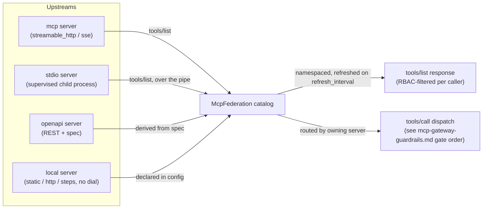

# MCP gateway

*Last modified: 2026-08-29*

SBproxy ships an MCP (Model Context Protocol) gateway that speaks
JSON-RPC 2.0 over HTTP POST. Configure the `mcp` action on an origin
and the proxy serves the MCP method set (`initialize`, `tools/list`,
`tools/call`, `resources/list`, `resources/read`, `prompts/list`,
`prompts/get`, `ping`), federates one or more upstream MCP servers,
and enforces gateway-level guardrails before any `tools/call` is
forwarded. The full method-by-method breakdown, including what the
gateway deliberately does not serve, is in
[Protocol coverage](#protocol-coverage) below.

This page is operator-facing. For the higher-level pitch, see
[`features.md`](features.md).

## Wire shape

```
POST /  HTTP/1.1
Host: mcp.example.com
Content-Type: application/json

{
  "jsonrpc": "2.0",
  "method": "initialize",
  "id": 1,
  "params": {}
}
```

`initialize` negotiates the protocol version (see below) and returns
the server identity plus a capability advertisement. `tools/list`
returns the aggregated tool catalog across every federated upstream.
`tools/call` routes by tool name to the owning upstream.
`resources/list` and `resources/read` pass the federated resource
surface through (the OpenAI Apps SDK / SEP-1865 UI-template path).
`prompts/list` and `prompts/get` do the same for the federated prompt
surface. `ping` returns `"pong"`. Notifications (requests with no
`id`) get a `202 Accepted`. Unknown methods return JSON-RPC error
`-32601` (`method_not_found`). The gateway serves this from
`crates/sbproxy-core/src/server/action_dispatch.rs`
(`handle_mcp_action`); the wire enums are in
`crates/sbproxy-extension/src/mcp/types.rs`.

## Protocol coverage

| Method | Served | Notes |
|---|---|---|
| `initialize` | yes | Negotiates the protocol version, advertises capabilities. |
| `ping` | yes | Returns `"pong"`. |
| `tools/list` | yes | Federated catalog, namespaced, RBAC-filtered per caller. |
| `tools/call` | yes | Routed to the owning upstream behind the guardrails, RBAC, and per-tool quotas. |
| `resources/list` | yes | Federated resource surface. |
| `resources/read` | yes | Routed to the upstream that owns the URI. |
| `prompts/list` | yes | Federated prompt catalog, namespaced the way tools are. |
| `prompts/get` | yes | Routed by namespaced prompt name to the owning upstream. |
| `completion/complete` | no | `-32601`. Argument autocompletion is not proxied. |
| `logging/setLevel` | no | `-32601`. Gateway log level is operator config, not a client knob. |
| `roots/list` | no | `-32601`. A client-side method; the gateway has no client of its own to ask. |
| `sampling/createMessage` | no | `-32601`. Server-initiated, so it needs a transport story the gateway does not have yet. |
| `elicitation/create` | no | `-32601`. Server-initiated, same reason as sampling. |

### Prompt namespacing

A federated prompt is namespaced on the same rules a federated tool
is. The first upstream to publish a given prompt name keeps it bare,
and the next upstream to publish that name is advertised as
`<prefix>.<name>`, with the `.` separator tools use rather than the
`/` resources use. Setting `namespace: always` on an upstream prefixes
every prompt from it whether or not anything collided.

Whatever name the gateway advertises is the name that routes, so a
client calls `prompts/get` with the name it read out of
`prompts/list`. The upstream still receives the name it published and
never has to know the gateway renamed anything, which is the contract
`resources/read` already holds for resource URIs.

An upstream contributes no prompts in three cases: it declared no
`prompts` capability during its handshake, its `prompts/list` failed,
or it is OpenAPI-backed (`type: openapi`), which is a REST spec with
no prompts to publish. None of the three fails the aggregate call. One
upstream without prompts does not blank the prompts of the upstreams
that have them, which is how the tool and resource catalogs already
behave.

### Capability advertisement

`initialize` advertises `capabilities.prompts` only when at least one
federated upstream declared that capability on its own handshake. A
gateway federating nothing but OpenAPI servers, or nothing but MCP
servers that serve only tools, advertises no prompts capability, and a
client reading the handshake knows not to ask.

The advertised object is `{"listChanged": false}`. The gateway's
server-to-client stream pushes `notifications/tools/list_changed` and
`notifications/resources/list_changed` and nothing else, so `true`
there would promise notifications that never arrive. This is the same
rule that keeps `2025-03-26` out of the supported version list:
advertising something whose contract the gateway breaks is worse than
not advertising it.

### Prompt access control

Prompts have no ACL of their own. `prompts/list` and `prompts/get` are
gated by the `rbac_policies` entry already bound to the owning
upstream, at server granularity. A caller reaches a server's prompts
when that server's policy allows the caller at least one tool the
server currently advertises. A caller denied every tool on an upstream
sees none of its prompts in `prompts/list`, and a `prompts/get` naming
one of them answers `unknown prompt` rather than confirming it exists.

Two edges follow from that definition. An upstream with no `rbac`
label resolves no policy and its prompts are readable, exactly as its
tools are callable; config compile refuses an unlabeled upstream once
any `rbac_policies` are declared, so this branch is the no-RBAC
deployment rather than a forgotten label. An upstream that publishes
prompts but no tools gives the policy nothing to decide against, so
the policy's own `default_allow` answers, and binding that server to a
policy with `default_allow: true` makes its prompts readable.

The `tool_allowlist` guardrail does not participate. It caps what the
gateway will call, which is a different question from who the caller
is.

## Protocol version negotiation

The gateway serves the revisions in `SUPPORTED_PROTOCOL_VERSIONS`
(`2025-06-18` today). On `initialize` it echoes the client's requested
`protocolVersion` when it is supported, otherwise it answers with the
newest revision it does support and lets the client decide whether to
continue. A post-initialize request carrying an unsupported
`MCP-Protocol-Version` header gets a `400`; a missing header follows
the spec's assumed-version rule. `2025-03-26` is deliberately absent:
that revision requires servers to accept JSON-RPC batches, which this
gateway does not, so a batch body returns a specific invalid-request
error rather than a silent mis-negotiation.

## The 2026-07-28 era

One endpoint serves both the established `2025-06-18` protocol and the
stateless `2026-07-28` one. A request selects the newer era by showing
positive evidence for it, and anything else is served exactly as it was
before this split existed:

- an `MCP-Protocol-Version: 2026-07-28` header, or
- an `Mcp-Method`, `Mcp-Name`, or `Mcp-Param-*` routing header, or
- an `io.modelcontextprotocol/*` marker in the request's `params._meta`.

An older or unrecognized revision in `MCP-Protocol-Version` is not
evidence of the newer era. It stays on the established path and gets the
same `400` it always did, so a client can still negotiate down through
`initialize`.

A `2026-07-28` request is stateless. It never receives an
`Mcp-Session-Id`, and it carries its own context on every call:
`io.modelcontextprotocol/protocolVersion` and
`io.modelcontextprotocol/clientCapabilities` in `params._meta`, plus
`MCP-Protocol-Version` and `Mcp-Method` as headers. `tools/call`,
`resources/read`, and `prompts/get` also send `Mcp-Name`. Header names
compare case-insensitively and values case-sensitively. A header that
disagrees with the body is refused rather than reconciled.

Successful results carry `resultType: "complete"` and
`io.modelcontextprotocol/serverInfo`. List and discovery results carry
`ttlMs: 0` and `cacheScope: "private"`, and every `listChanged` is
`false` because subscriptions are not implemented. Three error codes are
reserved for this era: `-32020` for a malformed or missing routing
carrier and `-32022` for an unsupported protocol version are both raised
on the request path today. `-32021` is reserved for a missing required
client capability; the constant and its HTTP-status mapping exist, but
no code path raises it yet.

The gateway deliberately does not advertise or serve subscriptions,
Tasks, MCP Apps, MRTR generation, or arbitrary protocol extensions on
this era. It answers `server/discover`, the tool, resource, and prompt
method set, and nothing beyond that.

### Trusting the endpoint's own origin

The newer era validates the browser `Origin` and the request authority
before it authenticates, reads a catalog, or contacts an upstream. That
check needs to know the endpoint's real public origin, so declare it:

```yaml
origins:
  "mcp.example.com":
    action:
      type: mcp
      mode: gateway
      modern_http:
        public_origin: "https://mcp.example.com"
        allowed_origins:
          - "https://console.example.com"
      federated_servers:
        - origin: https://tools.internal
          prefix: tools
```

An origin with an exact hostname derives its own anchor, so
`modern_http` is optional there. A wildcard hostname cannot, and without
`public_origin` every `2026-07-28` request to it is refused with a
`421`. That refusal is logged with the reason and the authority that was
rejected, and it is recorded as a `mcp_transport_denied` security audit
event so it reaches the same SIEM stream as every other denial. The
response body is empty on purpose so a disallowed origin learns nothing
about the endpoint.

The two ways of getting an anchor differ on the port, and only for the
request authority. An origin key is a hostname and carries no port, so a
derived anchor checks that the request is addressed to a name this
gateway serves and accepts whatever port the client dialed. A gateway on
`8080` works without configuration. A declared `public_origin` is you
writing down the URL clients use, port included, and is matched whole.

The browser `Origin` is compared with ports either way, because two
ports on one host are two origins and treating them as one would let a
page on `http://localhost:3000` drive a gateway on `http://localhost:8080`.
Under a derived anchor the comparison is against the request's own
origin, so the gateway's own pages are same-origin on whatever port it
runs. Anything else needs `allowed_origins`.

Behind a TLS-terminating load balancer, list the balancer in
`proxy.trusted_proxies`. The gateway takes the external scheme from
`X-Forwarded-Proto` only for peers in that list, and strips the header
from everyone else.

Misspelling a key inside `modern_http` fails config compilation rather
than being ignored, because every key here turns on a protection and a
typo would otherwise read as hardening that is not in effect.

## Minimal config

```yaml
proxy:
  http_bind_port: 8080

origins:
  "mcp.example.com":
    action:
      type: mcp
      mode: gateway
      server_info:
        name: my-mcp
        version: "1.0.0"
      federated_servers:
        - origin: github.example.com
          prefix: gh
        - origin: postgres.example.com
          prefix: db
      guardrails:
        - type: tool_allowlist
          allow:
            - gh.search_repos
            - db.query
```

Adapted from `examples/mcp-federation/sb.yml`. The wire-format
struct is `McpActionConfig` in
`crates/sbproxy-modules/src/action/mcp.rs`.

## Calling it

Nine examples exercise different parts of this page. The one that matches the
config above, and the one used here, is
[`examples/mcp-federation/`](../examples/mcp-federation/), because federation
is what the `mcp` action is for and because it is self-contained: it ships its
own upstream. For sessions, RBAC and quotas, progressive discovery, OAuth
discovery, tool versioning, or the supervised `stdio` transport, use the
example named for that feature
([`examples/mcp-stdio/`](../examples/mcp-stdio/) for the last one).

It runs as two processes. The first is a mock REST API that stands in for a
real service; the second is the gateway that federates it:

```bash
sbproxy serve -f examples/mcp-federation/upstream.yml &
sbproxy serve -f examples/mcp-federation/sb.yml
```

Every call below is an HTTP POST of a JSON-RPC envelope to the same URL. The
`Accept` header must offer both `application/json` and `text/event-stream`,
because the Streamable HTTP transport chooses between them per response:

```bash
curl -s -X POST http://127.0.0.1:8080 \
  -H 'Host: mcp.example.com' \
  -H 'Content-Type: application/json' \
  -H 'Accept: application/json, text/event-stream' \
  -H 'MCP-Protocol-Version: 2025-06-18' \
  -d '{"jsonrpc":"2.0","id":1,"method":"initialize","params":{"protocolVersion":"2025-06-18","capabilities":{},"clientInfo":{"name":"curl-demo","version":"1.0.0"}}}'
```

```json
{"jsonrpc":"2.0","result":{"capabilities":{"tools":{"listChanged":true}},"protocolVersion":"2025-06-18","serverInfo":{"name":"my-mcp","version":"1.0.0"}},"id":1}
```

`serverInfo` echoes the configured `server_info`, and the gateway answers this
locally without contacting any upstream, so `initialize` succeeds even with
every federated server down.

`tools/list` is where federation shows:

```json
{"jsonrpc":"2.0","id":2,"result":{"tools":[{"description":"Search repositories by query.","inputSchema":{"properties":{"q":{"type":"string"}},"required":["q"],"type":"object"},"name":"gh.search_repos"}]}}
```

One tool, not two. The config federates two servers: `gh`, an OpenAPI-backed
server pointed at the mock, and `db`, pointed at `postgres.example.com`, a
reserved placeholder that does not resolve. The catalog degrades per server
rather than failing as a whole, so `db` is dropped with a log line and `gh`
still answers. A federated catalog that silently shrinks is the failure mode
to watch for here: check `tools/list` against the servers you configured, not
against what your client happens to need.

Note that `gh.search_repos` came from an OpenAPI document. Its `inputSchema`
was derived from the spec's parameters, with no MCP server written for it.

Calling it dispatches a real HTTP request to the mock:

```bash
-d '{"jsonrpc":"2.0","id":3,"method":"tools/call","params":{"name":"gh.search_repos","arguments":{"q":"sbproxy"}}}'
```

```json
{"jsonrpc":"2.0","result":{"content":[{"text":"[{\"full_name\":\"soapbucket/sbproxy\",\"name\":\"sbproxy\",\"stars\":4200},{\"full_name\":\"soapbucket/docs\",\"name\":\"docs\",\"stars\":12}]","type":"text"}],"isError":false},"id":3}
```

The upstream's JSON is returned as a *string* inside a `text` content block,
which is what MCP specifies. A client parses that string; it is not a nested
JSON object.

The two failure shapes are distinct and worth telling apart. A tool the
`tool_allowlist` guardrail blocks never leaves the proxy:

```json
{"jsonrpc":"2.0","error":{"code":-32602,"message":"tool 'gh.delete_repo' is blocked by tool_allowlist guardrail"},"id":4}
```

`-32602` is JSON-RPC "invalid params": the gateway is saying the requested tool
is not one it will accept. A tool that is simply not in the registry reports
differently:

```json
{"jsonrpc":"2.0","error":{"code":-32603,"message":"tool call failed: unknown tool: db.query"},"id":5}
```

`-32603` is "internal error", and `unknown tool` here is a consequence of `db`
never answering `tools/list`, not of `db.query` being forbidden. Both are
`200 OK` at the HTTP layer, as JSON-RPC requires; the error lives in the
envelope. A client that checks HTTP status alone sees every one of these as a
success.

## `mcp` action fields

| Field | Type | Default | Notes |
|---|---|---|---|
| `mode` | string | `gateway` | Only `gateway` is implemented today. Unknown values fail config validation. |
| `server_info.name` | string | `sbproxy-mcp` | Returned in `initialize` responses. |
| `server_info.version` | string | `0.1.0` | Returned in `initialize` responses. |
| `rbac_policies` | map<string, ToolAccessPolicy> | `{}` | Named tool-access labels referenced by `federated_servers[].rbac`. |
| `federated_servers` | list | required, non-empty | Upstream MCP servers to aggregate. |
| `argument_policies` | list | `[]` | CEL or OPA-compatible Rego rules evaluated against the tool-call context (name, server, session, tenant, principal, parsed arguments) after RBAC and JSON-Schema validation, before dispatch. `mode: warn` (default) or `block`. See [mcp-security.md](mcp-security.md#a-permitted-tool-called-with-an-argument-that-should-not-be). |
| `result_policies` | list | `[]` | Same CEL/Rego shape as `argument_policies`, evaluated against the tool-call result (`mcp.result`) after dispatch and after `content_filters`, before the result reaches the caller. |
| `content_filters` | object | `{secrets: off, pii: off}` | Secret- and PII-shape detection over tool-call arguments (outbound) and tool-call results, `resources/read`, and `prompts/get` responses (inbound). Each of `secrets` / `pii` is `off` \| `warn` \| `redact` \| `block`. See [mcp-security.md](mcp-security.md#credentials-reaching-a-tool-that-should-not-see-them). |
| `flow` | object | `{mode: off}` | Deterministic session-flow enforcement (Meta's Rule of Two): `mode` (`off`/`warn`/`block`), `rule` (`two_of_three`/`taint_and_outbound`), `trusted_servers`, `sensitive_servers`, `sensitive_tools`, `outbound_tools`, `taint_reads`. See [mcp-security.md](mcp-security.md#a-session-that-reads-something-untrusted-then-tries-to-leave). |
| `mcp_audit` | object | `{capture_arguments: false}` | Opt-in redacted, size-bounded verbatim tool-call arguments on `mcp_governance_decision` evidence records. See [events.md](events.md) and [mcp-security.md](mcp-security.md#verbatim-argument-capture). |
| `guardrails` | list | `[]` | Gateway-level safety checks. |
| `progressive_discovery` | bool | `false` | Advertise `search` / `execute` meta-tools instead of the full catalog (see [`examples/mcp-progressive-discovery`](../examples/mcp-progressive-discovery)). |
| `oauth` | object | unset | RFC 9728 auth discovery (see the OAuth section below and [`examples/mcp-oauth-discovery`](../examples/mcp-oauth-discovery)). |
| `sessions` | object | unset | Streamable HTTP session management: `{enabled, ttl}` (see [`examples/mcp-sessions`](../examples/mcp-sessions)). |
| `egress` | object | unset | Default OpenAPI REST egress policy. See [mcp-gateway-guardrails.md](mcp-gateway-guardrails.md). |
| `token_compaction` | object | unset | Opt-in compaction for large MCP text result blocks. |
| `dual_llm_quarantine` | object | unset | Opt-in dual-LLM judge quarantine for untrusted MCP text result blocks (`enabled`, `endpoint`, optional `model` / `timeout` / `egress`). Fail closed; reason-code only. `egress` is an allowlist scoped to the judge endpoint alone (same shape as `federated_servers[].egress`); omitted, the judge call is ungated but still recorded in the egress inventory. See [mcp-gateway-guardrails.md](mcp-gateway-guardrails.md). |
| `refresh_interval` | duration | `60s` | How often the background task re-fetches upstream catalogs. Inbound requests always serve the cached snapshot; this is the only steady-state fan-out. |
| `upstream_connect_timeout` | duration | `5s` | TCP connect deadline per upstream exchange. |
| `upstream_timeout` | duration | `30s` | Whole-request deadline per upstream exchange (refreshes, calls, reads). Per-server `timeout:` can only shorten it for `tools/call`. |
| `max_upstream_response_bytes` | integer | `8388608` | Cap on upstream response bytes buffered per exchange. |
| `tool_versioning` | object | unset | Version-bump gate plus the tool rollout plane (`rollout:` publishes several versions of one tool, resolved per consumer). See [tool-versioning.md](tool-versioning.md). |
| `tool_pricing` | map<string, float> | `{}` | Per-tool USD cost for the usage-sink attribution. |
| `usage_sinks` | list | `[]` | Sinks for MCP tool-call usage rows (same shapes as the AI path). |

### `federated_servers[]`

| Field | Type | Default | Notes |
|---|---|---|---|
| `origin` | string | required | For an `mcp` server, a bare hostname (normalized to `https://<host>/mcp`) or a full URL. For an `openapi` server, the REST base URL. For a `local` server, a nominal label only; nothing is ever dialed there. |
| `type` | string | `mcp` | `mcp` speaks MCP to the origin; `openapi` derives tools from a spec and dispatches `tools/call` as REST (see the OpenAPI section below); `local` serves tools declared entirely in config, with no upstream dial at all (see [mcp-compose.md](mcp-compose.md)). |
| `spec` / `spec_path` | object / string | unset | Inline OpenAPI spec or a path to one, for a `type: openapi` server. Read at config load; a bad spec fails startup. |
| `tools` | list | `[]` | Locally defined tools for a `type: local` server: a static value, a single HTTP call, or a step DAG. Rejected on non-`local` servers. See [mcp-compose.md](mcp-compose.md). |
| `prefix` | string | derived from host | Namespace prefix applied to every tool from this upstream. Tools become `<prefix>.<tool>`. |
| `rbac` | string | unset | Label referencing a key in `rbac_policies`. Required on every server once `rbac_policies` is non-empty. Validated at config-load time. Enforced on every `tools/call`. |
| `timeout` | duration | unset | Caps each `tools/call` dispatch. Accepts `250ms`, `10s`, `2m`. |
| `transport` | string | `streamable_http` | `streamable_http`, `sse`, or `stdio`: one persistent supervised local child process per configured server, health-probed while idle and restarted under bounded backoff, with in-flight calls failing closed on a crash (see [mcp-gateway-guardrails.md](mcp-gateway-guardrails.md)). Not consulted for a `type: local` server. |
| `command` / `args` | string / list | unset | Required command and optional arguments for `transport: stdio`. The command is launched once and held as a session, not re-spawned per call. |
| `egress` | object | inherited | Per-server egress policy for this upstream's outbound dials: the OpenAPI REST calls a `type: openapi` server makes, the base MCP connect a plain `type: mcp` server makes over `streamable_http` or `sse`, or the HTTP calls a `type: local` server's `http`/`steps` tools make. `stdio` servers spawn a local process and never consult it. Required (no action-level fallback) on a `local` server that can make HTTP calls; omitted on `mcp`/`openapi` inherits the action-level `egress`, then allow-all (legacy, ungated). |
| `headers` | map<string, string> | `{}` | Static headers attached to every REST request a `type: openapi` server dispatches, e.g. a shared service credential. Values pass through `${VAR}` interpolation; keep secrets in the environment. Rejected on non-`openapi` servers. |
| `run_as_user_auth` | bool | `false` | Mint per-caller upstream `Authorization` via `upstream_auth` (never tool args). Rejected on `type: local` servers: a local tool dials with only its own `http.headers`, so a minted credential would be silently discarded. |
| `upstream_auth` | object | unset | Required when `run_as_user_auth` is true. See [mcp-gateway-guardrails.md](mcp-gateway-guardrails.md). |
| `protocol` | string | `auto` | `auto` negotiates and remembers, per tenant, the best MCP era this upstream has demonstrated; today that ceiling is `2025-06-18`, since outbound federation does not yet speak the modern era. Pinning `2025-06-18` never negotiates: any other answer is refused. Pinning `2026-07-28` is a config-compile error until outbound federation speaks it too. |
| `downgrade` | string | `warn` | `warn` or `block`. Applies only when `protocol: auto` and this upstream's contact looks weaker, on protocol era or auth posture, than what it has shown before. Auth posture is classified from the upstream's real response (a 401/407 means "required"; a clean unauthenticated success means "not required"). `warn` logs, allows, and emits an evidence event with verdict `warn`; `block` refuses until the operator pins `protocol` explicitly or edits this server entry. Applies to `tools/call`, `resources/read`, and `prompts/get` alike. |
| `status` | string | `approved` | `draft`, `approved`, or `deprecated`. Absent means `approved`, so existing configs are unaffected. `draft` hides this server's tools from `tools/list` and refuses every `tools/call` against them, naming the status in the refusal. `deprecated` keeps the server fully callable but emits a warn-level `mcp_governance_decision` event on every call, so a slow migration off a sunset server stays visible without an outage. |
| `approved_by` / `approved_at` | string | unset | Free-text, operator-attested record of who approved this server and when. sbproxy never verifies these values or requires them for `status: approved`; they are only stored and can be reviewed later. Changing them is audited the same way every other config edit is (`config_audit`), not by a dedicated event. |

A `rbac` value that does not match a key in `rbac_policies` is a hard
config error, and so is a server with no `rbac` label at all while
`rbac_policies` is non-empty; the error names the unlabeled server's
origin. Deliberate allow-all for one upstream is still expressible:
bind it to a policy with `default_allow: true`. An action that
declares no `rbac_policies` keeps the open behavior for every server.
(See `McpAction::from_parsed` in
`crates/sbproxy-modules/src/action/mcp.rs`.)

### `guardrails[]`

One entry type today, keyed by `type`:

```yaml
guardrails:
  - type: tool_allowlist
    allow: [gh.search_repos, db.query]
```

Multiple `tool_allowlist` entries are unioned. An empty `allow` list
denies every call. No guardrails means open access. Source:
`crates/sbproxy-modules/src/action/mcp.rs:McpGuardrailEntry`.

## Watching the catalog for tampering

A federated tool's name, title, and description reach the model at
`tools/list`, before anything is called. That makes the catalog itself a
place an upstream can influence behavior, and it is why approving
individual calls does not cover it: by the time a call is approved, the
text has already been read.

The gateway reports two classes of finding when it publishes a refreshed
catalog. Both are reports, not refusals. They change no bytes on the
wire, so they run for every deployment without being configured.

### Text a reviewer cannot see

Several Unicode ranges are invisible in a rendered catalog and plain
text to a model. The Unicode TAG block is the sharpest: every code point
in `U+E0000` to `U+E007F` mirrors an ASCII character and displays as
nothing at all, so a description can carry a full sentence past the
person approving it.

A finding names the tool, the field, and what it found:

```
WARN mcp.catalog kind=added field=description classes=tag_block
     tool=search server=alpha
     MCP advertised tool text conceals content from a reader
```

Counted on `sbproxy_mcp_concealed_text_findings_total{field, class,
kind}`, where `class` is one of `tag_block`, `bidi_control`,
`zero_width`, `variation_selector`, or `other_control`.

`variation_selector` covers `U+FE00` to `U+FE0F` and `U+E0100` to
`U+E01EF`, 256 invisible code points wide enough to carry a byte each
and the channel current smuggling work uses. This class has expected
false positives and is the one place the paragraph below is bent:
`U+FE0F` is the emoji presentation selector, and `U+E0100` onward is
the Ideographic Variation Sequence range that Japanese and Chinese
text uses to pick a specific glyph. A description ending in an emoji,
or written in CJK, is reported. That is deliberate, because the code
point a script needs and the code point a payload rides on are the
same code point, and the class is kept separate from `zero_width`
precisely so an operator can tell the noisy findings apart and set a
baseline for them.

Ordinary text in any language is never a finding. An Arabic or Hebrew
description contains right-to-left characters by nature; only the
explicit controls that reorder or hide are reported.

### Descriptions that read as instructions

The second class is the static tool-poisoning indicators: a path that
holds credentials, an instruction inside a markup comment that renders
as nothing, or text addressed to the model rather than to a reader.

```
WARN mcp.catalog kind=added field=description
     indicators=credential_path,model_directive
     tool=search server=alpha
     MCP advertised tool text carries a poisoning indicator
```

Counted on `sbproxy_mcp_poison_indicators_total{field, indicator,
kind}`.

**This is not injection detection, and nothing is blocked by it.**
Measured catch rates for content-based injection detectors on realistic
traffic are single digit, and attacks written against a published
defense break it. Treating this as a boundary would be a false sense of
one. What it gives you is a named, countable signal to review, and a
reason to look at a specific tool from a specific upstream.

The controls that *are* enforced are the deterministic ones: contract
pinning, which refuses a tool whose definition moved
([tool versioning](tool-versioning.md)); argument schemas, which refuse a
call whose arguments do not match what the tool declared; and the
namespacing below.

Both reports are edge triggered. A catalog that keeps advertising the
same finding says so once, when it appears and again when it clears, not
on every refresh.

### Keeping one upstream from speaking for another

A description from one server can name a tool belonging to a different
server, so that a model reading both is steered across the boundary. The
answer is structural rather than a scan: give every upstream its own
namespace, so a name always carries its owner and no description can
borrow another server's identity.

```yaml
federated_servers:
  - origin: "tools.internal"
    prefix: internal
    namespace: always
  - origin: "partner.example"
    prefix: partner
    namespace: always
```

With `namespace: always`, `internal.search` and `partner.search` are
distinct names from the moment they are advertised, rather than only
once they collide. Prefer it whenever more than one upstream is
federated and they are not equally trusted.

## Progressive discovery

Set `progressive_discovery: true` and `tools/list` advertises exactly
two meta-tools, `search` and `execute`, instead of the full federated
catalog. The agent calls `search` with a `query` to find relevant
tools, then `execute` with a tool `name` and `arguments` to invoke
one. This keeps a large catalog out of the model's context window.
See [`examples/mcp-progressive-discovery`](../examples/mcp-progressive-discovery).

## OAuth auth discovery (RFC 9728)

With an `oauth` block, the gateway serves OAuth 2.0 Protected Resource
Metadata at `/.well-known/oauth-protected-resource`, advertises a
pointer to it in the discovery manifest, and challenges a
credential-less MCP request with a `401` whose `WWW-Authenticate`
header names that metadata URL, which is where the MCP auth discovery
flow begins.

```yaml
oauth:
  authorization_servers: ["https://issuer.example.com"]
  scopes_supported: ["mcp.read", "mcp.call"]
```

The discovery-only form above is still supported. Add `broker` and
`resource_server` when this MCP action should own the OAuth flow and
validate its tokens in the same sbproxy process:

```yaml
oauth:
  authorization_servers: ["https://mcp.example.com/mcp/oauth"]
  scopes_supported: ["mcp.read", "mcp.call"]
  broker:
    base_path: /mcp/oauth
    external_base_url: https://mcp.example.com
    upstream_authorization_server_url: https://idp.example.com/authorize
    upstream_metadata_url: https://idp.example.com/.well-known/oauth-authorization-server
    upstream_token_endpoint_url: https://idp.example.com/token
    upstream_redirect_uri: https://mcp.example.com/mcp/oauth/callback
    resource_uri: https://mcp.example.com/
    allowed_redirect_uris: ["https://client.example.com/callback"]
    session_ttl_secs: 600
    broker_signing_key:
      pem: "${MCP_BROKER_SIGNING_KEY_PEM}"
      alg: ES256
      kid: broker-2026-08
      # The public half of the same key, with the same kid and alg.
      # Required: without it `/.well-known/jwks.json` serves an empty
      # key set while AS metadata advertises that URL as where the key
      # is, and every verifier that follows discovery rejects every
      # token this broker mints. Startup refuses the combination.
      public_jwk:
        kty: EC
        crv: P-256
        kid: broker-2026-08
        alg: ES256
        use: sig
        x: "${MCP_BROKER_SIGNING_KEY_X}"
        y: "${MCP_BROKER_SIGNING_KEY_Y}"
  resource_server:
    resource_uri: https://mcp.example.com/
    authorization_servers: ["https://mcp.example.com/mcp/oauth"]
    jwks_url: https://mcp.example.com/mcp/oauth/.well-known/jwks.json
    audience: https://mcp.example.com/
    issuer: https://mcp.example.com/mcp/oauth
    scopes_supported: ["mcp.read", "mcp.call"]
```

The action compiler requires the discovery and verifier authorization
servers/scopes to match. It also requires the broker and verifier to
use the same RFC 8707 resource URI. Protected MCP requests reach the
verifier before the catalog, request body, or upstream federation.
The device verification route receives user identity only from
sbproxy's completed authentication phase, and mTLS bindings receive a
certificate thumbprint only from the verified TLS connection.

When `resource_server.jwks_url` is the colocated broker's own
`/.well-known/jwks.json`, as above, the verifier takes the key set from
the broker in process and makes no HTTP request for it. That matters in
a cluster: `mcp.example.com` resolves inside a pod to a private address
or to a load-balancer VIP the pod cannot hairpin, and the OAuth egress
policy refuses both, so a network fetch of the proxy's own JWKS URL
would 401 every MCP request.

**One replica per broker.** The colocated broker holds its authorization
sessions, device codes, and PAR entries in the process that started
them, and `oauth.broker` has no key to point them at a shared store. A
second replica behind a load balancer receives the `/callback` for a
session replica one holds and rejects it, so roughly two logins in three
fail on three replicas. Run the broker-bearing action on one replica, or
embed the broker standalone against `sbproxy_storage::RedisStore` per
[mcp-oauth-gateway.md](mcp-oauth-gateway.md#storage-in-process-by-default-redis-for-multiple-replicas).
A multi-replica store selector under `oauth.broker` is not shipped.

[`GET /admin/mcp-oauth`](admin-api-reference.md#get-adminmcp-oauth) on
the proxy's admin listener reports every colocated broker and what each
has wired in, including whether a resource server is configured to
check the tokens it mints. The broker's own
`GET {base_path}/admin/status` is not mounted in process, because these
routes sit on the public MCP origin ahead of the verifier.

[`GET /admin/mcp-runtime`](admin-api-reference.md#get-adminmcp-runtime)
reports each federated server's runtime state (`starting`, `ready`,
`authRequired`, `error`, `stopped`), which is not the operator's
enable/disable intent, and any in-flight tool call blocked on a
step-up challenge. A scope escalation on one `tools/call` stays on
that call. The server keeps serving other calls. `requiredScopes` is
parsed from `WWW-Authenticate: Bearer scope="..."`, not from
`scopes_supported` in metadata. Metrics reuse
`sbproxy_mcp_tool_dispatch_total{result="server_auth_required"}` for a
server-level block and `{result="call_auth_required"}` for a per-call
step-up.

Every refusal this surface makes is visible: the resource server's 401,
the per-operation scope refusal, and each broker endpoint's 4xx write
`sbproxy_mcp_gateway_decisions_total{surface,decision}`, one
`mcp_gateway::decision` log line, and a typed decision-audit record
(`auth` for the broker and the verifier, `mcp.tool` for the scope
refusal). See [events.md](events.md).

With a `resource_server`, the verified token's scopes are also checked
per operation. `tools/call` needs `mcp.call`; every other method needs
`mcp.read`. A request whose token carries neither gets a JSON-RPC
`invalid_params` naming the scope it lacks, before the catalog, tool
policy, or upstream federation is touched.

The mapping is sbproxy's convention rather than something RFC 9728
fixes, so it applies only to the scope names above and only when
`scopes_supported` advertises them. Advertise a vocabulary of your own
and sbproxy does not enforce a per-operation mapping over it; the
authorization server owns that decision instead. Audience, issuer,
expiry, DPoP, and mTLS binding are checked either way.

That is a fail-open, and it is counted as one: every request the check
does not apply to increments
`sbproxy_mcp_gateway_decisions_total{surface="scope",decision="admitted_unadvertised"}`
and logs one line naming the scope that went unchecked. Watch it if you
publish a partial vocabulary. Advertising `["mcp.read"]` alone on an
action you meant to keep read-only admits every `tools/call`, because
`mcp.call` is not in the list for the check to enforce.

See [`examples/mcp-oauth-discovery`](../examples/mcp-oauth-discovery)
for the discovery-only shape and
[`examples/mcp-oauth-broker`](../examples/mcp-oauth-broker) for the
colocated broker plus resource server above, as a runnable `sb.yml`.
The full broker behavior and standalone
embedding API are documented in
[mcp-oauth-gateway.md](mcp-oauth-gateway.md).

For an MCP server that is not itself proxied through `sbproxy`, see
[mcp-oauth-gateway.md](mcp-oauth-gateway.md): a standalone OAuth 2.1
broker plus a resource-server companion, usable without running the
rest of `sbproxy` at all.

## Discovery manifest

Every origin whose action is the MCP gateway serves a discovery manifest at
two paths, unconditionally and with no config of its own: `GET
/.well-known/mcp-server` (the IETF `draft-serra-mcp-discovery-uri` path) and
`GET /.well-known/mcp/server-card.json` (the Cloudflare Agent-Readiness
alias). Both return the identical document, so an autonomous agent can learn
the gateway's endpoint, protocol version, transport, and tool catalog without
first opening a JSON-RPC session:

```json
{
  "name": "my-mcp",
  "version": "1.0.0",
  "protocolVersion": "2025-06-18",
  "transport": "streamable-http",
  "endpoint": "https://mcp.example.com/",
  "capabilities": { "tools": { "listChanged": false } },
  "tools": [{ "name": "gh.search_repos", "description": "Search repositories by query." }],
  "dnsDiscovery": {
    "record": "_mcp.mcp.example.com",
    "value": "v=mcp1; uri=https://mcp.example.com/.well-known/mcp-server"
  }
}
```

The `tools` list is the same per-caller view `tools/list` would return: the
`tool_allowlist` guardrail and the calling principal's per-server RBAC policy
both filter it, so the manifest never names a tool the gateway would refuse
to call for that caller. `dnsDiscovery` is always present and is a
recommendation, not a claim: SBproxy serves HTTP, not DNS, so it advertises
the `_mcp.{domain}` TXT record an operator can publish in their own zone
(`draft-morrison-mcp-dns-discovery` style) rather than publishing it itself.
When the action declares `oauth:`, the manifest also carries an
`authorization` pointer at the RFC 9728 protected-resource metadata URL, the
same one the `401` challenge names.

## OpenAPI-backed servers

A `federated_servers[]` entry with `type: openapi` turns an existing
REST API into governed MCP tools with no code: the gateway derives the
tools from an OpenAPI spec and dispatches each `tools/call` as a REST
request against the `origin`, substituting `{path}` parameters from the
arguments and sending the rest as a query string (GET) or JSON body.
The spec is read at config load (from inline `spec:` or `spec_path:`),
so a bad or missing spec fails startup rather than the hot path. These
tools live in the same registry as native MCP tools, so RBAC, quotas,
the version gate, and usage attribution all apply.

```yaml
federated_servers:
  - type: openapi
    origin: "https://api.internal"
    spec_path: "petstore.openapi.yaml"
    prefix: pets
```

When the REST upstream wants a shared service credential, declare it
as a static `headers:` entry on the server. The value resolves through
`${VAR}` config interpolation at load time, rides on every dispatched
REST request (including authorized redirect hops), and never appears
in tool arguments. A per-caller header minted by `run_as_user_auth`
wins over a static header of the same name, and declaring an
`authorization` entry alongside `run_as_user_auth` is a config error.

```yaml
federated_servers:
  - type: openapi
    origin: "https://api.internal"
    spec_path: "petstore.openapi.yaml"
    prefix: pets
    headers:
      authorization: "Bearer ${PETS_API_TOKEN}"
```

One self-referential use of this is pointing an `openapi` server at
the gateway's own admin API, which turns the admin surface into
governed MCP tools; [admin-mcp.md](admin-mcp.md) walks through that
setup end to end.

### What the bridge reads from a spec, and what it does not

The conversion is deliberately simple: one tool per `paths` operation,
built from the operation object alone. Knowing exactly which parts of a
spec it consumes tells you whether your API will bridge cleanly or
needs its spec adjusted first.

What is read:

- **Tool name**: an `x-mcp` / `x-sbproxy-mcp` `name` override, else
  `operationId`, else `method_path` derived from the method and path.
- **Description**: the extension's `description` override, else the
  operation's `summary`, else its `description`.
- **Input schema**: the operation's own `parameters[]` list. Each
  parameter contributes its `name`, its `schema` (copied verbatim), and
  its `required` flag.
- **Emission shaping**: per-operation `x-mcp: false` suppresses a tool;
  the object form overrides `name` / `description` / `scope`, with
  `x-sbproxy-mcp` winning over `x-mcp`. The value shape matches
  Speakeasy's `x-speakeasy-mcp`, so a spec annotated for that tool
  ports by renaming the key; the literal `x-speakeasy-mcp` key itself
  is not read. Root-level `x-mcp-defaults` (or
  `x-sbproxy-mcp-defaults`) carries `include_tags` / `exclude_tags`
  for whole-tag filtering.

The limits, each a consequence of "operation object alone":

- **`requestBody` is never read.** A POST or PUT operation's body
  schema does not appear in the tool's `inputSchema`, so a model
  calling the tool is never told which body fields exist, which are
  required, or what type they are. The body is still reachable: on a
  non-GET dispatch, every argument that does not match a `{path}`
  placeholder is sent as a top-level field of a JSON request body. But
  the caller has to know those fields from the description or from out
  of band, and only `application/json` bodies are produced; form and
  multipart request bodies cannot be expressed.
- **`$ref` is not resolved.** A parameter defined as a reference
  (`- $ref: "#/components/parameters/..."`) has no inline `name`, so it
  is skipped entirely and simply missing from the tool. A `schema`
  containing a `$ref` is copied into the `inputSchema` as-is, and the
  spec's `components` are not carried along, so the MCP client sees a
  dangling reference. Inline the schemas you need before pointing the
  gateway at the spec (most OpenAPI toolchains have a dereference or
  bundle command).
- **Parameter location (`in:`) is ignored.** Path, query, header, and
  cookie parameters all become flat `inputSchema` properties. At
  dispatch, an argument matching a `{placeholder}` in the path template
  is substituted into the path; everything else goes to the query
  string (GET) or the JSON body (non-GET), whatever the spec declared.
  An `in: header` or `in: cookie` parameter is never sent as an actual
  HTTP header or cookie. For a fixed upstream header, use the
  server-level `headers:` block above; for a per-caller credential,
  `run_as_user_auth`.
- **Path-item-level `parameters` are not read.** Parameters shared
  across operations by declaring them on the path item, rather than on
  each operation, do not reach any tool's schema. The same duplication
  a dereference pass does for `$ref` fixes this: push shared
  parameters down into the operations.
- **The spec's `servers` list is ignored.** Every dispatch goes to the
  configured `origin`, which is also what the egress policy
  authorizes. A spec whose `servers` point elsewhere does not redirect
  the gateway.

Everything past the schema is unaffected by these limits: RBAC,
quotas, `argument_policies[]`, egress authorization, and usage
attribution govern a bridged tool exactly as they do a native one.

## Local tool servers

A `federated_servers[]` entry with `type: local` serves tools declared
entirely in config: a fixed value, one HTTP call, or a dependency-ordered
DAG of HTTP calls shaped into a single response with a template,
JavaScript, or Lua. No upstream MCP server or OpenAPI spec is involved.

```yaml
federated_servers:
  - type: local
    origin: local-tools
    prefix: local
    egress:
      mode: deny_by_default
      hosts: [api.internal]
    tools:
      - name: status
        description: Fixed status blob.
        input_schema: { type: object, properties: {} }
        static: { ok: true }
```

A local tool publishes into the same catalog a federated tool does, so
RBAC, registry approval status, the version-bump gate, quotas, content
filters, and the governance evidence feed all apply unchanged. See
[mcp-compose.md](mcp-compose.md) for handler kinds, the interpolation
vocabulary, DAG semantics, response shaping, and the full governance
mapping, and
[`examples/mcp-local-tools`](../examples/mcp-local-tools/) /
[`examples/mcp-compose`](../examples/mcp-compose/) for runnable
configs.

## Sessions

With `sessions.enabled`, the gateway issues an `Mcp-Session-Id` on
`initialize`, requires it on every later request (`400` when missing,
`404` when unknown or expired, the client's cue to re-initialize), and
ends a session on `DELETE`. A GET with `Accept: text/event-stream`
opens the server-to-client stream that delivers
`notifications/tools/list_changed` and
`notifications/resources/list_changed` when the federated catalog
changes, which is what the `listChanged` capability advertises. Off by
default: the gateway is otherwise stateless. See
[`examples/mcp-sessions`](../examples/mcp-sessions).

## Usage attribution

Every `tools/call` records dispatch count and duration on
`sbproxy_mcp_tool_dispatch_*`. With a `tool_pricing` map, the resolved
USD cost also lands on `sbproxy_mcp_tool_cost_usd_total`, and with
`usage_sinks` configured the gateway emits one usage row per call
(provider `mcp`, the owning server as the model, the caller's
principal and tenant, latency, cost) into the same sink stream as
model spend, so tool spend is queryable next to it. Code-mode calls
(from the emitted `codemode.ts` runtime) are attributed to the
code-execution sandbox in the session ledger.

## Trace-context propagation

Every `tools/call` and `resources/read` the gateway forwards carries
the trace context of the request that caused it, so a tool call in an
upstream's logs can be joined back to the agent run that made it.

The context travels in the JSON-RPC body, inside the `params._meta`
block that
[SEP-414](https://modelcontextprotocol.io/seps/414-request-meta)
defines, under the key names `traceparent` and `tracestate`:

```json
{
  "jsonrpc": "2.0",
  "method": "tools/call",
  "id": 1,
  "params": {
    "name": "gh.search_repos",
    "arguments": {"q": "sbproxy"},
    "_meta": {
      "traceparent": "00-0af7651916cd43dd8448eb211c80319c-b7ad6b7169203331-01"
    }
  }
}
```

Those key names are bare. MCP otherwise requires a DNS-style prefix on
`_meta` keys, and SEP-414 carves out an explicit exception for trace
context: a namespaced spelling such as
`io.modelcontextprotocol.traceparent` would break trace and log
correlation for every tool that already knows what `traceparent`
means. An upstream reading `_meta` for trace context should read these
names exactly, with no prefix.

The body carries it rather than an HTTP header because one of the
three transports has no headers at all. A `transport: stdio` upstream
is a local child process that receives a line of JSON on stdin and
nothing else, which is the same reason run-as-user credentials are
refused on that transport. Putting the context in the body means an
upstream sees the identical field whether it is reached over
Streamable HTTP, over SSE, or over stdio.

A `type: openapi` upstream is the one exception, and only because it
is not MCP on the wire. Those calls dispatch as plain REST requests
with no JSON-RPC body to hold a `_meta` block, so they carry the same
context in a standard `traceparent` HTTP header instead. Redirects
that the egress policy authorizes carry it too.

### Turning it on

There is no MCP-side knob. The context comes from the proxy's own
tracing, so it appears once `proxy.observability.telemetry.enabled` is
`true`:

```yaml
proxy:
  observability:
    telemetry:
      enabled: true
      endpoint: "http://otel-collector:4317"
```

With telemetry off there is no trace to propagate, and the gateway
sends no `_meta` block rather than an empty or placeholder one, so an
upstream can tell an untraced call from a malformed one. See
[observability.md](observability.md) for the rest of that block.

### What does not carry it

Catalog refreshes do not. The `tools/list`, `resources/list`, and
`initialize` calls the federation makes on its own refresh schedule
are gateway housekeeping, not work done for a caller. Attributing a
background refresh to whichever request happened to be in flight when
the timer fired would be worse than leaving it uncorrelated: the
result would be wrong rather than absent.

## Submodules

The gateway is built on `crates/sbproxy-extension/src/mcp/`. The
`mcp` action is a thin wrapper that translates YAML into calls into
that library. Each submodule below is operator-visible either
through a YAML knob or a runtime behavior worth knowing about.

### JSON-RPC dispatcher

Dispatches `initialize`, `tools/list`, `tools/call`, `ping`,
`resources/list`, `resources/read`, `prompts/list`, and `prompts/get`.
Notifications (no `id`) get a `202 Accepted`. `initialize` answers
with the configured `server_info` plus a `capabilities` block; it
negotiates the protocol version, advertises `prompts` only when a
federated upstream declared it, and, when the host origin has
`agent_skills:` configured, sets
`capabilities.experimental.agentSkillsUrl` to the absolute URL of
`/.well-known/agent-skills/index.json` (see
[`agent-skills.md`](agent-skills.md)). The dispatcher lives in the
runtime, not the extension library:
`crates/sbproxy-core/src/server/action_dispatch.rs`
(`handle_mcp_action`). The `federation` submodule below holds the tool
aggregation, transports, and the injectable-source registry it calls
into.

No direct YAML knobs. The `server_info` block on the action shapes
the response.

### `types`: protocol envelopes

Defines `JsonRpcRequest`, `JsonRpcResponse`, `JsonRpcError`, the
standard error codes (`-32600` through `-32700`), and the MCP `Tool`
shape. Source: `crates/sbproxy-extension/src/mcp/types.rs`.

### `federation`: aggregate upstream catalogs

Fetches `tools/list` from every entry under `federated_servers` and
merges the results into one registry. Tool-name collisions are
resolved by prefixing the later entry with its server name. The
catalog is stored in an `ArcSwap` so refreshes do not block
in-flight `tools/call` traffic. Source:
`crates/sbproxy-extension/src/mcp/federation.rs:McpFederation`.

Every entry contributes through the same interface regardless of what
sits behind it: a real MCP server over `streamable_http`, `sse`, or a
supervised `stdio` child; a REST API bridged from an OpenAPI spec; or
tools declared entirely in config with no upstream at all
(`type: local`, see [mcp-compose.md](mcp-compose.md)).



A refresh cycle probes each MCP upstream's `initialize` once and
reuses that answer for the tool, resource, and prompt registries
alike, and a failure on one upstream never blanks the others: the
catalog degrades per server. `tools/call` and `resources/read` route
by the namespaced name back to the one owning server, whichever kind
it is.

The resource and prompt registries are built by the same refresh pass
and stored the same way. Each cycle probes every MCP upstream's
`initialize` exactly once and reuses that one answer for every
registry that needs to know what the upstream supports, so federating
another surface costs no extra handshake. The prompt pass then asks
only the upstreams that declared a `prompts` capability.

Refresh failures on one upstream are logged and the remaining
upstreams still contribute to the merged catalogs.

### `streamable`: Streamable HTTP transport

Default transport for upstreams. POST sends the JSON-RPC request;
the server may answer with `application/json` or
`text/event-stream`. Supports JSON-RPC batching via `send_batch`.
Selected with `transport: streamable_http` (or omit `transport`
entirely). Source:
`crates/sbproxy-extension/src/mcp/streamable.rs:send_request`.

### `sse_client`: legacy SSE transport

For upstreams that expose the older SSE handshake. Selected with
`transport: sse`. The client posts to the SSE URL and parses events
out of the response body; if the upstream replies with the two-leg
handshake (an `endpoint` event followed by a POST to that endpoint),
the client handles that path too. Source:
`crates/sbproxy-extension/src/mcp/sse_client.rs:send_via_sse`.

### `access_control`: principal-aware tool ACL

`ToolAccessPolicy` is the per-upstream ACL that gates every
`tools/call` and filters `tools/list`. The policy reads off the
inbound `Principal` (tenant, virtual key, team, project, role, sub),
walks an ordered `tool_access[]` rule list, and either allows or
denies the named tool. The policy is **default-deny**: an unknown
caller (no matching rule) is denied; an empty `allowed: []` is
"deny all". Operators who want the legacy open-by-default behavior
add `default_allow: true` to the policy.

A `tool_access[]` row may set `ttl` (same duration strings as
`tool_quotas[].rate.per`). That grant expires unless an operator renews
it. `grant_ledger.path` is required when any row sets `ttl`: without
a durable clock, a restart would silently extend every grant. An
elapsed grant is hidden from `tools/list` and refused on `tools/call`
with JSON-RPC `-32098`. Renew with `POST /api/mcp/grants/renew`.

```yaml
      grant_ledger:
        path: /var/lib/sbproxy/mcp-grants.json
      rbac_policies:
        analyst:
          default_allow: false
          tool_access:
            - principals: []
              allowed: [reports.hello]
              ttl: 8h
```

The legacy `key_permissions: { key: [tools] }` shape is gone.
See [`migration-mcp-rbac.md`](migration-mcp-rbac.md) for upgrade
walk-throughs.

#### Per-team allowlist

```yaml
rbac_policies:
  read_only:
    default_allow: false
    tool_access:
      - principals:
          - team: frontend            # exact match on attrs.team
            tenant_id: acme           # exact match on tenant_id
        allowed: [search_docs, list_projects]
      - principals:
          - role: admin               # any of attrs.roles
        allowed: ["*"]
federated_servers:
  - origin: github.example.com
    prefix: gh
    rbac: read_only
```

#### Virtual-key glob

```yaml
rbac_policies:
  frontend:
    default_allow: false
    tool_access:
      - principals:
          - virtual_key: vk_frontend_*    # trailing-* glob
        allowed: [search, list_projects]
```

#### Legacy open behavior

```yaml
rbac_policies:
  legacy_open:
    default_allow: true               # opt back in to allow-by-default
```

#### `tools/list` RBAC filter

`tools/list` now returns only the subset of the federated catalog
the inbound principal can call. The legacy schema returned the full
catalog even when the matching `tools/call` would be denied,
leaking tool names to callers that could not invoke them.

#### Per-tool quotas

`tool_quotas[]` enforces sliding-window quotas keyed on
`(tenant_id, principal_id, tool_name)`. A caller over quota gets
JSON-RPC error code `-32099`; the upstream is never contacted.

```yaml
rbac_policies:
  ops:
    default_allow: false
    tool_access:
      - principals:
          - role: admin
        allowed: ["*"]
    tool_quotas:
      - tool_name: delete_user
        principals:
          - team: frontend
        rate:
          per: 24h                   # accepts ms / s / m / h / d
          max: 5
```

The store is per-action and lives in process memory; SIGHUP reload
rebuilds the action and resets the counters.

A `per:` value outside `ms / s / m / h / d` is a hard config error
naming the policy and the rule, so a typo like `per: 1hour` refuses
the config instead of loading a quota nothing enforces.

The store tracks one window per `(tenant_id, principal_id, tool_name)`
and `principal_id` comes from the caller's virtual key or `sub`, so
the number of windows follows traffic rather than the policy. Windows
that have fully aged out are reclaimed automatically. Two ceilings
bound what is left: 10,000 live windows per tenant, and 100,000 across
the process. A tenant at its own ceiling is refused a window for any
principal it has not seen inside the current window, and every other
tenant is unaffected, so one tenant authenticating under many distinct
`sub` values cannot starve anyone else. The refusal is fail-closed and
uses the same `-32099` a caller over quota gets, on the grounds that a
limiter which cannot count is not a limiter.

Because it looks identical to a real quota rejection on the wire, the
refusal has its own counter: alert on
`sbproxy_mcp_tool_quota_registry_saturated_total`, which is non-zero
only when traffic is being refused for a capacity reason rather than a
policy one. A `warn` line naming the tool and which ceiling bound is
logged once per ceiling per process.

Source: `crates/sbproxy-extension/src/mcp/access_control.rs:ToolAccessPolicy`.

#### Gateway-originated approval (WOR-2454)

High-risk tools can require a human before dispatch. This is a
gateway hold, not MCP elicitation. TrueFoundry is the surveyed state
of the art for the same gate.

The hold binds to a **content snapshot** (tool-contract digest plus
canonical arguments), not the advertised tool name, so a rename
cannot consume another tool's approval. The caller's HTTP connection
is never held open: the gateway returns JSON-RPC `-32097` with
`hold_id`, `snapshot`, and `expires_at`. Retry the same snapshot after
`POST /api/mcp/approvals/{id}/approve`. Approval is single-use.
Unanswered holds expire fail-closed (default `hold_ttl: 15m`). The
admin console lists them at `/admin/ui/mcp-approvals`; the JSON
routes remain the scripting surface. A fresh Cedar Confirm park also
fires alert rule `mcp_confirm` on `proxy.alerting.channels`.

```yaml
      approval:
        store: /var/lib/sbproxy/mcp-approvals.json
        hold_ttl: 15m
        tools:
          - digest: "sha256:…"
          - name: "crm.delete_*"
```

A Cedar `@confirm` forbid parks the same way when `approval:` is set.
Without `approval:`, Confirm stays a refusal (`confirmation required:`).

### `openapi_convert`: OpenAPI-backed servers

`openapi_to_mcp_tools(spec)` converts an OpenAPI 3.x spec into MCP
tool definitions and `openapi_to_routes(spec)` derives the matching
`name -> (method, path)` routing table. A `federated_servers[]` entry
with `type: openapi` uses both: the gateway serves the derived tools
and dispatches `tools/call` as REST against the origin (see the
OpenAPI section above). Source:
`crates/sbproxy-extension/src/mcp/openapi_convert.rs`.

### `discovery`: the well-known manifest

Builds the JSON document served at `/.well-known/mcp-server` and
`/.well-known/mcp/server-card.json` (see [Discovery manifest](#discovery-manifest)
above) and the recommended `_mcp.{domain}` DNS TXT record. No YAML knob of
its own; it reads the same `server_info`, tool catalog, `tool_allowlist`,
RBAC, and `oauth` config every other part of the action already declares.
Source: `crates/sbproxy-extension/src/mcp/discovery.rs`.

### Prompt-linked audit

When a subscriber is attached to the `mcp_audit` tracing target, each
`tools/call` emits an `mcp_audit` event carrying the tool name,
arguments, the SEP-1865 `params.audit.cause` when present, the upstream
status, and the duration. The event is gated on that subscriber, so a
deployment that attaches none pays nothing; there is no separate YAML
knob for this specific event. The per-call spend and behavioral
record live in the session ledger below, not this event. Source:
`emit_mcp_prompt_audit` in
`crates/sbproxy-core/src/server/action_dispatch.rs`.

A related, `events:`-facing knob does exist: `mcp_audit.capture_arguments`
opts a dispatched call's `mcp_governance_decision` evidence event into
carrying the redacted, size-bounded call arguments too, independent of
whether anything subscribes to the `mcp_audit` tracing target above.
Off by default. See [mcp-security.md](mcp-security.md#no-usable-record-of-what-happened)
for the tradeoff and [events.md](events.md) for the event shape.

## Session ledger

SBproxy sits on the `tools/call` path, so it can record what an agent
did at the tool boundary, which tools, in what order, with what
arguments, instead of leaving you to reconstruct it from a transcript.
With the ledger enabled, each call appends one record to a session
ledger: an append-only, newline-delimited JSON (NDJSON) artifact that
behavioral evaluation can query directly. The record shape is the
canonical `session-ledger-v1` schema shared with mcptest, so a
production capture and an mcptest run speak the same format.

A ledger is one `header` record per session followed by one `tool_call`
record per call, in call order:

```json
{"type":"header","schema_version":"v1","session_id":"01J0...","started_at":"2026-06-05T12:00:00Z"}
{"type":"tool_call","session_id":"01J0...","agent_id":"planner","hop_index":0,"tool_name":"get_weather","server":"weather","params":{"city":"sf"},"result":{"content":[...]},"is_error":false,"started_at":"2026-06-05T12:00:01Z","duration_ms":42,"caller":"direct"}
```

Each record carries the session id, the zero-based `hop_index` (the
call's position in the session), the bare tool name and its server, the
redacted arguments and result, an error flag, and the round-trip
duration. `agent_id` comes from the resolved caller principal and is set
on multi-agent runs. `params` and `result` are redacted with the same
secret-stripping the access log uses, so keys and tokens never reach the
artifact.

Turn it on with a top-level `session_ledger:` block:

```yaml
session_ledger:
  enabled: true
  sink: file          # `logging` (default) or `file`
  path: ./ledger.ndjson   # required for `sink: file`
```

`sink: logging` emits each record as a structured `session_ledger`
tracing line, so an existing log pipeline captures the ledger with no
extra wiring. `sink: file` appends NDJSON to `path`, giving a single
developer the same `*.ndjson` artifact mcptest writes. When the block is
absent or `enabled: false`, the `tools/call` path pays a single atomic
load and emits nothing.

## End-to-end example

The full happy path lives at
[`examples/mcp-federation/sb.yml`](../examples/mcp-federation/sb.yml).
That fixture covers federated upstreams, prefix namespacing,
`tool_allowlist`, and a curl recipe for `initialize`, `tools/list`,
and `tools/call`. [use-case-mcp-federation.md](use-case-mcp-federation.md)
walks through that same fixture end to end, including a real
`type: openapi` upstream that runs with no external dependency.

## See also

- [`mcp-compose.md`](mcp-compose.md): the field reference for
  `type: local` servers -- handler kinds, interpolation vocabulary,
  DAG semantics, and response shaping.
- [`mcp-security-coverage.md`](mcp-security-coverage.md): the OWASP MCP
  Top 10 scorecard for the surfaces on this page.
- [`use-case-mcp-federation.md`](use-case-mcp-federation.md): the
  solution guide: problem, RBAC allowlist, and next steps.
- [`migration-mcp-rbac.md`](migration-mcp-rbac.md): upgrade
  walk-through for the principal-aware ACL and default-deny
  flip.
- [`agent-skills.md`](agent-skills.md): Agent Skills manifest
  advertised via `experimental.agentSkillsUrl`.
- [`cedar-policy.md`](cedar-policy.md): Cedar ABAC on federated
  `tools/call`. Compile at load, empty entity store, Confirm as a
  labelled refusal. Runnable: [`examples/cedar-mcp-full/`](../examples/cedar-mcp-full/).
- [`features.md`](features.md): feature overview that covers the
  MCP gateway in context.
- [`scripting.md`](scripting.md): CEL, Lua, JavaScript, and WASM
  hooks that shape MCP requests before dispatch.
