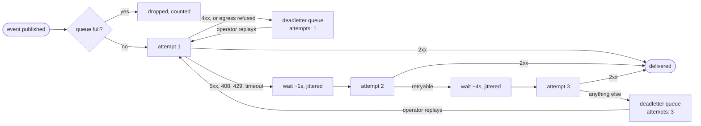

# Outbound notifications

*Last modified: 2026-08-27*

Webhook subscriptions for the people who are not you. Several destinations,
each with its own event filter and its own signing key, added and removed
through the admin API rather than by editing a config file, with retries and
somewhere for a delivery that never landed to go.

## This is not `events:`

Both feeds carry the same typed proxy events. They differ in who is at the
other end, and every design difference follows from that.

| | `events:` | `notifications:` |
|---|---|---|
| Destinations | One, from the config file | Many, managed at runtime |
| Filter | One `types:` list for the process | One per subscription |
| Signing key | One, from config or a vault ref | One per subscription, minted here |
| Retries | None. One attempt per batch | Up to three, backed off with jitter |
| A delivery that fails | Counted and gone | Deadlettered, inspectable, replayable |
| Shape | Batched NDJSON envelope | One event per POST |
| Who it is for | Your SIEM | Your customers |

There is no second event vocabulary. A webhook feed with its own event types
drifts from the SIEM feed, and then the two disagree about what happened.
[events.md](events.md) has the full list of what you can subscribe to.

## Enabling it

```yaml
proxy:
  admin:
    enabled: true
    port: 9090
    username: admin
    password: admin

  notifications:
    enabled: true
    store_path: /var/lib/sbproxy/notifications.redb
    queue_capacity: 4096
```

The store file holds the subscriptions and the deadletter queue. It is
created owner-only (`0o600`), at the mode the `open(2)` call asks for rather
than by a `chmod` afterwards.

It also holds live HMAC signing secrets. Unlike an inbound API key, a
signing secret cannot be stored as a one-way hash: the notifier re-derives a
signature on every delivery. Put the file on the volume you already trust
with the rest of your configuration. No read path returns a secret; the type
every listing returns has no field one could occupy.

## Creating a subscription

```bash
curl -s -u admin:admin -X POST \
  http://127.0.0.1:9090/admin/notifications/subscriptions \
  -H 'Content-Type: application/json' \
  -d '{"url":"https://customer.example.com/hooks/sbproxy",
       "event_types":["key_minted","key_revoked","agent_registration_decided"]}'
```

```json
{
  "subscription": {
    "subscription_id": "sub_01J8ZK5R3T2WQ9V0X7A1B2C3D4",
    "url": "https://customer.example.com/hooks/sbproxy",
    "event_types": ["key_minted", "key_revoked", "agent_registration_decided"],
    "signing_key_id": "k_01J8ZK5R3TA6P8N4M2K0J9H7G5",
    "active": true,
    "allow_firehose": false,
    "created_at": "2026-08-27T10:14:03Z",
    "updated_at": "2026-08-27T10:14:03Z"
  },
  "signing_secret": "b3f1...64 hex characters..."
}
```

`signing_secret` appears there and nowhere else. A receiver that loses it
rotates rather than reading it back.

A filter is one of three things: an exact event name, a family prefix like
`key_*`, or `*` for everything. Anything else is refused at creation rather
than silently selecting nothing, and an exact filter that does not match any
event name selects nothing rather than everything, which is the safe
direction for a rule that decides what leaves your network.

The family form keeps the separator in the prefix, so `key_*` selects
`key_minted`, `key_revoked`, `key_rotated`, and `key_blocked` and does not
select a future `keyless_auth_denied`. A prefix that matched mid-word would
hand a customer subscribed to the key family an event neither of you asked
for, with no config change on either side. `key*`, without the separator,
is refused at creation for that reason rather than stored and matched
loosely.

### The wildcard is a firehose, and it has to be said out loud

`request_started`, `request_completed`, and `request_error` fire once per
proxied request. A subscription that selects one of them is asking for one
HTTP POST per request, with three attempts and a five-second timeout each,
from a worker that runs at most 64 deliveries at a time. At 500 rps that is
not a rate this feature can serve, and the queue starts dropping within
seconds.

So a wildcard that reaches any of the three is refused unless the same call
says `allow_firehose: true`:

```bash
curl -s -u admin:admin -X POST http://127.0.0.1:9090/admin/notifications/subscriptions \
  -H 'Content-Type: application/json' \
  -d '{"url":"https://customer.example.com/hooks/sbproxy","event_types":["*"]}'
```

```json
{"error":"invalid event_types: \"*\" selects the per-request lifecycle events too, which is one webhook delivery per request; name the events you want, or set allow_firehose: true to say you meant it","code":"invalid"}
```

That covers `["*"]` and `["request_*"]` alike. Naming one of the three
exactly is not refused: that is you picking it, and the set is bounded by
what you typed.

What you get when you do set the flag: the queue is `queue_capacity` deep
(4,096 by default), a full queue **drops the event** and counts it under
`sbproxy_notify_deliveries_total{outcome="dropped"}`, and nothing on the
request path waits for your receiver. A proxy that blocked on a customer's
webhook endpoint is a proxy that customer can stall.

## Managing them

```bash
# List. No secret comes back.
curl -s -u admin:admin http://127.0.0.1:9090/admin/notifications/subscriptions

# Pause one without losing its id or its filters.
curl -s -u admin:admin -X PATCH \
  http://127.0.0.1:9090/admin/notifications/subscriptions/$SUB \
  -H 'Content-Type: application/json' -d '{"active":false}'

# Change where it points.
curl -s -u admin:admin -X PATCH \
  http://127.0.0.1:9090/admin/notifications/subscriptions/$SUB \
  -H 'Content-Type: application/json' \
  -d '{"url":"https://customer.example.com/hooks/v2"}'

# Mint a new signing key. The previous secret stops working immediately.
curl -s -u admin:admin -X POST \
  http://127.0.0.1:9090/admin/notifications/subscriptions/$SUB/rotate

# Remove it. Its deadletters stay: deleting the subscription does not
# un-miss what the receiver missed.
curl -s -u admin:admin -X DELETE \
  http://127.0.0.1:9090/admin/notifications/subscriptions/$SUB
```

The console asks before the last two. Rotating invalidates the receiver's
signing secret immediately and no read path returns the old one, and
deleting takes the filters and the key with it, so both need the customer
re-onboarded to undo.

## What a receiver gets

One POST per event per subscription:

```http
POST /hooks/sbproxy HTTP/1.1
Content-Type: application/json
User-Agent: sbproxy/1.13.0
X-Sbproxy-Event-Type: key_minted
X-Sbproxy-Event-Id: evt_01J8ZK5R3T2WQ9V0X7A1B2C3D4
X-Sbproxy-Subscription-Id: sub_01J8ZK5R3T2WQ9V0X7A1B2C3D4
X-Sbproxy-Delivery-Id: dlv_01J8ZK5R48HQ2M7N3P0R5S9T6V
X-Sbproxy-Attempt: 1
X-Sbproxy-Timestamp: 1787251963
X-Sbproxy-Signing-Key-Id: k_01J8ZK5R3TA6P8N4M2K0J9H7G5
X-Sbproxy-Signature: v1=9f2c...

{"source":"sbproxy","version":"1.13.0",
 "subscription_id":"sub_01J8ZK...","event_id":"evt_01J8ZK...",
 "event":{"event_type":"key_minted","hostname":"","tenant_id":"acme",
          "timestamp":1787251963173,"data":{"id":"a7237f88fdd6fb04","op":"create"}}}
```

Two ids, and the difference matters. `X-Sbproxy-Event-Id` is minted once,
when the event enters the queue, and is identical on every attempt and on a
replay: a receiver that stores seen ids treats a repeat as the duplicate it
is. `X-Sbproxy-Delivery-Id` is fresh per attempt, which is what tells one
attempt from another in a log.

### Verifying the signature

HMAC-SHA256 over `<timestamp>.<raw body>`, keyed with the subscription's
signing secret, the same construction the `events:` webhook sink uses, so a
receiver that already verifies one verifies the other:

```python
import hmac, hashlib
def verify(secret: str, timestamp: str, body: bytes, header: str) -> bool:
    mac = hmac.new(secret.encode(), timestamp.encode() + b"." + body, hashlib.sha256)
    return hmac.compare_digest("v1=" + mac.hexdigest(), header)
```

Compare the timestamp against your own clock and reject anything far outside
your tolerance, or a captured delivery replays forever.

## Retries, and where they stop



Three attempts, backed off with full jitter so a receiver coming back up is
not hit by every pending delivery on the same millisecond.

A `4xx` that is not `408` or `429` is not retried: a receiver answering
`400` will answer `400` again, and spending the budget on it delays
everything behind it. An egress-authorization refusal is treated the same
way, because it is a decision you made rather than a transient fault.

**This deliberately stops well short of the industry norm.** Svix and Stripe
both retry for roughly three days over fifteen to twenty attempts. Retrying
for three days means holding a delivery for three days, which is a durable
outbound spool with a scheduler, backpressure, and an operational surface of
its own, and a proxy is not a queue service. The deadletter queue plus the
replay endpoint is the recoverable version of the same guarantee, with the
holding made explicit rather than implicit: a nightly job that lists the
queue and replays it is a handful of lines of shell and you can see it.

## The deadletter queue

The listing is paged, oldest first, and carries no event bodies: the queue
holds up to 10,000 records each carrying a whole event, and the console
re-fetches it after every action.

```bash
curl -s -u admin:admin 'http://127.0.0.1:9090/admin/notifications/deadletters?limit=50'
```

```json
{"items": [{
  "delivery_id": "dlv_01J8ZK...",
  "subscription_id": "sub_01J8ZK...",
  "event_id": "evt_01J8ZK...",
  "event_type": "key_minted",
  "attempts": 3,
  "last_status": 503,
  "last_reason": "http_error",
  "moved_at": "2026-08-27T10:14:18Z"
}], "next": "dlv_01J8ZK..."}
```

`next` is the cursor for the following page and is `null` on the last one:
pass it back as `?after=`. `limit` defaults to 50 and is capped at 100.

`attempts` is what was actually tried, not the budget. A receiver answering
`400` deadletters after one attempt and says `1`; a receiver timing out
three times says `3`. That is the first thing to look at in a queue of mixed
records.

Read one with its event body, or drop one without replaying it:

```bash
curl -s -u admin:admin \
  http://127.0.0.1:9090/admin/notifications/deadletters/$DELIVERY

curl -s -u admin:admin -X DELETE \
  http://127.0.0.1:9090/admin/notifications/deadletters/$DELIVERY
```

`DELETE` is how a record whose stored event no longer deserializes leaves
the queue, since a replay of one refuses before it would have been removed.

```bash
curl -s -u admin:admin -X POST \
  http://127.0.0.1:9090/admin/notifications/deadletters/$DELIVERY/replay
```

```json
{"event_id": "evt_01J8ZK...", "replayed": true}
```

A replay re-sends under the original `event_id`, and the record is removed
only once the worker has taken the delivery. If the delivery queue is full
the answer is `429` and the record stays:

```json
{"error":"the delivery queue is full; this deadletter was kept, retry once it drains","code":"queue_full","replayed":false}
```

**Check `replayed` in a drain script.** The queue is `queue_capacity` deep
and the worker spends up to twenty seconds per delivery against a receiver
that may still be flaky, while a shell loop issues admin calls in
milliseconds. A loop that ignores the refusal will run far ahead of the
worker and get nothing but `429`s; one that backs off drains the queue.

Those refusals are counted under `outcome="replay_refused"` and not under
`dropped`, so a drain that outruns the worker does not move a series
operators alert on as lost events. Nothing was lost: the record is still
there.

The cost of removing the record last rather than first is that a replay
which is taken and then fails again writes a fresh record, so draining
against a receiver that is still down leaves the queue non-empty. That is
one record per pass, and it is recoverable. Removing it first was not: a
full queue destroyed the record and reported success.

The queue holds at most 10,000 records. Past that the oldest is dropped, a
`warn` line says so, and
`sbproxy_notify_deliveries_total{outcome="deadletter_evicted"}` counts it.
A queue pinned at its ceiling is losing history rather than holding it,
which is the difference between a bounded queue and a silently lossy one.

## What an operator can see

The admin console has a **Notifications** page: the subscriptions, the
deadletter queue, and a replay button.

| Family | Labels | Reading it |
|---|---|---|
| `sbproxy_notify_deliveries_total` | `outcome` | `delivered`, `retried`, `deadlettered`, `dropped`, plus `deadletter_evicted`, `deadletter_failed`, `serialize_error`, `worker_stopped`, and the admin mutations (`create`, `update`, `rotate`, `delete`, `replay`, `discard`). Alert on `deadlettered`: it is the only outcome that needs a human. The four loss outcomes, `dropped`, `deadletter_evicted`, `deadletter_failed`, and `worker_stopped`, all mean events nobody will ever receive. `replay_refused` is not one of them: the record was kept and the caller was told to retry, which is why it is counted apart. |
| `sbproxy_notify_queue` | `collection` | `subscriptions` and `deadletters`. A configured notifier publishes both at zero on boot, so no data means it is not configured. |

Neither family is labeled by subscription id or destination. Both are
operator-supplied and unbounded, and a per-destination series set grows with
your customer list rather than with the system. The subscription id is in
the log line and in the deadletter record, which is where you look when one
receiver is the problem.

The embedded store is counted separately on
`sbproxy_embedded_store_operations_total{store="notifications"}`.

## What this does not do

It does not preserve order. Deliveries are attempted concurrently across
subscriptions, and a retry reorders against a later event. A receiver that
needs a sequence reads the event's own `timestamp`.

It does not deliver to a subscription created after the event was published.
The subscription set is snapshotted when the event reaches the worker.

It does not queue without bound. The hand-off queue is `queue_capacity`
deep, at most 64 deliveries are in flight at once, and an event that arrives
with no room is dropped and counted rather than making a request wait. A
receiver that is down slows its own subscription and not the others: each
delivery holds one of the 64 slots.

It does not flush on shutdown. The notifier is installed process-wide and is
never dropped, so `SIGTERM` ends the process with whatever is queued still
queued. What is lost is what had not yet been picked up. The tamper-evident,
survives-the-process channel is `audit.sink: chain`; see
[audit-log.md](audit-log.md).

## Related

- [events.md](events.md) - the typed events, and the `events:` SIEM feed.
- [admin-api-guide.md](admin-api-guide.md) - login, CSRF, and roles for the calls above.
- [agent-registry.md](agent-registry.md) - the other subsystem on the same embedded store.
- [observability.md](observability.md) - the metric conventions the labels above follow.
