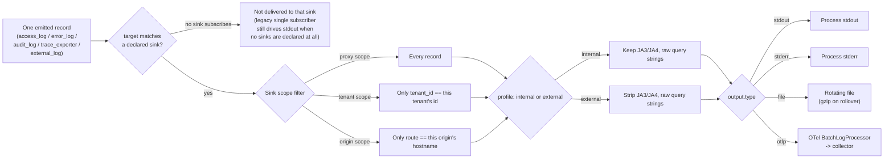
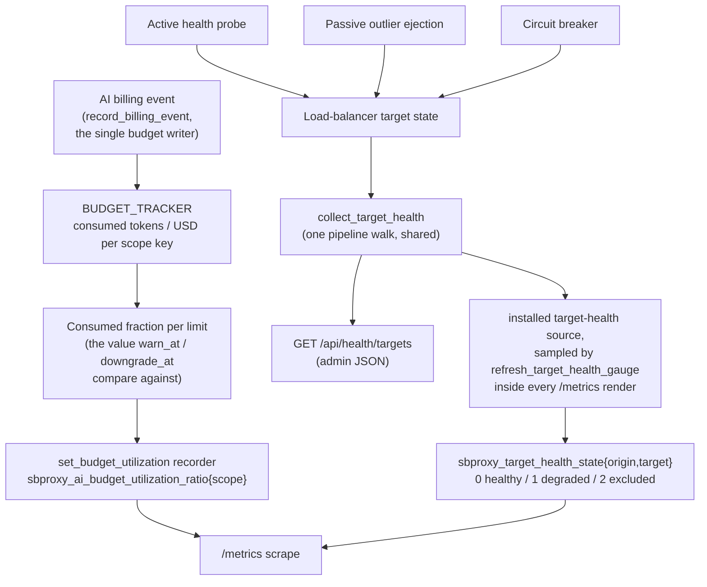

# Observability
*Last modified: 2026-08-28*

SBproxy ships metrics, logs, and traces from one process. This guide covers the Wave 1 substrate: the SLO catalog, the metric label budget, the log schema and redaction policy, the trace propagation contract, the health endpoints, the dashboards, and the reference Compose stack you can boot in one command.

This is the umbrella page: the cross-cutting mechanics (sinks, redaction, sampling, correlation ids, spans, dashboards, alerts) live here, and three companion pages own the record shapes and compatibility promises this page only points at. [access-log.md](access-log.md) is the per-request access-log schema (opt-in, one JSON line per completed request). [audit-log.md](audit-log.md) is the admin-action and tamper-evident audit trail (four independently opt-in chained channels). [metrics-stability.md](metrics-stability.md) is the generated catalog of every metric SBproxy emits and what is promised about its name. Start here for how the pillars fit together; go to those three for the field-by-field reference.

## Three pillars

| Pillar | Surface | Default state | Where it goes |
|---|---|---|---|
| Metrics | `/metrics` (Prometheus / OpenMetrics) | Always on | Prometheus, scraped on a 15 s cadence |
| Logs | `stdout` and configurable sinks | Always on, JSON-line | Loki, S3, customer collectors |
| Traces | OTLP exporter | Off by default; opt in per deployment | Tempo, Jaeger via the OTel Collector |

All three speak the same correlation triple: every log line and every span attribute carries `request_id` (UUIDv7 rendered as 32 lowercase hex chars without hyphens; RFC 9562 monotonic + time-ordered), `trace_id` (32-hex), and `span_id` (16-hex). One inbound 402 with one trace stitches metrics, logs, and traces together without join-by-timestamp. The UUIDv7 leading 48 bits are a Unix-millisecond timestamp so a ClickHouse `ORDER BY request_id` partitions naturally by ingest time.


The correlation_id policy threads one identifier through logs, webhooks, and the upstream ([config](../examples/correlation-id/)).

## Configuration

The currently shipped schema lives under `proxy.observability:` and groups the
log sinks, redaction, and custom-field surfaces with the `telemetry` (OTLP
exporter) block, plus the process logger's own `level` and `format`.

```yaml
proxy:
  observability:
    log:
      level: info        # trace | debug | info | warn | error, or a
                         # per-target filter like sbproxy_ai=debug,h2=warn
      format: compact    # compact | pretty | json
      # Sinks, redaction, and custom fields configure the fan-out.
      # Each sink may select its own format.
      sinks: []
    telemetry:
      enabled: true
      endpoint: "http://otel-collector:4317"
      transport: grpc              # grpc | http
      service_name: "sbproxy"
      sample_rate: 0.1             # head ratio for unsampled roots
      always_sample_errors: true   # 100% on 5xx / policy block paths
      keep_over_budget_usd: 1.00   # keep completed traces at/above this cost
      keep_slower_than_secs: 2.0   # keep completed traces at/above this latency
      propagation: w3c             # w3c | b3 | jaeger
      resource_attrs:
        deployment.environment: "prod"
        service.version: "${SBPROXY_VERSION}"
      export_metrics: false        # mirror metrics over OTLP
      metrics_interval_secs: 30
```

`sample_rate` controls normal traffic with parent-based trace-id ratio sampling. Inbound sampled W3C parents are kept. Locally dropped spans are still recorded until completion so `always_sample_errors`, `keep_over_budget_usd`, and `keep_slower_than_secs` can export the traces operators usually need most.

### Which log level and format the process actually uses

Four sources can name a filter and three can name a format. The most specific one wins, and this table is the whole order:

| Rank | Filter | Format |
|---|---|---|
| 1 | `--log-level`, or `SB_LOG_LEVEL` when the flag is absent | `--log-format`, or `SB_LOG_FORMAT` when the flag is absent |
| 2 | `RUST_LOG` | none |
| 3 | `proxy.observability.log.level` | `proxy.observability.log.format` |
| 4 | `info` | `compact` |

A deployment that exports `RUST_LOG` today keeps resolving to `RUST_LOG` whatever its `sb.yml` says. The YAML rank is what a deployment gets when it passes no flag and exports no variable, which used to mean it silently got `info` and `compact` instead.

Two more inputs sit outside the table. `--request-log-level` and `SB_REQUEST_LOG_LEVEL` append an `access_log=<level>` directive to whichever rank won, so they narrow one target rather than replacing the filter. `PUT /admin/log-level` swaps the filter on a running proxy and outranks everything until the process exits or a config reload re-asserts the file.

`level` and `format` differ on reload:

| Key | On SIGHUP, admin reload, or a file-watcher pass |
|---|---|
| `proxy.observability.log.level` | Applied. A process started with `--log-level`, `SB_LOG_LEVEL`, or `RUST_LOG` keeps that override instead, for its whole life. A reload that installs the file's level also discards a level set earlier through `PUT /admin/log-level`. |
| `proxy.observability.log.format` | Ignored. Restart to change it. The output layer is built once at startup and the runtime reload handle covers the filter alone. |

An unparseable `level` leaves the running filter alone and logs a warning; an unrecognized `format` is named on stderr at startup and falls back to `compact`.

`proxy.observability.log.sampling` is the one knob in this block that does nothing. The emitter has no sampling call site, so no rate is applied at any level and the process logs every line whatever `info`, `debug`, and `trace` are set to. To throttle request logs, use `access_log.sample_rate` in [access-log.md](access-log.md), which is a different key with a live consumer.

### Sinks

The `observability.log.sinks:` block fans every emitted structured-log record out to one or more declared sinks. Each sink picks its own destination (stdout, stderr, rotating file, OTLP collector), wire format, and redaction profile. When no sinks are declared the legacy single tracing subscriber drives stdout exactly as it did before; the fan-out path only lights up once the operator declares at least one sink.

```yaml
proxy:
  observability:
    log:
      sinks:
        - name: stdout
          target: access_log
          format: json
          output: { type: stdout }
          profile: internal
        - name: stderr-audit
          target: audit_log
          format: json
          output: { type: stderr }
        - name: file-archive
          target: audit_log
          format: json
          output:
            type: file
            path: /var/log/sbproxy/audit.json
            max_size_mb: 100
            max_backups: 7
            compress: true
          profile: internal
        - name: otel-collector
          target: access_log
          format: json
          output:
            type: otlp
            endpoint: http://otel-collector:4318/v1/logs
            transport: http
            timeout_secs: 5
          profile: external
```

Field schema:

* `name` is unique within the declaring scope. Duplicates within a scope are warn-logged today and reserved for a hard reject in a follow-up patch.
* `target` selects the internal channel: `access_log | error_log | audit_log | trace_exporter | external_log`. A sink only sees records emitted on the channel it subscribes to.
* `format` selects this sink's wire format. When omitted it defaults to `json`; `pretty` re-renders with indentation. The legacy parent `proxy.observability.log.format` field is config-only and does not supply this value.
* `output` is the where: see the four output types below.
* `profile` is the redaction shape: `internal` keeps JA3/JA4 fingerprints and raw query strings; `external` strips them. Proxy-scope sinks default to `internal`; tenant- and origin-scope sinks default to `external` because the downstream backend is usually outside the operator's trust boundary.

### Output types

| `type` | Fields | Notes |
|---|---|---|
| `stdout` | (none) | Locks the process stdout per write. Default for a freshly-installed proxy. |
| `stderr` | (none) | Useful for routing the audit channel separately from access on systemd-journald. |
| `file` | `path`, `max_size_mb`, `max_backups`, `compress` | Reuses the access-log rotation + gzip stack. Defaults: 100 MiB rotation, 7 backups, gzip on. |
| `otlp` | `endpoint`, `transport`, `timeout_secs` | Wraps `opentelemetry_otlp::LogExporter` behind a batch processor. Inherits `service_name`, `resource_attrs`, and (when omitted) `transport` from the top-level `telemetry:` block. |

#### When a `file` sink cannot write

Every way a file sink can lose a record is counted on
`sbproxy_telemetry_dropped_total{kind="file_sink",reason}`, so a sink that
has silently stopped growing is visible without reading the log stream it
stopped writing to. The reasons are closed:

| `reason` | What happened | Record |
|---|---|---|
| `mkdir_failed` | The parent directory could not be created | Lost |
| `open_failed` | The file could not be opened for append (a permission change, a path that is now a directory) | Lost |
| `write_error` | The append itself failed after a successful open: a full volume, a read-only remount, a failing disk | Lost |
| `rotate_failed` | Rotation at `max_size_mb` failed | Kept, appended to the over-size file |

`rotate_failed` rides the same family because the sink is degraded and an
operator has to act, but it is the one reason that did not lose anything, so
the alert for data loss excludes it:

```promql
sum by (reason) (
  rate(sbproxy_telemetry_dropped_total{kind="file_sink", reason!="rotate_failed"}[5m])
) > 0
```

Alert on `rotate_failed` separately. It means the active file is growing past
`max_size_mb` with nothing pruning it, which ends as a full volume and then as
`write_error`.

Each of these also logs one WARN naming the path and the OS error, rate-limited
to one per minute per sink path and per failure kind: the failures persist
until an operator fixes them and the write path runs once per record, so an
unthrottled warning would be a second log flood on top of the first problem.
Keying the throttle on the kind as well as the path is what stops a rotation
failure from swallowing the append failure a second later. Alert on the
counter, not on the line.

### Sink scopes

Sinks can be declared at three scopes, each with a different filter:

* `proxy.observability.log.sinks:` (proxy scope) receives every record. This is where general-purpose stdout / file / OTLP sinks live.
* `tenants[].observability.log.sinks:` (tenant scope) receives only records whose resolved `Principal.tenant_id` matches the tenant `id`. Cross-tenant records never reach a tenant-scoped sink.
* `origins[].observability.log.sinks:` (origin scope) receives only records whose stamped `route` matches the origin's hostname. Useful for an origin that ships its logs to a tenant-specific Loki instance.

A worked example with two tenants:

```yaml
proxy:
  tenants:
    - id: acme
      observability:
        log:
          sinks:
            - name: acme-loki
              target: access_log
              output:
                type: otlp
                endpoint: http://loki-acme:4318/v1/logs
                transport: http
    - id: beta
      observability:
        log:
          sinks:
            - name: beta-stdout
              target: access_log
              output: { type: stdout }
              profile: external
```

A record emitted with `tenant_id = Some("acme")` reaches only `acme-loki`; a record with `tenant_id = Some("beta")` reaches only `beta-stdout`; a record without a tenant id reaches neither tenant sink but still reaches any proxy-scope sinks.



A given record can reach several sinks at once: every proxy-scope sink that subscribes to its `target`, plus every tenant-scope and origin-scope sink whose filter matches. Each sink picks its own `profile` and `output`, so the same record can leave the process once redacted for an external Loki and once unredacted for an internal file, from one emission.

### OTLP-logs exporter

The `otlp` output ships each line through an OpenTelemetry `BatchLogProcessor` to the configured collector. Every record stamps the OTel resource attributes `service.name = sbproxy` (or the operator's override), `service.version = <crate version>`, and `service.instance.id = <hostname>`; any `telemetry.resource_attrs:` entries layer on top.

The level-to-severity mapping follows the OTel spec:

| Structured-log level | OTel `SeverityNumber` |
|---|---|
| `trace` | 1 |
| `debug` | 5 |
| `info` | 9 |
| `warn` | 13 |
| `error`, `fatal` | 17 |

A reference Collector pipeline that accepts these logs and forwards them on to Loki:

```yaml
receivers:
  otlp:
    protocols:
      http:
        endpoint: 0.0.0.0:4318
      grpc:
        endpoint: 0.0.0.0:4317

processors:
  batch:
    timeout: 5s
    send_batch_size: 1024

exporters:
  # Loki 3.x accepts native OTLP at /otlp; no Promtail or Fluent Bit needed.
  otlphttp/loki:
    endpoint: http://loki:3100/otlp
    tls:
      insecure: true

service:
  pipelines:
    logs:
      receivers: [otlp]
      processors: [batch]
      exporters: [otlphttp/loki]
```

Operators that already run an OTel Collector for traces can add the `logs` pipeline above and point the proxy's OTLP-logs sink at the same endpoint. The batch processor in the sink keeps the proxy's hot path non-blocking; flushes happen on SIGHUP and on shutdown.

## Metrics

### Naming and labels

Every metric name starts with `sbproxy_`. The label set is closed: a label that is not on the budget table below is a CI failure. The closed set protects the scrape from cardinality blow-ups when an attacker rolls a fresh UA per request.

The Wave 1 substrate adds five labels: `agent_id`, `agent_class`, `agent_vendor`, `payment_rail`, `content_shape`. `agent_id`, `agent_class`, and `agent_vendor` are bounded to the agent-class registry plus three reserved sentinels (`human`, `unknown`, `anonymous`); `payment_rail` and `content_shape` are closed enums.

### SLO catalog

| ID | Pillar | SLI | Target | Window | Tier on breach |
|---|---|---|---|---|---|
| SLO-AVAIL-INBOUND | Substrate | inbound request availability (non-5xx / total) | 99.9% | 30d | Page |
| SLO-LATENCY-P95 | Substrate | inbound p95 latency excl. rail wait | < 30 ms | 5 min sustained | Ticket |
| SLO-LATENCY-P99 | Substrate | inbound p99 latency excl. rail wait | < 50 ms | 5 min sustained | Page |
| SLO-LEDGER-REDEEM | Ledger | redeem success rate | 99.95% | 30d | Page |
| SLO-LEDGER-LATENCY | Ledger | redeem p99 latency | < 200 ms | 5 min sustained | Ticket |
| SLO-RAIL-SETTLE | Rails (per rail) | settle success rate | 99.5% | 7d | Page |
| SLO-RAIL-QUORUM | Rails | facilitator quorum (>= 1 healthy per chain) | 100% | instant | Page (immediate) |
| SLO-AUDIT-WRITE | Audit | batch-write success | 100% | 24h | Page (immediate) |
| SLO-AUDIT-LATENCY | Audit | emit-to-durable latency p99 | < 5 s | 1h sustained | Ticket |
| SLO-DR-RESTORE | DR | restore drill | succeed monthly | calendar | Page on missed |
| SLO-CONFIG-RELOAD | Config | hot-reload success | 100% | 24h | Page |
| SLO-BOT-AUTH-DIR | Bot Auth | directory freshness (TTL not exceeded) | 99.9% | 7d | Ticket |
| SLO-CERT-STORE | Certs | configured certificate-store backend open (not degraded to in-memory) | 100% | continuous | Ticket |
| SLO-CARD-BUDGET | Substrate | per-metric series count under cap | 100% | continuous | Log-only (CI gate) |
| SLO-AI-ADMISSION | AI Gateway | requests admitted past the inbound shim (1 - pre-provider refusal share, per surface) | 95% | 15 min sustained | Ticket |
| SLO-AI-STREAM-COMMIT | AI Gateway | committed provider responses that stream to completion, per provider (guardrail terminations excluded) | 99% | 15 min sustained | Ticket |
| SLO-MESH-ADMISSION | Mesh | inbound peer connections admitted (the idle reclaim is not a refusal and is excluded) | 100% | 10 min sustained | Ticket |
| SLO-STORAGE-OPS | Storage | storage backend operations returning no error | 99.9% | 10 min sustained | Ticket |

PromQL recording rules pre-compute each SLI at 1m, 5m, 1h, 6h, and 24h windows. Burn-rate alerts use the multi-window pattern from the SRE workbook (5m AND 1h at 14.4x for page tier, 30m AND 6h at 6x, 1h AND 24h at 3x for ticket). The full rule set lives in `deploy/alerts/`. These are the rules to page on. The proxy also evaluates one availability burn rate in process, covered under [Alerts](#alerts), and it is a fallback for deployments with no scrape target rather than a second copy of the set above.

### Cardinality budget

Every family below is emitted by running code. That is worth stating because it has not always been true here. A budget row reads as a promise that the series exists, since a cap is something you only put on a dimension of something being emitted, and four rows in this table were not that. Three named families that are declared and scraped while nothing increments them, and one, `sbproxy_dedup_cache_size`, that was not declared anywhere in the proxy at all while its own row said it drove an alert. An operator building from those rows got a panel drawing a flat zero and an alert that could not fire. Families that are declared but not yet written are listed as `config_only` in [metrics-stability.md](metrics-stability.md); check there before building a panel. A drift guard in `crates/sbproxy-observe/tests/metric_drift.rs` now fails the build if one of them reappears here, or in a dashboard or alert rule.

| Metric family | Cardinality cap | Notes |
|---|---|---|
| `sbproxy_requests_total` | 50 000 | Labels: `hostname`, `method`, `status`, `agent_id`, `agent_class`, `agent_vendor`, `payment_rail`, `content_shape`. `agent_id` is the sanitized registry id, never a raw UA-derived value. There is deliberately no `tenant_id` here. This is the substrate traffic counter, it already carries eight dimensions, and a ninth multiplies its series count by the number of tenants a config declares. Per-tenant request attribution is on `sbproxy_inbound_key_requests_total` instead, which carries `tenant_id` and is written from the same point in the response path, so the two counters are directly comparable. |
| `sbproxy_request_duration_seconds_bucket` | 100 000 | Labeled by `hostname`, plus buckets. |
| `sbproxy_policy_triggers_total` | 20 000 | Labels: `origin`, `policy_type`, `action`, `agent_id`, `agent_class`. |
| `sbproxy_action_abtest_variant_selected_total` | 500 | Labels: `origin`, `variant` (both sanitized). Bounded by origin count times variants configured per `abtest` action. |
| `sbproxy_action_https_proxy_decisions_total` | 400 | Labels: `origin` (sanitized), `decision` (`allow`\|`deny`). Bounded by origin count times two. |
| `sbproxy_ledger_redeem_duration_seconds_bucket` | 10 000 | Labels: `host`, `outcome`, plus buckets. There is no separate `_total` counter; derive counts from the histogram's `_count` series. |
| `sbproxy_outbound_request_duration_seconds_bucket` | 30 000 | Labels: `host`, `method`, `status`, plus buckets. There is no separate `_total` counter. |
| `sbproxy_audit_emit_duration_seconds_bucket` | 5 000 | Labels: `channel`, `outcome`, plus buckets. There is no separate `_total` counter. |
| `sbproxy_script_compile_total` | 12 | Labels: `engine` (cel\|lua\|js\|wasm), `result` (ok\|parse_error\|sandbox_reject). |
| `sbproxy_script_invocations_total` | 20 | Same `engine`, plus `result` (ok\|runtime_error\|timeout\|memory_cap\|instruction_cap). |
| `sbproxy_script_duration_seconds_bucket` | 52 | `engine` label only; histogram buckets 0.1ms..10s. |
| `sbproxy_rate_limit_decisions_total` | 4 000 | Labels: `policy` (sanitized route pattern), `result` (allow\|throttle_route\|throttle_tenant\|disabled). |
| `sbproxy_idempotency_cache_results_total` | 16 | Labels: `backend` (default), `result` (hit\|miss\|conflict\|not_applicable). |
| `sbproxy_idempotency_cache_duration_seconds_bucket` | 11 | `backend` label only; histogram buckets 50us..1s. |
| `sbproxy_response_body_bytes_bucket` | 18 | Labels: `direction` (pre_compress\|post_compress); histogram buckets 256B..16MiB. |
| `sbproxy_compression_decisions_total` | 16 | Labels: `codec` (gzip\|br\|zstd\|identity), `result` (applied\|skipped_size\|skipped_accept\|disabled). |
| `sbproxy_compression_ratio_bucket` | 40 | Labels: `codec`; histogram of `post/pre` size when compression applied. |
| `sbproxy_plugin_registered_total` | 500 | Labels: `kind` (action\|auth\|policy\|transform), `plugin` (sanitized). Emitted once at startup per registration. |
| `sbproxy_plugin_init_total` | 1 500 | Labels: `kind`, `plugin`, `result` (ok\|config_invalid\|panic). |
| `sbproxy_plugin_init_duration_seconds_bucket` | 18 000 | Same labels as `_init_total` plus 12 histogram buckets 100us..10s. |
| `sbproxy_acme_renewals_total` | 6 | Labels: `result` (ok\|http_error\|order_invalid\|account_invalid\|rate_limited\|other). |
| `sbproxy_acme_renewal_duration_seconds_bucket` | 60 | Same `result` plus 10 histogram buckets 100ms..5min. |
| `sbproxy_ocsp_fetch_total` | 5 | Labels: `result` (ok\|http_error\|parse_error\|unknown_status\|no_responder). |
| `sbproxy_cert_expiry_seconds` | 256 | Labels: `host` (sanitized). Gauge; negative means already expired. |
| `sbproxy_vault_resolution_total` | 200 | Labels: `backend` (sanitized), `result` (ok\|not_found\|backend_error\|denied). |
| `sbproxy_vault_resolution_duration_seconds_bucket` | 2 400 | Same labels plus 12 histogram buckets 100us..5s. |
| `sbproxy_key_store_outage_total` | 40 | Labels: `entrypoint` (header_sweep\|impersonation_ticket\|bearer\|oidc_claim\|native_key), `posture` (closed\|degraded\|open\|observe), `outcome` (denied\|admitted). Every value is a compile-time constant, so the family is bounded by 5 x 4 x 2 whatever the config says; `posture` reserves all four spellings even though `observe` is refused at config-compile time for this key, because the cap should hold against the enum rather than against today's validation. One observation per gate, not per request. |
| `sbproxy_key_store_unavailable` | 4 | Labels: `posture`. Gauge; 1 while the last inbound-key resolution could not reach the virtual key store. Exactly one series is live at a time, because a posture change removes the previous label value; the cap is the enum bound, not the expected series count. |
| `sbproxy_key_operations_total` | 27 | Labels: `operation` (mint\|update\|delete\|revoke\|block\|unblock\|rotate\|budget_override_grant\|budget_override_clear), `outcome` (ok\|refused\|error). The membership test for `operation` is which record the route writes: every admin route that loads and compare-and-swaps a `KeyRecord` is here, including both directions of `/admin/keys/{id}/budget-override`, while `/admin/credentials` writes a different record and gets its own family. Every value is a compile-time constant chosen at the admin dispatch seam from the status class the handler actually returned, so the cap is 9 x 3 whatever the operator does. The three outcome values are never folded: `refused` is a 4xx the caller can fix (validation, revision conflict, terminal key), `error` is the store or governance backend failing. |
| `sbproxy_credential_resolution_duration_seconds_bucket` | 108 | Labels: `cache` (hit\|stale\|miss), `outcome` (ok\|refused\|error), plus the 12 standard latency buckets (1ms..10s). There is no separate `_total` counter; derive counts and the resolved-secret hit ratio from the `_count` series. `cache` names which layer answered the bound-credential resolution: the per-generation resolved-secret cache (`hit`), the grace window serving the last known-good value after a failed re-resolve (`stale`, deliberately not folded into `hit`), or the full keystore/vault path (`miss`). |
| `sbproxy_key_lookup_cache_total` | 10 | Labels: `kind` (key\|credential), `outcome` (hit\|negative_hit\|tier_hit\|miss\|error). The keystore TTL cache in front of the virtual key store, one observation per lookup; hit ratio is `(hit + negative_hit + tier_hit) / total`. Distinct from the resolved-secret `cache` label above: this cache fronts the record store, that one fronts the secret backend round trip. |
| `sbproxy_audit_write_failures_total` | 3 | Labels: `channel` (key_path\|admin_path today; key_access_path reserved for a future read-audit channel). `key_path` is the key and credential mutation trail and `admin_path` is the admin-console action trail, which is why the family is named for the audit signal rather than for the key plane. Modeled on Vault's audit-log failure counter: a healthy system reads an explicit 0 (the series is touched on every emission so `increase()` alerts have a baseline), and any nonzero value means an audit record did not reach a sink it was promised. Incremented only from the write path's real result, never a default. |
| `sbproxy_grpc_status_total` | 17 | Labels: `code` (canonical lowercase name; closed enum from tonic). |
| `sbproxy_mcp_tool_dispatch_total` | 4 000 | Labels: `tool` (sanitized), `result` (ok\|tool_error\|tool_not_found\|policy_denied). |
| `sbproxy_mcp_tool_dispatch_duration_seconds_bucket` | 12 000 | `tool` label plus 12 histogram buckets 100us..10s. |
| `sbproxy_mcp_resource_fetch_total` | 4 | Labels: `result` (ok\|not_found\|upstream_error\|policy_denied). |
| `sbproxy_mcp_federation_peers_up` | 1 | Gauge; live federation peer count as of the last refresh. |
| `sbproxy_operator_reconcile_total` | 8 | Labels: `kind` (sbproxy\|sbproxyconfig), `result` (ok\|conflict\|backend_error\|crd_invalid). |
| `sbproxy_operator_reconcile_duration_seconds_bucket` | 22 | `kind` label plus 11 histogram buckets 1ms..60s. |
| `sbproxy_operator_leader_transitions_total` | 3 | Labels: `result` (elected\|renewed\|lost). |
| `sbproxy_operator_leader_is_leader` | 1 | Gauge; 1 when this replica holds the lease. |
| `sbproxy_tokens_attributed_total` | 8 000 | Labels: `project` (sanitized), `user` (sanitized), `tag` (sanitized; first element of the virtual key's `tags:` list with fan-out per tag), `direction` (input\|output). Cardinality not bounded by a fixed cap; the existing `sbproxy_label_cardinality_overflow_total` counter fires when any label exceeds budget. Sits next to `sbproxy_ai_tokens_attributed_total` and indexes the same observation by who-paid attribution. |
| `sbproxy_label_cardinality_overflow_per_tenant_total` | 8 000 | Labels: `metric` (sanitized name of the demoted family), `label` (sanitized label key that overflowed), `tenant_id`. Same demotion signal as `sbproxy_label_cardinality_overflow_total` but partitioned by tenant so a noisy-tenant root-cause investigation does not have to scan every metric. |
| `sbproxy_a2a_hops_total` | 60 | Labels: `route`, `spec` (a2a-spec version), `decision`. Not a small closed enum: an allowed hop reports `allow:verified` or `allow:unverified`; a denied hop reports `deny:<reason>` (`depth`, `cycle`, `callee_not_allowed`, `push_target_blocked`, `caller_denied`, or `undetected`); a hop the policy could not detect as A2A reports `skip:undetected`, `observe:undetected`, or `degraded:undetected` depending on the policy's configured failure posture. Counts each per-request A2A hop the proxy observes. |
| `sbproxy_a2a_chain_depth_bucket` | 60 | `route`, `spec`; histogram buckets 1..32 chain hops. Tracks A2A call-graph depth before truncation. |
| `sbproxy_a2a_denied_total` | 40 | Labels: `route`, `reason` (depth_cap\|policy_block\|loop_detected\|other). Per-request denial counter on the A2A surface. |
| `sbproxy_agent_budget_decisions_total` | 400 | Labels: `agent_id` (sanitized, capped via the same demotion path as other agent_*) `outcome` (allow\|throttle\|deny). Drives the per-agent budget enforcement audit. |
| `sbproxy_agent_detect_total` | 3 000 | Labels: `agent_id` (sanitized, empty when anonymous), `provenance` (signed\|unsigned-named\|unsigned-anonymous). Per-request agent-detect scorer verdicts. |
| `sbproxy_agent_detect_score_bucket` | 11 | Histogram buckets over the 0-100 agent-detect score. No labels. |
| `sbproxy_agent_detect_inference_seconds_bucket` | 9 | Histogram buckets 50us..10ms for in-process scorer latency. No labels. |
| `sbproxy_trust_tier_requests_total` | 4 | Label: `tier` (`suspicious`\|`strong`\|`named`\|`anonymous`). One closed-set observation per request after identity enrichment and authentication. |
| `sbproxy_object_authz_violations_total` | 400 | Labels: `origin`, `kind` (bola\|bfla\|enumeration), `enforced` (true\|false). Counts BOLA / BFLA / enumeration violations by enforcement disposition: `enforced="true"` refused the request; `enforced="false"` was reported but allowed through (`test_mode`, or a detect-only hit from the ruleless enumeration heuristic). Alert on refusals via `enforced="true"`. |
| `sbproxy_object_authz_enumeration_tracker_saturated_total` | 1 | No labels. Enumeration observations the object-authz policy could not track because its per-principal tracker was at capacity with live windows; movement means new principals are going unobserved. |
| `sbproxy_waf_persistent_blocks_total` | 600 | Labels: `origin`, `event` (rule_match\|ip_blocklisted\|anomaly_threshold), `key_kind` (ip\|jwt_sub\|api_key\|session). Counts the WAF blocks that landed on the persistent (cross-process) blocklist as opposed to the in-process rate-limit decision path. |
| `sbproxy_bot_auth_nonce_replay_total` | 50 | Labels: `policy` (sanitized). Counts requests rejected because the Web-Bot-Auth nonce was already seen within the replay window. |
| `sbproxy_jwks_unknown_kid_refetch_total` | 6 | Labels: `result` (ok\|backend_error\|kid_still_missing). Counts on-demand JWKS refetches triggered by an unknown `kid` in a presented JWT. |
| `sbproxy_mtls_handshake_total` | 5 | Labels: `result` (ok\|cert_invalid\|cert_expired\|no_client_cert\|other). Counter on the mTLS path; pair with `sbproxy_cert_expiry_seconds` to alert before certs expire. |
| `sbproxy_ocsp_staple_age_seconds` | 256 | Labels: `host` (sanitized). Gauge of the age in seconds of the currently stapled OCSP response per host. Should stay well under the OCSP `nextUpdate` minus the renewal margin. |
| `sbproxy_synthetic_probe_failures_total` | 32 | Labels: `reason` (timeout\|status_5xx\|tls_handshake\|connect\|dns\|other). Background-probe failure counter; signals an upstream gone bad before customer traffic notices. |
| `sbproxy_capture_dropped_total` | 6 000 | Labels: `workspace` (sanitized), `dimension` (token\|cost\|attribution\|other), `reason` (queue_full\|backend_error\|policy_block\|budget_exhausted). Per-workspace tokenomics capture-drop counter (rolls up the budget-dropped sub-counter below). |
| `sbproxy_capture_budget_dropped_total` | 2 000 | Labels: `workspace` (sanitized), `dimension` (token\|cost\|attribution\|other). Subset of `sbproxy_capture_dropped_total` for the budget-exhausted reason; carried separately so a budget-tuning loop can isolate this signal. |
| `sbproxy_mirror_state_drift_total` | 1 | Counter; per-request increments when the request-mirror's primary and shadow responses diverge enough that a downstream replay would notice. Always sample to a debug log so the trigger is investigatable. |
| `sbproxy_policy_audit_events_total` | 1 200 | Labels: `verdict` (allow\|deny\|warn), `surface` (http\|mcp\|a2a\|admin), `policy_id` (sanitized). Per-event audit-channel counter; the policy-decision path emits one per evaluated policy. |
| `sbproxy_policy_audit_events_dropped_total` | 40 | Labels: `tenant` (sanitized). Counts the policy-audit events dropped because the per-tenant queue was full. A non-zero rate here means the operator should raise `policy.audit.queue_size` or shed load. |
| `sbproxy_decision_audit_events_total` | 140 | Labels: `event` (the decision event's stable label), `outcome` (allow\|deny\|flag\|mutate\|decline\|error\|timeout). Counts decision-audit records accepted by the audit bus. Both labels are closed by construction, so the cap is the exact product of 20 events and 7 outcomes rather than an estimate. Read it beside the drop counter below: on its own a drop counter cannot tell a healthy quiet feed from a broken one, because both read zero. |
| `sbproxy_decision_audit_events_dropped_total` | 20 000 | Labels: `event`, `tenant`. Counts decision-audit records lost before publication, because the shared audit queue was full or its consumer was gone. The cap is 20 closed event values against the shared `tenant` budget of 1000; in practice the family is sparse, since it only writes when a record is dropped. A non-zero rate is a lossy audit trail, and a lossy trail reads as an absence of decisions, so alert on it. |
| `sbproxy_policy_decision_duration_seconds_bucket` | 60 | Labels: `surface`; histogram buckets 100us..1s. Time-to-decision per policy surface. Pair with `sbproxy_policy_evaluation_duration_seconds_bucket` for end-to-end policy latency. |
| `sbproxy_mcp_policy_hook_invocations_total` | 2 000 | Labels: `verdict` (allow\|deny\|warn), `mcp_server` (sanitized), `tool_name` (sanitized). Counts per-tool MCP policy-hook decisions. |
| `sbproxy_judge_calls_total` | 60 | Labels: `provider` (openai\|anthropic\|...), `verdict` (pass\|fail\|abstain), `cached` (true\|false). Counter for the AI judge surface (rubric / scorer eval calls). |
| `sbproxy_judge_latency_seconds_bucket` | 240 | Labels: `provider`, `cached`; histogram buckets 100ms..30s. Per-judge call latency. |
| `sbproxy_judge_cost_usd` | 10 | Labels: `provider`. Counter; per-provider judge spend in USD. |
| `sbproxy_judge_budget_exhausted_total` | 40 | Labels: `tenant`. Counts judge calls refused because the per-tenant judge budget was exhausted. |
| `sbproxy_ai_tokens_attributed_total` | 8 000 | Labels: `origin`, `provider`, `model`, `direction` (input\|output\|cache_read\|cache_write\|reasoning), `project`, `feature`, `team`, `agent_type`, `environment`, `agent_id`. `origin` is the config hostname the request arrived on, so it is bounded by the config. `agent_id` is appended last because the label list is positional. Note it is bounded differently from the other `agent_*` labels: those pass through the runtime cardinality limiter, and this one does not, because it is set in `sbproxy-ai`, which does not depend on `sbproxy-observe`. What bounds it is the rule that only a verified agent identity is ever written. An unverified caller names itself, so honoring the name would let one caller mint an agent per request and push every real agent into `__other__` permanently. Unverified spend records under the empty label here and keeps its claimed identity in the usage ledger instead, beside the flag saying it was not verified. The unified attribution token counter for AI traffic; same shape as the non-AI `sbproxy_tokens_attributed_total` but tagged with provider / model. `cache_read` and `cache_write` are the provider prompt-cache counts (OpenAI `cached_tokens`, Anthropic `cache_read_input_tokens` and `cache_creation_input_tokens`). They are **subsets of `input`, not additions to it**, which is why each direction is its own series: `sum without (direction)` double counts a cached prompt. To chart cache effectiveness use `direction="cache_read"` against `direction="input"` rather than summing. |
| `sbproxy_ai_cost_dollars_attributed_total` | 8 000 | Labels: same shape as `sbproxy_ai_tokens_attributed_total` but valued in USD, and without `direction`. Pair with the tokens counter to derive the per-attribution unit cost. `sum by (agent_id)` over this counter is the Prometheus answer to "which agent spent this"; the durable rollups below answer the same question across restarts. |
| `sbproxy_ai_wasted_tokens_total` | 8 000 | Labels: `kind` (duplicate_request\|abandoned_stream\|validation_failed\|context_bloat\|failover_loser) plus the standard attribution labels. Counts tokens spent that did NOT survive to a useful response. Drives the FOCUS waste-signal export. |
| `sbproxy_ai_wasted_cost_dollars_total` | 8 000 | Same shape as `sbproxy_ai_wasted_tokens_total` but valued in USD. |
| `sbproxy_ai_cascade_tier_outcomes_total` | 200 | Labels: `tier` (the 0-based tier index as a decimal string), `outcome` (accepted\|retry\|cost_cap\|credential_lock\|data_posture\|disabled\|not_found\|unhealthy). Counts each cascade tier outcome the AI router observed. `retry` is a tier that dispatched and did not produce an accepted response; the other five non-`accepted` values are exclusions decided before dispatch, so `credential_lock` is the series to alert on for a credential whose `provider` policy no longer matches the routing plan. |
| `sbproxy_ai_key_fallbacks_total` | 40 | Labels: `provider` (a configured provider entry name, so the config bounds it), `outcome` (engaged\|unavailable). One observation per provider-key fallback decision, never per request: `engaged` means the entry's own `api_key` was refused with a `401`/`403` and the operator's `fallback_credential_id` resolved, so the same provider was retried on it; `unavailable` means that credential did not resolve and the provider's rejection was returned unchanged. Alert on `unavailable`, because the house credential being broken otherwise looks exactly like the tenant's key being broken. See [multi-tenant.md](multi-tenant.md#when-a-tenants-provider-key-is-refused). |
| `sbproxy_ai_native_bypass_total` | 100 | Labels: `inbound_format`, `provider_format`. Counts requests where the inbound surface format matched the provider format so the AI dispatch could bypass the translate-and-re-translate path. |
| `sbproxy_ai_output_throughput_tokens_per_second_bucket` | 800 | Labels: `provider`, `model`; histogram buckets 1..1000 tokens/sec. Per-completion output throughput; pair with `sbproxy_ai_ttft_seconds_bucket` for the full latency story. |
| `sbproxy_ai_ratelimit_rejected_total` | 1 000 | Labels: `axis` (provider\|model\|virtual_key), `key_hash` (truncated stable hash of the rate-limited key), `model`. Counts AI requests refused at the per-axis rate limiter before reaching the provider. |
| `sbproxy_ai_semantic_cache_similarity_bucket` | 200 | Labels: `provider`; histogram buckets 0.0..1.0 of cosine similarity between the request embedding and the cached entry. Lets the operator tune the cache-hit threshold from observed similarity distribution. |
| `sbproxy_ai_shadow_inflight` | 1 | Gauge; live in-flight shadow-evaluation count. Pair with `sbproxy_ai_shadow_dropped_total` to alert when shadow runs back up. |
| `sbproxy_ai_shadow_dropped_total` | 6 | Counter; labels: `reason` (`streaming`\|`provider_not_found`\|`provider_not_allowed`\|`prompt_training_disallowed`\|`egress_denied`\|`saturated`). Counts configured shadow evaluations skipped or dropped before dispatch. Sampling out is intentionally excluded. |
| `sbproxy_ai_shadow_timeout_total` | 1 | Counter; shadow evaluations dropped because the per-eval timeout fired. |
| `sbproxy_ai_shadow_calls_total` | targets x 5 x 7 | Counter; labels: `target` (the shadow target's provider name, bounded by `shadow.targets`, which refuses a duplicate), `status_class` (`2xx`\|`3xx`\|`4xx`\|`5xx`\|`error`), `finish_reason` (the OpenAI chat vocabulary plus `none` and `other`). Counts completed shadow calls per target. |
| `sbproxy_ai_shadow_latency_seconds` | targets | Histogram; label: `target`. Same buckets as `sbproxy_ai_request_duration_seconds`, so a target's latency distribution reads against the primary's without rescaling. |
| `sbproxy_ai_token_estimate_error_ratio_bucket` | 200 | Labels: `model`; histogram buckets `(actual - estimated) / actual`, cut at +/- 0.10 and bounded at -1 and +1. Positive is an under-reservation (the request cost more than it debited); negative is an over-reservation. Read by the `Token estimate error by model (p05 and p95)` panel on the `sbproxy-ai-value` dashboard, which charts both tails because p95 alone cannot see a systematically high estimator. No alert fires on it. Recorded only on a reconciled rate-limit admission, so a model with no entry in `config.model_rate_limits` contributes no series while its estimate still drives budget debits and the price ceiling. |
| `sbproxy_ai_budget_utilization_ratio` | 7 | Labels: `scope` (workspace\|api_key\|user\|model\|origin\|tag\|agent). Gauge; fraction of a scope's tightest configured cap consumed, above 1 is over budget. Republished after every billing debit and on every preflight that trips a limit, so it is the same consumed fraction `warn_at`/`downgrade_at` compare against. Headroom is `1 - sbproxy_ai_budget_utilization_ratio` in PromQL; there is deliberately no separate remaining family, because a family and its complement double the series without adding information. |
| `sbproxy_target_health_state` | 100 000 | Labels: `origin` (configured origin id, budgeted at 200), `target` (configured target URL, budgeted at 500). The cap column states the product, as every row here does, but the real bound is much lower and is the sum rather than the product: a target belongs to exactly one origin, so the live series count is the total number of configured load-balancer targets. `target` is the URL when it is unique within its origin and the load balancer's own `url#index` identifier when an origin configures one URL more than once, which is what keeps two same-URL targets (a weighted pair, or blue and green behind one address) from collapsing onto a single series. Gauge on LiteLLM's 0/1/2 deployment-state scale: 0 healthy, 1 degraded (circuit breaker half-open), 2 excluded from selection (probe-unhealthy, outlier-ejected, or breaker open). Sampled at scrape time from the same pipeline walk that renders `GET /api/health/targets`, so the two surfaces cannot disagree; a target removed by a config reload leaves the scrape on the next render instead of freezing at its last value, and the refresh drops only what left rather than clearing the family, so a scrape racing another listener's scrape can never read it empty. |
| `sbproxy_deprecated_requests_total` | 8 000 | Labels: `origin` (request `Host`, budgeted at 200 like every other `origin` label), `route` (forward-rule id or index, OpenAPI path template, or empty for a whole-origin block; budgeted at 2 000), `past_sunset` (true\|false), `outcome` (served\|gone). `route` deliberately does not reuse the `rule` label name: accepted-value sets are keyed on the label name alone, `rule` already carries the operator-named rule ids of the MCP and reversible-redaction families, and a large spec's operation list would have exhausted their budget. `outcome` is what separates a straggler still being served past sunset from a caller actually refused with 410, which `past_sunset` alone cannot do on a config running both postures. |

Hard rule: run-scoped identifiers are never label values on Prometheus metrics. That covers run ids, task ids, context ids, session ids, conversation ids, trace and span ids, and request or correlation ids. Each takes one distinct value per run and never repeats, so as a label it mints one time series per run, and those series outlive the run by the whole retention window. They belong on spans (under traces), on log lines (under logs), and in durable per-request records, where reconstructing a single run is exactly the point.

That rule used to be prose here and nowhere else, and prose does not fail a build. It is now executable: `run_scoped_label_gaps` in `crates/sbproxy-observe/src/metric_registry.rs` scans the whole metric table, and `no_metric_carries_a_run_scoped_identifier_label` in `crates/sbproxy-observe/tests/metric_drift.rs` asserts it. Look there before adding a label. The matcher has two halves. First, an exact (case-insensitive) list of run-scoped label names, listing every spelling that has shown up in this codebase or the specs it implements: `run_id`, `runid`, `ctx_id`, and the bare `run`. Second, one anchored structural rule: a label ending `_id`, `_uuid`, or `_guid` is forbidden when the underscore segment immediately before that suffix is a run-scoped stem. The anchoring is what makes it safe to generalize. It catches `a2a_task_id` and `parent_request_id`, and it leaves `api_key_id`, `agent_id`, `node_id`, `policy_id`, and `tenant_id` alone, because the segment before their suffix is `key`, `agent`, `node`, `policy`, or `tenant`. Fix a failure by dropping the label, not by giving it a cardinality budget: a label the budget table has never heard of falls through to the workspace default of 1000, so the run id would be admitted for 1000 write-once series and then read `__other__` forever, which looks like data and is not.

A bounded-but-large dimension is a different argument and is not covered by that guard. `user` is the clearest case: it is bounded by user count, not by traffic, and `sbproxy_tokens_attributed_total` carries it as a label today. Dimensions in that class are governed at runtime by the cardinality budget in `crates/sbproxy-observe/src/cardinality.rs` rather than forbidden outright. `agent_id` is the same class with a tighter bound: it IS a label, but only in its sanitized form, with values bounded to the agent-class registry plus the reserved sentinels, and anything outside that set demotes rather than minting a new series. Raw high-cardinality identifiers (a per-request UA string, an unregistered agent name) never become label values.

That distinction is what makes per-agent cost attribution expressible at all. An agent is a unit of spend, so `agent_id` sits on the attributed token and cost counters, budgeted at 200 distinct values. The identifier of one *run* of that agent is not, and the difference is the whole rule: the agent is a fixture of the system and its label count grows with how many agents you deploy, while a run id grows with traffic. Both facts about a request are kept, in the two places that can afford them: the bounded one on the metric, the per-run one on the span and in the durable per-request record. The guard reads the label name to tell them apart, and it lets `agent_id` through because the segment before its `_id` suffix is `agent` rather than a run-scoped stem.

When a budget is exhausted the offending label demotes to `__other__` and `sbproxy_label_cardinality_overflow_total` increments. The metric update still happens; a demoted bucket is preferable to a missing one because gaps look like real traffic dips.

That counter tells you a label has already collapsed, which is late. In a multi-tenant deployment the collapse merges tenants into one `__other__` series, so a per-tenant panel keeps drawing and quietly starts answering a different question, and the only tell is spotting `__other__` in a query result. Two gauges give the approach instead of the arrival: `sbproxy_label_cardinality_unique_values{label}` is how many distinct values a label has accepted, and `sbproxy_label_cardinality_budget{label}` is the cap it is counted against. Both are computed from the limiter at scrape time, so the ratio is the alert an operator wants:

```promql
sbproxy_label_cardinality_unique_values / sbproxy_label_cardinality_budget > 0.9
```

Both are labeled by label name and nothing else. There is no `metric` label, because one budget is shared by every metric using that label name and splitting by metric would be a lie. There is no `tenant_id` label either, because that would multiply the series count by the tenant budget, which is the failure these gauges exist to warn about.

Forbidding the label does not mean losing the identifier. A run id reaches the AI span as `session.id` and the access log as `a2a_context_id`, which is where reconstructing one run is exactly the point. The one place it cannot reach is an outbound request header on the hop that learned it: the A2A `contextId` lives in the JSON-RPC request body, the body is parsed at the body phase, and the body phase runs after the upstream request header has already been assembled and sent. Run correlation between hops rides the W3C trace context instead. "[The phase constraint: a run id cannot ride an outbound header](#the-phase-constraint-a-run-id-cannot-ride-an-outbound-header)" under Traces has the detail.

### Budget headroom and target health

Two gauges answer the questions an operator otherwise polls the admin API for: how close each budget scope is to its cap (`sbproxy_ai_budget_utilization_ratio{scope}`) and whether each load-balancer target is actually taking traffic (`sbproxy_target_health_state{origin,target}`). They get their values by different routes, and the difference is the mechanism worth knowing:



The budget gauge is written at the enforcement path: `refresh_budget_utilization` republishes it after every billing debit, and the budget preflight sets it again when a limit trips, so the scrape always carries the fraction the last debit produced. It is utilization rather than remaining on purpose. `1 - sbproxy_ai_budget_utilization_ratio` is headroom, and the alert that pages before exhaustion is already in `dashboards/prometheus/alerts.yml`: `max by (scope) (sbproxy_ai_budget_utilization_ratio) > 0.9`.

The health gauge is sampled at scrape time instead, the same way the cardinality headroom gauges are: the truth lives in the load balancer's probe, ejection, and breaker state, and only a scrape needs it as a number. Every `/metrics` render runs the installed source, which walks the live pipeline through the same `collect_target_health` that renders `GET /api/health/targets`, so the JSON body and the Prometheus series cannot tell different stories about one target. That holds row for row, not just origin for origin: when an origin configures the same URL twice, both rows take the load balancer's `url#index` identifier as their `target` label, so the ejected half of a blue/green pair addressed through one host cannot hide behind the healthy half's series. The 0/1/2 values match LiteLLM's deployment-state scale, so panels built against that convention port over: alert on `sbproxy_target_health_state == 2` for targets `select_target` is skipping, and on `min by (origin) (sbproxy_target_health_state) == 2` for an origin with no eligible target left.

Both gauges are staged in one runnable config at [`examples/health-and-budget-gauges/`](../examples/health-and-budget-gauges/): a dead load-balancer target walks its series from 0 to 2, and three fixture-billed AI calls walk the workspace budget to 1.0 and a 402, with the captured scrape output in that README.

### Fleet totals across a cluster

Metrics are per-instance: each process exposes only its own counters at `/metrics`. The default way to see cluster-wide numbers is an external Prometheus that scrapes every instance and sums with PromQL; the bundled Grafana dashboards already do this, so a Prometheus deployment needs nothing extra here.

For deployments running the mesh key tier without a Prometheus, one node can report fleet totals directly. Each node periodically publishes a small allow-list of `sbproxy_*` totals into the mesh, and `GET /admin/cluster/metrics` returns the summed values plus the node count. This is a convenience for a single-pane view without a metrics stack, not a replacement for Prometheus: the set is curated, the cadence is coarse, and it only reports while the mesh tier is on (otherwise the endpoint returns 404). Prefer Prometheus for anything beyond an at-a-glance total.

### Durable usage rollups and windowed spend

Prometheus counters are process-lifetime, so on their own the admin Spend page zeroes at every restart. The proxy therefore also folds every AI request into durable spend rollups: hour buckets keyed by origin, provider, model, tenant, team, credential id, project, and agent id, each aggregating request counts, tokens by direction, cost in micro-USD, and a closed outcome split (`ok` / `blocked` / `error`). Buckets live in an embedded database file; hourly buckets compact into daily buckets past the hourly retention, and daily buckets prune past the daily retention. Rows carry no prompt content and no raw key material (credential id only), so the file is safe to back up and ship, and the write path is a bounded queue drained off the data plane (a full queue drops the event and increments `sbproxy_telemetry_dropped_total{kind="usage_rollup"}` rather than blocking traffic).

The agent id is the agent-as-unit dimension: it makes "which agent spent this" a durable question rather than one that only holds until the next restart. It carries the same sanitized, bounded value as the `agent_id` metric label described under the cardinality budget above, so the rollup answer and the Prometheus answer agree, and a request with no agent identity lands in the empty segment alongside the rows written before the dimension existed.

```yaml
proxy:
  observability:
    usage_rollups:
      enabled: true                                # default
      path: /var/lib/sbproxy/usage-rollups.redb    # default
      retention_hourly_days: 90                    # then compacted daily
      retention_daily_days: 395                    # about 13 months
```

Rollups are on by default. When the path cannot be opened the proxy logs a warning and runs with rollups off instead of failing boot; point `path` somewhere writable for non-root deployments.

Query the windowed spend API on the admin listener:

```
GET /api/usage/spend?window=24h&group_by=model
GET /api/usage/spend?from=1760000000&to=1760086400&group_by=team
```

`window` is one of `1h | 24h | 7d | 30d`; `from` / `to` are Unix seconds and override the window; `group_by` is one of `provider | model | tenant | team | api_key | project | origin | agent | property:<key> | total`, where `property:<key>` groups by a promoted attribution property (percent-encode the colon, or send it raw; both decode the same). Rollup rows written by builds that predate the `origin` or `agent` dimension group under the empty segment, so a history that spans an upgrade shows the older traffic as one unattributed series rather than dropping it. The response carries `bucket_secs` (3600 while the window is inside the hourly retention, 86400 past it), time-ordered `buckets` (`ts_secs`, `group`, `requests`, `tokens_in`, `tokens_out`, `cost_usd_micros`, `ok`, `blocked`, `error`), and window `totals` in the same shape. Calling `/api/usage/spend` with no parameters keeps returning the legacy process-lifetime totals. The admin Spend page renders this history with a range selector, so yesterday's spend still renders after a restart.

The bucket schema doubles as the ingestion contract for external spend pipelines: the same events feed the rollups and the usage sinks, so a durable analytics store can consume the identical dimensions.

### Meter metrics, and why they are not the billing record

When `proxy.attestation` is on, the proxy meters consumption and writes a signed, hash-chained receipt for every settled call. Seven families report on that machinery.

| Metric | Labels | What it tells you |
|---|---|---|
| `sbproxy_meter_units_total` | `tenant_id`, `unit`, `source` | Units counted, with provenance on the dashboard. `source` is `measured`, `route_weight`, or `origin_header`. |
| `sbproxy_meter_receipts_total` | `tenant_id`, `outcome`, `billable` | What your billable table is actually doing. Attempts that bill nothing are counted too, so a free call and an unseen call do not look the same. |
| `sbproxy_meter_chain_gap_total` | `tenant_id`, `failure_mode` | The meter owed a record and could not write it. Nonzero means unbilled consumption. Alert on this one. |
| `sbproxy_meter_incoherent_receipts_total` | `tenant_id`, `failure_mode` | A receipt on the chain was refused on read because a unit declares one provenance and carries the evidence of another. Nonzero means a record that verifies and still cannot be settled from. Alert on this one too. |
| `sbproxy_meter_divergence_total` | `tenant_id` | The unit counter and the chain disagree past the export window. |
| `sbproxy_meter_chain_seq` | none | Chain head. Flat under traffic means a stalled meter, which no counter shows on its own. |
| `sbproxy_meter_append_duration_seconds` | none | Append latency, including lock wait. This is where backpressure on the metering path becomes visible. |

**These metrics are not the billing record.** The signed chain is. Metrics are lossy by design in three ways that all look like healthy data on a dashboard: OTLP export drops a batch when the collector is unreachable and carries on, cumulative counters reset to zero when the process restarts, and aggregation windows destroy the individual receipts that went into a sum. A total read off a panel can be short by a deploy's worth of traffic with nothing anywhere saying so. Reconcile invoices against the chain. Use these to find out whether the meter is healthy, which is the one question the chain cannot answer about itself.

Both surfaces carry all seven: the OTLP push path exports them as `sbproxy.meter.*` instruments when `telemetry.export_metrics` is on, and `/metrics` scrapes them under the names above. The two are not equally reliable under load. `/metrics` degrades at peak volume, and billing visibility that vanishes exactly when volume is highest is worse than no dashboard, because its absence reads as quiet rather than as a gap. Enable the OTLP push path for anything you intend to act on.

`route` is not a label on any of them, on purpose. `tenant x route x unit x source x outcome` is a cardinality bomb and route is by far the largest factor in it. Route lives on the receipt instead, and the receipt is reachable: `sbproxy_meter_append_duration_seconds_bucket` carries a trace exemplar, the trace carries `claim_id`, and `claim_id` names the exact signed receipt. A spike on the panel is three clicks from the document that explains it.

Divergence is an alert, never enforcement. If the counter and the chain disagree, either receipts were dropped or something is recording units outside the chain. Both are worth knowing and neither is worth failing traffic over, so divergence never trips the configured `failure_mode` and never refuses a request. The shipped rules are `SBPROXY-METER-CHAIN-GAP` (page), `SBPROXY-METER-INCOHERENT-RECEIPT` (page), `SBPROXY-METER-DIVERGENCE` (ticket), and `SBPROXY-METER-STALLED` (ticket) in `deploy/alerts/alerting-rules.yml`.

Incoherence is the opposite: always enforcement, never configurable. A receipt whose unit declares `measured` while carrying an origin header passes the hash chain and the Ed25519 signature, because neither of those asks whether a document agrees with itself, and `measured` is the provenance a buyer disputes least. Every path that reads a receipt back refuses one, so `failure_mode` is always `closed` on this family. That key answers what happens to traffic when the meter cannot write, and by the time anything reads a receipt the request it describes is over; the only decision left is whether to believe the document. The consequence still follows your posture one layer out, because a chain carrying an incoherent entry will not open and `failure_mode` decides what an unopenable chain does to traffic.

The counter moves on every refusal rather than once per bad receipt, so a polled dashboard keeps incrementing while the entry is still on the chain. That is deliberate: the condition is permanent until somebody edits the file, and `/api/meter/verify` names the sequence number to look at.

### One family for every decision event

The proxy decides many things per request: whether to authenticate, which policies pass, how to key a cache, which provider to route to, whether a guardrail permits a prompt. Each of those arrived with its own metric and its own label vocabulary, which is why `record_policy`, `record_rate_limit_decision`, `record_cache`, and `record_semantic_cache` all count decisions and none of them agree on how.

Three families cover all of them, dimensioned rather than duplicated, and two more report on the audit feed those decisions can publish (see [Decision-audit records](#decision-audit-records) under Logs):

| Metric | Labels | What it answers |
|---|---|---|
| `sbproxy_decision_event_total` | `event`, `engine`, `outcome`, `origin`, `tenant` | How often each decision point fired, who answered, and what came out |
| `sbproxy_decision_event_duration_seconds` | `event`, `engine`, `origin` | Whether a decision point is slow, and whether the engine behind it is the reason |
| `sbproxy_decision_event_fail_open_total` | `event`, `engine`, `origin`, `tenant` | How often a request proceeded without the decision being made |
| `sbproxy_decision_audit_events_total` | `event`, `outcome` | How much audit feed each decision point is producing, and of what shape |
| `sbproxy_decision_audit_events_dropped_total` | `event`, `tenant` | Whose audit trail lost records, and which decision point they came from |

`event` is a named pipeline point (`policy`, `cache.key`, `route.decide`, `ai.guardrail.input`, ...). `engine` is who answered it (`built_in`, `plugin`, `cel`, `lua`, `js`, `rego`, `wasm`, `proxy_wasm`). Separating the two is the point: adding a capability should not mean picking an engine first and inheriting whatever seam that engine happens to have.

`outcome` always carries `error` and `timeout` alongside an event's own verdicts, so a failing hook is alertable without knowing in advance which hook it was in. `decline` is separate from both, and it is not a failure: a routing or cache policy that returns nothing falls through to the configured default, which is the common path rather than the exceptional one.

**Fail-open is its own family, not an outcome label.** A fail-open is not an error. It is a request that proceeded *without* the decision being made, which is a different operational fact and wants a different alert. Buried in a label it stops being alarmable.

**No `tenant` on the histogram, on purpose.** A histogram multiplies its label set by its bucket count, so an unbounded-ish dimension costs ten to fifteen times there what it costs on a counter. Latency per tenant is also rarely the actionable cut; latency per origin and per engine is, because that is what answers "is this hook slow" and "is this engine's marshalling too expensive". If per-tenant latency is ever needed it arrives as a separate opt-in histogram rather than by widening this one.

#### Cardinality budget

Stated here rather than discovered on your Prometheus. The theoretical product is `event x engine x outcome x origin x tenant`, which is 19 x 8 x 7 = 1064 before tenancy. In practice it is sparse: one event is normally served by one engine per origin, and most origins use a handful of events.

At 50 origins and 500 tenants, expect roughly 50 x 500 x (events actually configured, typically 4 to 8) x 1 engine x (outcomes actually seen, typically 2 to 3), which lands in the low hundreds of thousands of series if every tenant uses every origin. That is the pathological reading. Tenants are normally partitioned across origins rather than crossed with them, which divides it by the number of origins and puts the realistic figure in the low thousands.

Every label value passes through the global cardinality limiter and demotes overflow to `__other__`, emitting `sbproxy_label_cardinality_overflow_total{metric, label}`. The budgets are per label name, not per metric: `origin` is 200 and `tenant` is 1000.

`origin` on this family is the **configured origin id**, not the request `Host`, so it is bounded by your config rather than by what a client sends. That matters because the limiter's accepted-value set is keyed by label name and shared with every other `origin`-labeled family: a value admitted here consumes budget everywhere.

One caveat worth knowing rather than discovering. Other recorders on the request path, `sbproxy_policy_triggers_total` among them, still pass the request `Host`. Under a wildcard origin every subdomain is a distinct value there, so an unauthenticated client can still fill the shared `origin` set, after which a config origin this family has not yet emitted demotes to `__other__`. Bounding this family's own writes does not close that; watch the overflow counter.

Single-tenant deployments are unchanged. `tenant` resolves to `__default__` and falls through the proxy-wide path, so the series a single-tenant operator's dashboards read are the same ones they were reading before this family existed.

## Logs

### Structured-log schema

JSON-line, UTF-8, one object per line. Field order is not significant but emitters write top-level fields in the order below for grep-ability.

Required on every line:

| Field | Type | Notes |
|---|---|---|
| `ts` | string (RFC 3339 UTC, ms precision) | `2026-04-30T14:23:45.123Z` |
| `level` | string enum | `trace`, `debug`, `info`, `warn`, `error`, `fatal` |
| `msg` | string | Human-readable message |
| `target` | string | Module path |
| `event_type` | string enum | See list below |
| `schema_version` | string | `"2"` for the current structured-log schema (redaction markers moved to the `[REDACTED:<NAME>]` shape at v2; the pre-v2 `<redacted:name>` form is gone) |

Required when the line is request-scoped:

| Field | Type | Notes |
|---|---|---|
| `request_id` | string (32 lowercase hex, UUIDv7) | The proxy-minted correlation id described at the top of this page. Note the `RequestEvent` envelope's own `request_id` field is a ULID, a different format minted for that stream. |
| `trace_id` | string (32 hex) | Current OTel trace id |
| `span_id` | string (16 hex) | Current OTel span id |
| `tenant_id` | string | Workspace id; `__default__` when the origin declares no `tenant_id` |
| `route` | string | Origin route key |

Per-request lifecycle lines (`request_started`, `request_completed`, `request_error`) carry the same body as `RequestEvent` (`agent_id`, `agent_class`, `rail`, `shape`, `status_code`, `latency_ms`, `error_class`).

AI request lines additionally carry the spend and governance columns log-only consumers grep for first:

| Field | Type | Notes |
|---|---|---|
| `cost_usd_micros` | integer | Derived AI request cost in micro-USD (`1e-6` USD). Integer so log math is exact. Present on AI requests including zero-cost cache hits; absent on non-AI traffic. Same value the cost metric, span, and usage ledger carry. |
| `guardrail_category` | string | Configured guardrail / rule name that intervened. Absent when no guardrail intervened. |
| `guardrail_action` | string enum | What the guardrail did. `block` is the only live action today; `redact`, `rewrite`, and `hold` are reserved. |

The same three columns ride the `RequestEvent` envelope and the admin request ring, and `/api/requests` accepts `guardrail_action=` and `guardrail_category=` as exact-match query filters alongside the existing `status`, `method`, and `path` params.

Agent-to-agent lines additionally carry the run correlation columns, so a multi-agent run can be reassembled from logs alone:

| Field | Type | Notes |
|---|---|---|
| `a2a_context_id` | string | The A2A `contextId` this hop carried, capped at 128 bytes. The run-scoped grouping key: task ids nest under it, so joining lines on it reassembles one run. Absent for traffic that carried no A2A envelope, and for A2A hops on an origin that never buffers the request body. |
| `a2a_identity_verified` | boolean | Whether the hop's identity fields came from a source the proxy trusts. Absent for non-A2A traffic. |

`session_id` remains the caller-scoped key and keeps its own column. A consumer that wants "the key that groups related traffic" should read `a2a_context_id` first and fall back to `session_id`, which is the same precedence the `session.id` span attribute uses.

Read `a2a_identity_verified` before aggregating on `a2a_context_id`. An unverified caller picks its own context id, so it can merge its usage into another caller's run or shard one run across unbounded distinct ids. A per-run total computed without that filter is a number the caller chose. The `sbproxy_a2a_hops_total` metric splits hops the same way with its `allow:verified` and `allow:unverified` decision labels.

`event_type` is the `EventType` enum from `crates/sbproxy-observe/src/events.rs`, and it is closed at 25 values: `request_started`, `request_completed`, `request_error`, `auth_denied`, `policy_denied`, `cache_hit`, `cache_miss`, `provider_selected`, `budget_exceeded`, `guardrail_triggered`, `config_reloaded`, `egress_refused`, `mcp_governance_decision`, `key_minted`, `key_revoked`, `key_rotated`, `key_blocked`, `credential_resolved`, `credential_fallback`, `ai_workflow_operation`, `ai_evaluation_operation`, `ai_prompt_rollout_selected`, `agent_registration_decided`, `config_soak_verdict`, `config_rollback`. (This sentence said 18 and named 18 while the enum held 22, which is the drift a hand-maintained list produces; it is now the whole set.) The same enum drives the `events:` webhook sink, so a log line's `event_type` and the event names an operator can subscribe to under `events.types:` are the same closed set; [events.md](events.md#the-typed-proxy-events) has the per-event table and is the page to trust if the two ever diverge.

### Redaction policy

Sensitive fields are matched by **field key** (case-insensitively), not by value heuristics. `crates/sbproxy-observe/src/logging.rs`'s `match_denylist` is the built-in baseline: `dpop`; `authorization` / `proxy-authorization`; `cookie` / `set-cookie`; `x-stripe-signature` / `stripe-signature`; any key containing `stripe_sk`, plus `stripe_secret_key`, `x-stripe-key`, `x_stripe_key`; `ledger_hmac_key` / `sbproxy_ledger_hmac_key`; `kya_token`, any key starting with `kya_`, `x-kya`, `x_kya`; `oauth_client_secret`; `payment_receipt_secret`, `x-sb-receipt-secret`, `x_sb_receipt_secret`; `prompt` / `messages`; `envelope_payload_raw`; any bundle-declared `secret_vars` / `masked_vars` field; and, only on external-scope sinks, `ja3`, `ja3_hash`, `ja4`, `ja4_hash` (kept on internal sinks). A final generic pass catches anything not already matched above that is `api_key`, `x-api-key`, an operator-configured swept header, or ends in `_secret`, `_token`, `_key`, `-secret`, `-token`, or `-key`.

Each match replaces the value with a marker. As of schema v2, most built-ins carry a name-specific marker (`[REDACTED:AUTHORIZATION]`, `[REDACTED:STRIPE_SECRET_KEY]`, `[REDACTED:PROMPT_BODY]`, and so on); the generic suffix pass at the end is the one exception and always emits `[REDACTED:API_KEY]`, whatever the field was actually called. The pre-v2 `<redacted:name>` marker shape is gone:

```json
{ "headers": { "authorization": "[REDACTED:AUTHORIZATION]" } }
{ "stripe_sk": "[REDACTED:STRIPE_SECRET_KEY]" }
{ "messages": "[REDACTED:PROMPT_BODY]" }
{ "payment_receipt_secret": "[REDACTED:PAYMENT_RECEIPT_SECRET]" }
{ "widget_token": "[REDACTED:API_KEY]" }
```

### Operator-extensible redaction

The built-in denylist above is the security baseline and runs first. Operators add their own field-key entries and regex masks under `proxy.observability.log.redact:`:

```yaml
proxy:
  observability:
    log:
      redact:
        fields:
          - x-internal-token
          - internal_account_id
        patterns:
          - name: customer_uuid
            pattern: 'cust_[a-z0-9]{20}'
            replacement: '[REDACTED:CUSTOMER_UUID]'
          - name: internal_account
            pattern: 'acct-\d{6,12}'
            # replacement omitted: defaults to [REDACTED:INTERNAL_ACCOUNT]
```

* `fields:` is additive on the built-in baseline. Matched lowercase. Cannot disable a built-in entry.
* `patterns:` is a list of named regexes applied to the rendered JSON after the field-key pass. Compiled once at config load; an invalid regex is logged at `warn` and skipped (the rest of the block still installs). `replacement:` defaults to `[REDACTED:<NAME_UPPER>]` when omitted.

The `patterns:` rules are not scoped to the log line. They also run over the free-text `reason` on every decision-audit record (see [Decision-audit records](#decision-audit-records)), resolved under that record's own tenant and route, so a mask you write for one tenant does not apply to another's records. `fields:` has nothing to match there, since a reason is one string rather than a keyed object, which is the one place the two halves of `redact:` behave differently.

#### Tenant-scope and origin-scope redact additions

The `fields:` and `patterns:` blocks above also accept tenant-scope and origin-scope additions. Each scope inherits the parent and adds its own entries; `patterns:` additionally honors a `disable:` opt-out by pattern name. `fields:` is additive-only at every scope; a tenant or origin cannot disable a proxy-level field denylist entry because the security baseline always applies.

```yaml
proxy:
  observability:
    log:
      redact:
        fields: [x-internal-token]
        patterns:
          - name: customer_uuid
            pattern: 'cust_[a-z0-9]{20}'
  tenants:
    - id: acme-corp
      observability:
        log:
          redact:
            fields: [x-acme-license]
            patterns:
              - name: acme_account
                pattern: 'acct-\d{6,12}'
            disable: [customer_uuid]   # opt out of a proxy-level rule
origins:
  "api.acme.example.com":
    tenant_id: acme-corp
    action:
      type: proxy
      url: https://acme-upstream.internal
    observability:
      log:
        redact:
          patterns:
            - name: internal_id
              pattern: '\binternal-[a-f0-9]{16}\b'
          disable: [acme_account]      # opt out of a tenant-level rule
```

Resolution order at emit time:

```
built_in_denylist
  → proxy.fields
    → tenant.fields           (inherited additive)
      → origin.fields         (inherited additive)
        → proxy.patterns
          → tenant.patterns   (proxy minus tenant.disable, then add tenant.patterns)
            → origin.patterns (parent minus origin.disable, then add origin.patterns)
              → pii.rules     (composed per the pii: block; see below)
```

The composition runs once per (tenant, origin) pair at config-compile so the hot path is a single HashMap lookup keyed on `(record.tenant_id, record.route)`. Unknown rule names + invalid regexes are warn-logged with the scope label (`proxy` / `tenant <id>` / `origin <hostname>`) and the rest of the block still installs.

#### Built-in PII detector

Operators can enable the rule-driven PII detector from `sbproxy-security` as a fourth redaction pass. It runs after the field-key pass and the regex pass against the rendered JSON. The detector ships with built-in rules for email, US SSN, credit card (Luhn-validated), US phone, IPv4, IBAN, and common API key shapes (OpenAI, Anthropic, AWS access key, GitHub PAT, Slack token).

```yaml
proxy:
  observability:
    log:
      redact:
        pii:
          enabled: true
          # rules: select a subset by name; empty means "all defaults"
          rules:
            - email
            - us_ssn
            - credit_card
          # disable: subtract from the selected set
          disable:
            - ipv4
```

* `enabled: false` (or absent) is the default; the PII pass is skipped entirely.
* `rules:` selects which built-in rules to install. Empty means all defaults. Unknown names are logged at `warn` and skipped (the install continues with the rest).
* `disable:` subtracts names from the resolved set. Useful when `rules:` is empty but you want everything except, say, `ipv4`.
* Default replacement is `[REDACTED:<RULE_NAME_UPPER>]` (e.g. `[REDACTED:EMAIL]`).
* The PII pass is anchor-prefilter accelerated (Aho-Corasick), so adding rules carries no measurable overhead on logs that contain none of them.

#### Tenant-scope PII

A tenant can author its own `pii:` block under `tenants[].observability.log.redact.pii`. The tenant-scope block composes on top of the proxy-scope block: the tenant inherits the proxy's `enabled` flag and its rule set, adds the tenant's `rules:` entries, and subtracts the tenant's `disable:` entries. An explicit `enabled: false` opts the tenant out even when proxy scope has the pass on, useful when one tenant is a regulated workload (HIPAA, PCI) that wants a stricter or laxer rule set than the rest of the fleet:

```yaml
proxy:
  observability:
    log:
      redact:
        pii:
          enabled: true
          rules: [email, us_ssn]
  tenants:
    - id: hipaa-tenant
      observability:
        log:
          redact:
            pii:
              enabled: true
              rules: [email, us_ssn, hipaa_mrn, hipaa_patient_id]
              disable: [phone_us]
```

In this example, `hipaa-tenant` inherits `email + us_ssn` from the proxy, adds `hipaa_mrn + hipaa_patient_id`, and drops `phone_us` from the active set. Every other tenant continues to run only the proxy-scope set. A tenant id appearing here that is not declared under `proxy.tenants[].id` is rejected by config compile (the same rule that governs `origin.tenant_id`).

#### Origin-scope PII

An origin can author its own `pii:` block under `origins[hostname].observability.log.redact.pii`. The origin-scope block composes on top of the tenant-scope block (or the proxy-scope block when the origin has no `tenant_id`). The same inherit + extend + disable rules apply, one level deeper:

```yaml
proxy:
  observability:
    log:
      redact:
        pii:
          enabled: true
          rules: [email, us_ssn]
  tenants:
    - id: hipaa-tenant
      observability:
        log:
          redact:
            pii:
              rules: [hipaa_mrn, hipaa_patient_id]
              disable: [phone_us]
origins:
  "api.acme.example.com":
    tenant_id: hipaa-tenant
    action:
      type: proxy
      url: https://acme-upstream.internal
    observability:
      log:
        redact:
          pii:
            rules: [billing_account]
```

`api.acme.example.com` resolves the tenant `hipaa-tenant` first (which itself inherits from the proxy scope), then adds `billing_account` on top, giving an active rule set of `email + us_ssn + hipaa_mrn + hipaa_patient_id + billing_account` (with `phone_us` still disabled, inherited from the tenant).

#### Resolution rules

* Resolution at emit time walks origin scope first, then the origin's tenant scope, then the proxy scope. The most-specific scope that authored a block wins on the `enabled` flag.
* A scope that omits `enabled:` inherits the parent scope's flag. A scope that sets `enabled: false` explicitly opts out, even when the parent enables the pass.
* The rule set inherits + extends + subtracts at each level: parent rules carry through, the child's `rules:` are added, the child's `disable:` is removed last.
* Unknown rule names at any scope are warn-logged at startup and skipped. The install continues with the rest of the resolved set so an operator typo does not silently disable the whole pass.

#### Reversible PII redaction (AI origins)

Customer copilots and internal assistants need the LLM to personalize its response with the same value the user typed (the customer's name, order number, or email). A destructive redactor would replace that value with `[REDACTED:EMAIL]` on the way out, the LLM would echo the marker back, and the response would no longer feel personal. The reversible pass solves this: the request body is masked with a placeholder before forwarding upstream, the LLM responds with the placeholder echoed in its reply, and the gateway restores the original value before writing the response to the client. The original lives only in memory for the request lifetime; it is never written to access log, audit log, or trace span.

Opt-in per rule via `reversible: true` on the `pii:` block, which sits inside the `ai_proxy` action (the same placement as [examples/pii-redaction/sb.yml](../examples/pii-redaction/sb.yml)):

```yaml
origins:
  "copilot.example.com":
    action:
      type: ai_proxy
      providers:
        - name: openai
          api_key: ${OPENAI_API_KEY}
      pii:
        enabled: true
        defaults: false
        redact_request: true
        rules:
          - name: email
            pattern: '\b[a-z0-9._%+-]{1,64}@[a-z0-9.-]{1,255}\.[a-z]{2,63}\b'
            reversible: true
            mask_template: "<placeholder:email:%d>"
          - name: credit_card
            pattern: '\b\d(?:[ -]?\d){12,18}\b'
            validator: luhn
            reversible: false   # never restored; PCI scope
```

* `reversible: false` (default) is the destructive behavior described above.
* `reversible: true` records a `(placeholder, original)` pair for every match into the request context.
* `mask_template:` defaults to `<placeholder:<rule_name>:%d>`; `%d` is substituted with a per-request, per-rule counter starting at 0 so two matches of the same rule get distinct placeholders.
* On the response side the gateway walks the body once and replaces every recorded placeholder with the original.
* If the LLM emits a `<placeholder:<rule>:N>` shape that the request did not capture (model hallucination or prompt-injection probe), the placeholder is left in the response and `sbproxy_ai_reversible_redaction_miss_total{rule}` is incremented. The caller sees the synthetic value verbatim.

##### Streaming responses

The SSE streaming relay restores placeholders before each chunk is written to the client. Restoration is chunk-aware: a placeholder shape that lands across two network reads is held back at the chunk boundary until the closer arrives, then surfaced as the restored original in the next emitted chunk. The hold-back buffer is bounded at 64 bytes; a lone `<` that never closes (binary stream interleaved with text, or a truncated placeholder shape) is flushed verbatim once the buffer hits the cap so the stream never stalls waiting on a synthetic closer. On a clean stream end the relay flushes any final carry as-is; a malformed `<placeholder:...` left in the carry is emitted verbatim, with the miss counter incremented for any complete-but-uncaptured shape found in the flushed bytes.

When no reversible PII rule fires on the request the streaming path short-circuits per chunk and pays no overhead. Origins that never configure reversible rules see byte-forward streaming unchanged.

##### Idempotency and reversible PII

When an AI origin has both an `idempotency:` block and reversible PII rules, the idempotency cache stores the **restored** response body, not the placeholder shape. The cache key includes a hash of the request body, so a genuine hit guarantees the replay request is byte-identical and would produce the same capture map; storing the restored bytes avoids re-running restoration on every replay and keeps placeholder shapes out of the cache (which dashboards and audit replays sometimes surface). The same logic applies to the non-streaming chat-completions relay: restore runs before both the cache write and the response send.

##### Semantic cache co-existence

Reversible PII redaction and semantic caching cannot safely co-exist on the same origin. The semantic cache keys responses on a similarity hash of the prompt, so two requests that share a prompt shape but carry different captured originals (different customer names, different order numbers) can hash to the same cache key. A cache hit would surface the prior request's placeholders restored against the new request's capture map, which is the wrong customer's data on the wire.

The gateway resolves this at config validation: when an AI origin declares any `pii.rules[].reversible: true` AND a `semantic_cache:` block, the semantic cache is dropped from the compiled config and a warning is logged. The cache is silently disabled rather than rejected at config load so an operator who turns reversible PII on partway through a rollout does not break their config. Re-enable semantic caching by removing reversible from every rule on that origin, or by moving the reversible workload to a separate origin without a semantic cache.

Two per-sink profiles ship, selected with the `profile:` field on a sink entry (see [Sinks](#sinks)):

- **`internal`** applies the denylist above. Allows `agent_id`, `tenant_id`, JA3/JA4, request paths.
- **`external`** applies the denylist plus extra redactions: JA3/JA4 fingerprints and raw query strings.

These two names are the whole vocabulary today. Operator-defined named profiles (a `profiles:` block with custom deny lists and path globs) are a design idea, not a shipped key; a `profiles:` entry under `observability.log` is rejected at config compile as an unknown key. To extend redaction beyond the two built-ins, use the `redact.fields:` / `redact.patterns:` / `redact.pii:` blocks above, which are the shipped extension surface.

### Enabling the redaction tests

The redaction contract is regressed by `e2e/tests/redaction.rs`. To run it locally:

```bash
cargo test -p sbproxy-e2e --release --test redaction
```

The test injects fixture inputs covering every member of the typed `RedactedField` enum, exercises every emitter (access, error, audit, trace), and asserts the marker appears in every sink while the original value appears in none of them. A failure is a CI block; redaction is the line we don't cross.

### Request-event egress

Every terminating request builds one request event: the request id, workspace and tenant, session and user, the credential id, provider and model, token counts and cost in micro-USD, guardrail category and action, status code, and request geo. Where that record goes is the top-level `request_events:` block.

```yaml
request_events:
  sink: file                            # `none` (default), `logging`, or `file`
  path: /var/log/sbproxy/events.ndjson  # required for `sink: file`
```

`sink: none` is the default and discards the event, which is what every build did before the block existed. `sink: logging` emits one JSON line per event on the `request_event` tracing target, so an existing log pipeline picks it up with no extra wiring. `sink: file` appends one NDJSON line per event to `path`.

The file sink writes on a dedicated thread. Publishing puts the event on a bounded queue of 8192 and returns, so a slow disk cannot add latency to the request that produced the event. When that queue is full the incoming event is discarded and `sbproxy_telemetry_dropped_total{kind="request_event",reason="queue_full"}` ticks. The other reasons on that series are `writer_stopped`, `serialize_error`, and `write_error`. Nothing is discarded silently, so a gap in the file always has a counter behind it.

The writer drains up to 256 events per flush, which means an abrupt kill loses at most the batch in flight. A `sink: file` with no `path`, or a `path` the proxy cannot open, logs a warning at startup and falls back to `sink: logging` instead of dropping the events.

The sink is installed once at boot and a SIGHUP reload does not swap it, so changing `request_events:` needs a restart.

### Decision-audit records

Every decision event returns a `reason` saying what it decided and why, and that string used to be decoded and thrown away. Turn this block on and it becomes an audit record instead: one OCSF **API Activity (6003)** event carrying the **Security Control** profile, published on the same bus the policy verdicts already ride. A record saying a response was not cached is nearly useless; one naming the rule and why is an investigation, which is the difference this feed exists to close.

The bundled drain prints each record to stderr as a JSON line prefixed `decision_audit_event:`, so it stays greppable apart from the `policy_verdict_event:` lines sharing the channel. Pipe stderr through `jq` or a log shipper and the payload is the same one an external consumer on the bus would receive.

```yaml
proxy:
  observability:
    log:
      decision_audit:
        enabled: false        # master switch for this scope; absent means off
        events:
          cache.admit: true   # per-event override, wins over the master switch
```

Precedence is one rule and lives in one place: a per-event entry wins outright, otherwise the master switch decides, and an absent switch or an absent block is off. `ai.stream.event` is the one exception, never published either way, because it fires once per streamed chunk; `ai.close` carries that stream's summary instead.

The block also composes across scopes, and it composes **per event label** rather than per block. A tenant naming `route.decide` inherits the proxy's `cache.admit` entry instead of replacing the whole map, because the replacing version means turning on one tenant's routing audit silently disables its cache audit. Precedence for a given event is origin, then tenant, then proxy. A scope that writes only `events:` says nothing about the events it did not name, so a wider scope's `enabled:` still decides those. Every scope gets the same validation: a typo'd label under a tenant fails the load exactly as it does at proxy scope.

**Off by default, on purpose.** The decision events differ by orders of magnitude in how often they fire. `cache.key` runs once per cacheable request, so a permissive default would hand you a per-request SIEM feed on your busiest origin the moment you turned anything on. That is an ingest bill rather than a control, and the usual answer to a feed nobody can afford is to switch the whole thing off, which takes the security-relevant events with it. Opting in per event costs one line and keeps that choice available.

Two mistakes are refused at config load rather than ignored, both because a misconfigured audit feed is silent and silence is indistinguishable from a feed with nothing to say. An `events:` key naming no decision this proxy makes fails the load, and the error lists every accepted label. `ai.stream.event: true` fails too, because that event fires once per streamed chunk; enable `ai.close` instead, which carries the stream's summary once the response finishes. Writing `ai.stream.event: false` stays legal, since saying out loud that a feed is off is a reasonable thing to want in a config.

The per-event field contract, and what may change without warning, is [decision-records.md](decision-records.md). That page is generated from the code and gated in CI, so it cannot drift from what the proxy actually emits.

**What is wired today.** Twelve events publish: `auth`, `cache.admit`, `cache.key`, `cache.reserve.health`, `route.decide`, `ai.guardrail.input`, `ai.guardrail.output`, `ai.tool_call`, `ai.close`, `ai.failure`, `ai.admission`, and `mcp.tool`, plus `policy` when `policy_record_format: decision` is set.

They do not all publish on the same terms, and the difference matters when you are reading a quiet feed:

- `cache.admit`, `cache.key`, and `route.decide` are the decision points that compute an operator-authored `reason`, which is the thing an audit record exists to carry. Each publishes only on the arm where a script returned a plan; a declined event, a faulted engine, and an undecodable document all record on the `sbproxy_decision_event_*` families and publish nothing, because there is no rationale to carry and the metric already says what happened.
- `auth` publishes on every outcome, allow and deny both. A feed carrying only refusals cannot tell "nobody authenticated" from "the emitter covers half the arms", and every auth decision in the proxy goes through one seam so that stays true as arms are added.
- `ai.guardrail.input` and `ai.guardrail.output` publish on both allow and block, and an allow is worth reading: it carries `flagged_count`, the detectors that fired without reaching the block threshold. A tenant whose flagged count climbs is under pressure no individual block record shows. A block by the `pii` guardrail also carries `guardrail_spans`: an entity type plus a byte offset and length for each match over the scanned pre-redaction text, never the matched value, capped at 32 with `guardrail_spans_dropped` counting anything past the cap. The scanned text differs by direction, and neither record carries it. On `ai.guardrail.input` the offsets index the guardrail pipeline's own message-text extraction: the text content parts of the parsed `messages`, joined with newlines. Non-text multimodal parts, unparseable message elements, the top-level `system` field, and tool-call arguments are not part of that text, so the offsets are not positions in the raw request body (for non-chat surfaces the scanned text is the surface's input field: `prompt`, `input`, or `query`). On `ai.guardrail.output` the offsets do index the raw response body bytes.
- `mcp.tool` publishes on every dispatch. Its `verdict` field is the dispatch label rather than the record's outcome, because only that distinguishes the gateway refusing a call (`policy_denied`, `tool_not_found`) from the upstream failing one the gateway allowed (`tool_error`).
- `ai.tool_call` publishes once per streamed tool call the agent-alignment guard judges, not once per chunk. A stream emitting thousands of deltas judges a handful of calls, which is the line `ai.stream.event` sits on the wrong side of. Its `verdict` field is the guard's own word (`clean`, `blocked`, `flagged`), so a flag-mode judgement that left the stream untouched is still countable.
- `policy` publishes regardless of `enabled:` and the `events:` map, as it always has. `policy_record_format` chooses its encoding, never whether to emit.


**`policy` is converging onto this shape, behind a flag.** That path has always published on this same bus as a `PolicyVerdictEvent` under the `policy_verdict_event:` prefix, serialized through its serde derive rather than as OCSF. Same bus, same class of event, two formats, so reconstructing every control decision on one request meant parsing both and joining them by hand. The legacy shape also carries no free-text reason, which made the most security-relevant event in the system the one that could not say why it decided.

`policy_record_format` selects the shape, and exactly one record publishes either way:

```yaml
proxy:
  observability:
    log:
      decision_audit:
        enabled: true
        policy_record_format: decision   # legacy (default this release) | decision
```

- `legacy`, the default this release, is the shape shipped since the audit bus landed. Nothing changes on upgrade, and a startup warning names the setting and the deprecation.
- `decision` publishes a `DecisionAudit` on the `decision_audit_event:` prefix instead, carrying a reason plus `policy_id`, `policy_surface`, `verdict`, and `decision_latency_ms` as fields under `unmapped`, so "every deny by the waf policy" is a term query rather than a regex over prose.

Emitting both during the window was rejected: it doubles volume on the densest event in the system and gives an analyst two rows for one decision, which is the thing convergence exists to fix. Set `decision` once your consumer reads the shared shape; the default changes in the next major release.

Unlike every other event here, `policy` publishes regardless of `enabled:` and the `events:` map, exactly as it always has. `policy_record_format` chooses an encoding, never whether to emit, so turning on the converged shape cannot silently cost you the feed.

Two labels are **superseded** rather than unwired: `waf` and `rate_limit`. Both compile to policy modules, so they run in the policy chain and their decisions already publish as `policy` records carrying a `policy_id` that names which one fired. Enable `policy` and select on `policy_id: "waf"`; a separate emitter under their own label would put two records on the bus for one decision. They keep parsing so an existing config does not break, and a distinct startup warning names them and says where their records are.

One label is recorded **somewhere else on purpose**: `payment.lifecycle`. It will never publish here, and that is a decision rather than a gap.

This feed is lossy by contract. The queue holds 10 000 records, overflow drops and counts, and the request continues. That is the right trade for a security decision, where the drop counter is a paging signal and a missed record is recoverable context. It is the wrong trade for money: a payment record that can be dropped under load is not an audit trail. The settlement store already answers this authoritatively, and is built so no fund movement is forgotten, an attempt that may have dispatched can only move to `NeedsReconciliation` rather than silently to a terminal state.

The audiences differ too. A security analyst reads a `reason` and pivots on fields; a finance team reconciles against stable references (request id, amount, rail, settlement status) and wants them in an append-only store their auditor will accept. Read the settlement store and the billing usage sinks for payment history. Enabling `payment.lifecycle` here is accepted so an existing config does not break, and a distinct startup warning says where the records are. If you enable one and see no records, that is the missing emitter rather than a broken feed, and `sbproxy_decision_audit_events_total{event}` flat at zero for an event you enabled says the same thing in metric form.

**What the record promises about its reason.** The `reason` field is scrubbed before the record exists at all: the type that field carries has exactly one constructor and that constructor runs the scrub, so no emit site can publish a raw string, whatever it believes redaction means. Four passes, in this order:

1. The secrets floor, the config-free baseline that runs whether or not you configured any redaction.
2. Your `redact.patterns:` masks, composed for that record's tenant and origin the same way the log path composes them, `disable:` opt-outs included. A mask written under one tenant does not run against another tenant's records.
3. Your composed PII rules for the same scope, resolved per record rather than cached, so a config reload cannot leave a record scrubbed by a policy you have already replaced. [Built-in PII detector](#built-in-pii-detector) and the two scope sections after it are what compose them.
4. A bound of 512 bytes, backing off to a character boundary rather than splitting one.

Passes 2 and 3 are the log path's own code rather than a second implementation of it, which is the property worth having: a mask you add for your access logs covers this feed on the same reload, and there is no second list to keep in sync. `redact.fields:` is the one half that has no effect here, because a reason is a single string and there is no field key to match against. If you want key-level redaction on something, put it in the log line.

The order is the load-bearing part. Bounding first can cut a `Bearer` token below the length its pattern needs to match, the pattern then misses what is left, and the prefix of a live credential ships to whoever reads your SIEM. Scrub, then bound.

That is a floor and not a promise about arbitrary text: a reason that embeds a secret in a shape no rule knows about is a rule you have not written yet, and the scrub cannot invent it. Separately, the whole serialized line is capped at 64 KiB, and an oversized one collapses to a valid-JSON marker keeping `metadata.uid` and `metadata.correlation_uid`, so a truncation stays parseable and countable rather than corrupting the stream.

**Records carry structured detail, not just prose.** The `reason` says why in the operator's own words, which is what makes a record an investigation rather than a row. But prose does not aggregate, and a SIEM rule written as a regex over English quietly stops matching the day someone rewords a script. So a decision that has structured facts about what it did publishes them as fields, under OCSF's `unmapped` object:

```json
{
  "class_uid": 6003,
  "policy": { "name": "route.decide", "desc": "cheaper tier available" },
  "unmapped": {
    "requested_model": "gpt-4o",
    "selected_model": "claude-haiku",
    "selected_provider": "anthropic",
    "tier_count": 2,
    "dropped": 1
  }
}
```

Every value there is proxy-authored rather than operator-authored, which is why it is not subject to the reason's scrubbing: a model id and a provider id come from the plan the proxy resolved, not from a script's free text.

Cache decision events carry detail. `cache.admit` reports `stored`, `ttl_secs`, and `swr_secs`; `cache.key` reports `skip_lookup` and `vary_count`; `cache.reserve.health` reports the bounded `backend`, resulting `state`, and stable `reason_code` on a transition. An absent field means the decision did not settle it and the origin's configured value applies, which is why it is omitted rather than sent as zero: a zero would read as "this decision chose no TTL", a different and false claim.

`cache.key` reports a count rather than the dimension names on purpose. The names can carry header values an operator chose to key on, and this object is not scrubbed the way `reason` is, so a count answers "did the policy narrow this key" without carrying what it narrowed on.

**What is not wired, and how you will know.** `transform`, `action`, and `log.custom_field` accept configuration and publish nothing. Enabling one is legal, because refusing it would block pre-configuring an event a later release wires. The proxy warns once at boot naming each event you enabled that has no emitter, so the gap is visible where the mistake is made rather than only as a metric reading flat zero. `rate_limit` and `waf` are a related but different case: they publish today, under `policy` rather than their own label, and the same boot warning tells you so rather than telling you to wait. `payment.lifecycle` never publishes here at all; see the settlement-store note above. Everything else on `DecisionEvent::ALL`, including `auth`, `cache.reserve.health`, both AI guardrail events, `ai.tool_call`, `mcp.tool`, `ai.close`, `ai.failure`, `ai.admission`, and `anomaly`, has a production emitter today. See [events.md](events.md) for the full taxonomy and how this channel relates to the typed proxy events the `events:` block delivers.

This is what makes filtering the SIEM's job rather than the proxy's. "Show me every routing decision that moved a request off the model it asked for" is `requested_model != selected_model`, and "show me the plans we had to degrade" is `dropped > 0`. `route.decide` fires on every AI request that reaches a routing policy and most of those decisions change nothing, so the volume is real; the answer is to publish the fields that let a rule drop the no-ops at ingest, not to have the proxy guess in config which decisions were interesting. A record left out at the proxy cannot be recovered later.

The object is omitted entirely when a decision has no structured detail, rather than emitted as `{}`, so a consumer can tell "nothing to add" from "the producer forgot".

**Drops are counted, never swallowed.** Publication never blocks the request path. The audit queue is bounded at 10 000 records and shared with the policy verdicts; when it is full the record is lost and `sbproxy_decision_audit_events_dropped_total{event,tenant}` increments against the tenant whose trail lost it. Counting per tenant is the whole point: a silently lossy audit feed reads as evidence that nothing was decided, which is worse than no feed at all, so a gap always has a counter behind it. Alert on any non-zero rate, and read it beside `sbproxy_decision_audit_events_total` to tell a quiet feed from a broken one.

## Traces

### Tracer setup

OpenTelemetry SDK, pinned to the `0.27.x` family. The tracer is initialized once at boot from `proxy.observability.telemetry` in `sb.yml` (see "Configuration" above).

OTLP gRPC (port 4327, the Day-1 reference stack's collector port) is the default exporter. HTTP/protobuf (port 4318) is supported for environments that block gRPC. The `stdout` exporter is for local debugging only.

Every signal carries detected resource attributes so multi-node telemetry stays distinguishable downstream: `host.name`, `os.type`, `process.pid`, and a `service.instance.id` of the form `<host>:<pid>`, plus `k8s.pod.name` / `k8s.namespace.name` / `k8s.node.name` when the conventional downward-API env vars (`K8S_POD_NAME`, `K8S_POD_NAMESPACE`, `K8S_NODE_NAME`) are set, plus any `OTEL_RESOURCE_ATTRIBUTES` pairs. Keys set in `resource_attrs` win over detection, so explicit config always beats the detector.

### W3C TraceContext propagation

Every inbound HTTP path extracts `traceparent` and `tracestate` from request headers; if absent, a fresh root span starts. On the proxied path, the upstream request filter injects the distributed-tracing headers before the request leaves for the upstream, so proxied traffic propagates context end to end.

The proxy also makes HTTP calls of its own while handling a request, and those are the ones a trace usually loses. The forward-auth subrequest, the Web Bot Auth signature-agent directory fetch, the OIDC callback's token and userinfo calls, the OAuth token exchange that mints the upstream credential, the AI-crawl ledger redeem, outbound webhooks, and the request mirror all carry the request's `traceparent` now, built from the same context and the same formatter the upstream request uses. Where the call is dispatched from a background task, the context is handed to the task explicitly, because a spawned task does not inherit the span it was spawned from.

Not every outbound call has a trace to join, and the ones that do not are named rather than left quiet. A release download at boot, a CLI subcommand, a config-authority poll, a certificate renewal, and a provider health probe are all scheduled by a timer or an operator, not by a request. Those leave without the header on purpose: a synthesized root per call would put an orphan single-span trace in your backend for each one, indistinguishable from a real trace and attached to nothing, which is worse than an absent header. An absent header at least reads as "this hop was not traced".

Both halves are enforced rather than described. Every file in the workspace that builds or drives an outbound HTTP client is classified: 11 outbound files attach the trace context, and 57 carry a reviewed line saying why the call they make has none. The `outbound_trace_drift` guard fails the build when a new outbound client appears in a file that is on neither list, when a file that was injecting stops, and when a file listed as having no trace to join starts injecting anyway. The uninjected list is where the remaining work is visible, and the largest entries on it are the AI provider call, the RAG embedding and vector calls, and the settlement transport.

One behavior worth knowing before you read a trace: the proxied upstream request carries `traceparent` whether or not you have configured an OTLP exporter, because it is built from the request's own parsed context. The helper calls that read the ambient span instead carry it only when tracing is enabled, since with no tracer installed there is no span to read.

### Span naming

The table below is generated from the span registry in
`crates/sbproxy-observe/src/span_registry.rs`, and a drift guard fails the build
if it stops matching. That is deliberate: this table used to list eight pillar
names as though the proxy emitted them, and it emitted none of them.

<!-- BEGIN GENERATED SPAN VOCABULARY -->
<!-- Generated from crates/sbproxy-observe/src/span_registry.rs. Do not hand-edit this block; run
     cargo run -q -p sbproxy-observe --bin generate-span-vocabulary -->

Span names follow one of two conventions. SBproxy's own pillars are `sbproxy.<pillar>.<verb>`, with eight pillars: `intake`, `policy`, `action`, `transform`, `ledger`, `rail`, `audit`, and `notify`. The AI gateway spans instead follow the OpenTelemetry GenAI and OpenInference vocabularies, so LLM-native trace backends render them without remapping.

The `Emitted` column is the one to read first. `yes` means production code opens the span and a drift guard proves it, by resolving the emitter against the source tree and requiring a call site outside tests. `not yet` means the name is reserved and published here and nothing opens it, so a trace query filtered on that name returns nothing. Four pillar spans cover an ordinary proxied request: the inbound phase, one per authentication check, one per policy evaluation, and one per response-body transform. The reserved names that remain are the payment, ledger, and audit ones, plus the settlement rail's second verb.

`Name` is the compatibility promise about the span name itself, on the same three tiers the metric catalog uses. `stable` will not be renamed without a deprecation period, `beta` may be renamed in a minor release with a changelog entry, and `alpha` may be renamed or removed in any release. A name nothing emits cannot be better than `alpha`.

| Span | Pillar | Emitted | Name | What it covers |
| --- | --- | --- | --- | --- |
| `sbproxy.intake.accept` | `intake` | yes | `beta` | The inbound phase of one request, and the parent of every other span the proxy opens while handling it: origin resolution, authentication, the policy chain, the response-cache probe, and non-proxy action dispatch. It closes before the upstream is dialed, so its duration is admission cost rather than origin latency. Carries `http.request.method`. |
| `sbproxy.intake.authenticate` | `intake` | yes | `alpha` | One authentication check against the origin's configured provider, which is what makes a slow forward-auth subrequest visible instead of folded into the inbound phase. Carries the provider type and nothing about the caller: no subject, no token, no header. |
| `sbproxy.policy.enforce` | `policy` | yes | `beta` | One policy evaluation: rate limit, WAF, AI crawl, and the rest of the enforcer chain. Opened per enforcer rather than per chain, so the trace says which policy spent the time, and the spans render in configured order under the inbound phase. |
| `sbproxy.action.challenge` | `action` | not yet | `alpha` | Would cover issuing a 402 payment challenge. |
| `sbproxy.action.redeem` | `action` | not yet | `alpha` | Would cover verifying a presented token or receipt. |
| `sbproxy.ledger.redeem` | `ledger` | not yet | `alpha` | Would cover the outbound HTTP call to the ledger. |
| `sbproxy.rail.settle` | `rail` | not yet | `alpha` | Would cover an outbound payment-rail settlement. The rail pillar is live, but only for reconciliation. |
| `sbproxy.rail.reconcile` | `rail` | yes | `beta` | One settlement reconciliation attempt. Opened by the background sweep and by an operator-triggered sweep, never on the request path, so it has no parent span and its latency is not a user's latency. |
| `sbproxy.transform.shape` | `transform` | yes | `beta` | One response-body transform, opened per transform in the origin's chain over the buffered body. This is the proxy's own CPU rather than the upstream's latency, which is the point of separating it. The body never reaches an attribute. |
| `sbproxy.audit.emit` | `audit` | not yet | `alpha` | Would cover appending one audit-log entry. |
| `ai.request` | not pillar-shaped | yes | `stable` | One AI gateway request, from dispatch entry to the last byte of the completion. Carries the gen_ai and OpenInference attribute sets, the token split, the derived cost, and the run identity. |
| `mcp.execute_tool` | not pillar-shaped | yes | `stable` | One MCP tool dispatch: the tool name, the server it went to, the outcome, and the per-tool cost when the price map resolves it. |
| `ai.provider.attempt` | not pillar-shaped | yes | `alpha` | One attempt against one provider. Opened per try, so a fallback chain renders as sibling spans under the request and a retry is visible rather than folded into one long call. |
| `sbproxy.ai.usage_sink` | not pillar-shaped | yes | `alpha` | The usage record emitted after a completion settles, so a trace backend can read spend without also being the metrics backend. |
| `ai.provider_selection` | not pillar-shaped | not yet | `alpha` | Would cover the routing decision: which provider and model the strategy picked. |
| `ai.guardrail_eval` | not pillar-shaped | not yet | `alpha` | Would cover one guardrail rule set being evaluated against a request or a completion. |
| `ai.streaming` | not pillar-shaped | not yet | `alpha` | Would cover the window from the first SSE chunk to the close of a streamed completion. |
| `sbproxy.span` | not pillar-shaped | yes | `alpha` | The tracing metadata name every pillar span is created under. The OpenTelemetry layer replaces it with the value of the span's `otel.name` field, so an OTLP backend sees the pillar name and never this one. A local console subscriber with no OTLP layer configured sees this name instead. |

<!-- END GENERATED SPAN VOCABULARY -->

The inbound span wraps the whole request filter, so the authentication span and
one span per enforcer are its children, in the order they ran, and on an AI origin
the AI request span nests under it as well. Transform spans are the exception:
they open in a later phase, after the inbound span has closed, so they join the
caller's trace through the inbound `traceparent` when there is one and start a
root of their own when there is not.

Their attribute sets are deliberately small. `http.request.method` on the inbound
span, `sbproxy.auth_type` on the authentication span, `policy` on each policy
span, `transform` on each transform span. Every one of those is already a metric
label or a bounded type name. Nothing caller-supplied rides along, and the request
target in particular is not on the inbound span, because a query string routinely
carries a credential and the access log already records the path against the same
request id.

Two phases still have no span, and the reason is the vocabulary rather than the
wiring: the upstream connect and send, and the response header filter. Both are
HTTP phases that the eight pillars do not name, so covering them means adding a
pillar, which moves the published convention and the traces dashboard along with
it.

The attribute set below is the naming contract for the pillar spans that have not
landed yet, not a description of traffic you can go and query today. Span
attributes include the
OTel semantic conventions (`http.request.method`, `http.response.status_code`, `server.address`) plus the SBproxy-specific set (`sbproxy.request_id`, `sbproxy.tenant_id`, `sbproxy.route`, `sbproxy.agent_id`, `sbproxy.agent_class`, `sbproxy.rail`, `sbproxy.shape`, `sbproxy.ledger.idempotency_key`).

Per-request attributes such as `request_id` are span attributes only, never Prometheus labels; the Hard rule under the cardinality budget above is the long form. `agent_id` is the exception that proves the shape of that rule: it rides the span in full fidelity and it is also a Prometheus label, because the label carries only the sanitized, budgeted form.

### AI gateway spans (gen_ai / OpenInference)

The AI request span (`ai.request`) follows the OpenTelemetry GenAI semantic conventions (`gen_ai.*`) and dual-emits the OpenInference (`llm.*`) vocabulary, so LLM-native trace backends render a full generation without remapping. Per request it carries:

| Concept | gen_ai | OpenInference |
|---|---|---|
| Provider / model | `gen_ai.system`, `gen_ai.request.model`, `gen_ai.response.model` | `llm.provider`, `llm.model_name` |
| Request controls | `gen_ai.request.temperature`, `gen_ai.request.max_tokens`, `gen_ai.request.top_p` | n/a |
| Response identity | `gen_ai.response.id`, `gen_ai.response.finish_reasons` | n/a |
| Tokens (with cache + reasoning split) | `gen_ai.usage.input_tokens`, `gen_ai.usage.output_tokens`, `gen_ai.usage.cache_read_tokens`, `gen_ai.usage.cache_write_tokens`, `gen_ai.usage.reasoning_tokens` | `llm.token_count.prompt`, `llm.token_count.completion`, `llm.token_count.total` |
| Derived USD cost | `sbproxy.ai.cost_usd_micros`, `gen_ai.usage.cost` | `llm.usage.total_cost` |
| Pricing catalog revision | `sbproxy.ai.pricing_version` | n/a |
| Content (opt-in) | role-aware `gen_ai.*.message` span events | `input.value`, `output.value`, `llm.input_messages.*`, `llm.output_messages.*` |
| Failure | `otel.status_code = ERROR` plus `error.type` (`guardrail_blocked`, `rate_limited`, `content_filter`, `budget_exceeded`, `invalid_request`, `upstream_5xx`, `timeout`, `client_disconnected`; generic dispatch failures use `provider_error`) | n/a |
| Tenant | `sbproxy.tenant_id` | n/a |
| Run identity | `sbproxy.run.id_source`, `sbproxy.a2a.task_id`, `sbproxy.a2a.caller_agent_id`, `sbproxy.a2a.identity_verified` | `session.id`, `graph.node.id`, `graph.node.parent_id` |

Token counting happens at the proxy (not trusted from the upstream's self-report), cost is derived from the catalog stamped in `sbproxy.ai.pricing_version`, and the exact span value is `sbproxy.ai.cost_usd_micros` in micro-USD (`1e-6` USD). The GenAI attribute set is pinned by a conformance test to OpenTelemetry GenAI semconv `1.36.0`, with OpenInference pinned to a source revision in `crates/sbproxy-ai/src/tracing_spans.rs`, so emitted spans cannot silently drift off-spec.

To intentionally bump the AI span vocabulary, update the semconv constants and required field lists in `crates/sbproxy-ai/src/tracing_spans.rs`, update the span helpers for any renamed attributes, update this table, then run the span conformance test and the OTLP span-arrival e2e tests. Do not change these names just because the upstream experimental GenAI conventions moved; keep the existing emitted vocabulary until SBproxy explicitly ships an opt-in or migration.

Prompt and completion content capture is disabled unless the AI origin sets
`trace_content: true`. When enabled, content is redacted with the secret
redactor and the origin PII redactor when configured, capped at 8 KiB per
captured value, and truncated with `...[truncated]`; streaming completions are
assembled from forwarded chunks before export.

When a completion carries tool calls, the `ai.request` span additionally
emits one `gen_ai.tool.message` span event per call with the tool-call id
and name (both bounded; at most 16 events per completion). Call arguments
join the event only under the same `trace_content` gate and redaction as
the message content.

### Run identity across a multi-agent run

One user request handled by several agents produces one trace per hop. Without a shared key those hops are unrelated traces, and the spend, the latency, and the blast radius of the whole run are invisible. SBproxy emits the OpenInference run attributes so a backend can put them back together.

| Attribute | What it holds |
|---|---|
| `session.id` | The key that groups related traces. The A2A `contextId` when the hop carried one, otherwise the capture-session identifier. |
| `sbproxy.run.id_source` | Which of the two filled `session.id`: `a2a_context_id` or `capture_session`. |
| `graph.node.id` | This hop's own identifier. |
| `graph.node.parent_id` | The calling hop's identifier. Unset means this hop is the root of the call graph, which is what OpenInference specifies. |
| `sbproxy.a2a.task_id` | The caller-assigned A2A task id, when one was asserted. |
| `sbproxy.a2a.caller_agent_id` | Which agent made the call. The claimed identity, so read it with `sbproxy.a2a.identity_verified`. The metric label of the same name is stricter and carries only verified identities. |
| `sbproxy.a2a.identity_verified` | Whether the hop's identity fields came from a source the proxy trusts. Absent on traffic that carried no agent-to-agent envelope. |

The two node fields come from different namespaces, which is worth knowing before you build a graph query on them. `graph.node.id` is the proxy's own request id for this hop. `graph.node.parent_id` is whatever the calling agent asserted in `x-a2a-parent-request-id`, honored only when the immediate peer is in `proxy.trusted_proxies`, and it is an id in the agents' namespace rather than the proxy's. Do not close the edge by having callers echo back the request id the proxy gave them. `request_id` is adopted from the inbound correlation header when one is present, so a caller that returns it arrives with a parent equal to this hop's own node id, and the proxy drops that edge rather than emit a node that is its own caller. Until a node id the caller cannot supply lands, treat `graph.node.parent_id` as the caller's claim about its own topology and read `sbproxy.a2a.identity_verified` alongside it.

The two grouping keys are ordered rather than merged. An A2A `contextId` names a whole run, because A2A task ids nest under it, so it wins when present. The capture session names one caller's traffic, and it fills the slot otherwise, which keeps `session.id` populated on ordinary traffic instead of empty on everything that is not an agent hop. `sbproxy.run.id_source` tells you which meaning you are looking at.

The capture session keeps its own separate `sbproxy.session_id` attribute and is never overwritten by a run id. A capture session is a validated ULID with a cardinality budget, and it also feeds the semantic-cache key and the cache-bypass decision, so writing a caller-chosen value into it would silently repartition the cache. The two attributes coexist and answer different questions.

**Read the trust flag before you trust the id.** An unverified caller picks its own `contextId`. It can therefore merge its spend into somebody else's run, or shard one run across unbounded distinct ids to make a per-run budget meaningless. `sbproxy.a2a.identity_verified` is the same trust decision the `sbproxy_a2a_hops_total` metric partitions on with its `allow:verified` and `allow:unverified` decision labels, and it rides beside the id everywhere the id appears, including the access log. A run total computed without filtering on it is a number the caller chose.

Caller-supplied identifiers are truncated to 128 bytes before they reach a span attribute, and the truncation happens once where the id is first read so every downstream surface reports the same bounded string. Run ids, context ids, and task ids are span attributes and log columns only. They must never become Prometheus labels; the bounded `route`, `spec`, `decision`, and `reason` labels are the entire metric surface for the agent-to-agent path.

#### The phase constraint: a run id cannot ride an outbound header

The A2A `contextId` exists in the JSON-RPC request body and nowhere else. The request headers do not carry it, which means the proxy cannot see it until it has buffered the body, and the body is buffered in `request_body_filter`. That phase runs **after** `upstream_request_filter` has already assembled and sent the upstream request header.

The consequence is worth stating plainly rather than leaving for someone to discover: **the proxy cannot stamp a run id onto an outbound header on the hop it learned it.** Run correlation between hops therefore rides the W3C trace context, which the upstream request filter already injects on every proxied request, not a bespoke run header.

This is a recurring boundary rather than a one-off. It is the same phase gap that made the agent-boundary `tag` action impossible (there is no header left to stamp), and that left the A2A push-notification check gated on a request body the request-filter surface can never see, so it never ran once. When a control needs the request body, it lives at the body phase and it gives up header mutation on that hop.

Two follow-on effects to expect when reading traces:

- On the AI gateway surface the handler completes inside `request_filter`, earlier than the body phase, so `session.id` there resolves to the capture session and `sbproxy.run.id_source` reports `capture_session`. The A2A run id for that request reaches the access log rather than the span.
- The run id is only captured on origins that already buffer the request body. Configuring an `a2a` policy does that for A2A 1.0; an origin with no body-consuming policy does not buffer, and nothing is buffered merely to read an identifier.

### MCP execute_tool spans

The gateway terminates both the LLM traffic and the MCP tool traffic, so it
can emit the trace most gateways cannot: the agent request, its tool
dispatches, and the LLM calls in one tree with cost on every hop. Every MCP
`tools/call` dispatch runs inside an `mcp.execute_tool` span following the
OpenTelemetry GenAI agent conventions: `gen_ai.operation.name = execute_tool`
and `gen_ai.tool.name` carry the dispatch, and W3C propagation parents the
span under the caller's trace. Where the in-development MCP conventions do
not yet name an attribute, the `sbproxy.mcp.*` namespace holds the slot
(`sbproxy.mcp.server`, `sbproxy.mcp.outcome`, `sbproxy.mcp.cost_usd`) so a
later rename is mechanical; a failed dispatch also stamps `error.type`.
Tool arguments never become span attributes (unbounded); tool names are
bounded by the tool registry.

#### Verified backend matrix

OTLP is vendor-agnostic. Use an OpenTelemetry Collector as the default ingress when you want fan-out, retries, memory limits, or per-signal routing. Direct export works for any single backend, including API-key backends: the telemetry block exposes endpoint, transport, service name, resource attributes, sampling, metric-export toggles, and a `headers:` map applied to every OTLP export request (traces, metrics, and any OTLP log sink). Header values accept secret references (`${VAR}`, `file:`, `vault://`, `secret://`, ...); they resolve at boot and the proxy refuses to start when one cannot be resolved, so a raw reference never reaches the collector, and literal header values are masked in config printouts.

The reference Compose stack under `examples/observability-stack/` is the verified local path. SBproxy sends OTLP gRPC to the Collector on host port `4327`; the Collector receives on container port `4317` and fans traces to Tempo, Phoenix, and Langfuse. It mirrors OTLP metrics to Prometheus with remote write and sends OTLP logs to Loki.

| Backend | SBproxy endpoint | Collector exporter / backend endpoint | What renders |
|---|---|---|---|
| Arize Phoenix | `http://otel-collector:4317` via the reference Collector, or direct `http://localhost:6006` with `transport: http` when no Phoenix auth header is required | `otlphttp/phoenix` with `endpoint: http://phoenix:6006` and `x-project-name: SBproxy LLM Traces` | LLM trace tree, provider, model, prompt, completion, token split, cost, latency, and status from `gen_ai.*`, OpenInference `llm.*`, `input.value`, and `output.value`. |
| Langfuse | `http://otel-collector:4317`; use the Collector for Cloud and authenticated self-hosted deployments | `otlphttp/langfuse` with `endpoint: http://langfuse-web:3000/api/public/otel`, Basic auth, and `x-langfuse-ingestion-version: 4` | LLM generation view with prompt, response, usage, cost, model, user/session metadata when supplied, and errors. Langfuse is HTTP OTLP only. |
| Jaeger | `http://otel-collector:4317`, or a Jaeger collector with OTLP enabled on `4317` gRPC / `4318` HTTP `/v1/traces` | `otlp/jaeger` to `jaeger-collector:4317` | Generic distributed traces. AI fields appear as searchable span attributes, but Jaeger does not render a specialized LLM trajectory UI. |
| Grafana Tempo | `http://otel-collector:4317` | `otlp/tempo` to `tempo:4317`; the reference stack wires this already | Generic traces in Grafana Explore and TraceQL. Use exemplars to jump from Prometheus outliers to traces. |
| Grafana Mimir | `http://otel-collector:4317` when `export_metrics: true`, or Prometheus scrape plus remote write | `prometheusremotewrite` to `http://<mimir-endpoint>/api/v1/push` | Metrics panels for request rate, tokens, cost, cache, guardrail, and budget series. Mimir stores metrics, not traces; pair it with Tempo for the trace view. |
| Datadog | Datadog Agent on `http://datadog-agent:4317` gRPC or `http://datadog-agent:4318` HTTP; use a Collector or Datadog Distribution of the OTel Collector for cloud-auth export | Datadog Agent OTLP receiver, Datadog Distribution of the OTel Collector, or direct OTLP intake from a Collector | APM traces with `gen_ai.*`, `llm.*`, `error.type`, token, and cost attributes. Use Datadog dashboards or notebooks for LLM-specific panels. |
| Honeycomb | `http://otel-collector:4317`; use the Collector so it can attach the Honeycomb API-key header | `otlphttp/honeycomb` with `x-honeycomb-team: ${HONEYCOMB_API_KEY}` | High-cardinality trace exploration. `request_id`, `agent_id`, prompt capture, status, token, and cost attributes stay queryable without turning them into Prometheus labels. |
| Generic OTLP collector | `http://otel-collector:4317` for gRPC or `http://otel-collector:4318` for HTTP/protobuf | Any OTLP-compatible exporter chain | Whatever the downstream exporter supports. This is the best path for vendor migration and dual shipping. |

##### Direct authenticated export

Point the telemetry block straight at a hosted backend and put its
auth header in `headers:`. Typical header names: Honeycomb
`x-honeycomb-team`, Grafana Cloud OTLP `authorization: Basic <token>`,
Datadog OTLP intake `dd-api-key`, Langfuse Cloud `authorization:
Basic <public:secret base64>`.

```yaml
proxy:
  observability:
    telemetry:
      enabled: true
      endpoint: "https://api.honeycomb.io"
      transport: http
      service_name: "sbproxy"
      export_metrics: true
      headers:
        x-honeycomb-team: "${HONEYCOMB_API_KEY}"
```

The same set applies to every OTLP signal, so traces, mirrored
metrics, and an `otlp` log sink authenticate identically. Header
changes require a restart; the export pipelines initialize once at
boot.

##### SBproxy to Collector

Use this when the Collector is on the same Docker network as SBproxy:

```yaml
proxy:
  observability:
    telemetry:
      enabled: true
      endpoint: "http://otel-collector:4317"
      transport: grpc
      service_name: "sbproxy"
      sample_rate: 0.1
      always_sample_errors: true
      keep_over_budget_usd: 1.00
      keep_slower_than_secs: 2.0
      export_metrics: true
      metrics_interval_secs: 30
```

Use this when SBproxy runs on the host and the reference Compose stack is running:

```bash
OTEL_EXPORTER_OTLP_ENDPOINT=http://localhost:4327 \
  sbproxy serve --config sb.yml
```

There is no `--metrics-listen` flag; `/metrics` is served on the proxy listener itself (and on the admin listener when the admin API is enabled).

The reference Collector fan-out is:

```yaml
exporters:
  otlp/tempo:
    endpoint: tempo:4317
    tls: { insecure: true }
  otlphttp/phoenix:
    endpoint: http://phoenix:6006
    headers:
      x-project-name: "SBproxy LLM Traces"
  otlphttp/langfuse:
    endpoint: http://langfuse-web:3000/api/public/otel
    headers:
      Authorization: "Basic ${env:LANGFUSE_OTEL_BASIC_AUTH}"
      x-langfuse-ingestion-version: "4"

service:
  pipelines:
    traces:
      receivers: [otlp]
      processors: [memory_limiter, tail_sampling, batch]
      exporters: [otlp/tempo, otlphttp/phoenix, otlphttp/langfuse]
```

##### Add a backend

Append one of these exporters to the `traces` or `metrics` pipeline in your Collector.

Jaeger:

```yaml
exporters:
  otlp/jaeger:
    endpoint: jaeger-collector:4317
    tls: { insecure: true }
```

Grafana Mimir for OTLP metrics:

```yaml
exporters:
  prometheusremotewrite:
    endpoint: http://mimir:9009/api/v1/push
```

Datadog Agent OTLP receiver:

```yaml
otlp_config:
  receiver:
    protocols:
      grpc:
        endpoint: 0.0.0.0:4317
      http:
        endpoint: 0.0.0.0:4318
  logs:
    enabled: false
```

Honeycomb:

```yaml
exporters:
  otlphttp/honeycomb:
    endpoint: https://api.honeycomb.io
    headers:
      x-honeycomb-team: ${env:HONEYCOMB_API_KEY}
```

For HTTP exporters, signal-specific paths are appended by the SDK or Collector when you configure the base OTLP endpoint. If you configure a traces-only endpoint directly, use the backend's `/v1/traces` path where required. Set `transport: grpc` for `4317` endpoints and `transport: http` for `4318` or HTTP/protobuf endpoints.

##### LLM trajectory check

Turn on content capture for the AI origin you are testing:

```yaml
origins:
  "ai.local":
    action:
      type: ai_proxy
      providers:
        - name: openai
          api_key: ${OPENAI_API_KEY}
      trace_content: true
```

Then send one chat request. A healthy LLM-native backend shows a trace shaped like this:

```text
trace: 9ff0a9a1c66e4c41ad3f2a8515d9d025
span: ai.request
attributes:
  gen_ai.operation.name = chat
  sbproxy.ai.surface = chat_completions
  gen_ai.system = openai
  gen_ai.request.model = gpt-4o-mini
  gen_ai.response.model = gpt-4o-mini-2024-07-18
  gen_ai.usage.input_tokens = 19
  gen_ai.usage.output_tokens = 23
  gen_ai.usage.cost = 0.000014
  llm.provider = openai
  llm.model_name = gpt-4o-mini
  llm.token_count.prompt = 19
  llm.token_count.completion = 23
  llm.token_count.total = 42
  llm.usage.total_cost = 0.000014
  sbproxy.ai.cost_usd_micros = 14
  sbproxy.ai.pricing_version = 2026-06-01
  sbproxy.tenant_id = default
  input.value = "Say hello from SBproxy observability."
  output.value = "Hello from SBproxy observability."
events:
  gen_ai.user.message
  gen_ai.assistant.message
```

`gen_ai.operation.name` carries the OTel GenAI operation vocabulary, derived from the classified surface: `chat` (chat completions, Anthropic Messages, OpenAI Responses, realtime), `embeddings`, `image_generation` (generations, edits, variations), and `audio` (transcription, translation, speech). Control-plane surfaces such as `models` or `files` are not generation operations and pass their surface label through unchanged. The finer-grained endpoint identity always rides on `sbproxy.ai.surface`.

On a blocked or failed generation, `otel.status_code = ERROR` and `error.type` is one of `guardrail_blocked`, `rate_limited`, `content_filter`, `budget_exceeded`, `invalid_request`, `upstream_5xx`, `timeout`, or `client_disconnected`; generic dispatch failures use `provider_error`. `client_disconnected` marks a call the gateway abandoned because the caller's connection broke, and it is deliberately its own value rather than a `provider_error`: the provider did nothing wrong, and a reliability panel that folded the two together would blame it for callers who left. Phoenix, Langfuse, Datadog, Honeycomb, Jaeger, and Tempo all preserve those attributes. The difference is presentation: Phoenix and Langfuse render a generation view, while the generic trace backends expose the same fields as searchable attributes.

### Sampling

Wave 1 ships head-based sampling, evaluated at the root span:

1. If the inbound `traceparent` has the `sampled` bit set, sample (parent-based).
2. Else if the request errors (5xx, policy block, ledger denial), sample 100%.
3. Else sample at `sample_rate` (default 0.1; see the `telemetry:` block above).

Tail-based sampling (drop based on outcome at span end) is deferred to Wave 6. The reference Compose stack ships an OTel Collector recipe operators can opt into; the proxy itself does not run a tail sampler.

### Exemplars

Exemplars are wired on every histogram where "click the outlier in Grafana, get the trace" is a high-value debugging path:

- `sbproxy_request_duration_seconds_bucket` (top-level latency)
- `sbproxy_ledger_redeem_duration_seconds_bucket` (ledger tail)
- `sbproxy_policy_evaluation_duration_seconds_bucket` (policy regressions)
- `sbproxy_outbound_request_duration_seconds_bucket` (per-outbound tail)
- `sbproxy_audit_emit_duration_seconds_bucket` (audit-log write tail)

Exemplars carry `trace_id` per scrape interval. Prometheus needs `--enable-feature=exemplar-storage`; the reference stack sets it.

## Dashboards

JSON files live under `deploy/dashboards/`:

- `overview.json` - request rate, 5xx rate, latency p95/p99, and ledger redeem success rate and latency.
- `per-agent.json` - request rate and 5xx rate grouped by `agent_class`, plus top origins and top payment rails. Every panel filters on all three agent dimensions `sbproxy_requests_total` carries: `agent_class`, `agent_vendor`, and `agent_id`.
- `policy-triggers.json` - trigger volume per hour, triggers by `policy_type`, and an origin-by-policy heatmap, all filtered by `action`.
- `audit-log.json` - audit emit volume and write failures over 24h, emits by `channel` and `outcome`, and emit latency p95/p99. All four panels read `sbproxy_audit_emit_duration_seconds`.
- `traces-overview.json` - Tempo search for recent error traces, with a pillar filter pinned to the `Pillar` enum. No Prometheus panels: nothing on the OTLP path counts spans or traces, so the emission-rate panels return when those counters do.
- `boilerplate-stripping.json` - stripped-byte rate by origin, and stripped bytes per request.
- `content-shapes.json` - request rate by negotiated `content_shape`, and a Markdown-versus-HTML breakdown by origin.
- `licensing-edits.json` - PolicyProjectionRefresh audit events read from ClickHouse: recent events, weekly document-hash changes for `licenses.xml`, and the default-deny rollout count. The one dashboard here that reads no Prometheus metric, so its tenant dropdown comes from the audit table rather than from a metric label.

Every panel and every `label_values` dropdown in this directory is held to the metric registry by `every_dashboard_and_alert_rule_reads_a_live_metric_with_labels_that_exist` in `crates/sbproxy-observe/tests/metric_drift.rs`. A panel that names a metric no crate declares, a metric nothing increments, or a label the family does not carry fails the build rather than shipping as an empty or silently unfiltered chart.

The Helm chart ships them as a single ConfigMap that the kiwigrid Grafana sidecar discovers by label. The chart's values are:

```yaml
# values.yaml
dashboards:
  enabled: true
  # Label key the Grafana sidecar watches; override if your sidecar
  # uses a different label key.
  sidecarLabel: grafana_dashboard
```

Set `dashboards.enabled: false` to skip the ConfigMap when dashboards are managed out of band. Operators who run Grafana outside Helm can `kubectl create configmap` the JSON files from `deploy/dashboards/` directly with the `grafana_dashboard=1` label.

The `dashboards/grafana/` tree ships the import-ready boards instead, listed
with their uids in [`dashboards/README.md`](../dashboards/README.md). One of
them covers a subsystem nothing in this directory reaches:
`sbproxy-mesh-storage.json` charts mesh inbound connection admission and the
storage backend the mesh persists into. Read its two header tiles before
reading anything else on it. Both metric families are absent rather than zero
on a deployment that does not run the mesh with its Redis backend, so an empty
chart there is not the same claim as a flat zero, and the tiles are what tell
the two apart.

`sbproxy-ai-gateway.json` now carries the same device for its routing and
reliability section. Named model groups, prompt-cache affinity, shadow
evaluation and the per-request timeout override register their families on
first use, so four `absent()` tiles head that section and every panel under it
sets a `noValue` string naming which kind of emptiness it is showing.

## Alerts

Three tiers, each with explicit on-call semantics:

- **Page (P1, immediate human action).** Goes to PagerDuty; on-call acks within 15 minutes. Examples: ledger down, audit-log write failure, rail quorum loss, restore-drill miss.
- **Ticket (P2, next business day).** Files an issue in the on-call queue. Examples: latency p95 sustained breach, webhook delivery failure rate, classifier drift (Wave 5).
- **Log-only (P3).** Records the alert in Alertmanager but routes to log destinations only. Examples: cardinality near budget (90% of cap), deprecated-flag use, exemplar emission rate dropping.

When `proxy.alerting.channels` is configured, the in-process evaluator publishes
these eight built-in rules:

| Rule | Default input and threshold |
|---|---|
| `budget_exhaustion` | Highest configured budget utilization. Warning at 80%, critical at 95%. |
| `error_rate_spike` | AI-provider errors over attempts in the latest minute. Warning above 10%, critical above 20%; inactive below 10 attempts. |
| `gateway_rejection_spike` | AI requests rejected before provider dispatch as a fraction of all gateway decisions in the latest minute. Warning above 10%, critical above 20%; inactive below 10 decisions. |
| `burn_rate` | Proxy request availability over the last 60 minutes against a 99% target, firing at 14.4x. Inactive until the process-local ring holds those 60 minutes, so it is blind for the first hour after a restart. |
| `latency_slo` | Proxy-wide request p99 for the latest minute. Warning above 200 ms, critical above 400 ms. |
| `rate_limit_approaching` | Rejected route and tenant rate-limit decisions as a fraction of all decisions in the latest minute. Warning above 80%, critical at 95%. |
| `cert_expiry` | Soonest certificate in the active ACME store. Warning at 30 days remaining, critical at 7 days. |
| `circuit_breaker_trip` | A configured load-balancer target remains firing while its breaker is open or probing in half-open state. Only closing or removing that breaker resolves its incident. |

Each rule reports `firing`, `ok`, or `inactive` in the admin alert snapshot.
`inactive` means the evaluator did not receive a complete usable input, not
that the condition is healthy. An inactive sample neither opens an incident nor
resolves one already open. ACME expiry snapshots are atomic across configured
hostnames, so a missing, unreadable, or invalid certificate makes the rule
inactive instead of allowing a partial healthy snapshot to resolve an alert. A
complete empty circuit-breaker snapshot is different: it means no breakers are
configured and resolves incidents for breakers removed during reload.

Burn-rate history is a bounded, process-local ring of 1,440 wall-clock
one-minute buckets. Once request metrics are available, idle minutes occupy
zero-request buckets so old failures age out after 24 hours.

The rule reads the last 60 of those buckets and nothing older. A burn that
ended an hour ago will not hold the incident open, and an hour that is
burning now is not averaged away by the clean day sitting behind it in the
ring. Clearing therefore takes a full window: the failing minutes have to
leave the hour, not merely stop arriving.

Nothing persists the ring. It starts empty after every restart, and the rule
reports `inactive` until it holds 60 minutes again, because a window that has
been filling for four minutes cannot answer a question about the last hour.
The Alerts console prints the shortfall in the samples column, `4 / 60 min`
beside the rule. An inactive burn-rate rule neither opens an incident nor
resolves one already open, so restarting during an incident will not clear
it.

The first hour after a deploy is therefore blind, and no setting closes it.
Point anything you page on at an external Prometheus, which keeps the series
across restarts. `deploy/alerts/alerting-rules.yml` ships the multi-window
rules that read it: 5m AND 1h at 14.4x and 30m AND 6h at 6x for the page
tier, 1h AND 24h at 3x for the ticket tier.

The in-process rule answers the first of those three and only the first, and
it answers it with the long window alone rather than the short-and-long pair,
so it opens later on a burn that has just started and closes later after one
ends. The 6x and 3x tiers are not evaluated in process at all. Both of them
need history that outlives the process, and a 24-hour window read from a ring
that empties on restart reports healthy for a full day every time the proxy
comes back. The in-process rule exists so a deployment with no scrape target
is not silent during a fast outage, not to stand in for the rules above.

Each paging alert carries a `runbook_id` label so on-call has a stable
correlation key. [`operator-runbook.md`](operator-runbook.md#alert-index)
indexes every id the shipped rules can emit and answers each one in its own
section; the anchor is the id lowercased, which is also the fragment on the
alert's `runbook_url`. A build guard fails when a rule emits an id the index
does not carry, so the key cannot go stale. Point it at a deployment-specific
runbook instead by rewriting `runbook_url` and keeping the label as the join
key.

## Health endpoints

The proxy listener serves `/metrics` and an unrouted-host `/health` fallback,
so a fresh install with no matching origin is probeable. When the request Host
matches a configured origin, that origin owns `/health` and its response is
proxied normally. `/healthz` and `/readyz` live on the admin listener, which is
disabled by default and binds `127.0.0.1:9090` when enabled:

```bash
curl http://localhost:8080/health
# 200 OK, {"status":"ok"}, when localhost is not a configured origin.

curl http://localhost:9090/healthz
# 200 OK, no body. Liveness only; the kubelet uses this to decide whether to restart the pod.

curl http://localhost:9090/readyz
# 200 OK with a JSON body listing each component status.
# 503 with the same body when any required dependency is unhealthy.
```

There is no separate management port 9091.

`/readyz` reports per-component status. The registered components are `usage_ledger` (the last append outcome of the verifiable usage chain this proxy writes), `bot_auth_directory` (directory freshness), `agent_registry`, `mesh_quorum`, `telemetry_sink` (a poisoned sink dispatcher fails readiness so the load balancer drains a telemetry-blind instance), and `durable_file_modes` (what this build enforces on the files its durable sinks write). A component whose feature is not configured reports `not_configured` and passes readiness.

`durable_file_modes` is posture rather than a probe: it reports `healthy` with `sink files 0600, directories this process creates 0700` on any POSIX target, and `degraded` on a target with no permission bits, where sink files inherit their directory's ACL and no mode is applied. Degraded rather than unhealthy because traffic flows either way and draining the instance would not close the gap. It never names a sink path: `/health` is unauthenticated so a load balancer can reach it, and a path can carry a tenant name. See [access-log.md](access-log.md) for what the modes cover and the upgrade caveat.

`usage_ledger` was called `ledger` and reported the same thing it does now. The name was the problem: it read as though it covered the AI-crawl redeem ledger, and no component does. A dead redeem endpoint leaves readiness green, so watch `sbproxy_ledger_redeem_duration_seconds` and the circuit-breaker transitions for that instead. Redeem recency would not fix it. Redeems happen only when a paying crawler hits a priced route, so "no successful redeem lately" is what a healthy idle deployment looks like as well as a dead ledger, and a recency component that has never been marked reports `unhealthy`: a pod that had simply seen no paid crawls would be pulled out of rotation.

## Reference Compose stack

`examples/observability-stack/` boots Prometheus, Grafana, Tempo, Loki, Phoenix, Langfuse, and an OTel Collector with one command:

```bash
cd examples/observability-stack
docker compose up -d
```

Then open:

- Grafana at http://localhost:3000 (login `admin` / `admin`)
- Prometheus at http://localhost:9090
- Loki ready endpoint at http://localhost:3100/ready
- Tempo via Grafana (no first-class UI)
- Phoenix at http://localhost:6006, project `SBproxy LLM Traces`
- Langfuse at http://localhost:3001 (login `admin@sbproxy.local` / `sbproxy-local-admin`), project `SBproxy LLM Traces`

Point SBproxy at the stack:

```bash
OTEL_EXPORTER_OTLP_ENDPOINT=http://localhost:4327 \
  sbproxy serve --config sb.yml
```

The proxy exposes `/metrics` on its own listener (`proxy.http_bind_port`), so with the default `8080` the Compose Prometheus job scrapes `host.docker.internal:8080`. Adjust the scrape target if your proxy binds a different port.

The OTLP endpoint targets the OTel Collector (host port 4327, mapped to the container's 4317). The collector fans traces to Tempo, Phoenix, and Langfuse, mirrors OTLP metrics to Prometheus, and sends OTLP logs to Loki. The dashboards from `deploy/dashboards/` are pre-provisioned in Grafana, so you see metrics, logs, and traces flow as soon as the proxy starts handling requests.

For a full LLM-native smoke test, enable `trace_content: true` on the AI origin and send a chat-completions request through SBproxy. Phoenix and Langfuse render the same generation with prompt, response, provider, model, token split, USD cost, TTFT, latency, and status fields from the emitted `gen_ai.*` and OpenInference attributes/events.

`docker compose down -v` drops the named volumes for Prometheus, Grafana, Tempo, Loki, and Langfuse's Postgres, ClickHouse, MinIO, and Redis storage for a fresh start.

## Alert notification channels

The alert dispatcher fans fired alerts out to every channel declared under `proxy.alerting.channels`. Four channel types ship: `log` (a warn-level line), `webhook` (JSON envelope POST with optional HMAC signing), `slack`, and `pagerduty`. The Slack and PagerDuty channels are formatters over the same delivery transport as `webhook`: a failed delivery increments `sbproxy_telemetry_dropped_total{kind="alert_slack"|"alert_pagerduty"}` and never blocks the data plane, and the alert still reaches any configured `log` channel.

```yaml
proxy:
  alerting:
    channels:
      - type: slack
        url: "${SLACK_ALERTS_WEBHOOK_URL}"
      - type: pagerduty
        routing_key: "${PAGERDUTY_ROUTING_KEY}"
      - type: log
```

The Slack message carries the rule, severity, firing or recovered state, the message, and the alert labels. The PagerDuty channel sends Events API v2 events with a deduplication key derived from the rule name plus its labels, so repeated fires of the same rule group into a single incident, and a recovery notification for the same rule resolves it. Severities map onto PagerDuty's vocabulary (`critical` stays `critical`; everything else arrives as `warning`).

Prometheus-side alerting is independent of these channels: `dashboards/prometheus/alerts.yml` ships alert rules for an external Prometheus, including AI budget utilization above 90%, per-provider error burn above 20%, and spend velocity above a dollar-per-hour threshold you should tune to your budget.

## See also

- [access-log.md](access-log.md) - the per-request access-log record shape, filters, sampling, and header capture.
- [audit-log.md](audit-log.md) - admin-action audit envelope and the four tamper-evident, hash-chained audit trails.
- [metrics-stability.md](metrics-stability.md) - every metric SBproxy emits, its support tier, and its compatibility promise.
- [ai-crawl-control.md](ai-crawl-control.md) - per-agent observability for the Pay Per Crawl policy.
- `deploy/dashboards/` - Grafana JSON for the Wave 1 panels.
- `deploy/alerts/` - PromQL recording and alerting rules.
- `examples/observability-stack/` - the reference Compose stack.
