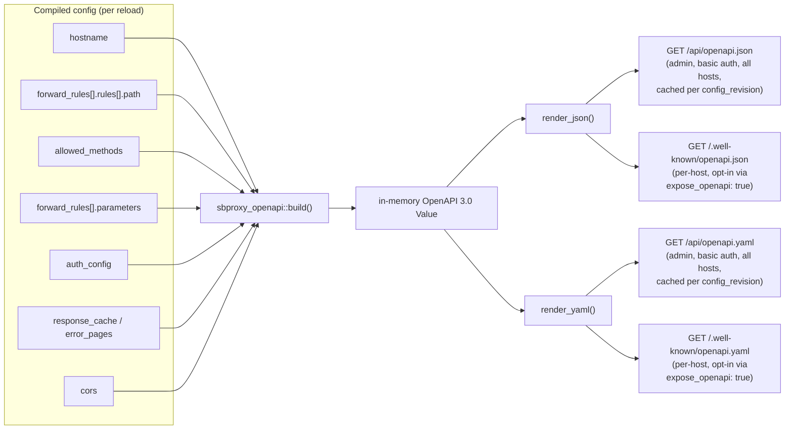

# OpenAPI Emission
*Last modified: 2026-08-27*

SBproxy documents and governs your API. It does not just proxy it.

When you put SBproxy in front of an upstream service, the gateway already knows the routes, the auth schemes, the rate limits, and the response cache. OpenAPI emission turns that knowledge into a published OpenAPI 3.0 document that buyers can consume with standard tooling (Postman, Swagger UI, ReadMe.io, Stainless, SDK generators) without ever seeing your YAML config or talking to the upstream.

The result: SBproxy is the single source of truth for what your API looks like, on the wire, right now.

This page covers emission: turning your config into a published spec. The
companion policy, [OpenAPI schema validation](openapi-validation.md),
runs the other direction: it loads a spec (emitted from here, or written
by hand) and rejects request bodies that do not conform to it. Emission
publishes the contract; validation enforces it. Nothing wires the two
together automatically today, an emitted document is not fed back into
`openapi_validation` for you, so pairing them on one origin is a
deliberate two-step config.

## Pipeline



`build()` walks the compiled snapshot fresh on every call; nothing about
the mapping is cached. The admin endpoint caches the rendered bytes keyed
by `config_revision`, so repeat admin requests between reloads cost one
`Mutex` lock and a clone. The per-host endpoint rebuilds and re-renders
on every request instead: cheap in practice (`build()` only walks the
already-compiled config), but worth knowing if you are hammering
`/.well-known/openapi.json` from a script.

## What gets emitted

The gateway derives every part of the document from its compiled config. Each row maps a configuration source to its OpenAPI target.

| Source                                        | OpenAPI target                                |
|-----------------------------------------------|-----------------------------------------------|
| `CompiledOrigin.hostname`                     | `servers[].url`                               |
| Forward rule `template` matcher               | `paths` key (template syntax verbatim)        |
| Forward rule `exact` matcher                  | `paths` key                                   |
| Forward rule `prefix` matcher                 | `paths` key + `x-sbproxy-prefix-match: true`  |
| Forward rule `regex` matcher                  | Synthetic key + `x-sbproxy-regex-path` extension |
| `allowed_methods` entry OpenAPI 3.0 can name  | `Operation` per method                        |
| `allowed_methods` entry it cannot             | `x-sbproxy-unrepresentable-methods` on the path item, one entry per method and host |
| The origin's hostname, per operation          | `servers[]` on the operation                  |
| Matcher `header` / `query` / `body` / `method` / `when` | `x-sbproxy-match` on the operation, field and comparison only |
| Rule-level `parameters`                       | `parameters[]` per operation                  |
| `auth_config`                                 | `securitySchemes` + `security`                |
| `response_cache.cacheable_status`             | `responses` keys                              |
| `error_pages` keys                            | `responses` keys                              |
| `cors`                                        | `x-sbproxy-cors` extension                    |
| `deprecation:` block (rule wins over origin)  | `deprecated: true` + `x-sbproxy-sunset` / `x-sbproxy-successor` extensions |
| Two rules on one path and method              | First wins + `x-sbproxy-alternate-operations` + `x-sbproxy-collisions` |

The deprecation extensions carry the exact wire values the response
filter stamps (`x-sbproxy-sunset` is the RFC 8594 HTTP-date), so the
emitted spec and the response headers cannot disagree. See
[api-gateway.md](api-gateway.md#deprecating-endpoints).

Coverage is bounded by what the gateway config knows. Upstream request and response body schemas are not described unless you declare them explicitly (or feed in an upstream OpenAPI spec via the existing consumption path).

### Methods OpenAPI cannot name

A Path Item Object has exactly eight operation fields: `get`, `put`,
`post`, `delete`, `options`, `head`, `patch`, and `trace`. Everything
else is a verb OpenAPI 3.0 has nowhere to put, and `allowed_methods`
accepts anything that is a valid HTTP method token:

```yaml
origins:
  "files.example.com":
    allowed_methods: ["GET", "PROPFIND"]
    action: { type: proxy, url: http://upstream }
```

The gateway serves both of those and answers everything else with a
`405`, so the document says both. `GET` becomes an operation; `PROPFIND`
is listed on the path item instead:

```json
"/documents/{id}": {
  "get": { "...": "..." },
  "x-sbproxy-unrepresentable-methods": [
    {
      "method": "PROPFIND",
      "servers": [{"url": "https://files.example.com"}]
    }
  ]
}
```

Each entry names the host that serves the verb, for the same reason
operations do. Two origins can share a path key while only one of them
allows `PROPFIND`, and a bare list of verbs on the shared path item
would have the all-hosts document claiming a verb against a host that
answers it with a `405`.

An origin whose whole allowlist is unrepresentable emits its paths with
that extension and no operations at all. That is deliberate: a path item
carrying a verb the gateway would refuse is worse than one carrying
none, because a generator will build a client against it. Read
`x-sbproxy-unrepresentable-methods` before concluding a path only serves
what its operations list, and read the `servers` on the entry before
concluding which host serves it.

An empty `allowed_methods` installs no method check at all. The document
still names the seven common verbs rather than guessing at the extension
ones, so it under-describes an unrestricted origin instead of
over-describing it.

### Two rules on one path and method

Path keys are not unique across a config. Two origins can expose the
same path, and one origin can route the same path two ways using a
`header`, `query`, `body`, `method`, or `when` condition that OpenAPI
has no field for. The document keeps whichever comes first in the
config. Within one origin that is also how the gateway picks at
request time, first matching forward rule wins, so the operation on
the key is the one a request actually reaches. Across origins nothing
competes at request time (the hosts differ); the shared key is an
artifact of the all-hosts document flattening every origin into one
`paths` map:

```json
"/users": {
  "get": {
    "operationId": "api_get_users",
    "servers": [{"url": "https://api.example.com"}],
    "x-sbproxy-match": {
      "header": {"name": "x-beta", "compare": "exact"},
      "variant": 1
    }
  },
  "x-sbproxy-alternate-operations": [
    {
      "operationId": "web_get_users",
      "servers": [{"url": "https://web.example.com"}]
    }
  ]
}
```

Nothing is dropped. The operation that lost the key stays readable under
`x-sbproxy-alternate-operations`, and the whole set is summarized once at
the top level:

```json
"x-sbproxy-collisions": [
  {
    "path": "/users",
    "method": "get",
    "emitted": "api_get_users",
    "alternate": "web_get_users"
  }
]
```

A byte-identical repeat is not a collision and is not reported. Neither
extension appears on a document that has no conflicts.

Two things make an operation self-describing enough for that to be
useful. Each operation carries its own `servers` entry naming the origin
that serves it, which also fixes the all-hosts document's older habit of
implying every host served every path. And `x-sbproxy-match` describes
the matcher conditions OpenAPI cannot express, so two rules on one path
are distinguishable rather than looking like the same route written
twice.

### What `x-sbproxy-match` deliberately leaves out

`/.well-known/openapi.json` needs no credential, so everything in the
document is public. Matcher values are not. Operators route on
shared-secret headers, internal query tokens, body fields carrying
customer identifiers, and `when:` predicates that name internal
infrastructure, and none of that is contract; it is config that happens
to sit next to the routes.

So the extension carries the field a rule looks at and the comparison it
performs, never the value it compares against. One entry per matcher the
rule sets, plus the `variant` number described below:

| Config | Emitted |
| --- | --- |
| `header: {name: x-partner-token, value: sk-live-9f3}` | `{"header": {"name": "x-partner-token", "compare": "exact"}}` |
| `header: {name: authorization, prefix: "Bearer sk-"}` | `{"header": {"name": "authorization", "compare": "prefix"}}` |
| `query: {name: access}` | `{"query": {"name": "access", "compare": "present"}}` |
| `body: {pointer: /account, prefix: acct-9}` | `{"body": {"pointer": "/account", "compare": "prefix"}}` |
| `when: "request.headers['x-src'] == 'vault.internal'"` | `{"when": "cel"}` |
| `method: [POST, PUT]` | `{"method": ["POST", "PUT"]}` |

Methods are the one thing carried verbatim. Config load refuses a
`method:` entry that is not a valid HTTP method token, so the field
cannot hold operator text, and the verbs are the document's own
vocabulary already.

That leaves a gap the `variant` number fills. Two rules that differ only
in a header value have the same shape, so without it they would emit as
one operation and the second route would vanish from the document.
`variant` counts the distinct condition sets seen under one shape, in
the order they first appear. Equal variants mean equal conditions;
different variants mean different ones. It says the two rules match on
different values and nothing at all about what those values are.

The count is per document. A rule can carry `variant: 1` in its own
host's document and `variant: 2` in the admin document for every host,
where an earlier origin claimed the first number for a different value.
Compare variants inside one document, never across two.

A short hash of the value would number them just as well and stay stable
when a rule is inserted ahead of them, which a counter does not. It is
still the wrong trade: a hash lets anyone holding the document confirm a
guessed token offline, at whatever rate their hardware allows, with no
request to rate-limit and no log line to notice. That is the disclosure
this extension exists to prevent, only slower.

## Where to read it

Two surfaces are available.

### Admin endpoint (all hosts, basic auth)

```bash
curl -s -u admin:changeme http://127.0.0.1:9090/api/openapi.json | jq
curl -s -u admin:changeme http://127.0.0.1:9090/api/openapi.yaml
```

Requires `proxy.admin.enabled: true`. The rendered document is cached per pipeline revision; reloads invalidate the cache, idle requests cost nothing. This is the surface most operators use.

### Per-host (public, opt-in)

```bash
curl -s -H 'Host: api.localhost' \
  http://127.0.0.1:8080/.well-known/openapi.json
curl -s -H 'Host: api.localhost' \
  http://127.0.0.1:8080/.well-known/openapi.yaml
```

Off by default. Set `expose_openapi: true` on the origin to publish. Useful for SDK generators, contract testing, and buyer-side discovery without coupling consumers to the admin API. Unlike the admin endpoint, this surface rebuilds and re-renders the document on every request; it is not cached by revision.

```yaml
origins:
  "api.example.com":
    expose_openapi: true
    action: { type: proxy, url: http://upstream }
```

## Path matchers

Forward rules accept four matcher shapes, ordered cheapest-first on the hot path:

```yaml
forward_rules:
  - rules:
      # Exact: byte-for-byte equality with the request path.
      - path: { exact: /health }

      # Prefix: starts-with check. Annotated as `x-sbproxy-prefix-match`
      # in the emitted spec since OpenAPI has no native concept.
      - path: { prefix: /api/ }

      # Template: OpenAPI-style path template. Named segments,
      # catch-all (`{*rest}`), and per-segment regex constraints
      # (`{id:[0-9]+}`). Lands as a `paths` key verbatim.
      - path: { template: /users/{id:[0-9]+}/posts/{post_id} }

      # Regex: whole-path escape hatch. Lands under a synthetic path
      # key with the pattern preserved as an `x-sbproxy-regex-path`
      # extension. Use named captures (`?P<name>`) to surface params.
      - path: { regex: '^/v(?P<version>[0-9]+)/items' }
    origin:
      action: { type: proxy, url: http://upstream }
```

Captured params (template named segments, regex named captures) flow into the request context as `path_params` and become available to request modifiers, CEL expressions, Lua / JavaScript / WASM scripts, and metrics labels.

## Parameter declarations

Each forward rule may carry a list of OpenAPI 3.0 Parameter Objects that describe its parameters. Field names mirror the spec verbatim:

```yaml
forward_rules:
  - rules:
      - path: { template: /users/{id} }
    parameters:
      - name: id
        in: path
        required: true
        description: Numeric user identifier.
        schema:
          type: integer
          format: int64
      - name: include
        in: query
        required: false
        description: Comma-separated list of related resources to embed.
        schema:
          type: string
    origin:
      action: { type: proxy, url: http://upstream }
```

Supported `in:` values are `path`, `query`, and `header`. Cookie parameters are not yet captured.

## Auth scheme mappings

Auth blocks turn into OpenAPI `securitySchemes` and a `security` requirement attached to each operation. Every auth type the gateway implements has a mapper of its own:

| Auth type | OpenAPI shape |
|---|---|
| `api_key` | `apiKey` in header, named by `header_name`. An opt-in `query_param` rides `x-sbproxy-api-key-query-param`, because OpenAPI 3.0 cannot express "either of these" |
| `basic_auth`, `ldap_auth` | `http` scheme `basic` |
| `digest` | `http` scheme `digest` |
| `bearer` | `http` scheme `bearer`, with `x-sbproxy-require-dpop` when the origin demands an RFC 9449 proof |
| `jwt` | `http` scheme `bearer`, `bearerFormat: JWT`, plus the required audience and any DPoP or mTLS binding as extensions |
| `hmac_auth`, `bot_auth` | `apiKey` in the `Signature` header (RFC 9421). Not `http` scheme `signature`, which is not an IANA scheme: a generated client would send `Authorization: Signature ...`, which no verifier reads |
| `cap` | `http` scheme `bearer`, `bearerFormat: cap` |
| `oidc` | `openIdConnect`, pointing at the pinned issuer's discovery document |
| `forward_auth` | `apiKey` in the `Authorization` header, with a description saying the gateway does not know what the authorization service requires |
| `ext_authz` | `apiKey` in the first allowlisted forwarded header; every forwarded header name rides `x-sbproxy-forwarded-headers` |
| `oauth_introspection` | `http` scheme `bearer`, plus `x-sbproxy-required-scopes` |
| `kya` | `apiKey` in `X-Skyfire-KYA`, plus the trusted issuers and any spend floor |
| `noop` | No scheme and no requirement. An origin that challenges nobody must not tell a client to send a credential |
| anything else | Generic `apiKey` placeholder + `x-sbproxy-auth-type` extension naming the original type |

Custom auth types can register their own mappers via the `AuthSchemeMapper` registry exposed from the OpenAPI emission engine.

### What never reaches this document

`/.well-known/openapi.json` is served unauthenticated, so an auth mapper publishes only what a caller cannot use the API without. A header name, a required scope, and a trusted KYA issuer qualify. A key, a secret, a client id, and the address of an internal service do not, and no mapper reads one. That rule is enforced by a test that renders a document from an auth block carrying all of them and greps the result.

It is worth saying because the shape it rules out is the tempting one: an `oauth_introspection` block knows its introspection endpoint and an `ext_authz` block knows its authorization service, and publishing either would tell an attacker the address of a service that answers questions about tokens. Neither is emitted.

### Two corrections in this table (WOR-2675)

Until WOR-2675 this table listed three mappers, two of which named types the gateway does not implement.

`api_keys` is not the auth type; `api_key` is, and its field is `header_name` rather than `header`. Every origin using the shipped provider therefore fell through to the generic placeholder and published a document telling clients to send `Authorization` when the origin wanted `X-Api-Key`. Both spellings are accepted now, and both fields are read, so a plugin registered under the old name keeps working.

`oauth_client_creds` names no inbound provider anywhere in this workspace. The outbound client-credentials grant is `outbound_credential`, which the gateway uses to get a token for an upstream and which never appears in an origin's `authentication:` block. The mapper arm is kept so a linked plugin implementing an inbound type under that name still emits an `oauth2` flow object rather than the placeholder.

## Limitations

- Path templates and regex matchers describe routing surface, not upstream contract. Request and response body schemas are not emitted unless an upstream OpenAPI spec was fed in via the existing consumption path (`crates/sbproxy-extension/src/mcp/openapi_convert.rs`); merging that spec into emitted operations is on the roadmap.
- CORS is surfaced as an `x-sbproxy-cors` extension because OpenAPI 3.0 has no native CORS vocabulary.
- The `info.version` field defaults to `1.0.0`; callers who want the live config revision should override it after `build()` returns.
- A verb outside OpenAPI 3.0's eight cannot become an operation. It is named on the path item under `x-sbproxy-unrepresentable-methods` instead, and standard tooling will not see it as a route.
- When two rules resolve to one path and method, one operation holds the key and the rest sit under `x-sbproxy-alternate-operations`. A generator that reads only the path item builds a client for the first, so check `x-sbproxy-collisions` if you expected more routes than you got.
- Matcher conditions ride along in `x-sbproxy-match` rather than in anything OpenAPI defines, so a generator will not enforce them. A client built from this document can call an operation whose header, query, body, or `when` condition it never satisfies, and the gateway will route it somewhere else.
- `x-sbproxy-match` names the field and the comparison, never the value. There is no way to read a routing secret, an internal token, or the text of a `when:` predicate out of this document, and no way to reconstruct one from the `variant` number either. If you want the values, read the config through the authenticated admin surface, which redacts secrets on its way out.

## Programmatic access

The emission engine is a library:

```rust,no_run
use sbproxy_openapi::{build, render_json, render_yaml};

let spec = build(&snapshot, None);                          // all hosts
let spec_one = build(&snapshot, Some("api.example.com"));   // single host
let json = render_json(&spec)?;
let yaml = render_yaml(&spec)?;
```

If you have a custom auth provider plugged in via the public plugin API, register a mapper for it the same way: implement `AuthSchemeMapper` and add it to the registry.

## Why emission, not just proxying

Most gateways ship an OpenAPI editor (you write the spec) or an OpenAPI importer (you feed in an upstream spec). SBproxy goes the other way: you configure routes, auth, caching, and rate limits on the gateway, and the gateway publishes an OpenAPI document derived from the running config. Reloads invalidate the cache; the next consumer fetch sees the new shape.

Where the config says something OpenAPI 3.0 cannot, the document says so in an extension rather than rounding it to the nearest thing the format allows. That is the whole bargain: everything the document states as an operation is a route the gateway serves, and the two `x-sbproxy-` lists above are where you look for the rest.

That makes the gateway, not the upstream service, the source of truth for what your API looks like to the outside world. Buyers point their SDK generators, contract tests, and developer portals at SBproxy. When you change a route, the document changes. When you tighten an auth scheme, the document tightens.

You ship the gateway and you ship the spec, in one motion.

## Example

The runnable configuration is
[`examples/openapi-emission/`](../examples/openapi-emission/sb.yml). It sets
`expose_openapi: true` on `api.localhost` and declares four forward rules
covering each matcher shape. Start it:

```bash
make run CONFIG=examples/openapi-emission/sb.yml
```

Read the per-host surface:

```bash
curl -sS -H 'Host: api.localhost' \
  http://127.0.0.1:8080/.well-known/openapi.json | jq
```

The document opens with a fixed envelope that states its own coverage limits:

```json
{
  "openapi": "3.0.3",
  "info": {
    "title": "SoapBucket Gateway",
    "version": "1.0.0",
    "description": "Routes exposed by this SoapBucket gateway, derived from its live configuration. Coverage is bounded by what the gateway config knows: path templates, methods, declared parameters, auth schemes, and known response codes. Upstream request/response bodies are not described here unless declared explicitly."
  },
  "paths": { }
}
```

The four rules in that config produce five path entries:

```
/users/{id:[0-9]+}/posts/{post_id}
/api/
/health
/static/{*rest}
/__regex__/^_v(?P<version>[0-9]+)_items
```

Each is worth reading against the matcher that produced it. The template
matcher keeps its inline segment constraint in the key itself, so the path is
`/users/{id:[0-9]+}/posts/{post_id}` rather than a cleaned
`/users/{id}/posts/{post_id}`. Generators that expect a bare `{id}` will need
to strip that.

The regex matcher cannot be expressed as an OpenAPI path at all, so it is
emitted under a synthetic `/__regex__/...` key with the separators rewritten,
and the real pattern is carried alongside in an extension:

```json
"x-sbproxy-regex-path": "^/v(?P<version>[0-9]+)/items"
```

Read `x-sbproxy-regex-path`, not the path key, for anything that matters.
Prefix matchers carry `x-sbproxy-prefix-match` for the same reason.

The declared `parameters` pass through verbatim, and are repeated per method
rather than hoisted to the path item:

```json
{
  "name": "id",
  "in": "path",
  "required": true,
  "description": "Numeric user identifier.",
  "schema": {"type": "integer", "format": "int64"}
}
```

`allowed_methods: ["GET", "POST"]` on the origin is why every path carries
exactly those two operations, each with its own `operationId` built from the
host, the method, and the rule's `id`, and its own `servers` entry naming the
origin it came from. Both verbs are ones OpenAPI can name, so no path in this
example carries `x-sbproxy-unrepresentable-methods`, and no two rules share a
path and method, so the document carries no `x-sbproxy-collisions` either.
Responses are the generic `200` and `default` pair: the gateway describes the
routes it exposes, not the bodies the upstream returns.

The admin surface serves the same document for every host and requires basic
auth. Without credentials it answers `401`:

```bash
curl -sS -o /dev/null -w '%{http_code}\n' http://127.0.0.1:9090/api/openapi.json
# 401
```

## See also

- [openapi-validation.md](openapi-validation.md) for the other half of the pair: loading a spec (this one, or a hand-written one) and rejecting requests that do not conform to it.
- [configuration.md](configuration.md) for the `expose_openapi` and `forward_rules.parameters` field semantics.
- [features.md](features.md) for the broader tour of gateway features.
- [scripting.md](scripting.md) for the CEL, Lua, JavaScript, and WASM hook surfaces that can read captured `path_params`.
