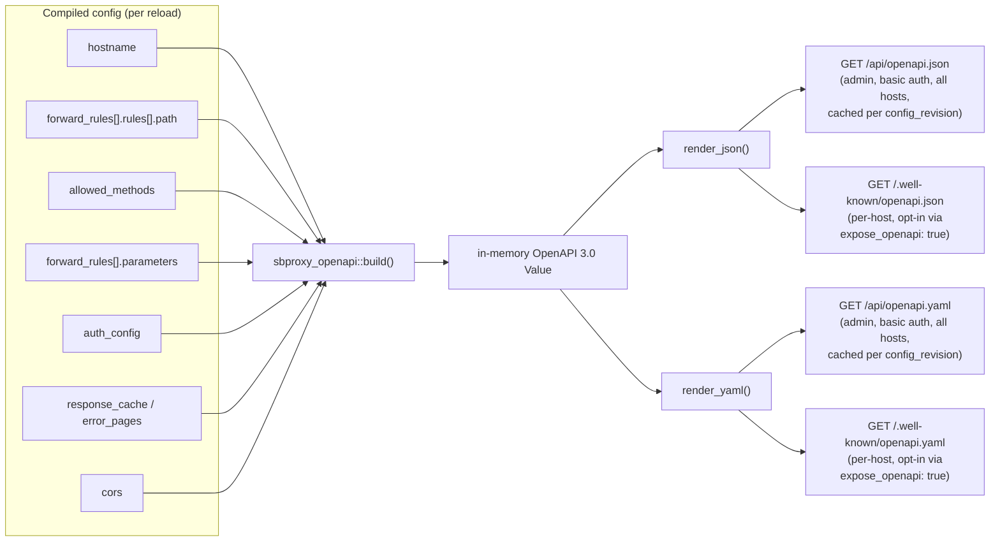

# OpenAPI Emission
*Last modified: 2026-08-20*

SBproxy documents and governs your API. It does not just proxy it.

When you put SBproxy in front of an upstream service, the gateway already knows the routes, the auth schemes, the rate limits, and the response cache. OpenAPI emission turns that knowledge into a published OpenAPI 3.0 document that buyers can consume with standard tooling (Postman, Swagger UI, ReadMe.io, Stainless, SDK generators) without ever seeing your YAML config or talking to the upstream.

The result: SBproxy is the single source of truth for what your API looks like, on the wire, right now.

This page covers emission: turning your config into a published spec. The
companion policy, [OpenAPI schema validation](openapi-validation.md),
runs the other direction: it loads a spec (emitted from here, or written
by hand) and rejects request bodies that do not conform to it. Emission
publishes the contract; validation enforces it. Nothing wires the two
together automatically today, an emitted document is not fed back into
`openapi_validation` for you, so pairing them on one origin is a
deliberate two-step config.

## Pipeline



`build()` walks the compiled snapshot fresh on every call; nothing about
the mapping is cached. The admin endpoint caches the rendered bytes keyed
by `config_revision`, so repeat admin requests between reloads cost one
`Mutex` lock and a clone. The per-host endpoint rebuilds and re-renders
on every request instead: cheap in practice (`build()` only walks the
already-compiled config), but worth knowing if you are hammering
`/.well-known/openapi.json` from a script.

## What gets emitted

The gateway derives every part of the document from its compiled config. Each row maps a configuration source to its OpenAPI target.

| Source                                        | OpenAPI target                                |
|-----------------------------------------------|-----------------------------------------------|
| `CompiledOrigin.hostname`                     | `servers[].url`                               |
| Forward rule `template` matcher               | `paths` key (template syntax verbatim)        |
| Forward rule `exact` matcher                  | `paths` key                                   |
| Forward rule `prefix` matcher                 | `paths` key + `x-sbproxy-prefix-match: true`  |
| Forward rule `regex` matcher                  | Synthetic key + `x-sbproxy-regex-path` extension |
| `allowed_methods`                             | `Operation` per method                        |
| Rule-level `parameters`                       | `parameters[]` per operation                  |
| `auth_config`                                 | `securitySchemes` + `security`                |
| `response_cache.cacheable_status`             | `responses` keys                              |
| `error_pages` keys                            | `responses` keys                              |
| `cors`                                        | `x-sbproxy-cors` extension                    |
| `deprecation:` block (rule wins over origin)  | `deprecated: true` + `x-sbproxy-sunset` / `x-sbproxy-successor` extensions |

The deprecation extensions carry the exact wire values the response
filter stamps (`x-sbproxy-sunset` is the RFC 8594 HTTP-date), so the
emitted spec and the response headers cannot disagree. See
[api-gateway.md](api-gateway.md#deprecating-endpoints).

Coverage is bounded by what the gateway config knows. Upstream request and response body schemas are not described unless you declare them explicitly (or feed in an upstream OpenAPI spec via the existing consumption path).

## Where to read it

Two surfaces are available.

### Admin endpoint (all hosts, basic auth)

```bash
curl -s -u admin:changeme http://127.0.0.1:9090/api/openapi.json | jq
curl -s -u admin:changeme http://127.0.0.1:9090/api/openapi.yaml
```

Requires `proxy.admin.enabled: true`. The rendered document is cached per pipeline revision; reloads invalidate the cache, idle requests cost nothing. This is the surface most operators use.

### Per-host (public, opt-in)

```bash
curl -s -H 'Host: api.localhost' \
  http://127.0.0.1:8080/.well-known/openapi.json
curl -s -H 'Host: api.localhost' \
  http://127.0.0.1:8080/.well-known/openapi.yaml
```

Off by default. Set `expose_openapi: true` on the origin to publish. Useful for SDK generators, contract testing, and buyer-side discovery without coupling consumers to the admin API. Unlike the admin endpoint, this surface rebuilds and re-renders the document on every request; it is not cached by revision.

```yaml
origins:
  "api.example.com":
    expose_openapi: true
    action: { type: proxy, url: http://upstream }
```

## Path matchers

Forward rules accept four matcher shapes, ordered cheapest-first on the hot path:

```yaml
forward_rules:
  - rules:
      # Exact: byte-for-byte equality with the request path.
      - path: { exact: /health }

      # Prefix: starts-with check. Annotated as `x-sbproxy-prefix-match`
      # in the emitted spec since OpenAPI has no native concept.
      - path: { prefix: /api/ }

      # Template: OpenAPI-style path template. Named segments,
      # catch-all (`{*rest}`), and per-segment regex constraints
      # (`{id:[0-9]+}`). Lands as a `paths` key verbatim.
      - path: { template: /users/{id:[0-9]+}/posts/{post_id} }

      # Regex: whole-path escape hatch. Lands under a synthetic path
      # key with the pattern preserved as an `x-sbproxy-regex-path`
      # extension. Use named captures (`?P<name>`) to surface params.
      - path: { regex: '^/v(?P<version>[0-9]+)/items' }
    origin:
      action: { type: proxy, url: http://upstream }
```

Captured params (template named segments, regex named captures) flow into the request context as `path_params` and become available to request modifiers, CEL expressions, Lua / JavaScript / WASM scripts, and metrics labels.

## Parameter declarations

Each forward rule may carry a list of OpenAPI 3.0 Parameter Objects that describe its parameters. Field names mirror the spec verbatim:

```yaml
forward_rules:
  - rules:
      - path: { template: /users/{id} }
    parameters:
      - name: id
        in: path
        required: true
        description: Numeric user identifier.
        schema:
          type: integer
          format: int64
      - name: include
        in: query
        required: false
        description: Comma-separated list of related resources to embed.
        schema:
          type: string
    origin:
      action: { type: proxy, url: http://upstream }
```

Supported `in:` values are `path`, `query`, and `header`. Cookie parameters are not yet captured.

## Auth scheme mappings

Auth blocks turn into OpenAPI `securitySchemes` and a `security` requirement attached to each operation. The mapping covers every auth type the gateway implements:

| Auth type           | OpenAPI shape                                                      |
|---------------------|--------------------------------------------------------------------|
| `api_keys`          | `apiKey` in header (uses `header:` from config)                    |
| `basic_auth`        | `http` scheme `basic`                                              |
| `oauth_client_creds`| `oauth2` with `clientCredentials` flow + `tokenUrl`                |
| anything else (`bearer`, `jwt`, `digest`, `kya`, `cap`, `forward_auth`, ...) | Generic `apiKey` placeholder + `x-sbproxy-auth-type` extension naming the original type |

Custom auth types can register their own mappers via the `AuthSchemeMapper` registry exposed from the OpenAPI emission engine.

## Limitations

- Path templates and regex matchers describe routing surface, not upstream contract. Request and response body schemas are not emitted unless an upstream OpenAPI spec was fed in via the existing consumption path (`crates/sbproxy-extension/src/mcp/openapi_convert.rs`); merging that spec into emitted operations is on the roadmap.
- CORS is surfaced as an `x-sbproxy-cors` extension because OpenAPI 3.0 has no native CORS vocabulary.
- The `info.version` field defaults to `1.0.0`; callers who want the live config revision should override it after `build()` returns.

## Programmatic access

The emission engine is a library:

```rust,no_run
use sbproxy_openapi::{build, render_json, render_yaml};

let spec = build(&snapshot, None);                          // all hosts
let spec_one = build(&snapshot, Some("api.example.com"));   // single host
let json = render_json(&spec)?;
let yaml = render_yaml(&spec)?;
```

If you have a custom auth provider plugged in via the public plugin API, register a mapper for it the same way: implement `AuthSchemeMapper` and add it to the registry.

## Why emission, not just proxying

Most gateways ship an OpenAPI editor (you write the spec) or an OpenAPI importer (you feed in an upstream spec). SBproxy goes the other way: you configure routes, auth, caching, and rate limits on the gateway, and the gateway publishes a faithful OpenAPI document that always matches the running config. Reloads invalidate the cache; the next consumer fetch sees the new shape.

That makes the gateway, not the upstream service, the source of truth for what your API looks like to the outside world. Buyers point their SDK generators, contract tests, and developer portals at SBproxy. When you change a route, the document changes. When you tighten an auth scheme, the document tightens.

You ship the gateway and you ship the spec, in one motion.

## Example

The runnable configuration is
[`examples/openapi-emission/`](../examples/openapi-emission/sb.yml). It sets
`expose_openapi: true` on `api.localhost` and declares four forward rules
covering each matcher shape. Start it:

```bash
make run CONFIG=examples/openapi-emission/sb.yml
```

Read the per-host surface:

```bash
curl -sS -H 'Host: api.localhost' \
  http://127.0.0.1:8080/.well-known/openapi.json | jq
```

The document opens with a fixed envelope that states its own coverage limits:

```json
{
  "openapi": "3.0.3",
  "info": {
    "title": "SoapBucket Gateway",
    "version": "1.0.0",
    "description": "Routes exposed by this SoapBucket gateway, derived from its live configuration. Coverage is bounded by what the gateway config knows: path templates, methods, declared parameters, auth schemes, and known response codes. Upstream request/response bodies are not described here unless declared explicitly."
  },
  "paths": { }
}
```

The four rules in that config produce five path entries:

```
/users/{id:[0-9]+}/posts/{post_id}
/api/
/health
/static/{*rest}
/__regex__/^_v(?P<version>[0-9]+)_items
```

Each is worth reading against the matcher that produced it. The template
matcher keeps its inline segment constraint in the key itself, so the path is
`/users/{id:[0-9]+}/posts/{post_id}` rather than a cleaned
`/users/{id}/posts/{post_id}`. Generators that expect a bare `{id}` will need
to strip that.

The regex matcher cannot be expressed as an OpenAPI path at all, so it is
emitted under a synthetic `/__regex__/...` key with the separators rewritten,
and the real pattern is carried alongside in an extension:

```json
"x-sbproxy-regex-path": "^/v(?P<version>[0-9]+)/items"
```

Read `x-sbproxy-regex-path`, not the path key, for anything that matters.
Prefix matchers carry `x-sbproxy-prefix-match` for the same reason.

The declared `parameters` pass through verbatim, and are repeated per method
rather than hoisted to the path item:

```json
{
  "name": "id",
  "in": "path",
  "required": true,
  "description": "Numeric user identifier.",
  "schema": {"type": "integer", "format": "int64"}
}
```

`allowed_methods: ["GET", "POST"]` on the origin is why every path carries
exactly those two operations, each with its own `operationId` built from the
host, the method, and the rule's `id`. Responses are the generic `200` and
`default` pair: the gateway describes the routes it exposes, not the bodies
the upstream returns.

The admin surface serves the same document for every host and requires basic
auth. Without credentials it answers `401`:

```bash
curl -sS -o /dev/null -w '%{http_code}\n' http://127.0.0.1:9090/api/openapi.json
# 401
```

## See also

- [openapi-validation.md](openapi-validation.md) for the other half of the pair: loading a spec (this one, or a hand-written one) and rejecting requests that do not conform to it.
- [configuration.md](configuration.md) for the `expose_openapi` and `forward_rules.parameters` field semantics.
- [features.md](features.md) for the broader tour of gateway features.
- [scripting.md](scripting.md) for the CEL, Lua, JavaScript, and WASM hook surfaces that can read captured `path_params`.
