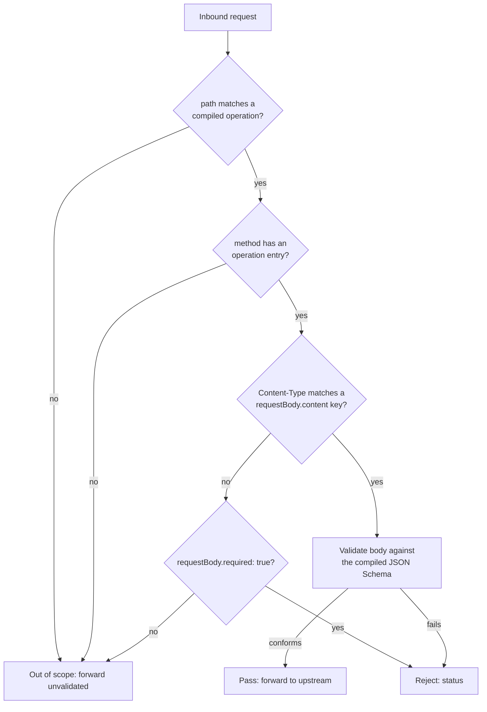

# OpenAPI schema validation

*Last modified: 2026-08-19*

The `openapi_validation` policy loads an OpenAPI 3.0 document at startup and validates each incoming request body against the matching operation's `requestBody` schema. Requests whose path + method are not described in the spec, or whose `Content-Type` has no schema, are passed through untouched, with one exception: when the matched operation declares `requestBody.required: true`, a request whose `Content-Type` matches no schema is rejected rather than passed through.

This is the enforcement half of the OpenAPI pair. [OpenAPI emission](openapi-emission.md) is the other half: it publishes a spec derived from your live config. The two are not wired together, an emitted document is not automatically fed back into this policy, so pointing `spec` or `spec_file` at a spec emission produced (or at one you maintain by hand) is a deliberate step.

Use it to:

- Block malformed payloads at the edge before they reach a backend.
- Enforce additive schema discipline: a new field or a tightened `enum` that does not roll out everywhere yet still rejects bad calls in production.
- Run in `log` mode against a staging deployment to learn which clients are out of contract before turning enforcement on.

## Policy fields

| Field | Default | Description |
|-------|---------|-------------|
| `spec` | (required, or `spec_file`) | Inline OpenAPI 3.0 document as a YAML object. |
| `spec_file` | (required, or `spec`) | Path to a JSON or YAML OpenAPI document. The file is read once at startup. |
| `mode` | `enforce` | `enforce` rejects mismatched bodies; `log` (also accepted as `warn`) writes a warning and forwards the request. |
| `status` | `400` | Status code returned in `enforce` mode when validation fails. |
| `error_body` | (auto) | Optional fixed body for the rejection response. Defaults to a JSON object naming the failing JSON pointer. |
| `error_content_type` | `application/json` | `Content-Type` for the rejection body. |

## How requests are matched

OpenAPI path templates like `/users/{id}` are compiled to anchored regexes (`^/users/[^/]+$`) at startup. A request matches when:

1. Its path matches one of the compiled templates.
2. The corresponding operation has the request method.
3. The request `Content-Type` (leading media type, parameters stripped) matches a key under that operation's `requestBody.content`.

If any of these is missing, the policy treats the request as out of scope and forwards it without inspection, with one exception: when the operation's spec declares `requestBody.required: true`, a matched path + method whose `Content-Type` matches no schema (absent, wrong, or unsupported) fails validation instead of passing through. Otherwise a client could skip the body contract by sending an unexpected `Content-Type`.

## Schema enforcement

JSON Schema validation runs through the `jsonschema` crate with remote `$ref` resolution disabled, so an attacker-controlled spec cannot become an SSRF primitive. Schemas are compiled once at config-load time, which keeps the per-request hot path cheap.

The rejection body lists the failing JSON pointer (e.g. `/age`) but never echoes the offending value back to the caller, so a probing client cannot use error messages to confirm guesses.

A body whose `Content-Type` matches a schema but does not parse as JSON at all fails with a distinct message (`invalid JSON in request body: ...`) rather than a JSON-pointer failure, since there is no instance to validate against the schema.



## Example


Paths and methods outside the spec pass through untouched ([config](../examples/openapi-validation/)).

```yaml
origins:
  "api.example.com":
    action:
      type: proxy
      url: "https://backend.internal"
    policies:
      - type: openapi_validation
        mode: enforce
        status: 422
        spec:
          openapi: "3.0.3"
          info: {title: my-api, version: "1.0"}
          paths:
            "/users/{id}":
              post:
                requestBody:
                  required: true
                  content:
                    application/json:
                      schema:
                        type: object
                        required: [name]
                        additionalProperties: false
                        properties:
                          name: {type: string, minLength: 1}
                          age:  {type: integer, minimum: 0, maximum: 150}
```

## Calling it

The runnable configuration is
[`examples/openapi-validation/`](../examples/openapi-validation/), which is the
spec above with `status: 400`. Start it:

```bash
make run CONFIG=examples/openapi-validation/sb.yml
```

The upstream has no `/users` route, so a forwarded request comes back as its
`404`. That is the signal the policy allowed it through:

```bash
curl -sS -o /dev/null -w '%{http_code}\n' -H 'Host: api.local' \
  -H 'Content-Type: application/json' \
  -d '{"name":"alice","age":30}' \
  http://127.0.0.1:8080/users/42
# 404, forwarded
```

Drop the required field and the edge answers instead:

```bash
curl -sS -H 'Host: api.local' -H 'Content-Type: application/json' \
  -d '{"age":30}' http://127.0.0.1:8080/users/42
```

```json
{"detail":"POST /users/{id} body failed schema validation at ","error":"openapi validation failed"}
```

`detail` names the matched operation as a template rather than the concrete
path, and ends with the JSON pointer to the failing *instance* location. For a
missing required property that pointer is the document root, so the string ends
with `at ` and nothing after it. It does not name `/name`: the object is what
failed the `required` check, not the absent property. `additionalProperties`
violations report the root the same way.

A failure inside a property does carry a pointer:

```bash
curl -sS -H 'Host: api.local' -H 'Content-Type: application/json' \
  -d '{"name":"alice","age":"thirty"}' http://127.0.0.1:8080/users/42
# {"detail":"POST /users/{id} body failed schema validation at /age","error":"openapi validation failed"}

curl -sS -H 'Host: api.local' -H 'Content-Type: application/json' \
  -d '{"name":"alice","age":999}' http://127.0.0.1:8080/users/42
# {"detail":"POST /users/{id} body failed schema validation at /age","error":"openapi validation failed"}
```

A type error and a range error are indistinguishable from the outside: both
report `/age` and neither says what was wrong or echoes what was sent. That is
deliberate, so a probing client cannot use the error text to confirm guesses.

A path the spec does not describe is forwarded without inspection:

```bash
curl -sS -o /dev/null -w '%{http_code}\n' -H 'Host: api.local' \
  -H 'Content-Type: application/json' \
  -d '{"whatever":1}' http://127.0.0.1:8080/not-in-spec
# 404, forwarded unvalidated
```

### This policy needs a request that goes upstream

Validation runs in `request_body_filter`, which only executes for a request the
proxy forwards. Pair `openapi_validation` with a `static` action and the policy
compiles, appears in the verdict stream, and validates nothing: the static
response is produced before the body is ever read, so every body is accepted.
The same applies to the other body-reading policies, `content_digest` and
`request_validator`.

The example uses a `proxy` action for that reason. If you are testing this
policy against a stub origin and every malformed body returns success, check
the action type first.

## Limitations

- Only `requestBody` schemas are enforced. `parameters` (path / query / header) are not yet validated by this policy.
- `$ref` resolution is local to the document. External `$ref` URLs are not fetched.
- The first failing JSON pointer is returned. The full error list is suppressed to keep the surface area an attacker can probe small.
