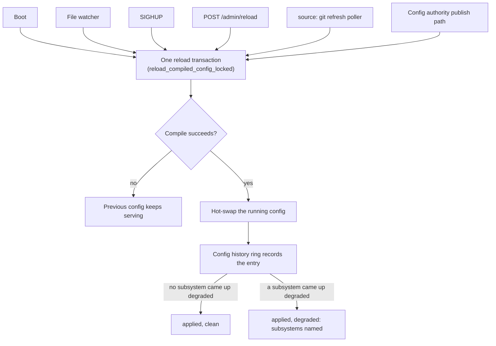

# Operator runbook

*Last modified: 2026-08-27*

This runbook is the dashboard/action companion to
[`quickstart-operator.md`](quickstart-operator.md). Use the quickstart for first
deploys; use this page when a dashboard panel is red.

If you arrived here from a page, the alert carries a `runbook_id` label. Look
that id up in the index below and go straight to its section. Everything from
[Dashboard Triage](#dashboard-triage) onward is the panel-driven path, for when
nothing has fired yet.

## Alert index

Every `runbook_id` a shipped alert rule can emit, and the section that answers
it. The rules are in `deploy/alerts/alerting-rules.yml`. Each section anchor is
the id in lowercase and does not change when the section is retitled, which is
what makes the label usable as a correlation key.

| `runbook_id` | Fired by | Tier |
|---|---|---|
| [`RB-SUBSTRATE-AVAIL`](#rb-substrate-avail) | `SBPROXY-SUBSTRATE-AVAIL-1H`, `-6H`, `-24H` | page, page, ticket |
| [`RB-SUBSTRATE-LATENCY`](#rb-substrate-latency) | `SBPROXY-SUBSTRATE-LATENCY-P95`, `-P99` | ticket, page |
| [`RB-LEDGER-REDEEM`](#rb-ledger-redeem) | `SBPROXY-LEDGER-REDEEM-1H`, `-6H` | page |
| [`RB-LEDGER-LATENCY`](#rb-ledger-latency) | `SBPROXY-LEDGER-LATENCY-P99` | ticket |
| [`RB-METER-CHAIN-GAP`](#rb-meter-chain-gap) | `SBPROXY-METER-CHAIN-GAP` | page |
| [`RB-METER-INCOHERENT-RECEIPT`](#rb-meter-incoherent-receipt) | `SBPROXY-METER-INCOHERENT-RECEIPT` | page |
| [`RB-METER-DIVERGENCE`](#rb-meter-divergence) | `SBPROXY-METER-DIVERGENCE` | ticket |
| [`RB-METER-STALLED`](#rb-meter-stalled) | `SBPROXY-METER-STALLED` | ticket |
| [`RB-AUDIT-WRITE`](#rb-audit-write) | `SBPROXY-AUDIT-WRITE-FAILURE` | page |
| [`RB-AUDIT-LATENCY`](#rb-audit-latency) | `SBPROXY-AUDIT-LATENCY-P99` | ticket |
| [`RB-AI-ADMISSION`](#rb-ai-admission) | `SBPROXY-AI-ADMISSION-REFUSAL-SHARE` | ticket |
| [`RB-AI-STREAM-POST-COMMIT`](#rb-ai-stream-post-commit) | `SBPROXY-AI-STREAM-POST-COMMIT` | ticket |
| [`RB-CERT-STORE-DEGRADED`](#rb-cert-store-degraded) | `SBPROXY-CERT-STORE-DEGRADED` | ticket |
| [`RB-MESH-ADMISSION`](#rb-mesh-admission) | `SBPROXY-MESH-INBOUND-REJECTED` | ticket |
| [`RB-STORAGE-BACKEND`](#rb-storage-backend) | `SBPROXY-STORAGE-BACKEND-ERRORS` | ticket |
| [`RB-CARD-BUDGET`](#rb-card-budget) | `SBPROXY-CARD-BUDGET-NEAR-CAP` | log only |

A guard in `crates/sbproxy-observe/tests/runbook_index.rs` fails the build when
an alert rule emits an id this table does not list, when a row points at a
heading that is not here, and when a row names an id no rule emits. The table
cannot fall behind the rules, and a rule cannot ship an id that resolves to
nothing.

The twenty-two alert rules in `dashboards/prometheus/alerts.yml` carry no
`runbook_id` at all. They cover proxy error rate and latency, the AI gateway
and its spend, the model host, and OCSP stapling, and they route by alert name
into the topic sections further down this page.

## Alert responses

### RB-SUBSTRATE-AVAIL

`SBPROXY-SUBSTRATE-AVAIL-1H` (page), `SBPROXY-SUBSTRATE-AVAIL-6H` (page),
`SBPROXY-SUBSTRATE-AVAIL-24H` (ticket).

Inbound 5xx responses are consuming the 30 day error budget faster than the
99.9% target allows. Each rule needs a short window and a long window over
threshold at the same time, so a one minute blip does not page. At the 14.4x
burn the 1h rule watches for, the whole month's budget goes in under two days.

The SLI is `sum(rate(sbproxy_requests_total{status!~"5.."}[w])) /
sum(rate(sbproxy_requests_total[w]))`, summed across every hostname, so it says
the proxy is failing without saying which origin is doing it.

**First check.** Split the numerator with
`sum by (hostname) (rate(sbproxy_requests_total{status=~"5.."}[5m]))`. One
hostname usually owns all of it, which sends you to [Origins](#origins). If the
failures are spread evenly instead, suspect the proxy: `/readyz` on the affected
pods, then `sbproxy_config_reload_total{result="failure"}` and the current
config revision. A burn that starts on a revision boundary is a bad config and
rolls back.

**Resolved when.** Both windows fall back under the burn threshold. The long
window lags, so a fixed incident keeps the 6h and 24h rules firing for part of
their window; that is expected and is not a second incident. Read
`sbproxy:slo:substrate:availability:budget_remaining:30d` before closing out. It
is denominated in budgets, so a negative value means the month is already
overspent and the next burn starts from behind.

### RB-SUBSTRATE-LATENCY

`SBPROXY-SUBSTRATE-LATENCY-P95` (ticket, p95 above 30 ms for 5 minutes),
`SBPROXY-SUBSTRATE-LATENCY-P99` (page, p99 above 50 ms for 5 minutes).

Both quantiles come from `sbproxy_request_duration_seconds`, summed by `le`
across every hostname. `sbproxy_origin_request_duration_seconds` records the
same measurement per origin with method and status attached, so that is the
split you want.

**First check.** Find the origin:
`histogram_quantile(0.99, sum by (origin, le) (rate(sbproxy_origin_request_duration_seconds_bucket[5m])))`.
Both histograms carry trace exemplars, so a slow bucket in Grafana links
directly to the span that produced it. If proxy latency rose without a matching
rise in origin latency, the time is being spent inside the proxy, and a policy,
a classifier, or an extension bundle added on the last reload is the usual
reason.

**Resolved when.** The quantile stays under its threshold for a full evaluation
window. p95 and p99 are separate rules with separate thresholds, so clearing the
page does not clear the ticket.

### RB-LEDGER-REDEEM

`SBPROXY-LEDGER-REDEEM-1H` (page), `SBPROXY-LEDGER-REDEEM-6H` (page).

Crawler payment tokens are failing to redeem. This is the `ai_crawl_control`
policy's ledger, which is a different subsystem from the metering ledger the
`RB-METER-*` sections cover. There is no redeem counter; the SLI derives from
the `_count` series of `sbproxy_ledger_redeem_duration_seconds`, whose `outcome`
label takes exactly three values: `success`, `transient_failure`, and
`hard_failure`.

The two failure classes mean opposite things. A `hard_failure` is the ledger
answering: the token was already spent, the signature did not verify, or the
request was rejected. The crawler gets a 402 challenge, which is the system
working. A `transient_failure` is the ledger not answering: network error, 429,
5xx, or a circuit breaker already open. The proxy fails closed and returns 503
with a `Retry-After`. There is no configuration knob to fail open.

**First check.** Split by outcome with
`sum by (outcome, host) (rate(sbproxy_ledger_redeem_duration_seconds_count[5m]))`.
For `transient_failure`, the ledger endpoint or the network path to it is the
problem, and `sbproxy_circuit_breaker_transitions_total` for that endpoint says
whether the breaker has given up. For `hard_failure`, the ledger is up and
something about the tokens changed: check `ledger.key_id` and the HMAC secret
against what the ledger expects, because a rotated key arrives as HTTP 401 and
therefore as `hard_failure` on every single request.

Do not check `/readyz` for this. Its `usage_ledger` component reports the
metering usage ledger's last append outcome, not crawl redeem health, and a
completely dead payment ledger leaves it green. The component was called
`ledger` until the name was narrowed to what it covers; no component covers
the redeem endpoint.

**Resolved when.** `transient_failure` returns to zero and the breaker closes. A
residual `hard_failure` rate is normal on a public crawl endpoint, because
replayed and expired tokens land there.

### RB-LEDGER-LATENCY

`SBPROXY-LEDGER-LATENCY-P99` (ticket, p99 above 200 ms for 5 minutes).

Redeem calls are slow. Every redeem sits on the request path and fails closed,
so this latency is latency the crawler sees, and enough of it becomes
`transient_failure` once the per-attempt timeout expires (`ledger.timeout_ms`,
default 5000).

**First check.** Decide whether the slowness is the backend or the retry loop.
One slow call and five retried fast calls look similar in p99.
`ledger.retry.max_attempts` (clamped to 1 through 5) multiplied by
`ledger.timeout_ms`, plus backoff, is the worst case a caller can wait. Compare
against the outcome split: a p99 rise with no `transient_failure` is a slow
backend, and a p99 rise alongside `transient_failure` is the retry loop doing
its job.

If this deployment uses the in-memory ledger rather than an HTTP one, the alert
is measuring a mutex acquisition and the real problem is elsewhere. The
in-memory ledger also cannot produce `transient_failure` at all.

**Resolved when.** p99 is back under 200 ms with the outcome mix unchanged.

### RB-METER-CHAIN-GAP

`SBPROXY-METER-CHAIN-GAP` (page).

The meter owed a receipt, could not write it, and the request was served anyway.
That consumption is on no chain and there is no receipt to reconstruct it from,
which is why it pages instead of filing a ticket: unbilled revenue with no paper
trail.

The `failure_mode` label is the posture configured in
`proxy.attestation.failure_mode`, and it changes what happened next:

- `degraded`, the default: a signed gap marker carrying zero units was appended
  under `<claim_id>:chain_gap`, so the hole is countable and located. The marker
  write is best effort, so if it failed too, the counter is the only record.
- `closed`: the chain was closed and a marker written. The request that
  triggered this was already served and cannot be recalled; the next response is
  refused instead.
- `open` and `observe`: nothing was written. The counter is the entire record.

**First check.** Disk space and permissions on `proxy.attestation.ledger.path`,
then the signing identity. Those are the failures that produce this, and the
directory is validated at boot, so a gap on a proxy that started clean means
something changed underneath it. `GET /api/meter/summary` reports the resolved
ledger path if you need to confirm which one is in use.

**Resolved when.** The counter stops moving and `sbproxy_meter_chain_seq`
advances again. Under `closed` that also needs a restart: closing sets an
in-process flag nothing clears, so the chain stays shut for the life of that
process.

The units already lost stay lost. Nothing in sbproxy replays or re-appends a
gap. Reconciling against the gap markers is a manual, deployment-specific job,
and no tooling ships here for it.

### RB-METER-INCOHERENT-RECEIPT

`SBPROXY-METER-INCOHERENT-RECEIPT` (page).

A receipt on the chain declares one provenance for a unit and carries the
evidence of another. It hash-chains correctly and verifies against the published
key, so nothing was tampered with. The claim on it cannot be true, which means
the number on it cannot be checked by anybody, including the customer it would
be invoiced to.

Reads refuse it rather than skipping past it. `GET /api/meter/summary` and
`GET /api/meter/receipts` stop at the offending entry and report `damaged_at_seq`
with a `damage_reason`. On the next start the ledger refuses to open at all,
which leaves the chain unwritable and hands every later request to the
configured `failure_mode`, so this turns into a chain gap as well.

**First check.** `POST /api/meter/verify`. It returns an `outcome` of `ok`,
`broken`, `unreadable`, or `not_started`, and on `broken` a `broken_seq` naming
the first failing sequence number. Read that entry before invoicing the affected
tenant. Verification is chain-wide even for a tenant-scoped operator, and
because it is a POST, a `read_only` operator gets a 403.

**Resolved when.** `POST /api/meter/verify` returns `ok`, which it will not do
on its own. There is no repair path in the product: the entry sits on an
append-only signed chain, and nothing here edits, truncates, or rotates past it.
Escalate rather than improvising a fix on the billing chain at 3am.

### RB-METER-DIVERGENCE

`SBPROXY-METER-DIVERGENCE` (ticket).

Units counted for a tenant did not match the units that reached the signed chain
within the 60 second reconciliation window. It is a discrepancy rather than a
loss: either receipts were dropped on the way to the ledger, or something is
recording units outside the chain. The chain is authoritative and the counter is
not.

Read this one before acting on it. In the current build nothing feeds the chain
side of the comparison. Every ledger payload leaves `chain_contribution` at its
`None` default, so the chained total is always zero, and any tenant with
billable units diverges in every window. A deployment running attested metering
with steady traffic sees this alert fire continuously across all tenants. That
pattern is the known condition, not a per-tenant billing discrepancy.

**First check.** Whether the firing set is every tenant with traffic or a
subset. Every tenant means you are looking at the condition above. A subset, or
one tenant diverging while its neighbors do not, is worth reconciling against
the ledger.

**Resolved when.** For the all-tenant case, there is no honest answer today.
Reconcile any affected tenant against the chain, treat the chain total as
correct, and hand the alert's own correctness to whoever owns metering.

### RB-METER-STALLED

`SBPROXY-METER-STALLED` (ticket).

Receipts are being classified while the chain head has not moved for 15 minutes.
No single counter shows this, because the counters keep rising the whole time.
It takes the pair: `sbproxy_meter_receipts_total` increments once per metered
attempt, before anything touches the chain, and `sbproxy_meter_chain_seq`
advances only on a successful append.

**First check.** `sbproxy_meter_append_duration_seconds` for backpressure. Every
append holds a mutex across serialize, digest, Ed25519 sign, write, and flush,
and the timer starts before the lock is taken, so lock wait shows up in the
histogram. A slow or full disk at the ledger path is the common cause.

Two cases move receipts without moving the head and are not stalls: a repeated
`claim_id` is deduplicated before the append, and a chain that is absent or
already closed never reaches the append path. The second case increments
`sbproxy_meter_chain_gap_total`, so that counter tells them apart.

**Resolved when.** `sbproxy_meter_chain_seq` advances again while receipts are
still arriving.

### RB-AUDIT-WRITE

`SBPROXY-AUDIT-WRITE-FAILURE` (page).

An audit emission recorded a non-`ok` outcome. Audit emission carries a 100% SLO
because durable audit is a compliance commitment, so any occurrence pages.

Know what this alert can and cannot see. The `outcome` label on
`sbproxy_audit_emit_duration_seconds` takes three values across the four
`channel` values (`security`, `config`, `key`, `admin`): `ok`,
`serialize_error` (the record failed to encode as JSON; `admin` never
reports this one, because an admin-action entry does not go through the
same JSON-encode-to-tracing step the other three channels use), and
`chain_error` (a configured chain rejected the append). All three are on
the metric: a hash chain append failure is not a silent gap. It logs an
ERROR line at the failing channel's own tracing target
(`security_audit`, `config_audit`, `key_audit`, or
`sbproxy::admin::audit`) on the first occurrence and the first after any
recovery, not one per event, and it folds into `outcome="chain_error"`
on this histogram, so the alert and the log line point at the same
failure. A dropped `events:` record is a separate thing and increments
`sbproxy_events_dropped_total` instead.

The key-mutation channel and the admin-console action channel also
carry `sbproxy_audit_write_failures_total{channel}`, which counts the
same durability failures on a counter instead of a histogram. Only two
of the four channels are on it, and `admin_path` is the console action
trail rather than a second key-management one. Use it to answer "is
this happening right now, and is it still happening", because its
series is touched at 0 on every emission, so a rate over it reads zero
rather than absent while the system is healthy. Its `channel` label
names the config key rather than the channel (`key_path`,
`admin_path`), so a page on `channel="key"` here corresponds to
`channel="key_path"` there.
It does not replace the histogram: the histogram is what pages, and it is
the only one of the two that covers `security` and `config`.

**First check.** Which `channel` label fired. Then the audit logs at
that channel's own target (`security_audit`, `config_audit`,
`key_audit`, or `sbproxy::admin::audit`) for the matching ERROR line. If
the outcome was `chain_error`, run `sbproxy audit verify --channel
<channel>` against the path that channel writes to (`audit.path`,
`audit.config_path`, `audit.key_path`, or `audit.admin_path`). If
`events:` is configured, also check
`sbproxy_events_dropped_total{reason="queue_full"}`, a different drop
this alert does not cover.

**Resolved when.** The non-`ok` count returns to zero and the chain verifies. A
chain gap cannot be backfilled once the disk recovers; the process logs that
explicitly and the missing entries stay missing.

### RB-AUDIT-LATENCY

`SBPROXY-AUDIT-LATENCY-P99` (ticket, p99 above 5 s sustained for 1 hour).

Audit emission is taking seconds. The path is synchronous and inline on the
calling thread, so this is time added to the requests that triggered the audited
events. The alert rule's own description calls it a backlog risk, and that is
wrong: there is no queue in front of this histogram.

**First check.** The chain sink, if `audit.sink: chain` is configured. That
append happens inside the measured region, so a slow disk at whichever chain
path the affected `channel` writes to (`audit.path`, `audit.config_path`,
`audit.key_path`, or `audit.admin_path`) is the first candidate. Otherwise it
is the tracing writer behind the `audit_log` sink, which for `output.type:
file` is the same disk question and for stdout is whatever is consuming the
stream.

**Resolved when.** p99 is back under 5 s. Nothing has to drain first, because
nothing was buffered.

### RB-AI-ADMISSION

`SBPROXY-AI-ADMISSION-REFUSAL-SHARE` (ticket, more than 5% of one AI surface's
arriving requests refused before dispatch, sustained for 15 minutes).

The gateway is turning away a large share of what a client is sending, at the
inbound native-format shim or at the shared stored-prompt resolver, before it
calls any provider. Nothing else in this file can see it. The refusal answers
4xx, so `SBPROXY-SUBSTRATE-AVAIL-*` stays quiet; no provider was dialed, so
provider error, latency, token, and cost series stay flat; and it is not a
policy verdict, so the decision planes stay quiet too. The usual way this gets
noticed without the alert is somebody asking why AI spend fell.

The refusals themselves are almost certainly correct. The gateway is refusing
what it was configured to refuse. What is broken is on the other side of the
connection, or in what the deployment has enabled.

**First check.** The reason breakdown. Open the AI Gateway dashboard
([`sbproxy-ai-gateway`](../dashboards/grafana/sbproxy-ai-gateway.json)) and read
"Pre-provider Refusals by Reason". The code sorts the fix into one of three
piles:

- `tools_mcp_unsupported`, `store_unsupported`, `previous_response_id_unsupported`,
  `conversation_unsupported`. A caller is asking the model provider for a
  feature this gateway governs, most often a request that the provider reach an
  MCP server directly, which would route around MCP governance here. Change the
  client, or send that traffic somewhere this gateway is not in the path.
- `prompt_reference_not_found`, `prompt_object_unresolved`,
  `prompt_object_unrenderable`, `prompt_render_failed`. A stored prompt is
  missing or will not render. Check the prompt layer for the surface named on
  the alert; a recently deleted or renamed prompt is the usual cause, and this
  one is on the deployment rather than on the caller.
- `malformed_json`, `body_not_object`, `role_missing`, `role_unsupported`. A
  client is sending bodies the shim cannot read. Look at what changed in the
  caller.

The refusal message is deliberately not on the metric or on the `ai.admission`
decision record: several of those codes interpolate caller bytes into it. The
message reaches the client and the audit record's scrubbed prose, and nowhere
else. To see individual refusals, enable
`observability.log.decision_audit.events.ai.admission: true` and read
`ai.admission` on the decision feed.

**What the alert cannot see.** Only five refusal arms report here: the three of
the inbound native-format shim and the two of the shared stored-prompt
resolver. A request refused later by the model allow and block gate, a
virtual-key policy, a guardrail, a budget, a rate limiter, or a CEL or Rego
policy records on that plane instead. If "AI Requests Arrived, Dispatched, and
Refused" shows a gap that Refused does not account for, the loss is one of
those and this section is the wrong page.

**Resolved when.** The share is back under 5%. That happens by fixing the
caller, restoring the prompt, or accepting the traffic, not by changing this
gateway's answer.

### RB-AI-STREAM-POST-COMMIT

`SBPROXY-AI-STREAM-POST-COMMIT` (ticket, more than 1% of one provider's
accepted responses failing part way through the stream, sustained for 15
minutes).

The gateway committed to a provider, sent response headers with a 200 on them,
and the stream then failed. Every caller in that share received a truncated
body with nothing in the response saying it was truncated, and no failover was
possible, because the attempt loop had already closed by the time the relay
started.

Nothing else on this page sees it. The status line was a success, so
`SBPROXY-SUBSTRATE-AVAIL-*` stays quiet. Failover is impossible past the commit
point, so `sbproxy_ai_failovers_total` cannot carry it.
`sbproxy_ai_provider_errors_total` does move for the two upstream causes, but
it counts pre-commit errors on the same series, and those ended in a retry or
in a clean error status the caller could act on. The usual way this gets
noticed without the alert is a user saying an answer stopped in the middle.

**First check.** The cause breakdown. Open the AI Gateway dashboard
([`sbproxy-ai-gateway`](../dashboards/grafana/sbproxy-ai-gateway.json)) and read
"Post-commit Stream Failures by Cause". There are three causes and only two of
them are in this alert:

- `upstream_timeout`. A transport budget cut a generation that was still
  running. This one is yours, and it is worth checking first: a `timeout_ms` on
  the provider entry, or a `max_request_timeout_ms` ceiling, that is tighter
  than the model needs for a long answer. Reasoning models and long-output
  requests reach it first, so the alert often follows a model change rather
  than a config change.
- `upstream_error`. The provider reset or truncated its own stream. Check the
  provider's status page, then decide whether to steer traffic off it. Read
  "Post-commit Failure Share by Provider" to see whether one provider carries
  all of it or the whole set is degraded.
- `guardrail`. The gateway ended the stream itself on an output guardrail or a
  stream-safety verdict. That is the configured answer rather than a fault, so
  it is excluded from the rule, and it stays on the panel so a spike in it is
  still visible. If that is the line that moved, this section is the wrong page
  and the guardrail configuration is the right one.

**What the alert cannot see.** A caller that disconnects mid-stream is not
counted at all: the failed downstream write leaves the relay before the counter
is reached, so a wave of client cancels neither shows up here nor inflates the
share. The denominator is every provider response the gateway kept, streaming
and non-streaming alike, so on a mixed workload the real per-stream failure
rate is higher than the number on the alert. Treat it as a floor.

**Resolved when.** The share is back under 1%. That happens by widening the
transport budget that was cutting generations short, or by steering traffic off
a provider whose streams keep breaking. It does not happen by changing what the
gateway does at the commit point, because there is nothing to change there:
once headers are on the wire, a truncated body is the only answer left.

### RB-CERT-STORE-DEGRADED

`SBPROXY-CERT-STORE-DEGRADED` (ticket, next business day).

At least one process could not open the certificate-store backend named by
`acme.storage_backend` and is serving from an in-memory store. Nothing about
the proxy looks wrong from outside: it terminates TLS, it serves, and every
other panel stays green. The cost lands on the next restart, when the
certificate it was holding is gone and it opens a fresh ACME order for the same
hostname set. Let's Encrypt allows five duplicate certificates per hostname set
per week, so a pod that restarts often turns a storage-path mistake into a
hostname that cannot get a certificate at all, several days after the mistake
was made.

This can only be a pod-local backend: `redb`, `sqlite`, or `memory`. A shared
backend (`file`, `redis`, `s3`, `gcs`, `azure`) that will not open refuses to
start rather than degrading, because an in-memory fallback there gives every
replica its own issuance lease and its own HTTP-01 token store, and the fleet
stampedes the CA. So if this is firing, the fleet-wide issuance lock was never
in play.

**First check.** The `error`-level log line from startup. It names the backend
and a redacted detail (`cannot create storage dir ...`, `opening ... failed:
...`) and deliberately carries no part of `acme.storage_path`, since a DSN or a
bucket URL can hold a credential. A read-only volume, a mount that did not
attach, and a directory owned by another uid are the three usual answers.

**Second check.** Which replicas. The rule aggregates with `max by (backend)`,
so one degraded pod out of fifty reads exactly like fifty. Query
`sbproxy_cert_store_degraded == 1` without the aggregation for the instance
list.

**Resolved when.** The gauge reads 0 on every replica. It is written once,
during TLS init, and never again, so fixing the volume does not clear it on its
own: the pod has to restart before the value can change. Certificates issued
while degraded were never persisted and are not recoverable, and the restart
re-issues them, which is one more draw against the duplicate-certificate limit.
Fix the storage first and restart once, rather than restarting to see whether
it helps.

The panel is "Certificate Store Degraded" on
[`sbproxy-security`](../dashboards/grafana/sbproxy-security.json). Its second
series reads 1 when `sbproxy_cert_store_degraded` is absent from the scrape
altogether, which is what a deployment that does not terminate TLS looks like.
That is not a healthy 0 and the alert does not fire on it.

### RB-MESH-ADMISSION

`SBPROXY-MESH-INBOUND-REJECTED` (ticket, next business day).

This node has been refusing inbound cache RPC connections from its mesh peers
for ten minutes, under one of the five reasons that are a fault rather than the
routine idle reclaim. It keeps answering its own inbound traffic the whole time,
which is why this is a ticket: what degrades is cache coherence and owner
routing across the cluster, not this node's responses. A cluster that stays in
this state long enough is a cluster whose peers each hold their own cache.

The `reason` label on the alert names the control that fired, and each one has a
different fix:

- `connection_limit`. The node was already at its maximum inbound connections,
  so the peer was closed without a per-connection task ever being spawned.
  Either the peer set outgrew the cap or something is opening connections it
  never uses. This is the only reason with a capacity answer.
- `handshake_timeout`. The peer was admitted and its TLS handshake, including
  the wait for a handshake slot, ran past the admission deadline. Under load
  this is slot starvation rather than a certificate problem, and it usually
  arrives together with `connection_limit`.
- `handshake_failed`. The handshake completed and was rejected: no client
  certificate, or one the mesh CA did not sign. A peer re-issued from a
  different CA looks exactly like this.
- `frame_timeout`. A request frame announced its length and then did not
  deliver the body inside the frame deadline. The peer stopped sending
  mid-request.
- `write_timeout`. The response frame did not drain into the socket inside the
  write deadline. The peer issued a request and then stopped reading.

`idle_timeout` is the sixth reason on the same counter and is deliberately not
in this alert. The client half of the transport only re-evaluates its connection
recycle when it next issues a request, so a peer pair with nothing to say for
the whole idle window is reclaimed here as a matter of course. A quiet cluster
moves that reason by itself. Do not add it to the rule to "cover all six".

**First check.** The mesh transport log. The peer address is deliberately not a
metric label: it is attacker-chosen and would mint one series per source, so the
counter says how much and the rate-limited `warn` line says who. Read that line
before changing any setting. `connection_limit` from a single address is an
entirely different problem from `connection_limit` spread evenly across a peer
set that grew.

**Second check.** The Mesh Admission and Storage dashboard
([`sbproxy-mesh-storage`](../dashboards/grafana/sbproxy-mesh-storage.json)). Its
"Mesh Admission Failures by Operator Fix" panel regroups the six reasons into
the three things an operator can change: capacity, identity, and the peer.

**Resolved when.** `sbproxy:mesh:inbound_rejected:5m` returns no samples for ten
minutes. Note that no samples, not zero, is the healthy state: the counter has
no series at all until something is rejected, and the dashboard says so on the
panel rather than drawing a flat line.

### RB-STORAGE-BACKEND

`SBPROXY-STORAGE-BACKEND-ERRORS` (ticket, next business day).

Storage backend operations are failing. The mesh Redis backend
(`crates/sbproxy-mesh/src/backend/redis.rs`) is the only production caller of
the storage layer today, so what is at risk is mesh membership persistence and
shared mesh state, not inbound serving. A deployment that grows a second caller
on the request path should raise this tier locally.

The `error_kind` label is the triage:

- `disconnected`. The backend is unreachable and the mesh is running without its
  shared store. Check Redis and the network path between here and it first.
- `timeout`. It answered, too slowly to be useful. Usually the same causes as
  `disconnected` earlier in their progression, or a Redis that is busy.
- `key_too_large` and `value_too_large`. A caller wrote past the storage layer's
  key and value caps. This is a code-side bound, it repeats on every attempt,
  and no amount of backend health clears it. Find the call site.
- `invalid_config`. The store was constructed with settings it rejects.
- `backend`. Everything Redis itself returned as an error, which is the bucket
  to read the log for rather than the label.

**First check.** The error ratio panel on the Mesh Admission and Storage
dashboard. It divides the error counter by the latency histogram's `_count`
series, which is observed on success and failure alike, so the ratio is really
bounded to 0 and 1 and sizes the damage honestly. A ratio near 1 means the store
is effectively down; a ratio of a few percent while the mesh is otherwise
reporting is a slow or lossy path, not an outage.

**Second check.** The per-operation error panel. All of the rate on one
operation points at a single call site or a single Redis data structure. Rate
spread evenly across every operation points at the connection.

**Resolved when.** `sbproxy:storage:op_errors:5m` returns no samples for ten
minutes. As with the mesh rule above, no samples is the healthy state and a
deployment that never calls the storage layer never produces a series at all.

### RB-CARD-BUDGET

`SBPROXY-CARD-BUDGET-NEAR-CAP` (log only, no human notification).

`sbproxy_requests_total` is carrying more than 45,000 distinct label
combinations, which is 90% of the 50,000 cap in the cardinality budget in
[`observability.md`](observability.md). This is a heads-up, so nobody is paged
and there is nothing to do at 3am. Hand it to whoever owns observability.

The alert's own text claims a CI gate will fail pull requests that push past the
budget. No such gate exists in this repository. What does exist is the runtime
limiter, which caps distinct values per label and collapses the overflow into
the literal `__other__` rather than letting the series count run away.

**First check.** Which label is growing.
`sbproxy_label_cardinality_overflow_total` names the metric and label that hit a
per-label cap. The eight labels in the budget are `hostname`, `method`,
`status`, `agent_id`, `agent_class`, `agent_vendor`, `payment_rail`, and
`content_shape`; the closed enums among them cannot drift, so an unbounded
`agent_id` or `hostname` is the usual answer.

**Resolved when.** The recording rule drops back under 45,000. Lowering
`proxy.metrics.max_cardinality_per_label`, or
`proxy.metrics.cardinality.hostname_cap` for the hostname label specifically,
gets there by collapsing more values into `__other__`, which trades attribution
for series count.

## Dashboard Triage

1. Confirm `/readyz` and `/health` from the affected proxy pod.
2. Open `dashboards/grafana/sbproxy-overview.json` first to decide whether the
   problem is global or isolated to one origin / feature area.
3. Use the panel description to jump to the section below.
4. Capture the current config revision, pod name, and request id before
   restarting or rolling back.

## Inbound Traffic

Healthy range: request rate follows expected load, p95/p99 latency stays within
the deployment SLO, and 5xx errors stay near zero.

When red:

- Check `/readyz` for stale dependencies.
- Tail access logs and compare successful 2xx requests against denied 4xx/5xx
  requests.
- If latency rose after a config change, roll back the latest `SBProxyConfig`
  and watch the latency panel for recovery.

## Security Controls

Healthy range: WAF, auth, IP filter, bot detection, and rate-limit blocks should
match expected traffic patterns. Sudden spikes require investigation even when
the proxy is behaving correctly.

When red:

- Inspect the top offending host, path, source IP, or agent label.
- Confirm the policy in `sb.yml` is intentional.
- For auth failures, verify the credential source or JWKS feed before loosening
  policy.
- For WAF/rate-limit spikes, preserve sample request ids for incident review.

## AI Gateway

Healthy range: provider request rate, token usage, and provider errors follow
known traffic. Budget utilization should stay below alert thresholds.

When red:

- Check provider credentials and model routing in the active config.
- Confirm fallback providers are healthy before disabling a primary provider.
- For budget alerts, decide whether to raise the configured budget or block the
  caller.

### Hot-reload behavior

A `SIGHUP`, an admin reload, or a watched edit of `sb.yml` rebuilds the AI
provider catalog, the live AI client, and the compiled handler chain in place
and swaps them atomically. Adding a provider, rotating a `default_base_url`, or
fixing a typo in `ai_providers.yml` no longer requires a restart, and in-flight
requests are not shed. The process-wide AI budget tracker is deliberately not
part of the swap: per-scope token and cost accumulators must survive reloads
because budget windows are wall-clock-relative (daily, monthly), and wiping
them on reload would let already-spent budget through twice. Budget state is
in-memory, so a full process restart resets every accumulator to zero; there
is no admin endpoint for resetting a budget. Treat restarts during an active
budget window accordingly: spend already recorded is forgotten.

## Origins

Healthy range: origin latency and errors stay within SLO; circuit breakers
remain closed; cache hit/miss trends are expected for the workload.

When red:

- Check the upstream service directly from inside the cluster.
- Confirm service discovery and DNS resolution are returning current endpoints.
- If a circuit breaker opened, wait for the configured half-open interval or
  roll back the origin config that triggered failures.

## Extension bundles

Treat a bundle release as immutable files plus a config change. sbproxy has no
extension install command, TypeScript CLI, package manager, or runtime dependency
resolver. Your deployment system copies the bundle directories into place. If
JavaScript uses dependencies, build them ahead of time and ship one flat `.js`
entry artifact with all dependencies included.

### Install a local release

Stage each release in a new directory instead of overwriting the running entry
files:

```bash
install -d /opt/sbproxy/extension-releases/2026-08-02
cp -R ./bundles/. /opt/sbproxy/extension-releases/2026-08-02/
```

Point `sb.yml` at that release. A relative path resolves from the directory that
contains `sb.yml`. An absolute path decouples the release location from the
config directory:

```yaml
extensions:
  bundles_dir: /opt/sbproxy/extension-releases/2026-08-02
```

Every direct child needs a `bundle.yaml` and its declared `entry` file. Pin the
exact entry bytes in the manifest. The digest is 64 lowercase hexadecimal
characters only, without a `sha256:` prefix:

```bash
# macOS
shasum -a 256 /opt/sbproxy/extension-releases/2026-08-02/hello/entry.js

# Linux
sha256sum /opt/sbproxy/extension-releases/2026-08-02/hello/entry.js
```

Calculate the value after the artifact is final, then put that exact value in
`bundle.yaml`. A TypeScript digest covers the `.ts` entry bytes. If your build
produces a flat `.js` artifact instead, point `entry` at the `.js` file and hash
that final file.

### Follow a verified Git release

Use a private Git source when your release system already publishes immutable
bundle trees there:

```yaml
extensions:
  sources:
    - type: git
      repo: https://github.com/acme/sbproxy-extensions.git
      revision: production
      path: bundles
      credential: env:SB_EXTENSION_GIT_TOKEN
      verify_signature: true
      timeout_secs: 60
      refresh_interval_secs: 60
```

Use a full commit SHA for a fixed release. A pinned SHA never changes on a
refresh cycle, so update the configured SHA and reload to move it. Use a signed
reference when this node should follow verified releases automatically. Set
`refresh_interval_secs: 0` to fetch only at startup and ordinary reload, or 1
through 86400 for timed refresh. Multiple Git sources refresh together at the
shortest enabled interval.

The credential must be a secret reference. SBproxy resolves it through the
configured process secret backend and keeps the value out of the remote URL,
Git arguments, checkout metadata, logs, errors, and inventory. Configure SSH
keys on the host when `repo` uses an SSH transport.

### Validate before reload

Run both views before publishing:

```bash
sbproxy validate /etc/sbproxy/sb.yml
sbproxy doctor /etc/sbproxy/sb.yml --format json \
  | jq '.extensions | {scope, summary, bundles, hooks, collisions}'
```

`validate` performs the startup construction path and exits nonzero for a bad
source, manifest, digest, JavaScript or TypeScript export, WASM module, config
schema, or hook collision. `doctor` reports a stopped candidate with
`scope.mode: "doctor"`. An `active` hook was selected and wired in that
candidate after its chain prepared successfully. It has not served traffic, and
doctor is not reporting runtime health. Loaded hooks with no attachment are
`unconsumed`. A `not_evaluated` hook came from the loader-level fallback because
doctor could not finish candidate construction. Inspect
`extensions.summary.failed` in the JSON. An extension finding does not, by
itself, change the general doctor exit code.

### Reload and confirm the running generation

After validation, reload explicitly. The `sb.yml` file watcher does not treat an
entry artifact edit as a config change:

```bash
curl -fsS -u "admin:${SB_ADMIN_PASSWORD}" -X POST \
  "${SB_ADMIN_URL}/admin/reload" | jq '{config_revision, fully_applied, degraded}'

curl -fsS -u "oncall:${ONCALL_PASSWORD}" \
  "${SB_ADMIN_URL}/api/extensions" \
  | jq '{scope, summary, bundles, hooks, collisions}'
```

`GET /api/extensions` is authenticated, allows `read_only` operators, and
reports the pipeline generation serving traffic. Expect `scope.mode: "running"`
and the new config revision. `active` means the hook is attached to this
generation. `available` or `unconsumed` means it loaded but is not attached.
AI hooks become active when their compiled lifecycle chain attaches. Payment
hooks stay `unconsumed` until the payment dispatcher installs successfully.
`failed` and a nonempty `collisions` list need investigation. A hook in either
state carries the reason in `hooks[].detail`.

`summary.failed` is not the whole health check. It counts bundles and hooks in
the `failed` state, and a Git bundle whose refresh keeps being rejected is not
one: it loaded, and it is still serving the generation it loaded. That bundle
reports `load.status: "degraded"` with `state` unchanged, so a scripted check on
`summary.failed` alone passes over a node that has stopped tracking its source.
Scan the load status too:

```bash
curl -fsS -u "oncall:${ONCALL_PASSWORD}" \
  "${SB_ADMIN_URL}/api/extensions" \
  | jq '[.bundles[] | select(.load.status == "degraded") | {id, detail: .load.detail}]'
```

For a Git bundle, `bundles[].load.detail` names the redacted repository,
requested reference, verified commit, and latest refresh health. After a failed
refresh it says the node is serving the last verified generation and counts
consecutive failures, and `load.status` becomes `degraded` until a poll reaches
the source and succeeds. A poll skipped because a reload held the lifecycle lock
does not clear either one. It does not copy the rejected error or any secret
material into inventory.

Bundle loading is part of the candidate transaction. A bad digest, missing
export, invalid WASM artifact, unsupported Proxy-Wasm import, or colliding hook
name refuses the candidate. The old pipeline and old bundle registry continue
serving together. In-flight requests stay pinned to their original generation.

### Triage and rollback

Start with the bounded phase in the error or inventory record:

- `source`: the release directory, bundle directory, or entry is missing,
  unreadable, outside its allowed root, or the Git source or credential could
  not be resolved.
- `manifest`: `bundle.yaml` is malformed or violates the runtime and hook
  contract.
- `digest`: the entry bytes do not match `sha256`. Recompute the final artifact;
  do not change the manifest to bless an unexplained file.
- `javascript`: source, TypeScript transpilation, import rejection, or export
  preflight failed. Ship a dependency-free `.ts` entry or a prebuilt flat `.js`
  artifact.
- `wasm` or `proxy_wasm`: ABI, module validation, unsupported import, or resource
  validation failed.
- `collision`: two registrations claimed the same hook kind and type.

For rollback, restore `extensions.bundles_dir` to the prior immutable release,
run `validate`, and reload again. If the failed candidate never published, this
step is only needed to make the declared config match the generation that kept
serving.

The complete local release is runnable at
[examples/extension-bundles](../examples/extension-bundles/). The developer
contracts are in [scripting.md section 12](scripting.md#12-dynamic-extension-bundles),
and the inventory response is in
[admin-api-reference.md](admin-api-reference.md#get-apiextensions).

## Helm Value Reconciliation

The chart currently exposes operator-level values only. The following names were
used in early planning notes but are not Helm values in the merged chart:

- `proxy.notify.deadletter_capacity`
- `proxy.observability.otlp.queue_size`

Do not set those values in `deploy/helm/sbproxy/values.yaml`. Configure outbound
webhook behavior and OTLP behavior in `sb.yml` / proxy configuration as those
surfaces mature; keep Helm values for operator deployment concerns such as
image, replicas, leader election, RBAC, namespace, and dashboard provisioning.

## Rollback

Helm rollback:

```bash
helm history sbproxy -n sbproxy-system
helm rollback sbproxy 3 -n sbproxy-system
```

Config rollback:

```bash
kubectl apply -f sbproxyconfig.yaml
kubectl rollout status deploy/demo
```

### Config history ring

`proxy.config_history`, once enabled, keeps every config this proxy applies
as a local, content-addressed entry: the digest, its lifecycle state
(`applied`, `good`, `failed`, `reverted`), the blast radius against the
previous entry, which subsystems (if any) came up degraded, and the
pre-resolution document bytes exactly as read, before `${VAR}` and
`vault://`/`secret://` references were resolved. Read it back with
[`GET /admin/config/history`](admin-api-reference.md#get-adminconfighistory)
and
[`GET /admin/config/history/{digest}`](admin-api-reference.md#get-adminconfighistorydigest),
or directly off disk: entries are plain, zstd-compressed files under
`proxy.config_history.dir`, readable with `zstdcat` while the process is
stopped. See [configuration.md](configuration.md#config_history) for the
block's fields and defaults.

Six different entry paths can trigger a config apply, and all of them
funnel into the same reload transaction and the same ring entry:



What it does not do yet: nothing here promotes an entry to last-known-good,
nothing reads the `lkg` pointer to decide anything, and nothing reapplies a
prior entry. The ring is a durable audit trail an operator can inspect by
hand today, not an automatic rollback path. Soak-window promotion and a
rollback that actually reapplies a ring entry are follow-on work; until they
land, use the Helm or `kubectl apply` steps above, or `sbproxy apply`, to
move the running config back.
