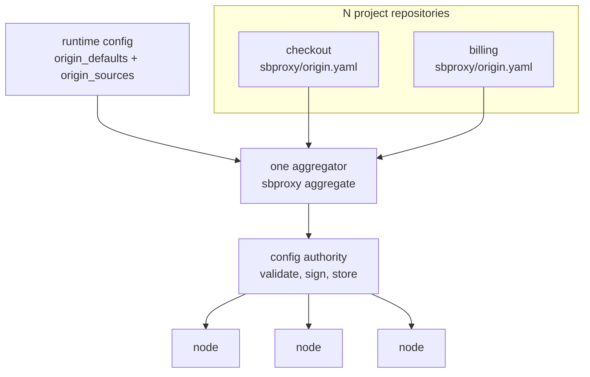

# Running the aggregator

*Last modified: 2026-08-28*

For a platform team standing up origin aggregation. You want service teams to change their own proxying by merging in their own repositories, and you want a floor none of them can switch off.

The service-team side of this is [origin-profiles.md](origin-profiles.md). The field-by-field reference is [configuration.md](configuration.md#project-owned-origin-profiles).

## What you own and what they own

| Block | Owner | Role |
|---|---|---|
| `origin_defaults` | you | what an origin is before any project has an opinion about it |
| `origin_sources` | you | which repositories to pull, what hosts each answers on, what inputs each gets |
| `overrides:` on an entry | you | the last word, layered after everything the project wrote |
| `sbproxy/origin.yaml` in a project repo | the service team | what their service does |

Neither side can author a whole origin alone. That is the point.

## Composition runs in one place



Composition is a step in front of the config authority you already have, not a new deployable and not something every node does.

Composing on every node would cost four things. A `git clone` per entry per interval per node. N project teams each holding a fleet-wide reload trigger against one global reload lock that returns `Busy` rather than queueing. N clones held under that lock. And a local cache that is authoritative at boot with no signature on it.

So nodes keep the subscriber they already have. They receive an ordinary signed bundle and never clone a project repository.

## The floor

```yaml
origin_defaults:
  policies:
    - name: platform_waf
      type: waf
      owasp_crs:
        enabled: true
        managed_bundle: true
      action_on_match: block
      locked: true
    - name: rate_limit
      type: rate_limiting
      requests_per_minute: 600
      burst: 100
  request_modifiers:
    - name: platform_headers
      headers:
        set:
          X-Served-By: sbproxy
```

Every entry carries a `name:`, because a default has to be addressable to be overridable. An unnamed entry in `origin_defaults` is refused at config load.

`locked: true` refuses a project override, and also refuses a project addition that would shadow this entry's effect. A lock binds what an entry *does*, not what it is called, so a project one rename away from the thing the lock exists to stop is refused too. The three rules, and why a project script body in a list holding a lock is refused outright, are in [configuration.md](configuration.md#list-merge-by-name).

Two things about locks that are easy to get wrong:

**A lock protects the floor from projects, not from you.** An entry's `overrides:` block passes straight through a lock, because that block is the runtime config speaking to itself and it is layered last in any case.

**A project cannot lock anything.** A profile that sets `locked:` is refused. Locking is the runtime config's verb.

Choose what to lock by asking what a project switching it off would cost you. A WAF, a security-headers policy, an authentication requirement: lock those. A rate limit that every project needs to tune: do not, or every tuning change becomes a pull request against your repository, which is the workflow this feature exists to remove.

## The entries

```yaml
origin_sources:
  tier: production

  aggregator:
    poll_interval_secs: 120
    debounce_secs: 15
    max_deferral_secs: 120
    concurrency: 8
    deadline_secs: 300

  entries:
    - name: checkout
      repo: https://git.example.com/acme/checkout
      revision: refs/tags/v1.4.2
      path: sbproxy/origin.yaml
      credential: secret://ci/github-token
      verify_signature: true
      timeout_secs: 30
      environment: prod
      hosts:
        api:
          - checkout.example.com
        webhooks:
          - hooks.example.com
      inputs:
        upstream_host: checkout-us-east-1.internal.example.com
      overrides:
        authentication:
          type: api_key
          header_name: X-Api-Key
          api_keys:
            - "${CHECKOUT_INBOUND_KEY}"
```

`hosts` is a map from the profile's `spec` key to real hostnames. This is where a hostname enters the system, and it is the field a project cannot write.

`inputs` binds the names the profile declared. They substitute as text through `{{vars.NAME}}`, and are checked afterwards, so a host-backed reference (`env:NAME`, `file:/path`) is refused here exactly as it would be inside the profile.

`overrides` is ordinary runtime YAML layered after everything the project wrote. `${VAR}` resolves here and does not in a profile, which makes this the only correct home for anything credential-bearing.

### Pinning per environment

`tier` is a property of the document, not of an entry. An entry that could declare its own tier could declare its way out of the pinning rule.

| Tier | Requires |
|---|---|
| `development` | nothing; a branch name or `HEAD` is accepted |
| `production` | an immutable pin: a full commit sha, or a tag spelled the long way (`refs/tags/v1.4.2`) |

A bare `v1.4.2` is refused in a production-tier document, because git does not tell a tag from a branch by spelling. Production also requires `verify_signature: true`: a pin you cannot verify is a pin somebody else can move.

Run one document per environment, or one document with a `tier` per environment. Do not run `development` in production because one repository has not cut a tag yet; that is the whole guarantee.

### What the polling costs

`poll_interval_secs` drives one `git ls-remote` per unpinned entry, which is one round trip with no working tree. At the default of 120 seconds that is 30 requests per hour per repository. A fetch happens only when the resolved sha moved, which means three reductions fall out for free: an entry pinned to a full sha is never polled at all, two entries pinned to the same repository and revision are one fetch, and a round where nothing moved composes nothing, publishes nothing, and leaves every subscriber on its `304`.

Argo CD's repo-server resolves an ambiguous revision the same way and keys its manifest cache on the resolved sha.

`debounce_secs` is what turns three teams merging inside one minute into one composed document and one published revision rather than three fleet reloads. `max_deferral_secs` is the ceiling on that window, measured from its first movement, so a continuously-changing entry still publishes.

## Running it

One round, publishing through the authority:

```console
$ sbproxy aggregate runtime.yml \
    --admin-url https://authority.internal:9443 --password "$SB_ADMIN_PASSWORD"
aggregate: published revision 12 (3 origins from 2 entries, digest 9f86d081884c7d65)
```

Continuously, which is how it runs in production:

```console
$ sbproxy aggregate runtime.yml --watch \
    --admin-url https://authority.internal:9443 --password "$SB_ADMIN_PASSWORD"
aggregate: watching 2 entries; poll 120s, debounce 15s, ceiling 120s
```

Offline, for a single node, a self-host, or a CI job that reviews the composed output before it ships:

```console
$ sbproxy aggregate runtime.yml --out composed.yml
aggregate: wrote 3 origins from 2 entries to composed.yml (4812 bytes, digest 9f86d081884c7d65)
```

In CI, to fail a pull request that would change the composed document without saying so:

```console
$ sbproxy aggregate runtime.yml --out composed.yml --dry-run
aggregate: composed.yml would change:
  -      url: https://checkout-us-east-1.internal.example.com
  +      url: https://checkout-us-west-2.internal.example.com
$ echo $?
2
```

It prints a line diff against the file already there, not a summary
count, so a CI job asserts on the **exit code**: `2` means the composed
document would change, `0` means it would not. A file that does not
exist yet exits `2` with `composed.yml does not exist; composing would
create it with 3 origins`.

The diff trims the lines the two documents share at the top and at the
bottom and prints what is left, so a change to one leaf prints that leaf
and nothing around it: the `action:` line above the url is identical on
both sides and never appears. The run above is a platform-side edit,
which leaves every project's resolved commit alone. When the change came
from a **project** repository instead, its new commit lands in the
provenance header at the top of the file, so the diff starts there and
runs down to the last changed line. That is why the exit code, not the
shape of the output, is what a CI job asserts on. The diff is capped at
200 lines.

## When a project pushes something broken

Two failure classes, deliberately kept apart.

**A single entry that will not fetch** is not the same as a composed document that will not compile. One unreachable repository must not discard the other forty-nine entries' last-known-good, so a fetch failure falls back to that entry's last resolved document and is reported by name:

```
aggregate: warning: entry `billing` (https://git.example.com/acme/billing) did not resolve: connection timed out after 30s; reusing its last resolved document at a1b2c3d4e5f6
```

An entry that fails its **first** fetch has no last-known-good, and there the round aborts. Composing without it would publish a document whose `origins:` silently lacks that project's hosts, which is a service taken offline by a network blip.

**A composed document that will not validate** aborts the whole round and publishes nothing. The fleet stays on the revision it has.

Every refusal names the entry:

```
aggregate: composition refused: entry `checkout`: policy `platform_waf` is locked in origin_defaults and the profile at sbproxy/origin.yaml overrides it
aggregate: nothing was published and nothing was written.
```

That attribution is the feature. A composed document is assembled from N repositories, and an unattributed YAML parse error in one of them is a message nobody can act on.

## What to watch

| Signal | Means |
|---|---|
| `sbproxy_aggregate_rounds_total{outcome}` | rounds by what the round decided to do; a `failed` series climbing means a project is pushing something that will not compose |
| `sbproxy_aggregate_entries{outcome}` | entries by the outcome of the last round, written on every round including the zeroes, so a failure that clears shows as the drop rather than as a series that stops moving |
| `sbproxy_aggregate_published_revision` | the authority revision the aggregator last published; flat while entries move means nothing is reaching the fleet |
| `sbproxy_aggregate_compose_duration_seconds` | wall clock for one round, fetches included |
| `GET /admin/config-authority/status` | `applied_current_count` against `apply_failed_count`: 31 of 34 applied r12, 3 failed |
| `GET /admin/origin-composition` | on a node: which project and which commit set each leaf of the document it is running |

## Undoing a publish

A composed document that reached the fleet is undone at the authority, not on a node. Roll back one step, or name an archived revision:

```console
$ sbproxy config authority rollback --to-revision 10 \
    --admin-url https://authority.internal:9443 --password "$SB_ADMIN_PASSWORD"
config authority rollback: republished revision 10's payload as revision 13, replacing revision 12
config authority rollback: the number moves forward because a subscriber refuses a revision that is not greater than the one it applied. Subscribers take it on their next poll.
```

Fix the project repository before the next poll, or the aggregator composes the same thing again. See [config-rollback.md](config-rollback.md#4-the-whole-fleet-took-the-change).

## Related

- [origin-profiles.md](origin-profiles.md) - the service-team side.
- [configuration.md](configuration.md#project-owned-origin-profiles) - the field-by-field reference.
- [config-rollback.md](config-rollback.md) - undoing a publish, at the node and at the authority.
- [config-authority-drills.md](config-authority-drills.md) - two-process drills for signed config distribution.
- [examples/origin-profiles](../examples/origin-profiles/) - a runnable runtime config and the profile that composes against it.
