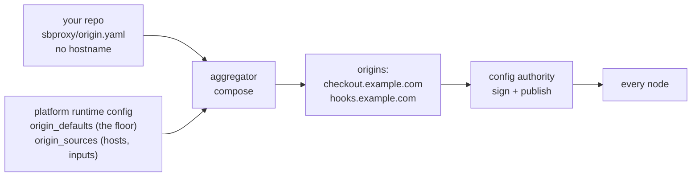

# Writing an origin profile

*Last modified: 2026-08-28*

For a service team shipping its first `OriginProfile`. You want to change how your own service is proxied, and you do not want to open a pull request against the platform team's repository to do it.

You commit one file, `sbproxy/origin.yaml`, in your own repository. An aggregator composes it against the platform's floor and publishes the result. Nothing else in your repository changes, and nothing in the platform's repository changes either.

The platform side of this is [origin-aggregation.md](origin-aggregation.md). The field-by-field reference is [configuration.md](configuration.md#project-owned-origin-profiles).

## Why your file never names a hostname

`origins:` in a runtime config is a map keyed by hostname. Authoring an entry in it means authoring the key, and the key is the one thing you do not know: a hostname is an environment fact, and the same service answers on a different one in staging.

So a profile is hostless. There is no field that could hold a hostname. You declare what your service does and what it needs; whoever deploys it supplies the host.



## The smallest profile that works

```yaml
name: checkout

inputs:
  - name: upstream_host
    description: the regional upstream this deployment sends to

spec:
  api:
    base:
      action:
        type: proxy
        url: "https://{{vars.upstream_host}}"
```

Three things to notice.

`spec` is a map of *profile origin name* to that origin's layers, not a single origin. `api` here is a name you choose; the platform binds it to real hostnames in its `origin_sources` entry. Declare a second key and you have declared a second origin, which is how one repository ships an API host and a webhook host together.

`inputs` is your contract with whoever deploys you. Each one is a name and a description, optionally a default. An input with neither a bound value nor a default is a resolve error naming both the input and the entry; it is never a warning and never passed through as literal text.

`{{vars.NAME}}` is how an input reaches the document. It substitutes as **text**, before the document is parsed as config.

## What you may set, and what you may not

A project may set exactly these origin fields:

`action`, `authentication`, `policies`, `transforms`, `request_modifiers`, `response_modifiers`, `cors`, `compression`, `error_pages`, `problem_details`, `deprecation`, `expose_openapi`, `agents_md`, `ai_txt`, `agents_json`, `agent_skills`, `default_content_shape`, `content_signal`, `token_bytes_ratio`.

Everything else on an origin is unrepresentable rather than merely rejected. There is no field in the profile schema that could hold it, so the parse fails and names the key you typed. That is an allowlist on purpose: an origin has 53 fields and gains more regularly, and a deny list would make every future field a silent grant to every project repository.

Two things you will reach for and not find:

**Secrets.** A profile is a confined document. `${VAR}`, `env:NAME`, and `file:/path` are all refused inside one, and so is a secret written out in full. The aggregator has an environment and your profile does not get to read it. Anything credential-bearing goes in the entry's `overrides:` block, which is ordinary runtime YAML owned by the platform.

**Hostnames.** Covered above. If you find yourself wanting one, what you actually want is an input, or a second `spec` key the platform can bind.

## Merging against the floor

The platform's `origin_defaults` is the floor every origin starts from. Your layer goes on top of it, and `policies`, `transforms`, `request_modifiers` and `response_modifiers` merge entry by entry against a `name:` key.

```yaml
spec:
  api:
    base:
      policies:
        # The floor already carries `rate_limit`. Naming it merges into
        # it: `burst` and `type` survive from the floor, and this file
        # wins on the field it names.
        - name: rate_limit
          requests_per_minute: 1200

        # A name the floor does not carry is appended after it.
        - name: checkout_request_limit
          type: request_limit
          max_body_size: 1048576
```

| You wrote | What happens |
|---|---|
| a name the floor carries | field-level merge, you win per field |
| a name the floor does not carry | appended after the floor, in your order |
| an unnamed entry | always an addition, appended |
| a name the floor marked `locked: true` | refused, naming the policy, your profile, and the entry |
| an addition that shares an effect with a locked entry | refused, naming the lock and the effect you share |
| `disabled: true` on an unlocked floor entry | dropped, and the drop is recorded |
| `policies: []` | the floor survives intact |

There is no delete verb. `disabled: true` leaves a record; an absence does not, which is why an empty list cannot silently remove a security floor.

A lock binds what an entry *does*, not what it is called, so renaming your way around one does not work. The full rule, including why a script body in a list holding a lock is refused outright, is in [configuration.md](configuration.md#list-merge-by-name).

## Environments

`environments` is for structural differences between deployments, selected by the entry's `environment:` field. It grants nothing; a project cannot choose which one applies.

```yaml
spec:
  api:
    base:
      action:
        type: proxy
        url: "https://{{vars.upstream_host}}"
    environments:
      prod:
        action:
          host_override: checkout.internal.example.com
      staging:
        action:
          url: https://checkout-staging.internal.example.com
```

Layers apply in this order, and later wins:

1. `origin_defaults` (platform floor)
2. `spec.<origin>.base` (yours)
3. `spec.<origin>.environments.<env>` (yours, selected by the platform)
4. `overrides:` on the source entry (platform, last word)

## Test it before you merge

You do not need the aggregator or a cluster. Compose against a copy of the runtime document and look at what comes out:

```console
$ sbproxy aggregate runtime.yml --out composed.yml
aggregate: wrote 3 origins from 2 entries to composed.yml (4812 bytes, digest 9f86d081884c7d65)
```

Then ask where each leaf came from:

```console
$ sbproxy aggregate runtime.yml --explain checkout.example.com
checkout.example.com
  action.host_override                spec.environments[prod]  entry checkout  https://git.example.com/acme/checkout@a1b2c3d4e5f6
  action.type                         spec.base                entry checkout  https://git.example.com/acme/checkout@a1b2c3d4e5f6
  action.url                          spec.base                entry checkout  https://git.example.com/acme/checkout@a1b2c3d4e5f6
  policies[platform_waf].type         origin_defaults
  policies[rate_limit].burst          origin_defaults
  policies[rate_limit].requests_per_minute  spec.base          entry checkout  https://git.example.com/acme/checkout@a1b2c3d4e5f6
```

The second column is the whole review: it names the layer that set each leaf, so it tells you which of your changes actually reached the composed origin and which the floor kept. No value is ever printed, only where it came from; the value is in the composed document beside it.

To see whether your change would move anything at all, without writing:

```console
$ sbproxy aggregate runtime.yml --out composed.yml --dry-run
aggregate: composed.yml would change:
  -      requests_per_minute: 1200
  +      requests_per_minute: 2400
```

A line diff against the file already there, and exit code `2` when there
are changes, which is what a CI job checks. `0` means your edit composed
to exactly what was already committed.

## When the aggregator refuses you

Every refusal names your entry. A round that fails composes nothing and publishes nothing, so a broken profile in your repository never becomes a broken configuration on a node.

| Message names | What to change |
|---|---|
| a locked policy, your profile, and the entry | ask whoever owns `origin_defaults`; a lock is not yours to override |
| an input with no bound value and no default | either give it a `default:` or ask the platform to bind it |
| an input the profile does not declare | the platform bound a name you removed; declare it or ask them to drop the binding |
| a `${VAR}` or `file:` reference | a profile is confined; it belongs in the entry's `overrides:` |
| a hostname anywhere | there is no field for one; you want an input or a second `spec` key |
| an origin field that is not on the allowlist above | it is platform-owned; the message names the key |

## Related

- [origin-aggregation.md](origin-aggregation.md) - the platform side: the floor, the entries, and running the aggregator.
- [configuration.md](configuration.md#project-owned-origin-profiles) - the field-by-field reference for both blocks.
- [examples/origin-profiles](../examples/origin-profiles/) - a runnable pair: a runtime config and the profile that composes against it.
