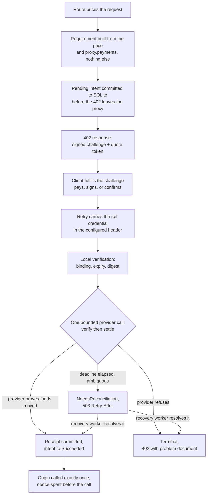

# Payment settlement

*Last modified: 2026-09-05*

`proxy.payments` is how SBproxy charges for a request and proves it was
paid. It is Apache-2.0, it is off unless you configure it, and it holds
one rule above everything else: a paid request reaches the origin only
after a durable record says the payment settled.

Verified is not settled. A timeout, an open circuit breaker, a provider
response the proxy cannot parse, an unpaid invoice, or a write whose fate
is unknown all stop the request in front of the origin. There is exactly
one transition that opens the route, and it is a committed row in SQLite.

If you only want the wire bytes, read
[402-challenge.md](402-challenge.md). If you only want to price crawler
traffic, read [ai-crawl-control.md](ai-crawl-control.md). This page is
the operator guide that sits between them.

## Vocabulary

These nine words appear in every error message, metric, and table below.

| Term | What it is |
|---|---|
| Requirement | The normalized statement of what is owed: amount, currency, rail, recipient, network, expiry. Built from the route's price and `proxy.payments`, and from nothing else. |
| Challenge | The requirement rendered onto the wire in one protocol, signed and bound to the proxy that issued it. |
| Credential | What the client sends back. An `Authorization: Payment` value, an x402 `PAYMENT-SIGNATURE` value, or a legacy `Crawler-Payment` token. |
| Intent | The durable row that owns one logical payment. It has exactly one state at a time. |
| Attempt | One numbered interaction with a provider under one idempotency key. An intent can have several. |
| Settlement | The rail reaching its own authoritative paid state, confirmed by the provider. |
| Receipt | The record of that settlement, carrying the provider's own reference. Written before any origin call. |
| Usage report | Consumption accounting. It never proves payment and cannot settle an intent. |
| Reconciliation | Asking a provider what happened to a write whose outcome was never recorded. It is a read. |

## The five phases, in order

Keeping these separate is the whole design. Collapsing any two of them is
how a gateway ends up serving content it was not paid for.

1. **Negotiation.** The client says which methods it can pay with. The
   proxy picks one. Nothing is charged and nothing is promised.
2. **Challenge.** The route computes a price. The proxy builds one
   normalized requirement, persists it as a `Pending` intent, signs it,
   and answers 402. For a rail that needs a provider object first, such
   as a manual-capture PaymentIntent or a Lightning invoice, that object
   is created here under a durable idempotency key. Preparation never
   captures funds, never calls the origin, and never emits a receipt.
3. **Authorization.** The client retries with a credential. The proxy
   verifies the signed requirement locally, loads the intent the
   challenge created, reserves the credential's digest against that one
   intent, stamps a dispatch record, and performs the rail's required
   verify and settle inside one bounded deadline.
4. **Delivery.** Only after `Succeeded` is committed and read back does
   the request reach the origin.
5. **Usage reporting.** Separate queue, separate registry, separate
   types. A reporter cannot construct a receipt.

## The state table

Every durable intent is in exactly one of these states, and each one
answers the only question that matters the same way.

| State | Provider work allowed | Origin access |
|---|---|---|
| `Pending` | Challenge preparation, or waiting for a credential | No |
| `Processing` | One bounded authoritative operation | No |
| `RetryWait` | A retry proven not to have been dispatched | No |
| `NeedsReconciliation` | Provider status query only | No |
| `Stranded` | Provider status query only | No |
| `Terminal` | None | No |
| `Succeeded` | No repeat charge, receipt lookup only | Yes |

`Stranded` is `NeedsReconciliation` with one thing given up on, and it is
worth being precise about which. The payment is still unresolved and the
provider is still being asked about it. What ended is the route's wait:
the intent no longer withholds fresh challenges. See
[The unattributable wait has a deadline](#the-unattributable-wait-has-a-deadline).

The mapping from a failed authorization to a durable state is decided by
the dispatch gate, not by the error text:

| What happened | Durable transition | What the client sees |
|---|---|---|
| The rail settled and the receipt committed | `Succeeded` | The origin's response |
| The provider refused | `Terminal` | 402 with a problem document |
| The deadline elapsed before anything was dispatched | `RetryWait` | 503 with `Retry-After` |
| The deadline elapsed after dispatch | `NeedsReconciliation` | 503 with `Retry-After` |
| The provider's success response could not be parsed | `NeedsReconciliation` | 503 with `Retry-After` |
| The provider answered a dispatched write with a status its contract does not define as an answer | `NeedsReconciliation` | 503 with `Retry-After` |
| The rail verified but did not settle | `NeedsReconciliation` | 503 with `Retry-After` |

"The provider refused" means the provider answered in its own protocol
that no funds moved, and each rail draws that line where its published
contract does. On x402 only a 2xx settle body saying `success: false`
counts, because x402 v2 defines no error response at all. Stripe counts
a 4xx other than 409 and 429, because Stripe publishes a machine
readable error object for those and documents 409 and 429 as
retry-or-reconcile. Everything a rail's contract does not cover is
unknown rather than refused, and unknown is a `NeedsReconciliation` row
somebody can still resolve. Terminal is the one transition that asserts
the money did not move; a status nobody defined is not evidence of that.

A `NeedsReconciliation` intent is never retried by the request path. A
second attempt is how a payer gets charged twice, so the client waits for
the recovery worker instead.

That rule outranks the challenge's expiry, and it has to. No sweep
resolves an intent in this state: the challenge sweep only touches
`Pending`, and it skips any intent whose provider write is still
outstanding. So a `NeedsReconciliation` intent whose challenge has aged
out means the provider has been unreachable for a while and nothing more.
It keeps answering 503 with `Retry-After`, because the payer whose funds
may already have moved is owed a resolution rather than a fresh bill.
That answer does not change when the intent later reaches `Stranded`: the
payer is still owed a resolution and is still not handed a fresh bill for
the same content.

The same reasoning applies one step earlier. While an intent for a route
sits in `NeedsReconciliation`, that route issues no new challenge to the
payer the stuck intent belongs to: the request gets 503 with
`Retry-After` instead of a 402.

Who a payment belongs to is stamped on the intent when it is minted, as a
salted HKDF derivation of the caller identity the request had already
proved to the proxy. An authenticated inbound key is the first choice.
Failing that, a resolved agent identity counts when it came from a
verified Web Bot Auth `keyid` or a forward-confirmed reverse DNS match,
which is the bar the `agent_class` verified header already uses. A
`User-Agent` regex match does not count, because any client can assert
one. The client IP does not count either: an egress pool rotates it
between two requests seconds apart, and a NAT shares one address between
unrelated crawlers. The derivation lives in the settlement database and
nowhere else. It is never a metric label, never a log or tracing field,
and never part of a response.

Three situations still withhold the route from everybody, and each of
them is the conservative answer to a question the proxy cannot settle. An
intent written before this scoping existed carries no payer, so it could
be anybody's payment that is stuck. An intent minted for a caller the
proxy could not identify carries no payer for the same reason. And a
request that arrives with no identity of its own waits only on
unresolved intents that still have no payer hash: a first-ever stall
from a never-verified anonymous payer is still route-wide.

No settlement rail supplies a payer identity of its own at challenge
time, which is why the scope key usually comes from the request rather
than from the credential. The challenge path is by definition the path
where no live quote token addresses a durable challenge. Lightning and
direct Stripe carry no client credential at all, and a Lightning invoice
records no payer even after it is paid. A Payment HTTP Authentication
credential binds to one challenge rather than to a payer. An x402
payload digest identifies one payment rather than one payer, so a client
that re-signed would read as a stranger and be handed the second bill
this rule exists to prevent.

WOR-2302 closes the anonymous x402 hole one redemption later. After
`/verify` succeeds, the facilitator-supplied `payer` is hashed
(domain-separated SHA-256, never the raw address) onto the intent. That
row then withholds only from that hash. Other anonymous x402 callers of
the same route are billable again. The residual this ticket accepts is
the first stall of a never-verified payer, and a later challenge from
the same wallet that still presents no identity at mint time: those stay
unkeyed. The hashed payer never reaches a metric label, a log line, or a
response body.

The refusal is still worth alerting on. On a rail with an authoritative
status query the wait is one worker sweep. On a rail without one, x402 v2
today, it lasts until an operator resolves the intent with the
facilitator, and that payer buys nothing in the meantime. It is counted
as `sbproxy_payment_settlement_total{operation="challenge",
outcome="unresolved_payment"}` and logged at warn with the intent id, the
origin, and the route, and with nothing at all about who is paying.

An ordinary client being early is nothing like that state. A crawler
that retries before its invoice is paid is answered 503, but a rail's
own status check is a clean, repeatable read rather than a stamp on the
intent: it leaves the intent in `RetryWait`, checked fresh on every
request rather than remembered from an earlier unpaid answer. Paying
and retrying is all it takes; the very next request settles, with no
worker sweep in between. The `Retry-After` on the 503 is a suggested
pace for that retry, not a wait for anything running in the background.
What the recovery sweep actually resolves is narrower: a provider
response that could not be read as a clean negative, a malformed
success, or a deadline that elapsed after the provider was actually
asked to act, all of which land in `NeedsReconciliation`, along with the
unattributable-payer wait described above.

## The unattributable wait has a deadline

Those three situations are the expensive ones, and for anonymous crawler
traffic the third is not an edge case. A caller with no authenticated key
and no verified agent identity is the ordinary shape of the traffic this
subsystem prices, so the intents it mints ordinarily carry no payer and
withhold the whole route. Left alone that is unbounded: on a rail with no
status query nothing resolves the stuck intent by itself, so one stuck
payment can take a route's revenue to zero for the length of a provider
outage.

The bound comes off the payment rather than off a number somebody picked.
A route is withheld because the stuck intent might be a payment you owe
service for, and you can only owe that service through the quote token
the 402 handed out. That token carries an expiry copied from the
challenge, and an expired token is refused before anything else happens.
Past the challenge's expiry the stranded payer cannot redeem that intent
whatever the money turns out to have done, so continuing to withhold the
route protects nobody from a second bill. It only guarantees that nobody
is billed at all.

So the deadline is the challenge's own expiry plus a **15 minute grace
window**. The grace is there for the reconciliation sweep rather than for
the payer: at the default one second cadence it is nine hundred more
attempts to resolve the payment honestly, so an intent only reaches the
deadline when it genuinely could not be resolved.

At the deadline the recovery worker moves the intent to `Stranded` and
the route starts issuing challenges again. Four things are deliberately
true of that state:

- It is not `Succeeded`. Nothing about the money was proved and no
  receipt exists, so it cannot admit a request to the origin. Exactly one
  state does that and this is not it.
- It is not `Terminal` either. Terminal asserts that no funds moved.
  This asserts nothing at all, which is the honest position, and the
  intent keeps the `ambiguous` failure category it was stranded with.
- It is not discarded. The provider attempt underneath stays on the
  reconciliation queue, so the sweep keeps asking, and a provider that
  answers later still commits a real receipt and still moves the intent
  to `Succeeded` or `Terminal`.
- It never comes back. A stranded intent does not return to
  `NeedsReconciliation` and does not start withholding the route again.

Intents that do carry a payer have no deadline and keep waiting. Those
withhold challenges from one caller rather than from a route, which is a
bounded cost, and that caller is somebody you can concretely owe money
to: billing them again is the real double charge rather than a
hypothetical one.

**What to do when this fires.** Each aged-out intent is one payment you
cannot account for. Take the intent ids out of the settlement database:

```sql
SELECT intent_id, origin_id, route, amount_micros, currency, expires_at_ms
  FROM payment_intents
 WHERE status = 'stranded'
 ORDER BY expires_at_ms;
```

Then reconcile each one with the provider by hand, using the provider
handle and idempotency key on its attempt row, and refund or credit
anything that turns out to have settled. That payer was never served.

The transition is counted as
`sbproxy_payment_recovery_total{operation="strand_intent",
outcome="stranded"}`, once per intent however long it stays stranded,
and logged at warn with the count for the sweep. Alert on the rate. A
non-zero rate means unaccounted money; a rate that climbs means the rail
behind it stopped answering entirely.

## The request path, end to end

With `proxy.payments` present, an `ai_crawl_control` 402 is settled
through the durable machinery above instead of the legacy in-memory
ledger. The pairing is two blocks with different owners, and the gate is
the seam between them:

- `ai_crawl_control` decides which requests are payable and what they
  cost: crawler signatures, free paths, tiers, the price.
- `proxy.payments` decides how a payment settles: rails, credentials,
  durable state, timeouts, and the failure posture.



The receipt commit at `I` is the only edge into `L`. Every other outcome,
including a provider that later comes back positive through `K`, still
answers the request that triggered it with a refusal or a retry; a later
`Succeeded` only unblocks the *next* request on that route. See
[The state table](#the-state-table) for what governs each of these
transitions and [Replay protection, and where it stops](#replay-protection-and-where-it-stops)
for what "exactly once" at `L` actually guards against.

The smallest pairing that settles is
[`examples/settlement-gate-local/sb.yml`](../examples/settlement-gate-local/sb.yml),
which runs against a stub Core Lightning node and needs no payment
provider.
[`examples/rail-x402-base-sepolia/sb.yml`](../examples/rail-x402-base-sepolia/sb.yml)
is the same pairing on the x402 rail; it issues the challenge and cannot
settle it without a reachable facilitator. Every field in both is
explained in the reference below.

### The challenge

1. The policy prices the request and denies it. The gate intercepts the
   402 before it is written.
2. The gate picks a rail: the client's `Accept-Payment` preference list
   (`x402`, `mpp`, `lightning`, with q-values) is intersected with the
   rails `proxy.payments` configures, honoring any per-tier `rails:`
   floor. No preference means the first configured rail; a preference
   set with no overlap is a 406 naming the `supported_rails`. Direct
   Stripe has no `Accept-Payment` token and is selected only when the
   client expresses no preference, because that mode is an operator
   opt-in rather than a negotiated one.
3. If an intent for this route is already in `NeedsReconciliation`, the
   gate stops here and answers 503 with `Retry-After`. That payment may
   have moved a payer's money, and a fresh invoice for the same content
   would be a second bill for it. An intent that already reached
   `Stranded` does not stop the gate: its deadline passed, so the route
   is billable again.
4. The matched price compiles into one normalized requirement, and a
   durable `Pending` intent is committed before the 402 leaves the
   proxy. A crash after this point leaves a record, never a dangling
   provider object.
5. The 402 is rendered in the rail's own wire shape. Whatever the rail,
   the signed quote token rides the policy's configured challenge
   header (`crawler-payment` by default), and the retry re-presents it
   there verbatim.

| Rail | What the 402 carries beyond the quote token |
|---|---|
| x402 | The v2 `PaymentRequired` JSON body (resource, `accepts`, the `sbproxy-requirement` extension) and the same object base64-encoded in `PAYMENT-REQUIRED`. |
| Payment Auth | One `WWW-Authenticate: Payment` field per offered challenge, `Cache-Control: no-store`, and an informative JSON body. |
| Direct Stripe | A JSON body whose `challenge` object names the PaymentIntent and carries the one-shot `client_secret`. The secret goes into this immediate response and nowhere else. |
| Lightning | A JSON body whose `challenge` object carries the BOLT 11 invoice, the payment hash, and the durable label. |

### The retry

1. The quote token from the configured header is authenticated and its
   claims name the durable intent. A token that does not authenticate,
   or names no live challenge, gets a fresh 402 and nothing else.
2. The rail's credential is extracted. x402 reads exactly one
   `PAYMENT-SIGNATURE` header and takes the canonical scheme payload as
   the proof. Payment Auth reads exactly one `Authorization: Payment`
   field; two is a 400, and every refusal on that rail is an
   `application/problem+json` document under the canonical
   `https://paymentauth.org/problems/` types. Direct Stripe and
   Lightning carry no separate credential: the re-presented quote token
   is the proof, and the provider settles out of band.
3. The service authorizes: local verification, the durable intent, the
   proof reservation, one bounded provider interaction, and the
   committed receipt, in that order.
4. Exactly one outcome reaches the origin: a committed `Succeeded` row,
   rechecked at the decision boundary. The durable intent stays
   redeemable so an interrupted payment can resume, and a single-serve
   nonce on the request path is what makes one settled payment serve
   the content exactly once. A second presentation of a settled
   credential is refused as `proof_replayed`.

### Replay protection, and where it stops

Two different things are being prevented, and it is worth keeping them
apart, because they used to have different durability.

**Paying twice.** A credential's digest is reserved against exactly one
intent before any provider call, in the same row-level transaction that
owns the intent. A digest already reserved for another intent is refused
as `proof_replayed`, and a repeat of a request that already succeeded
returns the stored receipt instead of settling again.

**Being served twice for one payment.** A settled intent stays
redeemable on purpose, so a payment interrupted between the provider's
confirmation and the response can resume. What stops that from becoming
a free second response is the quote nonce, spent once, after the receipt
is committed and before the origin is called.

Both records live in the SQLite file at `proxy.payments.state_path`, and
both survive a restart. The nonce is spent with a single insert against
a unique constraint rather than a read followed by a write, so two
simultaneous presentations of one settled quote produce exactly one
served response and one `proof_replayed` refusal, whichever order they
arrive in.

Spent nonces are pruned at the moment their quote token expires, which
is the bound the token already carries. A nonce for an expired token can
never be validly presented again, so forgetting it costs nothing, and
the pruning happens inside the next spend rather than on a timer. The
table therefore holds live nonces plus whatever expired since the last
paid request.

The boundaries:

- **One node.** This is one local file. A node that also configures
  `proxy.cluster` refuses to start, for the reasons in
  [What this release does not do](#what-this-release-does-not-do).
  Across a mesh with no shared backend, each node would keep its own
  nonce ledger and the same payment could serve once per node.
- **Restoring a backup rewinds it.** The nonce ledger is in the same
  file as the intents and receipts, so restoring an older copy can bring
  back a nonce that was already spent. That is the same exposure as
  restoring over a settled intent, and it resolves the same way:
  reconciliation, on the rails that can answer.
- **`failure_mode` still applies to the spend.** If the database cannot
  be reached at that moment the spend fails, and it fails as an error
  rather than as a successful spend: there is no outcome on that path
  that reads as "served". Under the default `closed` posture the request
  is refused with a 503. Under `open`, `degraded`, or `observe` it is
  admitted, the same as any other infrastructure failure, and admitting
  there means a paid response could be served more than once. If that
  matters more to you than availability, leave `failure_mode` at
  `closed`.

### When settlement itself breaks

`failure_mode` owns what happens when the infrastructure, not the
payment, cannot answer: the store errors, a challenge cannot be
prepared, the signer refuses. It reuses the shared posture vocabulary
and defaults to `closed`.

| Posture | A payable request during an infrastructure failure |
|---|---|
| `closed` | Refused with 503 and `Retry-After`. The default. |
| `open` | Admitted unpaid, counted, nothing else recorded. |
| `degraded` | Admitted unpaid with the waived guarantee logged loudly, so an operator can alert on revenue that went uncollected. |
| `observe` | Admitted unpaid, with the decision the gate would have taken recorded. For rolling settlement out against live traffic. |

A rejected, expired, replayed, or unsettled payment is never subject to
this posture. Payment refusals always keep the request away from the
origin.

### Testing the gate

The decision matrix runs as unit tests against the real SQLite store
and scripted rails:

```bash
cargo nextest run -p sbproxy-core \
  --features payment-x402,payment-mpp,payment-stripe,payment-lightning-cln,payment-lightning-lnd \
  settlement_gate
```

The end-to-end proof runs the released binary against a stub Core
Lightning node and a counting stub origin, and asserts the origin serves
exactly once per settled payment:

```bash
CARGO_TARGET_DIR=target/payments cargo build --release -p sbproxy \
  --features payment-x402,payment-mpp,payment-stripe,payment-lightning-cln
SBPROXY_E2E_PAYMENTS_BIN=target/payments/release/sbproxy \
  cargo test -p sbproxy-e2e --release --test settlement_gate
```

### The same sequence, by hand

[`examples/settlement-gate-local/`](../examples/settlement-gate-local/)
runs what that e2e test asserts, as a config you can curl at. It pairs a
stub Core Lightning node on a Unix socket with an origin that counts
every article it actually serves, so the wire shapes below are the ones
the renderer produced against a running proxy rather than transcribed
from it.

Lightning is the rail it uses because Lightning is the only one that runs
hermetically: CLN is a Unix socket, not an HTTP endpoint, so a stub needs
no TLS and no reachable host. x402, Payment HTTP Authentication, direct
Stripe, and LND each require an HTTPS endpoint, and no configuration
relaxes that, so their bodies are not reproduced here.

Each block below comes from its own fresh stack, and running them back to
back against one stack does not reproduce them. The second one strands an
intent and never pays it, and an unresolved intent withholds new
challenges, which is the rule two sections up. The stub crawler is
identified by `User-Agent` alone, which is not a payer identity, so its
stranded intent is one of the rows that withholds from every payer of the
route. The request after it therefore answers 503 where the first block
shows a 402, and that is the documented behavior rather than a broken
example. Restart the fixture and the proxy between blocks to reproduce
each one.

The walkthrough script at the end of this section is the exception, and it
is repeatable against one stack: it pays the invoice it strands, so its
intent reaches a terminal state instead of sitting unresolved. `/__reset`
on the fixture zeroes the invoice and the hit counter, not the proxy's
intent store, so that is what makes the difference rather than the reset.

The challenge. The policy prices the request, the gate commits a
`Pending` intent before anything leaves the proxy, and the signed quote
token rides the header the policy configured:

<!-- CAPTURE: curl -is -H 'Host: blog.local' -H 'User-Agent: GPTBot/1.0' http://127.0.0.1:8080/article -->

```text
HTTP/1.1 402 Payment Required
content-type: application/json
crawler-payment: <JWS>
content-length: <LEN>
Date: <DATE>
Connection: keep-alive

{"error":"payment_required","rail":"lightning","requirement_id":"req_<ULID>","amount_micros":100,"currency":"BTC","target":"blog.local/article","header":"crawler-payment","expires_at_ms":<EPOCH_MS>,"challenge":{"bolt11":"lnbcrt<INVOICE>","label":"sbproxy-invoice-sbpi_<INTENT>","payment_hash":"<HEX64>"}}
```

The retry before the payment settles. The token authenticates and names a
live intent, so this is not a refusal. It is the 503 case, and it is the
one the gate exists for. It also leaves the intent in
`NeedsReconciliation`, which is why the walkthrough below retries in a
loop rather than asking once:

<!-- CAPTURE: TOKEN=$(curl -sS -D - -o /dev/null -H 'Host: blog.local' -H 'User-Agent: GPTBot/1.0' http://127.0.0.1:8080/article | tr -d '\r' | awk '/^crawler-payment:/ {print $2}'); curl -is -H 'Host: blog.local' -H 'User-Agent: GPTBot/1.0' -H "crawler-payment: $TOKEN" http://127.0.0.1:8080/article -->

```text
HTTP/1.1 503 Service Unavailable
content-type: application/json
Retry-After: 2
content-length: 58
Date: Mon, 03 Aug 2026 22:08:05 GMT
Connection: keep-alive

{"error":"settlement_unavailable","retry_after_seconds":2}
```

A preference list that overlaps no configured rail. The client is told
what it could have asked for instead of being handed a challenge it
cannot pay:

<!-- CAPTURE: curl -is -H 'Host: blog.local' -H 'User-Agent: GPTBot/1.0' -H 'Accept-Payment: x402' http://127.0.0.1:8080/article -->

```text
HTTP/1.1 406 Not Acceptable
content-type: application/json
content-length: <LEN>
Date: <DATE>
Connection: keep-alive

{"error":"no_acceptable_rail","supported_rails":["lightning"],"target":"blog.local/article","message":"Accept-Payment does not overlap with the settlement rails configured for this route."}
```

The whole sequence, with the origin's own hit counter after each step,
because that counter is what proves one settled payment served the
content exactly once. Its third step retries in a bounded loop for the
reason above: the second step stranded the intent, so the request that
reaches the origin is whichever one lands after the worker has swept.
The script asserts every status it prints and, if the loop runs out,
fails with the durable intent status rather than reporting a 503 as
though it were the answer:

<!-- CAPTURE: bash examples/settlement-gate-local/bin/settle-once.sh -->

```text
1 challenge, unpaid crawler   status=402 origin_hits=0
2 retry before payment        status=503 origin_hits=0
3 retry after payment         status=200 origin_hits=1
4 replay of the settled quote status=402 origin_hits=1
5 reader, never challenged    status=200 origin_hits=2
```

The x402 `PaymentRequired` body, the `WWW-Authenticate: Payment` field,
and the `application/problem+json` refusal are specified byte for byte in
[402-challenge.md](402-challenge.md). They are not reproduced here
because no local fixture can settle those rails.

## Which rail to reach for

| Rail | Reach for it when |
|---|---|
| x402 v2 `exact` | The payer is an autonomous agent with a wallet, you want per-request settlement with no account relationship, and you already trust a facilitator. |
| Payment HTTP Authentication with `stripe` and `charge` | The payer speaks the IETF Payment scheme and you want the credential to arrive in a standard `Authorization` field with a body digest bound to it. |
| Stripe PaymentIntents, advertised directly | You already have a Stripe account, the payer is a normal client, and you want challenge, client confirmation, and capture in three explicit steps. |
| Core Lightning | You run CLN v26.06 or newer and want sub-cent amounts settled over your own node. |
| LND | Not servable today. CLN and LND are alternative backends for one advertised `lightning` rail, never both at once, but only the CLN backend has a production transport. See "LND has no production transport yet" below before you configure it. |

The proxy performs no currency conversion. Every rail one route advertises
has to declare the same `quote_currency`, and config load rejects a mixed
challenge by name.

### LND has no production transport yet

`LndSettler` and its contract tests are complete: the settlement logic, the
deterministic preimage derivation, and the wire contract pinned to
`v0.20.1-beta` all exist and are exercised against a recording service in
`crates/sbproxy-billing/tests/lnd_contract.rs`. What is missing is the
transport that would give it a real channel to a node. The generated gRPC
client and the vendored upstream protobufs are a separate slice of work that
has not landed, so `LndTransport` compiles as a trait with no implementor in
this codebase.

The consequence is a startup failure, not a silent gap. A build that
compiles `payment-lightning-lnd` and a config that sets
`proxy.payments.rails.lightning_lnd` registers no adapter, and startup fails
naming the rail, the same path a rail whose feature is entirely missing
already takes. There is no configuration under which the proxy advertises a
Lightning challenge over LND that it has no way to settle.

Until this lands, run Lightning over Core Lightning. The two backends stay
documented side by side in the reference below and in
[`examples/rail-lightning/`](../examples/rail-lightning/) because the
config surface, and the migration path once LND ships, do not change; only
the servability does.

## Build features

The settlement machinery lives in the `sbproxy-billing` crate and none of
it is in the default build. Each surface names the exact feature that
compiles it, and a configured surface whose feature is missing is a
startup failure that prints the feature name rather than a surprise on the
first paid request.

| Configured surface | Cargo feature |
|---|---|
| `proxy.payments` | `payments` |
| `proxy.payments.protocols.payment_auth` | `payment-mpp` |
| `proxy.payments.rails.x402` | `payment-x402` |
| `proxy.payments.rails.stripe` | `payment-stripe` |
| `proxy.payments.usage_reporters.stripe_meter` | `payment-stripe` |
| `proxy.payments.rails.lightning_cln` | `payment-lightning-cln` |
| `proxy.payments.rails.lightning_lnd` | `payment-lightning-lnd` |

Every provider feature implies `payments`, and no payment feature is in
the binary's default set. Build the pair you actually use:

```bash
cargo build -p sbproxy --release --features payments,payment-x402
```

One adapter registers per settlement rail. If a rail is configured, its
feature is compiled, and no adapter registered for it, a credential on
that rail is answered `rail_unsupported` and the request stops in front of
the origin. There is no path where an unregistered rail lets a request
through.

## The configuration, field by field

The block below is the reference document the config crate validates
against. Every field is explained after it. Nothing here is resolved,
opened, or dialed at load: `sbproxy validate` runs this on a machine that
holds none of the credentials.

```yaml
proxy:
  payments:
    state_path: /var/lib/sbproxy/payments.sqlite3
    challenge_binding_key: env:SBPROXY_PAYMENT_BINDING_KEY
    authorization_timeout_ms: 2000
    max_body_bytes: 1048576
    failure_mode: closed
    recovery_encryption:
      key_id: payments-2026-07
      key: env:SBPROXY_PAYMENT_RECOVERY_KEY
      max_age_hours: 23
    worker:
      reconcile_interval_ms: 1000
      max_reconcile_batch: 32
      shutdown_timeout_ms: 5000
    protocols:
      payment_auth:
        draft: draft-ryan-httpauth-payment-01
        realm: api.example.com
        method: stripe
        intent: charge
    rails:
      x402:
        scheme: exact
        network: "eip155:84532"
        asset: "0x036CbD53842c5426634e7929541eC2318f3dCF7e"
        quote_currency: USD
        asset_decimals: 6
        pay_to: "0x1111111111111111111111111111111111111111"
        max_timeout_seconds: 60
        extra:
          name: USDC
          version: "2"
        facilitators:
          - facilitator_url: https://facilitator.example/api
        verify_timeout_ms: 700
        settle_timeout_ms: 1200
        breaker:
          failure_threshold: 3
          open_ms: 5000
          half_open_max: 1
      stripe:
        api_key: env:STRIPE_SECRET_KEY
        api_version: 2026-06-24.dahlia
        account_context: platform
        business_network_id: profile_test_example
        quote_currency: USD
        currency_decimals: 2
        payment_method_types: [card]
        direct_payment_intent:
          enabled: true
          capture_method: manual
      lightning_cln:
        socket_path: /run/lightning/lightning-rpc
        rune: env:CLN_RUNE
        minimum_version: "26.06"
        quote_currency: BTC
        settlement_decimals: 11
        invoice_expiry_seconds: 300
      lightning_lnd:
        endpoint: https://lnd.internal:10009
        tls_certificate_path: /run/secrets/lnd/tls.cert
        macaroon: env:LND_MACAROON_HEX
        quote_currency: BTC
        settlement_decimals: 11
        invoice_expiry_seconds: 300
    usage_reporters:
      stripe_meter:
        event_name: sbproxy_ai_tokens
        customer_field: stripe_customer_id
        source: ai
        unit: total_tokens
        failure_posture: degraded
```

Every block under `payments` rejects unknown keys, so a typo is a load
error rather than a silently ignored setting.

### Top level

| Field | Default | What it does, and what changes if you move it |
|---|---|---|
| `state_path` | required | Absolute path to the SQLite file that owns intents, attempts, proofs, and receipts. It is the authority: a request is allowed because a row here says so. A relative path is rejected. |
| `challenge_binding_key` | required | Names the key that binds a challenge to the proxy that issued it. Must be a reference such as `env:NAME`, `file:/path`, or `secret://<backend>/<name>` with that backend declared under `proxy.secrets.backends`; an inline key is rejected. Rotating it invalidates every outstanding challenge. |
| `authorization_timeout_ms` | `2000` | Total budget for the one synchronous provider interaction a paid request gets. Accepted range is 1 through 2000. Lowering it makes the proxy give up sooner, which moves more outcomes into `RetryWait` or `NeedsReconciliation` rather than letting a payer wait. 2000 is also the hard ceiling, because a longer wait turns a paid request into an availability problem for the origin behind it. |
| `max_body_bytes` | `1048576` | Largest request body the payment path buffers. A paid request with a body is read once in full so its digest can be bound to the challenge, so this caps what one request pins in memory. A larger body is answered 413 before any challenge or provider work. Range is 1 through 1048576. |
| `failure_mode` | `closed` | What happens to a payable request when settlement infrastructure cannot answer. Infrastructure failures only; a payment refusal always fails closed whatever this says. See the posture table in the request-path section above. |

### `recovery_encryption`

Required whenever `rails.stripe` is set, and rejected as incomplete
otherwise. A Stripe create that crashed between the dispatch stamp and the
recorded response can only be resolved by replaying byte-identical request
bytes under the same idempotency key. Those bytes contain a single-use
payment token in the Payment Auth form, so they are only ever stored
encrypted with AES-256-GCM.

| Field | Default | What it does |
|---|---|---|
| `key_id` | required | Stored beside each ciphertext so a rotation knows which key decrypts which envelope. Drain or expire outstanding envelopes before retiring a key id. |
| `key` | required | Reference to the key. Load-time validation checks only that it names a secret; startup requires exactly 32 decoded bytes. |
| `max_age_hours` | `23` | Hard expiry for an envelope. Range is 1 through 23. The ceiling sits one hour below Stripe's documented 24-hour idempotency-key retention, so a same-key recovery can never race the provider forgetting the original request. |

The envelope never holds the API key or any authorization header.

### `worker`

The background worker recovers. It expires challenges nobody redeemed,
takes back leases whose holder went away, asks providers about writes left
outstanding, drains queued usage accounting, and purges expired recovery
envelopes. There is no code path from the worker to a settlement, and no
counter for one, because it cannot settle.

Those six sweeps are independent in failure as well as in batch size. A
sweep that cannot reach the database is recorded against that sweep and
the tick carries on to the next one, so a table under contention cannot
stop reconciliation from asking providers what happened or stop expired
recovery ciphertext from being deleted. The failing sweep logs at warn
with its own name and increments
`sbproxy_payment_recovery_total{operation="<sweep>", outcome="failed"}`,
which is the one value of that counter that is not a durable row it
moved. `sbproxy_payment_worker_ticks_total` only counts ticks where every
sweep completed, so a flat tick rate beside a moving `failed` rate is a
degraded worker rather than a dead one.

| Field | Default | What it does |
|---|---|---|
| `reconcile_interval_ms` | `1000` | Delay between sweeps. Range 10 through 300000. Raising it lengthens the window in which an ambiguous write stays unresolved. |
| `max_reconcile_batch` | `32` | Records claimed per sweep. Range 1 through 1024. Every queue has its own batch size so a backlog in one cannot starve the others. |
| `shutdown_timeout_ms` | `5000` | How long shutdown waits for the current tick to drain. Range 100 through 120000. An aborted tick cannot corrupt anything, because each transition is its own committed transaction, but the status reports the abort truthfully. |

### `protocols.payment_auth`

Payment HTTP Authentication. Absent means the proxy never emits a
`WWW-Authenticate: Payment` field.

| Field | Default | What it does |
|---|---|---|
| `draft` | `draft-ryan-httpauth-payment-01` | Declared rather than assumed. A configuration written against a different draft fails loudly instead of emitting bytes the client cannot parse. No other value is accepted. |
| `realm` | required | The protection space, echoed in every challenge and credential. It is the first slot of the challenge binding, so changing it invalidates outstanding challenges. A quote or backslash is rejected, because the value is quoted verbatim into a header field. |
| `method` | `stripe` | The only registered method in this release. |
| `intent` | `charge` | The only registered intent in this release. |

The core draft's intent registry is empty, so the method-specific
registration supplies the exact request, credential, and receipt
semantics. Configuring this block without `rails.stripe` is a load error,
since `stripe` plus `charge` is what settles it.

### `rails.x402`

| Field | Default | What it does |
|---|---|---|
| `scheme` | `exact` | The only x402 scheme this release implements. |
| `network` | required | CAIP-2 chain identifier such as `eip155:84532`. A short nickname like `base` is rejected: a signed payment requirement must not depend on a translation table. |
| `asset` | required | Asset contract address or identifier on that network. |
| `quote_currency` | required | Three uppercase letters. Every rail one route advertises must agree on this. |
| `asset_decimals` | required | Decimal places in the asset's atomic unit, 0 through 11. Used for the exact conversion from quote micros. A price that does not convert without remainder is a config error, never a rounding. |
| `pay_to` | required | Recipient address on `network`. |
| `max_timeout_seconds` | required | Copied into the requirement's `maxTimeoutSeconds`. Range 1 through 3600. |
| `extra` | `{}` | Scheme extras copied verbatim into the signed requirement. Its canonical encoding is byte-stable so the client can echo it and the proxy can compare it exactly. Capped at 4 KiB encoded. |
| `facilitators` | required, non-empty | Ordered candidates. Each `facilitator_url` is the facilitator's complete API root over HTTPS, with no query, fragment, userinfo, empty segment, relative segment, or endpoint suffix. Fallback to the next candidate is allowed only by issuing a fresh challenge; a signed requirement is bound to the one facilitator it selected. |
| `verify_timeout_ms` | `700` | Budget for the verify call. Range 1 through 2000. |
| `settle_timeout_ms` | `1200` | Budget for the settle call. Range 1 through 2000. The sum of the two may not exceed `authorization_timeout_ms`, because both legs share one request-path deadline. |
| `breaker.failure_threshold` | `3` | Consecutive transport failures that open the breaker. Range 1 through 1024. |
| `breaker.open_ms` | `5000` | How long it stays open. Range 100 through 60000. While open, the adapter returns immediately without a call. |
| `breaker.half_open_max` | `1` | Probes admitted while half open. Exactly 1 is accepted. A second concurrent probe against an unhealthy facilitator can dispatch a settlement whose response nobody is waiting to record, which is the one outcome the state machine cannot resolve on its own. |

The adapter builds endpoints by keeping every configured path segment,
stripping only trailing slashes, and appending exactly `/verify` or
`/settle`. A root of `https://facilitator.example/base/` yields
`https://facilitator.example/base/verify` and
`https://facilitator.example/base/settle` and nothing else. No version
segment is injected and no other path is ever constructed.

### `rails.stripe`

| Field | Default | What it does |
|---|---|---|
| `api_key` | required | Reference to the Stripe secret key. Never inline. |
| `api_version` | `2026-06-24.dahlia` | The only version accepted. A Stripe version bump changes PaymentIntent semantics, and a settlement path that silently followed the account's dashboard default would authorize requests against a contract nobody reviewed. |
| `account_context` | `platform` | The only value accepted. No `Stripe-Account` header is sent. Connect routing is deliberately unreachable from a challenge or a credential, because a client-controlled destination account would let a payer choose who gets paid. |
| `business_network_id` | required | Copied into the method details of a Payment Auth request. |
| `quote_currency` | required | Must be in the built-in ISO-4217 table. |
| `currency_decimals` | required | Checked against that table. A mis-declared currency would otherwise charge a hundred times the quoted price. |
| `payment_method_types` | required, non-empty | Offered on the PaymentIntent. |
| `direct_payment_intent.enabled` | `false` | Whether the direct PaymentIntent mode is advertised alongside Payment Auth. |
| `direct_payment_intent.capture_method` | `manual` | The only value accepted. Preparation must not capture funds or deliver the resource, so automatic capture is refused. |

### `rails.lightning_cln` and `rails.lightning_lnd`

CLN and LND are alternative backends for one advertised `lightning` rail.
Configure both only during a migration; set `rails.lightning_backend` to
`cln` or `lnd` before any route advertises `lightning`, or the load fails
as ambiguous. With exactly one configured, the backend is inferred.

The fields below validate for both backends, but only CLN settles today.
`lightning_lnd` is accepted at config load and rejected at startup, because
no build registers an adapter for it yet; see "LND has no production
transport yet" above.

| Field | Default | What it does |
|---|---|---|
| `lightning_cln.socket_path` | required | Absolute path to the `lightning-rpc` Unix socket. |
| `lightning_cln.rune` | required | Reference to the rune that authorizes the RPC calls. |
| `lightning_cln.minimum_version` | `26.06` | Cannot be set lower. The adapter depends on the documented `xpay` label and the `listinvoices` status that v26.06 defines, and startup checks the live version through `getinfo`. |
| `lightning_lnd.endpoint` | required | gRPC endpoint. Must be absolute and TLS-bearing. |
| `lightning_lnd.tls_certificate_path` | required | Absolute path to the node's certificate. |
| `lightning_lnd.macaroon` | required | Reference to the hex-encoded macaroon. Attached as call metadata and redacted everywhere else. |
| `quote_currency` | required | For both backends. |
| `settlement_decimals` | required | Decimal places in the settlement unit, 0 through 11. `11` prices BTC in millisatoshis. |
| `invoice_expiry_seconds` | `300` | Invoice lifetime. Range 30 through 86400. |

All three of endpoint, certificate, and macaroon are required for LND,
because a connection missing any one of them cannot be established, and
discovering that at first payment would fail a paid request instead of a
boot.

### `usage_reporters.stripe_meter`

| Field | Default | What it does |
|---|---|---|
| `event_name` | required | The meter event name registered in the Stripe dashboard. Every row this reporter queues carries it, and Stripe rejects one it does not recognize. |
| `customer_field` | required | Which entry in the authenticated credential's `metadata` map holds the Stripe customer id. Read from the credential and never from a request header: a caller who could name the account their usage bills to could name somebody else's. A request whose principal carries no such entry queues nothing, because a meter event with nobody to bill is one Stripe refuses anyway. |
| `source` | required | Which request-path record is authoritative for this meter event: `http`, `ai`, or `mcp`. There is no default, on purpose. See "Which source is authoritative" below. |
| `unit` | required | The quantity this meter event bills. For `ai`, one of `prompt_tokens`, `completion_tokens`, `total_tokens`. For `mcp`, `tool_call`. For `http`, one of your own `proxy.attestation` unit names, and only billable units carrying that name are reported. One unit rather than a list, because a Stripe meter event carries one number and two units summed is a figure nobody can take apart. |
| `failure_posture` | `degraded` | What the request path does when the durable queue will not take a row. `closed`, `open`, or `degraded`; `observe` is rejected at load. See "When the queue will not take a row" below. |

Meter events record consumption. They are a different registry, a
different queue, and a different return type from settlement, and no
meter report can move an intent to `Succeeded`. Configuring this block
without `rails.stripe` is a load error, because the reporter borrows that
rail's API credentials.

## Metering usage into a provider

Configuring the reporter above is what makes the proxy *able* to report
usage. What produces the usage is the request path, and there are three
places consumption comes from. Each one is a different kind of thing on an
invoice and each is reported as itself.

| `source` | Where the quantity comes from | `resource_type` on the queued row | `resource_name` |
|---|---|---|---|
| `http` | The signed request receipt `proxy.attestation` cuts, after its `billable` outcome table has run. | `http_route` | The route path, for example `/v1/search`. |
| `ai` | The completed AI call's own token counts. | `ai_model` | `provider/model`, for example `openai/gpt-4o`. |
| `mcp` | Each MCP tool call the request dispatched, counted per tool. | `mcp_tool` | `server/tool`, for example `acme/search`. |

An MCP tool call is queued as a tool call. The AI usage log encodes one as
`provider: "mcp"` with the server name in the `model` field so tool spend is
filterable next to model spend in one stream, which is a reasonable thing to
do to a log and a bad thing to put on a bill: a buyer reading `model:
acme-search` on an invoice line for a tool call has been told something
untrue about what they bought.

### Which source is authoritative

`source` is required and has no default because one request can honestly be
described more than one way. An AI request served through the gateway is
also an HTTP request the meter priced. Report both against one Stripe meter
and the customer is charged twice for one sale.

So each meter event names the record that is authoritative for it, and the
proxy never guesses at runtime. A deployment that genuinely wants to bill
two dimensions configures two meter events, which is a decision an operator
made rather than one the proxy made for them.

A meter event bound to a source the request did not produce queues nothing.
An `http` meter event needs `proxy.attestation` configured with a role that
writes receipts: without one there is no outcome table, so there is no
answer about whether the request was billable, and inventing one is exactly
what this field exists to prevent.

### What the outcome table decides, and what this does not

For `source: http` the quantity is whatever
`proxy.attestation.billable` said survived the request's outcome. A cache
hit, a policy block, a rate limit, and a client disconnect are charged or
not charged according to that table and to nothing in the reporter. If the
table prices `cache_hit` at `no`, a cache hit queues nothing, and there is
no rule anywhere in the billing path that mentions caching. The queued row
carries the outcome it was priced under, so "you billed me for a cache hit"
is a question answered by pointing at your own table.

### The provider deduplication identifier

Every queued row carries a `usage_identifier`, which is the key Stripe
deduplicates meter events on. Getting it wrong has two outcomes and both
are bad: an identifier that collides silently drops a charge, and one that
varies between two reports of the same unit charges the customer twice.

It is derived from the claim the receipt names, the reporter, the resource
type, the resource name, and the unit. All five, because one request
routinely produces several billable units and keying them on the request
alone would report the first and let the provider discard the rest.

The derivation reads no clock, no counter, and no random source, so a
retry after a restart reproduces the identifier exactly. The rendered form
is `sbu-<claim>-<digest>`: the claim is carried in the clear so you can find
the request from a provider dashboard, and the digest is what guarantees
uniqueness.

### When the queue will not take a row

A queue is a durability mechanism, not a failure mode, so the failure mode
is stated separately. `failure_posture` uses the same vocabulary as every
other posture in this proxy.

| Posture | What happens to the request | What is left behind |
|---|---|---|
| `degraded` (default) | Served. | A signed `usage_gap` marker on the receipt chain naming the claim, plus `sbproxy_usage_bridge_gap_total`. |
| `closed` | This one is served, because it has already been written to the client and cannot be recalled. The bridge then shuts, and the *next* response over that origin is refused with a 503 before its body goes out. | The same marker and counter. |
| `open` | Served. | The counter, and nothing else. |
| `observe` | Rejected at load. | Nothing in the bridge refuses a request, so `observe` would be `open` under a name that promises otherwise. |

`degraded` is the default for the same reason `proxy.attestation.failure_mode`
defaults to it: billing is not a security boundary, and a settlement
database that will not accept a write must not take the API down. What
makes admitting defensible is that the hole is provable afterwards. The
gap marker is an ordinary chained, signed entry, so a chain carrying one
still verifies and an operator reconciling a provider invoice can see
exactly which claim went unbilled.

The marker's claim id is suffixed `:usage_gap` so it cannot collide with
the receipt it stands beside, or with the `:chain_gap` marker the meter
writes when it cannot chain a receipt at all. Those are different holes and
a shared key would make the second one vanish.

### The request path enqueues, and only the worker calls the provider

A served request writes one durable row and stops. The HTTP call to Stripe
belongs to the recovery worker, behind its own lease, its own dispatch
stamp, and its own idempotency key. Nothing on the request path ever waits
on a provider, which is the whole point of metering through a queue rather
than through a callback.

The visible half of that is the row's status: a freshly queued row reads
`queued`, and only the worker moves it on. It does move it on, and quickly,
so `queued` is what the request path leaves behind rather than what a
reader looking at the table a moment later will find. Where the row comes
to rest is the worker's report of the provider: `terminal` once the
provider has answered authoritatively, with `failure_category` naming
which answer it was.

### Seeing it work

[`examples/usage-bridge-queue/`](../examples/usage-bridge-queue/) is that
block paired with something that produces usage: one AI origin, one
governed key carrying the customer id, and a local fixture whose token
counts are fixed so the queued quantity is too. Mint the key and bill one
call to it:

<!-- CAPTURE: bash examples/usage-bridge-queue/bin/bill-one-call.sh -->

```text
minted a governed key naming customer=cus_demo_usage_bridge
chat completion               status=200
rows on the usage queue       1
```

The queue then holds one row per billable unit. `usage_reports` has no
`quantity` column: the number is a field of the serialized event in
`event_jcs`, so the row cannot disagree with what the worker actually
sends. `json_extract` reads it back out.

Give the worker a moment before reading, or you will see the row on its
way rather than at rest. The request path writes `queued` and returns; the
recovery worker moves it on one sweep later, 1000 ms in this config. The
row below is the resting state, so run this a few seconds after the call.

<!-- CAPTURE: sqlite3 /tmp/sbproxy-usage-bridge/payments.sqlite3 "select reporter, usage_identifier, tenant_id, origin_id, status, failure_category, json_extract(event_jcs, '\$.quantity') as quantity from usage_reports order by created_at_ms" -->

```text
stripe_meter|sbu-019fc9ac14d77c538ca5e1a16134c1a1-297ee8d903db676df220fbad9f96916f|tenant-a|billing.local|terminal|rejected|1020
```

The full event the worker will hand the reporter, including the resource
attribution and the customer the charge lands on:

<!-- CAPTURE: sqlite3 /tmp/sbproxy-usage-bridge/payments.sqlite3 'select event_jcs from usage_reports order by created_at_ms limit 1' -->

```text
{"attributes":{"claim_id":"019fc9ac14d77c538ca5e1a16134c1a1","resource_name":"openai/gpt-4o-mini","resource_type":"ai_model","stripe_customer_id":"cus_demo_usage_bridge","unit":"total_tokens"},"event_name":"sbproxy_ai_tokens","occurred_at_ms":1785794925828,"origin_id":"billing.local","quantity":1020,"reporter":"stripe_meter","tenant_id":"tenant-a","usage_identifier":"sbu-019fc9ac14d77c538ca5e1a16134c1a1-297ee8d903db676df220fbad9f96916f"}
```

Two counters describe the bridge, both labeled by tenant because a billing
number that merged every tenant into one series answers a question nobody
asks:

<!-- CAPTURE: curl -s http://127.0.0.1:8080/metrics | grep sbproxy_usage_bridge -->

```text
# HELP sbproxy_usage_bridge_enqueued_total Billable units the request path queued for a usage reporter, by tenant, reporter, resource type, and whether the row was new
# TYPE sbproxy_usage_bridge_enqueued_total counter
sbproxy_usage_bridge_enqueued_total{reporter="stripe_meter",resource_type="ai_model",result="queued",tenant_id="tenant-a"} 1
```

`sbproxy_usage_bridge_enqueued_total` splits on `result`. A `duplicate` is
the idempotency contract working and is expected on a retry; a series that
is entirely `duplicate` means an identifier is not varying when it should,
which is the shape of a silently dropped charge.

`sbproxy_usage_bridge_gap_total` is the one to alert on. Nonzero means a
served request produced a billable unit that never reached the queue, so
the customer will be under-billed and nothing downstream notices on its
own.

Both families are registered on first use rather than at startup, which is
why only one of them is in the scrape above. Until a bridge has had a gap
there is no gap series, and a scrape of a healthy bridge is byte for byte
what a scrape of a build that never records one would look like. Pair the
threshold with an `absent()` alert so the missing series is itself the
alert, rather than the reason the alert never fires.

A gap marker is an ordinary chained, signed entry, so a chain carrying one
still verifies. That surface belongs to the meter rather than to the
bridge: `POST /api/meter/verify` reports whether the chain still verifies
and the first sequence number where it does not.
[`examples/metering-verify/`](../examples/metering-verify/) is the
runnable walkthrough of it, and [metering.md](metering.md) is the
reference.

### Reconciling a provider invoice

The queued row is the join. It carries `claim_id`, which is the same claim
the signed receipt names, so a line on a Stripe invoice reaches the
`usage_identifier`, the identifier reaches the row, the row names the claim,
and the claim names the receipt that says what was consumed and under which
outcome. Reconcile against the chain rather than against a dashboard: the
counters above are operational telemetry and they are lossy by
construction.

## Secret references

Every credential field names a secret. An inline value is rejected at
load with the offending field path.

```yaml
challenge_binding_key: env:SBPROXY_PAYMENT_BINDING_KEY
api_key: env:STRIPE_SECRET_KEY
macaroon: file:/run/secrets/lnd/macaroon.hex
```

`env:NAME` and `file:/path` need no other configuration: the proxy
resolves both itself at startup. A provider URI such as
`secret://<backend>/<name>` resolves through a backend declared under
`proxy.secrets.backends`, and a config that writes one without declaring
that backend does not boot. Validation does not catch it, because
validation resolves no secrets; the failure is a startup failure naming
the field.

Do not write `${STRIPE_SECRET_KEY}` in a payments field. Environment
interpolation runs before parsing, so the field would arrive holding the
literal credential and be rejected as inline.

`secret://env/NAME` is not the environment form either. In a
`secret://<backend>/<name>` reference the authority is the name of a
backend declared under `proxy.secrets.backends`, so that spelling asks
for a backend literally called `env`. The config is rejected at load with
the field path. Use `env:NAME` or `file:/path`, neither of which needs a
`proxy.secrets` block at all. See [secrets.md](secrets.md) for the
backends behind each scheme.

## Startup and health

Validation and startup do different amounts of work, on purpose.

`sbproxy validate` checks shape, ranges, pinned constants, and the rules
that cross fields. It does not resolve a secret, open the SQLite file,
create a provider object, or start a worker, so it runs anywhere:

```bash
sbproxy validate -f examples/rail-x402-base-sepolia/sb.yml
```

Startup does the rest. It resolves secrets, opens and migrates the
database, checks that the recovery key decodes to exactly 32 bytes,
verifies the CLN node version through `getinfo` where that rail is
enabled, registers one adapter per rail, and starts the worker. A
configured rail whose cargo feature is absent fails here, naming the
feature. A reload keeps the previous runtime until the new one is fully
healthy, and drains the old worker only after the new one is published.

## Durable state and backups

`state_path` is the authority. Losing it does not lose money that already
moved at the provider, but it does lose the proof that a payer is owed
access, and it loses the record of writes that were outstanding.

- Back it up the way you back up any ledger. WAL mode is on, so copy the
  database and its sidecar files together or use SQLite's own backup API.
- Restoring an older copy can resurrect an intent the provider already
  settled. Reconciliation resolves that by asking the provider, on the
  rails that can answer.
- It also rewinds the spent-nonce ledger, so a quote token that was
  already served once can be served once more against the restored file.
  Both records are in this one database on purpose, so a restore moves
  them together rather than leaving the two halves disagreeing.
- Do not point two proxies at one database over a network filesystem.
  Leases assume local durable writes.
- Upgrades migrate the file in place on the first open, and are one-way.
  A build that does not understand the schema it finds refuses to start
  rather than opening it, which is what stops an older binary from
  running against a newer ledger and quietly ignoring the parts of it it
  has no code for. Keep a copy of the file before an upgrade if you want
  the option of going back.

## Timeouts, breakers, retries, and crashes

- One synchronous provider interaction per paid request, inside
  `authorization_timeout_ms`. The x402 rail spends that budget on verify
  and then settle; whatever the first leg does not use is still available
  to the second, and an exhausted budget fails before dispatch rather than
  starting a call it cannot finish.
- The breaker is per facilitator endpoint. Open means the adapter returns
  immediately with no call at all, which is why an open breaker can never
  produce an ambiguous write.
- A retry is only offered when the dispatch gate can prove nothing was
  sent. The gate commits a dispatch stamp before the network write is
  polled, so a process that dies mid-call leaves a record saying a write
  may have landed, and that record becomes `NeedsReconciliation` rather
  than a second attempt.
- A repeat of a request that already succeeded, with the same client
  `Idempotency-Key` and the same credential, returns the stored receipt.
  It does not settle again.
- A credential replayed against a different intent is refused as
  `proof_replayed` before any provider call.

## Reconciliation

Reconciliation is a read. It calls the rail's status query and nothing
else. It cannot create, confirm, capture, or retry, and there is no
force-success endpoint.

| What the provider proves | Result |
|---|---|
| The payment settled | The receipt commits and the intent becomes `Succeeded` |
| The write never landed | A later client retry may create a new attempt |
| The payment failed with no funds moved | The intent becomes terminal |
| The object exists and is unresolved | Stays in reconciliation |
| The rail has no documented way to answer | Stays in reconciliation |

x402 v2 in this release has no assumed public status endpoint, so an
ambiguous settle stays in reconciliation until an operator resolves it
with the facilitator. The adapter does not guess at a status or reorg
path, and it does not retry the settle on its own.

Resolving reconciliation never rescues the request that failed. That
response has already been sent. A later retry from the client observes
`Succeeded` and is allowed through, and the route it was blocking becomes
challengeable again in the same moment.

The reconciliation deadline is not an entry in that table, and reading it
as one is the mistake worth avoiding. Moving an intent to `Stranded`
proves nothing, commits nothing, and asks no provider anything. It
releases a route gate and leaves the row on this queue, so every line
above still applies to it afterwards.

## The admin surface

Two routes on the admin server, behind the same operator gate as the rest
of the admin API (see [admin-api-guide.md](admin-api-guide.md) for that
gate and the curl cookbook):

| Route | Method | Does |
|---|---|---|
| `/admin/payments/status` | GET | Reports the schema version, the registered rails, and what the recovery worker has done since it started |
| `/admin/payments/reconcile` | POST | Triggers the reconciliation read described above against up to `?limit=` outstanding attempts (default 32, capped at 100) |

```bash
curl -s -u admin:${SB_ADMIN_PASSWORD} http://127.0.0.1:9090/admin/payments/status | jq .
```

```json
{
  "configured": true,
  "schema_version": 3,
  "rails": ["x402", "lightning_cln"],
  "worker": {
    "ticks": 184203,
    "challenges_expired": 12,
    "leases_returned_to_retry_wait": 3,
    "leases_moved_to_needs_reconciliation": 1,
    "reconciliations_succeeded": 1,
    "reconciliations_unresolved": 0,
    "clean_shutdown": false
  }
}
```

```bash
curl -s -u admin:${SB_ADMIN_PASSWORD} -X POST \
  'http://127.0.0.1:9090/admin/payments/reconcile?limit=10' | jq .
```

```json
{
  "claimed": 1,
  "results": [
    {"rail": "lightning_cln", "operation": "query", "verdict": "needs_reconciliation"}
  ]
}
```

`verdict` is one of the same four values the reconciliation metric's
`outcome` label uses: `succeeded`, `terminal`, `retry_wait`, or
`needs_reconciliation`. `operation` is `query` for every row reconciliation
produces, because a status check is the only operation this route ever
performs.

Both responses are counts, rail names, operations, and verdicts. Neither
carries an intent id, a quote id, a tenant, a provider reference, a payer,
or an amount, by construction of the type each is built from.

There is deliberately no third route. Nothing under `/admin/payments/`
settles, confirms, captures, retries, or marks an intent paid; the four
paths a test in this crate asserts do not exist are `settle`, `succeed`,
`force`, and `mark-paid`. An operator who believes a payment settled and
whose provider disagrees has a dispute with that provider, not a control in
this proxy. `reconcile` reaches exactly the same status query the recovery
worker already runs; it does not add authority the worker lacks, it just
lets an operator ask now instead of waiting for the next sweep.

A binary built without the `payments` feature, and a node with `payments`
compiled in but `proxy.payments` unconfigured, both answer 404 on either
route, with a body naming which of the two is missing so the difference is
never "the route does not exist" versus "settlement is not on here" left to
guesswork.

## Metrics and logs

Payment metrics carry four labels and no more: `rail`, `operation`,
`outcome`, and `provider_class`. The recovery sweep's outcomes are
`succeeded`, `terminal`, `retry_wait`, `needs_reconciliation`, and
`stranded`. That last one appears only under
`operation="strand_intent"`, and it is its own word rather than a share
of `terminal` because the two mean opposite things: `terminal` says a
provider proved no funds moved, and `stranded` says nobody proved
anything. Folding them together would hide unaccounted money inside the
series you read as clean failures. The request-path gate reports
`operation="challenge"` with `prepared`, `no_acceptable_rail`,
`unresolved_payment`, or `unresolved_payment_scoped`, and
`operation="redeem"` with `succeeded`, `unavailable`, or one of the
closed payment problem codes. Every one of those is a fixed word; none of
them is derived from a provider response.

No quote id, challenge id, tenant id, address, provider reference,
PaymentIntent id, invoice, single-use token, credential, client secret,
macaroon, rune, provider error text, payer scope key, or usage customer
id is ever a metric label. Access logs may carry the rail and a one-way receipt correlation
digest, and never a sensitive header or a provider body. The failure
categories in durable records are a closed set for the same reason.

## Try it locally

Settlement is behind cargo features and none of them are in the default
build, so start there. A configured rail whose feature is missing is a
startup failure that names the feature.

```bash
CARGO_TARGET_DIR=target/payments cargo build --release -p sbproxy \
  --features payment-lightning-cln
python3 examples/settlement-gate-local/fixture.py &
target/payments/release/sbproxy serve -f examples/settlement-gate-local/sb.yml
```

For the challenge shape on its own, without a node to settle against,
[`examples/rail-x402-base-sepolia/`](../examples/rail-x402-base-sepolia/)
walks three cases: a reader who is never charged, a declared crawler who
gets a price, and a credential the proxy never issued that buys nothing.
`make test` in that directory runs all three against a proxy already
serving. That one needs `--features payment-x402` rather than the
Lightning feature above.

[`examples/settlement-gate-local/`](../examples/settlement-gate-local/) is
the one configuration here that settles a payment end to end without a
payment provider, and its README walks each step with the output above.
The others are wire-shape references: they boot, they emit the challenge
their rail specifies, and they cannot settle it, because every rail other
than Lightning needs an HTTPS endpoint no fixture can be.

The configurations are linked rather than copied here, so there is one
place to fix when a field moves:

- [`examples/settlement-gate-local/sb.yml`](../examples/settlement-gate-local/sb.yml) - CLN against a local stub node. Settles.
- [`examples/rail-x402-base-sepolia/sb.yml`](../examples/rail-x402-base-sepolia/sb.yml) - x402 v2 `exact`. Challenges only.
- [`examples/rail-mpp-stripe-test/sb.yml`](../examples/rail-mpp-stripe-test/sb.yml) - Payment HTTP Authentication settling on Stripe. Needs a Stripe test key.
- [`examples/rail-lightning/sb.yml`](../examples/rail-lightning/sb.yml) - CLN and LND as alternative backends. Needs a real node.
- [`examples/multi-rail-accept-payment/sb.yml`](../examples/multi-rail-accept-payment/sb.yml) - several rails on one route in one currency.

## What this release does not do

The boundaries are as load-bearing as the features.

- **One node, not a mesh.** Settlement state is a single SQLite file at
  `proxy.payments.state_path`, and it is authoritative: a request is
  authorized because a row in that file says so. Nothing replicates it.
  A node that configures both `proxy.payments` and `proxy.cluster`
  therefore refuses to start rather than serving a ledger that only it
  can see. Three things break across a mesh, and the refusal exists
  because the middle one costs money: a challenge issued on one node
  cannot be redeemed on another, replay protection stops at the node
  boundary so the same payment can settle once per node, and a node lost
  before its worker drains leaves settlements no other node will
  reconcile. Run payments on one node until the store has a shared
  backend.
- **No wallet.** SBproxy holds no keys that move value and custodies
  nothing. It talks to a facilitator, to Stripe, or to your own Lightning
  node.
- **No x402 status or reorg API.** The adapter constructs `/verify` and
  `/settle` from the configured API root and no other path. An ambiguous
  settle stays in reconciliation. A status or reorg surface could only
  arrive as a separately configured, versioned extension with its own
  contract fixture.
- **Meter events do not settle.** They are usage accounting. The reporter
  type cannot build a receipt, and the store refuses to settle an intent
  from a meter attempt.
- **The worker does not settle.** It has no way to reach the settlement
  call, and no counter for one.
- **No Stripe Connect routing.** `account_context` accepts `platform`
  only, and no `Stripe-Account` header is sent.
- **No `Payment-Receipt` on x402.** That header belongs to Payment HTTP
  Authentication. A settled x402 request adds `PAYMENT-RESPONSE` and
  nothing else.
- **No proof material in `Accept-Payment`.** It is a preference list of
  methods and intents. It never authorizes anything.
- **No cleartext Payment flows.** TLS 1.2 or newer is required for public
  Payment Auth and provider endpoints. Plain HTTP is reachable only from a
  test-only loopback constructor that no configuration document can set.
- **One method and one intent.** Payment HTTP Authentication here is
  `stripe` plus `charge`. There is no generic provider schema and no
  negotiation to a second method.

## Related

- [402-challenge.md](402-challenge.md) - the exact bytes of each challenge, credential, error, and receipt.
- [ai-crawl-control.md](ai-crawl-control.md) - deciding which requests are payable and what they cost.
- [l402.md](l402.md) - the separate L402 macaroon credential surface.
- [secrets.md](secrets.md) - the backends behind `secret://`, `env:`, and `file:`.
- [observability.md](observability.md) - where payment metrics land alongside everything else.
- [admin-api-guide.md](admin-api-guide.md) - the operator gate `/admin/payments/*` sits behind, and the curl cookbook.
