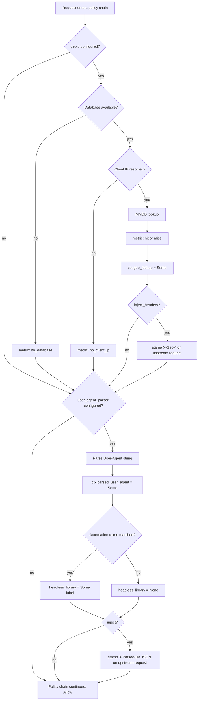

# Request enrichment: geoip and user_agent_parser
*Last modified: 2026-08-22*

`geoip` and `user_agent_parser` are two policies that never deny a request. Each is a typed producer: it reads one thing off the inbound request (the client IP, the `User-Agent` header), turns it into structured data, and hands that data to two places:

- **Downstream hooks.** [`AnomalyDetectorHook`](architecture.md#signal-hooks-identity-classification-anomaly) and any `IdentityResolverHook` a plugin registers read `sbproxy_plugin::RequestContextView`, which now carries `geo_country`, `geo_asn`, and `ua_headless_library` alongside the existing JA4 fingerprint fields.
- **The upstream request**, optionally, as `X-Geo-*` headers or a JSON `X-Parsed-Ua` header, the same [`X-*` upstream-tag mechanism](exposed-credentials.md) `exposed_credentials` and forward-auth use.

Neither policy makes a decision. If you want to *act* on geography or device type, pair one of these with an `expression` policy or a plugin `AnomalyDetectorHook` that reads the fields they populate.

## Why two policies and not one

`geoip` and `user_agent_parser` answer unrelated questions (where is this request from; what client sent it) from unrelated inputs (an IP address; a header string), so they compile, configure, and fail independently. An origin that wants only device-type breakdown for its dashboards does not need to ship an MMDB file, and an origin that wants geo tagging without touching the `User-Agent` string does not pay for UA parsing on every request.

## Decision path



Both branches always end in `Allow`. `RequestContextView` and `RequestContext::trust_headers` are the only two output channels; there is no `Deny`.

## Config

```yaml
origins:
  "api.example.com":
    action:
      type: proxy
      url: https://test.sbproxy.dev

    policies:
      - type: geoip
        # Path to a MaxMind-compatible .mmdb file. Omit to use the
        # binary's embedded copy, which is a zero-byte placeholder in
        # this OSS build; without either, the policy still runs and
        # simply never populates geo_lookup.
        database_path: /opt/geoip/GeoLite2-City.mmdb
        # Stamp X-Geo-Country / X-Geo-Continent / X-Geo-City / X-Geo-Asn
        # on the upstream request when the lookup finds a record.
        # Default true.
        inject_headers: true

      - type: user_agent_parser
        # Header name for the serialized parse result. Default
        # "x-parsed-ua".
        inject_header: x-parsed-ua
        # Stamp inject_header on the upstream request. Default true;
        # set false to populate RequestContextView only.
        inject: true
```

## Output shape

`geoip` populates `RequestContext::geo_lookup: Option<GeoLookup>`:

| Field | Type | Notes |
|---|---|---|
| `country` | `Option<String>` | ISO 3166-1 alpha-2 |
| `continent` | `Option<String>` | e.g. `"EU"`, `"NA"` |
| `city` | `Option<String>` | English name |
| `asn` | `Option<u32>` | Autonomous system number |
| `as_org` | `Option<String>` | AS organization name |

`user_agent_parser` populates `RequestContext::parsed_user_agent: Option<ParsedUserAgent>`:

| Field | Type | Notes |
|---|---|---|
| `browser_name` / `browser_version` | `String` | Empty when undetected |
| `os_name` / `os_version` | `String` | Empty when undetected |
| `device_type` | `String` | `desktop`, `mobile`, `tablet`, `bot`, or `unknown` |
| `headless_library` | `Option<String>` | `headless_chrome`, `phantomjs`, `puppeteer`, `playwright`, or `selenium`, when the UA string self-identifies |

`headless_library` is independent of `device_type == "bot"`: a search-engine crawler is a bot but not a headless *browser*, so it leaves `headless_library` at `None`. It is also independent of the JA4-based `headless_signal` the TLS fingerprint detector sets: a request can trip either signal, both, or neither, and the two travel to `RequestContextView` under different field names (`ua_headless_library` vs. `headless_library`) so a consumer that reconciles them is not guessing which source said what.

## Calling it

The runnable configuration is [`examples/request-enrichment/`](../examples/request-enrichment/): the block above, with an inline `X-Real-IP` header exercising the GeoIP path even though this OSS build ships no MMDB by default.

```bash
make run CONFIG=examples/request-enrichment/sb.yml
```

**Scenario 1: an ordinary browser.** No headless signal, `device_type: desktop`:

```bash
curl -s -H 'Host: api.local' \
  -H 'User-Agent: Mozilla/5.0 (Windows NT 10.0; Win64; x64) Chrome/120.0.0.0' \
  http://127.0.0.1:8080/get | jq '.headers["x-parsed-ua"] | fromjson'
# {"browser_name":"Chrome","browser_version":"120.0.0.0","os_name":"Windows","os_version":"10","device_type":"desktop","headless_library":null}
```

**Scenario 2: a headless-automation client.** `headless_library` populates:

```bash
curl -s -H 'Host: api.local' \
  -H 'User-Agent: Mozilla/5.0 (X11; Linux x86_64) HeadlessChrome/120.0.6099.109 Safari/537.36' \
  http://127.0.0.1:8080/get | jq '.headers["x-parsed-ua"] | fromjson | .headless_library'
# "headless_chrome"
```

**Scenario 3: geo headers with no database.** Without an `.mmdb` file, `geoip` runs, records the `no_database` metric outcome, and adds no headers; the upstream still sees the request:

```bash
curl -s -o /dev/null -w '%{http_code}\n' -H 'Host: api.local' \
  -H 'X-Real-IP: 8.8.8.8' \
  http://127.0.0.1:8080/get
# 200
```

Point `database_path` at a real MaxMind GeoLite2 or IPinfo Lite `.mmdb` to see `x-geo-country` and the rest of the `X-Geo-*` set on the same request.

## Metrics and dashboards

| Metric | Type | Labels | Meaning |
|---|---|---|---|
| `sbproxy_geoip_lookup_total` | counter | `result` (`hit`, `miss`, `no_database`, `no_client_ip`) | Every `geoip` policy run |
| `sbproxy_user_agent_parse_total` | counter | `device_type` | Every `user_agent_parser` policy run |
| `sbproxy_user_agent_headless_total` | counter | `library` | Runs where a headless-automation token matched |

`dashboards/grafana/sbproxy-security.json` carries a "GeoIP Lookups" and a "User-Agent Headless Detections" panel over these three. Both policies also flow through the same `PolicyVerdictEvent` structured-log / decision-event path every built-in policy uses (`policy_type: "geoip"` / `"user_agent_parser"`, `decision: Allow` on every run), so a SIEM rule or the admin console's request log sees them without any bespoke wiring; see [events.md](events.md) and [decision-records.md](decision-records.md).

## Admin console

Both policies show up wherever any policy does: the origin's compiled policy list in the config viewer, and per-request rows in the admin request/decision log (`policy_type: "geoip"` / `"user_agent_parser"`). Neither policy adds a bespoke admin page: there is nothing to configure at runtime beyond the `sb.yml` block above, and the point of a typed producer is that its output belongs to whichever hook or dashboard reads `RequestContextView`, not to a page of its own.

## Not built here: the anomaly consumer

`ua_headless_library` and the JA4 `headless_library` are shaped so an `AnomalyDetectorHook` implementation can read both into one rolling per-`agent_class` histogram (the "request scoring" work). That consumer is a separate, not-yet-landed change; this page only documents the producer side. A plugin that wants the histogram today registers its own `AnomalyDetectorHook` and reads `ctx.geo_country`, `ctx.geo_asn`, and `ctx.ua_headless_library` off the `RequestContextView` it already receives.

## See also

- [policy.md](policy.md) - the full policy catalog.
- [headless-detection.md](headless-detection.md) - the JA4/TLS-fingerprint-based headless signal these policies complement.
- [architecture.md](architecture.md#signal-hooks-identity-classification-anomaly) - `IdentityResolverHook` / `AnomalyDetectorHook` / `RequestContextView`.
- [exposed-credentials.md](exposed-credentials.md) - the `trust_headers` upstream-tag mechanism `geoip` and `user_agent_parser` share.
- [observability.md](observability.md) - metrics and dashboards in general.
