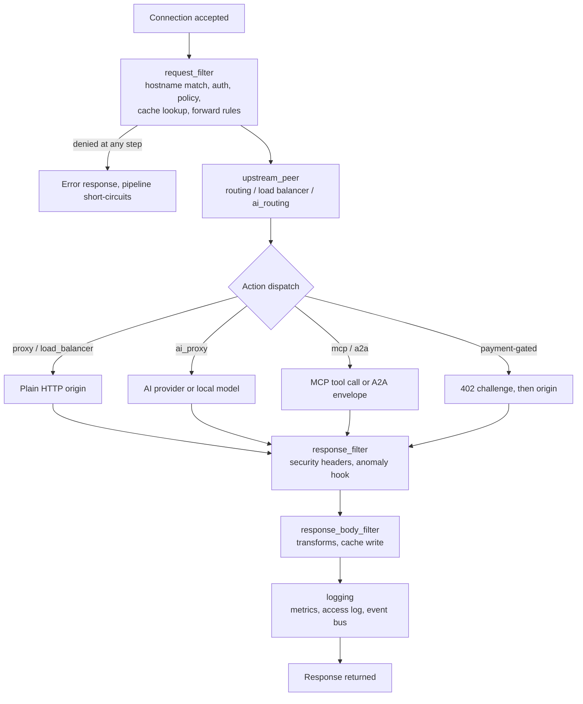

# Request flow

*Last modified: 2026-08-16*

Every request SBproxy accepts runs through one pipeline, implemented as a
sequence of Pingora `ProxyHttp` callbacks: `request_filter`,
`upstream_peer`, `upstream_request_filter`, `response_filter`,
`response_body_filter`, and `logging`, in that order. A rejection at any
stage short-circuits the rest and writes the error response immediately.
Each stage below names the config and category docs that cover it in
depth, and calls out every point where custom logic (a hook, an
extension bundle, a script, a plugin trait) can attach.
For the authoritative stage list this page is derived from, see
[architecture.md's request pipeline section](architecture.md#3-request-pipeline);
for field-by-field config, see [configuration.md](configuration.md).

If you want the "what exists" view instead of the "what happens, in
order" view, start at [core-concepts.md](core-concepts.md) or
[docs/README.md](README.md) instead.

## The pipeline at a glance



The diagram above is the shape; the listing below is the detail, with
every hook attachment point named against its exact step number.

```
request_filter
  1.  Trace context extract (W3C / B3)
  2.  ACME HTTP-01 challenge interception
  3.  /health and /metrics short-circuit
  4.  Hostname extraction and origin resolution
  5.  Force-SSL redirect
  6.  Allowed methods check
  7.  CORS preflight handling
  8.  Bot detection                        <- identity hooks attach here
  9.  Threat protection (JSON body checks)
  10. Authentication                       <- auth hook attaches here
  11. Policy enforcement                   <- policy + CEL/Rego hooks attach here
  12. Response cache lookup
  13. on_request callbacks                 <- webhook callback attaches here
  14. Forward rule matching
  15. Action dispatch                      <- branches by traffic type below

upstream_peer                              <- RoutingStrategy / ai_routing hook attaches here
upstream_request_filter                    <- request rewrite

[ the origin call: proxy / ai_proxy / MCP / A2A / payment-gated ]

response_filter                            <- AnomalyDetectorHook runs here, on_response callback attaches here
response_body_filter                       <- transform pipeline attaches here, response cache write
logging                                    <- metrics, access log, typed event bus
```

## 1. Connection, trace context, and origin match (steps 1-4)

A client connects and sends a request with a `Host` header. SBproxy
extracts W3C/B3 trace context (see [observability.md](observability.md)
for how that becomes a span), handles ACME HTTP-01 challenges and the
built-in `/health` and `/metrics` short-circuits, then resolves the
hostname against `origins:` using a bloom filter plus hash map lookup.
This is the stage [routing.md](routing.md) covers for how an origin is
matched and [api-gateway.md](api-gateway.md) covers for the traditional
reverse-proxy framing of the same step.

## 2. Pre-request checks and identity (steps 5-9)

Force-SSL redirect, an allowed-methods check, and CORS preflight handling
run first. Then bot detection runs, and this is where the agent-identity
resolver chain attaches: Web Bot Auth verification (resolver step 1), then
the **`IdentityResolverHook`** trait ("KYA step 1.5", `sbproxy-plugin`'s
`identity.rs`) sits between that and forward-confirmed reverse DNS
(resolver step 2). Registered hooks run in registration order; the first
to return a verdict wins, and returning `None` falls through to the next
resolver step. OSS builds register none; a plugin installs one via
`sbproxy_plugin::register_identity_hook`. See [plugins.md](plugins.md)
for the extension surfaces and [mcp-and-agents.md](mcp-and-agents.md) for
how the resolved `agent_id`/`agent_class` gets used downstream.

The `MlClassifierHook` trait exists in the same `sbproxy-plugin` crate and
is registrable via `register_ml_classifier_hook`, but as of this writing
has no call site anywhere in the OSS pipeline (`ml_classifier_hooks()` is
referenced only in its own definition and in tests) - it is a defined
extension point, not one that currently fires in a request. Do not
depend on it running until an embedder wires it in.

Threat protection (JSON body checks) closes out this group. See
[security.md](security.md) and [api-security.md](api-security.md).

## 3. Authentication (step 10)

Built-in providers (API key, JWT, basic, bearer, digest, forward-auth,
mTLS, OIDC, Web Bot Auth, `cap`) run here; see
[api-gateway.md](api-gateway.md) and [auth-oidc.md](auth-oidc.md). An
extension bundle can also supply an **`auth` hook**: it attaches through
the origin's `auth:` block, runs before the origin action, and always
fails closed (a hook that throws denies the request regardless of
`failure_posture`). A bundle auth hook is JavaScript-only in this
release; see [extension-bundles.md's Auth hooks section](extension-bundles.md)
and [plugins.md](plugins.md).

## 4. Policy enforcement (step 11)

Rate limiting, IP filtering, WAF, CSRF, DDoS protection, request
validation, object authorization, and every other policy run here,
including a CEL, Rego, or extension-bundle policy hook. See
[policy.md](policy.md) and [security.md](security.md) for the full
policy catalog, [ai-policy-cel.md](ai-policy-cel.md) for the unified CEL
plane, and [plugins.md](plugins.md) for authoring a custom policy hook.
A `policy_denied` event fires from here (see the typed event bus in
[step 9](#9-logging-and-the-typed-event-bus) below).

## 5. Cache lookup, request callbacks, and dispatch (steps 12-15)

The response cache is checked (see [cache-reserve.md](cache-reserve.md));
a hit can short-circuit everything that follows. `on_request` webhook
callbacks fire next - a config-level `callbacks:` mechanism (documented
inline in [configuration.md](configuration.md), `on_request:`/
`on_response:` fields) distinct from both the typed event bus
(`events.md`) and extension-bundle hooks. Forward rule matching runs,
then the action dispatches.

Action dispatch is where the traffic-type branch happens; see
[section 6](#6-upstream-selection-and-the-traffic-type-branch) below for
what differs by branch. Built-in action types are enum variants matched
here: `proxy`, `load_balancer`, `ai_proxy`, `static`, `mock`, `redirect`,
`echo`, `beacon`, `noop`, `websocket`, `grpc`, and more. A third-party
action plugin (`Plugin(Box<dyn ActionHandler>)`) pays one indirect call
here instead of hitting the branch-predicted match; see
[plugins.md](plugins.md).

## 6. Upstream selection and the traffic-type branch

For `proxy` and `load_balancer` actions, `upstream_peer` resolves the
concrete upstream. This is where the **`RoutingStrategy` trait**
attaches for a custom selection algorithm beyond the built-in strategies
(see [routing.md](routing.md) and [routing-strategies.md](routing-strategies.md)),
and where an **`ai_routing` hook** (an envelope-WASM-only extension
bundle hook, attached by name from an origin's `ai_routing_policy`)
picks the provider and model for an `ai_proxy` action on every request
through that origin - see [ai-gateway.md](ai-gateway.md) and
[extension-bundles.md's Routing hooks section](extension-bundles.md).
`upstream_request_filter` then applies URL rewrite, query injection,
method override, body replacement, request header modifiers, and
distributed-tracing headers.

The actual origin call branches by traffic type:

- **Plain HTTP (`proxy`, `load_balancer`)** - an ordinary reverse-proxy
  call. See [api-gateway.md](api-gateway.md) and [routing.md](routing.md).
- **AI (`ai_proxy`)** - a request to a hosted provider or local model.
  Guardrail mesh hooks (`ai_guardrail_input`, `ai_guardrail_output`) and,
  for streaming tool calls, an `ai_tool_call` hook can each return
  `release`, `flag`, `block`, or (where the manifest declares
  `execution.mutates: true`) `mutate` to rewrite the content in place
  before the next hook runs. See [ai-gateway.md](ai-gateway.md),
  [ai-guardrail-mesh.md](ai-guardrail-mesh.md), and
  [extension-bundles.md's AI stream hooks section](extension-bundles.md).
- **MCP / A2A** - a JSON-RPC tool call or an agent-to-agent envelope. See
  [mcp-and-agents.md](mcp-and-agents.md).
- **Payment-gated origin** - an HTTP 402 challenge/settlement round trip
  gates the call to the origin. See [payments.md](payments.md).

## 7. Response headers and callbacks (`response_filter`)

CORS response headers, HSTS, security headers (from `SecHeaders`
policies), response modifiers, forward-rule echo, rate-limit headers,
Alt-Svc, CSRF and session cookies, `on_response` callbacks, and
traceparent echo all run here. This is also where the
**`AnomalyDetectorHook`** trait dispatches, not at request time as
its name implies. It runs "now that all
signals have been populated" (TLS fingerprint, ML classification,
headless detection, request rate), against every registered hook, with
verdicts forwarded to whatever sink the hook implementation wires (audit
log, tracing, reputation updater); the OSS pipeline does not act on the
verdicts itself. OSS builds register none. See
[headless-detection.md](headless-detection.md) and
[plugins.md](plugins.md).

## 8. Transform pipeline and cache write (`response_body_filter`)

Transforms modify the response body before it reaches the client - they
are response-side only, run in the order declared under `transforms:`,
and this is their one attachment point in the pipeline. Four of the
twenty-six transform types are themselves a scripting hook
(`cel_script`, `lua_json`, `javascript`/`js_json`, `wasm`), so this stage
is both a fixed set of built-in reshaping operations and its own
extension point. See [transforms.md](transforms.md) for the full catalog
and [plugins.md](plugins.md) for the scripting/WASM surfaces. A response
cache write on miss and a fallback body swap also happen at this stage;
see [cache-reserve.md](cache-reserve.md) and [degradation.md](degradation.md).

## 9. Logging and the typed event bus

Metrics emission, the structured access log, and event publication close
out the pipeline. `ProxyEvent` has eleven variants, but the shipped OSS
binary emits only five from the request path -
`request_completed`, `request_error`, `auth_denied`, `policy_denied`,
and `config_reloaded` (the last from the admin plane, not this stage).
The other six (`request_started`, `cache_hit`, `cache_miss`,
`provider_selected`, `budget_exceeded`, `guardrail_triggered`) are enum
variants an embedder can publish; wiring a sink to one of those in the
OSS build gets you a sink that never fires. Cache and AI accounting
instead report through `sbproxy_cache_*`/`sbproxy_ai_*` metrics and the
[usage ledger](ai-usage-ledger.md). See [events.md](events.md) and
[observability.md](observability.md).

## Where to attach custom logic: a summary

| You want to... | Attach at | Mechanism | Depth |
|---|---|---|---|
| Resolve a custom agent identity | Bot detection (step 8) | `IdentityResolverHook` (Rust trait) | [plugins.md](plugins.md) |
| Authenticate with custom logic | Authentication (step 10) | Extension-bundle `auth` hook (JS only) | [extension-bundles.md](extension-bundles.md) |
| Add a custom policy | Policy enforcement (step 11) | CEL, Rego, or extension-bundle policy hook | [policy.md](policy.md), [plugins.md](plugins.md) |
| Fetch external data mid-request | `on_request`/`on_response` | Webhook callback | [configuration.md](configuration.md) |
| Pick a custom upstream | `upstream_peer` | `RoutingStrategy` trait | [routing-strategies.md](routing-strategies.md) |
| Pick an AI provider/model dynamically | `upstream_peer` (AI branch) | `ai_routing` hook (WASM only) | [extension-bundles.md](extension-bundles.md) |
| Inspect/mutate an AI guardrail or tool call | AI origin call | `ai_guardrail_*`/`ai_tool_call` hooks | [ai-guardrail-mesh.md](ai-guardrail-mesh.md) |
| Reshape a response | `response_body_filter` | A transform, or a scripting transform (CEL/Lua/JS/WASM) | [transforms.md](transforms.md) |
| Detect anomalous behavior after the fact | `response_filter` | `AnomalyDetectorHook` (Rust trait) | [plugins.md](plugins.md) |
| React to a lifecycle event | `logging` (mostly) | Typed event bus (5 of 11 variants emitted) | [events.md](events.md) |

## Who reads this page for what

A new user wants stage 1-5 to understand what a request touches before
it leaves the gateway. An advanced user wants the exact stage names and
ordering above to reason about interaction effects (for example, why a
cache hit at step 12 skips the action dispatch that would otherwise run
an AI guardrail). An SRE lead cares about stage 9 (what gets
logged and emitted) and the AnomalyDetectorHook's real placement in
`response_filter`. An AI user cares about the AI branch in
[section 6](#6-upstream-selection-and-the-traffic-type-branch). A
developer extending the gateway wants the summary table above as a map
of every attachment point before opening [plugins.md](plugins.md).
