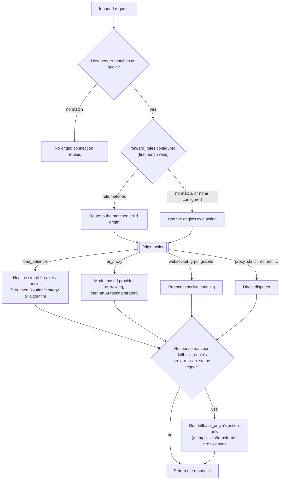
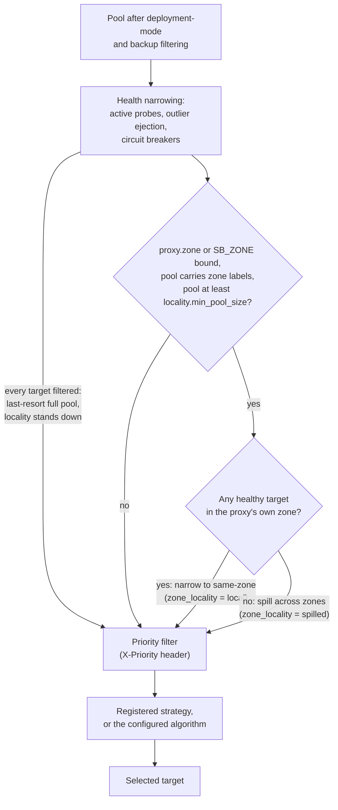

# Routing and traffic management
*Last modified: 2026-08-27*

How SBproxy decides which upstream serves a request: hostname matching, forward rules, load balancing, protocol-specific actions, failover, and the extension point for custom selection logic. This page is the hub; [configuration.md](configuration.md) is the field-by-field source of truth for every block below.


The sections below cover each stage in depth. The shape they compose into:



## How a request finds an origin

Each key under `origins:` is a hostname. SBproxy matches the inbound `Host` header (or `:authority` on HTTP/2+) against those keys and runs that origin's configuration.

- Exact match beats wildcard. Between wildcards, the longest matching suffix wins.
- A wildcard's `*` must be the complete first label (`*.example.com`, not `a*.example.com`).
- Matching is byte-for-byte on lowercase ASCII after the port is stripped; internationalized domains must be keyed in punycode.

Every origin has one required `action` (proxy, load balancer, static, redirect, websocket, grpc, graphql, storage, ai_proxy, mcp, and more) plus optional auth, policies, transforms, and forward rules that sit alongside it as siblings, not nested inside it. See [Origins](configuration.md#origins) and [Origin architecture](configuration.md#origin-architecture).

For the request lifecycle this fits into (auth, policies, transforms, action, response work), see [core-concepts.md](core-concepts.md) and [architecture.md](architecture.md#3-request-pipeline).

## Routing within an origin: forward rules

`forward_rules` route specific requests to a different inline child origin based on method, path, header, query, or JSON body, evaluated in order with first-match-wins. Common uses: path-based microservice routing, version routing, sending writes to a different backend than reads, and dispatching AI traffic by the request body's `model` field.

```yaml
origins:
  "api.example.com":
    action:
      type: proxy
      url: https://default-backend.internal:8080
    forward_rules:
      - rules:
          - path: { prefix: /api/v2/ }
        origin:
          id: v2-backend
          action: { type: proxy, url: https://v2-backend.internal:8080 }
```

Matchers: `path` (`prefix`, `exact`, `template` with named/catch-all/regex-constrained segments, or `regex`), `header`, `query`, `body` (an RFC 6901 JSON Pointer into the request body, e.g. `/model`), and `method`. Every matcher present in one entry is ANDed; multiple entries in a rule are ORed. A `when` CEL predicate runs last, after the structured matchers pass; see [scripting.md](scripting.md).

Body matching buffers up to `max_bytes` (default 65536, also the hard ceiling) and replays it unchanged upstream, so routing on the body never consumes it. A body larger than the limit, non-JSON, or a pointer that misses is a match miss, not a request failure. Full field tables and the buffering contract are in [Forward rules](configuration.md#forward-rules).

Runnable: [`examples/forward-rules/`](../examples/forward-rules/), [`examples/body-routing/`](../examples/body-routing/).

## Distributing traffic: the load balancer action

`type: load_balancer` spreads requests across weighted targets.

| Algorithm | Behavior |
|---|---|
| `round_robin` (default) | Cycle through active targets. |
| `weighted_random` | Probability proportional to weight. |
| `least_connections` | Fewest in-flight requests. |
| `ip_hash` / `uri_hash` / `header_hash` / `cookie_hash` | Sticky by client IP, path, a named header, or a named cookie. |
| `ring_hash` | Ketama-style consistent hashing; removing one of N targets remaps roughly 1/N of keys instead of reshuffling most of them. |

The `sticky:` block from older configs was removed (it never issued an affinity cookie); use `ring_hash` keyed on a cookie your application already sets instead.

**Health, failure, and resilience signals** apply per target and compose:

- **Active health checks**: background GET probes on an interval; targets failing `unhealthy_threshold` consecutive probes are excluded until `healthy_threshold` consecutive successes. See [Active health checks](configuration.md#active-health-checks); runnable at [`examples/active-health-checks/`](../examples/active-health-checks/).
- **Circuit breaker**: a Closed → Open → HalfOpen → Closed state machine per target; trips on `failure_threshold` consecutive failures, immediate isolation. See [Circuit breaker](configuration.md#circuit-breaker); runnable at [`examples/circuit-breaker/`](../examples/circuit-breaker/).
- **Outlier detection**: ejects a target whose error *rate* crosses `threshold` over a sliding `window_secs`, complementary to the breaker's consecutive-failure trigger. See [Outlier detection](configuration.md#outlier-detection); runnable at [`examples/outlier-detection/`](../examples/outlier-detection/).

When every target is filtered by these signals, the load balancer falls back to the unfiltered list rather than returning 502 to the client.

**Zone-aware routing:** when the proxy knows which zone it is in and targets carry `zone` labels, selection prefers same-zone targets and spills across zones only when no same-zone target is healthy. The proxy's own zone comes from `proxy.zone` in the config; when that is unset, the `SB_ZONE` environment variable fills in, which is the knob a Kubernetes deployment populates from the node's `topology.kubernetes.io/zone` label. Config wins over the environment, so a stray variable can never re-zone a proxy whose config already says where it is.

```yaml
proxy:
  zone: us-east-1a

origins:
  "api.example.com":
    action:
      type: load_balancer
      algorithm: round_robin
      targets:
        - url: https://replica-east.internal:8443
          zone: us-east-1a
        - url: https://replica-west.internal:8443
          zone: us-west-2a
```

Locality is a narrowing stage, not a ninth algorithm. It runs after the health signals above and before the priority filter, so it only ever sees targets that are already eligible, and it composes with every algorithm, registered strategy, and deployment mode rather than replacing them:



The behavior to rely on, in order of what breaks first:

- **Same-zone preference is absolute while the local zone is healthy.** Every request from a proxy in `us-east-1a` lands on a `us-east-1a` target, matching the pre-call region filtering LiteLLM documents and the `prefer_local` half of Envoy's zone-aware routing.
- **Failover is per-request, not per-config.** The moment the last same-zone target goes unhealthy, requests spill to the other zones; the moment one recovers, traffic snaps back. There is no mode switch to flip and no blackholing when the local zone is down.
- **A proxy with no zone identity selects exactly as before.** Zone labels without `proxy.zone` or `SB_ZONE` steer nothing (the proxy logs a warning at boot naming the missing knob), and an unlabeled pool ignores the proxy's zone. Single-zone configs are unaffected.
- **`locality.min_pool_size`** (default 2) deactivates the stage when the pool is smaller, the same guard as Envoy's `min_cluster_size`. The pool is counted before health filtering, as Envoy counts cluster hosts, so a health flap can never toggle the stage on and off. Raise it on large fleets where pinning a small local zone would concentrate too much traffic; the default only excludes single-target pools so that a two-target, two-zone config routes locally out of the box.

Every selection reports its verdict four ways. `sbproxy_lb_zone_locality_total{origin, verdict}` counts each shaped selection, so `rate(sbproxy_lb_zone_locality_total{verdict="spilled"}[5m]) > 0` is the alert expression for a spill in progress. The structured access log carries `zone_locality` per line and the admin request log carries the same field per row, both `local` or `spilled` and both absent when the stage did not engage, so an alert on the series joins to the exact requests that spilled. And `GET /api/health/targets` shows each target's zone beside the proxy's own, so an operator can see at a glance whether locality is active. Reach for the counter first: the admin ring is off by default and the matching `debug!` line is compiled out of a release build. See [access-log.md](access-log.md), [admin-api-reference.md](admin-api-reference.md), and [metrics-stability.md](metrics-stability.md). Runnable, with a forced local-zone-down drill: [`examples/multi-zone/`](../examples/multi-zone/).

**Deployment patterns:** blue-green (`deployment_mode: { mode: blue_green, active: green }`, targets tagged `group: blue`/`green`) and canary (`deployment_mode: { mode: canary, weight: 10 }`, a `group: canary` subset). See [Blue-green deployments](configuration.md#blue-green-deployments) and [Canary deployments](configuration.md#canary-deployments); runnable at [`examples/load-balancer/`](../examples/load-balancer/) and [`examples/load-balancer-deployment/`](../examples/load-balancer-deployment/).

**Service discovery:** `service_discovery: { enabled: true, refresh_secs: 30 }` on a `proxy` action re-resolves the hostname periodically and rotates across the current A/AAAA set, instead of pinning to whatever IP the first connection resolved. Runnable at [`examples/service-discovery/`](../examples/service-discovery/).

## Custom routing logic: the RoutingStrategy extension point

The eight built-in algorithms above are fallback selectors. Setting `strategy: <name>` on a `load_balancer` action runs a registered `RoutingStrategy` implementation first; it sees only the already health/circuit-breaker/outlier-filtered eligible targets and can return `None` to defer to `algorithm`.

Production strategies: `first-healthy`, `lora`, `lora-aware` (routes to a target advertising a warm `X-LoRA-Adapter`), `gpu-aware` (routes by configured `metadata.gpu_utilization`, never polled), and `bandit` (learns a latency-sensitive reward from real completed outcomes). None of them fabricate cost, token-price, or GPU telemetry that wasn't configured or observed.

Registering a new strategy is a Rust `inventory::submit!` call in an out-of-tree crate linked into the proxy binary; see [routing-strategies.md](routing-strategies.md) for the trait shape and a worked registration. Runnable, with a docker-compose harness that shows which target actually answered: [`examples/routing-strategies/`](../examples/routing-strategies/), [`examples/lora-aware-routing/`](../examples/lora-aware-routing/).

## Protocol-specific routing

Beyond plain HTTP `proxy`, dedicated actions route other transports through the same origin/policy/transform pipeline:

- **WebSocket** (`type: websocket`): proxies `ws://`/`wss://`. `max_message_size` closes the tunnel on an oversized message in either direction, and `subprotocols` allowlists `Sec-WebSocket-Protocol` negotiation; see [websocket.md](websocket.md) for what runs before and after the upgrade. Runnable at [`examples/websocket-proxy/`](../examples/websocket-proxy/).
- **gRPC** (`type: grpc`): proxies `grpc://`/`grpcs://`, with `grpc_web: true` letting browser gRPC-Web clients reach a native gRPC upstream, and optional REST-to-gRPC `transcode` bindings from an OpenAPI-style HTTP route to a unary gRPC call. Plain passthrough is byte-transparent and carries every RPC cardinality, unary through bidirectional streaming; the two translation modes are narrower, and one policy composition is a trap. See [gRPC limits](#grpc-limits) below. Runnable at [`examples/grpc-h2c/`](../examples/grpc-h2c/).
- **GraphQL** (`type: graphql`): transparent by default; setting `max_depth`, `allow_introspection: false`, or `validate_queries: true` turns on fail-closed parsing (syntax only, not schema-aware) ahead of the upstream, including a 64 KiB validated-body limit and whole-batch rejection. Runnable at [`examples/graphql-gateway/`](../examples/graphql-gateway/).

Field tables for each: [configuration.md#websocket](configuration.md#websocket), [configuration.md#grpc](configuration.md#grpc), [configuration.md#graphql](configuration.md#graphql). WebSocket and GraphQL also have their own dedicated pages, [websocket.md](websocket.md) and [graphql.md](graphql.md), covering upgrade semantics, validation placement, and honest limits in more depth than the field tables alone.

### gRPC limits

**Plain passthrough carries every cardinality.** The proxy forces HTTP/2 upstream and does not touch the length-prefixed frames, so unary, server-streaming, client-streaming, and bidirectional-streaming calls all pass through unchanged. Server reflection, which is itself a bidirectional-streaming RPC, works.

**gRPC-Web translation is unary and server-streaming only.** `grpc_web: true` buffers the whole gRPC-Web request before forwarding it, so a client-streaming or bidirectional call over gRPC-Web has no path through. Browser gRPC-Web clients cannot do client-streaming anyway, so this matches what the wire format offers.

**`transcode` routes are unary only.** A REST route binds to one gRPC method and one request message. A streaming method behind a transcode route returns only its first response frame.

**Neither translation mode carries gRPC message compression.** `transcode` decodes the response frame to build JSON and `grpc_web: true` re-frames it for a browser, and neither can read a compressed payload, so both advertise `grpc-accept-encoding: identity` on the request they send upstream. A compliant server answers uncompressed and nothing else is needed. A server that compresses anyway is caught by the frame's own compression flag, which is per message and authoritative: `transcode` refuses the frame and returns a JSON error naming compression rather than decoding the bytes as protobuf, and `grpc_web` keeps the upstream's `grpc-encoding` header on the response rather than stripping a description of bytes it forwards unchanged, so the browser client fails on a payload it cannot read instead of parsing compressed bytes as protobuf. Worth knowing about the refusal: it happens while the response body is being rewritten, after the status line has gone downstream, so a compressed frame on an otherwise successful RPC arrives as a 200 whose body is the error. Plain passthrough is unaffected, since it never looks inside a frame. There is no config to enable compression on the translated paths.

**A failed RPC reaches the REST client as an HTTP error only when the upstream answers trailers-only.** gRPC puts the outcome of a call in `grpc-status` and leaves the status line at 200, so the transcoder has to translate one into the other. When the upstream reports the failure in the response headers, which is what tonic and grpc-go do for a unary handler that returns an error, the proxy maps the code with the same `google.rpc.Code` table `grpc-gateway` uses and the client sees `NOT_FOUND` as 404, `PERMISSION_DENIED` as 403, `FAILED_PRECONDITION` as 400, and so on. When the upstream instead sends response headers first and reports the failure in real HTTP/2 trailers, which is the shape a server-streaming method takes when it fails partway through, the status line has already gone downstream by the time the trailers arrive: that response stays 200 and the failure appears only in the JSON error envelope in the body. Treat the body as authoritative if you need to handle both shapes with one client. The mapped status is what the access log, the `status` label on the request metrics, response-cache eligibility, the RFC 9209 `Proxy-Status` header, response `assert` policies, and `on_response` callbacks all see. One thing it deliberately does not reach is `fallback_origin.on_status`, which is not consulted at all on a `transcode` or `grpc_web` origin: both translated modes build the client-facing response body themselves, out of the buffered translated payload, and a fallback firing there would serve its own response and silently skip the translation the route exists to produce. `on_error` still works, since it fires before any upstream response exists. A `status` response modifier on the same origin still wins, since it is applied later.

**A path binding beats a query parameter of the same name.** A transcode route fills the request message from three places, in this order: the JSON body, then the path template's captures, then the query string. A query parameter naming a field a capture already bound is dropped, and so is one naming a parent or a child of that field, so `GET /v1/echo/allowed?message=forbidden` sends `allowed` upstream. The route matched on the path and the header-phase policies read the path, so a query parameter allowed to overwrite the resource name would hand the upstream a value nothing earlier in the request had looked at. Captured path segments are percent-decoded except for the RFC 3986 reserved characters, so `%2F` inside a single-segment capture stays encoded instead of becoming a separator the template never allowed. A request carrying more than 256 query parameters, or a dotted parameter name more than 32 levels deep, is refused.

**What a query parameter does depends on the kind of field it names.** Every parameter a binding does not shadow overlays the body, with three possible outcomes. It is **read** for a `string`, for the ten integer types and the two floating-point ones, for a `bool` spelled `1`, `t`, `T`, `TRUE`, `true`, `True`, `0`, `f`, `F`, `FALSE`, `false`, or `False`, and for an enum given either a declared value name or a number. It is **refused** with a 400 when the field can hold a value and the spelling will not read into it: `?count=abc` on an `int32`, `?dry_run=yes` on a `bool`, `?status=NOPE` on an enum. A dotted key routed through a scalar, such as `?message.deeper=x` where `message` is a `string`, is refused too, since no message anywhere could have that field. It is **ignored** when there is nothing to read: a name matching no field in the request message, a `message` or `bytes` field, and an empty value such as `?count=` or a bare `?count` against anything but a `string`. The refusal is the only one of the three that changed, because it is the only one that used to reach the upstream with the field silently at its default. Two limits worth knowing: a repeated field takes the value as a single element and repeating the key overwrites rather than appends, and neither `bytes` nor a nested message can be filled from the query at all, both of which differ from grpc-gateway.

**A body-reading policy turns off streaming for the whole origin.** `content_digest`, `request_validator`, `openapi_validation`, `body_threat_protection`, and body-aware `prompt_injection_v2` all need the complete request body, so the proxy holds every request chunk until the client half-closes. A unary call half-closes immediately and is unaffected. A streaming call does not: it waits for a response that cannot arrive until it stops sending, and the call stalls until the client's deadline expires. Nothing refuses this composition at config load today, and the symptom reads like an upstream fault. Attach body-reading policies to the HTTP origins that need them, not to a `grpc` origin that carries streaming methods.

**No HTTP/3.** gRPC requires HTTP/2 end to end. There is no HTTP/3 listener for the `grpc` action to answer on: the `http3` config block is recognized, but enabling it is refused at config compile, and no current build boots a listener.

## Routing AI traffic

`type: ai_proxy` origins pick a provider using a distinct set of strategies (`fallback_chain`, `weighted`, `cost_optimized`, `outcome_aware`, `race`, `cascade`, and more) that read AI-specific signals like realized cost-per-success and content-policy fallback, not the eight `load_balancer` algorithms above. This is a different routing surface with its own guardrail, budget, and resilience configuration; see [ai-gateway.md](ai-gateway.md#routing-strategies) for the full reference rather than duplicating it here.

When none of the built-in strategies fit, `ai_routing_policy` hands the
decision itself to a sandboxed CEL expression over the same `ai.*` signals;
see [ai-policy-cel.md](ai-policy-cel.md) and
[`examples/ai-routing-policy/`](../examples/ai-routing-policy/) for a
complete working config.

## Failing over: fallback origin

`fallback_origin` swaps in a backup action (static, redirect, mock, proxy, anything) when the primary errors (`on_error: true`) or returns a listed status (`on_status: [502, 503, 504]`). It runs only the fallback action, not the origin's own auth/policies/transforms; point it at another `proxy` origin if you need the full chain. See [Fallback origin](configuration.md#fallback-origin); runnable at [`examples/fallback-origin/`](../examples/fallback-origin/).

### What a fallback response carries

A fallback response is built from nothing rather than edited over the primary's, so no header the primary set can appear on it. That is the point, and it is also why the set of headers the gateway puts back has to be stated rather than assumed.

Recomputed from your own configuration and stamped on the fallback:

- CORS (`cors`) and HSTS (`hsts`). CORS is the one that reaches browsers: a fallback with no `Access-Control-Allow-Origin` fails a `fetch()` with an opaque network error instead of rendering the fallback body.
- `security_headers` policy headers, including a per-request CSP nonce, and the Page Shield CSP. A fallback carries no upstream CSP, so a policy set to defer to the upstream stamps its own.
- The CSRF cookie, when one was minted for this request.
- `X-Sbproxy-Debug-Request-Id` and `X-Sbproxy-Debug-Config-Rev` when the client asked with `x-sb-flags: debug`, and the correlation-id echo header, so a client still holds an identifier that finds the request in your logs.
- `traceparent` and `tracestate`.
- The RFC 9209 `Proxy-Status` header, carrying the status the *primary* answered with, on the `on_status` trigger only and only when the origin sets `proxy_status.enabled: true` and the primary's status is outside the 2xx range. It is the only place the primary's status reaches the *client* on a fallback, so an origin without `proxy_status` configured, or one listing a 2xx under `on_status`, ships a fallback that says nothing about what it replaced. The access log records it either way, as `upstream_status`.
- The `X-Sbproxy-Idempotency` and `X-Sbproxy-Retry-Skip-Reason` markers.

Not carried, deliberately:

- Every header the primary upstream set.
- `response_modifiers`. Their header `set`/`add`/`remove`, status override, body replacement, and Lua/JS scripts all describe the response the fallback replaced, so none of them run.
- The `Deprecation` / `Sunset` announcements, `Content-Signal` / `TDM-Reservation`, response compression, the `Content-Type` rewrite, and response caching. A fallback body is served as written.

Two framing rules worth knowing. A fallback with `status_code: 204` or `304` declares no `Content-Length` and delivers no body, whatever body you configured, because neither status may carry one. A fallback answering a `HEAD` declares the length its `GET` would return and delivers no bytes. In both cases the access log's and the meter's `bytes_out` count what actually went out, which is zero.

An `on_status` fallback is decided after any status retry. A status listed in both `retry` and `on_status` gets its upstream attempts first, and the fallback answers only if they all come back listed.

## Where an SRE lead goes next

Everything above that reacts to failure (health checks, circuit breaker, outlier detection, fallback origin) is the routing-layer half of resilience. For the operational half, deployment topology, alert-to-runbook mapping, and capacity math, see [degradation.md](degradation.md), [operator-runbook.md](operator-runbook.md), and [capacity-planning.md](capacity-planning.md).

## Examples

| Example | Covers |
|---|---|
| [`forward-rules`](../examples/forward-rules/) | Path/header/method-based forward rules |
| [`body-routing`](../examples/body-routing/) | Routing on a JSON request-body field |
| [`load-balancer`](../examples/load-balancer/) | Basic algorithm selection |
| [`load-balancer-deployment`](../examples/load-balancer-deployment/) | Blue-green and canary |
| [`active-health-checks`](../examples/active-health-checks/) | Active probes |
| [`multi-zone`](../examples/multi-zone/) | Zone-aware routing with cross-zone spillover |
| [`circuit-breaker`](../examples/circuit-breaker/) | Consecutive-failure isolation |
| [`outlier-detection`](../examples/outlier-detection/) | Error-rate ejection |
| [`service-discovery`](../examples/service-discovery/) | DNS re-resolution and IP rotation |
| [`routing-strategies`](../examples/routing-strategies/) | gpu-aware and lora-aware strategies side by side |
| [`lora-aware-routing`](../examples/lora-aware-routing/) | Adapter-aware target selection |
| [`fallback-origin`](../examples/fallback-origin/) | Degraded-backend failover |
| [`grpc-h2c`](../examples/grpc-h2c/) | gRPC over cleartext HTTP/2 |
| [`graphql-gateway`](../examples/graphql-gateway/) | Fail-closed GraphQL validation: depth, introspection, batches, and the 64 KiB body limit |
| [`websocket-proxy`](../examples/websocket-proxy/) | Upgrade handshake, an auth gate before it, and what post-upgrade traffic is not inspected |
| [`correlation-id`](../examples/correlation-id/) | Request-ID propagation across a routed hop |
| [`ai-routing-policy`](../examples/ai-routing-policy/) | Operator-authored CEL routing decision over AI-specific signals |
