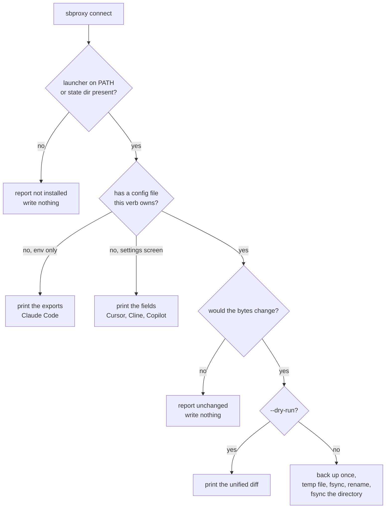

# Connect your coding agents to a governed gateway

*Last modified: 2026-08-21*

Four pages used to live here, one per editor, each ending in the same paragraph about budgets and ledgers. They went stale in the way hand-written setup instructions always go stale: Codex changed the value its `wire_api` key accepts and our page kept telling people to write the old one, which current Codex refuses to load at all.

So the instructions are a command now.

```bash
sbproxy connect --dry-run   # what would change
sbproxy connect             # change it
sbproxy disconnect          # put it back
```

`connect` looks for the coding agents installed on this machine, writes the config it can write, and prints the fields you have to type yourself for the ones that only have a settings screen. It never writes a config for an agent you do not have.

## What it does per agent

| Agent | How it is found | What `connect` does |
|---|---|---|
| Codex CLI | `codex` on `PATH`, or `$CODEX_HOME` / `~/.codex` exists | Writes `$CODEX_HOME/sbproxy.config.toml`, a profile of its own |
| Claude Code | `claude` on `PATH`, or `~/.claude` exists | Prints the `ANTHROPIC_BASE_URL` export |
| Cursor | `cursor` on `PATH`, or Cursor's application-support directory exists | Prints the two fields for Settings, Models |
| Cline | its VS Code extension directory exists | Prints the four fields for the OpenAI Compatible provider |
| GitHub Copilot | `copilot` on `PATH`, or its VS Code extension directory exists | Prints the BYOK fields and where the file behind them now lives |

Three findings, not two. An agent that is not installed, an agent whose launcher is not on this shell's `PATH` but whose state directory is there, and an agent that is installed and has never been configured are three different situations, and the output says which one you are in:

```console
codex  Codex CLI
    found: /opt/homebrew/bin/codex (on PATH)
    would write: ~/.codex/sbproxy.config.toml
    backup: none, this file did not exist yet
    run it as: codex --profile sbproxy
    credential: Codex reads $SBPROXY_API_KEY. This verb writes the variable's name, never its value.

cursor  Cursor
    found: ~/Library/Application Support/Cursor (state directory; no launcher on PATH)
    no file this verb will write; set these by hand:
    - Settings -> Models
    - Override OpenAI Base URL: http://127.0.0.1:8080/v1
    - OpenAI API Key: your sbproxy key

cline  Cline
    found: not installed
```

`--format json` emits the same rows as one object, for a setup script that wants to branch on `status`.

## What it will not do

It will not write your API key into another program's config file. Codex reads its key out of an environment variable named by `model_providers.<id>.env_key`, so the file this verb writes holds `env_key = "SBPROXY_API_KEY"` and the key itself stays in your environment. Claude Code reads `ANTHROPIC_AUTH_TOKEN` the same way. There is no `--key` flag, and that is a decision rather than an omission: with indirection available on both writable targets, a CLI that also accepted the secret would be offering a worse option for no reason.

That is also why a shared machine needs no special handling here. Nothing written is worth reading. If the destination file is group- or world-readable, `connect` says so and leaves the mode alone, because the permissions on your own file are your call. A file that was 0600 comes back 0600; the replacement inherits the original's mode rather than this process's umask.

It will not touch `~/.codex/config.toml`. Codex layers `$CODEX_HOME/<name>.config.toml` over your base config when it runs as `codex --profile <name>`, so `connect` creates a file nothing else owns and `disconnect` deletes it. Your own config keeps its project trust decisions, its marketplace registrations, and its plugin state, because nothing goes near them.

It will not write into `state.vscdb`. Cursor, Cline, and Copilot BYOK settings live in the VS Code and Electron SQLite settings store plus the OS secret service, owned by an editor that is usually running, with no schema contract. VS Code 1.109 did move Copilot's model providers out to a plain `chatLanguageModels.json` next to `settings.json` in the active profile directory, which makes that one scriptable in principle; it is still a per-profile path with a per-model schema, so this verb prints the fields and leaves the typing to you.

## The decision it makes per agent



The backup is written the first time a file changes and never again, so `~/.codex/sbproxy.config.toml.sbproxy.bak` always holds that file as it was before `connect` first touched it, no matter how many times you re-run. Before writing, `connect` re-reads the file and refuses if it changed since it built the diff, so the change you approved is the change that lands.

## The gateway side

`connect` only configures the client half. Here is the server half: one data-plane port, dynamic key management, a daily budget, and a signed usage ledger. Same shape as [use-case-own-openrouter.md](use-case-own-openrouter.md) and its runnable [`examples/use-case-own-openrouter/`](../examples/use-case-own-openrouter/).

```yaml
# yaml-language-server: $schema=https://raw.githubusercontent.com/soapbucket/sbproxy/main/schemas/sb-config.schema.json
proxy:
  http_bind_port: 8080

  admin:
    enabled: true
    port: 9090
    username: admin
    password: admin   # demo credentials; change both before any real use

  key_management:
    enabled: true
    store:
      backend: embedded
      path: /tmp/sbproxy-connect-keys.redb
    cache:
      ttl_secs: 60
    crypto:
      pepper: demo-pepper-not-for-production
      master_key: demo-master-not-for-production
    failure_posture: closed

origins:
  "localhost":
    action:
      type: ai_proxy
      providers:
        - name: openai
          api_key: ${OPENAI_API_KEY}
          default_model: gpt-4o-mini
          models:
            - gpt-4o-mini

      budget:
        on_exceed: block
        limits:
          - scope: api_key
            max_tokens: 200000
            period: daily

      usage_sinks:
        - type: ledger
          path: /tmp/sbproxy-connect-ledger.jsonl
```

Start it, then mint a key for each agent so the ledger can tell them apart:

```bash
export OPENAI_API_KEY=sk-...
sbproxy serve -f sb.yml

curl -s -u admin:admin -X POST http://127.0.0.1:9090/admin/keys \
    -H 'content-type: application/json' \
    -d '{"name":"codex-cli"}'
```

The response's `token` field is the plaintext credential, returned exactly once. Export it under the name the client reads.

## Per agent

### Codex CLI

`sbproxy connect codex` writes this, and prints the command that uses it:

```toml
# ~/.codex/sbproxy.config.toml
# Written by `sbproxy connect codex`.
#
# Codex layers this file over ~/.codex/config.toml when it runs as
# `codex --profile sbproxy`. Your own config.toml is not touched.
# Undo with `sbproxy disconnect codex`, or just delete this file.

model_provider = "sbproxy"

[model_providers.sbproxy]
name = "SBproxy"
base_url = "http://127.0.0.1:8080/v1"
env_key = "SBPROXY_API_KEY"
wire_api = "responses"
```

```bash
export SBPROXY_API_KEY=sbp_...
codex --profile sbproxy
```

Two things to know before you rely on this. `wire_api = "responses"` is not a preference; codex-cli 0.149.0 rejects a provider carrying `wire_api = "chat"` outright, telling you to set `"responses"` instead. And the gateway serves `/v1/responses` statelessly: a request carrying `previous_response_id`, `conversation`, or `store: true` names server-side state the gateway does not hold, and it comes back as a 400 naming the field rather than silently running without the turns it referenced. Whether a given Codex build sends those fields to a custom provider is the open question on this path, and the honest answer today is that it depends on the build. If you hit that 400, this is why.

If you want the profile applied without typing the flag, alias it:

```bash
alias codex='codex --profile sbproxy'
```

### Claude Code

One variable, printed by `sbproxy connect claude-code`:

```bash
export ANTHROPIC_BASE_URL=http://127.0.0.1:8080
export ANTHROPIC_AUTH_TOKEN=sbp_...
claude
```

Anthropic does not officially support pointing Claude Code at a non-Anthropic endpoint, so treat this as a worked example of the gateway's Anthropic-format bridge rather than a supported product configuration. If your Claude Code version defaults to a model name your gateway does not serve, set `ANTHROPIC_MODEL` and `ANTHROPIC_SMALL_FAST_MODEL` to an alias it does. [use-case-coding-assistant.md](use-case-coding-assistant.md) covers the local-GPU version of the same setup.

### Cursor

Settings (`Cmd+,` / `Ctrl+,`), then **Models**:

- **Override OpenAI Base URL**: `http://127.0.0.1:8080/v1` (Cursor appends `/chat/completions` itself, so stop at `/v1`)
- **OpenAI API Key**: your sbproxy key. The field says OpenAI; whatever you enter goes to the endpoint above.

Chat and agent mode follow this override. Tab autocomplete and inline edit keep using Cursor's own backend regardless.

### Cline

Set **API Provider** to **OpenAI Compatible**, then:

- **Base URL**: `http://127.0.0.1:8080/v1`
- **API Key**: your sbproxy key
- **Model ID**: `gpt-4o-mini`, or whatever alias your `sb.yml` names

### GitHub Copilot

Add a custom model provider from the Copilot Chat model picker (BYOK), with the same base URL, key, and model. BYOK usage bills against the provider behind the endpoint rather than your Copilot request quota, which is exactly what the budget and ledger in the config above exist to track instead.

The entry point moves between releases. On VS Code 1.109 and later the resulting configuration lands in `chatLanguageModels.json`, in the same profile directory as `settings.json`, if you would rather read or edit it directly than hunt for the screen.

## Undo

```bash
sbproxy disconnect codex
```

That removes `~/.codex/sbproxy.config.toml`. The `.sbproxy.bak` copy stays where it is, so if you had hand-edited the profile you can still get it back. Running `disconnect` twice is not an error; the second run reports the file is not there and writes nothing.

For Claude Code, unset `ANTHROPIC_BASE_URL` and remove it from your shell profile. For the three editors, clear the base URL you typed into their settings.

## Wire format

OpenAI chat completions (`POST /v1/chat/completions`) for Cursor, Cline, and Copilot; OpenAI Responses (`POST /v1/responses`) for Codex; Anthropic Messages (`POST /v1/messages`) for Claude Code. The `ai_proxy` action serves all three and can translate between them, so one origin covers every agent on the team.

## The payoff

Every request now carries a key the ledger can attribute, gets whatever guardrails you attached to the origin, and stops at `402` when the daily budget is spent rather than quietly running up a bill. `sbproxy ai ledger verify` proves the ledger file has not been edited after the fact. Point the same alias at a model on your own GPU and none of the client-side configuration changes.

## Next steps

- [use-case-own-openrouter.md](use-case-own-openrouter.md) - the full governed-gateway walkthrough: key lifecycle, budget behavior, and ledger verification with captured output
- [use-case-coding-assistant.md](use-case-coding-assistant.md) - point the same alias at a model running on your own GPU
- [key-management.md](key-management.md) - key lifecycle, rotation, and per-key policy
- [ai-gateway.md](ai-gateway.md) - the provider array, routing, guardrails, and budget reference
- [manual.md](manual.md) - the full CLI reference, including every `connect` flag
- [configuration.md](configuration.md) - the full configuration schema
