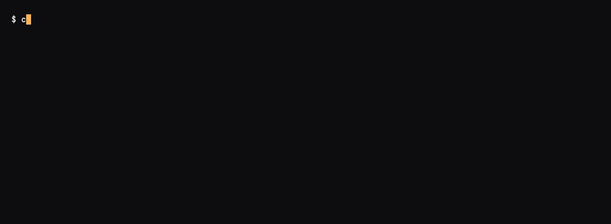

# Web Bot Auth
*Last modified: 2026-08-21*



Only requests signed by a key in the agent directory pass ([config](../examples/web-bot-auth/)).

The `bot_auth` provider verifies cryptographically-signed AI agents per the IETF "Web Bot Auth" pattern. AI crawlers sign each request with an Ed25519 key under [RFC 9421 HTTP Message Signatures](https://www.rfc-editor.org/rfc/rfc9421.html) and advertise their `keyid` in the `Signature-Input` header; the gateway looks up the matching public key in its directory and verifies the signature. Agents that pass come through; everything else gets `401`.

## Wire shape

```
GET /article HTTP/1.1
Host: blog.example.com
User-Agent: GPTBot/1.0
Signature-Input: sig1=("@method" "@target-uri" "@authority");created=1700000000;keyid="openai-2026-01";alg="ed25519"
Signature: sig1=:Tcle5Bn3...:
```

## Configuration

```yaml
authentication:
  type: bot_auth
  clock_skew_seconds: 30
  agents:
    - name: openai-gptbot
      key_id: openai-2026-01
      algorithm: ed25519
      public_key: ${OPENAI_BOT_PUBKEY}
      required_components:
        - "@method"
        - "@target-uri"
        - "@authority"
    - name: anthropic-claudebot
      key_id: anthropic-2026-01
      algorithm: ed25519
      public_key: ${ANTHROPIC_BOT_PUBKEY}
```

| Field | Type | Default | Description |
|-------|------|---------|-------------|
| `agents` | list | `[]` | Inline directory of known agents. Each `key_id` must be unique. May be empty when `directory:` is set; at least one of the two is required. |
| `clock_skew_seconds` | int | 30 | Freshness window for the `created` parameter, applied in both directions: a signature more than this many seconds old is refused as stale, and one that far in the future is refused as skewed. An `expires` the signer sends may shorten the window but never extend it. This window is the replay bound for a signature carrying no `nonce`. |
| `directory` | object | unset | Dynamic hosted-directory configuration: `url` (HTTPS only), `refresh_interval_secs` (default 24h, clamped to 5m-24h), `negative_cache_ttl_secs`, `stale_grace_secs`, plus self-signature verification on by default. When set, the provider resolves `Signature-Agent` headers by fetching the JWKS-shaped hosted directory. |
| `nonce_policy` | string | `strict` | Replay policy when the verifier observes a `nonce` parameter. `strict` fails a replayed nonce; `permissive` counts it in metrics but still verifies (shadow rollouts). Inert unless a nonce store is wired. |
| `agents[].name` | string | required | Human-readable agent name. Surfaced in logs. |
| `agents[].key_id` | string | required | `keyid` parameter the agent advertises in `Signature-Input`. |
| `agents[].algorithm` | string | required | `ed25519` or `hmac_sha256`. |
| `agents[].public_key` | string | required | Hex- or base64-encoded raw key bytes. |
| `agents[].required_components` | list | `["@method", "@target-uri"]` | Signature components every accepted request must cover. |

## Verdicts

The provider produces one of five verdicts; only the first allows the request:

| Verdict | Action | Cause |
|---------|--------|-------|
| `Verified` | Allow | Signature valid against an agent in the directory. |
| `Missing` | `401` | No `Signature-Input` header. |
| `UnknownAgent` | `401` | `keyid` claimed in `Signature-Input` is not in the directory. |
| `Failed` | `401` | Header parse failure, signature mismatch, expired, or required component missing. |
| `DirectoryUnavailable` | `401` | The dynamic directory could not be fetched or validated (HTTPS violation, allowlist mismatch, fetch deadline, invalid self-signature, stale grace exceeded). The underlying reason lands in the structured log, and each failed fetch increments `sbproxy_bot_auth_directory_fetch_failures_total{url}` for alerting. |

The denial body is a JSON object with a single `error` field carrying an intentionally generic message (`{"error":"bot_auth: signature required"}` / `{"error":"bot_auth: verification failed"}`); the `UnknownAgent` verdict is the exception and names the unrecognised `keyid`. Detailed reasons land in the structured log under the `sbproxy::auth` target so an operator can see exactly which check failed without leaking the same detail to a probing crawler.

## Calling it

The runnable configuration is
[`examples/web-bot-auth/`](../examples/web-bot-auth/), with three agents in an
inline directory and `required_components` on the first one set to
`@method`, `@target-uri`, and `@authority`. It also ships a signer at
`bin/sign-request.sh`.

The public keys in that config are hex placeholders, so out of the box no
signature can verify against them. Mint a real key and paste its public half
into the matching `public_key:` field first:

```bash
openssl genpkey -algorithm ed25519 -out openai-bot.pem
openssl pkey -in openai-bot.pem -pubout -outform DER | tail -c 32 | xxd -p -c 64
# ce5bce1af02c64075e1a43a51a8af21e88b06456cc4a1122d26b4c1166546414
```

Then start it:

```bash
sbproxy serve -f sb.yml
```

An unsigned request is refused before it reaches the origin:

```bash
curl -sS -i -H 'Host: blog.local' http://127.0.0.1:8080/article
```

```json
{"error":"bot_auth: signature required"}
```

That is a `401`, and the body is JSON rather than the bare string the verdict
table names. Sign the same request and it passes:

```bash
eval $(./bin/sign-request.sh \
        --key openai-bot.pem \
        --keyid openai-2026-01 \
        --method GET \
        --target-uri /article \
        --authority blog.local)

curl -sS -o /dev/null -w '%{http_code}\n' -H 'Host: blog.local' \
  -H "Signature-Input: $SIG_INPUT" \
  -H "Signature: $SIG" \
  http://127.0.0.1:8080/article
# 200
```

The `Signature-Input` the signer produced names exactly what was covered:

```
sig1=("@method" "@target-uri" "@authority");keyid="openai-2026-01";created=1785597678;alg="ed25519"
```

A `keyid` the directory does not know is refused before any cryptography runs,
and the body says so:

```json
{"error":"bot_auth: unknown agent keyid not-in-directory"}
```

That is the one denial that names its cause, because a directory miss is not a
signature failure and telling a legitimate operator their key is unregistered
costs nothing.

The two cases worth running yourself are the replays, because they are what
`required_components` buys. Take the signature that just succeeded and send it
at a different path, then at a different method:

```bash
curl -sS -H 'Host: blog.local' \
  -H "Signature-Input: $SIG_INPUT" -H "Signature: $SIG" \
  http://127.0.0.1:8080/other-article
# {"error":"bot_auth: verification failed"}

curl -sS -X POST -H 'Host: blog.local' \
  -H "Signature-Input: $SIG_INPUT" -H "Signature: $SIG" \
  http://127.0.0.1:8080/article
# {"error":"bot_auth: verification failed"}
```

Both are `401`. The signature is genuine and unmodified; it simply does not
cover the request being made, because `@target-uri` and `@method` are inside
the signature base. Drop those from `required_components` and a captured
signature becomes a bearer token for the whole origin.

Both replays report the same generic `verification failed`. A mismatch, a
`created` outside `clock_skew_seconds` in either direction, a malformed
header, and a missing required component are indistinguishable to the caller;
the specific reason goes to the structured log under the `sbproxy::auth`
target.

The `created` window is what stops a captured signature from being replayed
forever. `nonce` is optional in the Web Bot Auth profile and
`required_components` can require a component but never a parameter, so a
signature with no `nonce` and no `expires` has nothing else bounding it.
Thirty seconds is the default; raise it only as far as your signers' real
clock drift needs.

`@target-uri` is the absolute URI RFC 9421 §2.2.2 defines, scheme and
authority included (`https://blog.example/article`). Sign it with any
conformant RFC 9421 library and the proxy reconstructs the same string.
Earlier releases derived the path alone, and a signature in that older shape
is still accepted for a deprecation window. Every acceptance counts on
`sbproxy_signature_legacy_derivation_total{component}` and the proxy logs one
`warn` per process naming the verifier's key id, so you can tell whether any
signer still depends on the old shape before the fallback is removed.

## Agent-class resolver relationship

When `bot_auth` verifies a request, SBproxy carries the verified `keyid` on the unified principal as `attrs.metadata.bot_auth_keyid`. If the agent-class resolver is enabled and the active catalog has an entry whose `expected_keyids` contains that value, the request context is restamped with `agent_id_source = bot_auth` before upstream request headers and per-agent metrics are emitted.

That key ID verdict is the resolver's highest-confidence signal. It outranks reverse DNS and User-Agent matches, so a request with a valid WBA signature for `openai-2026-01` but a spoofed `User-Agent: SpoofBot/1.0` resolves to the catalog entry that owns `openai-2026-01`. Set `agent_classes.resolver.bot_auth_keyid_enabled: false` to disable this step and fall back to rDNS / UA matching.

On an origin protected by `authentication.type: bot_auth`, missing, unknown, malformed, or mismatched signatures return `401`; those requests do not reach anonymous agent-class classification. A signed request that covers `content-digest` can stamp the verified key ID during auth, but a later body digest mismatch still returns `401` before body bytes reach the upstream.

## Required components

By default a verifier accepts a signature that covers `("@method" "@target-uri")`. That alone prevents replay across different routes. Tighten this when the upstream relies on a specific header:

```yaml
required_components:
  - "@method"
  - "@target-uri"
  - "@authority"
  - "content-digest"   # bind the body
  - "x-replay-id"      # caller-supplied nonce
```

A signature that omits any required component fails verification. Components are matched by their RFC 9421 canonical name, lowercased.

## Pairing with AI Crawl Control

`bot_auth` and `ai_crawl_control` compose:

```yaml
origins:
  "blog.example.com":
    action: { type: proxy, url: https://upstream.example }
    authentication: { type: bot_auth, agents: [...] }
    policies:
      - type: ai_crawl_control
        price: 0.001
        valid_tokens: [...]
```

A signed crawler still pays per request unless its `Crawler-Payment` token redeems. An unsigned client never reaches the policy. This gives operators two independent gates: identity (bot_auth) and metering (ai_crawl_control).

## Publishing SBproxy's own directory

When SBproxy signs its own outbound requests (e.g. fanning out to AI APIs that demand Web Bot Auth), verifiers need to discover the key SBproxy signs with. Opt the origin into publishing its own JWKS-shaped directory + Signature Agent Card:

```yaml
origins:
  "agent.example.com":
    action:
      type: proxy
      url: https://upstream.example.com
    web_bot_auth_publish:
      enabled: true
      key_id: "sbproxy-key-2026-05-31"
      public_key_hex: "d75a980182b10ab7d54bfed3c964073a0ee172f3daa62325af021a68f707511a"
      agent_name: "SBproxy"
      directory_url: "https://agent.example.com/.well-known/http-message-signatures-directory"
      description: "Outbound AI gateway with Web Bot Auth signing."
      contact_url: "mailto:abuse@example.com"
```

This serves two unauthenticated GET endpoints on the origin:

* `/.well-known/http-message-signatures-directory` returns the JWKS document. Content-Type is `application/http-message-signatures-directory+json` per the Web Bot Auth IETF draft.
* `/.well-known/web-bot-auth/agent-card` returns the Signature Agent Card.

Only the public key lives in YAML. The matching private side belongs in a vault / HSM and is consumed by the `MessageSignatureSigner` primitive (`sbproxy-middleware::signatures`) when signing outbound requests. See `examples/web-bot-auth-publish/` for a runnable fixture with the expected curl output.

### Self-signing the published directory

The Web Bot Auth IETF draft permits unsigned directories (verifiers fall back to TLS as the trust anchor), but a verifier can pin a stronger claim if the directory response itself is signed by the key it advertises. Set the optional `signing_key_hex` field to the 32-byte Ed25519 seed whose public half is already in `public_key_hex`:

```yaml
web_bot_auth_publish:
  enabled: true
  key_id: "sbproxy-key-2026-05-31"
  public_key_hex: "d75a980182b10ab7d54bfed3c964073a0ee172f3daa62325af021a68f707511a"
  agent_name: "SBproxy"
  directory_url: "https://agent.example.com/.well-known/http-message-signatures-directory"
  # Optional. Hex-encoded 32-byte Ed25519 seed; secret references work.
  signing_key_hex: "9d61b19deffd5a60ba844af492ec2cc44449c5697b326919703bac031cae7f60"
```

When set, both response bodies gain `Content-Digest`, `Signature-Input`, and `Signature` headers per RFC 9421 over `("content-digest")` with `tag="web-bot-auth"`. A verifier that already trusts the published JWK can confirm the body it fetched was emitted by the holder of the advertised key, closing the trust loop without relying on TLS alone. With `signing_key_hex` omitted the endpoints still serve, just without the three signature headers; that lets a verifier that wants to enforce signed directories detect the absence cleanly.

## Content-Digest body binding

When a signed POST covers `content-digest`, the synchronous auth phase verifies the signature header but the request body is not yet buffered. The proxy defers a body-vs-`Content-Digest` check to `request_body_filter`: the body is buffered as `validate_request_body` already does for other policies, `SHA-256(body)` is computed, and the digest is compared against the `Content-Digest` (or fallback `Repr-Digest`) header value the signature attests to. A mismatch is treated as an authentication failure, surfaces as 401, and the body bytes never reach the upstream.

The deferred check fires only when `Signature-Input` actually covers `content-digest`, so a plain `bot_auth` request on header-only signed traffic pays no buffering cost. The flag also stamps `ctx.content_digest_verified` on success so the same audit signal is used as the `content_digest` policy emits.

## Limitations

- HTTP/3 / QUIC is currently disabled entirely (no QUIC listener is started) pending native HTTP/3 support in Pingora, so there is no H3 path for `bot_auth` to handle today.

## See also

- [headless-detection.md](headless-detection.md) - the heuristic complement: scoring how much an unsigned request's shape looks like automation, for agents that never present a Web Bot Auth signature.
- [configuration.md](configuration.md#authentication) - schema reference (`bot_auth` provider).
- [RFC 9421](https://www.rfc-editor.org/rfc/rfc9421.html) - the underlying signature standard.
- `crates/sbproxy-modules/src/auth/bot_auth.rs` - source.
- `crates/sbproxy-modules/src/auth/bot_auth_publish.rs` - the publish-side composer.
- `examples/web-bot-auth/sb.yml` - inbound verify, runnable example.
- `examples/web-bot-auth-publish/sb.yml` - outbound publish, runnable example.
