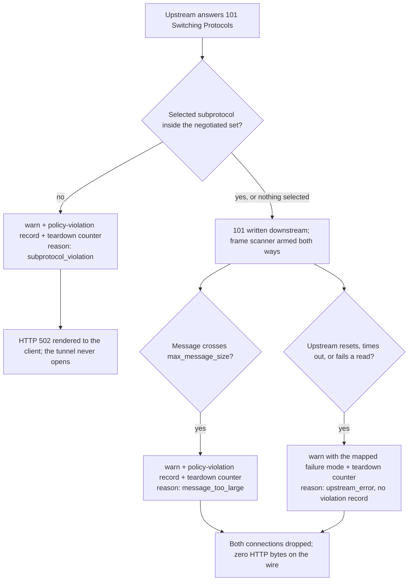

# websocket action
*Last modified: 2026-08-20*

The `websocket` action proxies `ws://`/`wss://` upstreams. The inbound HTTP `Upgrade` request runs through the same origin pipeline as any other action, host routing, `authentication`, `policies`, request transforms, and once the upstream answers `101 Switching Protocols` the connection becomes a byte pipe in both directions. The gateway does not read frame payloads, but it does parse frame headers on that pipe to enforce `max_message_size`, and it holds `Sec-WebSocket-Protocol` negotiation to the configured `subprotocols` allowlist. This page covers the action's config keys, what runs before the upgrade completes, and what does and does not happen after it. For where `websocket` sits among the other protocol-specific actions, see [routing.md](routing.md#protocol-specific-routing); for the field table in the general configuration reference, see [configuration.md#websocket](configuration.md#websocket).

## Config

```yaml
origins:
  "ws.example.com":
    action:
      type: websocket
      url: wss://ws-backend.internal:8080
      subprotocols: [graphql-ws, graphql-transport-ws]
      max_message_size: 5242880
```

| Field | Type | Default | Description |
|---|---|---|---|
| `url` | string | required | Backend WebSocket URL (`ws://` or `wss://`). |
| `subprotocols` | list of string | `[]` | Allowlist for `Sec-WebSocket-Protocol` negotiation. Empty (the default) leaves negotiation entirely to the client and upstream. See [Subprotocol negotiation](#subprotocol-negotiation). |
| `max_message_size` | int | `10485760` (10 MB) | Maximum message payload size in bytes, enforced in both directions on the upgraded tunnel. A message that declares more payload than this closes the connection. See [Message size enforcement](#message-size-enforcement). |
| `host_override` | string | upstream URL's host | `Host` header sent on the upgrade request. Set this when the upstream is vhost-based and expects a different value than the URL's own hostname. |

`host_override` and the standard forwarding-header opt-outs (`disable_forwarded_for_header`, and so on) work the same way here as on every other URL-bearing action: `proxy`, `load_balancer` targets, `grpc`, `graphql`, and `a2a` all accept the same fields with the same meaning.

## Upgrade semantics

Requests to a `websocket` origin are not required to carry `Upgrade: websocket`. The action is a routing choice, "proxy this Host to a `ws://`/`wss://` target", not a protocol gate. A plain HTTP request to the same origin is proxied unchanged to the same upstream address; whatever that upstream does with a non-upgrade request (typically its own `400`, since a real WebSocket server usually only implements the handshake) is what the client sees. sbproxy does not reject a non-upgrade request on the client's behalf or otherwise treat it specially before handing it to the upstream connection; the subprotocol allowlist below applies only to requests that do ask for an upgrade.

When the client does send a proper upgrade request and the upstream answers `101 Switching Protocols`, Pingora forwards bytes in both directions for the lifetime of the connection, with one gateway-side reader on the pipe: a frame-header scanner enforcing `max_message_size` (described below). sbproxy is not a party to the WebSocket handshake computation (`Sec-WebSocket-Accept` derived from `Sec-WebSocket-Key`); that is entirely the upstream's responsibility, forwarded through unchanged.

## What runs before the upgrade

Everything that would run for a `proxy` action against the same origin runs here too, against the initial `GET` request and its headers:

- Host-based origin routing
- `authentication` (bearer, API key, JWT, basic, mTLS, OIDC, forward auth, whatever the origin configures)
- `policies` (rate limiting, WAF, CEL, and the rest)
- Request transforms and forward rules

These are the same pipeline stages every origin runs, applied here to a request that happens to be asking for an upgrade. A request that fails one of them (missing auth token, rate limit exceeded, WAF match) never reaches the point where the gateway would attempt the upgrade. A runnable demonstration of an auth gate rejecting the upgrade, and passing it once a valid token is presented, is in [`examples/websocket-proxy/`](../examples/websocket-proxy/).

## Message size enforcement

`max_message_size` bounds the payload of a single WebSocket message, in both directions, on every upgraded connection through this action. The gateway parses frame headers on the tunnel (it never buffers or reads payload bytes) and sums the declared payload lengths of a fragmented message across its continuation frames. The moment a message's total crosses the cap, before the payload has even finished arriving, the gateway logs the violation and closes the connection.

Points worth knowing before relying on it:

- **The teardown is abrupt.** There is no `1009 Message Too Big` close handshake; the gateway will not forward a message it has refused, so both TCP connections are dropped. Clients see the socket die mid-message. Each teardown increments `sbproxy_websocket_teardowns_total` and writes a policy-violation audit record; see [Enforcement telemetry](#enforcement-telemetry).
- **The cap measures wire bytes.** If the client and upstream negotiate `permessage-deflate`, payload lengths on the wire are compressed sizes, and the cap applies to those.
- **Control frames do not count.** Pings, pongs, and closes interleave freely without affecting the running message total (RFC 6455 caps them at 125 bytes on its own).
- **The default is enforced too.** An action that never mentions `max_message_size` gets the documented 10 MB ceiling.

## Subprotocol negotiation

An empty `subprotocols` list (the default) means the gateway stays out of negotiation entirely: whatever `Sec-WebSocket-Protocol` the client and upstream agree on passes through untouched.

A non-empty list is an allowlist, enforced at three points:

1. **The offer is filtered.** The client's `Sec-WebSocket-Protocol` offer is intersected with the configured list, preserving the client's preference order, before the upgrade request goes upstream. The upstream never sees a subprotocol the origin does not allow.
2. **An unservable offer is refused.** A client whose offer contains none of the configured subprotocols gets a `400` before any upstream connection is attempted. A client that offers nothing at all still passes; the allowlist constrains what gets negotiated, it does not require negotiation.
3. **The upstream's selection is checked.** The subprotocol named on the upstream's `101` must be a single token that the client offered and the list allows. Anything else refuses the upgrade with a `502`, since a selection outside the offer is the upstream violating RFC 6455 negotiation. The refusal also increments the teardown counter and writes an audit record naming the offered and selected token lists (see [Enforcement telemetry](#enforcement-telemetry)).

The gateway never adds subprotocols the client did not offer, and it does not require the upstream to select one.

## Mid-tunnel errors never write HTTP bytes

Where an error happens decides what the client receives. Before the upstream answers `101`, the client is still speaking HTTP: a connect failure, a timeout, or the subprotocol refusal above renders an ordinary HTTP error response with a status and a body. After the `101`, the downstream connection speaks WebSocket frames, and an HTTP error body written into it would arrive as garbage bytes spliced into the frame stream. So for any post-upgrade failure (upstream reset, timeout, read error, or the gateway's own `max_message_size` teardown) the gateway closes both connections and writes nothing. The real failure mode still lands in the proxy log, classified the same way the `Proxy-Status` machinery classifies upstream errors, and on the teardown counter below.

This applies to both surfaces that upgrade. A `websocket` action is one; the AI gateway's realtime tunnel (`type: ai_proxy` reaching `/v1/realtime`) is the other, and a provider that resets mid-session tears down the same way rather than splicing a `502` into the client's audio frames. What decides it is the `101` reaching the downstream wire, not which action opened the tunnel: a realtime request the provider refused with a `401` never upgraded, so it still renders an ordinary HTTP error the client can read.

An upstream that closes *cleanly* is not one of these. A FIN after the last frame is an ordinary end of stream, not a failure: the tunnel ends, nothing is logged as an error, and nothing lands on the teardown counter. The counter's `upstream_error` reason means the transport broke, which is the event worth alerting on.

## Enforcement telemetry

Every refusal and teardown on this page is operator-visible beyond the warn line:

- `sbproxy_websocket_teardowns_total{reason, direction, tenant, origin}` counts every tunnel the gateway tore down and every upgrade it refused on the upstream's `101`, on both upgrade surfaces: the `websocket` action and the AI gateway's realtime tunnel. `reason` is a closed set of three: `message_too_large`, `subprotocol_violation`, and `upstream_error`. `direction` is `client_to_upstream` or `upstream_to_client` for the size cap and `none` for the other two reasons. The pre-connect `400` for an unservable client offer (point 2 above) is not on this counter: it is an ordinary HTTP refusal of a client that asked for something the origin does not speak, made before any enforcement engages, and it is visible the way any 4xx is.
- A **policy-violation audit record** goes to the `security_audit` channel for the two violation reasons, the same record shape and the same channel every other refusal in the gateway uses. That one record reaches four places: the `security_audit` log target, the admin console's audit sample, the hash-chained tamper-evident file under `audit.sink: chain`, and, bridged, the `events:` sink as a `policy_denied` event ([events.md](events.md#how-the-four-audit-channels-relate-to-the-event-stream)). Its `event_type` is `websocket_message_too_large` or `websocket_subprotocol_violation`, which is the field to route a SIEM rule on; `reason` names the direction and the `observed` and `limit` byte counts for the size cap, or the offered and selected subprotocol token lists (capped at eight tokens of at most 64 characters each, sanitized to the RFC 7230 token grammar) for a negotiation refusal. Frame content is never captured. `status_code` is `502` for a subprotocol refusal and `0` for a size teardown, because a torn-down tunnel receives no HTTP status and the record does not invent one.
- An `upstream_error` teardown gets the counter and nothing else. It is a transport failure, not an enforcement verdict; it already reaches the SIEM as a `request_error`, and filing it beside the violations would poison any alert built on them.

The decision path, from the upstream's `101` to a closed tunnel:



Read the diagram left of the `101` write and right of it. Everything above node `E` still renders HTTP, because the client has not been handed a frame stream yet. Everything below it writes nothing at all.

## Honest limits

Beyond the message-size cap and the subprotocol allowlist, post-upgrade traffic gets no per-frame inspection: no PII redaction, no payload-shape validation, no per-message rate limiting, nothing that reads or acts on frame *content*. The `max_message_size` scanner reads frame headers only. If you need content-level control over what flows after the upgrade, that has to live in the WebSocket backend itself; the gateway's contribution stops at the pre-upgrade pipeline plus the two enforcement points described above.

## Runnable example

[`examples/websocket-proxy/`](../examples/websocket-proxy/) has the handshake demonstrated end to end (a stdlib Python WebSocket client, since curl cannot speak WebSocket framing after the `101`), the auth gate rejecting an unauthorized upgrade, the failure mode for a non-upgrade request landing on a `websocket` origin, and a live check that `max_message_size` closes the connection on an oversized message. Its README also walks the observation side: watching the teardown counter and the audit record while tripping the cap.

```bash
python3 examples/websocket-proxy/fixture.py &
sbproxy serve -f examples/websocket-proxy/sb.yml
python3 examples/websocket-proxy/client.py "hello through the gateway"
```

## See also

- [routing.md#protocol-specific-routing](routing.md#protocol-specific-routing) - `websocket` alongside `grpc` and `graphql`
- [configuration.md#websocket](configuration.md#websocket) - field table in the general configuration reference
- [events.md](events.md) - the audit channels these records travel on, and the `policy_denied` bridge onto the `events:` sink
- The action implementation at `crates/sbproxy-modules/src/action/websocket.rs`
