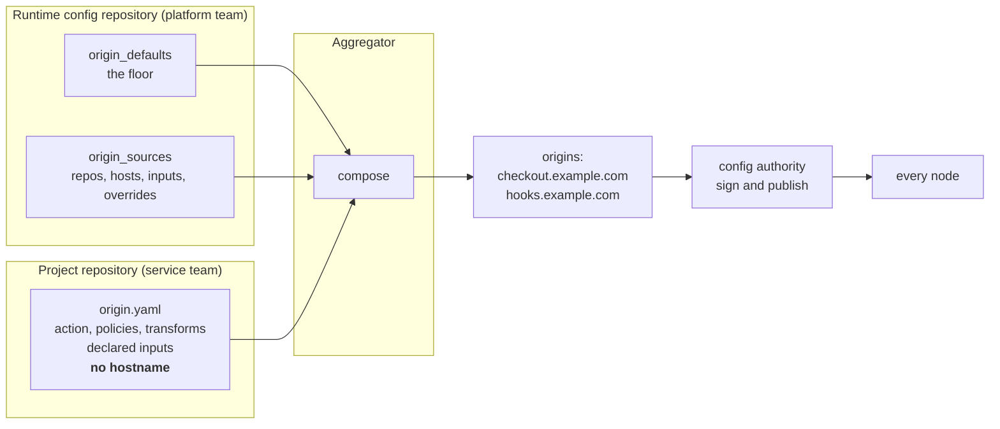

# Project-owned origin profiles

*Last modified: 2026-08-28*

A service team changes its own rate limit by merging in its own repository, with no pull request against the runtime config repository, and the platform team keeps a security floor no project can switch off. Neither side can author a whole origin alone.

This directory holds both halves:

| File | Owner | Role |
|---|---|---|
| `sb.yml` | platform team | the runtime config: `proxy:`, the floor under `origin_defaults`, and the `origin_sources` list |
| `origin.yaml` | service team | what the checkout repository commits at `sbproxy/origin.yaml` |

## Why this exists

`origins:` is a map keyed by hostname. A project repository that wants to ship its own action and its own policies has to author the map key, and the map key is the one thing it does not know: a hostname is an environment fact, and the same service answers on a different one in staging.

So a project commits a **hostless profile**. It declares what it does and what it needs from whoever deploys it. The runtime config supplies the hostname, the secret references, and the last word.



Composition runs in one aggregator, not on every node. A node keeps the subscriber it already has: it receives an ordinary signed bundle and never clones a project repository.

## The layers

Later layers win, and the runtime bookends the stack, so a project can be given room without being given the last word:

1. `origin_defaults` in the runtime config
2. `spec.<origin>.base` in the project profile
3. `spec.<origin>.environments.<env>` in the project profile, selected by the entry's `environment:`
4. `overrides:` on the source entry, in the runtime config

## Lists merge by name

`policies`, `transforms`, `request_modifiers` and `response_modifiers` merge entry by entry against a `name:` key. Every other list replaces wholesale, which is what the rest of the config merge already does, because element identity in a generic YAML list is not knowable.

| Situation | Result |
|---|---|
| name in the floor, absent from the project | the floor entry survives unchanged |
| name in both | field-level merge; the project wins per field |
| name only in the project | appended after the floor, in project order |
| name in the floor with `locked: true`, project touches it | refused, naming the policy, the profile and the entry |
| project adds an entry that would shadow a locked one | refused, naming the lock, the addition and the effect they share |
| project sets `disabled: true` on an unlocked floor entry | dropped, and the drop is recorded |
| unnamed entry in `origin_defaults` | refused at config load: a default has to be addressable to be overridable |
| unnamed entry in a project profile | always an addition, appended |

There is no delete verb, matching the rest of the merge contract. `disabled: true` leaves a record; an absence does not. `policies: []` in a project profile therefore leaves the floor intact, which is the scenario the whole floor concept exists to prevent.

A lock binds what an entry does, not what it is called. Refusing only a same-name override would leave the project one rename away from the thing the lock exists to stop, because every project addition lands after the floor and for anything last-write-wins the later entry simply wins. So a project layer is refused when it shares an effect with a locked entry (the `type:` for a policy or transform, the leaf paths written for a modifier), when it brings a script body into a modifier list that holds a lock, whether by adding an entry or by merging one onto an existing entry (a `lua_script` writes headers from inside a string the comparison cannot read), and when an override of an unlocked entry introduces an effect a lock above it already holds. All three bind the project; the entry's `overrides:` block is the runtime config speaking to itself and passes through a lock. See [configuration.md](../../docs/configuration.md#list-merge-by-name) for the exact rules and what each one cannot see.

`name`, `locked` and `disabled` are stripped before the composed origin is emitted, because the modules those lists feed reject unknown keys.

## What a project may set, and what it may not

`OriginProfileSpec` names exactly the fields a project may write. Everything else on an origin is unrepresentable in a profile, not merely rejected: there is no field that could hold it, so the parser refuses the document and names the key.

That is an allowlist rather than a deny list on purpose. An origin has 53 fields and gains more regularly, so a deny list would make every future field a silent privilege grant to every project repository. A test enumerates the origin's fields and fails when one appears that is on neither side, and the failure says to classify it.

A deny list written today would already have missed `filters[].failure_posture` (a project flipping a platform security filter to fail-open while the config still advertises protection), `force_ssl: false`, `response_cache` (an authenticated response cached and served to somebody else), the `on_request` and `on_response` extension hooks, and `allowed_methods` (an empty list allows every method).

## Secrets

A project declares that it needs one; the entry supplies the reference:

```yaml
# origin.yaml, in the project repository. The service declares what it
# needs and never a credential.
inputs:
  - name: upstream_host
    description: the regional upstream this deployment sends to
spec:
  api:
    base:
      action:
        type: proxy
        url: "https://{{vars.upstream_host}}"
```

```yaml
# sb.yml, in the runtime config repository. The credential lives here,
# in the layer that is applied last and that the project cannot reach.
origin_sources:
  entries:
    - name: checkout
      inputs:
        upstream_host: checkout-us-east-1.internal.example.com
      overrides:
        authentication:
          type: api_key
          header_name: X-Api-Key
          api_keys:
            - "${CHECKOUT_INBOUND_KEY}"
```

A profile is a confined document, so it cannot reach the composing host at all. `${VAR}` and `{{env.X}}` are refused, and so are `env:NAME`, `file:/path` and `vault://env/NAME`, along with every config key that names a host path the proxy opens. The one secret spelling that survives inside a profile is a provider URI such as `secret://prod/checkout-key`, which resolves against a backend declared under `proxy.secrets`, a block no project can write. Everything else belongs in `overrides:`, which is ordinary runtime YAML.

A profile carrying a secret written out in full is refused, and so is an entry that binds a raw token into a declared input, because the check runs after the input is substituted. Neither refusal echoes the value.

An input binds as text. A typed knob belongs in the entry's `overrides:` block too.

Note the direction of travel. An origin's `authentication:` block validates the callers of this service; it is not the credential the proxy presents to the upstream. The outbound credential is `credentials:` or `outbound_credential:`, both platform-owned and both unrepresentable in a profile.

## Pinning

The tier is a property of the runtime config document:

```yaml
origin_sources:
  tier: production
```

In the `production` tier every entry must pin a full commit sha or a tag spelled `refs/tags/v1.4.2`. A bare `v1.4.2` is refused, because git does not tell a tag from a branch by spelling and a rule that guessed would be a rule a branch could walk straight through.

The tier cannot come from the entry. An entry that wanted to track a branch would simply write `environment: dev`, and a self-declared constraint is not a constraint. The entry's `environment:` selects which profile layer applies, and nothing more.

## Two writers, one hostname

Two entries claiming the same map key is a named error, and so is an entry claiming a host that a hand-written `origins:` key already declares. Silent last-wins is the failure that check exists to prevent.

Wildcard overlap is not a collision. An exact key beats a wildcard and the longest matching suffix wins between wildcards, all of which routing already settles, so the only question asked here is whether two writers claim the same map key.

## What an operator sees

Both blocks are visible on the admin API with nothing fetched, because `origin_sources` names the hosts itself:

```bash
curl -su admin:"$ADMIN_PASSWORD" http://127.0.0.1:9090/admin/origin-composition
```

```json
{
  "declared": true,
  "tier": "production",
  "entries": [
    {
      "name": "checkout",
      "repo": "https://git.example.com/acme/checkout",
      "revision": "refs/tags/v1.4.2",
      "pinned": true,
      "verify_signature": true,
      "credential": "reference",
      "hosts": { "api": ["checkout.example.com"], "webhooks": ["hooks.example.com"] },
      "inputs": ["shop_origin", "upstream_host"]
    }
  ],
  "claimed_hosts": [
    { "host": "checkout.example.com", "entry": "checkout", "profile_origin": "api" }
  ],
  "collision": null
}
```

A repository URL is credential-stripped, an entry credential is reported as present or absent and never by value, and an input is reported by name only.

The metric `sbproxy_origin_source_entries{tier,pinned}` carries the same two facts for alerting. The total dropping to zero means a fleet that should be composing project profiles has quietly stopped. A non-zero `pinned="false"` series under `tier="production"` means a node is running a document that predates the pinning rule, since config load refuses that combination outright.

## Who can write what

`origin_defaults` is authority-writable: the platform raising a security floor across the fleet is exactly what that channel exists for.

`origin_sources` is not. It is on the subscriber's denied-path list alongside `source`, and for the same reason one level up: `source` names one repository, while this block names N of them, and the documents it pulls carry Lua, WASM and JavaScript bodies the config interpolator deliberately never reads. An authority able to write it would be arbitrary code fetch on every node that trusts it.

## Running the composition

```bash
# Publish through the config authority this document configures.
sbproxy aggregate -f examples/origin-profiles/sb.yml

# Compose to a file instead: the single-node path, and the CI review step.
sbproxy aggregate -f examples/origin-profiles/sb.yml --out composed.yml

# What would that file change? Writes nothing; exit 2 on changes.
sbproxy aggregate -f examples/origin-profiles/sb.yml --out composed.yml --dry-run

# Keep running: poll, coalesce a burst into one publish, publish on change.
sbproxy aggregate -f examples/origin-profiles/sb.yml --watch
```

A proxy that both declares these entries and publishes a config authority runs the same loop in process at boot. A node with entries and no authority logs that it is not composing rather than doing it quietly, because its answer is `--out` and that is an operator's decision.

The `aggregator:` block above writes out every shipped default, so the cost is visible rather than implied. `poll_interval_secs: 120` is one `git ls-remote` per unpinned entry every two minutes, which is 30 requests per hour per repository; the entry here is pinned to a tag, so each round compares a sha and clones only when it moved. The debounce and its ceiling are the pair that turns three teams merging inside one minute into one composed document and one fleet reload, without letting a continuously-changing entry defer a publish forever.

## Why is this policy here

```bash
sbproxy aggregate -f examples/origin-profiles/sb.yml --explain checkout.example.com
sbproxy plan -f examples/origin-profiles/sb.yml --explain-origin checkout.example.com
```

```
checkout.example.com
  action.url                                spec.base  entry checkout  https://git.example.com/acme/checkout@a1b2c3d4e5f6
  policies[platform_waf].action_on_match    origin_defaults
  policies[rate_limit].requests_per_minute  origin_sources.entries[].overrides  entry checkout
  dropped policies[legacy_cap]              spec.base dropped a default introduced by origin_defaults  entry checkout
```

One line per leaf, naming the layer that set it and, for the two layers the project authored, the repository and the resolved commit. The merged lists are keyed by `name:` rather than by index, because an index moves whenever an earlier entry is dropped. A field-level override reports per field, so the fields the project did not touch still name the floor. And nothing carries a value: a composed leaf can be a `secret://` reference an entry bound, so provenance says which layer and which repository, never what.

## Try it

```bash
sbproxy validate examples/origin-profiles/sb.yml
```

The validation is offline and answers from the document alone: entry names are unique, credentials are references rather than literals, every entry is pinned for the declared tier, every `origin_defaults` list entry is addressable, and no two entries claim the same hostname. Change `revision: refs/tags/v1.4.2` to `revision: main` and it refuses, naming the entry.

## See also

- [configuration.md](../../docs/configuration.md#project-owned-origin-profiles) for the full key reference
- [config-authority](../config-authority/) for how the composed result reaches the fleet
