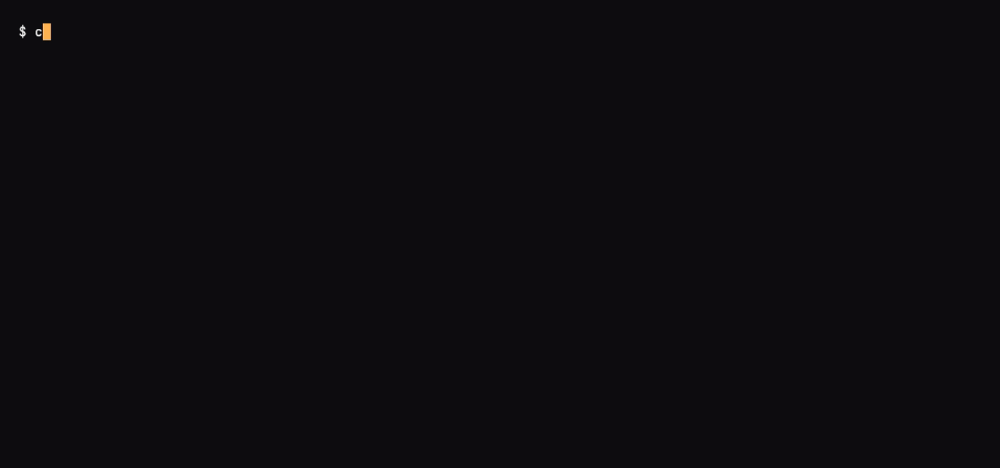

# Page Shield

*Last modified: 2026-08-16*



Client-side script monitoring via Content Security Policy report intake. The `page_shield` policy stamps a `Content-Security-Policy-Report-Only` (or enforcing) header on every response with the configured directives plus a `report-uri` pointing at the proxy's intake endpoint. Browsers POST violation reports to that endpoint and the proxy logs each report under the `sbproxy::page_shield` tracing target so logpush sinks (or the enterprise connection-monitor) can analyze them. `report-only` mode is the recommended starting point: browsers report violations but do not block them. Watch the event stream until the policy reflects reality, then flip `mode` to `enforce`.

**Known limitation (confirmed, not fixed here):** `page_shield`, along with the other response-phase-only policies (`security_headers`, `sri`, `assertion`), only injects its header from Pingora's upstream response filter. A `type: static` or `type: mock` origin action writes its response directly in the request phase and never reaches that filter, so pairing `page_shield` with a static or mock action compiles, logs `policy_verdict_event verdict=allow`, and silently never sends the header. This example's origin therefore proxies to a real host (`test.sbproxy.dev`) instead of serving a static body, purely so the header shows up; that's a workaround, not a fix. See `sb.yml` for the code pointers.

## Run

```bash
sbproxy serve -f sb.yml
```

The example proxies to `test.sbproxy.dev`, a small always-on demo host, so you can see the CSP header without standing up your own upstream (a `static`/`mock` origin does not currently carry the header at all; see the limitation above).

## Try it

```bash
# Confirm the CSP header is on every response.
curl -i -H 'Host: app.local' http://127.0.0.1:8080/
# content-security-policy-report-only: default-src 'self'; script-src 'self' https://cdn.example; img-src 'self' https: data:; connect-src 'self' https://api.example; object-src 'none'; report-uri /__sbproxy/csp-report
```

```bash
# Simulate a browser posting a violation report. The intake accepts
# both `application/csp-report` and the newer `application/reports+json`.
curl -i -X POST http://127.0.0.1:8080/__sbproxy/csp-report \
     -H 'content-type: application/csp-report' \
     -d '{"csp-report":{"document-uri":"http://app.local/","violated-directive":"script-src","blocked-uri":"https://evil.example/x.js"}}'
# HTTP/1.1 204 No Content
```

The structured report event appears in the output of the single foreground `sbproxy serve` process from the Run step, under the `sbproxy::page_shield` tracing target. To filter as it streams, start the Run step piped through grep instead:

```bash
sbproxy serve -f sb.yml 2>&1 | grep sbproxy::page_shield
```

There is no second proxy instance; the intake and the logs live in the one process.

## What this exercises

- `page_shield` policy with `mode: report-only`
- `directives` list rendered into the `Content-Security-Policy-Report-Only` header
- Built-in CSP intake at `/__sbproxy/csp-report` that accepts both `application/csp-report` and `application/reports+json`
- Structured violation logging under the `sbproxy::page_shield` tracing target

## See also

- [docs/features.md](../../docs/features.md)
- [docs/configuration.md](../../docs/configuration.md)
